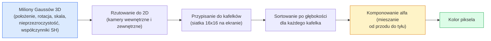

# Trójwymiarowe rozpryski gaussowskie (3D Gaussian Splatting) od podstaw

> Scena jest reprezentowana jako chmura milionów trójwymiarowych rozkładów Gaussa. Każdy z nich charakteryzuje się położeniem, orientacją, skalą, nieprzezroczystością oraz kolorem zależnym od kierunku obserwacji. Rasteryzacja tych elementów wraz z propagacją wsteczną (backpropagation) umożliwia efektywną rekonstrukcję 3D.

**Typ lekcji:** Teoria + Praktyka
**Język:** Python
**Wymagania wstępne:** Faza 4, Lekcja 13 (Wizja 3D i NeRF); Faza 1, Lekcja 12 (Operacje na tensorach); Faza 4, Lekcja 10 (podstawy modeli dyfuzyjnych - opcjonalnie)
**Czas wykonania:** ~90 minut

## Cele lekcji

- Zrozumiesz, dlaczego technologia 3D Gaussian Splatting (3DGS) zastąpiła modele NeRF jako wiodący produkcyjny standard fotorealistycznej rekonstrukcji 3D.
- Poznasz parametry definiujące pojedynczy rozkład Gaussa (położenie, kwaternion rotacji, skala, nieprzezroczystość, współczynniki harmonik sferycznych) oraz zapotrzebowanie pamięciowe każdego z nich.
- Zaimplementujesz od podstaw różniczkowalny rasteryzator 2D z użyciem mieszania kolorów (alpha-compositing) i dowiesz się, jak rzutować model 3D na płaszczyznę obrazu.
- Wykorzystasz narzędzia takie jak `nerfstudio`, `gsplat` lub `SuperSplat` do rekonstrukcji sceny na podstawie 20–50 fotografii oraz wyeksportujesz model do formatu glTF (z rozszerzeniem `KHR_gaussian_splatting`) lub OpenUSD.

## Opis problemu

Metoda NeRF (Neural Radiance Fields) zapisuje scenę w postaci wag sieci neuronowej MLP. Wyrenderowanie każdego piksela wymaga wykonania setek zapytań do MLP wzdłuż rzutowanego promienia świetlnego. Sprawia to, że uczenie trwa godzinami, renderowanie zajmuje sekundy, a sama scena jest nieedytowalna – przesunięcie choćby jednego obiektu (np. krzesła) wymaga ponownego przeszkolenia całej sieci.

Wszystkie te ograniczenia przezwyciężyła technologia 3D Gaussian Splatting (3DGS, Kerbl et al., SIGGRAPH 2023). W tej metodzie scena jest jawną (explicit) chmurą trójwymiarowych rozkładów Gaussa. Renderowanie opiera się na wydajnej rasteryzacji GPU, pozwalającej osiągnąć ponad 100 klatek na sekundę (FPS), a trening zajmuje zaledwie kilkanaście minut. Co więcej, edycja sceny jest banalnie prosta: wystarczy zaznaczyć i przesunąć odpowiednią grupę punktów Gaussa. Do 2026 roku Grupa Khronos ratyfikowała oficjalne rozszerzenie glTF dla 3DGS, OpenUSD wspiera schemat splattingu, platformy takie jak Zillow czy Apartments.com renderują w ten sposób wirtualne spacery po nieruchomościach, a większość nowych prac naukowych z zakresu grafiki 3D bazuje na rozszerzeniach idei 3DGS.

Koncepcja ta jest bardzo intuicyjna, jednak matematyka pod spodem zawiera wiele ruchomych elementów, przez co poradniki często pomijają rzutowanie geometryczne lub harmoniki sferyczne. W tej lekcji przejdziemy przez pełen proces – zaczynając od uproszczonej wersji 2D, a kończąc na pełnym trójwymiarowym modelu.

## Koncepcje teoretyczne

### Struktura pojedynczego punktu Gaussa

Pojedynczy trójwymiarowy rozkład Gaussa reprezentuje elipsoidalną plamę w przestrzeni zdefiniowaną przez zestaw parametrów:

```
Położenie        mu         (3,)    środek geometryczny w układzie globalnym
Rotacja          q          (4,)    kwaternion jednostkowy określający orientację
Skala            s          (3,)    skala logarytmiczna wzdłuż trzech osi
Przezroczystość  alpha      (1,)    nieprzezroczystość w przedziale [0, 1] (po sigmoidzie)
Współczynniki SH c_lm       (3 * (L+1)^2,)   kolor zależny od kąta obserwacji (harmoniki sferyczne)
```

Rotacja oraz skala definiują macierz kowariancji 3x3: `Sigma = R S S^T R^T`, która opisuje geometryczny kształt elipsoidy w 3D. Harmoniki sferyczne (Spherical Harmonics) pozwalają z kolei na zmianę koloru w zależności od kierunku, z którego patrzymy na obiekt. Pozwala to na odtworzenie efektów takich jak refleksy, połyski czy zmiany doświetlenia bez stosowania klasycznych tekstur. Przy stopniu SH równym 3, model wykorzystuje 16 współczynników na każdy kanał koloru (co daje 48 wartości float na jeden punkt Gaussa dla samego koloru).

Przeciętna scena składa się z 1 do 5 milionów takich punktów. Każdy z nich przechowuje około 60 wartości float (3 + 4 + 3 + 1 + 48 + parametry pomocnicze). Daje to łącznie około 240 MB danych dla sceny o rozmiarze 5 milionów punktów – to znacznie mniej niż klasyczne chmury punktów o wysokiej rozdzielczości z nałożonymi teksturami oraz o rzędy wielkości mniej niż zasoby pamięci potrzebne do dynamicznego renderowania obrazów wysokiej rozdzielczości z NeRF.

### Rasteryzacja zamiast śledzenia promieni (Ray Marching)



Wszystkie pięć kroków jest w pełni zoptymalizowanych pod kątem przetwarzania równoległego na kartach graficznych. Brak konieczności odpytywania sieci neuronowej dla każdego piksela sprawia, że pojedyncza karta GPU klasy RTX 3080 Ti potrafi renderować scenę składającą się z 6 milionów elipsoid z prędkością 147 FPS.

### Rzutowanie geometryczne (Projekcja)

Punkt Gaussa w 3D o położeniu globalnym `mu` i macierzy kowariancji `Sigma` rzutowany jest na płaszczyznę ekranu jako dwuwymiarowy rozkład Gaussa o środku `mu'` i kowariancji 2D `Sigma'` zgodnie ze wzorem:

```
mu' = project(mu)
Sigma' = J * W * Sigma * W^T * J^T          (2 x 2)

W = macierz widoku (translacja i rotacja kamery)
J = jakobian rzutu perspektywicznego wyznaczony w punkcie mu'
```

Zrzutowany na płaszczyznę ekranu punkt Gaussa 2D tworzy elipsę, której osie wyznaczają wektory własne macierzy kowariancji `Sigma'`. Każdy piksel znajdujący się w obszarze tej elipsy otrzymuje wkład kolorystyczny ważony funkcją odległości od środka: `exp(-0.5 * (p - mu')^T * Sigma'^-1 * (p - mu'))`.

### Mieszanie kolorów (Alpha-Compositing)

Dla każdego piksela nakładające się na niego rzuty Gaussa są sortowane według głębokości od przodu do tyłu. Wyjściowy kolor obliczany jest za pomocą klasycznego równania mieszania kolorów półprzezroczystych (używanego w grafice komputerowej od dekad):

```
C_pixel = sum_i alpha_i * T_i * c_i

T_i = prod_{j < i} (1 - alpha_j)       przenikalność (transmittance) światła do elementu i
alpha_i = opacity_i * exp(-0.5 * d^T * Sigma'^-1 * d)   lokalny wkład (stopień przezroczystości)
c_i = eval_SH(SH_i, view_direction)    kolor zależny od kierunku obserwacji
```

Jest to **dokładnie to samo sformułowanie matematyczne, które wykorzystuje renderowanie objętościowe w NeRF**. Różnica polega na tym, że obliczenia są przeprowadzane na jawnej, rzadkiej chmurze rozkładów Gaussa, zamiast gęstego próbkowania przestrzeni wzdłuż promienia. Dzięki temu jakość wizualna modeli 3DGS dorównuje NeRF, ponieważ oba podejścia opierają się na integracji tego samego równania pola promieniowania.

### Różniczkowalność potoku

Każdy krok przetwarzania – projekcja geometryczna, kafelkowanie, alpha-compositing oraz ewaluacja harmonik sferycznych – jest w pełni różniczkowalny względem parametrów punktów Gaussa. Porównując wyrenderowany kadr z obrazem rzeczywistym, możemy wyznaczyć wartość błędu (loss), a następnie za pomocą wstecznej propagacji zaktualizować cechy geometryczne i optyczne każdego z punktów `(mu, q, s, alpha, c_lm)` metodą spadku gradientu. Zazwyczaj po około 30 000 kroków optymalizacji punkty Gaussa idealnie odtwarzają geometrię i wygląd sceny.

### Dopasowanie zagęszczenia chmury punktów (Density Control)

Statyczna chmura punktów nie byłaby w stanie odtworzyć skomplikowanej sceny o zmiennej szczegółowości. Z tego powodu proces uczenia wspierany jest przez mechanizmy adaptacyjne:

- **Klonowanie (Cloning)**: powielenie punktu Gaussa w jego bieżącej pozycji, jeżeli gradient błędu jest wysoki, ale jego promień (skala) jest mały. Wskazuje to na potrzebę zagęszczenia siatki szczegółów w tym miejscu.
- **Podział (Splitting)**: rozbicie jednego dużego elipsoidalnego punktu na dwa mniejsze o zredukowanej skali, jeśli gradient błędu jest wysoki, a punkt ma duży rozmiar (jeden duży punkt zbyt mocno rozmywałby krawędzie ostrych przejść).
- **Usuwanie (Pruning)**: usuwanie punktów, których nieprzezroczystość spadła poniżej zdefiniowanego progu minimalnego (nie wnoszą one żadnego wkładu wizualnego).

Te operacje adaptacyjne wykonywane są co N kroków uczenia. Scena zazwyczaj rośnie od około 100 tysięcy punktów początkowych (wygenerowanych np. z rzadkiej chmury punktów SfM z programu COLMAP) do 1–5 milionów punktów na koniec optymalizacji.

### Harmoniki sferyczne w skrócie

Kolor obserwowany na obiekcie zależy od kąta patrzenia i może być opisywany jako funkcja `c(direction)` na sferze jednostkowej. Harmoniki sferyczne stanowią odpowiednik bazy Fouriera dla powierzchni kuli. Ograniczając stopień rozwinięcia do poziomu `L`, otrzymujemy `(L+1)^2` funkcji bazowych na każdy kanał koloru. Aby wyznaczyć kolor dla danego kąta obserwacji, oblicza się iloczyn skalarny wyuczonych współczynników oraz wartości funkcji bazowych dla wskazanego kierunku. Stopień 0 to pojedynczy współczynnik oznaczający stały kolor niezależny od kąta (Lambertian). Stopień 3 wykorzystuje 16 współczynników, co wystarcza do odwzorowania odbić zwierciadlanych (specular), połysku czy łagodnych refleksów świetlnych. Standardowy algorytm 3DGS domyślnie korzysta ze stopnia 3.

### Produkcyjny potok technologiczny w 2026 roku

1. **Akwizycja danych**  Smartfon / dron / skaner ręczny
2. **SfM / MVS**        COLMAP lub GLOMAP wyznacza pozycje kamer i generuje rzadką chmurę punktów
3. **Trening 3DGS**     nerfstudio / gsplat / PostShot (~10-30 min na karcie RTX 4090)
4. **Edycja**           SuperSplat / SplatForge (oczyszczanie z szumów, segmentacja)
5. **Eksport**          Eksport do .ply, glTF (KHR_gaussian_splatting) lub OpenUSD (.usd)
6. **Wizualizacja**     Cesium / Unreal Engine / Babylon.js / Three.js / Vision Pro

### Warianty dynamiczne (4D) i generatywne

- **4D Gaussian Splatting**: punkty Gaussa stają się zmienne w czasie, co umożliwia rekonstrukcję wolumetrycznego wideo (np. zapis dynamicznych scen w czasie rzeczywistym).
- **Generatywne modele 3DGS**: algorytmy zamiany tekstu lub pojedynczego obrazu na trójwymiarową scenę (np. rozwiązania od World Labs).
- **Zastosowania w autonomicznej jeździe**: wykorzystanie modeli 3DGS (np. w technologii NVIDIA) do fotorealistycznej symulacji otoczenia pojazdu.

## Implementacja krok po kroku

### Krok 1: Ewaluacja rozkładu Gaussa w 2D

W pierwszej kolejności zaimplementujemy rasteryzator 2D. Model trójwymiarowy sprowadza się do tego samego zadania po wykonaniu rzutu na ekran.

```python
import torch
import torch.nn as nn
import torch.nn.functional as F

def eval_2d_gaussian(means, covs, points):
    """
    means:  (G, 2)      środki
    covs:   (G, 2, 2)   macierze kowariancji
    points: (H, W, 2)   współrzędne pikseli
    Zwraca: (G, H, W)  gęstość każdego piksela dla każdego rozkładu Gaussa
    """
    G = means.size(0)
    H, W, _ = points.shape
    flat = points.view(-1, 2)
    inv = torch.linalg.inv(covs)
    diff = flat[None, :, :] - means[:, None, :]
    d = torch.einsum("gpi,gij,gpj->gp", diff, inv, diff)
    density = torch.exp(-0.5 * d)
    return density.view(G, H, W)
```

Instrukcja `einsum` wyznacza wartość formy kwadratowej `diff^T * Sigma^-1 * diff` równolegle dla wszystkich par punktów Gaussa i pikseli.

### Krok 2: Różniczkowalny rasteryzator 2D (Splatting)

Mieszanie kolorów (alpha-compositing) od przodu do tyłu. W przestrzeni 2D nie mamy fizycznej głębokości, dlatego do ustalenia kolejności nakładania elementów używamy dedykowanego parametru skalara.

```python
def rasterise_2d(means, covs, colours, opacities, depths, image_size):
    """
    means:     (G, 2)
    covs:      (G, 2, 2)
    colours:   (G, 3)
    opacities: (G,)     w zakresie [0, 1]
    depths:    (G,)     skalar głębokości używany do sortowania
    image_size: (H, W)
    Zwraca:   (H, W, 3) wyrenderowany obraz
    """
    H, W = image_size
    yy, xx = torch.meshgrid(
        torch.arange(H, dtype=torch.float32, device=means.device),
        torch.arange(W, dtype=torch.float32, device=means.device),
        indexing="ij",
    )
    points = torch.stack([xx, yy], dim=-1)

    densities = eval_2d_gaussian(means, covs, points)
    alphas = opacities[:, None, None] * densities
    alphas = alphas.clamp(0.0, 0.99)

    order = torch.argsort(depths)
    alphas = alphas[order]
    colours_sorted = colours[order]

    T = torch.ones(H, W, device=means.device)
    out = torch.zeros(H, W, 3, device=means.device)
    for i in range(means.size(0)):
        a = alphas[i]
        out += (T * a)[..., None] * colours_sorted[i][None, None, :]
        T = T * (1.0 - a)
    return out
```

Powyższa implementacja nie jest zoptymalizowana pod kątem prędkości (produkcyjne systemy wykorzystują dedykowane jądra CUDA realizujące renderowanie kafelkowe), jednak w pełni odzwierciedla matematyczne podstawy i jest całkowicie różniczkowalna.

### Krok 3: Definiowanie sceny 2D jako parametrów optymalizacji

```python
class Splats2D(nn.Module):
    def __init__(self, num_splats=128, image_size=64, seed=0):
        super().__init__()
        g = torch.Generator().manual_seed(seed)
        H, W = image_size, image_size
        self.means = nn.Parameter(torch.rand(num_splats, 2, generator=g) * torch.tensor([W, H]))
        self.log_scale = nn.Parameter(torch.ones(num_splats, 2) * math.log(2.0))
        self.rot = nn.Parameter(torch.zeros(num_splats))  # kąt rotacji w 2D
        self.colour_logits = nn.Parameter(torch.randn(num_splats, 3, generator=g) * 0.5)
        self.opacity_logit = nn.Parameter(torch.zeros(num_splats))
        self.depth = nn.Parameter(torch.rand(num_splats, generator=g))

    def covs(self):
        s = torch.exp(self.log_scale)
        c, si = torch.cos(self.rot), torch.sin(self.rot)
        R = torch.stack([
            torch.stack([c, -si], dim=-1),
            torch.stack([si, c], dim=-1),
        ], dim=-2)
        S = torch.diag_embed(s ** 2)
        return R @ S @ R.transpose(-1, -2)

    def forward(self, image_size):
        covs = self.covs()
        colours = torch.sigmoid(self.colour_logits)
        opacities = torch.sigmoid(self.opacity_logit)
        return rasterise_2d(self.means, covs, colours, opacities, self.depth, image_size)
```

`log_scale`, `opacity_logit` oraz `colour_logits` są zdefiniowane jako parametry nieograniczone, które przed samym renderowaniem mapowane są na poprawne zakresy za pomocą funkcji aktywacji (np. `exp` lub `sigmoid`). To standardowy zabieg ułatwiający stabilną optymalizację w modelach 3DGS.

### Krok 4: Optymalizacja i dopasowanie punktów Gaussa do obrazu

```python
import math
import numpy as np

def make_target(size=64):
    yy, xx = np.meshgrid(np.arange(size), np.arange(size), indexing="ij")
    img = np.zeros((size, size, 3), dtype=np.float32)
    # Czerwone koło
    mask = (xx - 20) ** 2 + (yy - 20) ** 2 < 10 ** 2
    img[mask] = [1.0, 0.2, 0.2]
    # Niebieski kwadrat
    mask = (np.abs(xx - 45) < 8) & (np.abs(yy - 40) < 8)
    img[mask] = [0.2, 0.3, 1.0]
    return torch.from_numpy(img)

target = make_target(64)
model = Splats2D(num_splats=64, image_size=64)
opt = torch.optim.Adam(model.parameters(), lr=0.05)

for step in range(200):
    pred = model((64, 64))
    loss = F.mse_loss(pred, target)
    opt.zero_grad(); loss.backward(); opt.step()
    if step % 40 == 0:
        print(f"step {step:3d}  mse {loss.item():.4f}")
```

Po 200 krokach optymalizacji 64 elipsoidalne punkty Gaussa idealnie układają się w pożądane kształty. To właśnie ilustruje główną ideę 3DGS – wyznaczanie geometrii poprzez spadek gradientu na jawnych elementach przestrzennych.

### Krok 5: Przejście do przestrzeni trójwymiarowej (3D)

Model 3D zachowuje analogiczną pętlę uczenia i renderowania. Główne różnice obejmują:

1. Rotacja pojedynczego punktu opisywana jest kwaternionem jednostkowym, a nie pojedynczą wartością kąta.
2. Macierz kowariancji wyliczana jest jako `R * S * S^T * R^T`, gdzie `R` wyznaczane jest z kwaternionu, a `S` to macierz diagonalna powstała z wartości `exp(log_scale)`.
3. Rzutowanie `(mu, Sigma) -> (mu', Sigma')` opiera się na macierzach rzutu kamery oraz jakobianie projekcji perspektywicznej wyznaczonym w punkcie `mu`.
4. Wartość koloru wyznaczana jest na podstawie harmonik sferycznych dla określonego kierunku obserwacji.
5. Sortowanie elipsoid odbywa się według ich rzeczywistej odległości od obiektywu kamery (oś Z w układzie kamery), a nie wyuczonego parametru.

Wydajne biblioteki produkcyjne (takie jak `gsplat`, oficjalny kod `inria/gaussian-splatting` czy `nerfstudio`) implementują te same kroki matematyczne na GPU z użyciem zoptymalizowanych pod kątem kafelków jąder CUDA.

### Krok 6: Obliczanie koloru z harmonik sferycznych

Rozwinięcie bazy SH do stopnia 3 zawiera 16 współczynników dla każdego kanału koloru. Ewaluacja:

```python
def eval_sh_degree_3(sh_coeffs, dirs):
    """
    sh_coeffs: (..., 16, 3)   ostatni wymiar to kanały RGB
    dirs:      (..., 3)       wektory jednostkowe
    Zwraca:   (..., 3)
    """
    C0 = 0.282094791773878
    C1 = 0.488602511902920
    C2 = [1.092548430592079, 1.092548430592079,
          0.315391565252520, 1.092548430592079,
          0.546274215296039]
    x, y, z = dirs[..., 0], dirs[..., 1], dirs[..., 2]
    x2, y2, z2 = x * x, y * y, z * z
    xy, yz, xz = x * y, y * z, x * z

    result = C0 * sh_coeffs[..., 0, :]
    result = result - C1 * y[..., None] * sh_coeffs[..., 1, :]
    result = result + C1 * z[..., None] * sh_coeffs[..., 2, :]
    result = result - C1 * x[..., None] * sh_coeffs[..., 3, :]

    result = result + C2[0] * xy[..., None] * sh_coeffs[..., 4, :]
    result = result + C2[1] * yz[..., None] * sh_coeffs[..., 5, :]
    result = result + C2[2] * (2.0 * z2 - x2 - y2)[..., None] * sh_coeffs[..., 6, :]
    result = result + C2[3] * xz[..., None] * sh_coeffs[..., 7, :]
    result = result + C2[4] * (x2 - y2)[..., None] * sh_coeffs[..., 8, :]

    # człony stopnia 3 pominięto dla uproszczenia zapisu
    return result
```

Współczynniki `sh_coeffs` kodują rozkład kolorów we wszystkich kierunkach przestrzennych dla danego punktu. W momencie renderowania klatki, na podstawie wektora kierunku patrzenia obliczany jest ostateczny trójkanałowy kolor RGB.

## Zastosowanie w praktyce

Do prawdziwej pracy 3DGS użyj `gsplat` (Meta) lub `nerfstudio`:

```bash
pip install nerfstudio gsplat
ns-download-data example
ns-train splatfacto --data path/to/data
```

`splatfacto` to referencyjny model treningowy 3DGS w bibliotece Nerfstudio. Optymalizacja typowej sceny na karcie RTX 4090 trwa od 10 do 30 minut.

Najważniejsze formaty eksportu w 2026 roku:

- `.ply`: surowy plik chmury punktów Gaussa (uniwersalny, charakteryzujący się największym rozmiarem).
- `.splat`: skwantowany i wysoce skompresowany format wykorzystywany przez silniki PlayCanvas i edytory online typu SuperSplat.
- glTF z rozszerzeniem `KHR_gaussian_splatting`: oficjalny standard zatwierdzony przez Khronos Group, zapewniający kompatybilność w przeglądarkach internetowych.
- OpenUSD (`UsdVolParticleField3DGaussianSplat`): natywny schemat w standardzie USD, rekomendowany dla ekosystemu Apple Vision Pro oraz platformy NVIDIA Omniverse.

## Materiały i pliki wyjściowe

W ramach tej lekcji przygotowano:

- `outputs/prompt-3dgs-capture-planner.md` – szablon promptu ułatwiający zaplanowanie sesji zdjęciowej (liczba klatek, trajektoria ruchu kamery, warunki oświetleniowe) w celu uzyskania optymalnych danych do rekonstrukcji 3D.
- `outputs/skill-3dgs-export-router.md` – logika ułatwiająca dobór właściwego formatu wyjściowego (`.ply` / `.splat` / glTF / USD) w zależności od platformy docelowej i silnika renderującego.

## Ćwiczenia praktyczne

1. **(Łatwe)** Uruchom powyższy kod optymalizacji 2D na innym obrazie testowym. Zmień liczbę punktów (`num_splats`) na 16, 64 oraz 256 i sporządź wykres zależności błędu MSE od liczby kroków. Wskaż próg, powyżej którego dalsze zagęszczanie punktów nie przynosi istotnej poprawy.
2. **(Średnie)** Rozbuduj rasteryzator 2D o obsługę kolorów RGB zależnych od kąta obserwacji przy użyciu prostych funkcji bazowych (odpowiednik SH stopnia 2). Przetrenuj model na parze obrazów z różnych kątów i sprawdź, czy punkty potrafią prawidłowo odtworzyć oba widoki.
3. **(Trudne)** Zainstaluj bibliotekę `nerfstudio` i przetrenuj model `splatfacto` na bazie 20–50 własnych zdjęć dowolnego obiektu (np. biurka, kwiatka doniczkowego lub pokoju). Wyeksportuj wynik do pliku glTF z rozszerzeniem `KHR_gaussian_splatting` i załaduj go w przeglądarce (np. za pomocą edytora SuperSplat lub biblioteki Three.js). Przedstaw w raporcie czas uczenia, finalną liczbę wygenerowanych punktów Gaussa oraz wydajność renderowania (FPS).

## Słownik pojęć

| Pojęcie | Obiegowe rozumienie | Definicja techniczna |
|------|----------------|----------------------|
| 3DGS (3D Gaussian Splatting) | „Rysowanie plamami Gaussa” | Jawna reprezentacja sceny za pomocą chmury trójwymiarowych rozkładów Gaussa opisanych przez położenie, orientację, skalę, przezroczystość i współczynniki SH |
| Macierz kowariancji | „Wymiary i kształt elipsoidy” | Macierz 3x3 (`Sigma = R * S * S^T * R^T`) określająca kierunek i anizotropowe rozciągnięcie przestrzenne punktu Gaussa |
| Alpha-Compositing | „Nakładanie przezroczystości” | Matematyczne mieszanie kolorów z uwzględnieniem przezroczystości, tożsame ze sformułowaniem w modelach NeRF, lecz aplikowane bezpośrednio na posortowaną chmurę punktów |
| Zagęszczanie (Densification) | „Zwiększanie liczby punktów” | Dynamiczne dodawanie (poprzez klonowanie lub podział) nowych elipsoid w obszarach o wysokim błędzie rekonstrukcji i dużych gradientach |
| Usuwanie (Pruning) | „Usuwanie niewidocznych elementów” | Usuwanie z chmury tych elipsoid, których współczynnik przezroczystości spadł w trakcie optymalizacji blisko zera |
| Harmoniki sferyczne (SH) | „Kolor zależny od kąta obserwacji” | Baza funkcji ortogonalnych na powierzchni kuli, służąca do reprezentowania zmian koloru i doświetlenia w zależności od kierunku patrzenia |
| Splatfacto | „Model 3DGS w Nerfstudio” | Nazwa domyślnego potoku treningowego 3DGS zaimplementowanego w ekosystemie Nerfstudio |
| `KHR_gaussian_splatting` | „Standard zapisu w glTF” | Ratyfikowane rozszerzenie formatu glTF pozwalające na bezpośrednie osadzanie i renderowanie modeli 3DGS w silnikach 3D w przeglądarkach |

## Literatura i materiały uzupełniające

- [3D Gaussian Splatting for Real-Time Radiance Field Rendering (Kerbl et al., SIGGRAPH 2023)](https://repo-sam.inria.fr/fungraph/3d-gaussian-splatting/) – przełomowa publikacja wprowadzająca metodę 3DGS.
- [Projekt gsplat](https://github.com/nerfstudio-project/gsplat) – wydajna biblioteka CUDA służąca do szybkiej rasteryzacji rozkładów Gaussa.
- [Dokumentacja Nerfstudio - Splatfacto](https://docs.nerf.studio/nerfology/methods/splat.html) – przewodnik wdrażania i optymalizacji chmur 3DGS.
- [Specyfikacja rozszerzenia KHR_gaussian_splatting](https://github.com/KhronosGroup/glTF/blob/main/extensions/2.0/Khronos/KHR_gaussian_splatting/README.md) – oficjalna dokumentacja standardu Khronos Group.
- [Opis standardu OpenUSD w wersji z 2026 roku](https://openusd.org/release/) – informacje o integracji schematów 3DGS.
- [State of Gaussian Splatting 2026](https://www.thefuture3d.com/blog-0/2026/4/4/state-of-gaussian-splatting-2026) – coroczny raport o rozwoju i wdrożeniach technologii 3DGS.
