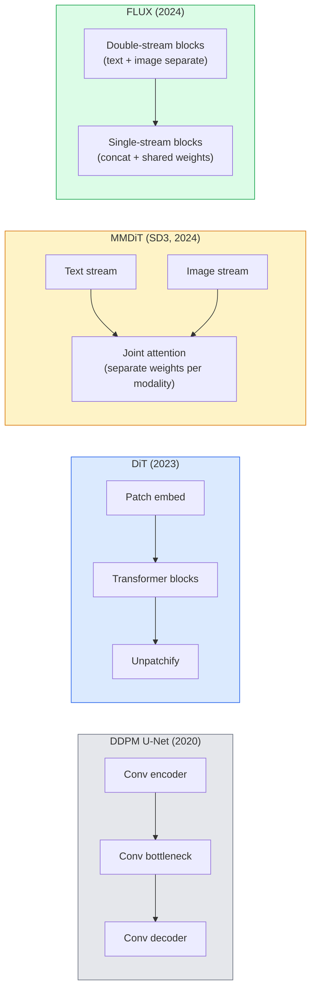

# Transformatory dyfuzyjne i przepływ rektyfikowany

> Sieć U-Net nie jest tajemnicą rozpowszechniania. Wymień go na transformator, zamień harmonogram szumów na przepływ liniowy i nagle masz SD3, FLUX i każdy model tekstu na obraz z 2026 roku.

**Typ:** Ucz się + Buduj
**Języki:** Python
**Wymagania wstępne:** Faza 4 Lekcja 10 (Dyfuzja DDPM), Faza 4 Lekcja 14 (ViT), Faza 7 Lekcja 02 (Samouwaga)
**Czas:** ~75 minut

## Cele nauczania

- Prześledź ewolucję od U-Net DDPM (lekcja 10) do transformatora dyfuzyjnego (DiT), MMDiT (SD3) i DiT z pojedynczym + podwójnym strumieniem (FLUX)
- Wyjaśnij poprawiony przepływ: dlaczego prosta trajektoria między szumem a danymi pozwala modelom próbkować w 20 krokach zamiast 1000
- Zaimplementuj mały blok DiT i pętlę treningową o wyprostowanym przepływie, oba poniżej 100 linii
- Rozróżnij warianty modelu (SD3, FLUX.1-dev, FLUX.1-schnell, Z-Image, Qwen-Image) według architektury, liczby parametrów i licencji

## Problem

W lekcji 10 zbudowano DDPM z denoiserem U-Net. Ten przepis zdominował lata 2020–2023: U-Net + harmonogram wersji beta + utrata przewidywania hałasu. Wyprodukował Stable Diffusion 1,5 i 2,1 oraz DALL-E 2.

Minął go każdy najnowocześniejszy model zamiany tekstu na obraz z 2026 roku. Stable Diffusion 3, FLUX, SD4, Z-Image, Qwen-Image, Hunyuan-Image — żadne z nich nie korzysta z U-Net. Używają transformatorów dyfuzyjnych (DiT). SD3 i FLUX zamieniają również harmonogram szumów DDPM na przepływ skorygowany, co prostuje ścieżkę od szumu do danych i umożliwia 1-4-etapowe wnioskowanie z wariantami spójności lub destylacji.

Ta zmiana ma znaczenie, ponieważ to właśnie dzięki niej generowanie obrazów w oparciu o dyfuzję stało się kontrolowane, szybkie i dokładne (renderowanie tekstu rozwiązane w standardzie SD3/SD4) oraz szybkie w produkcji. Zrozumienie poprawionego przepływu DiT + oznacza zrozumienie stosu obrazu generatywnego 2026.

## Koncepcja

### Od sieci U-Net do transformatora



- **DiT** (Peebles i Xie, 2023) — zamień U-Net na transformator podobny do ViT na ukrytych poprawkach. Kondycjonowanie poprzez normę warstwy adaptacyjnej (AdaLN).
- **MMDiT** (SD3, Esser et al., 2024) — dwa strumienie z oddzielnymi wagami dla tokenów tekstowych i graficznych, które mają wspólną uwagę.
- **FLUX** (Black Forest Labs, 2024) — pierwsze N ​​bloków dwustrumieniowych, takich jak SD3, późniejsze bloki łączą się i dzielą wagi (pojedynczy strumień) w celu zapewnienia wydajności na większej głębokości.
- **Z-Image** (2025) — wydajny jednostrumieniowy DiT przy parametrach 6B, który rzuca wyzwanie „skalowaniu za wszelką cenę”.

### Poprawiony przepływ w jednym akapicie

DDPM definiuje proces przesyłania dalej jako zaszumiony SDE, w którym `x_t` jest coraz bardziej uszkodzony. Wyuczona rewersja to drugie SDE, rozwiązane w 1000 małych krokach.

Przepływ skorygowany definiuje **prostą** interpolację między czystymi danymi a czystym szumem:

```
x_t = (1 - t) * x_0 + t * epsilon,     t in [0, 1]
```

Trenuj sieć w przewidywaniu prędkości `v_theta(x_t, t) = epsilon - x_0` — kierunek do przodu wzdłuż prostej ścieżki od czystych danych do szumu (`dx_t/dt`). Podczas próbkowania całkujesz tę prędkość wstecz, aby przejść od szumu do danych. Powstały ODE jest znacznie bliższy linii prostej, więc do pobrania próbki potrzeba znacznie mniej etapów integracji.

SD3 nazywa to **rektyfikowanym dopasowaniem przepływu**. FLUX, Z-Image i większość modeli 2026 wykorzystuje ten sam obiektyw. Typowe wnioskowanie: 20–30 kroków Eulera (deterministycznych) w porównaniu z 50+ krokami DDIM w starym systemie DDPM. Warianty destylowane / turbo / schnell / LCM zmniejszają to do 1-4 stopni.

### Kondycjonowanie AdaLN

Warunek DiT dotyczący kroku czasowego i klasy/tekstu za pomocą **normy warstwy adaptacyjnej**: przewiduj `scale` i `shift` z wektora warunkującego i zastosuj je po LayerNorm. Znacznie czystsza niż modulacja w stylu FiLM w sieciach U-Net i domyślna w każdym nowoczesnym DiT.

```
cond -> MLP -> (scale, shift, gate)
norm(x) * (1 + scale) + shift, then residual add * gate
```

### Kodery tekstu w SD3 i FLUX

- **SD3** wykorzystuje trzy kodery tekstu: dwa modele CLIP + T5-XXL. Osadzone elementy są łączone i wprowadzane do strumienia obrazu w ramach warunkowania tekstu.
- **FLUX** wykorzystuje jeden CLIP-L + T5-XXL.
- Warianty **Qwen-Image / Z-Image** korzystają z własnych, wewnętrznych koderów tekstu dostosowanych do ich podstawowych LLM.

Koder tekstu jest w dużej mierze powodem, dla którego SD3/FLUX sprawia, że ​​komunikaty są o wiele lepsze niż SD1.5. Sam T5-XXL ma parametry 4,7B.

### Wytyczne wolne od klasyfikatorów nadal obowiązują

Wyprostowany przepływ zmienia próbnik, a nie kondycjonowanie. Naprowadzanie bez klasyfikatorów (upuszczanie tekstu z prawdopodobieństwem 10% podczas uczenia, łączenie przewidywań warunkowych i bezwarunkowych podczas wnioskowania) działa identycznie z przepływem skorygowanym. Większość modeli na rok 2026 wykorzystuje skalę wskazówek 3,5–5 – niższą niż 7,5 w SD1.5, ponieważ modele z przepływem rektyfikowanym domyślnie dokładniej przestrzegają podpowiedzi.

### Spójność, Turbo, Schnell, LCM

Cztery nazwy tego samego pomysłu: przekształcenie powolnego, wieloetapowego modelu w szybki, kilkuetapowy model.

- **LCM (Model spójności ukrytej)** — przeszkol ucznia, który w jednym kroku przewiduje końcowy `x_0` z dowolnego średniozaawansowanego `x_t`.
- **SDXL Turbo / FLUX schnell** — modele 1-4-etapowe trenowane metodą przeciwstawnej destylacji dyfuzyjnej.
- **SD ​​Turbo** — modele spójności w stylu OpenAI przystosowane do ukrytego rozpowszechniania.

Produkcja obsługująca każdy nowy model statków dotyczy zarówno punktu kontrolnego „pełnej jakości”, jak i wariantu „turbo / schnell”. Schnell („szybki” w języku niemieckim, konwencja Black Forest Labs) działa w 1–4 krokach i dopasowuje się do potoków w czasie rzeczywistym.

### Modelowy krajobraz w 2026 roku

| Modelka | Rozmiar | Architektura | Licencja |
|-------|------|-------------|--------|
| Stabilna dyfuzja 3 Średnia | 2B | MMDiT | Społeczność NOK |
| Stabilna dyfuzja 3,5 duża | 8B | MMDiT | Społeczność NOK |
| FLUX.1-dev | 12B | Podwójny + pojedynczy strumień DiT | niekomercyjne |
| FLUX.1-schnell | 12B | taki sam, destylowany | Apache 2.0 |
| FLUX.2 | — | iterowany FLUX.1 | mieszane |
| Obraz Z | 6B | S3-DiT (skalowalny pojedynczy strumień) | zezwalający |
| Obraz Qwen | ~20B | Wieża tekstowa DiT + Qwen | Apache 2.0 |
| Hunyuan-Image-3.0 | ~80B | DiT | badania |
| SD4 Turbo | 3B | DiT + destylacja | SAI Komercyjne |

FLUX.1-schnell jest domyślnym oprogramowaniem typu open source na rok 2026. Z-Image jest liderem wydajności. FLUX.2 i SD4 to aktualne wskazówki dotyczące jakości.

### Dlaczego to przesunięcie fazowe ma znaczenie

DDPM + U-Net zadziałało. DiT + rektyfikowany przepływ działa **lepiej, szybciej i czystsze skalowanie**. Przejście jest analogiczne do przejścia z RNN na transformatory w NLP: obie architektury rozwiązały ten sam problem, ale transformatory zostały skalowane i obecnie dominują. W każdym artykule z 2026 r. na temat generacji obrazów, wideo lub 3D zastosowano odszumiacz w kształcie DiT i zwykle skorygowany obiektyw przepływu. U-Net DDPM ma obecnie przede wszystkim charakter pedagogiczny (lekcja 10).

## Zbuduj to

### Krok 1: Blok DiT z AdaLN

```python
import torch
import torch.nn as nn

class AdaLNZero(nn.Module):
    """
    Adaptive LayerNorm with a gate. Predicts (scale, shift, gate) from the conditioning.
    Init such that the whole block starts as identity ("zero init").
    """

    def __init__(self, dim, cond_dim):
        super().__init__()
        self.norm = nn.LayerNorm(dim, elementwise_affine=False)
        self.mlp = nn.Linear(cond_dim, dim * 3)
        nn.init.zeros_(self.mlp.weight)
        nn.init.zeros_(self.mlp.bias)

    def forward(self, x, cond):
        scale, shift, gate = self.mlp(cond).chunk(3, dim=-1)
        h = self.norm(x) * (1 + scale.unsqueeze(1)) + shift.unsqueeze(1)
        return h, gate.unsqueeze(1)

class DiTBlock(nn.Module):
    def __init__(self, dim=192, heads=3, mlp_ratio=4, cond_dim=192):
        super().__init__()
        self.adaln1 = AdaLNZero(dim, cond_dim)
        self.attn = nn.MultiheadAttention(dim, heads, batch_first=True)
        self.adaln2 = AdaLNZero(dim, cond_dim)
        self.mlp = nn.Sequential(
            nn.Linear(dim, dim * mlp_ratio),
            nn.GELU(),
            nn.Linear(dim * mlp_ratio, dim),
        )

    def forward(self, x, cond):
        h, gate1 = self.adaln1(x, cond)
        a, _ = self.attn(h, h, h, need_weights=False)
        x = x + gate1 * a
        h, gate2 = self.adaln2(x, cond)
        x = x + gate2 * self.mlp(h)
        return x
```

`AdaLNZero` zaczyna jako mapowanie tożsamości, ponieważ jego wagi MLP są inicjowane na zero. Szkolenie usuwa blokadę z tożsamości; stabilizuje to radykalnie modele głębokiej dyfuzji transformatora.

### Krok 2: Mały DiT

```python
def timestep_embedding(t, dim):
    import math
    half = dim // 2
    freqs = torch.exp(-math.log(10000) * torch.arange(half, device=t.device) / half)
    args = t[:, None].float() * freqs[None]
    return torch.cat([args.sin(), args.cos()], dim=-1)

class TinyDiT(nn.Module):
    def __init__(self, image_size=16, patch_size=2, in_channels=3, dim=96, depth=4, heads=3):
        super().__init__()
        self.patch_size = patch_size
        self.num_patches = (image_size // patch_size) ** 2
        self.patch = nn.Conv2d(in_channels, dim, kernel_size=patch_size, stride=patch_size)
        self.pos = nn.Parameter(torch.zeros(1, self.num_patches, dim))
        self.time_mlp = nn.Sequential(
            nn.Linear(dim, dim * 2),
            nn.SiLU(),
            nn.Linear(dim * 2, dim),
        )
        self.blocks = nn.ModuleList([DiTBlock(dim, heads, cond_dim=dim) for _ in range(depth)])
        self.norm_out = nn.LayerNorm(dim, elementwise_affine=False)
        self.head = nn.Linear(dim, patch_size * patch_size * in_channels)

    def forward(self, x, t):
        n = x.size(0)
        x = self.patch(x)
        x = x.flatten(2).transpose(1, 2) + self.pos
        t_emb = self.time_mlp(timestep_embedding(t, self.pos.size(-1)))
        for blk in self.blocks:
            x = blk(x, t_emb)
        x = self.norm_out(x)
        x = self.head(x)
        return self._unpatchify(x, n)

    def _unpatchify(self, x, n):
        p = self.patch_size
        h = w = int(self.num_patches ** 0.5)
        x = x.view(n, h, w, p, p, -1).permute(0, 5, 1, 3, 2, 4).reshape(n, -1, h * p, w * p)
        return x
```

### Krok 3: Trening poprawionego przepływu

```python
import torch.nn.functional as F

def rectified_flow_train_step(model, x0, optimizer, device):
    model.train()
    x0 = x0.to(device)
    n = x0.size(0)
    t = torch.rand(n, device=device)
    epsilon = torch.randn_like(x0)
    x_t = (1 - t[:, None, None, None]) * x0 + t[:, None, None, None] * epsilon

    target_velocity = epsilon - x0
    pred_velocity = model(x_t, t)

    loss = F.mse_loss(pred_velocity, target_velocity)
    optimizer.zero_grad()
    loss.backward()
    optimizer.step()
    return loss.item()
```

Porównaj z prognozowaną stratą szumu DDPM (lekcja 10): ta sama struktura, inny cel. Zamiast przewidywać szum `epsilon`, przewidujemy **prędkość** `epsilon - x_0`, która wskazuje od danych do szumu wzdłuż interpolacji liniowej.

### Krok 4: Próbnik Eulera

Przepływ skorygowany to ODE. Metoda Eulera jest najprostszą i, w przypadku dobrze wytrenowanego modelu przepływu wyprostowanego, prawie tak dokładną, jak solwery wyższego rzędu w ponad 20 krokach.

```python
@torch.no_grad()
def rectified_flow_sample(model, shape, steps=20, device="cpu"):
    model.eval()
    x = torch.randn(shape, device=device)
    dt = 1.0 / steps
    t = torch.ones(shape[0], device=device)
    for _ in range(steps):
        v = model(x, t)
        x = x - dt * v
        t = t - dt
    return x
```

20 kroków. W wyszkolonym modelu daje to próbki porównywalne z 1000-krokowym DDPM.

### Krok 5: Kompleksowy test dymu

```python
import numpy as np

def synthetic_blobs(num=200, size=16, seed=0):
    rng = np.random.default_rng(seed)
    out = np.zeros((num, 3, size, size), dtype=np.float32)
    yy, xx = np.meshgrid(np.arange(size), np.arange(size), indexing="ij")
    for i in range(num):
        cx, cy = rng.uniform(4, size - 4, size=2)
        r = rng.uniform(2, 4)
        mask = (xx - cx) ** 2 + (yy - cy) ** 2 < r ** 2
        colour = rng.uniform(-1, 1, size=3)
        for c in range(3):
            out[i, c][mask] = colour[c]
    return torch.from_numpy(out)
```

Przeszkol `TinyDiT` w tym zakresie z poprawionym przepływem. Po 500 krokach próbkowane wyniki powinny wyglądać jak słabe plamy koloru.

## Użyj tego

Do generowania prawdziwego obrazu za pomocą FLUX / SD3 / Z-Image, `diffusers` dostarcza każdy z ujednoliconym API:

```python
from diffusers import FluxPipeline, StableDiffusion3Pipeline
import torch

pipe = FluxPipeline.from_pretrained(
    "black-forest-labs/FLUX.1-schnell",
    torch_dtype=torch.bfloat16,
).to("cuda")

out = pipe(
    prompt="a golden retriever surfing a tsunami, hyperrealistic, studio lighting",
    guidance_scale=0.0,           # schnell was trained without CFG
    num_inference_steps=4,
    max_sequence_length=256,
).images[0]
out.save("surf.png")
```

Trzy linie. `FLUX.1-schnell` w czterech krokach. Zamień identyfikator modelu na `black-forest-labs/FLUX.1-dev`, aby uzyskać wyższą jakość w 20-30 krokach za pomocą CFG.

Dla SD3:

```python
pipe = StableDiffusion3Pipeline.from_pretrained(
    "stabilityai/stable-diffusion-3.5-large",
    torch_dtype=torch.bfloat16,
).to("cuda")
out = pipe(prompt, guidance_scale=3.5, num_inference_steps=28).images[0]
```

## Wyślij to

Ta lekcja daje:

- `outputs/prompt-dit-model-picker.md` — wybiera pomiędzy SD3, FLUX.1-dev, FLUX.1-schnell, Z-Image, SD4 Turbo, biorąc pod uwagę jakość, opóźnienie i ograniczenia licencyjne.
- `outputs/skill-rectified-flow-trainer.md` — zapisuje pełną pętlę treningową dla skorygowanego przepływu za pomocą próbkowania AdaLN DiT i Euler.

## Ćwiczenia

1. **(Łatwy)** Trenuj powyższy TinyDiT na syntetycznym zestawie danych typu blob przez 500 kroków. Porównaj próbki wytworzone przy 10, 20 i 50 krokach Eulera.
2. **(Średni)** Dodaj warunkowanie tekstu, łącząc osadzenie wyuczonej klasy z osadzeniem czasu (10 „klas” obiektów typu blob według koloru). Próbka z klasą 0, 5 i 9 i sprawdzanie zgodności kolorów.
3. **(Trudne)** Oblicz odległość Frécheta (proxy FID) pomiędzy wygenerowanymi próbkami z wersji o przepływie prostownym i wersji DDPM tej samej wielkości sieci trenowanej na tych samych danych dla tej samej liczby kroków. Raport, który zbiega się szybciej.

## Kluczowe terminy

| Termin | Co ludzie mówią | Co to właściwie oznacza |
|------|----------------|----------------------|
| DiT | „Transformator dyfuzyjny” | Transformator zastępujący sieć U-Net jako odszumiacz dyfuzyjny; działa na załatanych ukrytych |
| AdaLN | „Norma warstwy adaptacyjnej” | Kondycjonowanie kroku czasowego/tekstu poprzez wyuczoną skalę, przesunięcie, bramkę zastosowaną po LayerNorm; standard w każdym nowoczesnym DiT |
| MMDiT | „Wielomodalny DiT (SD3)” | Oddzielne strumienie wag dla tokenów tekstowych i graficznych, które mają wspólną samouważność |
| Pojedynczy strumień / podwójny strumień | „Sztuczka z FLUXEM” | Najpierw N blokuje podwójny strumień (oddzielne wagi dla każdej modalności), później blokuje pojedynczy strumień (połączenie + wspólne wagi) w celu zwiększenia wydajności |
| Naprawiony przepływ | „Prosta linia szumu do danych” | Interpolacja liniowa pomiędzy danymi a szumem; sieć przewiduje prędkość; przy wnioskowaniu potrzeba mniej kroków ODE |
| Docelowa prędkość | "epsilon - x_0" | Cel regresji w przepływie skorygowanym; punkty od czystych danych do szumu |
| Wytyczne CFG | „wytyczne bez klasyfikatorów” | Mieszaj przewidywania warunkowe i bezwarunkowe; nadal używany w modelach z przepływem rektyfikowanym |
| Schnell / turbo / LCM | „destylacja 1-4 etapowa” | Warianty małych kroków destylowane z modeli pełnej jakości; produkcja w czasie rzeczywistym |

## Dalsze czytanie

- [Scalable Diffusion Models with Transformers (Peebles & Xie, 2023)](https://arxiv.org/abs/2212.09748) — artykuł DiT
- [Scaling Rectified Flow Transformers (Esser et al., artykuł SD3)](https://arxiv.org/abs/2403.03206) — MMDiT i rektyfikowany przepływ na dużą skalę
- [Karta modelu FLUX.1 i raport techniczny (Black Forest Labs)](https://huggingface.co/black-forest-labs/FLUX.1-dev) — szczegóły dotyczące podwójnego + pojedynczego strumienia
– [Z-Image: Efficient Image Generation Foundation Model (2025)](https://arxiv.org/html/2511.22699v1) — jednostrumieniowy DiT przy 6B
– [Elucidating the Design Space of Diffusion (Karras et al., 2022)](https://arxiv.org/abs/2206.00364) – odniesienie dla każdego kompromisu w projektowaniu dyfuzji
– [Latent Consistency Models (Luo et al., 2023)](https://arxiv.org/abs/2310.04378) — jak LCM-LoRA umożliwia wnioskowanie w 4 krokach