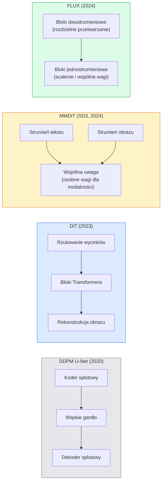

# Transformatory dyfuzyjne (Diffusion Transformers - DiT) i przepływ prostoliniowy (Rectified Flow)

> Architektura U-Net przestała być kluczem do sukcesu w modelach dyfuzyjnych. Zastąpienie jej transformatorem oraz przejście z klasycznego harmonogramu szumów na liniowy przepływ (Rectified Flow) doprowadziło do powstania Stable Diffusion 3, modeli FLUX i innych nowoczesnych systemów Text-to-Image.

**Typ lekcji:** Teoria + Praktyka
**Język:** Python
**Wymagania wstępne:** Faza 4, Lekcja 10 (Dyfuzja DDPM); Faza 4, Lekcja 14 (ViT); Faza 7, Lekcja 02 (Self-Attention / Samouwaga)
**Czas wykonania:** ~75 minut

## Cele lekcji

- Przeanalizujesz ewolucję modeli dyfuzyjnych od struktur U-Net DDPM do transformatorów dyfuzyjnych (DiT), w tym wariantów MMDiT (SD3) oraz architektury jedno- i dwustrumieniowej (FLUX).
- Zrozumiesz matematyczną koncepcję przepływu prostoliniowego (Rectified Flow) i dowiesz się, jak liniowa ścieżka interpolacji między szumem a obrazem pozwala zredukować liczbę kroków próbkowania z 1000 do zaledwie 20.
- Zaimplementujesz od podstaw prosty blok DiT oraz pętlę uczącą Rectified Flow w kodzie liczącym poniżej 100 linii.
- Nauczysz się porównywać wiodące modele (np. SD3, FLUX.1-dev, FLUX.1-schnell, Z-Image, Qwen-Image) pod kątem architektury, liczby parametrów oraz licencji.

## Opis problemu

W lekcji 10 zaimplementowaliśmy model DDPM z siecią odszumiającą U-Net. Schemat ten: U-Net + harmonogram dodawania szumu (beta scheduler) + funkcja straty przewidywania szumu (noise prediction loss) zdominował rynek w latach 2020–2023, stanowiąc podstawę dla Stable Diffusion 1.5, 2.1 oraz DALL-E 2.

Obecnie wiodące modele generacji obrazów (Text-to-Image) porzuciły architekturę U-Net. Modele takie jak Stable Diffusion 3, FLUX, SD4, Z-Image, Qwen-Image czy Hunyuan-Image wykorzystują transformatory dyfuzyjne (Diffusion Transformers - DiT). Ponadto systemy te zastępują tradycyjne harmonogramy DDPM koncepcją przepływu prostoliniowego (Rectified Flow / Flow Matching), co prostuje trajektorię przejścia od szumu do czystego obrazu i umożliwia generowanie obrazów w zaledwie 1 do 4 krokach dzięki destylacji lub modelom spójności (Consistency Models).

Ta ewolucja ma fundamentalne znaczenie: dzięki niej generowanie obrazów stało się szybsze, bardziej precyzyjne (SD3 i FLUX rozwiązały problem poprawnego renderowania napisów na obrazach) i wysoce wydajne produkcyjnie. Zrozumienie połączenia DiT z Rectified Flow jest kluczem do opanowania współczesnych systemów generatywnych.

## Koncepcje teoretyczne

### Ewolucja architektoniczna



- **DiT** (Peebles & Xie, 2023) – zastępuje sieć U-Net klasycznym Transformerem typu ViT, przetwarzającym wektor ukryty podzielony na wycinki (patches). Warunkowanie (conditioning) realizowane jest za pomocą adaptacyjnej normalizacji warstwowej (AdaLN).
- **MMDiT** (SD3, Esser et al., 2024) – wprowadza dwa niezależne strumienie obliczeniowe z dedykowanymi wagami dla reprezentacji tekstowej i obrazowej, które współdzielą mechanizm atencji.
- **FLUX** (Black Forest Labs, 2024) – początkowe bloki wykorzystują przetwarzanie dwustrumieniowe (jak w SD3), a w dalszej części sieci strumienie są łączone i wspólnie przetwarzane (jednostrumieniowo), co pozwala zoptymalizować koszty obliczeniowe przy zachowaniu głębokości modelu.
- **Z-Image** (2025) – wysoce zoptymalizowana, jednostrumieniowa architektura DiT o rozmiarze 6B parametrów, stanowiąca alternatywę dla gigantycznych modeli.

### Przepływ prostoliniowy (Rectified Flow) w pigułce

Klasyczne DDPM definiuje proces dodawania szumu jako stochastyczne równanie różniczkowe (SDE), w którym obraz `x_t` ulega stopniowej degradacji. Proces odszumiania jest odwrotnością SDE i wymaga przejścia przez 1000 małych kroków dyskretnych.

Przepływ prostoliniowy (Rectified Flow) definiuje **najkrótszą (liniową)** ścieżkę interpolacji pomiędzy czystym obrazem a szumem gaussowskim:

```
x_t = (1 - t) * x_0 + t * epsilon,     t in [0, 1]
```

Zadaniem sieci jest przewidywanie wektora prędkości: `v_theta(x_t, t) = epsilon - x_0`, który reprezentuje pochodną `dx_t/dt` na liniowej trajektorii. W czasie próbkowania całkuje się to pole prędkości wstecznie (od szumu `t=1` do obrazu `t=0`). Ponieważ trajektoria jest zbliżona do linii prostej, do numerycznego rozwiązania tego zwyczajnego równania różniczkowego (ODE) wystarcza bardzo mała liczba kroków integracji.

Stabilty AI w modelu SD3 określa to jako **Rectified Flow Matching**. FLUX, Z-Image oraz inne nowsze modele również opierają się na tej koncepcji. Standardowe generowanie wymaga jedynie 20–30 prostych kroków metody Eulera, w porównaniu do ponad 50 bardziej skomplikowanych kroków DDIM w modelach U-Net. Wersje destylowane (typu turbo, schnell czy LCM) pozwalają zredukować ten proces do 1–4 kroków.

### Adaptacyjna normalizacja warstwowa (AdaLN)

Warunkowanie (conditioning) modelu na krok czasowy lub opis tekstowy odbywa się za pomocą **adaptacyjnej normalizacji warstwowej (Adaptive LayerNorm)**: z wektora warunkującego sieć przewiduje parametry przesunięcia (`shift`) oraz skalowania (`scale`), które aplikuje się na wartościach po LayerNorm. Jest to rozwiązanie znacznie bardziej eleganckie i stabilniejsze niż modulacja FiLM w sieciach splotowych U-Net.

```
cond -> MLP -> (scale, shift, gate)
norm(x) * (1 + scale) + shift, a następnie dodanie rezydualne * gate
```

### Moduły kodowania tekstu w modelach SD3 i FLUX

- **SD3** wykorzystuje jednocześnie trzy kodery tekstu: dwa warianty modelu CLIP oraz olbrzymi model T5-XXL. Uzyskane tokeny są łączone i podawane do transformatora obrazu jako warunek wejściowy.
- **FLUX** opiera się na zestawie składającym się z jednego modelu CLIP-L oraz T5-XXL.
- Modele **Qwen-Image / Z-Image** stosują własne, wbudowane kodery tekstu powiązane z ich macierzystymi modelami LLM.

Tak zaawansowane kodery tekstu to główny powód, dla którego SD3 i FLUX wykazują nieporównywalnie lepsze zrozumienie złożonych promptów w porównaniu do starszych modeli SD1.5. Sam enkoder T5-XXL posiada aż 4.7B parametrów.

### Mechanizm Classifier-Free Guidance (CFG)

Wprowadzenie Rectified Flow zmienia mechanizm próbkowania (sam solver ODE), jednak koncepcja Classifier-Free Guidance (CFG) pozostaje aktualna. Wciąż podczas uczenia losowo (np. z prawdopodobieństwem 10%) usuwa się podpowiedź tekstową, a podczas generowania interpoluje się kierunki wyznaczone z promptem i bez niego. Nowoczesne modele wymagają zazwyczaj niższych wartości skali CFG (w granicach 3.5 – 5, zamiast 7.5 jak w SD1.5), ponieważ modele z przepływem prostoliniowym z natury lepiej odwzorowują treść opisu tekstowego.

### Destylacja krokowa: Modele spójności (Consistency), Turbo, Schnell, LCM

Są to alternatywne metody mające na celu skrócenie czasu próbkowania modelu bazowego:

- **LCM (Latent Consistency Models)**: technika trenowania sieci pomocniczej, która uczy się przewidywać końcowy punkt `x_0` bezpośrednio na podstawie dowolnego pośredniego stanu szumu `x_t` w jednym kroku.
- **SDXL Turbo / FLUX.1-schnell**: bardzo szybkie wersje modeli (działające w 1 do 4 krokach), trenowane z użyciem destylacji opartej na funkcjach straty znanych z sieci GAN (Adversarial Diffusion Distillation).
- **SD Turbo**: modele spójności zaadaptowane do generacji w przestrzeni ukrytej (latent space).

Obecnie wdrożenia produkcyjne udostępniają zazwyczaj dwa warianty modeli: wersję pełną („full quality”) o maksymalnej wierności oraz wersję szybką („schnell” / „turbo”) przeznaczoną do przetwarzania w czasie rzeczywistym.

### Porównanie wiodących architektur (stan na 2026 rok)

| Nazwa modelu | Rozmiar | Architektura | Licencja |
|-------|------|-------------|--------|
| Stable Diffusion 3 Medium | 2B | MMDiT | Licencja społecznościowa |
| Stable Diffusion 3.5 Large | 8B | MMDiT | Licencja społecznościowa |
| FLUX.1-dev | 12B | DiT (dwu- i jednostrumieniowy) | Niekomercyjna |
| FLUX.1-schnell | 12B | DiT (jak wyżej, destylowany) | Apache 2.0 |
| FLUX.2 | — | Udoskonalony FLUX.1 | Mieszana |
| Z-Image | 6B | S3-DiT (skalowalny jednostrumieniowy) | Permisywna |
| Qwen-Image | ~20B | DiT + koder tekstowy Qwen | Apache 2.0 |
| Hunyuan-Image-3.0 | ~80B | DiT | Badawcza |
| SD4 Turbo | 3B | DiT + destylacja | Komercyjna |

FLUX.1-schnell stanowi obecnie podstawowy standard open-source dla szybkich generacji. Z-Image to z kolei lider optymalizacji wydajnościowej. FLUX.2 oraz rodzina SD4 wyznaczają standardy maksymalnej jakości obrazu.

### Dlaczego ta zmiana paradygmatu jest kluczowa?

Połączenie DDPM oraz sieci U-Net było rewolucją w swoim czasie. Jednak duety DiT oraz Rectified Flow oferują **lepszą jakość, znacznie wyższą prędkość generowania i liniowe skalowanie wraz z rozmiarem modeli**. Zmiana ta jest bezpośrednim odpowiednikiem przejścia z sieci RNN na Transformery w obszarze NLP. Choć stare metody realizowały to samo zadanie, to nowoczesne architektury okazały się nieporównywalnie lepiej skalowalne. Dziś praktycznie każda nowa publikacja naukowa z zakresu generacji obrazów, wideo czy obiektów 3D wykorzystuje Transformery jako blok odszumiający. Klasyczne potoki U-Net DDPM (jak ten z lekcji 10) pełnią już dziś głównie rolę dydaktyczną.

## Implementacja krok po kroku

### Krok 1: Implementacja bloku DiT z adaptacyjną normalizacją AdaLN-Zero

```python
import torch
import torch.nn as nn

class AdaLNZero(nn.Module):
    """
    Adaptacyjny LayerNorm z mechanizmem bramkowania.
    Przewiduje parametry (scale, shift, gate) na podstawie warunku.
    Inicjalizowany tak, aby cały blok na początku działał jako tożsamość.
    """
    def __init__(self, dim, cond_dim):
        super().__init__()
        self.norm = nn.LayerNorm(dim, elementwise_affine=False)
        self.mlp = nn.Linear(cond_dim, dim * 3)
        nn.init.zeros_(self.mlp.weight)
        nn.init.zeros_(self.mlp.bias)

    def forward(self, x, cond):
        scale, shift, gate = self.mlp(cond).chunk(3, dim=-1)
        h = self.norm(x) * (1 + scale.unsqueeze(1)) + shift.unsqueeze(1)
        return h, gate.unsqueeze(1)

class DiTBlock(nn.Module):
    def __init__(self, dim=192, heads=3, mlp_ratio=4, cond_dim=192):
        super().__init__()
        self.adaln1 = AdaLNZero(dim, cond_dim)
        self.attn = nn.MultiheadAttention(dim, heads, batch_first=True)
        self.adaln2 = AdaLNZero(dim, cond_dim)
        self.mlp = nn.Sequential(
            nn.Linear(dim, dim * mlp_ratio),
            nn.GELU(),
            nn.Linear(dim * mlp_ratio, dim),
        )

    def forward(self, x, cond):
        h, gate1 = self.adaln1(x, cond)
        a, _ = self.attn(h, h, h, need_weights=False)
        x = x + gate1 * a
        h, gate2 = self.adaln2(x, cond)
        x = x + gate2 * self.mlp(h)
        return x
```

Moduł `AdaLNZero` na początku uczenia działa jako funkcja tożsamości (identity mapping), ponieważ wagi wyjściowe MLP są inicjowane zerami. Dopiero w trakcie treningu sieć zaczyna modyfikować te wartości. Taki zabieg (tzw. zero-initialization) radykalnie poprawia stabilność uczenia głębokich transformatorów dyfuzyjnych.

### Krok 2: Uproszczona wersja Transformer DiT (TinyDiT)

```python
def timestep_embedding(t, dim):
    import math
    half = dim // 2
    freqs = torch.exp(-math.log(10000) * torch.arange(half, device=t.device) / half)
    args = t[:, None].float() * freqs[None]
    return torch.cat([args.sin(), args.cos()], dim=-1)

class TinyDiT(nn.Module):
    def __init__(self, image_size=16, patch_size=2, in_channels=3, dim=96, depth=4, heads=3):
        super().__init__()
        self.patch_size = patch_size
        self.num_patches = (image_size // patch_size) ** 2
        self.patch = nn.Conv2d(in_channels, dim, kernel_size=patch_size, stride=patch_size)
        self.pos = nn.Parameter(torch.zeros(1, self.num_patches, dim))
        self.time_mlp = nn.Sequential(
            nn.Linear(dim, dim * 2),
            nn.SiLU(),
            nn.Linear(dim * 2, dim),
        )
        self.blocks = nn.ModuleList([DiTBlock(dim, heads, cond_dim=dim) for _ in range(depth)])
        self.norm_out = nn.LayerNorm(dim, elementwise_affine=False)
        self.head = nn.Linear(dim, patch_size * patch_size * in_channels)

    def forward(self, x, t):
        n = x.size(0)
        x = self.patch(x)
        x = x.flatten(2).transpose(1, 2) + self.pos
        t_emb = self.time_mlp(timestep_embedding(t, self.pos.size(-1)))
        for blk in self.blocks:
            x = blk(x, t_emb)
        x = self.norm_out(x)
        x = self.head(x)
        return self._unpatchify(x, n)

    def _unpatchify(self, x, n):
        p = self.patch_size
        h = w = int(self.num_patches ** 0.5)
        x = x.view(n, h, w, p, p, -1).permute(0, 5, 1, 3, 2, 4).reshape(n, -1, h * p, w * p)
        return x
```

### Krok 3: Pętla szkoleniowa Rectified Flow

```python
import torch.nn.functional as F

def rectified_flow_train_step(model, x0, optimizer, device):
    model.train()
    x0 = x0.to(device)
    n = x0.size(0)
    t = torch.rand(n, device=device)
    epsilon = torch.randn_like(x0)
    x_t = (1 - t[:, None, None, None]) * x0 + t[:, None, None, None] * epsilon

    target_velocity = epsilon - x0
    pred_velocity = model(x_t, t)

    loss = F.mse_loss(pred_velocity, target_velocity)
    optimizer.zero_grad()
    loss.backward()
    optimizer.step()
    return loss.item()
```

Warto porównać to podejście ze stratą przewidywania szumu w DDPM (lekcja 10): struktura pętli jest niemal identyczna, jednak zmienia się cel optymalizacji. Zamiast przewidywać bezpośrednio wektor szumu `epsilon`, model uczy się prognozować **wektor prędkości** `epsilon - x_0`, czyli kierunek przejścia od danych do szumu na prostej trajektorii.

### Krok 4: Implementacja dedykowanego próbnika Eulera (Euler Solver)

Proces skojarzony z Rectified Flow reprezentuje zwyczajne równanie różniczkowe (ODE). Numeryczne rozwiązywanie metodą Eulera jest najprostszym podejściem i w przypadku poprawnie przeszkolonego modelu daje wyniki niemal identyczne z bardziej złożonymi solverami wyższych rzędów przy 20 krokach próbkowania.

```python
@torch.no_grad()
def rectified_flow_sample(model, shape, steps=20, device="cpu"):
    model.eval()
    x = torch.randn(shape, device=device)
    dt = 1.0 / steps
    t = torch.ones(shape[0], device=device)
    for _ in range(steps):
        v = model(x, t)
        x = x - dt * v
        t = t - dt
    return x
```

Próbkowanie w 20 krokach na wytrenowanym modelu daje obrazy w pełni porównywalne z 1000 krokami w klasycznym DDPM.

### Krok 5: Test integracyjny na danych syntetycznych (Smoke Test)

```python
import numpy as np

def synthetic_blobs(num=200, size=16, seed=0):
    rng = np.random.default_rng(seed)
    out = np.zeros((num, 3, size, size), dtype=np.float32)
    yy, xx = np.meshgrid(np.arange(size), np.arange(size), indexing="ij")
    for i in range(num):
        cx, cy = rng.uniform(4, size - 4, size=2)
        r = rng.uniform(2, 4)
        mask = (xx - cx) ** 2 + (yy - cy) ** 2 < r ** 2
        colour = rng.uniform(-1, 1, size=3)
        for c in range(3):
            out[i, c][mask] = colour[c]
    return torch.from_numpy(out)
```

Uruchomienie uczenia modelu `TinyDiT` z wykorzystaniem Rectified Flow na tych danych pozwoli na szybką weryfikację. Po około 500 iteracjach generowane obrazy zaczną odtwarzać charakterystyczne kształty barwnych plam.

## Zastosowanie w praktyce

W celu generowania obrazów wysokiej jakości za pomocą modeli FLUX lub SD3 przy użyciu biblioteki `diffusers` wystarczy kilka linii kodu:

```python
from diffusers import FluxPipeline, StableDiffusion3Pipeline
import torch

pipe = FluxPipeline.from_pretrained(
    "black-forest-labs/FLUX.1-schnell",
    torch_dtype=torch.bfloat16,
).to("cuda")

out = pipe(
    prompt="a golden retriever surfing a tsunami, hyperrealistic, studio lighting",
    guidance_scale=0.0,           # wersja schnell została wytrenowana bez obsługi CFG
    num_inference_steps=4,
    max_sequence_length=256,
).images[0]
out.save("surf.png")
```

Zaledwie kilka linii kodu pozwala uruchomić model `FLUX.1-schnell` w 4 krokach. Podmieniając model na wersję `black-forest-labs/FLUX.1-dev`, uzyskasz obrazy o najwyższej wierności w 20–30 krokach przy włączonej skali CFG.

W przypadku Stable Diffusion 3.5:

```python
pipe = StableDiffusion3Pipeline.from_pretrained(
    "stabilityai/stable-diffusion-3.5-large",
    torch_dtype=torch.bfloat16,
).to("cuda")
out = pipe(prompt, guidance_scale=3.5, num_inference_steps=28).images[0]
```

## Materiały i pliki wyjściowe

W ramach tej lekcji przygotowano:

- `outputs/prompt-dit-model-picker.md` – szablon promptu pomagający w doborze właściwego modelu (np. SD3, FLUX.1-dev, FLUX.1-schnell, Z-Image, SD4 Turbo) z uwzględnieniem wymagań jakościowych, budżetu opóźnienia i licencji komercyjnej.
- `outputs/skill-rectified-flow-trainer.md` – kompletna implementacja pętli uczącej dla modeli Rectified Flow z wykorzystaniem bloków AdaLN DiT oraz próbnika Eulera.

## Ćwiczenia praktyczne

1. **(Łatwe)** Przetrenuj model `TinyDiT` na syntetycznym zbiorze plam (blobs) przez 500 kroków. Porównaj generowane obrazy uzyskane dla odpowiednio 10, 20 i 50 kroków metody Eulera.
2. **(Średnie)** Add warunkowanie klasą (np. definiując 10 typów plam o określonych kolorach), łącząc embedding klasy z reprezentacją czasu. Wygeneruj obrazy dla wybranych klas (np. 0, 5 oraz 9) i sprawdź spójność wyjściowych barw z zadaną etykietą.
3. **(Trudne)** Oblicz odległość Frécheta (uproszczoną wersję FID) dla obrazów wygenerowanych za pomocą modelu Rectified Flow oraz klasycznego modelu DDPM (wykorzystującego tę samą architekturę i zbiór danych). Porównaj tempo zbieżności i jakość generowanych próbek dla obu metod.

## Słownik pojęć

| Pojęcie | Obiegowe rozumienie | Definicja techniczna |
|------|----------------|----------------------|
| DiT (Diffusion Transformer) | „Transformator zamiast U-Neta” | Architektura transformatora wykorzystywana jako blok odszumiający w modelach dyfuzyjnych, przetwarzająca reprezentacje obrazu podzielone na wycinki (patches) |
| AdaLN (Adaptive LayerNorm) | „Adaptacyjna normalizacja” | Mechanizm modulacji cech po warstwie normalizacji przy użyciu wyuczonych współczynników przesunięcia, skalowania i bramkowania; standard warunkowania w modelach DiT |
| MMDiT (Multimodal DiT) | „Wielomodalny DiT” | Architektura transformatora wprowadzająca oddzielne wagi dla kodowania tekstu oraz cech obrazu, które następnie podlegają wspólnemu mechanizmowi samouwagi |
| Bloki jedno- i dwustrumieniowe | „Architektura hybrydowa FLUX” | Podejście optymalizujące: początkowe bloki przetwarzają tekst i obraz w osobnych strumieniach (double-stream), a kolejne łączą te reprezentacje we wspólny strumień (single-stream) |
| Przepływ prostoliniowy (Rectified Flow) | „Prostowanie trajektorii szumu” | Koncepcja interpolacji liniowej między rozkładem danych i szumem; sieć uczy się pola prędkości przejścia, co znacznie skraca proces wnioskowania |
| Wektor prędkości (Velocity Target) | „Kierunek zmiany” | Wartość docelowa `epsilon - x_0` w optymalizacji Rectified Flow określająca wektor kierunkowy przejścia wzdłuż linii interpolacji |
| CFG (Classifier-Free Guidance) | „Skala naprowadzania na prompt” | Metoda mieszania predykcji warunkowych i bezwarunkowych w celu ściślejszego kontrolowania zgodności generacji z tekstem wejściowym |
| Wersje destylowane (Schnell / Turbo / LCM) | „Szybkie generatory” | Zoptymalizowane i wydestylowane wersje modeli pozwalające na tworzenie obrazów w zaledwie 1 do 4 krokach próbkowania |

## Literatura i materiały uzupełniające

- [Scalable Diffusion Models with Transformers (Peebles & Xie, 2023)](https://arxiv.org/abs/2212.09748) – oryginalna publikacja wprowadzająca architekturę DiT.
- [Scaling Rectified Flow Transformers (Esser et al., 2024)](https://arxiv.org/abs/2403.03206) – opis techniczny modelu Stable Diffusion 3 oraz skalowania Rectified Flow.
- [Dokumentacja i karta modelu FLUX.1 (Black Forest Labs)](https://huggingface.co/black-forest-labs/FLUX.1-dev) – szczegóły techniczne dotyczące architektury jedno- i dwustrumieniowej.
- [Z-Image: Efficient Image Generation Foundation Model (2025)](https://arxiv.org/html/2511.22699v1) – publikacja na temat zoptymalizowanego modelu Z-Image.
- [Elucidating the Design Space of Diffusion-Based Generative Models (Karras et al., 2022)](https://arxiv.org/abs/2206.00364) – fundamentalna praca systematyzująca parametryzację modeli dyfuzyjnych.
- [Latent Consistency Models (Luo et al., 2023)](https://arxiv.org/abs/2310.04378) – opis matematyczny modeli spójności LCM.
