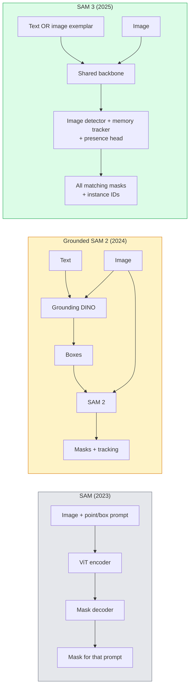

# SAM 3 i segmentacja słownictwa otwartego

> Daj modelowi zachętę tekstową i obraz, a następnie uzyskaj maski dla każdego pasującego obiektu. SAM 3 wykonał jedno podanie w przód.

**Typ:** Użyj + Kompiluj
**Języki:** Python
**Wymagania wstępne:** Faza 4 Lekcja 07 (U-Net), Faza 4 Lekcja 08 (Maska R-CNN), Faza 4 Lekcja 18 (CLIP)
**Czas:** ~60 minut

## Cele nauczania

- Rozróżnij SAM (tylko podpowiedzi wizualne), Grounded SAM / SAM 2 (detektor + SAM) i SAM 3 (natywne podpowiedzi tekstowe poprzez segmentację koncepcji z możliwością podpowiedzi)
- Wyjaśnij architekturę SAM 3: współdzielony szkielet + detektor obrazu + moduł śledzenia wideo oparty na pamięci + głowica obecności + konstrukcja oddzielonego detektora-śledzenia
- Użyj integracji z Hugging Face `transformers` SAM 3 do wykrywania, segmentacji i śledzenia wideo za pomocą komunikatów tekstowych
- Wybierz pomiędzy SAM 3, Grounded SAM 2, YOLO-World i SAM-MI w oparciu o opóźnienie, złożoność koncepcji i cel wdrożenia

## Problem

SAM 2023 był modelem obsługującym wyłącznie podpowiedzi wizualne: klikasz punkt lub rysujesz prostokąt, a zwracana jest maska. Do „daj mi wszystkie pomarańcze na tym zdjęciu” potrzebny był detektor (Grounding DINO) do wyprodukowania pudełek, a następnie SAM do segmentacji każdego z nich. Uziemiony SAM przekształcił to w potok, ale była to kaskada dwóch zamrożonych modeli z nieuniknioną kumulacją błędów.

SAM 3 (Meta, listopad 2025, ICLR 2026) zawalił kaskadę. Akceptuje krótką frazę rzeczownikową lub przykładowy obraz jako monit i zwraca wszystkie pasujące maski i identyfikatory instancji w jednym przebiegu do przodu. To jest **Prosta segmentacja koncepcji (PCS)**. W połączeniu z aktualizacją Object Multiplex z marca 2026 r. (SAM 3.1) umożliwia wydajne śledzenie wielu wystąpień tej samej koncepcji za pomocą wideo.

Ta lekcja dotyczy zmiany strukturalnej, jaką reprezentuje. Segment 2D, wykrywanie i uziemianie obrazu tekstowego zostały połączone w jeden model. Pytaniem produkcyjnym nie jest już „który potok połączyć”, ale „który model z podpowiedziami kompleksowo obsługuje mój przypadek użycia”.

## Koncepcja

### Trzy pokolenia



### Szybka segmentacja koncepcji

„Podpowiedź koncepcyjna” to krótka fraza rzeczownikowa (`"yellow school bus"`, `"striped red umbrella"`, `"hand holding a mug"`) lub przykładowy obraz. Model zwraca maski segmentacji dla każdego wystąpienia na obrazie, które pasuje do koncepcji, a także unikalny identyfikator wystąpienia dla każdego dopasowania.

Różni się to od klasycznego SAM z podpowiedziami wizualnymi na trzy sposoby:

1. Nie jest wymagane monitowanie o każdą instancję — jeden monit tekstowy zwraca wszystkie dopasowania.
2. Słownictwo otwarte — pojęciem może być wszystko, co da się opisać w języku naturalnym.
3. Zwraca wiele wystąpień na raz, a nie jedną maskę na monit.

### Kluczowe elementy architektury

- **Współdzielony szkielet** — pojedynczy ViT przetwarza obraz. Odczytuje z niego zarówno głowica detektora, jak i moduł śledzący oparty na pamięci.
- **Głowa obecności** — przewiduje, czy koncepcja w ogóle jest obecna na obrazie. Rozłącza „Czy to tutaj?” od „gdzie to jest?”. Redukuje liczbę fałszywych alarmów w przypadku nieobecnych koncepcji.
- **Oddzielny detektor-śledzenie** — wykrywanie na poziomie obrazu i śledzenie na poziomie wideo mają oddzielne głowice, dzięki czemu nie zakłócają się.
- **Bank pamięci** — przechowuje funkcje poszczególnych instancji w różnych klatkach w celu śledzenia wideo (ten sam mechanizm, który zastosowano w SAM 2).

### Szkolenie na dużą skalę

SAM 3 został przeszkolony w oparciu o **4 miliony unikalnych koncepcji** wygenerowanych przez silnik danych, który iteracyjnie dodaje adnotacje i poprawia przy użyciu sztucznej inteligencji i weryfikacji ręcznej. Nowy **test porównawczy SA-CO** zawiera 270 tys. unikalnych koncepcji, czyli 50 razy więcej niż poprzednie testy porównawcze. SAM 3 osiąga 75-80% wydajności człowieka na SA-CO i podwaja istniejące systemy na PCS obrazu i wideo.

### Multipleks obiektowy SAM 3.1

Aktualizacja z marca 2026 r.: **Object Multiplex** wprowadza mechanizm pamięci współdzielonej umożliwiający wspólne śledzenie wielu wystąpień tej samej koncepcji jednocześnie. Wcześniej śledzenie N instancji oznaczało N oddzielnych banków pamięci. Multipleks zwija to w jedną pamięć współdzieloną z zapytaniami dotyczącymi poszczególnych instancji. Wynik: znacznie szybsze śledzenie wielu obiektów bez utraty dokładności.

### Gdzie uziemiony SAM nadal ma znaczenie w 2026 r

- Kiedy potrzebujesz zamienić konkretny detektor otwartego słownictwa (DINO-X, Florence-2).
- Gdy licencja SAM 3 (bramkowana na HF) jest blokerem.
- Kiedy potrzebujesz większej kontroli nad progiem detektora niż zapewnia SAM 3.
- Do prac badawczych/ablacyjnych na elemencie detektora.

Rurociągi modułowe nadal mają swoje miejsce. W przypadku większości prac produkcyjnych prostszym rozwiązaniem jest SAM 3.

### YOLO-Świat kontra SAM 3

- **YOLO-World** — tylko wykrywacz otwartego słownictwa (bez masek). W czasie rzeczywistym. Najlepiej, gdy potrzebujesz pudełek przy dużej liczbie klatek na sekundę.
- **SAM 3** — pełna segmentacja + śledzenie. Wolniejsze, ale bogatsze wyjście.

Podział produkcji: YOLO-World do potoków służących wyłącznie do szybkiego wykrywania (nawigacja robotyczna, szybkie pulpity nawigacyjne), SAM 3 do wszystkiego, co wymaga masek lub śledzenia.

### Wydajność SAM-MI

SAM-MI (2025–2026) eliminuje wąskie gardło w dekoderze SAM. Kluczowe pomysły:

- **Podpowiedzi o rzadkich punktach** — używa kilku dobrze wybranych punktów zamiast gęstych podpowiedzi; zmniejsza wywołania dekodera o 96%.
- **Płytka agregacja masek** — łączy przybliżone przewidywania maski w jedną ostrzejszą maskę.
- **Wstrzykiwanie maski oddzielonej** — dekoder otrzymuje wstępnie obliczone funkcje maski zamiast ponownego uruchamiania.

Wynik: ~1,6x przyspieszenie w porównaniu z Grounded-SAM w testach porównawczych z otwartym słownictwem.

### Format wyjściowy dla trzech modeli

Wszystkie zwracają tę samą ogólną strukturę (pola + etykiety + wyniki + maski + identyfikatory), co jest pomocne — potok w dół nie musi rozgałęziać się na tym, który model działał.

## Zbuduj to

### Krok 1: Szybka konstrukcja

Zbuduj pomocnika, który zamieni zdanie użytkownika w listę podpowiedzi dotyczących koncepcji SAM 3. Jest to granica, w której „to, co wpisał użytkownik”, pokrywa się z „tym, co zużywa model”.

```python
def split_concepts(sentence):
    """
    Heuristic splitter for multi-concept prompts.
    Returns list of short noun phrases.
    """
    for sep in [",", ";", "and", "or", "&"]:
        if sep in sentence:
            parts = [p.strip() for p in sentence.replace("and ", ",").split(",")]
            return [p for p in parts if p]
    return [sentence.strip()]

print(split_concepts("cats, dogs and balloons"))
```

SAM 3 akceptuje jedną koncepcję na każde podanie w przód; w przypadku zapytań obejmujących wiele koncepcji należy je zapętlić lub wsadowo.

### Krok 2: Pomocnicy przetwarzania końcowego

Zamień surowe dane wyjściowe SAM 3 w czystą listę wykryć zgodnych z naszą umową dotyczącą rurociągu fazy 4, lekcji 16.

```python
from dataclasses import dataclass
from typing import List

@dataclass
class ConceptDetection:
    concept: str
    instance_id: int
    box: tuple          # (x1, y1, x2, y2)
    score: float
    mask_rle: str       # run-length encoded

def rle_encode(binary_mask):
    flat = binary_mask.flatten().astype("uint8")
    runs = []
    prev, count = flat[0], 0
    for v in flat:
        if v == prev:
            count += 1
        else:
            runs.append((int(prev), count))
            prev, count = v, 1
    runs.append((int(prev), count))
    return ";".join(f"{v}x{c}" for v, c in runs)
```

RLE utrzymuje małe ładunki odpowiedzi nawet w przypadku wielu masek o wysokiej rozdzielczości. Ten sam format działa w SAM 2, SAM 3 i Grounded SAM 2.

### Krok 3: ujednolicony interfejs segmentacji otwartych słowników

Owiń dowolny posiadany backend (SAM 3, Grounded SAM 2, YOLO-World + SAM 2) w jedną metodę. Twój kod końcowy nie zmienia się, gdy zmienia się backend.

```python
from abc import ABC, abstractmethod
import numpy as np

class OpenVocabSeg(ABC):
    @abstractmethod
    def detect(self, image: np.ndarray, concept: str) -> List[ConceptDetection]:
        ...

class StubOpenVocabSeg(OpenVocabSeg):
    """
    Deterministic stub used for pipeline testing when real models are not loaded.
    """
    def detect(self, image, concept):
        h, w = image.shape[:2]
        return [
            ConceptDetection(
                concept=concept,
                instance_id=0,
                box=(w * 0.2, h * 0.3, w * 0.5, h * 0.8),
                score=0.89,
                mask_rle="0x100;1x50;0x200",
            ),
            ConceptDetection(
                concept=concept,
                instance_id=1,
                box=(w * 0.55, h * 0.25, w * 0.85, h * 0.75),
                score=0.74,
                mask_rle="0x80;1x40;0x220",
            ),
        ]
```

Prawdziwa podklasa `SAM3OpenVocabSeg` zawierałaby `transformers.Sam3Model` i `Sam3Processor`.

### Krok 4: Użycie Hugging Face SAM 3 (odniesienie)

Dla rzeczywistego modelu integracja `transformers`:

```python
from transformers import Sam3Processor, Sam3Model
import torch

processor = Sam3Processor.from_pretrained("facebook/sam3")
model = Sam3Model.from_pretrained("facebook/sam3").eval()

inputs = processor(images=pil_image, return_tensors="pt")
inputs = processor.set_text_prompt(inputs, "yellow school bus")

with torch.no_grad():
    outputs = model(**inputs)

masks = processor.post_process_masks(
    outputs.masks, inputs.original_sizes, inputs.reshaped_input_sizes
)
boxes = outputs.boxes
scores = outputs.scores
```

Jeden monit, wszystkie dopasowania zwrócone w jednym wywołaniu.

### Krok 5: Zmierz, co Grounded SAM 2 dał Ci za darmo

Uczciwy test porównawczy: co się stanie, jeśli w prawdziwym rurociągu zastąpisz Grounded SAM 2 SAM 3?

- Opóźnienie: SAM 3 oszczędza jedno przejście do przodu (bez oddzielnego detektora), ale sam model jest cięższy; zwykle neutralny dla sieci lub lekkie przyspieszenie.
- Celność: SAM 3 znacznie lepsza w przypadku rzadkich lub kompozycyjnych koncepcji („czerwony parasol w paski”). Podobnie w przypadku powszechnych pojęć składających się z pojedynczych słów.
- Elastyczność: Grounded SAM 2 umożliwia wymianę detektorów (DINO-X, Florence-2, Grounding DINO 1.5); SAM 3 jest monolityczny.

Wniosek: SAM 3 jest domyślnym seg-em 2026 z otwartym słownikiem. Uziemiony SAM 2 jest nadal właściwym rozwiązaniem, gdy potrzebujesz elastyczności detektora lub różnych warunków licencji.

## Użyj tego

Wzorce wdrożeń produkcyjnych:

- **Adnotacje w czasie rzeczywistym** — SAM 3 + funkcja podpowiedzi CVAT w postaci etykiety jako tekstu. Adnotatorzy wybierają nazwę etykiety; SAM 3 wstępnie etykietuje każdą pasującą instancję. Przejrzyj i popraw.
- **Analiza wideo** — SAM 3.1 Object Multiplex do śledzenia wielu obiektów; przesyłaj ramki do modułu śledzącego opartego na pamięci.
- **Robotyka** — SAM 3 do manipulacji słownictwem otwartym („podnieś czerwony kubek”); działa jako prymityw planowania.
- **Obrazowanie medyczne** — SAM 3 dostosowany do koncepcji medycznych; wymaga żądania dostępu na HF.

Ultralytics otacza SAM 3 w pakiecie Pythona:

```python
from ultralytics import SAM

model = SAM("sam3.pt")
results = model(image_path, prompts="yellow school bus")
```

Ten sam interfejs co YOLO i SAM 2.

## Wyślij to

Ta lekcja daje:

- `outputs/prompt-open-vocab-stack-picker.md` — monit wybierający SAM 3 / Grounded SAM 2 / YOLO-World / SAM-MI na podstawie opóźnienia, złożoności koncepcji i licencji.
- `outputs/skill-concept-prompt-designer.md` — umiejętność, która zamienia wypowiedzi użytkownika w dobrze sformułowane podpowiedzi koncepcyjne SAM 3 (podział, ujednoznacznienie, odwołania).

## Ćwiczenia

1. **(Łatwy)** Uruchom SAM 3 na 10 obrazach z wybranymi podpowiedziami koncepcyjnymi. Porównaj z SAM 2 + Grounding DINO 1.5 na tych samych zdjęciach. Zgłoś, jakich koncepcji pominął każdy model.
2. **(Średni)** Zbuduj interfejs użytkownika typu „kliknij, aby uwzględnić / kliknij, aby wykluczyć” na bazie SAM 3: monit tekstowy zwraca instancje kandydujące; kliknięcia użytkownika, które z nich liczą się jako pozytywne. Wyprowadź ostateczny zestaw koncepcji w formacie JSON.
3. **(Trudny)** Dopracuj SAM 3 na niestandardowym zestawie koncepcyjnym (np. 5 typów komponentów elektronicznych) z 20 oznaczonymi obrazami każdy. Porównanie z SAM 3 typu zero-shot na tym samym zestawie testowym; zmierzyć poprawę IoU maski.

## Kluczowe terminy

| Termin | Co ludzie mówią | Co to właściwie oznacza |
|------|----------------|----------------------|
| Segmentacja otwartego słownictwa | „Segmentuj według tekstu” | Twórz maski dla obiektów opisanych w języku naturalnym, a nie dla stałego zestawu etykiet |
| szt. | „Prosta segmentacja koncepcji” | Podstawowe zadanie SAM 3 — biorąc pod uwagę przykład wyrażenia rzeczownikowego lub obrazu, segmentuj wszystkie pasujące wystąpienia |
| Podpowiedź dotycząca koncepcji | „Wprowadzanie tekstu” | Krótkie wyrażenie rzeczownikowe lub przykładowy obraz; nie całe zdanie |
| Głowa obecności | „Czy to tutaj?” | Moduł SAM 3 decydujący o tym, czy koncepcja istnieje na obrazie przed lokalizacją |
| SA-CO | „Benchmarkt SAM 3” | Test porównawczy segmentacji otwartego słownictwa według koncepcji 270 tys.; 50 razy większy niż poprzednie testy porównawcze otwartego słownictwa |
| Obiekt Multipleks | „Aktualizacja SAM 3.1” | Śledzenie wielu obiektów w pamięci współdzielonej; szybkie wspólne śledzenie wielu instancji |
| Uziemiony SAM 2 | „Grociąg modułowy” | Detektor + kaskada SAM 2; nadal aktualne, gdy liczy się wymiana detektora |
| SAM-MI | „Efektywny wariant SAM” | Wtrysk maski zapewniający 1,6-krotne przyspieszenie w stosunku do Grounded-SAM |

## Dalsze czytanie

- [SAM 3: Segmentuj wszystko za pomocą pojęć (arXiv 2511.16719)](https://arxiv.org/abs/2511.16719)
– [SAM 3.1 Object Multiplex (Meta AI, marzec 2026 r.)](https://ai.meta.com/blog/segment-anything-model-3/)
– [Strona modelu SAM 3 na stronie Przytulająca twarz](https://huggingface.co/facebook/sam3)
— [Poradnik dotyczący uziemionego SAM 2 (PyImageSearch)](https://pyimagesearch.com/2026/01/19/grounded-sam-2-from-open-set-detection-to-segmentation-and-tracking/)
– [Dokumentacja Ultralytics SAM 3] (https://docs.ultralytics.com/models/sam-3/)
- [SAM3-I: SAM obsługujący instrukcje (arXiv 2512.04585)](https://arxiv.org/abs/2512.04585)