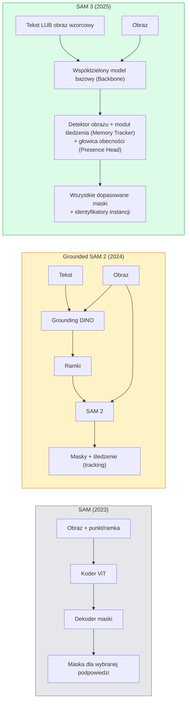

# SAM 3 i segmentacja w trybie open-vocabulary (Open-Vocabulary Segmentation)

> Podaj modelowi opis tekstowy (prompt) oraz obraz, aby w pojedynczym kroku przetwarzania (forward pass) uzyskać precyzyjne maski dla każdego pasującego obiektu.

**Typ lekcji:** Teoria + Praktyka
**Język:** Python
**Wymagania wstępne:** Faza 4, Lekcja 07 (U-Net); Faza 4, Lekcja 08 (Mask R-CNN); Faza 4, Lekcja 18 (CLIP)
**Czas wykonania:** ~60 minut

## Cele lekcji

- Zrozumiesz różnice między modelami SAM (wymagającym podpowiedzi wizualnych), Grounded SAM / SAM 2 (kaskada detektora i modelu SAM) oraz SAM 3 (obsługującym natywne podpowiedzi tekstowe za pomocą PCS – Promptable Concept Segmentation).
- Poznasz strukturę architektury SAM 3: współdzielony model bazowy (backbone), detektor obrazu, moduł śledzenia wideo (memory tracker), głowicę obecności (presence head) oraz rozdzieloną architekturę detekcji i śledzenia.
- Wykorzystasz integrację z biblioteką `transformers` (Hugging Face) do detekcji, segmentacji i śledzenia obiektów w wideo na podstawie opisów tekstowych za pomocą modelu SAM 3.
- Nauczysz się dobierać odpowiednie rozwiązanie (SAM 3, Grounded SAM 2, YOLO-World lub SAM-MI) w zależności od budżetu opóźnień, złożoności pojęć i platformy docelowej.

## Opis problemu

Pierwsza wersja SAM (Segment Anything Model, 2023) obsługiwała wyłącznie podpowiedzi wizualne (prompts): użytkownik musiał wskazać punkt myszką lub zakreślić ramkę (bounding box), aby model wygenerował maskę. W celu automatyzacji zadań typu „znajdź i zaznacz wszystkie pomarańcze na zdjęciu” należało połączyć dwa modele w kaskadę: detektor tekstu (np. Grounding DINO) generował ramki otaczające obiekty, które następnie przekazywano do modelu SAM w celu wyznaczenia masek (tzw. Grounded SAM). Takie podejście wprowadzało jednak problem kumulowania się błędów pomiędzy dwoma osobnymi, zamrożonymi modelami.

Model SAM 3 (Meta, pod koniec 2025 r.) eliminuje potrzebę stosowania kaskad. Akceptuje on krótką frazę rzeczownikową lub obraz wzorcowy (exemplar) jako podpowiedź i zwraca wszystkie pasujące maski oraz unikalne identyfikatory instancji (instance IDs) w pojedynczym kroku przetwarzania (forward pass). Zadanie to określa się jako **Promptable Concept Segmentation (PCS)**. W połączeniu z aktualizacją o nazwie Object Multiplex (wprowadzoną w SAM 3.1 w marcu 2026 r.) system pozwala na wydajne, jednoczesne śledzenie wielu wystąpień tej samej klasy w materiale wideo.

Lekcja ta opisuje tę istotną zmianę paradygmatu. Segmentacja 2D, detekcja obiektów oraz dopasowywanie tekstu do obrazu (grounding) zostały zintegrowane w jeden, spójny model. W zastosowaniach komercyjnych nie pytamy już, jak połączyć ze sobą poszczególne klocki w pipeline, lecz jak dobrać i skonfigurować model uniwersalny do naszego zadania.

## Koncepcje teoretyczne

### Trzy generacje modeli



### Segmentacja koncepcji na żądanie (Promptable Concept Segmentation - PCS)

„Podpowiedź koncepcyjna” (concept prompt) to krótka fraza rzeczownikowa (np. `"yellow school bus"`, `"striped red umbrella"`, `"hand holding a mug"`) lub obraz przykładowy (exemplar). Model lokalizuje i segmentuje wszystkie pasujące wystąpienia na obrazie, przypisując każdemu z nich unikalny identyfikator instancji.

Rozwiązanie to różni się od klasycznego modelu SAM trzema kluczowymi aspektami:

1. Jedna podpowiedź tekstowa wyodrębnia wszystkie wystąpienia danej klasy – nie ma potrzeby klikania każdego obiektu z osobna.
2. Otwarty słownik (Open-Vocabulary): zapytaniem może być dowolny obiekt opisany w języku naturalnym.
3. Jednoczesna detekcja wielu obiektów w jednym przebiegu sieci.

### Kluczowe elementy architektury

- **Współdzielony model bazowy (Backbone)**: pojedyncza sieć ViT przetwarza obraz wejściowy, dostarczając reprezentacje cech zarówno dla głowicy detekcyjnej, jak i modułu śledzącego opartego na pamięci.
- **Głowica obecności (Presence Head)**: moduł oceniający, czy poszukiwane pojęcie w ogóle znajduje się na obrazie. Rozdziela to etap klasyfikacji („czy dany obiekt tu jest?”) od lokalizacji („gdzie się znajduje?”), co drastycznie redukuje liczbę fałszywych detekcji.
- **Rozdzielony moduł detekcji i śledzenia (Decoupled Detector-Tracker)**: detekcja obiektów na pojedynczych klatkach i śledzenie w czasie (wideo) posiadają niezależne głowice predykcyjne, co zapobiega interferencji zadań.
- **Bank pamięci (Memory Bank)**: przechowuje cechy obiektów z poprzednich klatek w celu zapewnienia płynnego śledzenia (mechanizm zaadaptowany z SAM 2).

### Zbiory danych u uczenie na dużą skalę

Model SAM 3 został przeszkolony na bazie **4 milionów unikalnych pojęć**, wygenerowanych przez zaawansowany silnik danych (data engine) łączący automatyczne adnotacje sztucznej inteligencji z weryfikacją ludzką. Nowy zbiór ewaluacyjny **SA-CO** zawiera 270 tysięcy unikalnych pojęć, co stanowi 50-krotny wzrost rozmiaru w porównaniu do dotychczasowych testów open-vocabulary. SAM 3 osiąga w nim 75-80% skuteczności ludzkich analityków, deklasując dotychczasowe rozwiązania w zadaniach PCS dla obrazu i wideo.

### Mechanizm Object Multiplex w wersji SAM 3.1

Wprowadzony w marcu 2026 r. **Object Multiplex** dodaje mechanizm pamięci współdzielonej ułatwiający jednoczesne śledzenie wielu instancji tego samego obiektu. Wcześniejsze wersje dla N śledzonych obiektów tworzyły N osobnych instancji banków pamięci. Object Multiplex konsoliduje te zasoby w jedną strukturę z zapytaniami dla poszczególnych instancji, co radykalnie przyspiesza śledzenie wieloobiektowe (Multi-Object Tracking) bez negatywnego wpływu na jakość.

### Kiedy wciąż warto stosować Grounded SAM?

- Gdy istnieje potrzeba użycia innego, specyficznego detektora klasy open-vocabulary (np. DINO-X, Florence-2).
- Gdy ograniczenia licencyjne lub konieczność autoryzacji dostępu do wag SAM 3 (bramkowanie na Hugging Face) stanowią problem wdrożeniowy.
- Gdy wymagana jest precyzyjna, ręczna kontrola nad progami ufności detektora (czułością), czego monolityczny SAM 3 nie umożliwia.
- W celach badawczych i analizach wpływu poszczególnych komponentów (ablation studies) na działanie potoku.

Potoki modułowe zachowują swoją wartość w specyficznych warunkach, jednak dla większości komercyjnych wdrożeń znacznie prostszym i wydajniejszym wyborem jest SAM 3.

### Porównanie: YOLO-World a SAM 3

- **YOLO-World**: dedykowany wyłącznie do detekcji (bounding boxes) w czasie rzeczywistym klasy open-vocabulary. Zwraca wyłącznie ramki otaczające obiekty przy bardzo wysokim FPS.
- **SAM 3**: pełna segmentacja pikselowa (maski) wraz ze śledzeniem wideo. Model cięższy obliczeniowo, lecz dostarczający komplet danych o geometrii obiektów.

Podział wdrożeń komercyjnych: YOLO-World stosuje się tam, gdzie kluczowa jest czysta prędkość detekcji bez potrzeby wyznaczania masek (np. nawigacja robotów mobilnych, szybkie systemy ostrzegania), natomiast SAM 3 to domyślny wybór w zadaniach wymagających precyzyjnych obrysów obiektów lub śledzenia.

### Zoptymalizowana wersja SAM-MI

Architektura SAM-MI eliminuje wąskie gardło wydajnościowe dekodera masek w oryginalnym SAM. Kluczowe ulepszenia obejmują:

- **Rzadkie próbkowanie punktów (Sparse Point Prompts)**: wykorzystanie małego zestawu kluczowych punktów zamiast gęstej chmury reprezentacji, co redukuje liczbę zapytań do dekodera o 96%.
- **Agregacja płytkich masek (Shallow Mask Aggregation)**: łączenie zgrubnych predykcji w jedną wygładzoną, precyzyjną maskę.
- **Wstrzykiwanie odseparowanych cech maski (Decoupled Mask Injection)**: dekoder zasilany jest wstępnie wyliczonymi cechami masek, bez potrzeby ich ponownego generowania.

Rezultat: około 1.6-krotne przyspieszenie przetwarzania w porównaniu z klasycznym Grounded-SAM w testach benchmarkowych open-vocabulary.

### Spójny format danych wyjściowych

All wyznaczone wyżej architektury zwracają spójny format wyjściowy (współrzędne ramek, etykiety pojęciowe, stopnie ufności, maski segmentacji oraz identyfikatory instancji). Dzięki temu integracja z dalszymi modułami systemu nie wymaga rozgałęziania kodu w zależności od wybranego backendu.

## Implementacja krok po kroku

### Krok 1: Parser zapytań tekstowych (Prompt Parser)

Napiszemy prosty parser pomocniczy dzielący złożoną instrukcję użytkownika na pojedyncze frazy pojęciowe dla modelu SAM 3. Pozwala to na zmapowanie języka naturalnego na format oczekiwany przez sieć.

```python
def split_concepts(sentence):
    """
    Pomocniczy parser dla zapytań złożonych z wielu pojęć.
    Zwraca listę krótkich fraz rzeczownikowych.
    """
    for sep in [",", ";", "and", "or", "&"]:
        if sep in sentence:
            parts = [p.strip() for p in sentence.replace("and ", ",").split(",")]
            return [p for p in parts if p]
    return [sentence.strip()]

print(split_concepts("cats, dogs and balloons"))
```

Należy pamiętać, że SAM 3 przetwarza jedno pojęcie (concept) w pojedynczym kroku; w przypadku zapytań złożonych należy przetwarzać je w pętli lub paczkami (batching).

### Krok 2: Przetwarzanie końcowe i kompresja masek

Przekształcenie surowych wyników z modelu na ustrukturyzowaną listę detekcji, ułatwiającą przesyłanie i dalszą analizę.

```python
from dataclasses import dataclass
from typing import List

@dataclass
class ConceptDetection:
    concept: str
    instance_id: int
    box: tuple          # (x1, y1, x2, y2)
    score: float
    mask_rle: str       # kodowanie długości serii (Run-Length Encoded)

def rle_encode(binary_mask):
    flat = binary_mask.flatten().astype("uint8")
    runs = []
    prev, count = flat[0], 0
    for v in flat:
        if v == prev:
            count += 1
        else:
            runs.append((int(prev), count))
            prev, count = v, 1
    runs.append((int(prev), count))
    return ";".join(f"{v}x{c}" for v, c in runs)
```

Format kodowania RLE (Run-Length Encoding) pozwala na drastyczne zmniejszenie objętości danych wyjściowych przy przesyłaniu masek wysokiej rozdzielczości. Ten sam format kodowania jest standardem dla SAM 2, SAM 3 oraz Grounded SAM 2.

### Krok 3: Ujednolicony interfejs segmentacji Open-Vocabulary

Stworzenie abstrakcyjnej klasy bazowej pozwalającej na dynamiczną zmianę backendu detekcyjnego (np. SAM 3, Grounded SAM 2 czy YOLO-World + SAM 2) bez konieczności modyfikacji kodu aplikacji.

```python
from abc import ABC, abstractmethod
import numpy as np

class OpenVocabSeg(ABC):
    @abstractmethod
    def detect(self, image: np.ndarray, concept: str) -> List[ConceptDetection]:
        pass

class StubOpenVocabSeg(OpenVocabSeg):
    """
    Deterministyczna klasa testowa (mock) używana do sprawdzania potoku przetwarzania
    bez konieczności ładowania pełnych wag ciężkich modeli głębokich.
    """
    def detect(self, image, concept):
        h, w = image.shape[:2]
        return [
            ConceptDetection(
                concept=concept,
                instance_id=0,
                box=(w * 0.2, h * 0.3, w * 0.5, h * 0.8),
                score=0.89,
                mask_rle="0x100;1x50;0x200",
            ),
            ConceptDetection(
                concept=concept,
                instance_id=1,
                box=(w * 0.55, h * 0.25, w * 0.85, h * 0.75),
                score=0.74,
                mask_rle="0x80;1x40;0x220",
            ),
        ]
```

Wersja produkcyjna klasy `SAM3OpenVocabSeg` inicjalizowałaby pod spodem rzeczywiste obiekty `transformers.Sam3Model` oraz `Sam3Processor`.

### Krok 4: Wywołanie modelu SAM 3 przy użyciu Hugging Face (Przykład)

Przykładowy kod inicjalizacji i wnioskowania z oficjalnym modelem w bibliotece `transformers`:

```python
from transformers import Sam3Processor, Sam3Model
import torch

processor = Sam3Processor.from_pretrained("facebook/sam3")
model = Sam3Model.from_pretrained("facebook/sam3").eval()

inputs = processor(images=pil_image, return_tensors="pt")
inputs = processor.set_text_prompt(inputs, "yellow school bus")

with torch.no_grad():
    outputs = model(**inputs)

masks = processor.post_process_masks(
    outputs.masks, inputs.original_sizes, inputs.reshaped_input_sizes
)
boxes = outputs.boxes
scores = outputs.scores
```

Wszystkie dopasowania zwracane są w jednym kroku w ramach pojedynczego wywołania modelu.

### Porównanie wdrożeniowe: Grounded SAM 2 a SAM 3

Co zyskujemy, a co tracimy zastępując potok Grounded SAM 2 nowym modelem SAM 3?

- **Opóźnienie (Latency)**: SAM 3 eliminuje potrzebę wykonywania osobnego przebiegu sieci dla detektora (Grounding DINO), jednak sam model jest znacznie cięższy obliczeniowo. Ostateczny bilans czasowy jest zbliżony, czasami z lekką korzyścią dla SAM 3.
- **Dokładność (Accuracy)**: SAM 3 wykazuje nieporównywalnie wyższą precyzję przy wykrywaniu pojęć rzadkich oraz złożonych opisów atrybutów (np. „czerwony parasol w paski”). Dla pojedynczych, popularnych słów wyniki obu modeli są zbliżone.
- **Elastyczność (Flexibility)**: Grounded SAM 2 to potok modułowy pozwalający na łatwą wymianę modułu detekcji (np. na DINO-X, Florence-2 czy Grounding DINO 1.5). SAM 3 jest z kolei modelem w pełni monolitycznym.

Podsumowanie: SAM 3 staje się domyślnym wyborem dla segmentacji open-vocabulary. Potok Grounded SAM 2 pozostaje właściwym wyborem, jeśli wymagana jest specyficzna licencja lub możliwość wymiany komponentów detekcyjnych.

## Zastosowanie w praktyce

Rekomendowane scenariusze użycia:

- **Automatyczne adnotowanie danych**: integracja SAM 3 z narzędziami takimi jak CVAT. Analityk wprowadza nazwę klasy tekstowo, a model automatycznie generuje maski dla wszystkich pasujących obiektów na obrazie, co przyspiesza proces etykietowania.
- **Analiza materiałów wideo**: wykorzystanie mechanizmu SAM 3.1 Object Multiplex do płynnego i szybkiego śledzenia wielu obiektów jednocześnie w kolejnych klatkach filmu.
- **Sterowanie robotami (Robotics)**: wykorzystanie SAM 3 jako modułu percepcji do wykonywania instrukcji głosowych/tekstowych (np. „podnieś czerwony kubek” na podstawie obrazu z kamery chwytaka).
- **Medycyna**: wykorzystanie dedykowanych, dostrojonych wariantów SAM 3 do segmentacji struktur anatomicznych i patologii (dostęp do wag modeli wymaga akceptacji warunków licencyjnych Meta).

Integracja w pakiecie Ultralytics:

```python
from ultralytics import SAM

model = SAM("sam3.pt")
results = model(image_path, prompts="yellow school bus")
```

Umożliwia to korzystanie z tego samego interfejsu API, co w przypadku modeli YOLO oraz SAM 2.

## Materiały i pliki wyjściowe

W ramach tej lekcji przygotowano:

- `outputs/prompt-open-vocab-stack-picker.md` – szablon promptu ułatwiający dobór technologii (SAM 3 / Grounded SAM 2 / YOLO-World / SAM-MI) w zależności od budżetu opóźnień, złożoności pojęć i wymagań licencyjnych.
- `outputs/skill-concept-prompt-designer.md` – logika przetwarzająca potoczne zapytania użytkowników na precyzyjne podpowiedzi pojęciowe (concept prompts) interpretowane przez model SAM 3.

## Ćwiczenia praktyczne

1. **(Łatwe)** Uruchom model SAM 3 na zestawie 10 obrazów o zróżnicowanej tematyce, definiując dla nich podpowiedzi tekstowe. Porównaj uzyskane maski z kaskadą SAM 2 + Grounding DINO 1.5 i wskaż, które klasy obiektów sprawiły trudność poszczególnym modelom.
2. **(Średnie)** Zaprojektuj prosty interfejs użytkownika („zostaw / odrzuć”) na bazie detekcji z modelu SAM 3: prompt tekstowy wyznacza sugerowane obiekty, a kliknięcia użytkownika decydują o ich zachowaniu lub usunięciu. Zapisz finalnie zatwierdzone maski do pliku JSON.
3. **(Trudne)** Przeprowadź proces dostrajania (fine-tuning) modelu SAM 3 na specyficznym zbiorze danych (np. 5 typów drobnych podzespołów elektronicznych) dysponując 20 zaadnotowanymi obrazami dla każdej z klas. Porównaj precyzję modelu dostrojonego z wersją bazową (zero-shot) i oblicz zmianę metryki IoU wyjściowych masek.

## Słownik pojęć

| Pojęcie | Obiegowe rozumienie | Definicja techniczna |
|------|----------------|----------------------|
| Segmentacja open-vocabulary | „Segmentowanie tekstem” | Generowanie masek dla dowolnych obiektów opisanych słownie, bez ograniczania się do z góry zdefiniowanego zestawu klas |
| PCS (Promptable Concept Segmentation) | „Segmentacja pojęciowa na żądanie” | Podstawowe zadanie realizowane przez SAM 3: lokalizacja i segmentacja wszystkich obiektów odpowiadających podanemu opisowi tekstowemu lub obrazowi wzorcowemu |
| Podpowiedź pojęciowa (Concept Prompt) | „Tekst wejściowy / opis” | Krótkia fraza rzeczownikowa lub obraz przykładowy, precyzujący poszukiwaną klasę obiektów |
| Głowica obecności (Presence Head) | „Klasyfikator występowania” | Głowica sieci oceniająca prawdopodobieństwo obecności danej klasy na obrazie przed podjęciem próby jej dokładnego zlokalizowania |
| SA-CO | „Zbiór testowy SAM 3” | Zaawansowany zbiór benchmarkowy zawierający 270 tysięcy unikalnych pojęć, służący do weryfikacji modeli segmentacji open-vocabulary |
| Object Multiplex | „Wielobiektowe śledzenie w SAM 3.1” | Mechanizm konsolidacji danych śledzenia wielu obiektów we wspólnym banku pamięci, poprawiający prędkość działania w wideo |
| Grounded SAM 2 | „Potok modułowy (DINO + SAM)” | Kaskadowe połączenie niezależnego detektora i modelu SAM 2; zalecane w projektach wymagających elastycznej wymiany komponentu wykrywającego |
| SAM-MI | „Zoptymalizowana wersja SAM” | Zoptymalizowana odmiana architektury, która przyspiesza generowanie masek o około 1.6x w odniesieniu do Grounded-SAM |

## Literatura i materiały uzupełniające

- [SAM 3: Segment Anything with Concepts (2025)](https://arxiv.org/abs/2511.16719) – oficjalna publikacja naukowa wprowadzająca model SAM 3.
- [SAM 3.1 Object Multiplex (Meta AI, 2026)](https://ai.meta.com/blog/segment-anything-model-3/) – wpis na blogu Meta wprowadzający mechanizm współdzielenia pamięci dla śledzenia wideo.
- [Karta modelu SAM 3 na platformie Hugging Face](https://huggingface.co/facebook/sam3) – oficjalne wagi i przykłady użycia.
- [Grounded SAM 2 Tutorial (PyImageSearch)](https://pyimagesearch.com/2026/01/19/grounded-sam-2-from-open-set-detection-to-segmentation-and-tracking/) – praktyczny poradnik implementacji kaskady SAM 2 i detektorów.
- [Dokumentacja Ultralytics - SAM 3](https://docs.ultralytics.com/models/sam-3/) – integracja modelu SAM 3 w ekosystemie Ultralytics.
- [SAM3-I: Instruction-guided SAM (2025)](https://arxiv.org/abs/2512.04585) – rozwinięcie modelu o obsługę złożonych instrukcji językowych.
