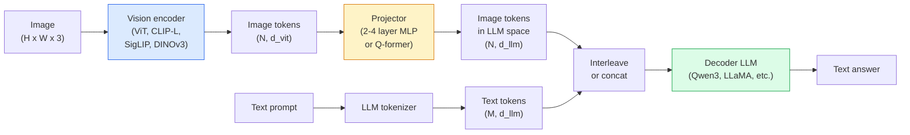

# Modele języka wizyjnego — wzorzec ViT-MLP-LLM

> Koder wizyjny konwertuje obraz na tokeny. Projektor MLP odwzorowuje te tokeny w przestrzeni osadzania LLM. Resztę zrobi model językowy. Ten wzór – ViT-MLP-LLM – to każdy produkcyjny VLM w 2026 roku.

**Wpisz:** Ucz się + Używaj
**Języki:** Python
**Wymagania wstępne:** Faza 4 Lekcja 14 (ViT), Faza 4 Lekcja 18 (CLIP), Faza 7 Lekcja 02 (Samouwaga)
**Czas:** ~75 minut

## Cele nauczania

- Podaj architekturę ViT-MLP-LLM i wyjaśnij, co wnosi każdy z trzech komponentów
- Porównaj Qwen3-VL, InternVL3.5, LLaVA-Next i GLM-4.6V pod względem liczby parametrów, długości kontekstu i wydajności w testach porównawczych
- Wyjaśnij DeepStack: dlaczego wielopoziomowe funkcje ViT lepiej zacieśniają dopasowanie języka do wizji niż pojedyncza funkcja ostatniej warstwy
- Zmierz halucynacje VLM podczas produkcji za pomocą współczynnika błędów międzymodalnych (CMER) i działaj na podstawie sygnału

## Problem

CLIP (Phase 4, lekcja 18) zapewnia wspólną przestrzeń do osadzania obrazów i tekstu, która jest wystarczająca do klasyfikacji i wyszukiwania typu zero-shot. Nie może odpowiedzieć na pytanie „ile czerwonych samochodów jest na tym obrazku?” ponieważ CLIP nie generuje tekstu — ocenia jedynie podobieństwa.

Modele języka wizyjnego (VLM) — Qwen3-VL, InternVL3.5, LLaVA-Next, GLM-4.6V — łączą koder obrazu z rodziny CLIP z modelem pełnego języka. Model widzi obraz plus pytanie i generuje odpowiedź. W 2026 r. VLM typu open source rywalizują z GPT-5 i Gemini-2.5-Pro ​​lub je pokonują w multimodalnych testach porównawczych (MMMU, MMBench, DocVQA, ChartQA, MathVista, OSWorld).

Trio elementów (ViT, projektor, LLM) to standard. Różnice między modelami dotyczą tego, w którym ViT, który projektor, jaki LLM, dane treningowe i przepis na wyrównanie. Kiedy już zrozumiesz wzór, zamiana dowolnego komponentu będzie mechaniczna.

## Koncepcja

### Architektura ViT-MLP-LLM



1. **Koder wizyjny** — wstępnie przeszkolony ViT (CLIP-L/14, SigLIP, DINOv3 lub wariant dostrojony). Tworzy żetony łatek.
2. **Projektor** — mały moduł (2-4-warstwowy MLP lub Q-former), który odwzorowuje żetony wizji na wymiar osadzania LLM. To tutaj odbywa się najwięcej dostrojeń.
3. **LLM** — model językowy składający się wyłącznie z dekodera (Qwen3, Llama, Mistral, GLM, InternLM). Odczytuje sekwencję wizji + żetony tekstu, generuje tekst.

Zasadniczo wszystkie trzy elementy można trenować. W praktyce koder wizyjny i LLM pozostają w większości zamrożone podczas trenowania projektora — kilka miliardów parametrów sygnału za niską cenę.

### DeepStack

Projekcja waniliowa wykorzystuje tylko ostatnią warstwę ViT. DeepStack (Qwen3-VL) próbkuje funkcje z wielu głębin ViT i układa je w stosy. Głębsze warstwy niosą semantykę wysokiego poziomu; płytsze warstwy niosą drobnoziarnistą informację przestrzenną i teksturalną. Wprowadzenie obu do LLM zamyka lukę między „co zawiera obraz” (semantyka) a „gdzie dokładnie” (uziemienie przestrzenne).

### Trzy etapy szkolenia

Nowoczesne VLM trenują etapami:

1. **Dopasowanie** — zamrożenie ViT i LLM. Trenuj projektor tylko w parach obraz-podpis. Uczy projektora mapowania przestrzeni widzenia na przestrzeń językową.
2. **Przedtreningowy** – odmroź wszystko. Trenuj na wielkoskalowych przeplatanych danych obrazowo-tekstowych (ponad 500 mln par). Buduje wiedzę wizualną modela.
3. **Dostosowywanie instrukcji** — dostrój wybrane trójki (obraz, pytanie, odpowiedź). Uczy zachowań konwersacyjnych i formatów zadań. To właśnie zmienia „świadomego wzroku LM” w użytecznego asystenta.

Większość LoRA dostosowuje docelowy etap 3 za pomocą małego, oznaczonego zestawu danych.

### Porównanie rodzin modeli (początek 2026 r.)

| Modelka | Parametry | Koder wizji | LLM | Kontekst | Mocne strony |
|-------|--------|----------------|-----|---------|----------------|
| Qwen3-VL-235B-A22B (MoE) | 235B (22B aktywne) | niestandardowe ViT + DeepStack | Qwen3 | 256 tys. | Ogólne SOTA, agent GUI |
| Qwen3-VL-30B-A3B (MoE) | 30B (3B aktywne) | niestandardowe ViT + DeepStack | Qwen3 | 256 tys. | Mniejsza alternatywa dla Ministerstwa Środowiska |
| Qwen3-VL-8B (gęsty) | 8B | niestandardowe ViT | Qwen3 | 128 tys. | Produkcja gęsta domyślnie |
| StażystaVL3.5-38B | 38B | StażystaViT-6B | Qwen3 + GPT-OSS | 128 tys. | Mocna MMBench / MMVet |
| StażystaVL3.5-241B-A28B | 241B (28B aktywne) | StażystaViT-6B | Qwen3 | 128 tys. | Konkurencyjny z GPT-4o |
| LLaVA-Next 72B | 72B | SigLIP | Lama-3 | 32 tys. | Otwarty, łatwy do dostrojenia |
| GLM-4,6V | ~70B | niestandardowe | GLM | 64 tys. | Open-source, silny OCR |
| MiniCPM-V-2.6 | 8B | SigLIP | MiniCPM | 32 tys. | Przyjazny krawędziom |

### Agenci wizualni

Qwen3-VL-235B osiąga najwyższą światową wydajność w OSWorld — benchmarku dla **agentów wizualnych** obsługujących GUI (komputery stacjonarne, urządzenia mobilne, strony internetowe). Model widzi zrzut ekranu, rozumie interfejs użytkownika i wykonuje akcje (kliknij, wpisz, przewiń). W połączeniu z narzędziami zamyka pętlę typowych zadań na komputerze. To właśnie pod maską działa większość wersji demonstracyjnych „AI PC” z 2026 roku.

### Możliwości agenta + warianty RoPE

VLM muszą wiedzieć, **kiedy** w filmie znajduje się klatka. Qwen3-VL ewoluowała od T-RoPE (czasowe osadzanie pozycji obrotowych) do **tekstowego wyrównania czasu** — wyraźnych tokenów tekstowych znaczników czasu przeplatanych klatkami wideo. Model widzi „`<timestamp 00:32>` ramkę, podpowiedź” i może wnioskować o relacjach czasowych.

### Problem z wyrównaniem

12% par obraz-tekst w przeszukanym zbiorze danych zawiera opisy, które nie są w pełni związane z obrazem. VLM przeszkolony w tym zakresie po cichu uczy się halucynacji — wytwarza obiekty, błędnie odczytuje liczby, wymyśla relacje. W produkcji jest to dominujący tryb awarii.

Skywork.ai wprowadziło **współczynnik błędów międzymodalnych (CMER)**, aby go śledzić:

```
CMER = fraction of outputs where the text confidence is high but the image-text similarity (via a CLIP-family checker) is low
```

Wysoki CMER oznacza, że modelka z pewnością mówi rzeczy, które nie są ugruntowane na obrazie. Monitorowanie CMER i traktowanie go jako produkcyjnego KPI zmniejszyło wskaźnik halucynacji o ~35% podczas ich wdrażania. Sztuka nie polega na „naprawieniu modelu”, ale na „przekazaniu wyników o dużej liczbie CMER do ręcznej weryfikacji”.

### Dostrajanie za pomocą LoRA / QLoRA

Pełne dostrojenie 70B VLM jest poza zasięgiem większości zespołów. LoRA (miejsce 16-64) na warstwach uwagi + projektora lub QLoRA z 4-bitowymi wagami podstawowymi, pasuje do pojedynczego A100 / H100. Koszt: 5 000–50 000 przykładów, $100-$5000 obliczeń, 2–10 godzin szkolenia.

### Rozumowanie przestrzenne jest wciąż słabe

Obecne VLM osiągają 50–60% wyników w testach porównawczych rozumowania przestrzennego (powyżej-poniżej, lewo-prawo, liczenie, odległość). Jeśli Twój przypadek użycia zależy od tego, „który obiekt znajduje się na wierzchu”, dokładnie sprawdź poprawność — ogólna wydajność VLM jest poniżej ludzkiej. Lepsze niż VLM alternatywy do zadań czysto przestrzennych: wyspecjalizowany estymator punktu kluczowego/pozycji, model głębokości lub model detekcji z przetworzoną później geometrią pudełkową.

## Zbuduj to

### Krok 1: Projektor

Część, którą będziesz trenować najczęściej. 2-4 warstwy MLP z GELU.

```python
import torch
import torch.nn as nn

class Projector(nn.Module):
    def __init__(self, vit_dim=768, llm_dim=4096, hidden=4096):
        super().__init__()
        self.net = nn.Sequential(
            nn.Linear(vit_dim, hidden),
            nn.GELU(),
            nn.Linear(hidden, llm_dim),
        )

    def forward(self, x):
        return self.net(x)
```

Dane wejściowe to tensor tokena `(N_patches, d_vit)`. Dane wyjściowe to `(N_patches, d_llm)`. LLM traktuje każdy wiersz wyjściowy jako kolejny token.

### Krok 2: Zmontuj ViT-MLP-LLM od końca do końca

Szkielet podania w przód dla minimalnego VLM. Prawdziwy kod używa `transformers`; to jest układ koncepcyjny.

```python
class MinimalVLM(nn.Module):
    def __init__(self, vit, projector, llm, image_token_id):
        super().__init__()
        self.vit = vit
        self.projector = projector
        self.llm = llm
        self.image_token_id = image_token_id  # placeholder token in text prompt

    def forward(self, image, input_ids, attention_mask):
        # 1. vision features
        vision_tokens = self.vit(image)                     # (B, N_patches, d_vit)
        vision_embeds = self.projector(vision_tokens)       # (B, N_patches, d_llm)

        # 2. text embeddings
        text_embeds = self.llm.get_input_embeddings()(input_ids)  # (B, M, d_llm)

        # 3. replace image placeholder tokens with vision embeds
        merged = self._merge(text_embeds, vision_embeds, input_ids)

        # 4. run LLM
        return self.llm(inputs_embeds=merged, attention_mask=attention_mask)

    def _merge(self, text_embeds, vision_embeds, input_ids):
        out = text_embeds.clone()
        expected = vision_embeds.size(1)
        for b in range(input_ids.size(0)):
            positions = (input_ids[b] == self.image_token_id).nonzero(as_tuple=True)[0]
            if len(positions) != expected:
                raise ValueError(
                    f"batch item {b} has {len(positions)} image tokens but vision_embeds has {expected} patches."
                    " Every sample in the batch must be pre-padded to the same number of image placeholder tokens.")
            out[b, positions] = vision_embeds[b]
        return out
```

Token zastępczy `<image>` w tekście zostaje zastąpiony osadzonymi obrazami rzeczywistymi — ten sam wzorzec jest używany przez LLaVA, Qwen-VL i InternVL.

### Krok 3: Obliczenie CMER

Lekka kontrola środowiska wykonawczego.

```python
import torch.nn.functional as F

def cross_modal_error_rate(image_emb, text_emb, text_confidence, sim_threshold=0.25, conf_threshold=0.8):
    """
    image_emb, text_emb: embeddings of image and generated text (normalised internally)
    text_confidence:     mean per-token probability in [0, 1]
    Returns:             fraction of high-confidence outputs with low image-text alignment
    """
    image_emb = F.normalize(image_emb, dim=-1)
    text_emb = F.normalize(text_emb, dim=-1)
    sim = (image_emb * text_emb).sum(dim=-1)        # cosine similarity
    high_conf_low_sim = (text_confidence > conf_threshold) & (sim < sim_threshold)
    return high_conf_low_sim.float().mean().item()
```

Traktuj CMER jako produkcyjny KPI. Monitoruj go dla każdego punktu końcowego, dla każdego typu podpowiedzi i dla każdego klienta. Rosnący CMER wskazuje, że model zaczyna mieć halucynacje na temat pewnego rozkładu danych wejściowych.

### Krok 4: Zabawkowy klasyfikator VLM (możliwy do uruchomienia)

Zademonstruj pociągi z projektorem. Wchodzą fałszywe „funkcje ViT”; mały token w stylu LLM przewiduje klasę.

```python
class ToyVLM(nn.Module):
    def __init__(self, vit_dim=32, llm_dim=64, num_classes=5):
        super().__init__()
        self.projector = Projector(vit_dim, llm_dim, hidden=64)
        self.head = nn.Linear(llm_dim, num_classes)

    def forward(self, vision_tokens):
        projected = self.projector(vision_tokens)
        pooled = projected.mean(dim=1)
        return self.head(pooled)
```

Można to dopasować do par syntetycznych (cecha, klasa) w mniej niż 200 krokach — wystarczy to, aby pokazać, że wzór projektora działa.

## Użyj tego

Trzy sposoby, w jakie zespoły produkcyjne wykorzystują VLM w 2026 r.:

- **Hosted API** — OpenAI Vision, Anthropic Claude Vision, Google Gemini Vision. Zero infrastruktury, ryzyko dostawcy.
- **Własny host typu open source** — Qwen3-VL lub InternVL3.5 poprzez `transformers` i `vllm`. Pełna kontrola, większy wysiłek z przodu.
- **Dostosuj domenę** — załaduj Qwen2.5-VL-7B lub LLaVA-1.6-7B, LoRA na niestandardowych przykładach od 5 tys. do 50 tys., podawaj z `vllm` lub `TGI`.

```python
from transformers import AutoProcessor, AutoModelForVision2Seq
import torch
from PIL import Image

model_id = "Qwen/Qwen3-VL-8B-Instruct"
processor = AutoProcessor.from_pretrained(model_id)
model = AutoModelForVision2Seq.from_pretrained(model_id, torch_dtype=torch.bfloat16, device_map="auto")

messages = [{
    "role": "user",
    "content": [
        {"type": "image", "image": Image.open("plot.png")},
        {"type": "text", "text": "What does this chart show?"},
    ],
}]
inputs = processor.apply_chat_template(messages, add_generation_prompt=True, tokenize=True, return_dict=True, return_tensors="pt").to("cuda")
generated = model.generate(**inputs, max_new_tokens=256)
answer = processor.decode(generated[0][inputs["input_ids"].shape[1]:], skip_special_tokens=True)
```

`apply_chat_template` ukrywa tokenizację symbolu zastępczego `<image>`; model obsługuje scalanie wewnętrznie.

## Wyślij to

Ta lekcja daje:

- `outputs/prompt-vlm-selector.md` — wybiera Qwen3-VL / InternVL3.5 / LLaVA-Next / API biorąc pod uwagę dokładność, opóźnienie, długość kontekstu i budżet.
- `outputs/skill-cmer-monitor.md` — emituje kod w celu instrumentacji produkcyjnego punktu końcowego VLM z współczynnikiem błędów międzymodalnych, pulpitami nawigacyjnymi dla poszczególnych punktów końcowych i progami alertów.

## Ćwiczenia

1. **(Łatwe)** Uruchom trzy podpowiedzi („co to jest?”, „policz obiekty”, „opisz scenę”) w dowolnym otwartym VLM na pięciu obrazach. Oceń każdą odpowiedź jako poprawną / częściowo poprawną / halucynację ręcznie. Oblicz szybkość pierwszego przejścia podobną do CMER.
2. **(Średni)** Dostosuj Qwen2.5-VL-3B lub LLaVA-1.6-7B z LoRA (ranga 16) na 500 obrazach domeny docelowej z podpisami. Porównaj dokładność zerową z precyzyjnie dostrojoną dokładnością w stylu MMBench.
3. **(Twardy)** Wymień koder obrazu VLM na DINOv3 zamiast domyślnego SigLIP/CLIP. Przetrenuj ponownie tylko projektor (zamrożony LLM + zamrożony DINOv3). Zmierz, czy zadania polegające na gęstym przewidywaniu (liczenie, rozumowanie przestrzenne) uległy poprawie.

## Kluczowe terminy

| Termin | Co ludzie mówią | Co to właściwie oznacza |
|------|----------------|----------------------|
| ViT-MLP-LLM | „Wzór VLM” | Koder wizyjny + projektor + model językowy; każdy VLM 2026 |
| Projektor | „Most” | 2-4-warstwowy MLP (lub Q-former), który odwzorowuje żetony wizji w przestrzeń osadzania LLM |
| DeepStack | „Sztuczka z funkcją Qwen3-VL” | Wielopoziomowe funkcje ViT ułożone w stos, a nie tylko w ostatniej warstwie |
| Token obrazu | „<image> symbol zastępczy” | Specjalny token w strumieniu tekstu zastąpiony osadzonymi obrazami rzutowanymi |
| CMER | „KPI halucynacji” | Współczynnik błędów międzymodalnych; wysoki, gdy pewność tekstu jest wysoka, ale podobieństwo obrazu do tekstu jest niskie |
| Agent wizualny | „VLM, który klika” | GUI operacyjne VLM (OSWorld, mobile, web) z wywołaniami narzędzi |
| Q-były | „Most tokenowy o stałej liczbie” | Projektor w stylu BLIP-2 generujący stałą liczbę wizualnych tokenów zapytań |
| Wyrównanie / przedtreningówka / strojenie instrukcji | „Trzy etapy” | Standardowy proces szkolenia VLM |

## Dalsze czytanie

- [Raport techniczny Qwen3-VL (arXiv 2511.21631)](https://arxiv.org/abs/2511.21631)
— [InternVL3.5 Zaawansowane modele multimodalne typu open source (arXiv 2508.18265)](https://arxiv.org/html/2508.18265v1)
– [Seria LLaVA-Next](https://llava-vl.github.io/blog/2024-05-10-llava-next-stronger-llms/)
- [BentoML: Najlepsze VLM typu open source 2026](https://www.bentoml.com/blog/multimodal-ai-a-guide-to-open-source-vision-language-models)
— [MMMU: wielodyscyplinarny test porównawczy zrozumienia multimodalnego](https://mmmu-benchmark.github.io/)
– [VLM w produkcji (Robotics Tomorrow, marzec 2026 r.)](https://www.roboticsstomorrow.com/story/2026/03/when-machines-learn-to-see-like-experts-the-rise-of-vision-language-models-in-manufacturing/26335/)