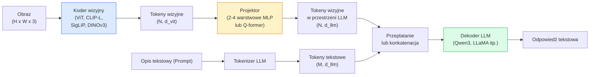

# Modele wizyjno-językowe (Vision-Language Models - VLM) i wzorzec ViT-MLP-LLM

> Koder wizyjny (vision encoder) przekształca obraz wejściowy w tokeny wizyjne. Projektor MLP rzutuje te reprezentacje w przestrzeń osadzeń (embeddingów) modelu językowego LLM. Następnie dekoder LLM generuje odpowiedź tekstową. Ten sprawdzony schemat – ViT-MLP-LLM – stanowi fundament praktycznie każdego produkcyjnego modelu klasy VLM w 2026 roku.

**Typ lekcji:** Teoria + Praktyka
**Język:** Python
**Wymagania wstępne:** Faza 4, Lekcja 14 (ViT); Faza 4, Lekcja 18 (CLIP); Faza 7, Lekcja 02 (Self-Attention / Samouwaga)
**Czas wykonania:** ~75 minut

## Cele lekcji

- Poznasz strukturę architektury ViT-MLP-LLM i zrozumiesz rolę każdego z trzech głównych komponentów.
- Porównasz wiodące modele: Qwen3-VL, InternVL3.5, LLaVA-Next oraz GLM-4.6V pod kątem liczby parametrów, długości kontekstu oraz wyników w testach benchmarkowych.
- Zrozumiesz zasadę działania mechanizmu DeepStack i dowiesz się, jak ekstrakcja cech z wielu warstw ViT poprawia dopasowanie reprezentacji wizualnych do przestrzeni tekstowej.
- Zaimplementujesz pomiar wskaźnika halucynacji w systemach produkcyjnych za pomocą metryki CMER (Cross-Modal Error Rate) i nauczysz się reagować na anomalie.

## Opis problemu

Model CLIP (Faza 4, Lekcja 18) uczy wspólnej przestrzeni reprezentacji dla obrazów i tekstów, co w zupełności wystarcza do klasyfikacji obrazów typu zero-shot oraz wyszukiwania. Nie potrafi on jednak odpowiedzieć na bardziej złożone pytania (np. „ile czerwonych samochodów znajduje się na zdjęciu?”), ponieważ nie generuje tekstu – potrafi jedynie oceniać geometryczne podobieństwo par.

Modele wizyjno-językowe (VLM), takie jak Qwen3-VL, InternVL3.5, LLaVA-Next czy GLM-4.6V, łączą koder obrazów (pochodzący z rodziny CLIP/SigLIP) z pełnowymiarowym dekoderem językowym (LLM). Taki model analizuje obraz oraz powiązane z nim pytanie i generuje pełne odpowiedzi tekstowe. W 2026 roku zaawansowane modele VLM typu open-source bezpośrednio konkurują z zamkniętymi komercyjnymi systemami, takimi jak GPT-5 czy Gemini-2.5-Pro, a w wielu benchmarkach (np. MMMU, DocVQA, ChartQA, MathVista, OSWorld) osiągają nawet lepsze rezultaty.

Trio komponentów (ViT, projektor, LLM) to powszechny standard. Różnice między modelami tkwią w wyborze konkretnych architektur składowych, danych szkoleniowych oraz procesie wyrównywania (alignment). Zrozumienie tego schematu pozwala na elastyczną i mechaniczną wymianę poszczególnych elementów.

## Koncepcje teoretyczne

### Architektura ViT-MLP-LLM



1. **Koder wizyjny (Vision Encoder)**: wstępnie przeszkolony model ViT (np. CLIP-L/14, SigLIP, DINOv3). Dzieli obraz na wycinki (patches) i koduje je na tokeny wizyjne.
2. **Projektor**: niewielki blok (najczęściej 2-4 warstwowa sieć MLP lub moduł Q-Former), który mapuje wymiar tokenów wizyjnych na przestrzeń osadzeń dekodera LLM. To ten element podlega najczęstszemu dostrajaniu.
3. **Dekoder LLM**: model językowy (np. Qwen3, Llama, GLM, InternLM) przetwarzający złączone sekwencje tokenów tekstowych oraz rzutowanych tokenów wizyjnych w celu wygenerowania odpowiedzi.

Choć teoretycznie wszystkie trzy komponenty mogą być optymalizowane jednocześnie, w praktyce na początkowych etapach koder wizyjny oraz dekoder LLM są zamrażane. Uczenie skupia się na samym projektorze, co stanowi wysoce efektywny kosztowo kompromis obliczeniowy.

### Koncepca wielowarstwowej ekstrakcji DeepStack

Standardowe podejście przekazuje do projektora cechy wyłącznie z ostatniej warstwy kodera ViT. Rozwiązanie typu DeepStack (stosowane m.in. w Qwen3-VL) pobiera reprezentacje cech z warstw o różnej głębokości i łączy je ze sobą. Głębsze warstwy kodują semantykę wysokiego poziomu, podczas gdy warstwy płytsze zachowują drobnoziarnistą geometrię, tekstury i lokalizację obiektów. Przekazanie tak bogatego spektrum cech do LLM pozwala na jednoczesne rozpoznawanie obiektów (semantyka) oraz precyzyjne określanie ich pozycji przestrzennej (grounding).

### Trzy etapy uczenia modeli VLM

Współczesne modele VLM uczy się wieloetapowo:

1. **Dopasowanie przestrzeni (Alignment / Pre-alignment)**: przy zamrożonych wagach ViT oraz LLM trenuje się wyłącznie projektor na parach obraz-opis (captions). Etap ten uczy model mapowania reprezentacji wizyjnych na przestrzeń tekstową.
2. **Wstępne uczenie (Pre-training)**: odblokowanie wszystkich wag (unfreezing) i uczenie całego modelu na potężnych, przeplatanych zbiorach obrazów i tekstów (często rzędu 500M+ par). Buduje to bazową wiedzę multimodalną modelu.
3. **Dostrojenie do instrukcji (Instruction Tuning)**: uczenie na wyselekcjonowanych trójkach (obraz, pytanie, odpowiedź). Krok ten dostosowuje model do prowadzenia dialogu i rozwiązywania konkretnych zadań, czyniąc go asystentem.

Większość wdrożeń komercyjnych wykorzystuje adaptery LoRA do dostrojenia modelu na etapie 3 na własnym, specyficznym zbiorze danych.

### Porównanie wiodących rodzin modeli (stan na 2026 rok)

| Nazwa modelu | Liczba parametrów | Koder wizyjny | Model LLM | Długość kontekstu | Główne zalety |
|-------|--------|----------------|-----|---------|----------------|
| Qwen3-VL-235B-A22B (MoE) | 235B (22B aktywne) | Dedykowany ViT + DeepStack | Qwen3 | 256k | Najwyższa ogólna jakość (SOTA), agenci GUI |
| Qwen3-VL-30B-A3B (MoE) | 30B (3B aktywne) | Dedykowany ViT + DeepStack | Qwen3 | 256k | Zoptymalizowany, lekki wariant klasy MoE |
| Qwen3-VL-8B (dense) | 8B | Dedykowany ViT | Qwen3 | 128k | Domyślny, wydajny model produkcyjny |
| InternVL3.5-38B | 38B | InternViT-6B | Qwen3 / GPT-OSS | 128k | Wybitne wyniki w MMBench / MMVet |
| InternVL3.5-241B-A28B | 241B (28B aktywne) | InternViT-6B | Qwen3 | 128k | Bezpośredni konkurent modeli komercyjnych (GPT-4o) |
| LLaVA-Next 72B | 72B | SigLIP | LLaMA-3 | 32k | W pełni otwarty kod, łatwy w dostrajaniu |
| GLM-4.6V | ~70B | Dedykowany | GLM | 64k | Doskonałe wyniki w zadaniach OCR |
| MiniCPM-V-2.6 | 8B | SigLIP | MiniCPM | 32k | Zoptymalizowany pod urządzenia brzegowe |

### Koncepcja agentów wizualnych (Visual Agents)

Qwen3-VL-235B osiąga doskonałe wyniki w benchmarku OSWorld dedykowanym dla **agentów wizualnych** sterujących interfejsami graficznymi (GUI) systemów operacyjnych, urządzeń mobilnych oraz stron internetowych. Model na podstawie zrzut ekranu analizuje stan interfejsu i generuje sekwencje akcji (np. kliknięcie, wpisanie tekstu, przewinięcie). W połączeniu z zewnętrznym środowiskiem wykonawczym pozwala to na automatyzację pracy na komputerze. To właśnie te rozwiązania stanowią serce systemów klasy „AI PC” w 2026 roku.

### Kodowanie czasu: RoPE i znaczniki czasowe

W przetwarzaniu wideo modele VLM muszą precyzyjnie przypisywać klatki do osi czasu. Architektura Qwen3-VL ewoluowała od T-RoPE (temporalnych obrotowych kodowań pozycyjnych) do **tekstowego kodowania znaczników czasu** (textual time alignment) – jawnych znaczników czasu wplecionych pomiędzy klatki wideo. Model analizuje sekwencję w formacie `[<timestamp 00:32>, tokeny_obrazu]` co pozwala mu na poprawne wnioskowanie o dynamice zmian i relacjach czasowych.

### Zjawisko halucynacji w modelach VLM

Około 12% par obraz-tekst w masowo pobieranych zbiorach danych treningowych zawiera opisy niezwiązane bezpośrednio z zawartością graficzną. Uczenie na takich zaszumionych parach prowadzi do powstawania halucynacji – model z pełnym przekonaniem opisuje obiekty, których nie ma na obrazie, błędnie interpretuje wartości numeryczne lub zniekształca relacje przestrzenne. Jest to główny problem wdrożeń produkcyjnych.

Zespół Skywork.ai zaproponował metrykę **CMER (Cross-Modal Error Rate)** do monitorowania tego zjawiska:

```
CMER = odsetek odpowiedzi, dla których pewność wygenerowanego tekstu (prawdopodobieństwo tokenów) jest wysoka, lecz geometryczne podobieństwo obrazu do tekstu (wyznaczone zewnętrznym modelem CLIP) jest niskie
```

Wysoka wartość CMER wskazuje, że model generuje odpowiedzi z dużą pewnością siebie, lecz bez odniesienia do faktów na obrazie. Wdrożenie monitorowania wskaźnika CMER jako produkcyjnego KPI pozwala na wczesne wykrywanie anomalii i automatyczne przekazywanie podejrzanych rekordów do weryfikacji przez człowieka, co w praktyce zmniejsza liczbę błędy w systemie o około 35%.

### Dostrajanie za pomocą adapterów LoRA / QLoRA

Pełny proces fine-tuning modelu o rozmiarze 70B przekracza możliwości sprzętowe większości projektów. Standardem jest stosowanie adapterów LoRA (o randze 16-64) nakładanych na warstwy atencji oraz projektor, bądź techniki QLoRA (wykorzystującej 4-bitową kwantyzację wag bazowych). Pozwala to na uruchomienie uczenia na pojedynczej karcie graficznej klasy A100 / H100. Wymagany zbiór danych to od 5 000 do 50 000 przykładów, przy budżecie obliczeniowym rzędu 100 - 5000 USD i czasie uczenia od 2 do 10 godzin.

### Ograniczenia w rozumowaniu przestrzennym

Współczesne modele VLM osiągają zaledwie 50–60% poprawności w testach rozumowania przestrzennego (relacje typu góra-dół, lewo-prawo, szacowanie odległości i precyzyjne liczenie). Jeżeli Twoja aplikacja krytycznie zależy od takich zależności, należy dokładnie zweryfikować jakość modeli – ogólna skuteczność VLM jest tu znacznie niższa niż ludzka. W takich scenariuszach lepszym i stabilniejszym rozwiązaniem bywa użycie wyspecjalizowanych modeli detekcji obiektów lub estymacji głębi połączonych z prostą analizą geometryczną współrzędnych ramek otaczających.

## Implementacja krok po kroku

### Krok 1: Implementacja projektora cech (Projector)

Zaimplementujemy prosty blok projektora – najczęściej modyfikowany i trenowany element systemu. Jest to sieć MLP z funkcją aktywacji GELU.

```python
import torch
import torch.nn as nn

class Projector(nn.Module):
    def __init__(self, vit_dim=768, llm_dim=4096, hidden=4096):
        super().__init__()
        self.net = nn.Sequential(
            nn.Linear(vit_dim, hidden),
            nn.GELU(),
            nn.Linear(hidden, llm_dim),
        )

    def forward(self, x):
        return self.net(x)
```

Dane wejściowe mają wymiary `(N_patches, d_vit)`, natomiast dane wyjściowe – `(N_patches, d_llm)`. Dekoder LLM interpretuje każdy przetworzony wiersz jako kolejną reprezentację tokena wejściowego.

### Krok 2: Scalenie potoku przetwarzania ViT-MLP-LLM

Poniższy kod ilustruje schemat przepływu danych (forward pass) w uproszczonym modelu VLM. W rzeczywistych wdrożeniach zadanie to obsługuje biblioteka `transformers`.

```python
class MinimalVLM(nn.Module):
    def __init__(self, vit, projector, llm, image_token_id):
        super().__init__()
        self.vit = vit
        self.projector = projector
        self.llm = llm
        self.image_token_id = image_token_id  # token zastępczy w opisie tekstowym

    def forward(self, image, input_ids, attention_mask):
        # 1. Ekstrakcja cech wizualnych
        vision_tokens = self.vit(image)                     # (B, N_patches, d_vit)
        vision_embeds = self.projector(vision_tokens)       # (B, N_patches, d_llm)

        # 2. Pobranie embeddingów dla tekstu
        text_embeds = self.llm.get_input_embeddings()(input_ids)  # (B, M, d_llm)

        # 3. Zastąpienie tokenów zastępczych (placeholders) tokenami wizyjnymi
        merged = self._merge(text_embeds, vision_embeds, input_ids)

        # 4. Uruchomienie dekodera LLM
        return self.llm(inputs_embeds=merged, attention_mask=attention_mask)

    def _merge(self, text_embeds, vision_embeds, input_ids):
        out = text_embeds.clone()
        expected = vision_embeds.size(1)
        for b in range(input_ids.size(0)):
            positions = (input_ids[b] == self.image_token_id).nonzero(as_tuple=True)[0]
            if len(positions) != expected:
                raise ValueError(
                    f"batch item {b} has {len(positions)} image tokens but vision_embeds has {expected} patches."
                    " Every sample in the batch must be pre-padded to the same number of image placeholder tokens.")
            out[b, positions] = vision_embeds[b]
        return out
```

Zastąpienie tokenu zastępczego (place holder) typu `<image>` w sekwencji tekstowej wyjściowymi wektorami cech z projektora to uniwersalny mechanizm stosowany w modelach LLaVA, Qwen-VL oraz InternVL.

### Krok 3: Obliczanie wskaźnika CMER

Implementacja prostej funkcji monitorującej zbieżność multimodalną.

```python
import torch.nn.functional as F

def cross_modal_error_rate(image_emb, text_emb, text_confidence, sim_threshold=0.25, conf_threshold=0.8):
    """
    image_emb, text_emb: embeddingi obrazu i wygenerowanego tekstu (normalizowane wewnątrz funkcji)
    text_confidence:     średnie prawdopodobieństwo wygenerowanych tokenów tekstowych w przedziale [0, 1]
    Zwraca:             odsetek pewnych siebie predykcji o niskiej spójności z obrazem
    """
    image_emb = F.normalize(image_emb, dim=-1)
    text_emb = F.normalize(text_emb, dim=-1)
    sim = (image_emb * text_emb).sum(dim=-1)        # podobieństwo cosinusowe
    high_conf_low_sim = (text_confidence > conf_threshold) & (sim < sim_threshold)
    return high_conf_low_sim.float().mean().item()
```

Wskaźnik CMER warto wdrożyć jako standardowy produkcyjny KPI. Jego monitoring w podziale na punkty końcowe i wersje modeli pozwala na szybkie wykrycie momentu, w którym sieć zaczyna generować halucynacje dla nietypowych danych wejściowych.

### Krok 4: Uproszczony model demonstracyjny (Toy VLM)

Przykładowa implementacja pokazująca mechanizm uczenia samego projektora cech przy użyciu sztucznych reprezentacji ViT.

```python
class ToyVLM(nn.Module):
    def __init__(self, vit_dim=32, llm_dim=64, num_classes=5):
        super().__init__()
        self.projector = Projector(vit_dim, llm_dim, hidden=64)
        self.head = nn.Linear(llm_dim, num_classes)

    def forward(self, vision_tokens):
        projected = self.projector(vision_tokens)
        pooled = projected.mean(dim=1)
        return self.head(pooled)
```

Model ten uczy się dopasowania cech syntetycznych do klas w niecałe 200 kroków optymalizacji, co dowodzi poprawności działania projektora.

## Zastosowanie w praktyce

Trzy podstawowe ścieżki wdrożeniowe w 2026 roku:

- **Zewnętrzne API (Hosted API)**: integracja z chmurowymi modelami firm Meta, OpenAI, Anthropic czy Google. Rozwiązanie niewymagające infrastruktury sprzętowej, wiążące się jednak z opłatami za zapytania i zależnością od dostawcy.
- **Uruchomienie własnego modelu open-source**: wdrażanie modeli Qwen3-VL lub InternVL3.5 za pomocą biblioteki `transformers` oraz serwerów `vllm`. Zapewnia pełną kontrolę i prywatność danych, kosztem konieczności zarządzania własnymi serwerami GPU.
- **Dostrojenie dziedzinowe**: pobranie modelu bazowego (np. Qwen3-VL-8B lub LLaVA-Next-8B) i dotrenowanie go za pomocą adaptera LoRA na zestawie od 5 000 do 50 000 własnych próbek, a następnie serwowanie za pomocą silników `vllm` lub `TGI` (Text Generation Inference).

```python
from transformers import AutoProcessor, AutoModelForVision2Seq
import torch
from PIL import Image

model_id = "Qwen/Qwen3-VL-8B-Instruct"
processor = AutoProcessor.from_pretrained(model_id)
model = AutoModelForVision2Seq.from_pretrained(model_id, torch_dtype=torch.bfloat16, device_map="auto")

messages = [{
    "role": "user",
    "content": [
        {"type": "image", "image": Image.open("plot.png")},
        {"type": "text", "text": "What does this chart show?"},
    ],
}]
inputs = processor.apply_chat_template(messages, add_generation_prompt=True, tokenize=True, return_dict=True, return_tensors="pt").to("cuda")
generated = model.generate(**inputs, max_new_tokens=256)
answer = processor.decode(generated[0][inputs["input_ids"].shape[1]:], skip_special_tokens=True)
```

Metoda `apply_chat_template` automatycznie zarządza wstawianiem tokenów zastępczych `<image>` i tokenizacją, a silnik modelu realizuje scalanie wektorów pod spodem.

## Materiały i pliki wyjściowe

W ramach tej lekcji przygotowano:

- `outputs/prompt-vlm-selector.md` – szablon promptu ułatwiający dobór modelu VLM (Qwen3-VL / InternVL3.5 / LLaVA-Next / komercyjne API) na podstawie ograniczeń budżetowych, wymagań jakościowych i długości kontekstu.
- `outputs/skill-cmer-monitor.md` – kod i wytyczne do opomiarowania produkcyjnych punktów końcowych metryką CMER, wraz z definicją progów alarmowych i dashboardów monitorujących halucynacje.

## Ćwiczenia praktyczne

1. **(Łatwe)** Przetestuj trzy rodzaje zapytań („co to za obiekt?”, „policz obiekty na obrazie”, „szczegółowy opis sceny”) na wybranym otwartym modelu VLM dla 5 different obrazów. Oceń ręcznie każdą odpowiedź (jako poprawną, częściowo poprawną lub halucynację) i spróbuj odnieść to do wyliczonych prawdopodobieństw tokenów.
2. **(Średnie)** Przeprowadź proces dostrajania (fine-tuning) modelu klasy Qwen2.5-VL-3B lub LLaVA-1.6-7B przy użyciu adaptera LoRA (ranga 16) na zbiorze 500 specjalistycznych obrazów z opisami. Porównaj wyniki generacji z modelem bazowym (zero-shot).
3. **(Trudne)** Zastąp koder obrazów w modelu VLM nowszym koderem DINOv3 (zamiast standardowego SigLIP/CLIP). Przetrenuj wyłącznie projektor cech (przy zamrożonym koderze wizyjnym i dekoderze LLM). Zweryfikuj, czy jakość zadań wymagających precyzji przestrzennej (liczenie, relacje obiektów) uległa poprawie.

## Słownik pojęć

| Pojęcie | Obiegowe rozumienie | Definicja techniczna |
|------|----------------|----------------------|
| ViT-MLP-LLM | „Standard budowy VLM” | Konstrukcja oparta na koderze wizyjnym ViT, projektorze mapującym oraz dekoderze językowym LLM; powszechny standard w 2026 roku |
| Projektor (Projector) | „Mostek reprezentacji” | Sieć MLP lub blok Q-Former mapujący wyjściowe cechy wizyjne na przestrzeń wektorową (embeddingi) przetwarzaną przez LLM |
| DeepStack | „Ekstrakcja wielowarstwowa” | Metoda pobierania i scalania cech z warstw o różnej głębokości kodera ViT w celu zachowania informacji semantycznych oraz geometrycznych |
| Token obrazu (Image Token) | „Znak zastępczy obrazu” | Specjalny znacznik (placeholder, np. `<image>`) w tekście wejściowym, który na etapie przygotowywania tensorów jest podmieniany na wyjściowe wektory z projektora cech wizyjnych |
| CMER (Cross-Modal Error Rate) | „Wskaźnik halucynacji” | Metryka określająca odsetek predykcji, w których model generuje tekst z wysoką pewnością siebie, lecz wyjściowy opis wykazuje niskie podobieństwo geometryczne do obrazu wejściowego |
| Agent wizualny (Visual Agent) | „Autonomiczny asystent GUI” | Model VLM zoptymalizowany pod kątem analizy zrzutów ekranu i generowania precyzyjnych akcji sterujących interfejsem graficznym systemów operacyjnych lub aplikacji |
| Q-Former | „Blok kwantyzacji tokenów” | Zaawansowany projektor cech (wywodzący się z modelu BLIP-2) kompresujący zmienną liczbę cech obrazu do stałej liczby tokenów wizyjnych |
| Alignment / Pre-training / Instruction tuning | „Trzy etapy uczenia” | Klasyczny potok szkoleniowy modeli klasy VLM |

## Literatura i materiały uzupełniające

- [Qwen3-VL Technical Report (2025)](https://arxiv.org/abs/2511.21631) – specyfikacja techniczna rodziny modeli Qwen3-VL.
- [InternVL3.5: Open-Source Multimodal Foundation Models (2025)](https://arxiv.org/html/2508.18265v1) – publikacja na temat rodziny modeli InternVL3.5.
- [Blog projektu LLaVA-Next](https://llava-vl.github.io/blog/2024-05-10-llava-next-stronger-llms/) – omówienie architektury i ewolucji modeli LLaVA.
- [BentoML Guide to Vision-Language Models (2026)](https://www.bentoml.com/blog/multimodal-ai-a-guide-to-open-source-vision-language-models) – przegląd wdrożeniowy otwartych modeli VLM.
- [Benchmark MMMU](https://mmmu-benchmark.github.io/) – oficjalna strona wiodącego testu multimodalnego zrozumienia.
- [Vision-Language Models in Manufacturing (2026)](https://www.roboticsstomorrow.com/story/2026/03/when-machines-learn-to-see-like-experts-the-rise-of-vision-language-models-in-manufacturing/26335/) – wdrożenia przemysłowe modeli VLM w systemach robotycznych.
