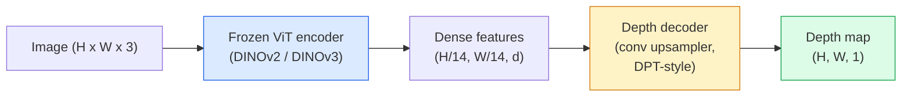

# Szacowanie głębokości i geometrii jednoocznego

> Mapa głębi to obraz jednokanałowy, w którym każdy piksel to odległość od kamery. Przewidywanie tego na podstawie jednej klatki RGB było wcześniej niemożliwe bez stereo lub LiDAR. W 2026 r. zamrożony enkoder ViT i lekka głowica osiągają kilka procent prawdy podstawowej.

**Typ:** Kompiluj + Użyj
**Języki:** Python
**Wymagania wstępne:** Faza 4 Lekcja 14 (ViT), Faza 4 Lekcja 17 (Widzenie samonadzorowane), Faza 4 Lekcja 07 (U-Net)
**Czas:** ~60 minut

## Cele nauczania

- Rozróżnij głębokość względną i metryczną oraz określ, którą z nich rozwiązuje każdy model produkcyjny (MiDaS, Marigold, Depth Everything V3, ZoeDepth)
- Użyj Depth Everything V3 (szkielet DINOv2), aby przewidzieć głębokość dla dowolnych pojedynczych obrazów bez kalibracji
- Wyjaśnij, dlaczego głębia jednooczna w ogóle działa na podstawie pojedynczego obrazu (wskazówki dotyczące perspektywy, gradienty tekstur, wyuczone priorytety) i czego nie jest w stanie odzyskać (skala absolutna, przesłonięta geometria)
- Przenieś wykrycia 2D do punktów 3D za pomocą mapy głębi i elementów kamery otworkowej

## Problem

Głębokość to brakująca oś w wizji komputerowej 2D. Biorąc pod uwagę RGB, wiesz, gdzie rzeczy pojawiają się na płaszczyźnie obrazu; nie wiesz, jak daleko są. Czujniki głębokości (zestawy stereo, LiDAR, czas przelotu) rozwiązują ten problem bezpośrednio, ale są drogie, delikatne i mają ograniczony zasięg.

Szacowanie głębi jednoocznej — przewidywanie głębokości na podstawie pojedynczej klatki RGB — wykorzystywane do tworzenia rozmytych i niewiarygodnych wyników. Do 2026 roku duże, wstępnie wytrenowane kodery zmieniły tę sytuację: Depth Everything V3 wykorzystuje zamrożony szkielet DINOv2 i tworzy mapy głębi, które uogólniają się na domeny wewnętrzne, zewnętrzne, medyczne i satelitarne. Marigold zmienia głębokość jako problem warunkowego dyfuzji. ZoeDepth regresuje rzeczywiste odległości metryczne.

Głębia jest także pomostem pomiędzy wykrywaniem 2D a zrozumieniem 3D: pomnóż piksele wykrytego pudełka przez głębokość, a obiekt 2D zostanie przeniesiony do chmury punktów 3D. To jest rdzeń każdego systemu okluzji AR, każdego rurociągu omijającego przeszkody i każdego robota „podnoszącego kubek”.

## Koncepcja

### Głębokość względna a głębokość metryczna

- **Głębokość względna** — uporządkowane wartości `z` bez jednostki rzeczywistej. „Piksel A jest bliżej niż piksel B, ale stosunek odległości nie jest powiązany z metrami”.
- **Głębokość metryczna** — odległość bezwzględna w metrach od kamery. Wymaga, aby model nauczył się statystycznego związku między sygnałami obrazu a rzeczywistą odległością.

MiDaS i Depth Everything V3 zapewniają względną głębię. Nagietek wytwarza względną głębię. ZoeDepth, UniDepth i Metric3D generują głębokość metryczną. Modele metryczne są wrażliwe na właściwości aparatu; modele względne nie.

### Wzorzec koder-dekoder



Depth Everything V3 zamraża koder i trenuje tylko dekoder w stylu DPT. Koder zapewnia bogate funkcje; dekoder interpoluje je z powrotem do rozdzielczości obrazu i cofa głębokość.

### Dlaczego pojedynczy obraz w ogóle tworzy głębię

Obraz 2D zawiera wiele wskazówek jednoocznych, które korelują z głębią:

- **Perspektywa** — linie równoległe w 3D zbiegają się w 2D.
- **Gradient tekstury** — odległe powierzchnie mają mniejszą i gęstszą teksturę.
- **Kolejność okluzji** — obiekty bliższe zasłaniają te dalsze.
- **Stałość rozmiarów** — znane obiekty (samochody, ludzie) podają przybliżoną skalę.
- **Perspektywa atmosferyczna** — odległe obiekty wydają się bardziej zamglone i bardziej niebieskie w scenach plenerowych.

ViT przeszkolony na miliardach obrazów internalizuje te wskazówki. Przy wystarczającej ilości danych i mocnym kręgosłupie głębokość jednooczna osiąga rozsądną dokładność bez żadnego wyraźnego nadzoru 3D.

### Czego nie potrafi głębia jednooczna

- **Bezwzględna skala metryczna** bez elementów wewnętrznych lub znanych obiektów w scenie. Sieć może przewidzieć, że „kubek będzie dwa razy dalej od łyżki”, nie wiedząc, czy kubek jest oddalony o 1 m, czy o 10 m.
- **Przesłonięta geometria** — oparcie krzesła jest niewidoczne i nie można go wiarygodnie wywnioskować.
- **Prawdziwie nieteksturowane / odblaskowe powierzchnie** — lustra, szkło, jednolite ściany. Sieć podaje wiarygodną, ​​ale błędną głębokość.

### Głębokość w wersji 3 w 2026 r

- Waniliowy DINOv2 ViT-L/14 jako enkoder (zamrożony).
- Dekoder DPT.
- Trenowano na parach pozowanych obrazów z różnych źródeł (nie jest wymagany żaden wyraźny nadzór nad głębią poza spójnością fotometryczną).
- Przewiduje przestrzennie spójną geometrię na podstawie **dowolnej liczby sygnałów wizualnych, ze znanymi pozycjami kamery lub bez nich**.
- SOTA w zakresie głębokości jednoocznej, geometrii dowolnego widoku, renderowania wizualnego, szacowania pozycji kamery.

Jest to model, z którego możesz skorzystać, gdy potrzebujesz głębi w 2026 roku.

### Nagietek — dyfuzja zapewniająca głębię

Marigold (Ke i in., CVPR 2024) zmienia ocenę głębokości jako warunkową dyfuzję obrazu na obraz. Kondycjonowanie: RGB. Cel: mapa głębi. Wykorzystuje wstępnie przeszkoloną sieć U-Net Stable Diffusion 2 jako szkielet. Wyjściowe mapy głębokości są wyjątkowo ostre na granicach obiektów. Kompromis: wolniejsze wnioskowanie niż modele ze sprzężeniem zwrotnym (10–50 kroków odszumiania).

### Istota i kamera otworkowa

Aby podnieść piksel `(u, v)` o głębokości `d` do punktu 3D `(X, Y, Z)` we współrzędnych kamery:

```
fx, fy, cx, cy = camera intrinsics
X = (u - cx) * d / fx
Y = (v - cy) * d / fy
Z = d
```

Elementy wewnętrzne pochodzą z metadanych EXIF, wzorca kalibracji lub jednoocznego estymatora elementów wewnętrznych (Perspective Fields, UniDepth). Bez elementów wewnętrznych nadal można renderować chmurę punktów, zakładając pole widzenia 60–70° i zasady średniej rozdzielczości – nadające się do wizualizacji, a nie do pomiarów.

### Ocena

Dwie standardowe metryki:

- **AbsRel** (bezwzględny błąd względny): `mean(|d_pred - d_gt| / d_gt)`. Niżej jest lepiej. 0,05-0,1 dla modeli produkcyjnych.
- **delta < 1,25** (dokładność progowa): ułamek pikseli, gdzie `max(d_pred/d_gt, d_gt/d_pred) < 1.25`. Wyżej jest lepiej. 0,9+ dla SOTA.

W przypadku głębokości względnej (Depth Everything V3, MiDaS) ocena wykorzystuje niezmienne wersje obu metryk ze skalą i przesunięciem.

## Zbuduj to

### Krok 1: Metryki głębokości

```python
import torch

def abs_rel_error(pred, target, mask=None):
    if mask is not None:
        pred = pred[mask]
        target = target[mask]
    return (torch.abs(pred - target) / target.clamp(min=1e-6)).mean().item()

def delta_accuracy(pred, target, threshold=1.25, mask=None):
    if mask is not None:
        pred = pred[mask]
        target = target[mask]
    ratio = torch.maximum(pred / target.clamp(min=1e-6), target / pred.clamp(min=1e-6))
    return (ratio < threshold).float().mean().item()
```

Zawsze maskuj nieprawidłowe piksele głębi (zero, NaN, nasycone) przed oceną.

### Krok 2: Wyrównanie skali i przesunięcia

W przypadku modeli głębokości względnej przed obliczeniem wskaźników dopasuj przewidywania do prawdy podstawowej. Dopasowanie metodą najmniejszych kwadratów `a * pred + b = target`:

```python
def align_scale_shift(pred, target, mask=None):
    if mask is not None:
        p = pred[mask]
        t = target[mask]
    else:
        p = pred.flatten()
        t = target.flatten()
    A = torch.stack([p, torch.ones_like(p)], dim=1)
    coeffs, *_ = torch.linalg.lstsq(A, t.unsqueeze(-1))
    a, b = coeffs[:2, 0]
    return a * pred + b
```

Uruchom `align_scale_shift` przed `abs_rel_error` podczas oceniania MiDaS / Depth Everything.

### Krok 3: Podnieś głębokość do chmury punktów

```python
import numpy as np

def depth_to_point_cloud(depth, intrinsics):
    H, W = depth.shape
    fx, fy, cx, cy = intrinsics
    v, u = np.meshgrid(np.arange(H), np.arange(W), indexing="ij")
    z = depth
    x = (u - cx) * z / fx
    y = (v - cy) * z / fy
    return np.stack([x, y, z], axis=-1)

depth = np.random.uniform(0.5, 4.0, (240, 320))
intr = (320.0, 320.0, 160.0, 120.0)
pc = depth_to_point_cloud(depth, intr)
print(f"point cloud shape: {pc.shape}  (H, W, 3)")
```

Jedna funkcja, każda aplikacja oparta na technologii 3D. Wyeksportuj chmurę punktów do `.ply` i otwórz w MeshLab lub CloudCompare.

### Krok 4: Test dymu ze sceną o syntetycznej głębi

```python
def synthetic_depth(size=96):
    yy, xx = np.meshgrid(np.arange(size), np.arange(size), indexing="ij")
    # Floor: linear gradient from near (top) to far (bottom)
    depth = 1.0 + (yy / size) * 4.0
    # Box in the middle: closer
    mask = (np.abs(xx - size / 2) < size / 6) & (np.abs(yy - size * 0.6) < size / 6)
    depth[mask] = 2.0
    return depth.astype(np.float32)

gt = torch.from_numpy(synthetic_depth(96))
pred = gt + 0.3 * torch.randn_like(gt)  # simulated prediction
aligned = align_scale_shift(pred, gt)
print(f"before align  absRel = {abs_rel_error(pred, gt):.3f}")
print(f"after align   absRel = {abs_rel_error(aligned, gt):.3f}")
```

### Krok 5: Głębokość użycia dowolnej wersji V3 (odniesienie)

```python
import torch
from transformers import pipeline
from PIL import Image

pipe = pipeline(task="depth-estimation", model="LiheYoung/depth-anything-v2-large")

image = Image.open("street.jpg").convert("RGB")
out = pipe(image)
depth_np = np.array(out["depth"])
```

Trzy linie. `out["depth"]` to skala szarości PIL; przekonwertuj na numpy dla matematyki. W przypadku Depth Everything V3 zamień identyfikator modelu po zwolnieniu; API pozostaje niezmienione.

## Użyj tego

- **Depth Everything V3** (Meta AI / ByteDance, 2024–2026) — domyślna głębokość względna. Najszybszy w produkcji model wielkoszkieletowy ViT.
- **Nagietek** (ETH, 2024) — najwyższa jakość wizualna, powolne wnioskowanie.
- **UniDepth** (ETH, 2024) — głębokość metryczna z oszacowaniem parametrów kamery.
- **ZoeDepth** (Intel, 2023) — głębokość metryczna; starszy, nadal niezawodny.
- **MiDaS v3.1** — starsze, ale stabilne; dobry punkt odniesienia dla porównania.

Typowy wzorzec integracji:

1. Nadchodzi ramka RGB.
2. Model głębi tworzy mapę głębi.
3. Detektor produkuje pudełka.
4. Podnieś centroidy skrzyni na głębokość do 3D; połącz z chmurą punktów, jeśli jest dostępna.
5. Downstream: okluzja AR, planowanie ścieżki, szacowanie wielkości obiektu, wymiana stereo.

Do użytku w czasie rzeczywistym Depth Everything V2 Small (kwantyzowany INT8) osiąga ~30 klatek na sekundę na konsumenckim procesorze graficznym w rozdzielczości 518x518.

## Wyślij to

Ta lekcja daje:

- `outputs/prompt-depth-model-picker.md` — wybiera pomiędzy Depth Everything V3, Marigold, UniDepth, MiDaS ze względu na opóźnienie, potrzebę metryczną lub względną oraz typ sceny.
- `outputs/skill-depth-to-pointcloud.md` — umiejętność budowania chmur punktów z map głębi z poprawną obsługą elementów wewnętrznych i eksportem do `.ply`.

## Ćwiczenia

1. **(Łatwy)** Uruchom Depth Everything V2 na dowolnych 10 obrazach swojego biurka. Zapisz głębię jako pliki PNG w skali szarości i sprawdź. Wskaż jeden obiekt, którego przewidywana głębokość wygląda błędnie i wyjaśnij, dlaczego wskazówki jednooczne zawiodły.
2. **(Średni)** Biorąc pod uwagę RGB + głębię z Depth Everything V2, przejdź do chmury punktów i renderuj za pomocą `open3d`. Porównaj dwie sceny (wewnątrz/na zewnątrz) i zanotuj, która wygląda bardziej wiarygodnie.
3. **(Trudny)** Zrób pięć par zdjęć, które różnią się jedynie położeniem znanego obiektu (np. butelka przesunięta o 30 cm bliżej). Użyj UniDepth, aby przewidzieć głębokość metryczną w obu przypadkach. Podaj przewidywaną różnicę odległości w porównaniu z rzeczywistymi 30 cm.

## Kluczowe terminy

| Termin | Co ludzie mówią | Co to właściwie oznacza |
|------|----------------|----------------------|
| Głębia jednooczna | „Głębia pojedynczego obrazu” | Oszacowanie głębi na podstawie jednej klatki RGB, bez stereo i LiDAR |
| Głębokość względna | „Uporządkowana głębokość” | Uporządkowane wartości z bez jednostek świata rzeczywistego |
| Głębokość metryczna | „Odległość bezwzględna” | Głębokość w metrach; wymaga kalibracji lub modelu przeszkolonego pod nadzorem metrycznym |
| AbsRel | „Absolutny błąd względny” | Średnia z |d_pred - d_gt| / d_gt; standardowa metryka głębokości |
| Dokładność delty | „delta < 1,25” | Ułamek pikseli z przewidywaniem w granicach 25% prawdy podstawowej |
| Kamera otworkowa | „fx, fy, cx, cy” | Model aparatu używany do podnoszenia (u, v, d) do (X, Y, Z) |
| DPT | „Gęsty transformator prognozujący” | Dekoder oparty na konwulsjach używany jako dodatek do zamrożonych koderów ViT dla głębokości |
| Szkielet DINOv2 | „Powód, dla którego to działa” | Samonadzorowane funkcje, które generalizują w różnych domenach bez etykiet głębokości |

## Dalsze czytanie

- [Strona papierowa Depth Everything V3](https:// głębokość-anything.github.io/) — Głębia monokularowa SOTA z koderem DINOv2
- [Marigold (Ke et al., CVPR 2024)](https://marigoldmonothought.github.io/) — szacowanie głębokości na podstawie dyfuzji
- [UniDepth (Piccinelli et al., 2024)](https://arxiv.org/abs/2403.18913) — głębokość metryczna z elementami wewnętrznymi
- [MiDaS v3.1 (Intel ISL)](https://github.com/isl-org/MiDaS) — kanoniczna wartość bazowa względnej głębokości
— [Post na blogu DINOv3 (Meta)](https://ai.meta.com/blog/dinov3-self-supervised-vision-model/) — rodzina koderów, która zwiększa dokładność głębokości