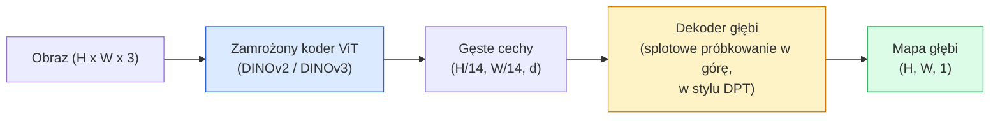

# Szacowanie głębi jednoocznej (Monocular Depth Estimation) i geometria sceny

> Mapa głębi (depth map) to jednokanałowy obraz, w którym wartość każdego piksela reprezentuje odległość danego punktu sceny od kamery. Przewidywanie głębi na podstawie pojedynczego kadru RGB (bez użycia systemów stereo czy czujników LiDAR) stanowiło dotychczas ogromne wyzwanie. Obecnie zamrożony koder ViT połączony z lekką głowicą regresyjną pozwala na odtworzenie rzeczywistej geometrii z dokładnością do kilku procent względem danych referencyjnych (ground truth).

**Typ lekcji:** Teoria + Praktyka
**Język:** Python
**Wymagania wstępne:** Faza 4, Lekcja 14 (ViT); Faza 4, Lekcja 17 (Uczenie samonadzorowane w wizji); Faza 4, Lekcja 07 (U-Net)
**Czas wykonania:** ~60 minut

## Cele lekcji

- Zrozumiesz różnice między głębią względną (relative depth) a metryczną (metric depth) oraz dowiesz się, jak te zadania realizują wiodące modele (MiDaS, Marigold, Depth Anything V2, ZoeDepth).
- Wykorzystasz model Depth Anything V2 (oparty na koderze DINOv2) do predykcji głębi dla dowolnych obrazów bez wcześniejszej kalibracji aparatu.
- Wyjaśnisz mechanizmy działania modeli głębi jednoocznej (analiza perspektywy, gradienty tekstur, wyuczone priorytetowe struktury) oraz zidentyfikujesz ich ograniczenia (brak bezwzględnej skali bez danych pomocniczych, okluzje geometryczne).
- Dokonasz rzutowania (podnoszenia) detekcji 2D do przestrzeni 3D z użyciem mapy głębi oraz parametrów wewnętrznych kamery otworkowej.

## Opis problemu

Wymiar głębi (oś Z) to brakujące ogniwo w klasycznym komputerowym rozpoznawaniu obrazów 2D. Analizując surowy kadr RGB wiemy, gdzie obiekty znajdują się na płaszczyźnie zdjęcia, ale nie znamy ich odległości od obiektywu. Fizyczne sensory głębi (takie jak kamery stereoskopowe, LiDAR-y czy czujniki Time-of-Flight) mierzą tę odległość bezpośrednio, jednak są to urządzenia kosztowne, podatne na uszkodzenia mechaniczne i posiadające ograniczony zasięg działania.

Dawniejsze metody szacowania głębi jednoocznej (Monocular Depth Estimation) dawały mało precyzyjne, rozmyte i niestabilne wyniki. Zastosowanie potężnych, wstępnie wytrenowanych koderów wizyjnych w 2026 roku zrewolucjonizowało tę dziedzinę: model Depth Anything V2 wykorzystuje zamrożony koder DINOv2 i generuje mapy głębi, które doskonale uogólniają się na sceny wewnętrzne, krajobrazy zewnętrzne, a nawet zdjęcia medyczne czy satelitarne. Z kolei model Marigold traktuje estymację głębi jako zadanie warunkowej generacji obraz-obraz za pomocą modeli dyfuzyjnych, a ZoeDepth realizuje bezpośrednią regresję rzeczywistej odległości metrycznej.

Głębokość stanowi kluczowy pomost łączący detekcję 2D z przestrzennym rozumieniem 3D: rzutując piksele ramki otaczającej (bounding box) przy użyciu wartości z mapy głębi, przenosimy obiekt 2D do trójwymiarowej chmury punktów (point cloud). Ta operacja geometryczna leży u podstaw każdego systemu okluzji w rozszerzonej rzeczywistości (AR), potoków unikania kolizji w robotyce autonomicznej oraz systemów chwytakowych.

## Koncepcje teoretyczne

### Głębokość względna (Relative) a metryczna (Metric)

- **Głębokość względna (Relative Depth)**: uporządkowane wartości odległości `z` bez fizycznej jednostki miary. Wiemy, że „piksel A leży bliżej kamery niż piksel B”, ale wartości liczbowe nie są bezpośrednio wyrażone w metrach.
- **Głębokość metryczna (Metric Depth)**: bezwzględna odległość od obiektywu wyrażona w metrach. Wymaga od modelu wyuczenia się statystycznych zależności między cechami obrazu a fizyczną odległością geometryczną.

Modele MiDaS, Depth Anything V2 oraz Marigold wyznaczają głębokość względną. Z kolei ZoeDepth, UniDepth oraz Metric3D generują głębię metryczną. Należy pamiętać, że modele metryczne są bardzo wrażliwe na zmiany parametrów optycznych aparatu, podczas gdy modele względne wykazują znacznie wyższą stabilność i odporność.

### Schemat koder-dekoder (Encoder-Decoder Pattern)



Model Depth Anything V2 zamraża koder wizyjny i trenuje wyłącznie dekoder w stylu DPT (Dense Prediction Transformer). Koder dostarcza bogate cechy semantyczne, natomiast dekoder dokonuje próbkowania w górę (upsampling) do oryginalnej rozdzielczości wejściowej i zwraca mapę głębi.

### Dlaczego estymacja głębi z pojedynczego obrazu jest możliwa?

Obraz 2D zawiera szereg tzw. wskazówek jednoocznych (monocular cues), które silnie korelują z odległością przestrzenną:

- **Perspektywa geometryczna**: linie równoległe w przestrzeni 3D zbiegają się w punkt zbiegu na płaszczyźnie 2D.
- **Gradient tekstury**: obiekty położone dalej charakteryzują się drobniejszym i gęstszym usłojeniem/teksturą.
- **Okluzja**: obiekty znajdujące się bliżej przesłaniają elementy leżące w tle.
- **Wielkość obiektów (Size Familiarity)**: obecność znanych obiektów (ludzie, pojazdy) pozwala modelowi na oszacowanie skali na podstawie ich względnego rozmiaru na zdjęciu.
- **Perspektywa powietrzna**: obiekty w oddali tracą kontrast, stają się zamglone i lekko niebieskawe (wskutek rozpraszania światła w atmosferze).

Sieci Vision Transformer (ViT) trenowane na miliardach zdjęć potrafią skutecznie zinternalizować te reguły. Dzięki temu modele jednooczne osiągają wysoką precyzję bez konieczności pozyskiwania gęstych etykiet 3D dla każdego piksela.

### Ograniczenia modeli jednoocznych

- **Wyznaczanie bezwzględnej skali metrycznej** bez znajomości parametrów optycznych kamery lub znanych obiektów referencyjnych na scenie. Model potrafi prawidłowo przewidzieć stosunek odległości (np. „kubek leży dwa razy dalej niż łyżka”), nie wiedząc jednak, czy odległości te wynoszą odpowiednio 1 i 2 metry, czy 10 i 20 metrów.
- **Geometria zasłonięta (Okluzje)**: elementy sceny ukryte za innymi obiektami są niewidoczne dla kamery i nie mogą zostać zrekonstruowane.
- **Powierzchnie bezteksturowe i odblaskowe**: tafle luster, szkło lub gładkie, jednolicie oświetlone ściany. Modele generują dla nich gładkie reprezentacje głębi, które często są geometrycznie błędne.

### Wersje Depth Anything w 2026 roku

- Standardowy model DINOv2 ViT-L/14 jako zamrożony koder cech.
- Dekoder typu DPT (Dense Prediction Transformer).
- Uczenie na zróżnicowanych zbiorach danych z zachowaniem spójności geometrycznej i fotometrycznej.
- Wysoka spójność przestrzenna generowanej geometrii dla dowolnych obrazów wejściowych (niezależnie od znajomości parametrów kamery).
- Status wiodącego rozwiązania (SOTA) w zadaniach jednoocznej estymacji głębi.

To domyślny model produkcyjny w 2026 roku.

### Model Marigold – dyfuzja w zadaniach estymacji głębi

Model Marigold (Ke et al., CVPR 2024) zmienia ocenę głębokości jako warunkową dyfuzję obrazu na obraz. Jako model bazowy wykorzystuje sieć U-Net ze Stable Diffusion 2. Wyjściowe mapy głębi charakteryzują się niezwykle ostrymi, wyraźnymi krawędziami obiektów. Głównym kompromisem jest czas wnioskowania – proces wymaga przejścia przez 10–50 kroków odszumiania (denoising steps), co czyni go znacznie wolniejszym od modeli regresyjnych.

### Podnoszenie punktów: Model kamery otworkowej

Przekształcenie współrzędnych piksela `(u, v)` o głębokości `d` do trójwymiarowego punktu `(X, Y, Z)` w układzie współrzędnych kamery:

```
fx, fy, cx, cy = parametry wewnętrzne kamery (intrinsics)
X = (u - cx) * d / fx
Y = (v - cy) * d / fy
Z = d
```

Parametry wewnętrzne (intrinsics) można pobrać z metadanych EXIF zdjęcia, wyznaczyć w procesie kalibracji (np. za pomocą szachownicy) lub oszacować dedykowanym modelem (np. Perspective Fields, UniDepth). W przypadku braku tych danych, trójwymiarową wizualizację można wygenerować przyjmując orientacyjne pole widzenia obiektywu (np. 60–70°), co jest wystarczające do celów podglądu (lecz nie do dokładnych pomiarów geometrycznych).

### Metryki ewaluacji

Stosuje się dwie podstawowe metryki oceny:

- **AbsRel (Absolute Relative Error)**: średni bezwzględny błąd względny: `mean(|d_pred - d_gt| / d_gt)` (im niższa wartość, tym lepiej; modele produkcyjne osiągają wyniki w przedziale 0.05 - 0.1).
- **delta < 1.25 (Threshold Accuracy)**: odsetek pikseli spełniających warunek `max(d_pred/d_gt, d_gt/d_pred) < 1.25` (im wyższa wartość, tym lepiej; wiodące modele osiągają wyniki powyżej 0.9).

W przypadku ewaluacji modeli głębi względnej (np. Depth Anything, MiDaS) metryki te oblicza się po uprzednim dopasowaniu skali i przesunięcia (scale-and-shift alignment).

## Implementacja krok po kroku

### Krok 1: Implementacja metryk ewaluacji

```python
import torch

def abs_rel_error(pred, target, mask=None):
    if mask is not None:
        pred = pred[mask]
        target = target[mask]
    return (torch.abs(pred - target) / target.clamp(min=1e-6)).mean().item()

def delta_accuracy(pred, target, threshold=1.25, mask=None):
    if mask is not None:
        pred = pred[mask]
        target = target[mask]
    ratio = torch.maximum(pred / target.clamp(min=1e-6), target / pred.clamp(min=1e-6))
    return (ratio < threshold).float().mean().item()
```

Przed przystąpieniem do obliczeń zawsze odrzuć niepoprawne piksele (wartości zerowe, ujemne lub NaN) przy użyciu maski.

### Krok 2: Dopasowanie skali i przesunięcia (Scale & Shift Alignment)

Dla modeli głębi względnej konieczne jest dopasowanie skali i przesunięcia do danych referencyjnych przed obliczeniem metryk. Zadanie to rozwiązuje metoda najmniejszych kwadratów dla równania `a * pred + b = target`:

```python
def align_scale_shift(pred, target, mask=None):
    if mask is not None:
        p = pred[mask]
        t = target[mask]
    else:
        p = pred.flatten()
        t = target.flatten()
    A = torch.stack([p, torch.ones_like(p)], dim=1)
    coeffs, *_ = torch.linalg.lstsq(A, t.unsqueeze(-1))
    a, b = coeffs[:2, 0]
    return a * pred + b
```

Pamiętaj o wywołaniu funkcji `align_scale_shift` przed obliczeniem metryki błędu dla modeli takich jak MiDaS czy Depth Anything.

### Krok 3: Generowanie chmury punktów na podstawie mapy głębi

```python
import numpy as np

def depth_to_point_cloud(depth, intrinsics):
    H, W = depth.shape
    fx, fy, cx, cy = intrinsics
    v, u = np.meshgrid(np.arange(H), np.arange(W), indexing="ij")
    z = depth
    x = (u - cx) * z / fx
    y = (v - cy) * z / fy
    return np.stack([x, y, z], axis=-1)

depth = np.random.uniform(0.5, 4.0, (240, 320))
intr = (320.0, 320.0, 160.0, 120.0)
pc = depth_to_point_cloud(depth, intr)
print(f"point cloud shape: {pc.shape}  (H, W, 3)")
```

Ta prosta transformacja geometryczna stanowi podstawę wizualizacji przestrzennych. Wygenerowaną chmurę punktów można zapisać do formatu `.ply` i otworzyć w zewnętrznych programach typu MeshLab lub CloudCompare.

### Krok 4: Test integracyjny na danych syntetycznych (Smoke Test)

```python
def synthetic_depth(size=96):
    yy, xx = np.meshgrid(np.arange(size), np.arange(size), indexing="ij")
    # Podłoga: liniowy gradient głębokości od bliskiego planu (góra) do dalekiego (dół)
    depth = 1.0 + (yy / size) * 4.0
    # Prostopadłościan na środku: bliżej kamery
    mask = (np.abs(xx - size / 2) < size / 6) & (np.abs(yy - size * 0.6) < size / 6)
    depth[mask] = 2.0
    return depth.astype(np.float32)

gt = torch.from_numpy(synthetic_depth(96))
pred = gt + 0.3 * torch.randn_like(gt)  # symulacja predykcji modelu z szumem
aligned = align_scale_shift(pred, gt)
print(f"before align  absRel = {abs_rel_error(pred, gt):.3f}")
print(f"after align   absRel = {abs_rel_error(aligned, gt):.3f}")
```

### Krok 5: Generowanie mapy głębi przy użyciu gotowego modelu (Przykład)

```python
import torch
from transformers import pipeline
from PIL import Image
import numpy as np

pipe = pipeline(task="depth-estimation", model="LiheYoung/depth-anything-v2-large")

image = Image.open("street.jpg").convert("RGB")
out = pipe(image)
depth_np = np.array(out["depth"])
```

Zaledwie kilka linii kodu. Wyjściowy obiekt `out["depth"]` jest obrazem PIL w skali szarości – w celach obliczeniowych konwertujemy go do tablicy NumPy. W przypadku nowszych modeli (np. Depth Anything V3) wystarczy podmienić identyfikator wczytywanych wag; interfejs API pozostaje identyczny.

## Zastosowanie w praktyce

- **Depth Anything V3**: domyślny model produkcyjny dla głębi względnej. Oferuje doskonały kompromis dokładności i prędkości działania na GPU.
- **Marigold**: najwyższa wierność geometryczna i ostre krawędzie, kosztem bardzo długiego czasu wnioskowania (generacja oparta o dyfuzję).
- **UniDepth**: estymacja głębi metrycznej połączona z automatycznym szacowaniem parametrów wewnętrznych kamery.
- **ZoeDepth**: sprawdzony i stabilny model estymacji głębi metrycznej.
- **MiDaS v3.1**: klasyczny, stabilny model bazowy.

Typowy potok integracyjny:

1. Kamera dostarcza kadr RGB.
2. Model estymacji głębi generuje mapę odległości.
3. Model detekcji obiektów wyznacza ramki 2D (bounding boxes).
4. Środek ramki 2D jest rzutowany do przestrzeni 3D z użyciem wartości z mapy głębi, co pozwala na określenie fizycznej pozycji obiektu.
5. Dalsa logika systemu: nakładanie grafiki w AR z uwzględnieniem przeszkód (okluzja), planowanie trajektorii ruchu robota czy szacowanie fizycznych rozmiarów obiektów.

Dla wdrożeń w czasie rzeczywistym, lekki model `Depth Anything V2 Small` (podpisany kwantyzacją INT8) osiąga płynność około 30 FPS na standardowych kartach graficznych przy rozdzielczości 518x518.

## Materiały i pliki wyjściowe

W ramach tej lekcji przygotowano:

- `outputs/prompt-depth-model-picker.md` – szablon promptu ułatwiający dobór modelu (Depth Anything V3 / Marigold / UniDepth / MiDaS) na podstawie budżetu opóźnień, wymaganej wymiarowości (metryczna/względna) oraz specyfiki sceny.
- `outputs/skill-depth-to-pointcloud.md` – implementacja generatora chmur punktów 3D na podstawie mapy głębi z poprawnym rzutowaniem geometrycznym (intrinsics) i zapisem do formatu `.ply`.

## Ćwiczenia praktyczne

1. **(Łatwe)** Uruchom model `Depth Anything V2` na zestawie 10 własnych zdjęć przedstawiających Twoje biurko. Zapisz wygenerowane mapy głębi jako obrazy w skali szarości. Zidentyfikuj na zdjęciach przynajmniej jeden obszar, w którym model popełnił wyraźny błąd geometryczny, i wyjaśnij, jaka cecha wizualna (odbicie, brak tekstury itp.) zmyliła model.
2. **(Średnie)** Wykorzystując parę obraz RGB + wygenerowana mapa głębi, utwórz trójwymiarową chmurę punktów i dokonaj jej wizualizacji w bibliotece `open3d`. Porównaj rezultaty dla zdjęcia wnętrza oraz krajobrazu i oceń wierność odwzorowania geometrii.
3. **(Trudne)** Wykonaj 5 par zdjęć testowych, w których zmieniasz wyłącznie odległość jednego, znanego obiektu (np. przesuwając butelkę o dokładnie 30 cm bliżej aparatu). Wykorzystuj model UniDepth do estymacji głębi metrycznej i porównaj wyliczoną przez model różnicę odległości z rzeczywistym przesunięciem o 30 cm.

## Słownik pojęć

| Pojęcie | Obiegowe rozumienie | Definicja techniczna |
|------|----------------|----------------------|
| Estymacja głębi jednoocznej (Monocular Depth) | „Głębokość z jednego zdjęcia” | Proces przewidywania odległości przestrzennej na podstawie pojedynczego kadru RGB, bez informacji stereoskopowej czy czujników LiDAR |
| Głębokość względna (Relative Depth) | „Odległość bez jednostek (metryki)” | Wartości odległości określające jedynie relację blisko-daleko między pikselami, bez odniesienia do rzeczywistych jednostek (metrów) |
| Głębokość metryczna (Metric Depth) | „Rzeczywista odległość w metrach” | Bezwzględna odległość wyrażona w metrach; wymaga od modelu znajomości parametrów kamery lub uczenia pod nadzorem metrycznym |
| AbsRel | „Błąd względny odległości” | Średnia wartość błędu względnego: `mean(|d_pred - d_gt| / d_gt)` – podstawowy miernik dokładności modeli głębi |
| Delta (Threshold Accuracy) | „Odsetek poprawnych pikseli” | Metryka określająca odsetek pikseli, dla których stosunek odległości przewidywanej i rzeczywistej mieści się w zdefiniowanym przedziale (np. < 1.25) |
| Model kamery otworkowej (Pinhole Camera) | „Macierz kalibracji aparatu” | Model geometryczny kamery, w którym parametry `fx, fy` (ogniskowa) oraz `cx, cy` (punkt główny) służą do rzutowania pikseli `(u, v)` o głębokości `d` w punkty przestrzenne `(X, Y, Z)` |
| DPT (Dense Prediction Transformer) | „Dekoder gęstych cech” | Architektura dekodera (najczęściej splotowa) wykorzystywana do rekonstrukcji mapy głębi o wysokiej rozdzielczości z wyjściowych reprezentacji ViT |
| Model bazowy DINOv2 | „Serce modelu” | Samonadzorowany model wizyjny dostarczający niezwykle uniwersalnych cech semantycznych i przestrzennych, co pozwala na bezproblemowe uogólnianie modeli głębi na nowe sceny |

## Literatura i materiały uzupełniające

- [Projekt Depth Anything V2](https://depth-anything.github.io/) – oficjalna strona wiodącego projektu estymacji głębi jednoocznej.
- [Marigold: Repurposing Diffusion Models for Monocular Depth Estimation (Ke et al., CVPR 2024)](https://marigoldmonodepth.github.io/) – publikacja na temat estymacji głębi za pomocą modeli dyfuzyjnych.
- [UniDepth: Universal Monocular Metric Depth Estimation (Piccinelli et al., 2024)](https://arxiv.org/abs/2403.18913) – estymacja głębi metrycznej bez wcześniejszej kalibracji.
- [Projekt MiDaS (Intel ISL)](https://github.com/isl-org/MiDaS) – klasyczny model estymacji głębi względnej.
- [DINOv2 Blog Post (Meta AI)](https://ai.meta.com/blog/dino-v2-computer-vision-self-supervised-learning/) – szczegóły dotyczące samonadzorowanego uczenia modeli DINOv2 stanowiących serce modeli głębi.
