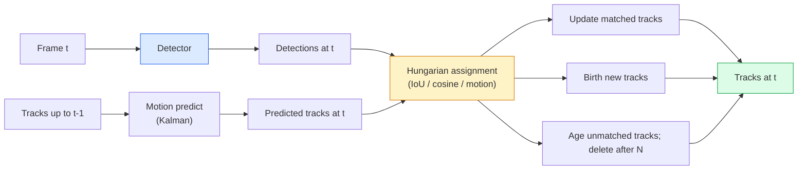

# Śledzenie wielu obiektów i pamięć wideo

> Śledzenie to wykrywanie i skojarzenie. Wykryj każdą klatkę. Dopasuj wykrycia tej ramki do śladów ostatniej ramki według identyfikatora.

**Typ:** Kompilacja
**Języki:** Python
**Wymagania wstępne:** Faza 4 Lekcja 06 (Wykrywanie YOLO), Faza 4 Lekcja 08 (Maska R-CNN), Faza 4 Lekcja 24 (SAM 3)
**Czas:** ~60 minut

## Cele nauczania

- Odróżnij śledzenie przez wykrycie od śledzenia opartego na zapytaniach i nazwij rodziny algorytmów (SORT, DeepSORT, ByteTrack, BoT-SORT, moduł śledzenia pamięci SAM 2, SAM 3.1 Object Multiplex)
- Zaimplementuj od podstaw przypisanie IoU + węgierskie dla klasycznego śledzenia przez wykrycie
- Wyjaśnij bank pamięci SAM 2 i dlaczego radzi sobie on z okluzją lepiej niż skojarzenie oparte na IoU
- Przeczytaj trzy metryki śledzenia (MOTA, IDF1, HOTA) i wybierz, który z nich ma znaczenie dla danego przypadku użycia

## Problem

Detektor informuje, gdzie znajdują się obiekty w pojedynczej klatce. Moduł śledzący informuje, które wykrycie w ramce `t` jest tym samym obiektem, co wykrycie w ramce `t-1`. Bez tego nie można liczyć obiektów przekraczających linię, podążać za piłką przez okluzję ani wiedzieć, że „samochód nr 4 był na pasie przez 8 sekund”.

Śledzenie jest niezbędne w przypadku każdego produktu obsługującego wideo: analityka sportowa, nadzór, jazda autonomiczna, analiza wideo medycznego, monitorowanie dzikiej przyrody, liczenie znaków słownych. Podstawowe elementy składowe są wspólne: detektor na klatkę, model ruchu (filtr Kalmana lub coś bogatszego), krok asocjacji (węgierski algorytm dotyczący IoU / cosinus / wyuczone funkcje) i cykl życia ścieżki (narodziny, aktualizacja, śmierć).

Rok 2026 przyniósł dwa nowe wzorce: **śledzenie oparte na pamięci SAM 2** (pamięć funkcji zamiast powiązania modelu ruchu) i **SAM 3.1 Object Multiplex** (pamięć współdzielona dla wielu instancji tej samej koncepcji). Ta lekcja dotyczy najpierw klasycznego stosu, a następnie podejścia opartego na pamięci.

## Koncepcja

### Śledzenie przez wykrycie



Każdy tracker, który spotkasz w 2026 roku, jest odmianą tej pętli. Różnice:

- **SORT** (2016): Filtr Kalmana + IoU węgierski. Prosty, szybki i pozbawiony wyglądu model.
- **DeepSORT** (2017): SORT + funkcja wyglądu każdej ścieżki oparta na CNN (osadzanie ReID). Lepiej radzi sobie z przejazdami.
- **ByteTrack** (2021): kojarzy wykrycia o niskiej pewności jako drugi etap; nie są potrzebne żadne funkcje wyglądu, ale najlepsze wyniki w MOT17.
- **BoT-SORT** (2022): Bajt + kompensacja ruchu kamery + ReID.
- **StrongSORT / OC-SORT** — potomkowie ByteTrack z lepszym ruchem i wyglądem.

### Filtr Kalmana w jednym akapicie

Filtr Kalmana utrzymuje stan poszczególnych ścieżek `(x, y, w, h, dx, dy, dw, dh)` z kowariancją. W każdej klatce **przewiduj** stan przy użyciu modelu o stałej prędkości, a następnie **aktualizuj** za pomocą dopasowanego wykrywania. Aktualizacja bardziej ufa wykrywaniu, gdy niepewność przewidywań jest wysoka. Daje to płynne trajektorie i możliwość kontynuowania ścieżki przez krótką okluzję (1-5 klatek).

Każdy klasyczny tracker wykorzystuje filtr Kalmana na etapie przewidywania ruchu.

### Algorytm węgierski

Biorąc pod uwagę macierz kosztów `M x N` (ścieżki x wykrycia), znajdź przypisanie jeden do jednego, które minimalizuje całkowity koszt. Koszt wynosi zwykle `1 - IoU(track_bbox, detection_bbox)` lub ujemny cosinus podobieństwa cech wyglądu. Czas wykonania to O((M+N)^3); dla M, N do ~1000 jest wystarczająco szybki w Pythonie poprzez `scipy.optimize.linear_sum_assignment`.

### Kluczowy pomysł ByteTrack

Standardowe moduły śledzące odrzucają wykrycia o niskiej pewności (< 0,5). ByteTrack utrzymuje je jako **kandydaci drugiego etapu**: po dopasowaniu ścieżek do wykryć o wysokim stopniu pewności, niedopasowane ścieżki próbują dopasować wykrycia o niskim stopniu pewności do nieco luźniejszego progu IoU. Przywraca krótkie okluzje, przełącza ID w pobliżu tłumów.

### Śledzenie oparte na pamięci SAM 2

SAM 2 obsługuje wideo, przechowując **bank pamięci** funkcji przestrzenno-czasowych poszczególnych instancji. Po otrzymaniu monitu (kliknięcie, pole, tekst) w jednej ramce koduje instancję w pamięci. W kolejnych ramkach pamięć jest sprawdzana krzyżowo z cechami nowej ramki, a dekoder tworzy maskę dla tej samej instancji w nowej ramce.

Żadnego filtra Kalmana, żadnego przypisania węgierskiego. Powiązanie jest ukryte w operacji pamięci-uwagi.

Plusy:
- Odporne na duże okluzje (pamięć przenosi tożsamość instancji w wielu klatkach).
- Otwarte słownictwo w połączeniu z podpowiedziami tekstowymi SAM 3.
- Działa bez osobnego modelu ruchu.

Wady:
- Wolniejszy niż ByteTrack w przypadku śledzenia wielu obiektów.
- Bank pamięci rośnie; ogranicza okno kontekstowe.

### Multipleks obiektowy SAM 3.1

Wcześniejsze śledzenie SAM 2 / SAM 3 utrzymuje oddzielny bank pamięci na instancję. Na 50 obiektów 50 banków pamięci. Object Multiplex (marzec 2026 r.) zwija je w jedną pamięć współdzieloną z **tokenami zapytań na instancje**. Koszt skaluje się subliniowo w liczbie przypadków.

Multipleks to nowa domyślna metoda śledzenia tłumu w 2026 r.: tłumy na koncertach, pracownicy magazynów, skrzyżowania.

### Trzy wskaźniki, które warto znać

- **MOTA (dokładność śledzenia wielu obiektów)** — 1 - (przełączniki FN + FP + ID) / GT. Ważone według rodzaju błędu; pojedyncza metryka, która łączy błędy wykrywania i skojarzeń.
- **IDF1 (ID F1)** — średnia harmoniczna precyzji i przypominania ID. Koncentruje się szczególnie na tym, jak dobrze każda ścieżka prawdy zachowuje swój identyfikator na przestrzeni czasu. Lepsze niż MOTA w przypadku zadań wrażliwych na zmianę identyfikatora.
- **HOTA (Dokładność śledzenia wyższego rzędu)** — rozkłada się na dokładność wykrywania (DetA) i dokładność asocjacji (AssA). Standard społecznościowy od 2020 roku; najbardziej wszechstronne.

W przypadku inwigilacji (kto jest kim): IDF1 jest tym, co zgłaszasz. Do analityki sportowej (liczenie karnetów): HOTA. Dla ogólnego porównania akademickiego: HOTA.

## Zbuduj to

### Krok 1: Matryca kosztów oparta na IoU

```python
import numpy as np

def bbox_iou(a, b):
    """
    a, b: (N, 4) arrays of [x1, y1, x2, y2].
    Returns (N_a, N_b) IoU matrix.
    """
    ax1, ay1, ax2, ay2 = a[:, 0], a[:, 1], a[:, 2], a[:, 3]
    bx1, by1, bx2, by2 = b[:, 0], b[:, 1], b[:, 2], b[:, 3]
    inter_x1 = np.maximum(ax1[:, None], bx1[None, :])
    inter_y1 = np.maximum(ay1[:, None], by1[None, :])
    inter_x2 = np.minimum(ax2[:, None], bx2[None, :])
    inter_y2 = np.minimum(ay2[:, None], by2[None, :])
    inter = np.clip(inter_x2 - inter_x1, 0, None) * np.clip(inter_y2 - inter_y1, 0, None)
    area_a = (ax2 - ax1) * (ay2 - ay1)
    area_b = (bx2 - bx1) * (by2 - by1)
    union = area_a[:, None] + area_b[None, :] - inter
    return inter / np.clip(union, 1e-8, None)
```

### Krok 2: Minimalny moduł śledzący w stylu SORT

Naprawiono pominięcie Kalmana o stałej prędkości dla zwięzłości — używamy tutaj prostego skojarzenia IoU; w produkcji przewidywanie Kalmana jest niezbędne. Pakiet `sort` Pythona zapewnia pełną wersję.

```python
from scipy.optimize import linear_sum_assignment

class Track:
    def __init__(self, tid, bbox, frame):
        self.id = tid
        self.bbox = bbox
        self.last_frame = frame
        self.hits = 1

    def update(self, bbox, frame):
        self.bbox = bbox
        self.last_frame = frame
        self.hits += 1

class SimpleTracker:
    def __init__(self, iou_threshold=0.3, max_age=5):
        self.tracks = []
        self.next_id = 1
        self.iou_threshold = iou_threshold
        self.max_age = max_age

    def step(self, detections, frame):
        if not self.tracks:
            for d in detections:
                self.tracks.append(Track(self.next_id, d, frame))
                self.next_id += 1
            return [(t.id, t.bbox) for t in self.tracks]

        track_boxes = np.array([t.bbox for t in self.tracks])
        det_boxes = np.array(detections) if len(detections) else np.empty((0, 4))

        iou = bbox_iou(track_boxes, det_boxes) if len(det_boxes) else np.zeros((len(track_boxes), 0))
        cost = 1 - iou
        cost[iou < self.iou_threshold] = 1e6

        matched_track = set()
        matched_det = set()
        if cost.size > 0:
            row, col = linear_sum_assignment(cost)
            for r, c in zip(row, col):
                if cost[r, c] < 1.0:
                    self.tracks[r].update(det_boxes[c], frame)
                    matched_track.add(r); matched_det.add(c)

        for i, d in enumerate(det_boxes):
            if i not in matched_det:
                self.tracks.append(Track(self.next_id, d, frame))
                self.next_id += 1

        self.tracks = [t for t in self.tracks if frame - t.last_frame <= self.max_age]
        return [(t.id, t.bbox) for t in self.tracks]
```

60 linii. Pobiera wykrycia na klatkę i zwraca identyfikatory ścieżek na klatkę. Prawdziwe systemy dodają przewidywanie Kalmana, rewanż w drugim etapie ByteTrack i funkcje wyglądu.

### Krok 3: Test trajektorii syntetycznej

```python
def synthetic_frames(num_frames=20, num_objects=3, H=240, W=320, seed=0):
    rng = np.random.default_rng(seed)
    starts = rng.uniform(20, 200, size=(num_objects, 2))
    velocities = rng.uniform(-5, 5, size=(num_objects, 2))
    frames = []
    for f in range(num_frames):
        dets = []
        for i in range(num_objects):
            cx, cy = starts[i] + f * velocities[i]
            dets.append([cx - 10, cy - 10, cx + 10, cy + 10])
        frames.append(dets)
    return frames

tracker = SimpleTracker()
for f, dets in enumerate(synthetic_frames()):
    tracks = tracker.step(dets, f)
```

Trzy obiekty poruszające się po liniach prostych powinny zachować swoje identyfikatory we wszystkich 20 klatkach.

### Krok 4: Metryka zmiany identyfikatora

```python
def count_id_switches(tracks_per_frame, gt_per_frame):
    """
    tracks_per_frame:  list of list of (track_id, bbox)
    gt_per_frame:      list of list of (gt_id, bbox)
    Returns number of ID switches.
    """
    prev_assignment = {}
    switches = 0
    for tracks, gts in zip(tracks_per_frame, gt_per_frame):
        if not tracks or not gts:
            continue
        t_boxes = np.array([b for _, b in tracks])
        g_boxes = np.array([b for _, b in gts])
        iou = bbox_iou(g_boxes, t_boxes)
        for g_idx, (gt_id, _) in enumerate(gts):
            j = iou[g_idx].argmax()
            if iou[g_idx, j] > 0.5:
                t_id = tracks[j][0]
                if gt_id in prev_assignment and prev_assignment[gt_id] != t_id:
                    switches += 1
                prev_assignment[gt_id] = t_id
    return switches
```

Jest to uproszczona metryka przylegająca do IDF1: policz, ile razy obiekt naziemny zmienia przypisany przewidywany identyfikator ścieżki. Prawdziwe narzędzia MOTA / IDF1 / HOTA są obecne w `py-motmetrics` i `TrackEval`.

## Użyj tego

Śledzenie produkcji w 2026 r.:

- `ultralytics` — wbudowane YOLOv8 + ByteTrack / BoT-SORT. `results = model.track(source, tracker="bytetrack.yaml")`. Wartość domyślna.
- `supervision` (Roboflow) — opakowania ByteTrack i narzędzia do adnotacji.
- SAM 2 / SAM 3.1 — śledzenie oparte na pamięci poprzez `processor.track()`.
- Niestandardowy stos: detektor (YOLOv8 / RT-DETR) + `sort-tracker` / `OC-SORT` / `StrongSORT`.

Zbieranie:

- Piesi / samochody / pudła przy 30+ fps: **ByteTrack z ultralityką**.
- Wiele wystąpień jednej klasy w tłumie: **SAM 3.1 Object Multiplex**.
- Ciężkie okluzje o rozpoznawalnym wyglądzie: **DeepSORT / StrongSORT** (funkcje ReID).
- Sporty / złożone interakcje: **BoT-SORT** lub uczone trackery (MOTRv3).

## Wyślij to

Ta lekcja daje:

- `outputs/prompt-tracker-picker.md` — wybiera SORT / ByteTrack / BoT-SORT / SAM 2 / SAM 3.1 biorąc pod uwagę typ sceny, wzorce okluzji i budżet opóźnień.
- `outputs/skill-mot-evaluator.md` — zapisuje kompletną wiązkę ewaluacyjną dla MOTA / IDF1 / HOTA względem utworów naziemnych.

## Ćwiczenia

1. **(Łatwy)** Uruchom powyższy syntetyczny moduł śledzący z 3, 10 i 30 obiektami. W każdym przypadku zgłaszaj liczbę zmian identyfikatora. Zidentyfikuj, gdzie proste powiązanie oparte wyłącznie na IoU zaczyna zawodzić.
2. **(Średni)** Dodaj krok przewidywania Kalmana o stałej prędkości przed powiązaniem. Pokaż, że krótkie (2-3 klatki) okluzje nie powodują już przełączeń ID.
3. **(Trudne)** Zintegruj moduł śledzący oparty na pamięci SAM 2 (poprzez `transformers`) jako alternatywny backend modułu śledzącego. Uruchom SimpleTracker i SAM 2 na 30-sekundowym klipie przedstawiającym tłum i porównaj liczbę zmian identyfikatorów, ręcznie oznaczając prawdziwe identyfikatory 5 istotnych osób.

## Kluczowe terminy

| Termin | Co ludzie mówią | Co to właściwie oznacza |
|------|----------------|----------------------|
| Śledzenie przez wykrycie | „Wykryj, a następnie skojarz” | Detektor na klatkę + przypisanie węgierskie na IoU / wygląd |
| Filtr Kalmana | „Przewidywanie ruchu” | Dynamika liniowa + kowariancja dla płynnego przewidywania toru i obsługi okluzji |
| Algorytm węgierski | „Optymalne przypisanie” | Rozwiązuje problem dopasowywania dwustronnego o minimalnym koszcie; `scipy.optimize.linear_sum_assignment` |
| BajtTrack | „Drugie przejście o niskiej pewności” | Dopasuj ponownie niedopasowane ścieżki do wykryć o niskiej pewności, aby odzyskać krótkie okluzje |
| GłębokieSORT | „SORTOWANIE + wygląd” | Dodaje funkcję ReID do dopasowywania międzyramkowego; lepsze dla zachowania tożsamości |
| Bank pamięci | „Sztuczka SAM 2” | Indywidualne cechy czasoprzestrzenne przechowywane w klatkach; krzyżowa uwaga zastępuje wyraźne skojarzenie |
| Obiekt Multipleks | „Pamięć współdzielona SAM 3.1” | Pojedyncza pamięć współdzielona z zapytaniami dotyczącymi poszczególnych instancji w celu szybkiego śledzenia wielu obiektów |
| HOTA | „Nowoczesne metryki śledzenia” | Rozkłada się na dokładność wykrywania i asocjacji; standard społecznościowy |

## Dalsze czytanie

- [SORT (Bewley et al., 2016)](https://arxiv.org/abs/1602.00763) — dokument dotyczący minimalnego śledzenia przez wykrycie
- [DeepSORT (Wojke et al., 2017)](https://arxiv.org/abs/1703.07402) — dodaje funkcję wyglądu
– [ByteTrack (Zhang et al., 2022)](https://arxiv.org/abs/2110.06864) — drugie przejście o niskim poziomie pewności
- [BoT-SORT (Aharon et al., 2022)](https://arxiv.org/abs/2206.14651) — kompensacja ruchu kamery
- [HOTA (Luiten et al., 2020)](https://arxiv.org/abs/2009.07736) — rozłożona metryka śledzenia
- [Segmentacja wideo SAM 2 (Meta, 2024)](https://ai.meta.com/sam2/) — moduł śledzący oparty na pamięci
– [SAM 3.1 Object Multiplex (Meta, marzec 2026 r.)](https://ai.meta.com/blog/segment-anything-model-3/)