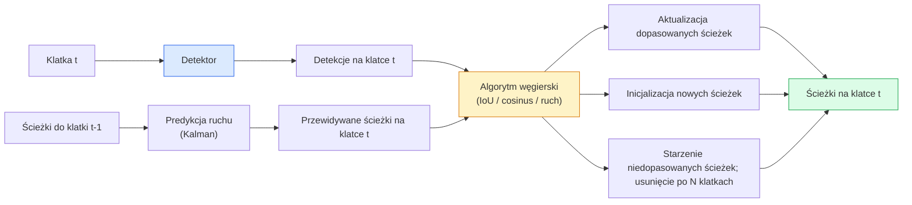

# Śledzenie wielu obiektów (Multi-Object Tracking) i pamięć wideo

> Śledzenie sprowadza się do wykrywania i asocjacji. Wykryj obiekty na każdej klatce. Dopasuj nowe detekcje do istniejących ścieżek (tracks) z poprzedniej klatki na podstawie identyfikatorów.

**Typ:** Kompendium
**Języki:** Python
**Wymagania wstępne:** Faza 4 Lekcja 06 (Wykrywanie obiektów z YOLO), Faza 4 Lekcja 08 (Mask R-CNN), Faza 4 Lekcja 24 (SAM 3)
**Czas:** ~60 minut

## Cele nauczania

- Rozróżniać śledzenie oparte na detekcji (tracking-by-detection) od śledzenia opartego na zapytaniach (query-based tracking) oraz wymieniać kluczowe rodziny algorytmów (SORT, DeepSORT, ByteTrack, BoT-SORT, moduł śledzenia z pamięcią w SAM 2, SAM 3.1 Object Multiplex).
- Zaimplementować od podstaw asocjację opartą na IoU oraz algorytm węgierski dla klasycznego podejścia tracking-by-detection.
- Wyjaśnić działanie banku pamięci w SAM 2 oraz przyczyny, dla których radzi sobie on z okluzjami lepiej niż asocjacja oparta wyłącznie na IoU.
- Interpretować trzy główne metryki śledzenia (MOTA, IDF1, HOTA) i dobierać odpowiednią metrykę do konkretnego przypadku użycia.

## Problem

Detektor informuje o położeniu obiektów na pojedynczej klatce. Moduł śledzący (tracker) pozwala ustalić, która detekcja na klatce `t` reprezentuje ten sam obiekt co detekcja na klatce `t-1`. Bez tego niemożliwe jest liczenie obiektów przekraczających wyznaczoną linię, śledzenie piłki podczas okluzji czy ustalenie, że „samochód o ID 4 znajdował się na danym pasie ruchu przez 8 sekund”.

Śledzenie jest kluczowym elementem systemów analizy wideo: w analityce sportowej, monitoringu (nadzorze wizyjnym), autonomicznej jeździe, analizie obrazowania medycznego czy badaniu migracji zwierząt. Wspólne dla nich są podstawowe bloki budulcowe: detektor przetwarzający klatki, model ruchu (filtr Kalmana lub bardziej złożony), krok asocjacji (algorytm węgierski dopasowujący IoU, podobieństwo cosinusowe lub cechy wyuczone) oraz zarządzanie cyklem życia ścieżki (inicjalizacja/narodziny, aktualizacja, usuwanie/śmierć).

Rok 2026 przyniósł dwa nowe paradygmaty: **śledzenie oparte na pamięci w SAM 2** (wykorzystujące bank pamięci cech zamiast powiązania z modelem ruchu) oraz **SAM 3.1 Object Multiplex** (współdzielona pamięć dla wielu instancji tej samej klasy). W tej lekcji omówimy najpierw klasyczny stos technologiczny, a następnie podejście oparte na pamięci.

## Koncepcja

### Śledzenie oparte na detekcji (Tracking-by-detection)



Większość trackerów stosowanych w praktyce stanowi wariant powyższego schematu. Główne algorytmy to:

- **SORT** (2016): Filtr Kalmana + asocjacja IoU za pomocą algorytmu węgierskiego. Prosty, bardzo szybki algorytm niewykorzystujący cech wyglądu (appearance features).
- **DeepSORT** (2017): SORT rozszerzony o ekstrakcję cech wyglądu dla każdej ścieżki przy użyciu sieci CNN (osadzenia ReID). Lepiej radzi sobie z okluzjami i krzyżowaniem się obiektów.
- **ByteTrack** (2021): w drugim etapie asocjuje detekcje o niskim poziomie ufności (low confidence detections); nie wymaga cech wyglądu, a mimo to osiąga wybitne wyniki w benchmarku MOT17.
- **BoT-SORT** (2022): Udoskonalenie ByteTrack dodające kompensację ruchu kamery (Camera Motion Compensation) oraz moduł ReID.
- **StrongSORT / OC-SORT** — ewolucje ByteTrack oferujące lepsze modelowanie ruchu i cech wyglądu.

### Filtr Kalmana w jednym akapicie

Filtr Kalmana reprezentuje stan każdej ścieżki jako wektor `(x, y, w, h, dx, dy, dw, dh)` wraz z macierzą kowariancji. W każdej klatce następuje **predykcja** stanu na podstawie modelu stałej prędkości (constant velocity model), a następnie **aktualizacja** przy użyciu dopasowanej detekcji. Jeśli niepewność predykcji jest wysoka, algorytm silniej ufa nowej detekcji. Pozwala to uzyskać płynne trajektorie i kontynuować śledzenie podczas krótkich okluzji (1-5 klatek).

Większość klasycznych trackerów wykorzystuje filtr Kalmana w fazie predykcji ruchu.

### Algorytm węgierski

Na podstawie macierzy kosztów o wymiarach `M x N` (gdzie M to liczba ścieżek, a N to liczba detekcji) algorytm wyszukuje przypisanie jeden-do-jednego, które minimalizuje sumaryczny koszt. Jako koszt stosuje się zazwyczaj odległość IoU: `1 - IoU(track_bbox, detection_bbox)` lub ujemne podobieństwo cosinusowe cech wyglądu. Złożoność obliczeniowa wynosi O((M+N)^3), co dla M, N do ~1000 pozwala na szybkie wykonanie w Pythonie za pomocą funkcji `scipy.optimize.linear_sum_assignment`.

### Kluczowy pomysł ByteTrack

Klasyczne trackery odrzucają detekcje o niskim progu ufności (np. < 0.5). ByteTrack zachowuje je jako **kandydatów drugiego etapu**: po sparowaniu ścieżek z pewnymi detekcjami, pozostałe (niedopasowane) ścieżki próbuje się skojarzyć z detekcjami o niskiej ufności, stosując nieco bardziej tolerancyjny próg IoU. Pomaga to odzyskać śledzenie po krótkich okluzjach i zapobiega zmianom identyfikatorów (ID switches) w tłumie.

### Śledzenie oparte na pamięci SAM 2

SAM 2 obsługuje wideo poprzez utrzymywanie **banku pamięci** (memory bank) przechowującego przestrzenno-czasowe cechy poszczególnych obiektów. Po otrzymaniu promptu (kliknięcie, ramka otaczająca, tekst) na pojedynczej klatce, model koduje dany obiekt w pamięci. Na kolejnych klatkach zawartość banku pamięci jest porównywana (cross-attention) z cechami nowej klatki, a dekoder generuje maskę segmentacji dla tej samej instancji.

W tym podejściu nie stosuje się filtra Kalmana ani algorytmu węgierskiego — powiązanie (asocjacja) realizowane jest niejawnie przez mechanizm uwagi (memory attention).

**Zalety:**
- Wysoka odporność na długotrwałe okluzje (bank pamięci zachowuje tożsamość obiektu przez wiele klatek).
- Wsparcie dla otwartego słownika (open-vocabulary) w połączeniu z promptowaniem tekstowym w wersjach SAM 3.
- Działanie bez konieczności definiowania jawnego modelu ruchu.

**Wady:**
- Niższa wydajność w porównaniu z ByteTrack przy śledzeniu bardzo wielu obiektów jednocześnie.
- Rozrastający się bank pamięci ogranicza efektywne okno kontekstowe.

### Object Multiplex SAM 3.1

Wcześniejsze mechanizmy śledzenia w SAM 2 / SAM 3 utrzymywały osobny bank pamięci dla każdego obiektu (np. dla 50 obiektów tworzonych było 50 banków). Rozwiązanie Object Multiplex (wprowadzone w marcu 2026 r.) łączy je w jedną współdzieloną pamięć, wykorzystując **dedykowane tokeny zapytań dla poszczególnych instancji (query tokens)**. Koszt obliczeniowy skaluje się subliniowo wraz ze wzrostem liczby śledzonych obiektów.

Object Multiplex stał się w 2026 roku standardem przy śledzeniu tłumów: na koncertach, w halach magazynowych czy na ruchliwych skrzyżowaniach.

### Trzy wskaźniki, które warto znać

- **MOTA (Multi-Object Tracking Accuracy)** — obliczana jako `1 - (FN + FP + ID_switches) / GT`. Pojedynczy wskaźnik łączący błędy detekcji i asocjacji.
- **IDF1 (ID F1 Score)** — średnia harmoniczna precyzji i czułości identyfikacji (ID precision / ID recall). Mierzy, jak stabilnie dana ścieżka referencyjna zachowuje przypisany jej identyfikator w czasie. Jest lepszym wyborem niż MOTA w zastosowaniach, gdzie kluczowe jest unikanie przełączeń ID.
- **HOTA (Higher Order Tracking Accuracy)** — rozkłada się na dokładność detekcji (DetA) oraz dokładność asocjacji (AssA). Od 2020 roku stanowi standard w społeczności naukowej jako najbardziej wszechstronna metryka.

W systemach nadzoru wideo (gdzie ważna jest ciągłość tożsamości): najważniejsza jest metryka IDF1. W analityce sportowej lub liczeniu zdarzeń: HOTA. Do ogólnych porównań akademickich: HOTA.

## Zbuduj to

### Krok 1: Obliczanie macierzy kosztów opartej na IoU

```python
import numpy as np

def bbox_iou(a, b):
    """
    a, b: tablice o kształcie (N, 4) z formatem [x1, y1, x2, y2].
    Zwraca macierz IoU o wymiarach (N_a, N_b).
    """
    ax1, ay1, ax2, ay2 = a[:, 0], a[:, 1], a[:, 2], a[:, 3]
    bx1, by1, bx2, by2 = b[:, 0], b[:, 1], b[:, 2], b[:, 3]
    inter_x1 = np.maximum(ax1[:, None], bx1[None, :])
    inter_y1 = np.maximum(ay1[:, None], by1[None, :])
    inter_x2 = np.minimum(ax2[:, None], bx2[None, :])
    inter_y2 = np.minimum(ay2[:, None], by2[None, :])
    inter = np.clip(inter_x2 - inter_x1, 0, None) * np.clip(inter_y2 - inter_y1, 0, None)
    area_a = (ax2 - ax1) * (ay2 - ay1)
    area_b = (bx2 - bx1) * (by2 - by1)
    union = area_a[:, None] + area_b[None, :] - inter
    return inter / np.clip(union, 1e-8, None)
```

### Krok 2: Minimalistyczny tracker w stylu SORT

Dla uproszczenia kodu pominęliśmy filtr Kalmana, stosując jedynie asocjację IoU. W systemach produkcyjnych modelowanie ruchu (np. Kalman) jest niezbędne. Pełną wersję można znaleźć w pakiecie `sort`.

```python
from scipy.optimize import linear_sum_assignment

class Track:
    def __init__(self, tid, bbox, frame):
        self.id = tid
        self.bbox = bbox
        self.last_frame = frame
        self.hits = 1

    def update(self, bbox, frame):
        self.bbox = bbox
        self.last_frame = frame
        self.hits += 1

class SimpleTracker:
    def __init__(self, iou_threshold=0.3, max_age=5):
        self.tracks = []
        self.next_id = 1
        self.iou_threshold = iou_threshold
        self.max_age = max_age

    def step(self, detections, frame):
        if not self.tracks:
            for d in detections:
                self.tracks.append(Track(self.next_id, d, frame))
                self.next_id += 1
            return [(t.id, t.bbox) for t in self.tracks]

        track_boxes = np.array([t.bbox for t in self.tracks])
        det_boxes = np.array(detections) if len(detections) else np.empty((0, 4))

        iou = bbox_iou(track_boxes, det_boxes) if len(det_boxes) else np.zeros((len(track_boxes), 0))
        cost = 1 - iou
        cost[iou < self.iou_threshold] = 1e6

        matched_track = set()
        matched_det = set()
        if cost.size > 0:
            row, col = linear_sum_assignment(cost)
            for r, c in zip(row, col):
                if cost[r, c] < 1.0:
                    self.tracks[r].update(det_boxes[c], frame)
                    matched_track.add(r); matched_det.add(c)

        for i, d in enumerate(det_boxes):
            if i not in matched_det:
                self.tracks.append(Track(self.next_id, d, frame))
                self.next_id += 1

        self.tracks = [t for t in self.tracks if frame - t.last_frame <= self.max_age]
        return [(t.id, t.bbox) for t in self.tracks]
```

Kod ma zaledwie 60 linii. Przyjmuje detekcje dla danej klatki i zwraca przypisane identyfikatory ścieżek. Wersje produkcyjne rozszerza się o filtr Kalmana, asocjację drugiego etapu (ByteTrack) oraz cechy wyglądu.

### Krok 3: Test z użyciem syntetycznych trajektorii

```python
def synthetic_frames(num_frames=20, num_objects=3, H=240, W=320, seed=0):
    rng = np.random.default_rng(seed)
    starts = rng.uniform(20, 200, size=(num_objects, 2))
    velocities = rng.uniform(-5, 5, size=(num_objects, 2))
    frames = []
    for f in range(num_frames):
        dets = []
        for i in range(num_objects):
            cx, cy = starts[i] + f * velocities[i]
            dets.append([cx - 10, cy - 10, cx + 10, cy + 10])
        frames.append(dets)
    return frames

tracker = SimpleTracker()
for f, dets in enumerate(synthetic_frames()):
    tracks = tracker.step(dets, f)
```

Trzy obiekty poruszające się po liniach prostych powinny bezbłędnie zachować swoje identyfikatory przez wszystkie 20 klatek.

### Krok 4: Zliczanie przełączeń identyfikatorów (ID Switches)

```python
def count_id_switches(tracks_per_frame, gt_per_frame):
    """
    tracks_per_frame:  lista list krotek (track_id, bbox)
    gt_per_frame:      lista list krotek (gt_id, bbox)
    Zwraca liczbę przełączeń ID (ID switches).
    """
    prev_assignment = {}
    switches = 0
    for tracks, gts in zip(tracks_per_frame, gt_per_frame):
        if not tracks or not gts:
            continue
        t_boxes = np.array([b for _, b in tracks])
        g_boxes = np.array([b for _, b in gts])
        iou = bbox_iou(g_boxes, t_boxes)
        for g_idx, (gt_id, _) in enumerate(gts):
            j = iou[g_idx].argmax()
            if iou[g_idx, j] > 0.5:
                t_id = tracks[j][0]
                if gt_id in prev_assignment and prev_assignment[gt_id] != t_id:
                    switches += 1
                prev_assignment[gt_id] = t_id
    return switches
```

Jest to uproszczona metryka nawiązująca do IDF1, zliczająca ile razy rzeczywisty obiekt (ground truth) zmienia przypisany mu identyfikator ścieżki. Kompletne implementacje metryk MOTA / IDF1 / HOTA znajdują się w bibliotekach `py-motmetrics` oraz `TrackEval`.

## Zastosowanie w praktyce

Rozwiązania do śledzenia w produkcji (stan na 2026 r.):

- `ultralytics` — wbudowane implementacje YOLOv8/YOLOv11 z ByteTrack / BoT-SORT. Wywołanie: `results = model.track(source, tracker="bytetrack.yaml")`.
- `supervision` (Roboflow) — przyjazne API dla ByteTrack oraz narzędzia pomocnicze do wizualizacji i adnotacji.
- SAM 2 / SAM 3.1 — śledzenie oparte na pamięci za pomocą metody `processor.track()`.
- Własny stos technologiczny: detektor (np. YOLOv8 / RT-DETR) połączony z biblioteką taką jak `sort-tracker`, `OC-SORT` lub `StrongSORT`.

### Podsumowanie wyboru (Cheat Sheet)

- Pieszy, pojazdy, obiekty na taśmie przy 30+ FPS: **ByteTrack (np. w wydaniu Ultralytics)**.
- Wiele instancji tej samej klasy w gęstym tłumie: **SAM 3.1 Object Multiplex**.
- Długotrwałe okluzje z obiektami o charakterystycznym wyglądzie: **DeepSORT / StrongSORT** (wykorzystujące ekstrakcję cech ReID).
- Analiza sportowa / skomplikowane interakcje ruchowe: **BoT-SORT** lub modele uczone end-to-end (np. MOTRv3).

## Dostarczone pliki

Ta lekcja zawiera następujące zasoby:

- `outputs/prompt-tracker-picker.md` — ułatwia wybór pomiędzy SORT / ByteTrack / BoT-SORT / SAM 2 / SAM 3.1 w zależności od specyfiki sceny, stopnia okluzji i budżetu opóźnień.
- `outputs/skill-mot-evaluator.md` — zawiera pełny skrypt ewaluacyjny do wyliczania MOTA / IDF1 / HOTA w stosunku do danych referencyjnych.

## Ćwiczenia praktyczne

1. **(Łatwe)** Uruchom powyższy prosty tracker dla 3, 10 oraz 30 obiektów. Zapisz liczbę przełączeń identyfikatorów (ID switches). Wskaż, w jakich sytuacjach asocjacja oparta wyłącznie na IoU przestaje wystarczać.
2. **(Średnie)** Dodaj krok predykcji ruchu filtrem Kalmana (model stałej prędkości) przed etapem asocjacji. Wykaż, że krótkie okluzje (2-3 klatki) nie powodują już utraty tożsamości obiektów.
3. **(Trudne)** Zintegruj tracker z pamięcią SAM 2 (np. z biblioteki `transformers`) jako alternatywny moduł śledzący. Uruchom oba podejścia (SimpleTracker i SAM 2) na 30-sekundowym nagraniu wideo przedstawiającym tłum. Ręcznie oznacz rzeczywiste ścieżki dla 5 wybranych osób i porównaj liczbę przełączeń ID w obu wariantach.

## Kluczowe terminy

| Termin | Potoczne określenie | Rzeczywiste znaczenie |
|------|----------------|----------------------|
| Śledzenie oparte na detekcji | „Wykryj, a następnie skojarz” | Detekcja obiektów na każdej klatce + asocjacje za pomocą algorytmu węgierskiego na bazie IoU lub cech wyglądu |
| Filtr Kalmana | „Przewidywanie ruchu” | Model dynamiki liniowej z macierzą kowariancji do wygładzania trajektorii i śledzenia podczas okluzji |
| Algorytm węgierski | „Optymalne przypisanie” | Rozwiązuje problem skojarzeń dwudzielnych (bipartite matching) o minimalnym koszcie; `scipy.optimize.linear_sum_assignment` |
| ByteTrack | „Drugie przejście o niskiej pewności” | Ponowne dopasowanie dotychczas nieskojarzonych ścieżek do detekcji o niskiej ufności w celu obsługi okluzji |
| DeepSORT | „SORT + wygląd” | Wykorzystuje cechy ReID do dopasowywania obiektów między klatkami w celu stabilniejszego utrzymania tożsamości |
| Bank pamięci | „Sztuczka SAM 2” | Przestrzenno-czasowe cechy obiektów przechowywane w klatkach wideo; mechanizm uwagi (cross-attention) zastępuje jawną asocjację |
| Object Multiplex | „Pamięć współdzielona SAM 3.1” | Współdzielona pamięć z dedykowanymi tokenami zapytań dla obiektów w celu wydajnego śledzenia wielu instancji |
| HOTA | „Nowoczesne metryki śledzenia” | Rozkłada błędy na dokładność detekcji i asocjacji; powszechny standard naukowy |

## Dalsze czytanie

- [SORT (Bewley et al., 2016)](https://arxiv.org/abs/1602.00763) — dokument dotyczący minimalnego śledzenia przez wykrycie
- [DeepSORT (Wojke et al., 2017)](https://arxiv.org/abs/1703.07402) — dodaje cechy wyglądu
- [ByteTrack (Zhang et al., 2022)](https://arxiv.org/abs/2110.06864) — drugie przejście o niskiej ufności detekcji
- [BoT-SORT (Aharon et al., 2022)](https://arxiv.org/abs/2206.14651) — kompensacja ruchu kamery
- [HOTA (Luiten et al., 2020)](https://arxiv.org/abs/2009.07736) — zrównoważona metryka oceny śledzenia
- [Segmentacja wideo SAM 2 (Meta, 2024)](https://ai.meta.com/sam2/) — model śledzenia oparty na pamięci
- [SAM 3.1 Object Multiplex (Meta, marzec 2026 r.)](https://ai.meta.com/blog/segment-anything-model-3/)
