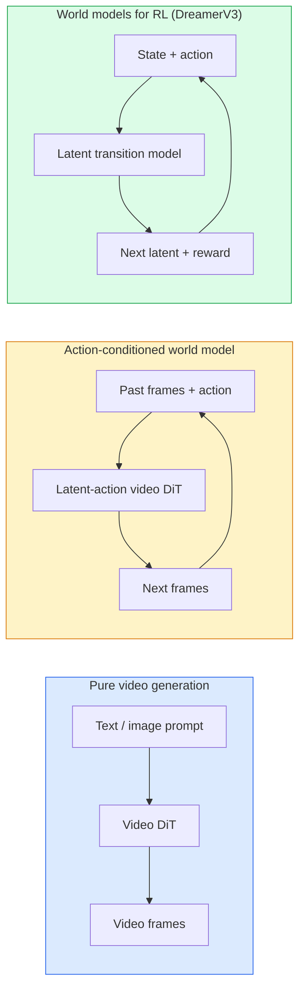

# Modele świata i rozpowszechnianie wideo

> Model wideo, który przewiduje kolejne sekundy sceny, to symulator świata. Uwarunkowuj przewidywanie działań, a otrzymasz wyuczony silnik gry.

**Typ:** Ucz się + Buduj
**Języki:** Python
**Wymagania wstępne:** Faza 4, lekcja 10 (dyfuzja), faza 4, lekcja 12 (zrozumienie wideo), faza 4, lekcja 23 (DiT + rektyfikowany przepływ)
**Czas:** ~75 minut

## Cele nauczania

- Wyjaśnij różnicę pomiędzy modelem generowania czystego wideo (Sora 2) a modelem świata uwarunkowanego akcją (Genie 3, DreamerV3)
- Opisz wideo DiT: plamy przestrzenno-czasowe, kodowanie pozycji 3D, wspólna uwaga na tokenach (T, H, W)
- Prześledź, jak model świata podłącza się do robotyki: plany VLM → model wideo symuluje → odwrotna dynamika emituje działania
- Wybierz pomiędzy Sora 2, Genie 3, Runway GWM-1 Worlds, Wan-Video i HunyuanVideo dla danego przypadku użycia (kreatywne wideo, interaktywna symulacja, synteza autonomicznej jazdy)

## Problem

Generowanie wideo i modelowanie świata połączyły się w 2026 r. Model, który może wygenerować spójną minutę wideo, w pewnym sensie nauczył się, jak porusza się świat: trwałość obiektu, grawitacja, przyczynowość, styl. Jeśli uzależnisz tę prognozę od działań (pójdź w lewo, otwórz drzwi), model wideo stanie się symulatorem, którego można się nauczyć, który może zastąpić silnik gry, symulator jazdy lub środowisko robotyki.

Stawka jest konkretna. Genie 3 generuje grywalne środowiska z jednego obrazu. Runway GWM-1 Worlds to synteza nieskończonych scen, które można eksplorować. Sora 2 tworzy minutowe filmy ze zsynchronizowanym dźwiękiem i modelowaną fizyką. NVIDIA Cosmos-Drive, Wayve Gaia-2 i Tesla DrivingWorld generują realistyczne wideo z jazdy na potrzeby danych szkoleniowych dotyczących pojazdów autonomicznych. Paradygmat modelu świata po cichu przejmuje w robotyce symulację i rzeczywistość.

Ta lekcja jest lekcją „szerszego obrazu” dla Fazy 4. Łączy generowanie obrazu, zrozumienie wideo i rozumowanie agentyczne z dominującymi badaniami nad wzorcami architektury.

## Koncepcja

### Trzy rodziny modelowania świata



- **Sora 2** to czysta generacja wideo uzależniona od podpowiedzi. Brak interfejsu akcji. Nie można nim „sterować” w trakcie wdrażania.
- **Genie 3**, **Światy GWM-1**, **Mirage / Magica** to modele światów uwarunkowanych działaniem. Wnioskuj o ukrytych działaniach na podstawie zaobserwowanego materiału wideo, a następnie uzależniaj przewidywania przyszłych klatek od działań. Interaktywny — naciskasz klawisze lub poruszasz kamerą, a scena reaguje.
- **DreamerV3** i rodzina klasycznych modeli świata RL przewidują przewidywanie w przestrzeni ukrytej z wyraźnym warunkowaniem działania, wytrenowane na sygnale nagrody. Mniej wizualne; bardziej przydatne w przypadku RL efektywnego próbkowania.

### Architektura wideo DiT

```
Video latent:          (C, T, H, W)
Patchify (spatial):    grid of P_h x P_w patches per frame
Patchify (temporal):   group P_t frames into a temporal patch
Resulting tokens:      (T / P_t) * (H / P_h) * (W / P_w) tokens
```

Kodowanie pozycyjne to 3D: obrotowe lub wyuczone osadzanie na współrzędne (t, h, w). Uwaga może być:

- **Pełne połączenie** — wszystkie tokeny obsługują wszystkie tokeny. O(N^2) z N żetonami. Zabronione w przypadku długich filmów.
- **Podzielona** — naprzemienna uwaga czasowa (ta sama pozycja przestrzenna, w czasie: `(H*W) * T^2`) i uwaga przestrzenna (ten sam krok czasowy, w przestrzeni: `T * (H*W)^2`). Używany przez TimeSformer i większość wideo DiT.
- **Window** — okna lokalne w (t, h, w). Używany przez Video Swin.

Każdy model dyfuzji wideo na rok 2026 wykorzystuje jeden z tych trzech wzorców oraz kondycjonowanie AdaLN (lekcja 23) i przepływ wyprostowany.

### Uwarunkowanie działań: ukryte modele działania

Genie uczy się **ukrytego działania** na klatkę poprzez dyskryminacyjne przewidywanie działania pomiędzy parą kolejnych klatek. Dekoder modelu następnie warunkuje wywnioskowane ukryte działanie, a nie jawne klawisze klawiatury. Na podstawie wniosków użytkownik może określić ukrytą akcję (lub pobrać próbkę z nowej akcji), a model generuje następną klatkę zgodną z tą akcją.

Sora całkowicie pomija interfejs akcji. Jego dekoder przewiduje następne żetony czasoprzestrzeni na podstawie przeszłych żetonów czasoprzestrzeni. Szybkie warunki rozpoczęcia; nic nie kieruje tym w połowie pokolenia.

### Wiarygodność fizyczna

Wydanie Sory 2 z 2026 roku wyraźnie reklamowało **wiarygodność fizyczną**: wagę, równowagę, trwałość obiektu, przyczynę i skutek. Mierzone przez zespół za pomocą ręcznie ocenianych wyników wiarygodności; model wyraźnie poprawia się w przypadku upuszczonych obiektów, kolizji postaci i celowych niepowodzeń (nieudany skok) w porównaniu z Sorą 1.

Wiarygodność pozostaje dominującym trybem awarii. Filmy z lat 2024–2025 przedstawiające ludzi jedzących spaghetti lub pijących ze szklanek ujawniły, że modelka nie ma trwałej reprezentacji obiektów. Modele 2026 (Sora 2, Runway Gen-5, HunyuanVideo) ograniczają te zjawiska, ale ich nie eliminują.

### Modele świata autonomicznej jazdy

Modele świata jazdy generują realistyczne sceny drogowe uzależnione od trajektorii, ramek ograniczających lub map nawigacyjnych. Sposób użycia:

- **Cosmos-Drive-Dreams** (NVIDIA) — generuje minuty wideo z jazdy na potrzeby szkolenia RL.
- **Gaia-2** (Wayve) — synteza scen uwarunkowanych trajektorią na potrzeby oceny polityki.
- **DrivingWorld** (Tesla) — symuluje zróżnicowaną pogodę, porę dnia i warunki na drodze.
- **Vista** (ByteDance) — reaktywna synteza scen jazdy.

Zastępują kosztowne gromadzenie danych ze świata rzeczywistego w przypadku narożnych przypadków – chodników dla pieszych nocą, oblodzonych skrzyżowań, nietypowych typów pojazdów – które w przeciwnym razie wymagałyby przejechania milionów mil.

### Stos robotyki: VLM + model wideo + dynamika odwrotna

Powstająca trójelementowa pętla robotyki:

1. **VLM** analizuje cel („podnieś czerwony kubek”), planuje sekwencję działań na wysokim poziomie.
2. **Model generowania wideo** symuluje, jak wyglądałoby wykonanie każdej akcji — przewiduje obserwacje N klatek do przodu.
3. **Model dynamiki odwrotnej** wyodrębnia konkretne polecenia silnika, które prowadzą do tych obserwacji.

Zastępuje to kształtowanie nagrody i RL z dużą ilością próbek. Model świata pobudza wyobraźnię; odwrotna dynamika zamyka pętlę po uruchomieniu. Genie Envisioner to jedna instancja; wiele grup badawczych skupia się na tej strukturze.

### Ocena

- **Jakość wizualna** — FVD (Fréchet Video Distance), badania użytkowników.
- **Szybkie dopasowanie** — CLIPScore na klatkę, ocena w stylu VQA.
- **Wiarygodność fizyczna** — ręcznie oceniona w zestawie testów porównawczych (wewnętrzny test porównawczy Sory 2, VBench).
- **Sterowalność** (dla interaktywnych modeli świata) — działanie → spójność obserwacji; czy możesz wrócić do poprzedniego stanu?

### Modelowy krajobraz w 2026 roku

| Modelka | Użyj | Parametry | Wyjście | Licencja |
|-------|-----|------------|-------|-------------|
| Sora 2 | tekst na wideo, audio | — | 1-min 1080p + dźwięk | Tylko API |
| Pas startowy Gen-5 | tekst/obraz do wideo | — | Klipy z lat 10. | API |
| Światy pasa startowego GWM-1 | interaktywny świat | — | nieskończone wdrażanie 3D | API |
| Dżin 3 | interaktywny świat z obrazka | 11B+ | grywalne klatki | podgląd badań |
| Wan-Video 2.1 | otwórz zamianę tekstu na wideo | 14B | wysokiej jakości klipy | niekomercyjne |
| HunyuanWideo | otwórz zamianę tekstu na wideo | 13B | Klipy z lat 10. | zezwalający |
| Kosmos / Napęd Kosmosu | symulator jazdy autonomicznej | 7-14B | sceny jazdy | NVIDIA otwarta |
| Magica / Miraż 2 | Silnik gier natywny dla sztucznej inteligencji | — | modyfikowalne światy | produkt |

## Zbuduj to

### Krok 1: poprawka 3D dla wideo

```python
import torch
import torch.nn as nn

class VideoPatch3D(nn.Module):
    def __init__(self, in_channels=4, dim=64, patch_t=2, patch_h=2, patch_w=2):
        super().__init__()
        self.proj = nn.Conv3d(
            in_channels, dim,
            kernel_size=(patch_t, patch_h, patch_w),
            stride=(patch_t, patch_h, patch_w),
        )
        self.patch_t = patch_t
        self.patch_h = patch_h
        self.patch_w = patch_w

    def forward(self, x):
        # x: (N, C, T, H, W)
        x = self.proj(x)
        n, c, t, h, w = x.shape
        tokens = x.reshape(n, c, t * h * w).transpose(1, 2)
        return tokens, (t, h, w)
```

Konwersja 3D o kroku równym jądrze działa jak łatacz czasoprzestrzenny. `(T, H, W) -> (T/2, H/2, W/2)` siatka tokenów.

### Krok 2: Kodowanie pozycji obrotowej 3D

Obrotowe osadzanie pozycji (RoPE) oddzielnie stosowane wzdłuż osi `t`, `h`, `w`:

```python
def rope_3d(tokens, t_dim, h_dim, w_dim, grid):
    """
    tokens: (N, T*H*W, D)
    grid: (T, H, W) sizes
    t_dim + h_dim + w_dim == D
    """
    T, H, W = grid
    n, seq, d = tokens.shape
    if t_dim + h_dim + w_dim != d:
        raise ValueError(f"t_dim+h_dim+w_dim ({t_dim}+{h_dim}+{w_dim}) must equal D={d}")
    assert seq == T * H * W
    t_idx = torch.arange(T, device=tokens.device).repeat_interleave(H * W)
    h_idx = torch.arange(H, device=tokens.device).repeat_interleave(W).repeat(T)
    w_idx = torch.arange(W, device=tokens.device).repeat(T * H)
    # Simplified: just scale channels by frequencies. Real RoPE rotates pairs.
    freqs_t = torch.exp(-torch.log(torch.tensor(10000.0)) * torch.arange(t_dim // 2, device=tokens.device) / (t_dim // 2))
    freqs_h = torch.exp(-torch.log(torch.tensor(10000.0)) * torch.arange(h_dim // 2, device=tokens.device) / (h_dim // 2))
    freqs_w = torch.exp(-torch.log(torch.tensor(10000.0)) * torch.arange(w_dim // 2, device=tokens.device) / (w_dim // 2))
    emb_t = torch.cat([torch.sin(t_idx[:, None] * freqs_t), torch.cos(t_idx[:, None] * freqs_t)], dim=-1)
    emb_h = torch.cat([torch.sin(h_idx[:, None] * freqs_h), torch.cos(h_idx[:, None] * freqs_h)], dim=-1)
    emb_w = torch.cat([torch.sin(w_idx[:, None] * freqs_w), torch.cos(w_idx[:, None] * freqs_w)], dim=-1)
    return tokens + torch.cat([emb_t, emb_h, emb_w], dim=-1)
```

Uproszczona forma dodatku. Real RoPE obraca sparowane kanały na częstotliwościach; informacja o pozycji jest taka sama.

### Krok 3: Blok podzielonej uwagi

```python
class DividedAttentionBlock(nn.Module):
    def __init__(self, dim=64, heads=2):
        super().__init__()
        self.time_attn = nn.MultiheadAttention(dim, heads, batch_first=True)
        self.space_attn = nn.MultiheadAttention(dim, heads, batch_first=True)
        self.ln1 = nn.LayerNorm(dim)
        self.ln2 = nn.LayerNorm(dim)
        self.ln3 = nn.LayerNorm(dim)
        self.mlp = nn.Sequential(nn.Linear(dim, 4 * dim), nn.GELU(), nn.Linear(4 * dim, dim))

    def forward(self, x, grid):
        T, H, W = grid
        n, seq, d = x.shape
        # time attention: same (h, w), across t
        xt = x.view(n, T, H * W, d).permute(0, 2, 1, 3).reshape(n * H * W, T, d)
        a, _ = self.time_attn(self.ln1(xt), self.ln1(xt), self.ln1(xt), need_weights=False)
        xt = (xt + a).reshape(n, H * W, T, d).permute(0, 2, 1, 3).reshape(n, seq, d)
        # space attention: same t, across (h, w)
        xs = xt.view(n, T, H * W, d).reshape(n * T, H * W, d)
        a, _ = self.space_attn(self.ln2(xs), self.ln2(xs), self.ln2(xs), need_weights=False)
        xs = (xs + a).reshape(n, T, H * W, d).reshape(n, seq, d)
        xs = xs + self.mlp(self.ln3(xs))
        return xs
```

Uwaga czasowa skupia się na każdej pozycji przestrzennej w czasie; uwaga przestrzenna skupia się na każdej klatce w różnych pozycjach. Dwie operacje O(T^2 + (HW)^2) zamiast jednej O((THW)^2). To jest rdzeń TimeSformera i każdego współczesnego wideo DiT.

### Krok 4: Skomponuj mały film DiT

```python
class TinyVideoDiT(nn.Module):
    def __init__(self, in_channels=4, dim=64, depth=2, heads=2):
        super().__init__()
        self.patch = VideoPatch3D(in_channels=in_channels, dim=dim, patch_t=2, patch_h=2, patch_w=2)
        self.blocks = nn.ModuleList([DividedAttentionBlock(dim, heads) for _ in range(depth)])
        self.out = nn.Linear(dim, in_channels * 2 * 2 * 2)

    def forward(self, x):
        tokens, grid = self.patch(x)
        for blk in self.blocks:
            tokens = blk(tokens, grid)
        return self.out(tokens), grid
```

Nie działający generator wideo; demonstracja strukturalna, w której każdy element ma prawidłowy kształt.

### Krok 5: Sprawdź kształty

```python
vid = torch.randn(1, 4, 8, 16, 16)  # (N, C, T, H, W)
model = TinyVideoDiT()
out, grid = model(vid)
print(f"input  {tuple(vid.shape)}")
print(f"tokens grid {grid}")
print(f"output {tuple(out.shape)}")
```

Po załataniu spodziewaj się `grid = (4, 8, 8)` i `out = (1, 256, 32)`; Następnie głowa wyświetla łaty czasoprzestrzenne dla każdego tokenu, gotowe do usunięcia poprawki z powrotem do filmu.

## Użyj tego

Schematy dostępu do produkcji na rok 2026:

- **Sora 2 API** (OpenAI) — zamiana tekstu na wideo, zsynchronizowany dźwięk. Ceny premium.
- **Runway Gen-5 / GWM-1** (Pas startowy) — interaktywne światy obrazu do wideo.
- **Wan-Video 2.1 / HunyuanVideo** — własny host typu open source.
- **Cosmos / Cosmos-Drive** (NVIDIA) — symulacja jazdy z otwartymi ciężarami.
- **Genie 3** — podgląd badań, poproś o dostęp.

Aby zbudować interaktywną wersję demonstracyjną modelu świata: zacznij od Wan-Video, aby uzyskać jakość, a następnie zainstaluj adapter z ukrytym działaniem, aby zapewnić interaktywność. Do symulacji jazdy autonomicznej: Cosmos-Drive jest otwartym punktem odniesienia na rok 2026.

W przypadku robotyki stos na wolności:

1. Cel językowy -> VLM (Qwen3-VL) -> plan wysokiego poziomu.
2. Plan -> model wideo z ukrytym działaniem -> wyobrażone wdrożenie.
3. Wdrożenie -> model dynamiki odwrotnej -> działania niskiego poziomu.
4. Wykonane działania -> obserwacja przekazana do kroku 1.

## Wyślij to

Ta lekcja daje:

- `outputs/prompt-video-model-picker.md` — wybiera pomiędzy Sora 2 / Runway / Wan / HunyuanVideo / Cosmos z danym zadaniem, licencją i opóźnieniem.
- `outputs/skill-physical-plausibility-checks.md` — umiejętność definiująca automatyczne kontrole (trwałość obiektu, grawitacja, ciągłość) przeprowadzane na każdym wygenerowanym materiale wideo przed wysyłką.

## Ćwiczenia

1. **(Łatwe)** Oblicz liczbę tokenów dla 5-sekundowego wideo 360p w patch-t=2, patch-h=8, patch-w=8. Powód pamięci dla uwagi przy tej wielkości.
2. **(Średni)** Zamień powyższy blok podzielonej uwagi na pełny blok wspólnej uwagi i zmierz kształt i liczbę parametrów. Wyjaśnij, dlaczego w przypadku rzeczywistych modeli wideo konieczna jest podzielona uwaga.
3. **(Trudny)** Zbuduj minimalny model wideo z ukrytą akcją: weź zbiór danych złożony z trójek (frame_t, action_t, ramka_{t+1}) (dowolna prosta gra 2D), wytrenuj mały wideo DiT uwarunkowany osadzeniem akcji i pokaż, że różne akcje dają różne kolejne klatki.

## Kluczowe terminy

| Termin | Co ludzie mówią | Co to właściwie oznacza |
|------|----------------|----------------------|
| Model świata | „Uczony symulator” | Model przewidujący przyszłe obserwacje przy danym stanie i działaniu |
| Wideo DiT | „Transformator czasoprzestrzeni” | Transformator dyfuzyjny z łataniem 3D i podzieloną uwagą |
| Ukryte działanie | „Wywnioskowana kontrola” | Dyskretne lub ciągłe działanie ukryte na podstawie par ramek; używany do warunkowania generacji następnej klatki |
| Podzielona uwaga | „Czas, potem przestrzeń” | Dwie operacje uwagi na blok — w czasie, a potem w przestrzeni — aby zapewnić możliwość zarządzania O(N^2) |
| Trwałość obiektu | „Wszystko pozostaje prawdziwe” | Właściwość sceny, której muszą się nauczyć modele wideo; klasyczny tryb awarii żywności, wyrobów szklanych |
| FVD | „Odległość wideo Fréchet” | Odpowiednik wideo FID; podstawowy miernik jakości wizualnej |
| Odwrotny model dynamiki | „Uwagi do działań” | Biorąc pod uwagę (stan, następny stan), wypisz akcję, która je łączy; zamyka pętlę robotyki |
| Napęd Kosmos | „Symulator jazdy NVIDIA” | Model świata autonomicznej jazdy z otwartymi ciężarami dla RL i oceny |

## Dalsze czytanie

- [Raport techniczny Sora (OpenAI)](https://openai.com/index/video-generacja-models-as-world-simulators/)
- [Genie: Generative Interactive Environments (Bruce et al., 2024)](https://arxiv.org/abs/2402.15391) — modele świata ukrytych działań
- [TimeSformer (Bertasius et al., 2021)](https://arxiv.org/abs/2102.05095) — podzielona uwaga dotycząca transformatorów wideo
- [DreamerV3 (Hafner et al., 2023)](https://arxiv.org/abs/2301.04104) — światowe modele RL
- [Cosmos-Drive-Dreams (NVIDIA, 2025)](https://research.nvidia.com/labs/toronto-ai/cosmos-drive-dreams/) — model świata jazdy
– [10 najpopularniejszych modeli generowania wideo 2026 r. (DataCamp)](https://www.datacamp.com/blog/top-video-generacja-models)
– [Od generowania wideo do modelu świata – repozytorium ankiety](https://github.com/ziqihuangg/Awesome-From-Video-Generation-to-World-Model/)