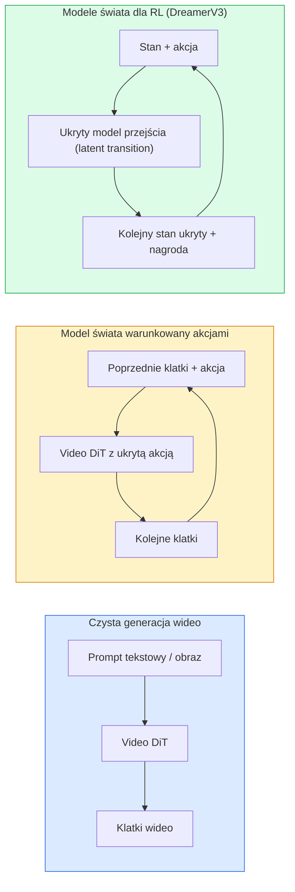

# Modele świata (World Models) i generowanie wideo metodą dyfuzji (Video Diffusion)

> Model wideo przewidujący kolejne sekundy sceny działa jak symulator świata. Dodaj warunkowanie akcjami (action conditioning), a otrzymasz w pełni wyuczony silnik gry (neural game engine).

**Typ:** Teoria + Praktyka
**Języki:** Python
**Wymagania wstępne:** Faza 4 Lekcja 10 (Modele dyfuzyjne), Faza 4 Lekcja 12 (Analiza wideo), Faza 4 Lekcja 23 (DiT + Rectified Flow)
**Czas:** ~75 minut

## Cele nauczania

- Wyjaśnić różnicę między modelem do czystej generacji wideo (np. Sora 2) a modelem świata warunkowanym akcjami (action-conditioned world model, np. Genie 3, DreamerV3).
- Opisać architekturę Video DiT: tokeny przestrzenno-czasowe (spacetime patches), kodowanie pozycji 3D oraz mechanizmy uwagi na tokenach czasowo-przestrzennych (T, H, W).
- Opisać rolę modelu świata w robotyce: planowanie za pomocą modeli VLM → symulacja wideo za pomocą modelu świata → generowanie akcji niskiego poziomu przez model odwrotnej dynamiki (inverse dynamics model).
- Dobierać odpowiednie modele (Sora 2, Genie 3, Runway GWM-1 Worlds, Wan-Video, HunyuanVideo) do konkretnych zastosowań (kreatywna produkcja wideo, symulacja interaktywna, synteza danych dla pojazdów autonomicznych).

## Problem

W 2026 roku generowanie wideo i modelowanie świata (world modeling) połączyły się w jedną dziedzinę. Model zdolny wygenerować spójne, minutowe wideo musi opanować reguły rządzące otaczającym światem: ciągłość i trwałość obiektów (object permanence), grawitację, związki przyczynowo-skutkowe oraz fizykę ruchu. Jeśli warunkujemy te predykcje konkretnymi akcjami (np. „idź w lewo”, „otwórz drzwi”), model wideo staje się interaktywnym symulatorem — potrafi zastąpić tradycyjny silnik gry, symulator jazdy czy środowisko treningowe dla robotów.

Stawka jest wysoka. Genie 3 potrafi wygenerować grywalne, interaktywne środowisko 2D/3D z pojedynczego obrazu referencyjnego. Runway GWM-1 Worlds syntetyzuje nieskończone, interaktywne przestrzenie 3D. Sora 2 tworzy fotorealistyczne filmy ze zsynchronizowanym dźwiękiem i zaawansowanym modelowaniem fizyki. Rozwiązania takie jak NVIDIA Cosmos-Drive, Wayve Gaia-2 czy Tesla DrivingWorld generują realistyczne wideo z perspektywy kierowcy na potrzeby trenowania pojazdów autonomicznych. Paradygmat modeli świata przejmuje rolę tradycyjnych symulatorów w robotyce i systemach autonomicznych.

Ta lekcja stanowi podsumowanie Fazy 4. Łączy generowanie obrazu, analizę wideo i wnioskowanie agentyczne z najnowocześniejszymi trendami architektonicznymi sztucznej inteligencji.

## Koncepcja

### Trzy rodziny modeli świata



- **Sora 2** to model do czystej generacji wideo na podstawie promptu. Nie posiada interfejsu akcji i nie pozwala na interaktywne sterowanie w trakcie generowania wideo.
- **Genie 3**, **Runway GWM-1 Worlds**, **Mirage / Magica** to modele świata warunkowane akcjami (action-conditioned). Wyznaczają one ukryte działania (latent actions) na podstawie nagrań wideo, a następnie generują przyszłe klatki w oparciu o te akcje. Użytkownik może na bieżąco wpływać na generowany obraz (np. naciskając klawisze), na co model natychmiast reaguje.
- **DreamerV3** oraz rodzina klasycznych modeli świata w uczeniu ze wzmocnieniem (RL) dokonują predykcji bezpośrednio w przestrzeni ukrytej (latent space) przy jawnym warunkowaniu akcją, ucząc się na podstawie sygnału nagrody. Są mniej nastawione na wysokiej jakości wizualizację, a bardziej na optymalizację próbek w procesie RL.

### Architektura wideo DiT

```
Ukryta reprezentacja wideo (Video latent):  (C, T, H, W)
Krojenie przestrzenne (Patchify spatial):    siatka płatów P_h x P_w na klatkę
Krojenie czasowe (Patchify temporal):       grupa P_t klatek w płat czasowy
Wynikowe tokeny:                            (T / P_t) * (H / P_h) * (W / P_w) tokenów
```

Kodowanie pozycyjne ma charakter 3D (obrotowe RoPE lub wyuczone osadzenie współrzędnych t, h, w). Mechanizm uwagi może być realizowany jako:

- **Pełna uwaga (Full attention)** — każdy token wchodzi w interakcję ze wszystkimi pozostałymi. Złożoność wynosi O(N^2) (gdzie N to liczba tokenów), co uniemożliwia stosowanie dla długich wideo.
- **Podzielona uwaga (Divided/Factorized attention)** — naprzemienne stosowanie uwagi czasowej (ta sama pozycja przestrzenna w czasie: `(H*W) * T^2`) oraz uwagi przestrzennej (ten sam krok czasowy w przestrzeni: `T * (H*W)^2`). Rozwiązanie stosowane w modelach takich jak TimeSformer i większości nowoczesnych architektur Video DiT.
- **Uwaga okienkowa (Window attention)** — uwaga ograniczona do lokalnych okien w przestrzeni czasowo-przestrzennej (t, h, w), np. w modelach z rodziny Video Swin.

Każdy nowoczesny model dyfuzji wideo (stan na 2026 r.) wykorzystuje jeden z tych trzech wzorców w połączeniu z kondycjonowaniem AdaLN (lekcja 23) oraz mechanizmem Rectified Flow.

### Uwarunkowanie działań: ukryte modele działania

Genie uczy się **ukrytych akcji (latent actions)** na klatkę w sposób nienadzorowany, przewidując przejścia między kolejnymi parami klatek. Dekoder modelu jest następnie warunkowany tymi wywnioskowanymi ukrytymi akcjami zamiast jawnymi sygnałami sterującymi (np. klawiszami). Dzięki temu użytkownik może wskazać konkretną ukrytą akcję, a model wygeneruje kolejną klatkę będącą logiczną konsekwencją tego wyboru.

Sora całkowicie pomija interfejs akcji — jej dekoder prognozuje kolejne tokeny przestrzenno-czasowe wyłącznie na podstawie historii klatek i promptu. Model jest warunkowany na starcie; nie da się nim sterować w trakcie generowania filmu.

### Wiarygodność fizyczna

Premiera modelu Sora 2 w 2026 roku przyniosła znaczące usprawnienia w obszarze **wiarygodności fizycznej** (physical plausibility): modelowania masy, grawitacji, trwałości obiektów oraz związków przyczynowo-skutkowych. Aspekty te są oceniane przez zespoły badawcze przy użyciu dedykowanych testów (np. VBench). Sora 2 wykazuje widoczną poprawę przy generowaniu interakcji, kolizji postaci czy upuszczania przedmiotów w porównaniu z wersją Sora 1.

Niemniej jednak, błędy fizyki wciąż pozostają głównym słabym punktem. Generowane w latach 2024–2025 filmy przedstawiające np. jedzenie spaghetti czy picie z pękających szklanek ujawniły, że modele nie posiadają trwałej wewnętrznej reprezentacji obiektów 3D. Generacje z 2026 roku (Sora 2, Runway Gen-5, HunyuanVideo) ograniczają te artefakty, ale całkowicie ich nie eliminują.

### Modele świata do jazdy autonomicznej

Modele świata do jazdy autonomicznej generują fotorealistyczne sceny drogowe warunkowane trajektoriami jazdy, ramkami otaczającymi (bboxes) lub mapami nawigacyjnymi. Zastosowania:

- **Cosmos-Drive-Dreams** (NVIDIA) — generuje wielominutowe nagrania z jazdy na potrzeby treningu RL.
- **Gaia-2** (Wayve) — syntetyzuje sceny warunkowane trajektorią w celu oceny zachowania systemów (policy evaluation).
- **DrivingWorld** (Tesla) — symuluje różnorodne warunki atmosferyczne, pory dnia i sytuacje drogowe.
- **Vista** (ByteDance) — interaktywna, reaktywna synteza scen drogowych.

Zastępują one kosztowne i niebezpieczne zbieranie danych rzeczywistych dla tzw. przypadków brzegowych (corner cases) — takich jak piesi w trudnych warunkach oświetleniowych, oblodzonych skrzyżowania czy nietypowe pojazdy — które w innym przypadku wymagałyby przejechania milionów kilometrów w terenie.

### Stos robotyki: VLM + model wideo + dynamika odwrotna

Nowoczesna, trójetapowa pętla sterowania w robotyce:

1. **VLM** analizuje cel („podnieś czerwony kubek”) i planuje sekwencję działań wysokiego poziomu.
2. **Model generowania wideo (model świata)** symuluje wizualny efekt każdego działania, przewidując klatki wideo na N kroków w przód.
3. **Model odwrotnej dynamiki (inverse dynamics)** oblicza konkretne sygnały sterujące dla silników/aktuatorów, które pozwalają osiągnąć te wyobrażone stany wizualne.

Takie podejście eliminuje potrzebę ręcznego projektowania funkcji nagrody (reward shaping) oraz kosztownego próbkowania w RL. Model świata pełni tu rolę „wyobraźni”, a model odwrotnej dynamiki realizuje fizyczne sterowanie. Genie Envisioner to jeden z przykładów wdrożenia tego schematu.

### Ewaluacja i ocena

- **Jakość wizualna** — metryka FVD (Fréchet Video Distance) oraz testy z udziałem ludzi (user studies).
- **Spójność z promptem** — klatkowy wskaźnik CLIPScore lub automatyczna ocena jakości VQA.
- **Wiarygodność fizyczna** — ocena na dedykowanych zestawach testowych (np. wewnętrzne benchmarki dla Sory 2, VBench).
- **Sterowalność (Controllability)** dla interaktywnych modeli świata — zgodność wykonywanej akcji z obserwowanym rezultatem; możliwość powrotu do poprzedniego stanu sceny.

### Przegląd modeli (stan na 2026 rok)

| Model | Zastosowanie | Parametry | Dane wyjściowe | Licencja |
|-------|-----|------------|-------|-------------|
| Sora 2 | tekst na wideo + audio | — | 1 min, 1080p z dźwiękiem | Tylko API |
| Runway Gen-5 | tekst/obraz na wideo | — | krótkie klipy (do 10s) | API |
| Runway GWM-1 | interaktywne światy | — | nieskończona interaktywna przestrzeń 3D | API |
| Genie 3 | interaktywny świat z obrazka | 11B+ | grywalne klatki wideo | Podgląd badawczy |
| Wan-Video 2.1 | otwarta generacja tekst na wideo | 14B | wysokiej jakości klipy | Niekomercyjna |
| HunyuanVideo | otwarta generacja tekst na wideo | 13B | krótkie klipy (do 10s) | Permisywna (open-weights) |
| Cosmos / Cosmos-Drive | symulacja jazdy | 7-14B | sceny drogowe | Otwarta (NVIDIA) |
| Magica / Mirage 2 | silnik gier AI | — | modyfikowalne środowiska gry | Produkt komercyjny |

## Zbuduj to

### Krok 1: Podział wideo na płaty 3D (3D Patchification)

```python
import torch
import torch.nn as nn

class VideoPatch3D(nn.Module):
    def __init__(self, in_channels=4, dim=64, patch_t=2, patch_h=2, patch_w=2):
        super().__init__()
        self.proj = nn.Conv3d(
            in_channels, dim,
            kernel_size=(patch_t, patch_h, patch_w),
            stride=(patch_t, patch_h, patch_w),
        )
        self.patch_t = patch_t
        self.patch_h = patch_h
        self.patch_w = patch_w

    def forward(self, x):
        # x: (N, C, T, H, W) - tensor wejściowy wideo
        x = self.proj(x)
        n, c, t, h, w = x.shape
        tokens = x.reshape(n, c, t * h * w).transpose(1, 2)
        return tokens, (t, h, w)
```

Splot 3D z krokiem (stride) równym rozmiarowi jądra (kernel size) mapuje segmenty czasoprzestrzenne w tokeny, dając siatkę o wymiarach `(T/patch_t, H/patch_h, W/patch_w)`.

### Krok 2: Kodowanie pozycji obrotowej RoPE 3D

Obrotowe kodowanie pozycji (RoPE) aplikowane niezależnie dla wymiarów `t`, `h` oraz `w`:

```python
def rope_3d(tokens, t_dim, h_dim, w_dim, grid):
    """
    tokens: (N, T*H*W, D)
    grid: (T, H, W) sizes
    t_dim + h_dim + w_dim == D
    """
    T, H, W = grid
    n, seq, d = tokens.shape
    if t_dim + h_dim + w_dim != d:
        raise ValueError(f"t_dim+h_dim+w_dim ({t_dim}+{h_dim}+{w_dim}) must equal D={d}")
    assert seq == T * H * W
    t_idx = torch.arange(T, device=tokens.device).repeat_interleave(H * W)
    h_idx = torch.arange(H, device=tokens.device).repeat_interleave(W).repeat(T)
    w_idx = torch.arange(W, device=tokens.device).repeat(T * H)
    # Uproszczona wersja: skalowanie kanałów przez częstotliwości. Pełna wersja RoPE rotuje pary.
    freqs_t = torch.exp(-torch.log(torch.tensor(10000.0)) * torch.arange(t_dim // 2, device=tokens.device) / (t_dim // 2))
    freqs_h = torch.exp(-torch.log(torch.tensor(10000.0)) * torch.arange(h_dim // 2, device=tokens.device) / (h_dim // 2))
    freqs_w = torch.exp(-torch.log(torch.tensor(10000.0)) * torch.arange(w_dim // 2, device=tokens.device) / (w_dim // 2))
    emb_t = torch.cat([torch.sin(t_idx[:, None] * freqs_t), torch.cos(t_idx[:, None] * freqs_t)], dim=-1)
    emb_h = torch.cat([torch.sin(h_idx[:, None] * freqs_h), torch.cos(h_idx[:, None] * freqs_h)], dim=-1)
    emb_w = torch.cat([torch.sin(w_idx[:, None] * freqs_w), torch.cos(w_idx[:, None] * freqs_w)], dim=-1)
    return tokens + torch.cat([emb_t, emb_h, emb_w], dim=-1)
```

Przedstawiono uproszczone podejście dodawania wektorów. Pełny algorytm RoPE obraca pary kanałów na określonych częstotliwościach; zachowana zostaje jednak ta sama informacja o relacjach przestrzennych.

### Krok 3: Blok podzielonej uwagi (Divided Attention Block)

```python
class DividedAttentionBlock(nn.Module):
    def __init__(self, dim=64, heads=2):
        super().__init__()
        self.time_attn = nn.MultiheadAttention(dim, heads, batch_first=True)
        self.space_attn = nn.MultiheadAttention(dim, heads, batch_first=True)
        self.ln1 = nn.LayerNorm(dim)
        self.ln2 = nn.LayerNorm(dim)
        self.ln3 = nn.LayerNorm(dim)
        self.mlp = nn.Sequential(nn.Linear(dim, 4 * dim), nn.GELU(), nn.Linear(4 * dim, dim))

    def forward(self, x, grid):
        T, H, W = grid
        n, seq, d = x.shape
        # uwaga czasowa: stała przestrzeń (h, w), wzdłuż wymiaru t
        xt = x.view(n, T, H * W, d).permute(0, 2, 1, 3).reshape(n * H * W, T, d)
        a, _ = self.time_attn(self.ln1(xt), self.ln1(xt), self.ln1(xt), need_weights=False)
        xt = (xt + a).reshape(n, H * W, T, d).permute(0, 2, 1, 3).reshape(n, seq, d)
        # uwaga przestrzenna: stały czas t, wzdłuż przestrzeni (h * w)
        xs = xt.view(n, T, H * W, d).reshape(n * T, H * W, d)
        a, _ = self.space_attn(self.ln2(xs), self.ln2(xs), self.ln2(xs), need_weights=False)
        xs = (xs + a).reshape(n, T, H * W, d).reshape(n, seq, d)
        xs = xs + self.mlp(self.ln3(xs))
        return xs
```

Uwaga czasowa skupia się na zmianach w czasie w konkretnych pikselach; uwaga przestrzenna analizuje zależności wewnątrz poszczególnych klatek. Daje to dwie tańsze operacje o złożoności O(T^2 + (H*W)^2) zamiast jednej o złożoności O((T*H*W)^2). Jest to podstawowy zabieg w architekturze TimeSformer i modelach Video DiT.

### Krok 4: Szkic architektury Tiny Video DiT

```python
class TinyVideoDiT(nn.Module):
    def __init__(self, in_channels=4, dim=64, depth=2, heads=2):
        super().__init__()
        self.patch = VideoPatch3D(in_channels=in_channels, dim=dim, patch_t=2, patch_h=2, patch_w=2)
        self.blocks = nn.ModuleList([DividedAttentionBlock(dim, heads) for _ in range(depth)])
        self.out = nn.Linear(dim, in_channels * 2 * 2 * 2)

    def forward(self, x):
        tokens, grid = self.patch(x)
        for blk in self.blocks:
            tokens = blk(tokens, grid)
        return self.out(tokens), grid
```

Powyższy kod służy celom demonstracyjnym i nie stanowi kompletnego generatora; obrazuje strukturę przepływu danych i transformacji wymiarów.

### Krok 5: Weryfikacja wymiarów danych

```python
vid = torch.randn(1, 4, 8, 16, 16)  # (N, C, T, H, W)
model = TinyVideoDiT()
out, grid = model(vid)
print(f"input  {tuple(vid.shape)}")
print(f"tokens grid {grid}")
print(f"output {tuple(out.shape)}")
```

Po podziale na płaty otrzymujemy `grid = (4, 8, 8)` oraz `out = (1, 256, 32)`. Głowica wyjściowa rekonstruuje klatki wideo z tokenów (depatchification) w celu odtworzenia wynikowego klipu.

## Zastosowanie w praktyce

Dostępne interfejsy i modele (stan na 2026 rok):

- **Sora 2 API** (OpenAI) — generowanie wideo na podstawie tekstu, zintegrowany dźwięk, model wyceny premium.
- **Runway Gen-5 / GWM-1** (Runway) — interaktywne środowiska oparte na obrazach.
- **Wan-Video 2.1 / HunyuanVideo** — wagi otwarcie dostępne (self-hosting).
- **Cosmos / Cosmos-Drive** (NVIDIA) — otwarcie udostępnione modele do symulacji autonomicznej jazdy.
- **Genie 3** — podgląd badawczy (dostęp na wniosek).

Budowanie interaktywnej wersji demonstracyjnej modelu świata: najlepiej rozpocząć od bazowego modelu Wan-Video w celu zapewnienia jakości wizualnej, a następnie dołączyć do niego adapter ukrytych akcji (latent action adapter). W przypadku symulacji pojazdów autonomicznych standardem w 2026 roku jest Cosmos-Drive.

Architektura systemu sterowania robotem:

1. Cel zdefiniowany tekstem -> VLM (np. Qwen3-VL) -> plan działania wysokiego poziomu.
2. Plan -> model świata (generowanie wideo) -> wizualna symulacja realizacji (wyobrażony przebieg).
3. Wizualny przebieg -> model odwrotnej dynamiki -> wyznaczenie sygnałów sterujących (akcji niskiego poziomu).
4. Wykonanie akcji w świecie rzeczywistym -> przekazanie nowych obserwacji z kamery z powrotem do kroku 1.

## Dostarczone pliki

Ta lekcja zawiera następujące zasoby:

- `outputs/prompt-video-model-picker.md` — ułatwia dobór modelu (Sora 2 / Runway / Wan / HunyuanVideo / Cosmos) w oparciu o specyfikę zadania, licencję i ograniczenia sprzętowe.
- `outputs/skill-physical-plausibility-checks.md` — zawiera reguły automatycznej weryfikacji wygenerowanego wideo pod kątem zgodności z prawami fizyki (spójność obiektów, grawitacja, ciągłość ruchu).

## Ćwiczenia praktyczne

1. **(Łatwe)** Oblicz liczbę tokenów dla 5-sekundowego nagrania wideo o rozdzielczości 360p przy parametrach podziału: patch_t=2, patch_h=8, patch_w=8. Przeanalizuj zapotrzebowanie na pamięć mechanizmu uwagi przy takiej liczbie tokenów.
2. **(Średnie)** Zastąp zaimplementowaną podzieloną uwagę pełną uwagą czasoprzestrzenną (joint attention). Zmierz kształt wyjściowy i liczbę parametrów. Wyjaśnij, dlaczego podzielona uwaga jest konieczna w pełnoskalowych modelach wideo.
3. **(Trudne)** Stwórz uproszczony model wideo warunkowany ukrytą akcją. Wykorzystaj zbiór danych złożony z trójek `(klatka_t, akcja_t, klatka_t+1)` (np. z prostej gry 2D). Wytrenuj niewielki model Video DiT z warunkowaniem za pomocą osadzeń akcji i wykaż, że różne akcje prowadzą do generowania odmiennych kolejnych klatek wideo.

## Kluczowe terminy

| Termin | Potoczne określenie | Rzeczywiste znaczenie |
|------|----------------|----------------------|
| Model świata | „Wyuczony symulator” | Model prognozujący przyszłe stany środowiska na podstawie aktualnego stanu i podjętych akcji |
| Video DiT | „Spacetime Transformer” | Diffusion Transformer dostosowany do przetwarzania wideo (platy 3D, podzielona uwaga) |
| Ukryta akcja (Latent action) | „Wywnioskowane sterowanie” | Dyskretna lub ciągła reprezentacja akcji wyznaczana na podstawie par klatek, służąca do warunkowania generacji |
| Podzielona uwaga (Divided Attention) | „Rozdzielona uwaga czasowo-przestrzenna” | Wykonanie dwóch osobnych operacji uwagi w bloku (w czasie, a następnie w przestrzeni) w celu redukcji złożoności O(N^2) |
| Trwałość obiektu (Object permanence) | „Trwałość istnienia obiektów” | Zdolność modelu do zachowania obiektów w scenie podczas ich zasłaniania; częsty punkt krytyczny w generacjach ludzi czy naczyń |
| FVD | „Fréchet Video Distance” | Odpowiednik metryki FID dla wideo; podstawowa miara oceny jakości obrazu ruchomego |
| Model odwrotnej dynamiki | „Przejście z klatek do akcji” | Model wyznaczający akcję na podstawie pary stanów (obecnego i docelowego); kluczowy komponent robotyki zamykający pętlę sterowania |
| NVIDIA Cosmos-Drive | „Symulator jazdy NVIDIA” | Otwartoźródłowy model świata ruchu drogowego wykorzystywany do szkolenia i ewaluacji algorytmów RL |

## Dalsze czytanie

- [Raport techniczny Sora (OpenAI)](https://openai.com/index/video-generation-models-as-world-simulators/)
- [Genie: Generative Interactive Environments (Bruce et al., 2024)](https://arxiv.org/abs/2402.15391) — modele świata oparte na ukrytych akcjach
- [TimeSformer (Bertasius et al., 2021)](https://arxiv.org/abs/2102.05095) — podzielona uwaga w transformatorach wideo
- [DreamerV3 (Hafner et al., 2023)](https://arxiv.org/abs/2301.04104) — modele świata w RL
- [Cosmos-Drive-Dreams (NVIDIA, 2025)](https://research.nvidia.com/labs/toronto-ai/cosmos-drive-dreams/) — model świata ruchu drogowego
- [10 najpopularniejszych modeli generowania wideo 2026 r. (DataCamp)](https://www.datacamp.com/blog/top-video-generation-models)
- [Od generowania wideo do modelu świata – repozytorium ankiety](https://github.com/ziqihuangg/Awesome-From-Video-Generation-to-World-Model/)
