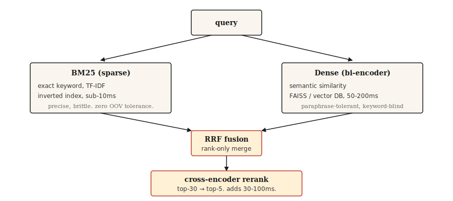

# Wyszukiwanie i wyszukiwanie informacji

> BM25 jest precyzyjny, lecz kruchy. Gęste wyszukiwanie zarzuca szeroką sieć, ale pomija słowa kluczowe. Podejście hybrydowe to domyślny wybór na rok 2026. Wszystko pozostałe to strojenie.

**Typ:** Kompilacja
**Języki:** Python
**Wymagania wstępne:** Faza 5 · 02 (BoW + TF-IDF), Faza 5 · 04 (GloVe, FastText, Subword)
**Czas:** ~75 minut

## Problem

Użytkownik wpisuje „co się stanie, jeśli ktoś kłamie, żeby zdobyć pieniądze" i oczekuje znalezienia przepisu, który to reguluje: „Artykuł 420 PPC". Wyszukiwanie słów kluczowych całkowicie to omija — brak wspólnego słownictwa. Wyszukiwanie semantyczne również zawodzi, jeśli model nie był trenowany na tekstach prawnych. Skuteczne wyszukiwanie musi radzić sobie z oboma przypadkami.

IR stanowi potok w każdym systemie RAG, każdym pasku wyszukiwania i rozmytym wyszukiwaniu w serwisach z dokumentacją. Architektura sprawdzona w produkcji w 2026 roku nie opiera się na jednej metodzie. To łańcuch uzupełniających się technik, z których każda wychwytuje błędy poprzedniej.

Niniejsza lekcja omawia każdy z tych elementów i wskazuje, jakie błędy każdy z nich koryguje.

## Koncepcja



Cztery warstwy. Dobierz te, których potrzebujesz.

1. **Wyszukiwanie rzadkie (BM25).** Szybkie, precyzyjne przy dokładnych dopasowaniach, zawodne semantycznie. Przeszukuje odwrócony indeks. Poniżej 10 ms na zapytanie przy milionach dokumentów. Sprawdza się przy odwołaniach do przepisów, kodach produktów, komunikatach o błędach i nazwach własnych.
2. **Gęste pobieranie.** Zapytania i dokumenty kodowane są do postaci wektorów, a następnie wyszukiwany jest najbliższy sąsiad. Wychwytuje parafrazy i podobieństwa semantyczne, lecz pomija dokładne dopasowania słów kluczowych różniących się jednym znakiem. Czas odpowiedzi: 50–200 ms przy użyciu FAISS lub wektorowej bazy danych.
3. **Fuzja.** Łączy listy rankingowe z wyszukiwania rzadkiego i gęstego. Prostą opcją domyślną jest Reciprocal Rank Fusion (RRF), która ignoruje surowe wyniki (wyrażone w różnych skalach) i opiera się wyłącznie na pozycjach rankingowych. Fuzja ważona jest lepszym rozwiązaniem, gdy wiadomo, że w danej dziedzinie dominuje jeden sygnał.
4. **Ponowna ocena cross-enkodera.** Pobiera 30 najlepszych wyników z fuzji i uruchamia koder krzyżowy, który ocenia każdą parę zapytanie–dokument łącznie. Zachowuje top-5. Kodery krzyżowe działają wolniej od koderów dwukierunkowych, ale są znacznie dokładniejsze. Koszt amortyzuje się dzięki uruchamianiu ich jedynie dla trzydziestu najlepszych kandydatów.

Wyszukiwanie trójkierunkowe (BM25 + gęste + wyuczone rzadkie, np. SPLADE) przynosi lepsze wyniki niż dwukierunkowe w testach porównawczych z 2026 roku, wymaga jednak infrastruktury obsługującej indeksy wyuczonych rzadkich reprezentacji. Dla większości zespołów najlepszym wyborem pozostaje kombinacja wyszukiwania dwukierunkowego i ponownej oceny cross-enkodera.

## Zbuduj to

### Krok 1: BM25 od podstaw

```python
import math
import re
from collections import Counter

TOKEN_RE = re.compile(r"[a-z0-9]+")

def tokenize(text):
    return TOKEN_RE.findall(text.lower())

class BM25:
    def __init__(self, corpus, k1=1.5, b=0.75):
        if not corpus:
            raise ValueError("corpus must not be empty")
        self.corpus = [tokenize(d) for d in corpus]
        self.k1 = k1
        self.b = b
        self.n_docs = len(self.corpus)
        self.avg_dl = sum(len(d) for d in self.corpus) / self.n_docs
        self.df = Counter()
        for doc in self.corpus:
            for term in set(doc):
                self.df[term] += 1

    def idf(self, term):
        n = self.df.get(term, 0)
        return math.log(1 + (self.n_docs - n + 0.5) / (n + 0.5))

    def score(self, query, doc_idx):
        q_tokens = tokenize(query)
        doc = self.corpus[doc_idx]
        dl = len(doc)
        freq = Counter(doc)
        score = 0.0
        for term in q_tokens:
            f = freq.get(term, 0)
            if f == 0:
                continue
            numerator = f * (self.k1 + 1)
            denominator = f + self.k1 * (1 - self.b + self.b * dl / self.avg_dl)
            score += self.idf(term) * numerator / denominator
        return score

    def rank(self, query, top_k=10):
        scored = [(self.score(query, i), i) for i in range(self.n_docs)]
        scored.sort(reverse=True)
        return scored[:top_k]
```

Dwa parametry warte znajomości. `k1=1.5` kontroluje nasycenie częstotliwości terminu — wyższa wartość oznacza większą wagę przy powtarzaniu słowa. `b=0.75` reguluje normalizację długości: 0 ignoruje długość dokumentu, 1 normalizuje ją w pełni. Wartości domyślne pochodzą z oryginalnej pracy Robertsona i rzadko wymagają dostrojenia.

### Krok 2: gęste pobieranie za pomocą bi-enkodera

```python
from sentence_transformers import SentenceTransformer
import numpy as np

def build_dense_index(corpus, model_id="sentence-transformers/all-MiniLM-L6-v2"):
    encoder = SentenceTransformer(model_id)
    embeddings = encoder.encode(corpus, normalize_embeddings=True)
    return encoder, embeddings

def dense_search(encoder, embeddings, query, top_k=10):
    q_emb = encoder.encode([query], normalize_embeddings=True)
    sims = (embeddings @ q_emb.T).flatten()
    order = np.argsort(-sims)[:top_k]
    return [(float(sims[i]), int(i)) for i in order]
```

Reprezentacje wektorowe normalizuje się do L2, dzięki czemu iloczyn skalarny odpowiada cosinusowi. Model `all-MiniLM-L6-v2` ma wymiar 384, jest szybki i wystarczająco skuteczny w większości zadań wyszukiwania w języku angielskim. Do pracy wielojęzycznej zaleca się `paraphrase-multilingual-MiniLM-L12-v2`. Dla najwyższej dokładności — `bge-large-en-v1.5` lub `e5-large-v2`.

### Krok 3: Wzajemna fuzja rang

```python
def reciprocal_rank_fusion(rankings, k=60):
    scores = {}
    for ranking in rankings:
        for rank, (_, doc_idx) in enumerate(ranking):
            scores[doc_idx] = scores.get(doc_idx, 0.0) + 1.0 / (k + rank + 1)
    fused = sorted(scores.items(), key=lambda x: x[1], reverse=True)
    return [(score, doc_idx) for doc_idx, score in fused]
```

Stała `k=60` pochodzi z oryginalnej publikacji RRF. Wyższa wartość `k` spłaszcza wpływ różnic pozycji rankingowych, niższa — wzmacnia znaczenie czołowych miejsc. Wartość 60 jest zalecaną wartością domyślną i rzadko wymaga modyfikacji.

### Krok 4: wyszukiwanie hybrydowe + zmiana rankingu

```python
from sentence_transformers import CrossEncoder

reranker = CrossEncoder("cross-encoder/ms-marco-MiniLM-L-6-v2")

def hybrid_search(query, bm25, encoder, dense_embeddings, corpus, top_k=5, pool_size=30, reranker=reranker):
    sparse_ranking = bm25.rank(query, top_k=pool_size)
    dense_ranking = dense_search(encoder, dense_embeddings, query, top_k=pool_size)
    fused = reciprocal_rank_fusion([sparse_ranking, dense_ranking])[:pool_size]

    pairs = [(query, corpus[doc_idx]) for _, doc_idx in fused]
    scores = reranker.predict(pairs)
    reranked = sorted(zip(scores, [doc_idx for _, doc_idx in fused]), reverse=True)
    return reranked[:top_k]
```

Trzy etapy złożone w całość. BM25 odnajduje dopasowania leksykalne. Gęste pobieranie wychwytuje dopasowania semantyczne. RRF łączy oba rankingi bez konieczności kalibrowania wyników. Cross-enkoder ponownie ocenia 30 najlepszych kandydatów, analizując pary zapytanie–dokument łącznie, co pozwala uchwycić subtelne znaczenia pomijane przez bi-enkoder. Ostatecznie zachowane zostaje top-5.

### Krok 5: ocena

| Metryka | Znaczenie |
|------------|--------|
| Recall@k | Jak często właściwy dokument znajdzie się w pierwszych k wynikach dla zapytań, przy których istnieje odpowiedź? |
| MRR (średnia wzajemna ranga) | Średnia wartości 1/pozycja pierwszego trafnego dokumentu. |
| nDCG@k | Uwzględnia stopniowanie trafności, nie tylko klasyfikację binarną. |

W systemach RAG kluczowym wskaźnikiem jest **Recall@k** modułu pobierania. Jeśli trafny fragment nie pojawi się w pobranym zestawie, moduł generowania nie będzie w stanie udzielić poprawnej odpowiedzi.

Wskazówka do diagnostyki: przy nieudanych zapytaniach należy porównać rankingi rzadkiego i gęstego wyszukiwania oddzielnie. Jeśli jedno z nich zwraca właściwy dokument, a drugie nie — to sygnał niedopasowania słownictwa (rozwiązanie: uzupełnić brakującą metodę) lub niejednoznaczności semantycznej (rozwiązanie: lepsze reprezentacje wektorowe lub zmiana rankingu).

## Użyj tego

Zalecany stos na rok 2026:

| Skala | Stos |
|-------|-------|
| Dokumenty od 1 tys. do 100 tys. | BM25 w pamięci + reprezentacje `all-MiniLM-L6-v2` + RRF. Bez osobnej bazy danych. |
| Dokumenty 100 tys.–10 mln | FAISS lub pgvector do wyszukiwania gęstego + Elasticsearch / OpenSearch dla BM25. Uruchamiaj równolegle. |
| Ponad 10 milionów dokumentów | Qdrant / Weaviate / Vespa / Milvus ze wsparciem hybrydowym. Cross-enkoder ocenia ponownie 30 najlepszych. |
| Najwyższy poziom jakości | Trójkierunkowe (BM25 + gęste + SPLADE) + zmiana rankingu z późną interakcją ColBERT. |

Niezależnie od wybranego stosu zarezerwuj zasoby na ewaluację. Zmierz recall przed przystąpieniem do analizy porównawczej dokładności RAG end-to-end. Moduł generowania nie jest w stanie naprawić tego, co pominął moduł pobierania.

### Wnioski wyniesione z produkcyjnych systemów RAG w 2026 roku

- **80% błędów RAG pochodzi z etapu przyjmowania danych i podziału na fragmenty, nie z modelu.** Zespoły tygodniami wymieniają modele językowe i dopracowują podpowiedzi, podczas gdy pobieranie po cichu zwraca błędny kontekst w co trzecim zapytaniu. Najpierw napraw strategię podziału.
- **Strategia podziału na fragmenty ma większe znaczenie niż ich rozmiar.** Podział oparty na stałym rozmiarze rozbija tabele, kod i zagnieżdżone nagłówki. Domyślną opcją jest segmentacja zdaniowa; podział semantyczny lub oparty na LLM opłaca się przy dokumentacji technicznej i podręcznikach produktowych.
- **Wzorzec dokumentu nadrzędnego.** Dla precyzji pobieraj małe fragmenty podrzędne. Gdy kilka fragmentów podrzędnych pochodzi z tej samej sekcji nadrzędnej, zastąp je blokiem nadrzędnym, zachowując szerszy kontekst. Stale podnosi to jakość odpowiedzi bez konieczności ponownego trenowania.
- **k_rerank=3 jest zwykle optymalne.** Każdy dodatkowy fragment powyżej tej wartości zwiększa koszt tokenów i opóźnienie generowania bez poprawy jakości odpowiedzi. Jeśli u Ciebie k=8 nadal przewyższa k=3, oznacza to, że moduł ponownego rankingu działa słabo.
- **HyDE / rozszerzanie zapytania.** Wygeneruj hipotetyczną odpowiedź na zapytanie, zakoduj ją jako wektor i pobierz wyniki. Wypełnia lukę stylistyczną między krótkimi pytaniami a długimi dokumentami. Darmowy wzrost precyzji bez dodatkowego trenowania.
- **Budżet kontekstowy poniżej 8 tys. tokenów.** Częste przekraczanie tego limitu oznacza, że próg ponownego rankingu jest zbyt luźny.
- **Wersjonuj wszystko.** Podpowiedzi, zasady podziału, model reprezentacji wektorowych, moduł ponownego rankingu. Każda niezauważona zmiana stopniowo obniża jakość odpowiedzi. Bramki CI weryfikujące wierność, precyzję kontekstu i regresję w odsetku zapytań bez odpowiedzi powinny blokować wdrożenie zanim błędy dotrą do użytkowników.
- **Wyszukiwanie trójkierunkowe (BM25 + gęste + wyuczone rzadkie jak SPLADE) przewyższa dwukierunkowe** w testach porównawczych z 2026 roku, szczególnie przy zapytaniach łączących nazwy własne z semantyką. Wdrażaj je, gdy infrastruktura obsługuje indeksy SPLADE.

Według pomiarów branżowych z 2026 roku właściwy projekt modułu pobierania redukuje halucynacje o 70–90%. Większość przyrostów wydajności RAG wynika z ulepszenia wyszukiwania, a nie ze strojenia modelu.

## Wyślij to

Zapisz jako `outputs/skill-retrieval-picker.md`:

```markdown
---
name: retrieval-picker
description: Pick a retrieval stack for a given corpus and query pattern.
version: 1.0.0
phase: 5
lesson: 14
tags: [nlp, retrieval, rag, search]
---

Given requirements (corpus size, query pattern, latency budget, quality bar, infra constraints), output:

1. Stack. BM25 only, dense only, hybrid (BM25 + dense + RRF), hybrid + cross-encoder rerank, or three-way (BM25 + dense + learned-sparse).
2. Dense encoder. Name the specific model. Match to language(s), domain, and context length.
3. Reranker. Name the specific cross-encoder model if used. Flag that rerank adds 30-100ms latency on top-30.
4. Evaluation plan. Recall@10 is the primary retriever metric. MRR for multi-answer. Baseline first, incremental improvements measured against it.

Refuse to recommend dense-only for corpora with named entities, error codes, or product SKUs unless the user has evidence dense handles exact matches. Refuse to skip reranking for high-stakes retrieval (legal, medical) where the final top-5 decides the user's answer.
```

## Ćwiczenia

1. **Łatwe.** Zaimplementuj `hybrid_search` na korpusie zawierającym 500 dokumentów. Przetestuj 20 zapytań. Porównaj Recall@5 dla samego BM25, samego wyszukiwania gęstego i podejścia hybrydowego.
2. **Średnie.** Dodaj obliczanie MRR. Dla każdego zapytania testowego ze znanym poprawnym dokumentem znajdź jego pozycję w rankingach BM25, gęstym i hybrydowym. Wyraportuj MRR dla każdego z nich.
3. **Trudne.** Dostosuj gęsty koder do swojej dziedziny przy użyciu MultipleNegativesRankingLoss (sentence-transformers). Zbuduj zbiór treningowy złożony z 500 par zapytanie–dokument. Porównaj recall przed dostrojeniem i po nim.

## Kluczowe terminy

| Termin | Co się mówi | Co to faktycznie oznacza |
|------|-----------------|----------------------|
| BM25 | Wyszukiwanie słów kluczowych | Algorytm BM25. Ocenia dokumenty według częstotliwości terminów, IDF i długości. |
| Gęste pobieranie | Wyszukiwanie wektorowe | Koduje zapytanie i dokument do wektorów, a następnie szuka najbliższych sąsiadów. |
| Bi-enkoder | Model reprezentacji wektorowych | Koduje zapytanie i dokument niezależnie. Szybki w czasie zapytania. |
| Koder krzyżowy | Model ponownego rankingu | Koduje zapytanie i dokument łącznie. Wolniejszy, lecz dokładniejszy. |
| RRF | Fuzja rang | Łączy dwa rankingi, sumując `1/(k + rank)`. |
| Recall@k | Metryka pobierania | Odsetek zapytań, dla których trafny dokument znalazł się w pierwszych k wynikach. |

## Dalsze czytanie

- [Robertson i Saragossa (2009). Probabilistyczne ramy trafności: BM25 i dalej](https://www.staff.city.ac.uk/~sbrp622/papers/foundations_bm25_review.pdf) — wyczerpujące omówienie BM25.
- [Karpukhin i in. (2020). Dense Passage Retrieval for Open-Domain QA](https://arxiv.org/abs/2004.04906) — DPR, kanoniczny bi-enkoder.
- [Formal i in. (2021). SPLADE: rzadki model leksykalny i rozszerzający](https://arxiv.org/abs/2107.05720) — wyuczony rzadki retriever wypełniający lukę między metodami gęstymi i rzadkimi.
- [Cormack, Clarke, Büttcher (2009). Reciprocal Rank Fusion przewyższa Condorcet i indywidualne metody uczenia się rang](https://plg.uwaterloo.ca/~gvcormac/cormacsigir09-rrf.pdf) — artykuł źródłowy RRF.
- [Khattab i Zaharia (2020). ColBERT: Wydajne i skuteczne wyszukiwanie fragmentów](https://arxiv.org/abs/2004.12832) — wyszukiwanie z późną interakcją.
