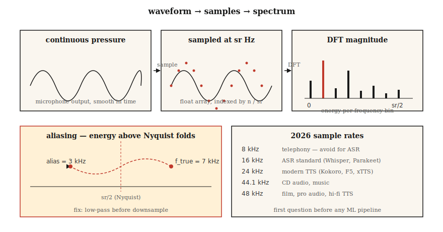

# Podstawy audio — przebiegi czasowe, próbkowanie, transformata Fouriera

> Przebiegi czasowe to surowy sygnał. Spektrogramy to jego reprezentacja. Cechy mel-częstotliwościowe (Mel features) to format przyjazny dla modeli ML. Każdy nowoczesny potok ASR i TTS opiera się na tej hierarchii, a pierwszym krokiem jest zrozumienie próbkowania i transformaty Fouriera.

**Typ:** Teoria
**Języki:** Python
**Wymagania wstępne:** Faza 1 · 06 (wektory i macierze), faza 1 · 14 (rozkłady prawdopodobieństwa)
**Czas:** ~45 minut

## Problem

Mikrofon rejestruje sygnał reprezentujący zmiany ciśnienia powietrza w czasie. Twoja sieć neuronowa przetwarza tensory. Pomiędzy nimi znajduje się szereg konwencji, których naruszenie prowadzi do ukrytych błędów: model uczy się poprawnie, ale współczynnik WER (Word Error Rate) rośnie dwukrotnie, system TTS generuje syki, a model klonowania głosu dopasowuje się do charakterystyki mikrofonu zamiast do cech mówcy.

Większość problemów w systemach przetwarzania mowy sprowadza się do trzech podstawowych pytań:

1. Z jaką częstotliwością próbkowania (sampling rate) zostały zapisane dane i jakiej wartości oczekuje model?
2. Czy w sygnale występuje aliasing?
3. Czy operujesz na surowych próbkach (w dziedzinie czasu), czy na reprezentacji częstotliwościowej?

Zadbaj o te kwestie, a reszta etapu 6 będzie prosta. Popełnij tu błąd, a nawet Whisper-Large-v4 zacznie generować bezużyteczne wyniki.

## Koncepcja



**Przebieg czasowy (waveform).** Jednowymiarowa tablica wartości zmiennoprzecinkowych (float) w zakresie `[-1.0, 1.0]`, indeksowana według numerów próbek. Aby przeliczyć indeks próbki na sekundy, należy podzielić go przez częstotliwość próbkowania: `t = n / sr`. 10-sekundowe nagranie o częstotliwości próbkowania 16 kHz to tablica zawierająca 160 000 wartości zmiennoprzecinkowych.

**Częstotliwość próbkowania (sampling rate - sr).** Liczba próbek rejestrowanych na sekundę. Typowe wartości:

| Częstotliwość próbkowania | Zastosowanie |
|---|---|
| 8 kHz | Telefonia, starsze systemy VoIP. Granica Nyquista na poziomie 4 kHz utrudnia rozróżnianie spółgłosek. Unikać w systemach ASR. |
| 16 kHz | Standard w systemach ASR. Modele takie jak Whisper, Parakeet czy SeamlessM4T v2 przetwarzają dźwięk o częstotliwości 16 kHz. |
| 22,05 kHz | Trenowanie wokoderów w starszych modelach TTS. |
| 24 kHz | Nowoczesne systemy TTS (Kokoro, F5-TTS, XTTS v2). |
| 44,1 kHz | Płyty CD, muzyka. |
| 48 kHz | Wideo/film, profesjonalny sprzęt audio (pro audio), wysokiej jakości systemy TTS (VALL-E 2, NaturalSpeech 3). |

**Twierdzenie Nyquista-Shannona.** Sygnał o częstotliwości próbkowania `sr` może jednoznacznie reprezentować składowe częstotliwościowe tylko do wartości `sr/2`. Granica ta nazywana jest *częstotliwością Nyquista*. Każda energia o częstotliwości powyżej granicy Nyquista ulega *aliasingowi* — zostaje nałożona na niższe częstotliwości (odbita w dół) i zniekształca sygnał. Przed próbkowaniem w dół (downsampling) należy zawsze zastosować filtr dolnoprzepustowy (low-pass filter).

**Głębia bitowa (bit depth).** Dźwięk zapisany jako 16-bitowy PCM (liczby całkowite ze znakiem int16 o zakresie ±32767) to uniwersalny format wymiany danych. Standard 24-bitowy stosuje się w muzyce, a 32-bitowy float do wewnętrznego cyfrowego przetwarzania sygnałów (DSP). Biblioteki takie jak `soundfile` automatycznie konwertują odczytany format int16 na tablice typu float32 w zakresie `[-1.0, 1.0]`.

**Transformata Fouriera.** Każdy sygnał o skończonym czasie trwania można przedstawić jako sumę sinusoid o różnych częstotliwościach. Dyskretna transformata Fouriera (DFT) dla `N` próbek wyznacza `N` zespolonych współczynników — po jednym dla każdego przedziału częstotliwości (bin). Przedział o indeksie `k` reprezentuje częstotliwość `k · sr / N` Hz. Moduł (wielkość) liczby zespolonej to amplituda dla danej częstotliwości, a jej argument (kąt) to faza.

**FFT (Szybka transformata Fouriera).** Algorytm obliczania DFT o złożoności `O(N log N)`, gdy `N` jest potęgą dwójki. Pod maską korzysta z niego praktycznie każda biblioteka audio. Wykonanie FFT dla okna o rozmiarze 1024 próbek przy próbkowaniu 16 kHz daje 512 użytecznych przedziałów częstotliwości w zakresie 0–8 kHz przy rozdzielczości ok. 15,6 Hz.

**Ramkowanie i okienkowanie.** Transformaty FFT nie oblicza się dla całego nagrania jednocześnie. Sygnał dzieli się na nakładające się *ramki* (zazwyczaj o długości 25 ms z przesunięciem/krokiem 10 ms), a następnie mnoży każdą ramkę przez funkcję okna (np. okno Hanna lub Hamminga), aby wyeliminować nieciągłości na krawędziach. Dopiero wtedy dla każdej ramki oblicza się FFT. Cały ten proces to krótkoczasowa transformata Fouriera (STFT - Short-Time Fourier Transform). Od tego zagadnienia zaczyna się lekcja 02.

## Zaimplementuj to

### Krok 1: Wczytanie pliku audio i wizualizacja przebiegu

W skrypcie `code/main.py` wykorzystano wyłącznie wbudowaną bibliotekę `wave`, aby kod demonstracyjny był niezależny od zewnętrznych pakietów. W środowisku produkcyjnym lepiej użyć biblioteki `soundfile` lub funkcji `torchaudio.load` (obie zwracają krotkę `(waveform, sr)`):

```python
import soundfile as sf
waveform, sr = sf.read("clip.wav", dtype="float32")  # shape (T,), sr=int
```

### Krok 2: Synteza fali sinusoidalnej od podstaw

```python
import math

def sine(freq_hz, sr, seconds, amp=0.5):
    n = int(sr * seconds)
    return [amp * math.sin(2 * math.pi * freq_hz * i / sr) for i in range(n)]
```

Generowanie tonu sinusoidalnego o częstotliwości 440 Hz (dźwięk A4) przy częstotliwości próbkowania 16 kHz przez czas 1 sekundy tworzy tablicę 16 000 wartości float. Zapisz plik za pomocą `wave.open(..., "wb")`, stosując 16-bitowe kodowanie PCM.

### Krok 3: Ręczne obliczenie DFT

```python
def dft(x):
    N = len(x)
    out = []
    for k in range(N):
        re = sum(x[n] * math.cos(-2 * math.pi * k * n / N) for n in range(N))
        im = sum(x[n] * math.sin(-2 * math.pi * k * n / N) for n in range(N))
        out.append((re, im))
    return out
```

Złożoność obliczeniowa wynosi `O(N²)` — jest to wystarczające do zweryfikowania poprawności działania dla `N=256`, lecz nieefektywne w przypadku rzeczywistych sygnałów audio. Produkcyjny kod powinien korzystać z funkcji `numpy.fft.rfft` lub `torch.fft.rfft`.

### Krok 4: Wyznaczenie dominującej częstotliwości

Indeks maksymalnej wartości modułu widma `k_star` odpowiada częstotliwości `k_star * sr / N`. Wykonanie tej operacji na fali sinusoidalnej o częstotliwości 440 Hz powinno wskazać maksimum w przedziale (binie) o indeksie `440 * N / sr`.

### Krok 5: Demonstracja zjawiska aliasingu

Próbkowanie fali sinusoidalnej o częstotliwości 7 kHz przy częstotliwości próbkowania 10 kHz (granica Nyquista wynosi 5 kHz). Ton 7 kHz leży powyżej granicy Nyquista, przez co ulega aliasingowi i zostaje odzwierciedlony jako `10 - 7 = 3 kHz`. Maksimum widma FFT pojawi się dla częstotliwości 3 kHz. Jest to klasyczny przykład aliasingu i powód, dla którego każdy przetwornik cyfrowo-analogowy (DAC) i analogowo-cyfrowy (ADC) ma wbudowany stromy filtr dolnoprzepustowy (typu brick-wall).

## Zastosowanie praktyczne

Typowy zestaw narzędzi produkcyjnych:

| Zadanie | Biblioteka | Dlaczego warto |
|---|---|---|
| Odczyt/zapis plików WAV/FLAC/OGG | `soundfile` (wrapper biblioteki libsndfile) | Najszybsza, stabilna, bezpośrednio zwraca typ float32. |
| Resampling (zmiana częstotliwości próbkowania) | `torchaudio.transforms.Resample` lub `librosa.resample` | Posiadają poprawną, wbudowaną filtrację antyaliasingową. |
| STFT / Spektrogram Mel | `torchaudio` lub `librosa` | Obsługa GPU; integracja z ekosystemem PyTorch. |
| Przetwarzanie strumieniowe w czasie rzeczywistym | `sounddevice` or `pyaudio` | Wieloplatformowe bindingi do PortAudio. |
| Szybka inspekcja plików | `ffprobe` lub `soxi` | Narzędzia CLI, szybko raportują częstotliwość próbkowania, liczbę kanałów i kodek. |

Kluczowa zasada: **dopasuj częstotliwość próbkowania (sampling rate), zanim zrobisz cokolwiek innego**. Whisper oczekuje jednokanałowego (mono) sygnału o częstotliwości próbkowania 16 kHz w formacie float32. Jeśli podasz sygnał stereo o częstotliwości 44,1 kHz, uzyskasz zniekształcone dane wejściowe, co będzie wyglądać jak błąd samego modelu.

## Wdróż to

Zapisz kod jako `outputs/skill-audio-loader.md`. Umiejętność ta (skill) pozwala upewnić się, że wejściowy sygnał audio spełnia wymagania docelowego modelu, a w razie potrzeby wykonuje automatyczny resampling.

## Ćwiczenia

1. **Poziom łatwy.** Zsyntetyzuj 1-sekundowy sygnał będący sumą tonów 220 Hz, 440 Hz oraz 880 Hz przy częstotliwości próbkowania 16 kHz. Oblicz DFT i potwierdź obecność trzech maksimów w oczekiwanych przedziałach częstotliwości.
2. **Poziom średni.** Nagraj 3-sekundowy plik WAV ze swoim głosem przy częstotliwości próbkowania 48 kHz. Wykonaj resampling w dół (downsampling) do 16 kHz za pomocą `torchaudio.transforms.Resample` (z filtrem antyaliasingowym), a następnie zrób to samo przy użyciu naiwnego decymowania (wybierając co trzecią próbkę). Oblicz FFT dla obu wersji. W którym miejscu widma pojawia się aliasing?
3. **Poziom trudny.** Zaimplementuj STFT od podstaw, używając tylko modułu `math` i algorytmu DFT z kroku 3. Użyj ramki o rozmiarze 400 próbek, kroku (hop size) równego 160 próbek oraz okna Hanna. Zwizualizuj amplitudy za pomocą `matplotlib.pyplot.imshow`. Otrzymany obraz to spektrogram, który jest tematem lekcji 02.

## Kluczowe terminy

| Termin | Potoczna definicja | Rzeczywiste znaczenie naukowe |
|---|---|---|
| Częstotliwość próbkowania | Liczba próbek na sekundę | Częstotliwość (w Hz), z jaką przetwornik analogowo-cyfrowy (ADC) rejestruje wartości sygnału. |
| Granica Nyquista | Maksymalna częstotliwość, którą można poprawnie zarejestrować | Połowa częstotliwości próbkowania (`sr/2`); każda składowa powyżej tej wartości ulega aliasingowi i pojawia się w dolnej części widma. |
| Głębia bitowa | Rozdzielczość amplitudy pojedynczej próbki | Określa precyzję kwantyzacji: `int16` oferuje 65 536 poziomów dyskretnych; `float32` reprezentuje wartości w przedziale `[-1.0, 1.0]`. |
| DFT (Dyskretna Transformata Fouriera) | Transformata Fouriera dla sygnałów dyskretnych | Przekształcenie `N` próbek czasu w `N` zespolonych współczynników częstotliwościowych. |
| FFT (Szybka Transformata Fouriera) | Szybka wersja DFT | Wydajny algorytm obliczania DFT o złożoności `O(N log N)`, zazwyczaj wymagający długości okna będącej potęgą dwójki (`N = 2^p`). |
| Bin (Przedział widmowy) | Kolumna / prążek częstotliwości | Przedział reprezentujący częstotliwość `k · sr / N` Hz; rozdzielczość częstotliwościowa wynosi `sr / N` Hz. |
| STFT | Podstawa spektrogramu | Wynik FFT obliczanej kolejno dla ramkowanego i okienkowanego sygnału w czasie. |
| Aliasing | Zakłócenia i artefakty częstotliwościowe | Zjawisko nakładania się widma, w którym energia o częstotliwości wyższej niż granica Nyquista zostaje błędnie odwzorowana w niższym pasmie. |

## Dalsze czytanie

- [Shannon (1949). Communication in the Presence of Noise](https://people.math.harvard.edu/~ctm/home/text/others/shannon/entropy/entropy.pdf) — klasyczna praca naukowa definiująca twierdzenie o próbkowaniu.
- [Smith — The Scientist and Engineer's Guide to Digital Signal Processing](https://www.dspguide.com/ch8.htm) — kanoniczny i bezpłatny podręcznik do cyfrowego przetwarzania sygnałów (DSP).
- [Dokumentacja librosa — wprowadzenie do audio](https://librosa.org/doc/latest/tutorial.html) — praktyczny samouczek z przykładowym kodem.
- [Heinrich Kuttruff — Room Acoustics (wyd. 6)](https://www.routledge.com/Room-Acoustics/Kuttruff/p/book/9781482260434) — klasyczna pozycja wyjaśniająca propagację dźwięku w pomieszczeniach i jego złożoną strukturę.
- [Steve Eddins — Interpretacja wyników FFT](https://blogs.mathworks.com/steve/2020/03/30/fft-spectrum-and-spectral-densities/) — przystępne i szybkie wyjaśnienie fizycznego znaczenia przedziałów częstotliwości.
