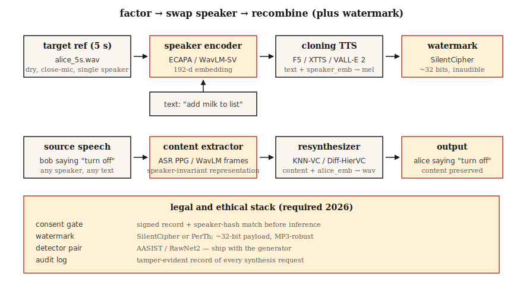

# Klonowanie głosu i konwersja głosu

> Klonowanie głosu odczytuje Twój tekst głosem innej osoby. Konwersja głosu zapisuje Twój głos na głos innej osoby, zachowując jednocześnie to, co powiedziałeś. Obydwa opierają się na tym samym rozkładzie: oddziel tożsamość mówiącego od treści.

**Typ:** Kompilacja
**Języki:** Python
**Warunki wstępne:** Faza 6 · 06 (rozpoznawanie osoby mówiącej), faza 6 · 07 (TTS)
**Czas:** ~75 minut

## Problem

W roku 2026 wystarczy 5-sekundowy klip audio, aby stworzyć wysokiej jakości klon głosu dowolnej osoby za pomocą konsumenckiego procesora graficznego. ElevenLabs, F5-TTS, OpenVoice v2, VoiceBox oferują klonowanie typu zero-shot lub kilka-shot. Technologia ta jest błogosławieństwem (dostępność TTS, dubbing, głosy wspomagające) i bronią (oszustwa, fałszywe fałszywe informacje polityczne, kradzież adresu IP).

Dwa ściśle ze sobą powiązane zadania:

- **Klonowanie głosu (strona TTS):** tekst + 5-sekundowy głos referencyjny → dźwięk w tym głosie.
- **Konwersja głosu (strona mowy):** dźwięk źródłowy (osoba A mówiąca X) + głos referencyjny osoby B → dźwięk B mówiącego X.

Obydwa uwzględniają kształt fali (treść, mówca, prozodia) i ponownie łączą treść z jednego źródła z mówcą z drugiego.

Kluczowe ograniczenia, zgodnie z którymi obecnie realizujesz dostawy w 2026 r.: **znak wodny i bramki umożliwiające uzyskanie zgody są prawnie wymagane w UE (ustawa o sztucznej inteligencji, obowiązująca od sierpnia 2026 r.) i w Kalifornii (AB 2905, obowiązująca od 2025 r.)**. Twój rurociąg musi emitować niesłyszalny znak wodny i odrzucać klonowanie bez zgody.

## Koncepcja



**Klonowanie zero-shot.** Przekaż 5-sekundowy klip modelowi, który został przeszkolony na tysiącach głośników. Koder głośnika odwzorowuje klip na osadzony głośnik; warunki dekodera TTS dotyczące tego osadzania oraz tekst.

Używany przez: F5-TTS (2024), YourTTS (2022), XTTS v2 (2024), OpenVoice v2 (2024).

**Dostrajanie kilku strzałów.** Nagraj 5–30 minut docelowego głosu. LoRA – dostrajaj model podstawowy przez godzinę. Jakość skacze od „w porządku” do „nie do odróżnienia”. Zarówno Coqui, jak i ElevenLabs obsługują ten wzorzec; społeczność używa go z F5-TTS.

**Konwersja głosu (VC).** Dwie rodziny:

- **Synteza rozpoznawania.** Uruchom model podobny do ASR, aby wyodrębnić reprezentację treści (np. tylne części miękkich fonemów, PPG), a następnie dokonaj ponownej syntezy z osadzeniem docelowego głośnika. Odporny na język i akcent. Używany przez KNN-VC (2023), Diff-HierVC (2023).
- **Rozplątanie.** Wytrenuj autokoder, który oddziela treść, mówcę i prozodię w ukrytej przestrzeni w wąskim gardle. Zamień osadzanie głośników podczas wnioskowania. Niższa jakość, ale szybsza. Używany przez AutoVC (2019), warianty VITS-VC.

**Klonowanie w oparciu o kodeki neuronowe (2024+).** VALL-E, VALL-E 2, NaturalSpeech 3, VoiceBox — traktuj dźwięk jako oddzielne tokeny z SoundStream/EnCodec, trenuj duży model autoregresyjny lub dopasowujący przepływ na tokenach kodeków. Jakość porównywalna do ElevenLabs w przypadku krótkich podpowiedzi.

### Kwestia etyki, a nie dokręcanie

**Znak wodny.** PerTh (Perth) i SilentCipher (2024) niezauważalnie osadzają identyfikator o długości ~16–32 bitów w dźwięku. Wytrzymuje ponowne kodowanie, przesyłanie strumieniowe i typowe edycje. Gotowe do produkcji oprogramowanie typu open source.

**Bramy zgody.** Każde sklonowane wyjście musi być powiązane z możliwym do zweryfikowania zapisem zgody. „Ja, Rohit, 22.04.2026 autoryzuję ten głos w celu X.” Przechowywać w dzienniku zabezpieczającym przed manipulacją.

**Wykrywanie.** AASIST, RawNet2 i Wav2Vec2-AASIST są dostarczane jako detektory. W wyzwaniu ASVspoof 2025 opublikowano wartości EER na poziomie 0,8–2,3% dla najnowocześniejszych detektorów przeciwko wynikom ElevenLabs, VALL-E 2 i Bark.

### Liczby (2026)

| Modelka | Zerowy strzał? | SECS (docelowy symulator) | WER (inteligencja) | Parametry |
|-------|------|----------|--------------|--------|
| F5-TTS | Tak | 0,72 | 2,1% | 335M |
| XTTS wersja 2 | Tak | 0,65 | 3,5% | 470M |
| OpenVoice v2 | Tak | 0,70 | 2,8% | 220M |
| VALL-E 2 | Tak | 0,77 | 2,4% | 370M |
| Pole głosowe | Tak | 0,78 | 2,1% | 330M |

SECS > 0,70 jest na ogół nie do odróżnienia od wartości docelowej dla większości słuchaczy.

## Zbuduj to

### Krok 1: dekompozycja z syntezą rozpoznawania (wersja demonstracyjna zawierająca tylko kod w pliku main.py)

```python
def clone_pipeline(ref_audio, text, target_embedder, tts_model):
    speaker_emb = target_embedder.encode(ref_audio)
    mel = tts_model(text, speaker=speaker_emb)
    return vocoder(mel)
```

Konceptualnie proste; masa implementacyjna znajduje się w `tts_model` i koderze głośnika.

### Krok 2: klon z zerowym strzałem za pomocą F5-TTS

```python
from f5_tts.api import F5TTS
tts = F5TTS()
wav = tts.infer(
    ref_file="rohit_5s.wav",
    ref_text="The quick brown fox jumps over the lazy dog.",
    gen_text="Please add milk and bread to my list.",
)
```

Transkrypcja referencyjna musi dokładnie odpowiadać dźwiękowi; niedopasowanie zakłóca wyrównanie.

### Krok 3: konwersja głosu za pomocą KNN-VC

```python
import torch
from knnvc import KNNVC  # 2023 model, https://github.com/bshall/knn-vc
vc = KNNVC.load("wavlm-base-plus")
out_wav = vc.convert(source="my_voice.wav", target_pool=["alice_1.wav", "alice_2.wav"])
```

KNN-VC uruchamia WavLM w celu wyodrębnienia osadzonych ramek dla puli źródłowej i docelowej, a następnie zastępuje każdą ramkę źródłową jej najbliższą sąsiadką w puli. Nieparametryczny, działa z minutą mowy docelowej.

### Krok 4: umieść znak wodny

```python
from silentcipher import SilentCipher
sc = SilentCipher(model="2024-06-01")
payload = b"consent_id:abc123;ts:1745353200"
watermarked = sc.embed(wav, sr=24000, message=payload)
detected = sc.detect(watermarked, sr=24000)   # returns payload bytes
```

~32 bity ładunku, wykrywalne po ponownym kodowaniu MP3 i lekkim szumie.

### Krok 5: bramka zgody

```python
def cloned_inference(text, ref_audio, consent_record):
    assert verify_signature(consent_record), "Signed consent required"
    assert consent_record["speaker_id"] == hash_speaker(ref_audio)
    wav = tts.infer(ref_file=ref_audio, gen_text=text)
    wav = watermark(wav, payload=consent_record["id"])
    return wav
```

## Użyj tego

Stos na rok 2026:

| Sytuacja | Wybierz |
|----------|------|
| 5-sekundowy klon typu zero-shot, open source | F5-TTS lub OpenVoice v2 |
| Klonowanie do produkcji komercyjnej | Natychmiastowy klon głosowy ElevenLabs v2.5 |
| Konwersja głosu (przepisywanie) | KNN-VC lub Diff-HierVC |
| Dostrojenie wielu głośników | StyleTTS 2 + adapter głośnikowy |
| Klonowanie międzyjęzykowe | XTTS v2 lub VALL-E X |
| Wykrywanie deepfake'ów | Wav2Vec2-AASIST |

## Pułapki

- **Nieprawidłowo wyrównany zapis referencyjny.** F5-TTS i podobne wymagają, aby tekst referencyjny dokładnie odpowiadał referencyjnemu dźwiękowi, łącznie ze znakami interpunkcyjnymi.
- **Odniesienie pogłosowe.** Echo zabija klona. Nagrywaj sucho, blisko mikrofonu.
- **Niedopasowanie emocjonalne.** Odniesienie do treningu „wesoły” tworzy wesołe klony wszystkiego. Dopasuj emocję referencyjną do docelowego zastosowania.
- **Wyciek języka.** Klonowanie osoby mówiącej po angielsku, a następnie proszenie modelki, aby mówiła po francusku, często i tak ma akcent; stosować modele międzyjęzykowe (XTTS, VALL-E X).
- **Brak znaku wodnego.** Zgodnie z prawem nie można wysyłać w UE od sierpnia 2026 r.

## Wyślij to

Zapisz jako `outputs/skill-voice-cloner.md`. Zaprojektuj potok klonowania lub konwersji z bramką zgody + znak wodny + cel jakości.

## Ćwiczenia

1. **Łatwe.** Uruchom `code/main.py`. Demonstruje zamianę osadzania głośników, obliczając cosinus między dwoma „głośnikami” przed i po zamianie.
2. **Średni.** Użyj OpenVoice v2, aby sklonować swój własny głos. Zmierz SECS między odniesieniem a klonem. Zmierz CER za pomocą szeptu.
3. **Trudne.** Zastosuj znak wodny SilentCipher do 20 klonów, przeprowadź je przez kodowanie+dekodowanie MP3 128 kbps, wykrywaj ładunek. Zgłoś dokładność bitową.

## Kluczowe terminy

| Termin | Co ludzie mówią | Co to właściwie oznacza |
|------|-----------------|----------------------|
| Klon z zerowym strzałem | Wystarczy 5 sekund | Wstępnie wytrenowany model + osadzenie głośników; żadnego szkolenia. |
| PPG | Posteriorgram fonetyczny | Późniejsze fragmenty ASR na klatkę używane jako przedstawiciel treści niezależnych od języka. |
| KNN-VC | Konwersja najbliższego sąsiada | Zastąp każdą ramkę źródłową najbliższą ramką z puli docelowej. |
| Kodek neuronowy TTS | Styl VALL-E | Model AR na tokenach EnCodec/SoundStream. |
| Znak wodny | Niesłyszalny podpis | Bity osadzone w dźwięku przetrwają ponowne kodowanie. |
| SEK | Wierność klonowania | Cosinus między osadzeniem głośników docelowych i klonowanych. |
| POMOC | Detektor deepfake | Model zapobiegający parowaniu; wykrywa mowę syntetyczną. |

## Dalsze czytanie

- [Chen i in. (2024). F5-TTS](https://arxiv.org/abs/2410.06885) — klonowanie typu zero-shot SOTA typu open source.
- [Baevski i in. /Microsoftu (2023). VALL-E](https://arxiv.org/abs/2301.02111) i [VALL-E 2 (2024)](https://arxiv.org/abs/2406.05370) — kodek neuronowy TTS.
- [Qian i in. (2019). AutoVC](https://arxiv.org/abs/1905.05879) — konwersja głosu oparta na rozplątywaniu.
- [Baas, Waubert de Puiseau, Kamper (2023). KNN-VC](https://arxiv.org/abs/2305.18975) — VC oparty na wyszukiwaniu.
- [SilentCipher (2024) — Znak wodny audio](https://github.com/sony/silentcipher) — 32-bitowy znak wodny audio gotowy do produkcji.
- [Wyniki ASVspoof 2025](https://www.asvspoof.org/) — wyścig zbrojeń detektor vs syntezator, aktualizacja 2026.