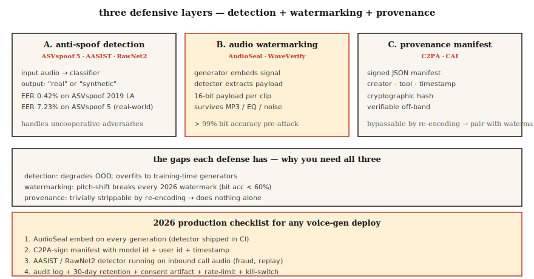

# Ochrona przed fałszowaniem głosu i znak wodny audio — ASVspoof 5, AudioSeal, WaveVerify

> Klonowanie głosu rozwija się szybciej niż metody obrony. Systemy głosowe wdrażane produkcyjnie w roku 2026 będą wymagały dwóch komponentów: detektora (AASIST, RawNet2) klasyfikującego mowę jako prawdziwą lub syntetyczną oraz znaku wodnego (AudioSeal) odpornego na kompresję i edycję. Wdrażaj oba — albo rezygnuj z klonowania głosu.

**Typ:** Kompilacja
**Języki:** Python
**Wymagania wstępne:** Faza 6 · 06 (rozpoznawanie osoby mówiącej), faza 6 · 08 (klonowanie głosu)
**Czas:** ~75 minut

## Problem

Trzy powiązane mechanizmy obronne:

1. **Zapobieganie fałszowaniu i wykrywanie deepfake'ów.** Czy dany klip audio jest syntetyczny czy autentyczny? Testy porównawcze ASVspoof (ASVspoof 2019 → 2021 → 5) stanowią złoty standard w tej dziedzinie.
2. **Znak wodny dźwięku.** W generowanym dźwięku umieszcza się niezauważalny sygnał, który detektor może później odczytać. Dostępne rozwiązania open-source to AudioSeal (Meta) i WavMark.
3. **Uwierzytelnione pochodzenie.** Kryptograficzne podpisywanie plików audio uzupełnione metadanymi. Standard C2PA / Inicjatywa na rzecz autentyczności treści.

Wykrywanie działa wobec niepodporządkowanych przeciwników. Znak wodny zapewnia zgodność — dźwięk wygenerowany przez sztuczną inteligencję powinien być jako taki rozpoznawalny. Oba mechanizmy są wymagane w 2026 roku.

## Koncepcja



### ASVspoof 5 — punkt odniesienia na lata 2024–2025

Najważniejsze zmiany względem poprzednich edycji:

- **Dane z crowdsourcingu** (nie ze studia) — realistyczne warunki nagrań.
- **~2000 mówców** (poprzednio ~100).
- **32 algorytmy ataku.** TTS + konwersja głosu + zakłócenia kontradyktoryjne.
- **Dwie ścieżki.** Samodzielne wykrywanie środków zaradczych (CM) oraz odporny na fałszowanie ASV (SASV) dla systemów biometrycznych.

Najlepszy model ASVspoof 5 osiąga ~7,23% EER. Na starszym zbiorze ASVspoof 2019 LA wynik wynosi 0,42% EER. W warunkach produkcyjnych należy spodziewać się 5–10% EER dla nagrań z rzeczywistego środowiska.

### AASIST i RawNet2 — rodziny modeli detekcji

**AASIST** (2021, zaktualizowany do 2026). Architektura oparta na grafach z mechanizmem uwagi dla cech widmowych. Aktualnie najlepszy model w zadaniu CM w ramach ASVspoof 5.

**RawNet2.** Splot na surowym przebiegu czasowym z szkieletem TDNN. Prostsza linia bazowa; po dostrojeniu nadal konkurencyjna.

**NeXt-TDNN + cechy SSL.** Wariant z 2025 roku: styl ECAPA + cechy WavLM + focal loss. Osiąga 0,42% EER na zbiorze ASVspoof 2019 LA.

### AudioSeal — domyślny znak wodny na rok 2024

**AudioSeal** firmy Meta (styczeń 2024, wersja 0.2.12). Kluczowe właściwości:

- **Lokalizacja.** Wykrywa znak wodny na poziomie ramki z rozdzielczością próbki 16 kHz (1/16000 s).
- **Wspólne uczenie generatora i detektora.** Generator uczy się osadzać niesłyszalny sygnał, detektor — odnajdywać go mimo przekształceń.
- **Odporność.** Znak wodny przeżywa kompresję MP3/AAC, korekcję EQ, zmianę prędkości ±10% i miksowanie z szumem przy SNR +10 dB.
- **Wydajność.** Detektor działa 485× szybciej niż czas rzeczywisty; jest 1000 razy szybszy niż WavMark.
- **Pojemność.** 16-bitowy ładunek (może kodować identyfikator modelu, znacznik czasu generacji, identyfikator użytkownika) osadzany w każdej wypowiedzi.

### WavMark

Otwarta linia bazowa poprzedzająca AudioSeal. Odwracalna sieć neuronowa, 32 bity/s. Główne słabości:

- Brute-force synchronizacja jest powolna.
- Można usunąć za pomocą szumu Gaussa lub kompresji MP3.
- Nienadający się do zastosowań czasu rzeczywistego.

### WaveVerify (lipiec 2025)

Eliminuje słabości AudioSeal — szczególnie w zakresie manipulacji czasowych (odwracanie, zmiana prędkości). Korzysta z generatora opartego na FiLM oraz detektora Mixture-of-Experts. Dorównuje AudioSeal w standardowych scenariuszach ataku, a dodatkowo obsługuje edycje temporalne.

### Luka wykorzystywana przez przeciwników

Według AudioMarkBench: „przy zmianie wysokości tonu wszystkie znaki wodne wykazują dokładność odzyskiwania bitów poniżej 0,6, co świadczy o niemal całkowitym ich usunięciu". **Zmiana wysokości tonu to atak uniwersalny.** Żaden znak wodny z 2026 roku nie jest w pełni odporny na agresywną modyfikację tonacji. Dlatego obok znaku wodnego niezbędne jest wykrywanie (AASIST).

### C2PA / Inicjatywa na rzecz autentyczności treści

To nie jest technika ML, lecz format manifestu. Pliki audio zawierają kryptograficznie podpisane metadane dotyczące narzędzia tworzenia, autora i daty. Audiobox obsługuje ten standard natywnie. Zapewnia dobre śledzenie pochodzenia, lecz nie chroni przed sytuacją, gdy złośliwy podmiot ponownie zakoduje plik i usunie metadane.

## Zbuduj to

### Krok 1: Prosty detektor cech widmowych (wersja demonstracyjna)

```python
def spectral_rolloff(spec, percentile=0.85):
    cum = 0
    total = sum(spec)
    if total == 0:
        return 0
    threshold = total * percentile
    for k, v in enumerate(spec):
        cum += v
        if cum >= threshold:
            return k
    return len(spec) - 1

def is_suspicious(audio):
    spec = magnitude_spectrum(audio)
    rolloff = spectral_rolloff(spec)
    return rolloff / len(spec) > 0.92
```

Mowa syntetyczna często cechuje się niezwykle płaską dystrybucją energii w zakresie wysokich częstotliwości. Detektory produkcyjne używają AASIST — nie tego kodu. Intuicja jednak pozostaje trafna.

### Krok 2: Osadzanie i wykrywanie znaku wodnego AudioSeal

```python
from audioseal import AudioSeal
import torch

generator = AudioSeal.load_generator("audioseal_wm_16bits")
detector = AudioSeal.load_detector("audioseal_detector_16bits")

audio = load_wav("generated.wav", sr=16000)[None, None, :]
payload = torch.tensor([[1, 0, 1, 1, 0, 1, 0, 0, 1, 1, 0, 1, 0, 1, 1, 0]])
watermark = generator.get_watermark(audio, sample_rate=16000, message=payload)
watermarked = audio + watermark

result, decoded_payload = detector.detect_watermark(watermarked, sample_rate=16000)
# result: float in [0, 1] — probability of watermark presence
# decoded_payload: 16 bits; match against embedded payload
```

### Krok 3: Ewaluacja — EER

```python
def eer(real_scores, fake_scores):
    thresholds = sorted(set(real_scores + fake_scores))
    best = (1.0, 0.0)
    for t in thresholds:
        far = sum(1 for s in fake_scores if s >= t) / len(fake_scores)
        frr = sum(1 for s in real_scores if s < t) / len(real_scores)
        if abs(far - frr) < best[0]:
            best = (abs(far - frr), (far + frr) / 2)
    return best[1]
```

### Krok 4: Integracja produkcyjna

```python
def safe_tts(text, voice, clone_reference=None):
    if clone_reference is not None:
        verify_consent(user_id, clone_reference)
    audio = tts_model.synthesize(text, voice)
    audio_with_wm = audioseal_embed(audio, payload=build_payload(user_id, model_id))
    manifest = c2pa_sign(audio_with_wm, user_id, timestamp=now())
    return audio_with_wm, manifest
```

Każda wygenerowana wypowiedź zawiera: (1) znak wodny, (2) podpisany manifest, (3) dziennik audytu zgodny z polityką przechowywania danych.

## Zastosowania

| Przypadek użycia | Obrona |
|---------|---------|
| Wysyłka TTS / klonowanie głosu | AudioSeal osadzony w każdym wyjściu (obowiązkowo) |
| Biometryczne odblokowanie głosowe | Zespół AASIST + ECAPA; wyzwanie aktywności |
| Wykrywanie oszustw w call center | AASIST na 20% próbie połączeń przychodzących |
| Autentyczność podcastu | Podpisywanie C2PA przy przesyłaniu, AudioSeal dla treści generowanych przez AI |
| Detektory badawcze i szkoleniowe | Zbiory ASVspoof 5: treningowy / deweloperski / ewaluacyjny |

## Pułapki

- **Znak wodny bez działającego detektora.** Bezużyteczne rozwiązanie. Uwzględnij detektor w potoku CI.
- **Wykrywanie bez kalibracji.** Model AASIST trenowany na zbiorze ASVspoof LA jest podatny na przeuczenie; jego skuteczność spada w warunkach rzeczywistych. Kalibruj w swojej domenie.
- **Zmiana wysokości tonu.** Agresywna modyfikacja tonacji niszczy większość znaków wodnych. Zachowaj detektor jako rozwiązanie rezerwowe.
- **Usuwanie i ponowne hostowanie metadanych.** C2PA można ominąć przez proste ponowne zakodowanie pliku. Zawsze łącz ochronę kryptograficzną z percepcyjną (znak wodny).
- **Aktywność jako wykrywanie.** Poproś użytkownika o wypowiedzenie losowej frazy. Zapobiega atakom polegającym na odtwarzaniu nagrań, lecz nie chroni przed klonowaniem głosu w czasie rzeczywistym.

## Wyślij to

Zapisz jako `outputs/skill-spoof-defender.md`. Wybierz model wykrywania, znak wodny, manifest pochodzenia oraz procedury operacyjne na potrzeby wdrożenia generatora głosu.

## Ćwiczenia

1. **Łatwe.** Uruchom `code/main.py`. Demonstracyjny detektor i demonstracyjne osadzanie/wykrywanie znaku wodnego w syntetycznym dźwięku.
2. **Średnie.** Zainstaluj `audioseal`, osadź 16-bitowy ładunek w wyjściu TTS, następnie go zdekoduj. Zdegraduj dźwięk za pomocą szumów i zmierz dokładność odzyskiwania bitów.
3. **Trudne.** Dostosuj RawNet2 lub AASIST do zbioru ASVspoof 2019 LA. Zmierz EER. Przetestuj na wyodrębnionym zestawie klipów generowanych przez F5-TTS i sprawdź, jak spada jakość wykrywania poza zakresem treningu (OOD).

## Kluczowe terminy

| Termin | Potoczne znaczenie | Właściwe znaczenie |
|------|-----------------|----------------------|
| ASVspoof | Punkt odniesienia | Dwuletnie wyzwanie badawcze; 2024 = ASVspoof 5. |
| CM (środek zaradczy) | Detektor | Klasyfikator: mowa prawdziwa vs syntetyczna / przekonwertowana. |
| SASV | Weryfikacja mówcy + CM | Zintegrowane wykrywanie biometryczne i parodii głosu. |
| AudioSeal | Metaznak wodny | Zlokalizowany, 16-bitowy ładunek, 485 razy szybszy niż WavMark. |
| Dokładność odzyskiwania bitów | Przetrwanie znaku wodnego | Odsetek bitów ładunku odzyskanych po ataku. |
| C2PA | Manifest pochodzenia | Kryptograficzne metadane dotyczące tworzenia i autorstwa. |
| AASIST | Rodzina detektorów | Najlepsza architektura oparta na grafach do wykrywania fałszowania. |

## Dalsze czytanie

- [Todisco i in. (2024). ASVspoof 5](https://dl.acm.org/doi/10.1016/j.csl.2025.101825) — aktualny benchmark.
- [Defossez i in. (2024). AudioSeal](https://arxiv.org/abs/2401.17264) — domyślny znak wodny.
- [Chen i in. (2025). WaveVerify](https://arxiv.org/abs/2507.21150) — detektor MoE do wykrywania ataków temporalnych.
- [Jung i in. (2022). AASIST](https://arxiv.org/abs/2110.01200) — szkielet wykrywania SOTA.
- [AudioMarkBench (2024)](https://proceedings.neurips.cc/paper_files/paper/2024/file/5d9b7775296a641a1913ab6b4425d5e8-Paper-Datasets_and_Benchmarks_Track.pdf) — ocena odporności znaków wodnych.
- [Specyfikacja C2PA](https://c2pa.org/specifications/specifications/) — format manifestu pochodzenia.
