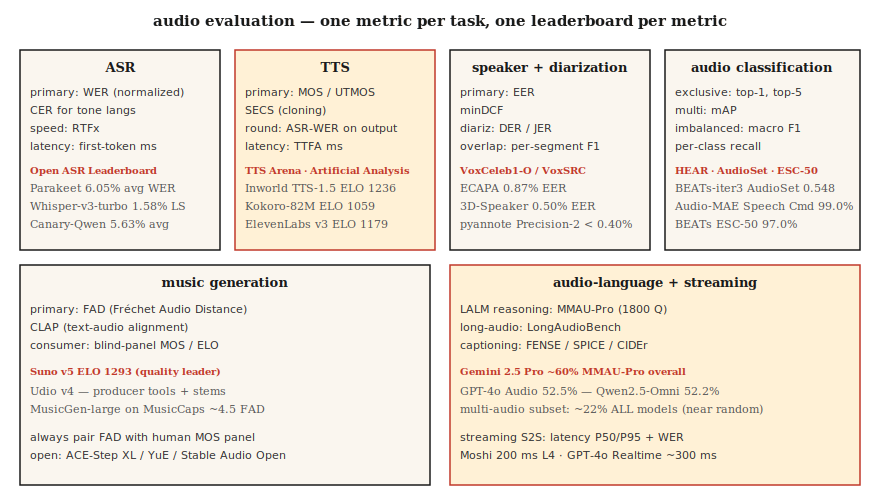

# Ocena dźwięku — WER, MOS, UTMOS, MMAU, FAD i otwarte rankingi

> Nie można wdrożyć tego, czego nie można zmierzyć. Lekcja omawia metryki obowiązujące w 2026 roku dla każdego zadania audio: ASR (WER, CER, RTFx), TTS (MOS, UTMOS, SECS, WER-on-ASR-round-trip), rozumienie języka audio (MMAU, LongAudioBench), muzyka (FAD, CLAP) oraz weryfikacja mówcy (EER). Zawiera również tabele wyników umożliwiające porównania między modelami.

**Typ:** Ucz się
**Języki:** Python
**Wymagania:** Faza 6 · 04, 06, 07, 09, 10; Faza 2 · 09 (Ocena modelu)
**Czas:** ~60 minut

## Problem

Każde zadanie audio dysponuje wieloma metrykami, z których każda mierzy inną właściwość. Zastosowanie niewłaściwej metryki prowadzi do wdrożenia modelu, który wygląda doskonale na dashboardzie, a zawodzi w środowisku produkcyjnym. Zestaw kanoniczny na rok 2026:

| Zadanie | Podstawowa | Drugorzędne |
|------|---------|---------------|
| ASR | WER | CER · RTFx · opóźnienie pierwszego tokena |
| TTS | MOS / UTMOS | SECS · WER-on-ASR-podróż w obie strony · CER · TTFA |
| Klonowanie głosu | SECS (cosinus ECAPA) | MOS · CER |
| Weryfikacja mówcy | EER | minDCF · FAR / FRR w punkcie operacyjnym |
| Diaryzacja | DER | JER · błędy przypisania głośnika |
| Klasyfikacja dźwięku | top-1 · mAP | makro F1 · czułość poszczególnych klas |
| Generowanie muzyki | FAD | CLAP · panel odsłuchowy MOS |
| Model języka audio | MMAU-Pro | LongAudioBench · AudioCaps FENSE |
| Strumieniowanie S2S | opóźnienie P50/P95 | WER · MOS |

## Koncepcja



### Metryki ASR

**WER (wskaźnik błędów słów).** `(S + D + I) / N`. Przed obliczeniem należy zamienić tekst na małe litery, usunąć znaki interpunkcyjne i znormalizować liczby. Polecane biblioteki: `jiwer` lub `whisper_normalizer` od OpenAI. Wynik poniżej 5% odpowiada ludzkiej dokładności w przypadku mowy czytanej.

**CER (wskaźnik błędów znaków).** Ta sama formuła, lecz na poziomie znaku. Stosowany w językach, w których segmentacja słów jest niejednoznaczna — np. w mandaryńskim i kantońskim.

**RTFx (odwrotny współczynnik czasu rzeczywistego).** Liczba sekund dźwięku przetwarzanych w ciągu jednej sekundy zegarowej. Im wyższy wynik, tym lepiej. Parakeet-TDT osiąga wartość 3380×, natomiast Whisper-large-v3 około 30×.

**Opóźnienie pierwszego tokena.** Czas zegarowy od momentu podania sygnału audio do pojawienia się pierwszego tokena transkrypcji. Kluczowy parametr w aplikacjach strumieniowych. Deepgram Nova-3 osiąga ~150 ms.

### Metryki TTS

**MOS (średni wynik opinii).** Ocena w skali 1–5 wystawiana przez ludzi. Uznawany za złoty standard, jednak zbieranie danych jest czasochłonne. Zaleca się co najmniej 20 słuchaczy na próbkę i ponad 100 próbek na model.

**UTMOS (2022–2026).** Automatyczny predyktor MOS. Korelacja z ludzkim MOS wynosi około 0,9 w standardowych testach. F5-TTS uzyskuje UTMOS 3,95; nagrania referencyjne osiągają 4,08.

**SECS (podobieństwo cosinusowe enkodera głośnika).** Służy do oceny klonowania głosu. Oblicza podobieństwo cosinusowe osadzeń ECAPA między próbką referencyjną a sklonowanym wyjściem. Wartość powyżej 0,75 świadczy o rozpoznawalnym klonie.

**WER-on-ASR w obie strony.** Wyjście modelu TTS transkrybowane jest przez Whisper, po czym oblicza się WER względem tekstu wejściowego. Metoda ta wykrywa regresje w zrozumiałości mowy. Najlepsze modele z 2026 roku uzyskują poniżej 2% CER.

**TTFA (czas do pierwszego dźwięku).** Opóźnienie zegarowe do momentu wydania pierwszego dźwięku. Kokoro-82M: ~100 ms; F5-TTS: ~1 s.

### Metryki specyficzne dla klonowania głosu

**SECS + MOS + CER** stanowią trójkę komplementarnych wskaźników. Wysoki SECS przy niskim MOS oznacza, że barwa głosu jest prawidłowa, lecz brzmienie jest nienaturalne. Odwrotna sytuacja wskazuje na naturalnie brzmiący głos, który nie należy jednak do właściwego mówcy.

### Weryfikacja mówcy

**EER (równy wskaźnik błędów).** Próg, przy którym wskaźnik fałszywej akceptacji jest równy wskaźnikowi fałszywego odrzucenia. ECAPA na zbiorze VoxCeleb1-O osiąga 0,87%.

**minDCF (minimalny koszt detekcji).** Ważony koszt w wybranym punkcie operacyjnym (zazwyczaj FAR=0,01). W zastosowaniach produkcyjnych istotniejszy niż EER.

### Diaryzacja

**DER (wskaźnik błędów diaryzacji).** `(FA + Miss + Confusion) / total_speaker_time`. Obejmuje pominiętą mowę, fałszywie wykrytą mowę oraz błędy przypisania głośnika — każdy składnik wyrażony jako ułamek łącznego czasu mowy. Dla nagrań ze spotkań AMI realistyczny wynik to DER 10–20%. pyannote 3.1 z modelem Precision-2 uzyskuje poniżej 10% DER dla dobrze nagranych plików.

**JER (wskaźnik błędów Jaccarda).** Alternatywa dla DER odporna na przekłamania spowodowane krótkimi segmentami.

### Klasyfikacja dźwięku

Wieloetykietowa: **mAP (średnia precyzja uśredniona po klasach)**. Na zbiorze AudioSet model BEATs-iter3 osiąga 0,548 mAP.

Wieloklasowa: **dokładność top-1 i top-5**. Na zbiorze Speech Commands v2 model Audio-MAE uzyskuje 99,0% top-1.

Niezrównoważona: **makro F1** oraz **czułość poszczególnych klas**. Wyniki zagregowane mogą ukrywać słabe klasy — zawsze raportuj wyniki według kategorii.

### Generowanie muzyki

**FAD (Fréchet Audio Distance).** Odległość między rozkładem prawdziwego i wygenerowanego dźwięku, wyznaczana na podstawie osadzeń VGGish. MusicGen-small na zbiorze MusicCaps osiąga 4,5; MusicLM: 4,0. Niższa wartość oznacza lepszy wynik.

**Wynik CLAP.** Miara zgodności tekstu z dźwiękiem obliczana na podstawie osadzeń CLAP. Wartość powyżej 0,3 wskazuje na zadowalające dopasowanie.

**Panel odsłuchowy MOS.** Nadal ostateczne kryterium oceny muzyki klasy konsumenckiej. Suno v5 uzyskało ELO 1293 w TTS Arena na podstawie porównań preferencji ludzkich.

### Testy porównawcze rozumienia języka audio

**MMAU (Massive Multi-Audio Understanding).** Zestaw 10 tys. par audio-pytanie.

**MMAU-Pro.** 1800 trudnych zadań podzielonych na cztery kategorie: mowa, dźwięk, muzyka i audio wieloźródłowe. Szansa losowa wynosi 25% przy wyborze spośród 4 opcji. Gemini 2.5 Pro osiąga łącznie ~60%; kategoria audio wieloźródłowego — ~22% we wszystkich modelach.

**LongAudioBench.** Wielominutowe nagrania z pytaniami semantycznymi. Audio Flamingo Next przewyższa Gemini 2.5 Pro.

**AudioCaps / Clotho.** Testy opisywania dźwięku. Stosowane metryki: SPICE, CIDEr, FENSE.

### Strumieniowanie mowy na mowę

**Opóźnienie P50 / P95 / P99.** Czas zegarowy od zakończenia wypowiedzi użytkownika do pojawienia się pierwszej dźwiękowej odpowiedzi. Moshi: 200 ms; GPT-4o Realtime: 300 ms.

**WER / MOS** dla wyjścia modelu.

**Czas reakcji na przerwanie.** Czas od momentu, gdy użytkownik przerwie asystenta, do wyciszenia jego odpowiedzi. Zalecany cel: poniżej 150 ms.

### Tabele liderów na rok 2026

| Tabela liderów | Zakres | Adres URL |
|------------|------------|---------|
| Open ASR Leaderboard (HF) | Angielski + wielojęzyczny + długa forma | `huggingface.co/spaces/hf-audio/open_asr_leaderboard` |
| TTS Arena (HF) | Angielski TTS | `huggingface.co/spaces/TTS-AGI/TTS-Arena` |
| Artificial Analysis Speech | TTS + STT, ELO z porównań parami | `artificialanalysis.ai/speech` |
| MMAU-Pro | Rozumowanie LALM | `mmaubenchmark.github.io` |
| SpeakerBench / VoxSRC | Rozpoznawanie mówcy | `voxsrc.github.io` |
| Podzbiór muzyki MMAU | Muzyka LALM | (w obrębie MMAU) |
| HEAR Benchmark | Audio samouczące się | `hearbenchmark.com` |

## Zbuduj to

### Krok 1: WER z normalizacją

```python
from jiwer import wer, Compose, ToLowerCase, RemovePunctuation, Strip

transform = Compose([ToLowerCase(), RemovePunctuation(), Strip()])
score = wer(
    truth="Please turn on the lights.",
    hypothesis="please turn on the light",
    truth_transform=transform,
    hypothesis_transform=transform,
)
# ~0.17
```

### Krok 2: WER TTS w obie strony

```python
def ttr_wer(tts_model, asr_model, texts):
    errors = []
    for txt in texts:
        audio = tts_model.synthesize(txt)
        recog = asr_model.transcribe(audio)
        errors.append(wer(truth=txt, hypothesis=recog))
    return sum(errors) / len(errors)
```

### Krok 3: SECS do klonowania głosu

```python
from speechbrain.inference.speaker import EncoderClassifier
sv = EncoderClassifier.from_hparams("speechbrain/spkrec-ecapa-voxceleb")

emb_ref = sv.encode_batch(load_wav("reference.wav"))
emb_clone = sv.encode_batch(load_wav("cloned.wav"))
secs = torch.nn.functional.cosine_similarity(emb_ref, emb_clone, dim=-1).item()
```

### Krok 4: FAD do generowania muzyki

```python
from frechet_audio_distance import FrechetAudioDistance
fad = FrechetAudioDistance()
score = fad.get_fad_score("generated_folder/", "reference_folder/")
```

### Krok 5: EER do weryfikacji mówcy (ten sam kod co w lekcji 6)

```python
def eer(same_scores, diff_scores):
    thresholds = sorted(set(same_scores + diff_scores))
    best = (1.0, 0.0)
    for t in thresholds:
        far = sum(1 for s in diff_scores if s >= t) / len(diff_scores)
        frr = sum(1 for s in same_scores if s < t) / len(same_scores)
        if abs(far - frr) < best[0]:
            best = (abs(far - frr), (far + frr) / 2)
    return best[1]
```

## Użyj tego

Powiąż każde wdrożenie ze stałym zestawem ewaluacyjnym uruchamianym przy każdej aktualizacji modelu. Trzy zasady kardynalne:

1. **Normalizuj przed obliczaniem.** Zamień na małe litery, usuń interpunkcję, rozwiń cyfry. Dokumentuj zastosowane reguły normalizacji.
2. **Raportuj rozkłady, nie średnie.** P50/P95/P99 dla opóźnień. Czułość poszczególnych klas przy klasyfikacji. Wyniki według kategorii dla MMAU.
3. **Korzystaj z jednego kanonicznego publicznego testu porównawczego.** Nawet jeśli dane produkcyjne różnią się od benchmarkowych, raportowanie w Open ASR / TTS Arena / MMAU umożliwia recenzentom porównania na wspólnej podstawie.

## Pułapki

- **Ekstrapolacja UTMOS.** Model był trenowany na czystej mowie w stylu VCTK; słabo ocenia nagrania zaszumione, sklonowane lub emocjonalne.
- **Błąd panelu MOS.** 20 pracowników Amazon Mechanical Turk to nie to samo co 20 docelowych użytkowników. Jeśli stawka jest wysoka, warto zapłacić za panel z danej dziedziny.
- **FAD zależy od zbioru referencyjnego.** Porównuj modele wyłącznie w odniesieniu do tego samego rozkładu referencyjnego.
- **Zagregowany WER.** Łączny WER na poziomie 5% może ukrywać 30% WER dla mowy z akcentem. Raportuj wyniki według grup demograficznych.
- **Nasycenie publicznych testów porównawczych.** Czołowe modele są bliskie sufitu w standardowych testach. Zbuduj własny zestaw odzwierciedlający rzeczywisty ruch w Twojej aplikacji.

## Wyślij to

Zapisz jako `outputs/skill-audio-evaluator.md`. Dobierz metryki, testy porównawcze i format raportowania odpowiedni dla swojego modelu audio.

## Ćwiczenia

1. **Łatwe.** Uruchom `code/main.py`. Oblicz WER/CER/EER/SECS/FAD-ish/MMAU-ish na przykładowych danych wejściowych.
2. **Średnie.** Zbuduj uprzęż WER TTS w obie strony. Przepuść wyjście Kokoro lub F5-TTS przez Whisper. Oblicz WER dla 50 promptów. Oznacz te, dla których WER przekracza 10%.
3. **Trudne.** Oceń wybrany przez siebie model LALM z lekcji 10 na podzbiorach mowy i audio wieloźródłowego z MMAU-Pro (po 50 zadań każdy). Zgłoś dokładność według kategorii i porównaj z opublikowanymi wynikami.

## Kluczowe terminy

| Termin | Potoczne znaczenie | Definicja techniczna |
|------|-----------------|----------------------|
| WER | Wynik ASR | `(S+D+I)/N` na poziomie słowa, po normalizacji. |
| CER | WER na poziomie znaków | Stosowany w językach tonowych i systemach znakowych. |
| MOS | Ocena ludzka | Skala 1–5; co najmniej 20 słuchaczy × 100 próbek. |
| UTMOS | Automatyczny predyktor MOS | Nauczony model; korelacja ~0,9 z ludzkim MOS. |
| SECS | Podobieństwo klonu głosu | Cosinus ECAPA między próbką referencyjną a klonem. |
| EER | Wynik weryfikacji mówcy | Próg, przy którym FAR = FRR. |
| DER | Wynik diaryzacji | (FA + Miss + Confusion) / łączny czas mowy. |
| FAD | Jakość generowanej muzyki | Odległość Frécheta na osadzeniach VGGish. |
| RTFx | Przepustowość | Sekundy audio na sekundę zegarową. |

## Dalsze czytanie

- [jiwer](https://github.com/jitsi/jiwer) — biblioteka WER/CER z narzędziami do normalizacji.
- [UTMOS (Saeki et al. 2022)](https://arxiv.org/abs/2204.02152) — nauczony predyktor MOS.
- [Fréchet Audio Distance (Kilgour et al. 2019)](https://arxiv.org/abs/1812.08466) — standard oceny generowania muzyki.
- [Open ASR Leaderboard](https://huggingface.co/spaces/hf-audio/open_asr_leaderboard) — aktualne rankingi z 2026 roku.
- [TTS Arena](https://huggingface.co/spaces/TTS-AGI/TTS-Arena) — tabela wyników TTS głosowana przez użytkowników.
- [MMAU-Pro benchmark](https://mmaubenchmark.github.io/) — ranking rozumowania LALM.
- [HEAR benchmark](https://hearbenchmark.com/) — testy porównawcze samouczącego się audio.
