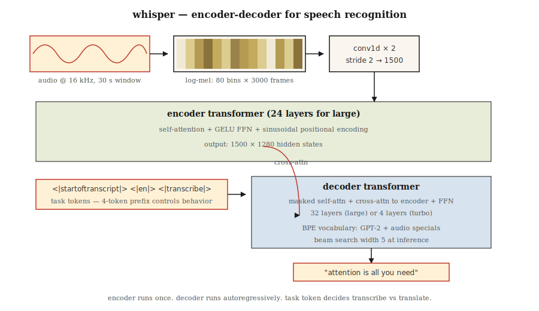

# Transformatory audio — architektura Whispera

> Dźwięk to obraz częstotliwości w czasie. Whisper to ViT, który przetwarza spektrogramy Mel i zwraca tekst.

**Typ:** Ucz się
**Języki:** Python
**Warunki wstępne:** Faza 7 · 05 (Pełny transformator), Faza 7 · 08 (enkoder-dekoder), Faza 7 · 09 (ViT)
**Czas:** ~45 minut

## Problem

Przed Whisperem (OpenAI, Radford i in. 2022) najnowocześniejsze automatyczne rozpoznawanie mowy (ASR) opierało się na wav2vec 2.0 i HuBERT — samonadzorowanych ekstraktorach cech z precyzyjnie dostrojoną głowicą klasyfikacyjną. Były to rozwiązania wysokiej jakości, lecz wymagały kosztownych potoków danych i były podatne na zmianę domeny. Wielojęzyczne rozpoznawanie mowy wymagało osobnych modeli dla każdej rodziny językowej.

Whisper postawił trzy założenia:

1. **Trenuj na wszystkim.** 680 000 godzin słabo oznakowanych nagrań pobranych z Internetu w 97 językach. Bez oczyszczonego korpusu akademickiego, bez etykiet fonemowych.
2. **Jeden model wielozadaniowy.** Wspólne trenowanie dekodera obejmuje transkrypcję, tłumaczenie, wykrywanie aktywności głosowej, identyfikację języka i znaczniki czasu — sterowane tokenami zadań.
3. **Standardowy transformator enkoder-dekoder.** Koder przetwarza spektrogramy log-mel. Dekoder generuje tokeny tekstowe w sposób autoregresyjny. Bez vocodera, bez CTC, bez HMM.

Wynik: Whisper Large-v3 radzi sobie z akcentami, szumami i językami pozbawionymi czystych danych treningowych. W 2026 roku jest domyślnym interfejsem głosowym dla większości otwartoźródłowych i komercyjnych asystentów.

## Koncepcja



### Krok 1 — ponowne próbkowanie i okienkowanie

Dźwięk przy 16 kHz. Klip lub padding do 30 sekund. Obliczany jest spektrogram log-mel: 80 pojemników mel, krok 10 ms, co daje ~3000 klatek × 80 cech. To jest „obraz wejściowy" widoczny przez Whispera.

### Krok 2 — rdzeń splotowy

Dwie warstwy Conv1D z jądrem o rozmiarze 3 i krokiem 2 redukują 3000 klatek do 1500. Długość sekwencji zostaje skrócona o połowę przy minimalnym wzroście liczby parametrów.

### Krok 3 — koder

24-warstwowy koder transformatorowy (w wariancie Large) operuje na 1500 krokach czasowych. Stosuje sinusoidalne kodowanie pozycyjne, samouwagę i FFN z aktywacją GELU. Wyjściem są stany ukryte o wymiarach 1500 × 1280.

### Krok 4 — dekoder

24-warstwowy dekoder transformatorowy. Autoregresyjnie generuje tokeny ze słownika BPE będącego nadzbiorem słownika GPT-2, wzbogaconym o kilka specjalnych tokenów audio.

### Krok 5 — tokeny zadań

Podpowiedź dekodera rozpoczyna się od tokenów sterujących, które określają zadanie modelu:

```
<|startoftranscript|>  <|en|>  <|transcribe|>  <|0.00|>
```

lub

```
<|startoftranscript|>  <|fr|>  <|translate|>   <|0.00|>
```

Model trenowano zgodnie z tą konwencją. Zadanie kontroluje się wyłącznie przez prefiks — to odpowiednik strojenia instrukcji zastosowanego do mowy.

### Krok 6 — wyjście

Przeszukiwanie wiązką (szerokość 5) z progiem log-prawdopodobieństwa. Znaczniki czasu są przewidywane co 0,02 sekundy, o ile nie podano tokena `<|notimestamps|>`.

### Rozmiary modeli Whisper

| Model | Parametry | Warstwy | d_model | Głowy | VRAM (fp16) |
|-------|--------|--------|--------|-------|------------|
| Tiny | 39M | 4 | 384 | 6 | ~1 GB |
| Base | 74M | 6 | 512 | 8 | ~1 GB |
| Small | 244M | 12 | 768 | 12 | ~2 GB |
| Medium | 769M | 24 | 1024 | 16 | ~5 GB |
| Large | 1550M | 32 | 1280 | 20 | ~10 GB |
| Large-v3 | 1550M | 32 | 1280 | 20 | ~10 GB |
| Large-v3-turbo | 809M | 32 | 1280 | 20 | ~6 GB (dekoder 4-warstwowy) |

Large-v3-turbo (2024) skrócił dekoder z 32 warstw do 4, uzyskując 8-krotne przyspieszenie dekodowania przy regresji punktowej poniżej 1 WER. Dzięki temu przełomowi Whisper-turbo stał się w 2026 roku domyślnym rozwiązaniem dla agentów głosowych działających w czasie rzeczywistym.

### Czego Whisper nie obsługuje

- Brak diaryzacji (identyfikacji mówców). Do tego celu należy połączyć go z pyannote.
- Brak natywnego przesyłania strumieniowego — przetwarzanie jest ograniczone do stałego okna 30 sekund. Nowoczesne nakładki (`faster-whisper`, `WhisperX`) umożliwiają strumieniowanie przez VAD z nakładaniem okien.
- Brak obsługi długiego kontekstu przekraczającego 30 s bez zewnętrznego fragmentowania. W praktyce nie stanowi to problemu, ponieważ transkrypcja mowy rzadko wymaga dalekosiężnego kontekstu.

### Krajobraz w 2026 roku

| Zadanie | Model | Uwagi |
|------|-------|------|
| ASR dla języka angielskiego | Whisper-turbo, Moonshine | Moonshine jest 4× szybszy na urządzeniach brzegowych |
| Wielojęzyczny ASR | Whisper-large-v3 | 97 języków |
| Strumieniowy ASR | faster-whisper + VAD | Osiągalne opóźnienie docelowe 150 ms |
| TTS | Piper, XTTS-v2, Kokoro | Architektura enkoder-dekoder, lecz o innym kształcie |
| Audio + język | AudioLM, SeamlessM4T | Tokeny tekstowe i audio w jednym transformatorze |

## Zbuduj to

Zobacz `code/main.py`. Nie trenujemy Whispera — budujemy potok spektrogramu log-mel wraz z formatowaniem tokenów zadań. To są elementy, z którymi faktycznie pracujesz w środowisku produkcyjnym.

### Krok 1: synteza dźwięku

Wygeneruj 1-sekundową falę sinusoidalną przy 440 Hz próbkowaną z częstotliwością 16 kHz. Wynikiem jest 16 000 próbek.

### Krok 2: spektrogram log-mel (uproszczony)

Pełny spektrogram mel wymaga FFT. Poniżej przedstawiono uproszczoną wersję opartą na ramkowaniu i energii na klatkę — ilustruje potok bez konieczności korzystania z `librosa`:

```python
def frame_signal(x, frame_size=400, hop=160):
    frames = []
    for start in range(0, len(x) - frame_size + 1, hop):
        frames.append(x[start:start + frame_size])
    return frames
```

Ramka wynosi 25 ms, przeskok 10 ms. Odpowiada to oknu stosowanemu przez Whispera. Energia na klatkę zastępuje pojemniki mel w celach dydaktycznych.

### Krok 3: padding do 30 s

Whisper zawsze przetwarza fragmenty 30-sekundowe. Spektrogram należy wyrównać (lub przyciąć) do 3000 klatek.

### Krok 4: budowa tokenów podpowiedzi

```python
def whisper_prompt(lang="en", task="transcribe", timestamps=True):
    tokens = ["<|startoftranscript|>", f"<|{lang}|>", f"<|{task}|>"]
    if not timestamps:
        tokens.append("<|notimestamps|>")
    return tokens
```

To jest cała powierzchnia sterowania zadaniem — prefiks złożony z 4 tokenów.

## Użyj tego

```python
import whisper
model = whisper.load_model("large-v3-turbo")
result = model.transcribe("meeting.wav", language="en", task="transcribe")
print(result["text"])
print(result["segments"][0]["start"], result["segments"][0]["end"])
```

Szybsza implementacja kompatybilna z OpenAI:

```python
from faster_whisper import WhisperModel
model = WhisperModel("large-v3-turbo", compute_type="int8_float16")
segments, info = model.transcribe("meeting.wav", vad_filter=True)
for s in segments:
    print(f"{s.start:.2f} - {s.end:.2f}: {s.text}")
```

**Kiedy wybrać Whisper w 2026 roku:**

- Wielojęzyczny ASR w jednym modelu.
- Niezawodna transkrypcja głośnych, zróżnicowanych nagrań.
- Badania i prototypowanie ASR — najszybszy punkt startowy.

**Kiedy wybrać inne rozwiązanie:**

- Strumieniowanie na urządzeniach brzegowych z bardzo niskim opóźnieniem — Moonshine przewyższa Whispera przy porównywalnej jakości.
- Konwersacyjna AI w czasie rzeczywistym wymagająca opóźnienia poniżej 200 ms — dedykowany strumieniowy ASR.
- Diaryzacja mówców — Whisper tego nie obsługuje; należy włączyć pyannote.

## Wyślij to

Zobacz `outputs/skill-asr-configurator.md`. Umiejętność dobiera model ASR, parametry dekodowania i potok przetwarzania wstępnego dla nowej aplikacji głosowej.

## Ćwiczenia

1. **Łatwe.** Uruchom `code/main.py`. Sprawdź, czy liczba klatek dla 1-sekundowego sygnału przy 16 kHz ze skokiem 10 ms wynosi ~100. Dla 30 sekund powinna wynosić ~3000 klatek.
2. **Średnie.** Zbuduj pełny spektrogram log-mel przy użyciu `numpy.fft`. Porównaj wyniki z `librosa.feature.melspectrogram(n_mels=80)` w zakresie błędu numerycznego dla 80 pojemników mel.
3. **Trudne.** Zaimplementuj wnioskowanie strumieniowe: podziel audio na okna 10-sekundowe z 2-sekundowym nakładaniem, uruchom Whispera na każdym fragmencie, a następnie połącz transkrypcje. Zmierz współczynnik błędów słownych (WER) w porównaniu z jednorazowym przetworzeniem 5-minutowej próbki podcastu.

## Kluczowe terminy

| Termin | Potoczne określenie | Właściwe znaczenie |
|------|-----------------|----------------------|
| Spektrogram Mel | „Obraz dźwięku" | Reprezentacja 2D: przedziały częstotliwości na jednej osi, klatki czasowe na drugiej; energia skalowana logarytmicznie w każdej komórce. |
| Log-mel | „To, co widzi Whisper" | Spektrogram Mel po transformacji logarytmicznej; przybliża ludzkie postrzeganie głośności. |
| Ramka | „Jednorazowy wycinek" | Okno 25 ms próbek; klatki nakładają się co 10 ms. |
| Token zadania | „Prefiks podpowiedzi mowy" | Specjalne tokeny, takie jak `<\|transcribe\|>` / `<\|translate\|>`, umieszczane na początku podpowiedzi dekodera. |
| Wykrywanie aktywności głosowej (VAD) | „Znajdź mowę" | Mechanizm usuwający ciszę przed ASR; znacząco obniża koszty przetwarzania. |
| CTC | „Connectionist Temporal Classification" | Klasyczna funkcja straty ASR dla trenowania bez wyrównania; Whisper jej nie używa. |
| Whisper-turbo | „Mały dekoder, pełny koder" | Koder Large-v3 z 4-warstwowym dekoderem; 8-krotnie szybsze dekodowanie. |
| faster-whisper | „Produkcyjne opakowanie" | Reimplementacja w CTranslate2 z kwantyzacją int8; 4-krotnie szybsza niż implementacja referencyjna OpenAI. |

## Dalsze czytanie

- [Radford i in. (2022). Robust Speech Recognition via Large-Scale Weak Supervision](https://arxiv.org/abs/2212.04356) — artykuł opisujący Whispera.
- [Repozytorium OpenAI Whisper](https://github.com/openai/whisper) — kod referencyjny i wagi modeli. Plik `whisper/model.py` zawiera pełną implementację Conv1D + koder + dekoder w ~400 liniach.
- [OpenAI Whisper — `whisper/decoding.py`](https://github.com/openai/whisper/blob/main/whisper/decoding.py) — logika przeszukiwania wiązką i tokenów zadań opisana w krokach 5–6; 500 linii, w pełni czytelne.
- [Baevski i in. (2020). wav2vec 2.0: A Framework for Self-Supervised Learning of Speech Representations](https://arxiv.org/abs/2006.11477) — poprzednik Whispera; nadal osiąga wyniki SOTA w pewnych konfiguracjach.
- [SYSTRAN/faster-whisper](https://github.com/SYSTRAN/faster-whisper) — opakowanie produkcyjne, 4-krotnie szybsze od implementacji referencyjnej.
- [Jia i in. (2024). Moonshine: Speech Recognition for Live Transcription and Voice Commands](https://arxiv.org/abs/2410.15608) — ASR przyjazny urządzeniom brzegowym (2024), architekturą zbliżony do Whispera, lecz znacznie mniejszy.
- [Blog HuggingFace — „Fine-Tune Whisper For Multilingual ASR with 🤗 Transformers"](https://huggingface.co/blog/fine-tune-whisper) — kanoniczny przepis na dostrajanie, obejmujący preprocesor spektrogramu mel i obsługę tokenów znaczników czasu.
- [HuggingFace `modeling_whisper.py`](https://github.com/huggingface/transformers/blob/main/src/transformers/models/whisper/modeling_whisper.py) — pełna implementacja (koder, dekoder, przeplatanie uwagi, generowanie) odzwierciedlająca diagram architektury z lekcji.
