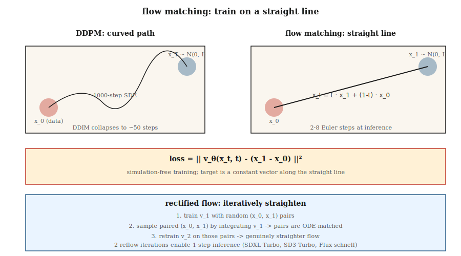

# Dopasowanie przepływu i skorygowane przepływy

> Modele dyfuzyjne wymagają 20–50 kroków próbkowania, ponieważ przemierzają zakrzywioną ścieżkę od szumu do danych. Dopasowanie przepływu (Lipman i in., 2023) oraz skorygowany przepływ (Liu i in., 2022) uczą modeli prostych, liniowych trajektorii. Prostsze ścieżki przekładają się na mniej kroków i szybsze wnioskowanie. W 2024 roku Stable Diffusion 3, Flux.1 i AudioCraft 2 przeszły na dopasowanie przepływu.

**Typ:** Kompilacja
**Języki:** Python
**Wymagania wstępne:** Faza 8 · 06 (DDPM), Faza 1 · Rachunek różniczkowy
**Czas:** ~45 minut

## Problem

Proces odwrotny DDPM to 1000-krokowy spacer stochastyczny od `N(0, I)` z powrotem do rozkładu danych. DDIM skrócił go do 20–50 deterministycznych kroków. Ideałem byłby jednak krok pojedynczy. Przeszkodą jest sztywność ODE rozwiązującego proces odwrotny — ścieżka jest zakrzywiona.

Gdyby dało się wytrenować model tak, by ścieżka od szumu do danych była *linią prostą*, wystarczyłby jeden krok Eulera od `t=1` do `t=0`. Dopasowanie przepływu realizuje ten pomysł bezpośrednio: definiuje liniową interpolację od `x_1 ∼ N(0, I)` do `x_0 ∼ data`, trenuje pole wektorowe `v_θ(x, t)` dopasowane do pochodnej tej interpolacji po czasie, a następnie całkuje je podczas wnioskowania.

Skorygowany przepływ (Liu 2022) idzie o krok dalej: iteracyjnie prostuje trajektorie za pomocą procedury ponownego przepływu, która stopniowo zbliża wyuczone ODE do linii prostej. Po dwóch iteracjach próbnik dwustopniowy osiąga jakość porównywalną z 50-krokowym DDPM.

## Koncepcja



### Przepływ w linii prostej

Zdefiniuj:

```
x_t = t · x_1 + (1 - t) · x_0,   t ∈ [0, 1]
```

gdzie `x_0 ~ data` i `x_1 ~ N(0, I)`. Pochodna po czasie wzdłuż tej prostej jest stała:

```
dx_t / dt = x_1 - x_0
```

Zdefiniuj neuronowe pole wektorowe `v_θ(x_t, t)` i naucz je odwzorowywać tę pochodną:

```
L = E_{x_0, x_1, t} || v_θ(x_t, t) - (x_1 - x_0) ||²
```

Jest to **strata warunkowego dopasowania przepływu** (Lipman 2023). Trening nie wymaga symulacji — ODE nie jest nigdy rozwijane. Wystarczy próbkować trójki `(x_0, x_1, t)` i wykonać regresję.

### Próbkowanie

Aby wygenerować próbkę, całkuj wyuczone pole wektorowe *wstecz* w czasie:

```
x_{t-Δt} = x_t - Δt · v_θ(x_t, t)
```

Zacznij od `x_1 ~ N(0, I)` i wykonuj kroki Eulera w dół do `t=0`.

### Skorygowany przepływ (Liu 2022)

Przepływ w linii prostej działa, lecz wyuczone trajektorie *nie są idealnie proste* — zakrzywiają się, gdy wiele punktów `x_0` może odpowiadać tym samym `x_1`. Procedura ponownego przepływu prostuje je iteracyjnie:

1. Wytrenuj model przepływu v_1 na losowych parach.
2. Wygeneruj N par `(x_1, x_0)` przez całkowanie v_1 od `x_1` do celu `x_0`.
3. Wytrenuj v_2 na tych sparowanych przykładach. Ponieważ pary są teraz „dopasowane przez ODE", liniowa interpolacja między nimi jest znacznie bardziej płaska.
4. Powtarzaj.

W praktyce dwie iteracje wystarczają, by osiągnąć niemal liniowe trajektorie i umożliwić wnioskowanie w 2–4 krokach. SDXL-Turbo, SD3-Turbo i LCM to modele destylowane z baz dopasowanych przepływem.

### Dlaczego dopasowanie przepływu zwyciężyło w dziedzinie obrazów w 2024 roku

Trzy powody:

1. **Trening bez symulacji** — ODE nie jest rozwijane podczas treningu, implementacja jest prosta.
2. **Lepsza geometria straty** — proste trajektorie mają stały stosunek sygnału do szumu, podczas gdy strata ε w DDPM ma niekorzystny SNR na granicach harmonogramu.
3. **Szybsze wnioskowanie** — 4–8 kroków przy jakości SDXL-Turbo; jeden etap z destylacją spójności.

## Dopasowanie przepływu a DDPM — formalne powiązanie

Dopasowanie przepływu z gaussowską ścieżką warunkową jest równoważne dyfuzji *z określonym harmonogramem szumów*. Przy harmonogramie `x_t = α(t) x_0 + σ(t) x_1` dopasowanie przepływu redukuje się do dyfuzji Stratonowicza z `v = α'·x_0 - σ'·x_1`. Oba podejścia są algebraicznie równoważne dla gaussowskich ścieżek.

Wkład dopasowania przepływu to przede wszystkim *przejrzystość* celu (czysta prędkość), czystsze straty oraz możliwość eksperymentowania z interpolantami niegaussowskimi.

## Implementacja

`code/main.py` implementuje dopasowanie przepływu w przestrzeni 1-D na dwumodalnej mieszaninie gaussowskiej. Pole wektorowe `v_θ(x, t)` to niewielki MLP trenowany z celem liniowym. Dla porównania całkuje się 1, 2, 4 i 20 kroków Eulera i ocenia jakość próbek.

### Krok 1: strata treningowa

```python
def train_step(x0, net, rng, lr):
    x1 = rng.gauss(0, 1)
    t = rng.random()
    x_t = t * x1 + (1 - t) * x0
    target = x1 - x0
    pred = net_forward(x_t, t)
    loss = (pred - target) ** 2
    # backprop + update
```

### Krok 2: wieloetapowe wnioskowanie

```python
def sample(net, num_steps):
    x = rng.gauss(0, 1)
    for i in range(num_steps):
        t = 1.0 - i / num_steps
        dt = 1.0 / num_steps
        x -= dt * net_forward(x, t)
    return x
```

### Krok 3: porównanie liczby kroków

Próbnik czterostopniowy powinien już dorównywać jakości próbnika dwudziestostopniowego — różnica ma istotne znaczenie dla opóźnień wnioskowania.

## Pułapki

- **Parametryzacja czasu.** Dopasowanie przepływu stosuje `t ∈ [0, 1]`, gdzie `t=0` odpowiada danym, a `t=1` szumowi. DDPM używa `t ∈ [0, T]` z `t=0` przy danych i `t=T` przy szumie. Kierunek jest ten sam, skala inna. W artykułach naukowych to rozróżnienie jest często mylone.
- **Wybór harmonogramu.** Linia prosta skorygowanego przepływu to domyślny „harmonogram dopasowania przepływu", ale można stosować próbkowanie cosinusowe lub logit-normalne (tak robi SD3), aby lepiej pokryć różne skale.
- **Koszt ponownego przepływu.** Generowanie sparowanego zbioru danych na potrzeby ponownego przepływu wymaga pełnego przebiegu wnioskowania dla każdej próbki. Warto to robić tylko wtedy, gdy naprawdę potrzebne jest wnioskowanie w 1–2 krokach.
- **Guidance bez klasyfikatora nadal działa.** Wystarczy zastąpić ε przez v w kombinacji liniowej: `v_cfg = (1+w) v_cond - w v_uncond`.

## Zastosowania

| Przypadek użycia | Stos 2026 |
|---------|-----------|
| Zamiana tekstu na obraz, najwyższa jakość | Dopasowanie przepływu: SD3, Flux.1-dev |
| Zamiana tekstu na obraz, 1–4 kroki | Destylowane dopasowanie przepływu: Flux.1-schnell, SD3-Turbo, SDXL-Turbo |
| Wnioskowanie w czasie rzeczywistym | Destylacja spójności z bazy dopasowanej przepływem (LCM, PCM) |
| Generowanie dźwięku | Dopasowanie przepływu: Stable Audio 2.5, AudioCraft 2 |
| Generowanie wideo | Dopasowanie przepływu połączone z dyfuzją (Sora, Veo, Stable Video) |
| Nauka i fizyka (trajektorie cząstek, cząsteczki) | Dopasowanie przepływu + równoważne pole wektorowe |

Gdy w artykułach z lat 2025–2026 pojawia się sformułowanie „szybciej niż dyfuzja", niemal zawsze oznacza to dopasowanie przepływu połączone z destylacją.

## Zadanie do wykonania

Zapisz `outputs/skill-fm-tuner.md`. Skill przyjmuje specyfikację modelu w stylu dyfuzji i przekształca ją w konfigurację treningową dla dopasowania przepływu: wybór harmonogramu, rozkład próbkowania w czasie (jednostajny lub logit-normalny), optymalizator, plan ponownego przepływu, docelowa liczba kroków oraz protokół ewaluacji.

## Ćwiczenia

1. **Łatwe.** Uruchom `code/main.py` i porównaj MSE między próbnikiem jednoetapowym a dwudziestostopniowym względem rzeczywistego rozkładu danych.
2. **Średnie.** Zastąp jednostajne próbkowanie `t` próbkowaniem logit-normalnym (skupionym wokół środkowych wartości t). Czy jakość modelu wzrosła?
3. **Trudne.** Zaimplementuj jedną iterację ponownego przepływu: wygeneruj pary (x_0, x_1) przez całkowanie pierwszego modelu, wytrenuj drugi model na tych parach i porównaj jakość próbek w jednym kroku.

## Kluczowe terminy

| Termin | Potoczne określenie | Znaczenie |
|------|-----------------|----------------------|
| Dopasowanie przepływu | „Dyfuzja liniowa" | Trenuj `v_θ(x, t)`, aby odwzorowywał `x_1 - x_0` wzdłuż interpolantu. |
| Skorygowany przepływ | „Przepływ" | Procedura iteracyjna prostująca wyuczone trajektorie. |
| Pole prędkości | „v_θ" | Wyjście modelu — kierunek przemieszczenia `x_t`. |
| Interpolant liniowy | „Ścieżka" | `x_t = (1-t)·x_0 + t·x_1`; pochodna celu jest trywialna. |
| Próbnik Eulera | „Rozwiązywanie ODE pierwszego rzędu" | Najprostszy integrator; działa dobrze, gdy ścieżki są proste. |
| Logit-normalne t | „Próbkowanie SD3" | Skupia próbkowanie `t` wokół wartości środkowych, gdzie gradienty są najsilniejsze. |
| Destylacja spójności | „Próbnik jednoetapowy" | Uczy model-ucznia mapowania dowolnego `x_t` bezpośrednio do `x_0`. |
| CFG z prędkością | „v-CFG" | `v_cfg = (1+w) v_cond - w v_uncond`; ten sam mechanizm, nowa zmienna. |

## Uwaga produkcyjna: Flux.1-schnell jako najszybszy model dopasowania przepływu

Najskuteczniejszym produkcyjnym rozwiązaniem opartym na dopasowaniu przepływu jest Flux.1-schnell — DiT dopasowany przepływem i destylowany do 1–4 kroków wnioskowania przy zachowaniu jakości Flux-dev. Notatnik Nielsa „Uruchom Flux na maszynie 8 GB" stanowi referencyjny przepis wdrożeniowy: kodowanie T5 + CLIP, kwantyzowane odszumianie MMDiT (4 kroki dla schnell wobec 50 dla dev), dekodowanie VAE. Zestawienie kosztów:

| Wariant | Kroki | Opóźnienie przy 1024² na L4 | Suma FLOP (względna) |
|--------|-------|--------------------------------------|----------------------|
| Flux.1-dev (surowy) | 50 | ~15 s | 1,0× |
| Flux.1-schnell | 4 | ~1,2 s | 0,08× (12× szybciej) |
| Podstawa SDXL | 30 | ~4 s | 0,25× |
| SDXL-Lightning 2-stopniowy | 2 | ~0,3 s | 0,03× |

Zasada produkcyjna: **baza dopasowana przepływem + destylacja = domyślny stos 2026 dla szybkiej zamiany tekstu na obraz.** Każdy większy dostawca oferuje tę kombinację: SD3-Turbo (SD3 + dopasowanie przepływu + destylacja), Flux-schnell (Flux-dev + prostowanie przepływu), CogView-4-Flash. Bazy oparte na czystej dyfuzji funkcjonują już tylko jako starsze punkty kontrolne.

## Literatura

- [Liu, Gong, Liu (2022). Flow Straight and Fast: Learning to Generate and Transfer Data with Rectified Flow](https://arxiv.org/abs/2209.03003) — skorygowany przepływ.
- [Lipman i in. (2023). Flow Matching for Generative Modeling](https://arxiv.org/abs/2210.02747) — dopasowanie przepływu.
- [Esser i in. (2024). Scaling Rectified Flow Transformers for High-Resolution Image Synthesis](https://arxiv.org/abs/2403.03206) — SD3, skorygowany przepływ na dużą skalę.
- [Albergo, Vanden-Eijnden (2023). Stochastic Interpolants](https://arxiv.org/abs/2303.08797) — ogólne ramy obejmujące zarówno dyfuzję, jak i dopasowanie przepływu.
- [Song i in. (2023). Consistency Models](https://arxiv.org/abs/2303.01469) — jednoetapowa destylacja dyfuzyjna i przepływowa.
- [Sauer i in. (2023). Adversarial Diffusion Distillation (SDXL-Turbo)](https://arxiv.org/abs/2311.17042) — wariant turbo.
- [Black Forest Labs (2024). Modele Flux.1](https://blackforestlabs.ai/announcing-black-forest-labs/) — dopasowanie przepływu w środowisku produkcyjnym.
