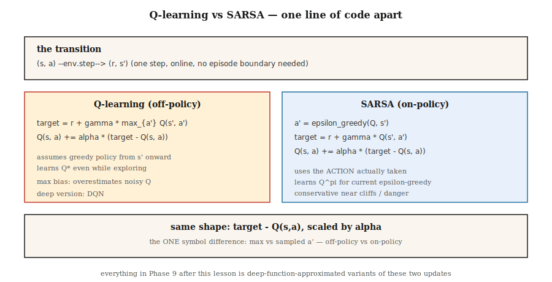

# Różnica czasowa — Q-Learning i SARSA

> Monte Carlo czeka, aż odcinek się skończy. TD aktualizuje się po każdym kroku poprzez ładowanie kolejnej szacunkowej wartości. Q-learning jest niezgodny z polityką i optymistyczny; SARSA przestrzega zasad i jest ostrożna. Obydwa stanowią jedną linię kodu. Obydwa stanowią podstawę każdej metody głębokiego RL na tym etapie.

**Typ:** Kompilacja
**Języki:** Python
**Wymagania wstępne:** Faza 9 · 01 (MDP), Faza 9 · 02 (Programowanie dynamiczne), Faza 9 · 03 (Monte Carlo)
**Czas:** ~75 minut

## Problem

Monte Carlo działa, ale ma dwa kosztowne wymagania. Potrzebuje odcinków, które się kończą i aktualizuje się dopiero po nadejściu ostatniego powrotu. Jeśli twój odcinek ma 1000 kroków, MC czeka 1000 kroków, aby cokolwiek zaktualizować. Charakteryzuje się dużą wariancją, niskim poziomem błędu systematycznego i jest powolny w praktyce.

Programowanie dynamiczne ma odwrotny profil — kopie zapasowe z zerową wariancją — ale wymaga znanego modelu.

Uczenie się poprzez różnicę czasową (TD) dzieli różnicę. Z pojedynczego przejścia `(s, a, r, s')` utwórz jednoetapowy cel `r + γ V(s')` i popchnij w jego stronę `V(s)`. Brak modelu. Brak całych odcinków. Błąd wynikający z użycia przybliżonego `V` w RHS, ale znacznie mniejsza wariancja niż w przypadku aktualizacji MC i online z kroku pierwszego.

To jest oś, wokół której obraca się cały nowoczesny RL – DQN, A2C, PPO, SAC. Pozostała część fazy 9 to warstwy aproksymacji funkcji i triki zbudowane na bazie jednoetapowej aktualizacji TD, którą napiszesz w tej lekcji.

## Koncepcja



**Aktualizacja TD(0) dla V:**

`V(s) ← V(s) + α [r + γ V(s') - V(s)]`

Ilość w nawiasach to błąd TD `δ = r + γ V(s') - V(s)`. Jest to internetowy odpowiednik `G_t - V(s_t)` w MC. Konwergencja wymaga `α` spełnienia wymagań Robbinsa-Monro (`Σ α = ∞`, `Σ α² < ∞`) i wszystkich stanów odwiedzanych nieskończenie często.

**Q-learning.** Metoda kontroli TD niezgodna z zasadami:

`Q(s, a) ← Q(s, a) + α [r + γ max_{a'} Q(s', a') - Q(s, a)]`

`max` zakłada, że *chciwa* polityka będzie stosowana od `s'`, niezależnie od tego, jaką akcję faktycznie podejmie agent. To oddzielenie sprawia, że ​​Q-learning uczy się `Q*`, podczas gdy agent eksploruje poprzez ε-chciwość. Mnih i in. (2015) przekształcili to w głębokie Q-learning na Atari (lekcja 05).

**SARSA.** Metoda TD zgodna z zasadami:

`Q(s, a) ← Q(s, a) + α [r + γ Q(s', a') - Q(s, a)]`

Nazwa to krotka `(s, a, r, s', a')`. SARSA używa akcji `a'`, którą agent *faktycznie* wykonuje jako następną, a nie zachłannego `argmax`. Zbiega się do `Q^π` dla dowolnego ε-chciwego `π`, który w limicie `ε → 0` staje się `Q*`.

**Różnica w chodzeniu po klifach.** W przypadku klasycznego zadania chodzenia po klifach (spadnięcie z klifu = nagroda -100) Q-learning uczy się optymalnej ścieżki wzdłuż krawędzi klifu, ale czasami ponosi karę podczas eksploracji. SARSA uczy się bezpieczniejszej ścieżki o krok od klifu, ponieważ uwzględnia hałas eksploracji w swojej wartości Q. Po treningu oba osiągają optymalny poziom w `ε → 0`. W praktyce ma to znaczenie: gdy w momencie wdrożenia faktycznie odbywa się eksploracja, zachowanie SARSA jest bardziej konserwatywne.

**Oczekiwany SARSA.** Zastąp `Q(s', a')` jego oczekiwaną wartością w obszarze `π`:

`Q(s, a) ← Q(s, a) + α [r + γ Σ_{a'} π(a'|s') Q(s', a') - Q(s, a)]`

Niższa wariancja niż SARSA (brak próbki `a'`), ten sam cel zgodny z zasadami. Często domyślny we współczesnych podręcznikach.

**n-stopniowy TD i TD(λ).** Interpoluj pomiędzy TD(0) i MC, czekając `n` kroków przed ładowaniem. `n=1` to TD, `n=∞` to MC. Średnie TD(λ) ze wszystkich `n` z wagami geometrycznymi `(1-λ)λ^{n-1}`. Większość głębokich RL używa `n` od 3 do 20.

## Zbuduj to

### Krok 1: SARSA w sprawie polityki ε-chciwości

```python
def sarsa(env, episodes, alpha=0.1, gamma=0.99, epsilon=0.1):
    Q = defaultdict(lambda: {a: 0.0 for a in ACTIONS})

    def choose(s):
        if random() < epsilon:
            return choice(ACTIONS)
        return max(Q[s], key=Q[s].get)

    for _ in range(episodes):
        s = env.reset()
        a = choose(s)
        while True:
            s_next, r, done = env.step(s, a)
            a_next = choose(s_next) if not done else None
            target = r + (gamma * Q[s_next][a_next] if not done else 0.0)
            Q[s][a] += alpha * (target - Q[s][a])
            if done:
                break
            s, a = s_next, a_next
    return Q
```

Osiem linii. *Jedyną* różnicą od Q-learningu jest linia docelowa.

### Krok 2: Q-learning

```python
def q_learning(env, episodes, alpha=0.1, gamma=0.99, epsilon=0.1):
    Q = defaultdict(lambda: {a: 0.0 for a in ACTIONS})
    for _ in range(episodes):
        s = env.reset()
        while True:
            a = choose(s, Q, epsilon)
            s_next, r, done = env.step(s, a)
            target = r + (gamma * max(Q[s_next].values()) if not done else 0.0)
            Q[s][a] += alpha * (target - Q[s][a])
            if done:
                break
            s = s_next
    return Q
```

`max` oddziela cel od zachowania. Ten jeden symbol oznacza różnicę pomiędzy polityką on-policy i off-policy.

### Krok 3: krzywe uczenia się

Śledź średni zwrot na 100 odcinków. Q-learning szybciej zbiega się z prostym deterministycznym GridWorld; SARSA jest bardziej konserwatywna w przypadku chodzenia po klifach. W sieci GridWorld 4×4 w `code/main.py` oba są prawie optymalne po ~2000 odcinków z `α=0.1, ε=0.1`.

### Krok 4: porównaj z prawdą DP

Uruchom iterację wartości (lekcja 02), aby uzyskać `Q*`. Sprawdź `max_{s,a} |Q_learned(s,a) - Q*(s,a)|`. Zdrowy tabelaryczny agent TD ląduje w `~0.5` w GridWorld 4×4 po 10 000 odcinków.

## Pułapki

- **Początkowe wartości Q mają znaczenie.** Optymistyczny start (`Q = 0` w przypadku zadania z ujemną nagrodą) zachęca do eksploracji. Pesymistyczny init może na zawsze uwięzić zachłanną politykę.
- **harmonogram α.** Stały `α` jest odpowiedni w przypadku problemów niestacjonarnych. Rozkład `α_n = 1/n` zapewnia zbieżność w teorii, ale w praktyce jest zbyt powolny — przypnij `α` w `[0.05, 0.3]` i monitoruj krzywą uczenia się.
- **ε harmonogram.** Zacznij od wysokiego (`ε=1.0`), przejdź do `ε=0.05`. „GLIE” (chciwy w granicach z nieskończoną eksploracją) jest warunkiem zbieżności.
- **Maksymalne odchylenie w Q-learningu.** Operator `max` jest przesunięty w górę, gdy `Q` jest zaszumiony. Prowadzi do przeszacowania — metoda Double Q-learning Hasselta (używana przez DDQN w lekcji 05) rozwiązuje ten problem za pomocą dwóch tabel Q.
- **Odcinki niekończące się.** TD może uczyć się bez terminali, ale musisz albo ograniczyć kroki, albo poprawnie obsłużyć bootstrap na końcu. Standard: traktuj limit jako nieterminalny, kontynuuj ładowanie.
- **Haszowanie stanu.** Jeśli stany są krotkami/tensorami, użyj klucza umożliwiającego mieszanie (krotka, nie lista; krotka zmiennoprzecinkowa zaokrąglona, ​​a nie surowa).

## Użyj tego

Krajobraz TD 2026:

| Zadanie | Metoda | Powód |
|------|--------|--------|
| Małe środowiska tabelaryczne | Q-learning | Uczy się bezpośrednio optymalnej polityki. |
| Krytyczne dla bezpieczeństwa zgodnie z zasadami | SARSA / Oczekiwany SARSA | Konserwatywny podczas eksploracji. |
| Stan wielowymiarowy | DQN (faza 9 · 05) | Funkcja Q sieci neuronowej z odtwarzaniem i siecią docelową. |
| Działania ciągłe | SAC / TD3 (faza 9 · 07) | Aktualizacja TD w sieci Q; sieć polityk emituje akcje. |
| LLM RL (oparta na modelu nagrody) | PPO / GRPO (faza 9 · 08, 12) | Aktor-krytyk z przewagą w stylu TD dzięki GAE. |
| Nieaktywny RL | CQL/IQL (faza 9 · 08) | Q-learning z konserwatywną regularyzacją. |

Dziewięćdziesiąt procent „RL”, o których czytasz w artykułach z 2026 r., to jakieś rozwinięcia Q-learningu lub SARSA. Zanim zaczniesz czytać głębiej, zapoznaj się z aktualizacją tabelaryczną w swoich palcach.

## Wyślij to

Zapisz jako `outputs/skill-td-agent.md`:

```markdown
---
name: td-agent
description: Pick between Q-learning, SARSA, Expected SARSA for a tabular or small-feature RL task.
version: 1.0.0
phase: 9
lesson: 4
tags: [rl, td-learning, q-learning, sarsa]
---

Given a tabular or small-feature environment, output:

1. Algorithm. Q-learning / SARSA / Expected SARSA / n-step variant. One-sentence reason tied to on-policy vs off-policy and variance.
2. Hyperparameters. α, γ, ε, decay schedule.
3. Initialization. Q_0 value (optimistic vs zero) and justification.
4. Convergence diagnostic. Target learning curve, `|Q - Q*|` check if DP is possible.
5. Deployment caveat. How will exploration behave at inference? Is SARSA's conservatism needed?

Refuse to apply tabular TD to state spaces > 10⁶. Refuse to ship a Q-learning agent without a max-bias caveat. Flag any agent trained with ε held at 1.0 throughout (no exploitation phase).
```

## Ćwiczenia

1. **Łatwe.** Wdrożenie Q-learningu i SARSA w 4×4 GridWorld. Wykreśl krzywe uczenia się (średni zwrot na 100 odcinków) dla 2000 odcinków. Kto zbiega się szybciej?
2. **Średni.** Zbuduj środowisko spacerowe po klifach (4×12, ostatni rząd to klif z nagrodą -100 i zresetuj, aby rozpocząć). Porównaj ostateczne zasady Q-learning i SARSA. Zrzut ekranu przedstawiający ścieżki, którymi podąża każda z nich. Co jest bliżej klifu?
3. **Trudne.** Wdrożenie podwójnego uczenia się Q. Na zaszumionym świecie GridWorld (szum Gaussa σ=5 dodany do nagrody za krok) pokaż, że Q-learning zawyża `V*(0,0)` o znaczącą wartość, podczas gdy Double Q-learning nie.

## Kluczowe terminy

| Termin | Co ludzie mówią | Co to właściwie oznacza |
|------|-----------------|----------------------|
| Błąd TD | „Sygnał aktualizacji” | `δ = r + γ V(s') - V(s)`, załadowana reszta. |
| TD(0) | „Jednoetapowy niszczyciel czołgów” | Aktualizuj po każdym przejściu, używając wyłącznie oszacowania następnego stanu. |
| Q-learning | „Niezgodny z zasadami RL 101” | Aktualizacja TD za pomocą `max` w przypadku działań w następnym stanie; uczy się `Q*` niezależnie od zasad zachowania. |
| SARSA | „Q-learning w ramach zasad” | Aktualizacja TD przy użyciu następnej akcji; uczy się `Q^π` dla bieżącego ε-chciwego π. |
| Oczekiwany SARSA | „SARSA o niskiej wariancji” | Zastąp próbkowany `a'` jego oczekiwaniem pod π. |
| GLIE | „Prawidłowy harmonogram poszukiwań” | Chciwy w limicie z nieskończoną eksploracją; potrzebne do konwergencji Q-learningu. |
| Bootstrapowanie | „Wykorzystanie bieżącego szacunku w celu” | Co odróżnia TD od MC. Źródło błędu systematycznego, ale ogromna redukcja wariancji. |
| Błąd maksymalizacji | „Q-learning przecenia” | `max` w przypadku zaszumionych szacunków jest zawyżony; naprawione przez Double Q-learning. |

## Dalsze czytanie

- [Watkins i Dayan (1992). Q-learning](https://link.springer.com/article/10.1007/BF00992698) — artykuł oryginalny i dowód zbieżności.
- [Sutton i Barto (2018). Ch. 6 — Uczenie się na podstawie różnicy czasowej](http://incompleteideas.net/book/RLbook2020.pdf) — TD(0), SARSA, Q-learning, oczekiwany SARSA.
- [Hasselt (2010). Double Q-learning](https://papers.nips.cc/paper_files/paper/2010/hash/091d584fced301b442654dd8c23b3fc9-Abstract.html) — poprawka błędu maksymalizacji.
- [Seijen, Hasselt, Whiteson, Wiering (2009). Teoretyczna i empiryczna analiza oczekiwanej SARSA](https://ieeexplore.ieee.org/document/4927542) — oczekiwana motywacja SARSA.
- [Rummery i Niranjan (1994). Q-learning online z wykorzystaniem systemów koneksjonistycznych](https://www.researchgate.net/publication/2500611_On-Line_Q-Learning_Using_Connectionist_Systems) — artykuł, w którym ukuto SARSA (nazywaną wówczas „zmodyfikowanym Q-learningiem koneksjonistycznym”).
- [Sutton i Barto (2018). Ch. 7 — n-step Bootstrapping](http://incompleteideas.net/book/RLbook2020.pdf) — uogólnia TD(0) na TD(n), ścieżkę od Q-learningu do śladów kwalifikowalności, a później GAE w PPO.