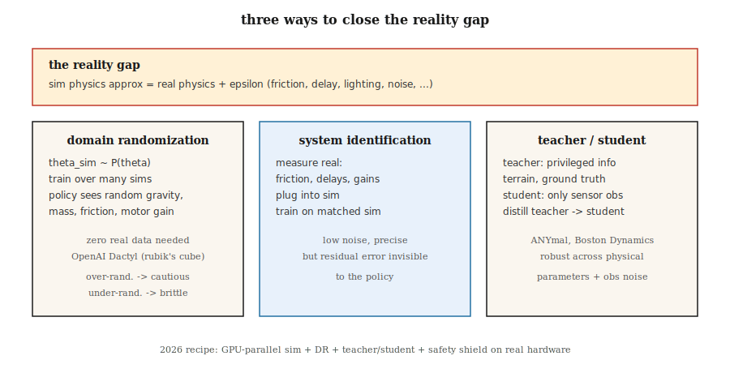

# Transfer z Sima do Realu

> Polityka wyszkolona w symulatorze, która zawodzi sprzętowo, to polityka, która zapamiętała symulator. Randomizacja domeny, adaptacja domeny i identyfikacja systemu to trzy narzędzia, które pozwalają wyuczonym kontrolerom przekroczyć lukę w rzeczywistości.

**Typ:** Ucz się
**Języki:** Python
**Wymagania wstępne:** Faza 9 · 08 (PPO), Faza 2 · 10 (odchylenie/wariancja)
**Czas:** ~45 minut

## Problem

Szkolenie prawdziwego robota jest powolne, niebezpieczne i kosztowne. Dwunożny potrzebuje milionów odcinków treningowych, aby nauczyć się chodzić; prawdziwy dwunożny, który przewraca się nawet po uszkodzeniu sprzętu. Symulacja zapewnia nieograniczone resetowanie, deterministyczną odtwarzalność, równoległe środowiska i brak uszkodzeń fizycznych.

Ale symulatory się mylą. Łożyska charakteryzują się większym tarciem niż modele MuJoCo. Kamery mają zniekształcenia obiektywu, których symulator nie uwzględnia. Silniki charakteryzują się opóźnieniami, luzami i nasyceniem, które pomija 99% modeli kart SIM. Wiatr, kurz i zmienne oświetlenie sabotują politykę wytrenowaną w zakresie sterylnego renderowania. **Luka w rzeczywistości** — systematyczna różnica między dystrybucją symulacyjną a dystrybucją rzeczywistą — jest głównym problemem wdrożonych RL w robotyce.

Potrzebujesz polityki, która będzie *odporna na przejście z dystrybucji symulacyjnej do rzeczywistej*. Trzy podejścia historyczne: randomizacja symulatora (randomizacja domeny), dostosowanie polityki z niewielką ilością rzeczywistych danych (adaptacja domeny / dostrajanie) lub identyfikacja parametrów rzeczywistego systemu i dopasowanie ich (identyfikacja systemu). W roku 2026 dominująca receptura łączy wszystkie trzy z masową symulacją równoległą (Isaac Sim, Isaac Lab, Mujoco MJX na GPU).

## Koncepcja



**Randomizacja domeny (DR).** Tobin i in. 2017, Peng i in. 2018. Podczas szkolenia losuj każdy parametr symulatora, który może różnić się od prawdziwego robota: masy, współczynniki tarcia, wzmocnienia silnika PD, szum czujnika, położenie kamery, oświetlenie, tekstury, modele styków. Polityka uczy się rozkładu warunkowego w zależności od tego, „w której karcie SIM jest dzisiaj” i dokonuje uogólnienia na cały zakres. Jeśli prawdziwy robot mieści się w zakresie szkolenia, zasada działa.

- **Zaleta:** nie są potrzebne żadne prawdziwe dane. Jeden przepis, wiele robotów.
- **Wada:** nadmiernie randomizowane szkolenie prowadzi do „uniwersalnej”, ale zbyt ostrożnej polityki. Za dużo hałasu ≈ za dużo regularyzacji.

**Identyfikacja systemu (SI).** Przed szkoleniem dopasuj parametry symulatora do danych rzeczywistych. Jeśli możesz zmierzyć tarcie w stawach ramion prawdziwego robota, podłącz je do symulatora. Następnie wytrenuj politykę, która oczekuje tych wartości. Potrzebuje dostępu do prawdziwego systemu, ale bezpośrednio zmniejsza lukę w rzeczywistości.

- **Zaleta:** precyzyjny, cichy cel treningowy.
- **Wada:** błąd modelu resztkowego jest niewidoczny dla polisy; niewielkie niezidentyfikowane efekty (np. strefa nieczułości silnika) nadal zakłócają wdrożenie.

**Adaptacja domeny.** Trenuj w symulatorze, dostosowuj się, korzystając z niewielkiej ilości rzeczywistych danych. Dwa smaki:

- **Real2Sim2Real:** naucz się symulatora szczątkowego `f(s, a, z) - f_sim(s, a)`, korzystając z prawdziwych wdrożeń, trenuj w poprawionym symulatorze. Wypełnia lukę bez dużej ilości rzeczywistych danych.
- **Adaptacja obserwacji:** trenuj politykę, która odwzorowuje prawdziwy obs → obs podobne do symulatora za pomocą wyuczonego ekstraktora cech (np. GAN piksel po pikselu). Kontroler pozostaje w trybie SIM.

**Uczenie się uprzywilejowane / nauczyciel-uczeń.** Miki i in. 2022 (KAŻDY mały czworonóg). Przeszkol *nauczyciela* w symulacji, który ma dostęp do uprzywilejowanych informacji (tarcie o podłoże, wysokość terenu, dryf IMU). Wydestyluj *ucznia*, który widzi tylko obserwacje z rzeczywistych czujników. Student uczy się wnioskować o uprzywilejowanych cechach na podstawie historii, odpornych na parametry fizyczne.

**Symulacja masowo równoległa.** 2024–2026. Isaac Lab, Mujoco MJX i Brax obsługują tysiące równoległych robotów na jednym procesorze graficznym. PPO z 4096 równoległymi humanoidami gromadzi lata doświadczeń w ciągu kilku godzin. „Różnica w rzeczywistości” zmniejsza się w miarę poszerzania się dystrybucji szkoleń; DR staje się prawie darmowy, gdy każdy z tych 4096 env ma różne losowe parametry.

**Prawdziwy przepis na rok 2026 (przykład chodzenia czworonogów):**

1. Masowo równoległy symulator z losową grawitacją, tarciem, wzmocnieniem silnika i ładunkiem w domenie.
2. Polityka nauczyciela przeszkolona w oparciu o uprzywilejowane informacje (mapa terenu, prawda o prędkości ciała na ziemi).
3. Polityka studencka uzyskana od nauczyciela wykorzystującego wyłącznie propriocepcję (kodery stawów nóg).
4. Opcjonalna adaptacja obserwacji poprzez autoenkoder na prawdziwym IMU.
5. Wdróż. Zero-shot w ponad 10 środowiskach. Jeśli to się nie powiedzie, wykonaj kilka minut dostrajania w rzeczywistym świecie za pomocą PPO z ograniczeniami bezpieczeństwa.

## Zbuduj to

Kod tej lekcji to niewielka demonstracja losowości domeny w GridWorld z *hałaśliwymi* przejściami. Szkolimy politykę, która doświadcza losowych prawdopodobieństw poślizgu w „sim” i ocenia na „rzeczywistym” poziomie poślizgu, którego nigdy nie widział podczas szkolenia. Kształt odwzorowuje się bezpośrednio na transfer MuJoCo do sprzętu.

### Krok 1: sparametryzowana karta SIM

```python
def step(state, action, slip):
    if rng.random() < slip:
        action = random_perpendicular(action)
    ...
```

`slip` to parametr udostępniany przez symulator. W prawdziwej robotyce może to być tarcie, masa, wzmocnienie silnika – wszystko, co zmienia się między symulacją a rzeczywistością.

### Krok 2: trenuj z DR

Na początku każdego odcinka próbka `slip ~ Uniform[0.0, 0.4]`. Trenuj PPO / Q-learning / cokolwiek. Rób to przez wiele odcinków.

### Krok 3: oceń strzał zerowy na „prawdziwych” pomyłkach

Oceń na `slip ∈ {0.0, 0.1, 0.2, 0.3, 0.5, 0.7}`. Pierwsze cztery dotyczą wsparcia szkoleniowego; `0.5` i `0.7` są na zewnątrz. Polityka wyszkolona przez DR powinna utrzymywać niemal optymalne wsparcie wewnętrzne i łagodnie ulegać degradacji na zewnątrz. Polityka wytrenowana ze stałym poślizgiem będzie krucha poza swoim odcinkiem szkoleniowym.

### Krok 4: porównaj z treningiem wąskim

Trenuj drugą zasadę tylko za pomocą `slip = 0.0`. Oceń w tym samym `slip` cyklu. Powinieneś zauważyć katastrofalny spadek, gdy tylko rzeczywisty poślizg > 0.

## Pułapki

- **Zbyt duża randomizacja.** Trenuj na `slip ∈ [0, 0.9]`, a Twoja polityka jest tak awersyjna do ryzyka, że ​​nigdy nie próbuje optymalnej ścieżki. Dopasuj *oczekiwaną* dystrybucję w świecie rzeczywistym, a nie „wszystko może się zdarzyć”.
- **Zbyt mała randomizacja.** Trenuj na cienkim kawałku, a polityka nie może w ogóle uogólniać. Użyj programu adaptacyjnego (automatyczna losowość domen), który poszerza dystrybucję w miarę ulepszania polityki.
- **Błędnie zidentyfikowana przestrzeń parametrów.** Losowanie niewłaściwej rzeczy (odcień kamery, gdy prawdziwą różnicą jest opóźnienie silnika) i DR nie pomaga. Najpierw sprofiluj prawdziwego robota.
- **Wyciek uprzywilejowanych informacji.** Nauczyciel, który wykorzystuje stan globalny do działań, a nie tylko do obserwacji, może sprawić, że uczeń nie będzie w stanie nadrobić zaległości. Upewnij się, że polityka nauczyciela jest możliwa do zrealizowania przez ucznia, biorąc pod uwagę historię obserwacji.
- **Błąd transferu z karty SIM na kartę.** Jeśli Twoje zasady nie są odporne na trudniejszy wariant karty SIM, nie będą też odporne na działanie w świecie rzeczywistym. Przed wdrożeniem zawsze testuj na wyciągniętym wariancie karty SIM.
- **Brak rzeczywistej koperty bezpieczeństwa.** Polityka, która działa w symulatorze i „działa w rzeczywistości” bez osłony zabezpieczającej niskiego poziomu, może nadal uszkodzić sprzęt. Dodaj ograniczenia szybkości, ograniczenia momentu obrotowego, ograniczenia połączeń w niewyuczonym sterowniku.

## Użyj tego

Stos sim-to-real na rok 2026:

| Domena | Stos |
|------------|-------|
| Poruszanie się na nogach (ANYmal, Spot, humanoid) | Isaac Lab + DR + uprzywilejowany nauczyciel / uczeń |
| Manipulacja (zręczne ręce, pick-and-place) | Isaac Lab + DR + DR-GAN dla wizji |
| Autonomiczna jazda | CARLA / NVIDIA DRIVE Sim + DR + prawdziwe dostrojenie |
| Wyścigi dronów | RotorS / Flightmare + DR + adaptacja online |
| Manipulacja palcem/ręką | OpenAI Dactyl (DR na niespotykaną dotąd skalę) |
| Broń przemysłowa | MuJoCo-Warp + SI + małe prawdziwe dostrojenie |

Aby zapewnić kontrolę na wszystkich skalach, przepływ pracy jest spójny: dopasuj kartę SIM najlepiej, jak potrafisz, losuj to, czego nie możesz dopasować, trenuj ogromne zasady, destyluj, wdrażaj z osłoną bezpieczeństwa.

## Wyślij to

Zapisz jako `outputs/skill-sim2real-planner.md`:

```markdown
---
name: sim2real-planner
description: Plan a sim-to-real transfer pipeline for a given robot + task, covering DR, SI, and safety.
version: 1.0.0
phase: 9
lesson: 11
tags: [rl, sim2real, robotics, domain-randomization]
---

Given a robot platform, a task, and access to real hardware time, output:

1. Reality gap inventory. Suspected sources ranked by expected impact (contact, sensing, actuation delay, vision).
2. DR parameters. Exact list, ranges, distribution. Justify each range against real measurements.
3. SI steps. Which parameters to measure; measurement method.
4. Teacher/student split. What privileged info the teacher uses; what obs the student uses.
5. Safety envelope. Low-level limits, emergency stops, backup controller.

Refuse to deploy without (a) a zero-shot sim-variant test, (b) a safety shield, (c) a rollback plan. Flag any DR range wider than 3× measured real variability as likely over-randomized.
```

## Ćwiczenia

1. **Łatwe.** Przeszkol agenta Q-learningowego w GridWorld o stałym poślizgu (poślizg = 0,0). Oceń na poślizgu ∈ {0,0, 0,1, 0,3, 0,5}. Powrót fabuły vs poślizg.
2. **Średni.** Przeszkol próbkę agenta DR Q-learning `slip ~ Uniform[0, 0.3]`. Oceń ten sam przebieg. Ile DR kupuje przy poślizgu = 0,5 (poza dystrybucją)?
3. **Trudne.** Wdrażaj program nauczania: zacznij od poślizgu=0,0, poszerzaj zakres DR za każdym razem, gdy polityka osiągnie 90% wartości optymalnej. Zmierz wszystkie kroki w środowisku, aby osiągnąć poślizg = 0,3 punktu zerowego w porównaniu ze stałą linią bazową DR.

## Kluczowe terminy

| Termin | Co ludzie mówią | Co to właściwie oznacza |
|------|-----------------|----------------------|
| Luka rzeczywistości | „Różnica między Simem a prawdziwą” | Zmiana dystrybucji pomiędzy fizyką/wykrywaniem szkolenia i rozmieszczania. |
| Randomizacja domeny (DR) | „Trenuj przez losowych simów” | Losuj parametry karty SIM podczas szkolenia, aby zasady można było uogólniać. |
| Identyfikacja systemu (SI) | „Zmierz prawdziwy i dopasuj symulator” | Oszacuj rzeczywiste parametry fizyczne; ustaw kartę SIM tak, aby pasowała. |
| Adaptacja domeny | „Dostosuj prawdziwe dane” | Małe dostrojenie w świecie rzeczywistym po szkoleniu na symulatorze; może dostosować obs lub dynamikę. |
| Informacje uprzywilejowane | „Podstawowa prawda dla nauczyciela” | Informacje, które posiada tylko karta SIM; uczeń musi to wywnioskować z historii obs. |
| Nauczyciel/uczeń | „Destyluj uprzywilejowany -> obserwowalny” | Nauczyciel przeszkolony ze skrótów; uczeń uczy się naśladować bez nich. |
| ADR | „Automatyczna losowość domeny” | Program nauczania poszerzający zakres DR w miarę ulepszania polityki. |
| Real2Sim | „Wypełnij lukę prawdziwymi danymi” | Naucz się pozostałości, aby symulator naśladował prawdziwe wdrożenia. |

## Dalsze czytanie

- [Tobin i in. (2017). Randomizacja domeny w celu przeniesienia głębokich sieci neuronowych z symulacji do świata rzeczywistego](https://arxiv.org/abs/1703.06907) — oryginalny artykuł DR (wizja robotyki).
- [Peng i in. (2018). Transfer kontroli robotycznej z Sim-to-Real z randomizacją dynamiki](https://arxiv.org/abs/1710.06537) — DR dla dynamiki, lokomocji czworonogów.
- [OpenAI i in. (2019). Układanie kostki Rubika ręką robota](https://arxiv.org/abs/1910.07113) — Dactyl, ADR w dużej skali.
- [Miki i in. (2022). Nauka solidnej percepcyjnej lokomocji dla czworonożnych robotów w środowisku naturalnym](https://www.science.org/doi/10.1126/scirobotics.abk2822) — nauczyciel-uczeń w ANYmal.
- [Makoviychuk i in. (2021). Isaac Gym: Symulacja fizyki o wysokiej wydajności oparta na procesorach graficznych do uczenia robotów](https://arxiv.org/abs/2108.10470) — masowo równoległy symulator, który będzie napędzał wdrożenia w latach 2025–2026.
- [Akkaya i in. (2019). Automatyczna losowość domeny](https://arxiv.org/abs/1910.07113) — metoda programu nauczania ADR.
- [Sutton i Barto (2018). Ch. 8 — Planowanie i uczenie się za pomocą metod tabelarycznych](http://incompleteideas.net/book/RLbook2020.pdf) — ramowanie Dyna (użyj modelu do planowania i wdrażania), które stanowi podstawę nowoczesnych potoków przekształcania symulacji w rzeczywistość.
- [Zhao, Queralta i Westerlund (2020). Transfer z symulacji do rzeczywistości w uczeniu się z głębokim wzmacnianiem w robotyce: ankieta](https://arxiv.org/abs/2009.13303) — taksonomia metod symulacji do rzeczywistości z wynikami testów porównawczych.