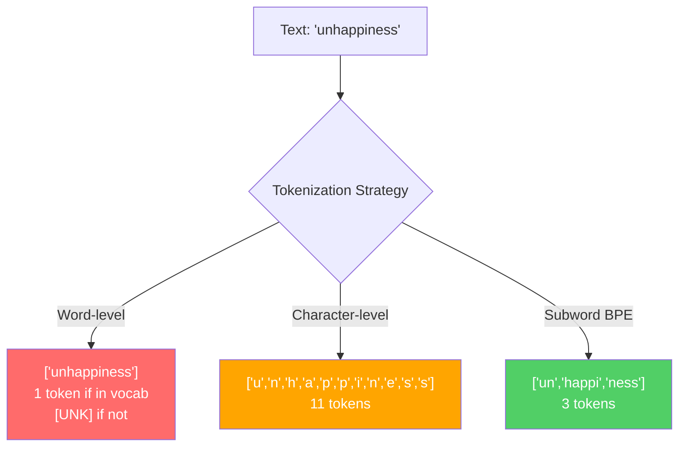
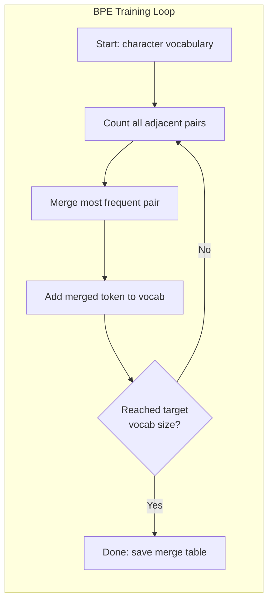
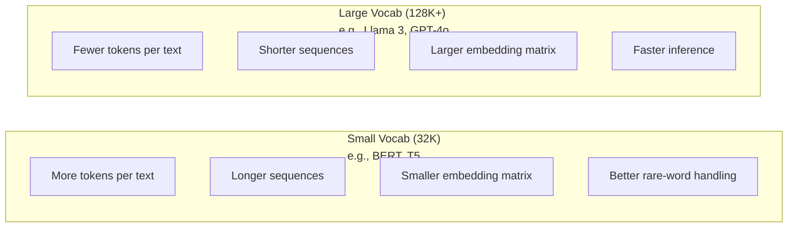

# Tokenizatory: BPE, WordPiece, SentencePiece

> Twój LLM nie czyta po angielsku. Odczytuje liczby całkowite. Tokenizator decyduje, czy te liczby całkowite mają znaczenie, czy je marnują.

**Typ:** Kompilacja
**Języki:** Python
**Wymagania wstępne:** Faza 05 (Podstawy NLP)
**Czas:** ~90 minut

## Cele nauczania

- Wdrażaj od podstaw algorytmy tokenizacji BPE, WordPiece i Unigram i porównuj ich strategie łączenia
- Wyjaśnij, jak rozmiar słownictwa wpływa na efektywność modelu: zbyt mały tworzy długie sekwencje, zbyt duży marnuje parametry osadzania
- Analizuj artefakty tokenizacji w różnych językach i kodzie, identyfikując miejsca awarii określonych tokenizatorów
- Użyj bibliotek tiktoken i zdań, aby tokenizować tekst i sprawdzać powstałe identyfikatory tokenów

## Problem

Twój LLM nie czyta po angielsku. Nie czyta żadnego języka. Czyta liczby.

Przerwa pomiędzy słowami „Witaj, świecie!” a [15496, 11, 995, 0] to tokenizator. Każde słowo, każda spacja i każdy znak interpunkcyjny muszą zostać przekonwertowane na liczbę całkowitą, zanim model będzie mógł je przetworzyć. Ta konwersja nie jest neutralna. Wprowadza do modelu założenia, których nie można później cofnąć.

Zrób to źle, a Twój model marnuje pojemność na kodowanie typowych słów za pomocą wielu tokenów. „niestety” staje się czterema tokenami zamiast jednego. Twoje okno kontekstowe o wielkości 128 KB właśnie skurczyło się o 75% w przypadku tekstu zawierającego dużo słów wielosylabowych. Zrób to dobrze, a to samo okno kontekstowe będzie miało dwa razy większe znaczenie. Różnica między „ten model dobrze obsługuje kod” a „ten model dławi się w Pythonie” często sprowadza się do sposobu wyszkolenia tokenizatora.

Każde wywołanie API do GPT-4 lub Claude jest wyceniane za token. Każdy token Twojego modelu generuje koszty obliczeniowe. Im mniej tokenów wymaganych do reprezentowania wyniku, tym szybsze wnioskowanie od końca do końca. Tokenizacja nie jest przetwarzaniem wstępnym. To jest architektura.

## Koncepcja

### Trzy podejścia, które się nie powiodły (i jedno, które zwyciężyło)

Istnieją trzy oczywiste sposoby konwersji tekstu na liczby. Dwa z nich nie działają na dużą skalę.

**Tokenizacja na poziomie słowa** dzieli się na spacje i znaki interpunkcyjne. „Kot usiadł” staje się [„The”, „kot”, „sat”]. Prosty. Ale co z „tokenizacją”? Lub „GPT-4o”? Albo niemieckie słowo złożone, takie jak „Geschwindigkeitsbegrenzung”? Poziom słów wymaga ogromnego słownictwa, aby objąć każde słowo w każdym języku. Jeśli przegapisz słowo, otrzymasz budzący grozę token `[UNK]` — sposób, w jaki modelka mówi „Nie mam pojęcia, co to jest”. Sam angielski ma ponad milion form wyrazów. Dodaj kod, adresy URL, notację naukową i 100 innych języków, a będziesz potrzebować nieskończonego słownictwa.

**Tokenizacja na poziomie postaci** idzie w innym kierunku. „cześć” zmienia się na [„h”, „e”, „l”, „l”, „o”]. Słownictwo jest niewielkie (kilkaset znaków). Żadnych nieznanych tokenów nigdy. Ale sekwencje stają się niezwykle długie. Zdanie składające się z 10 żetonów na poziomie słowa staje się 50 żetonami na poziomie postaci. Model musi się nauczyć, że „t”, „h”, „e” łącznie oznaczają „the” – palącą zdolność uwagi na czymś, czego człowiek uczy się w wieku trzech lat.

**Tokenizacja podsłów** znajduje idealny punkt. Powszechnie używane słowa pozostają całe: „the” to jeden symbol. Rzadkie słowa rozkładają się na znaczące kawałki: „nieszczęście” staje się [„un”, „happi”, „ness”]. Słownictwo pozostaje łatwe w zarządzaniu (30 000 do 128 000 tokenów). Sekwencje pozostają krótkie. Nieznane tokeny w zasadzie znikają, ponieważ z fragmentów podsłów można zbudować dowolne słowo.

Każdy nowoczesny LLM wykorzystuje tokenizację podsłów. GPT-2, GPT-4, BERT, Lama 3, Claude – wszystkie. Pytanie brzmi, który algorytm.



### BPE: Kodowanie par bajtów

BPE to algorytm zachłannej kompresji przystosowany do tokenizacji. Pomysł jest na tyle prosty, że zmieści się na karcie katalogowej.

Zacznij od pojedynczych znaków. Policz każdą sąsiadującą parę w korpusie treningowym. Połącz najczęstszą parę w nowy token. Powtarzaj, aż osiągniesz docelowy rozmiar słownictwa.

Oto BPE działające w maleńkim korpusie ze słowami „niższy”, „najniższy” i „najnowszy”:

```
Corpus (with word frequencies):
  "lower"  x5
  "lowest" x2
  "newest" x6

Step 0 -- Start with characters:
  l o w e r       (x5)
  l o w e s t     (x2)
  n e w e s t     (x6)

Step 1 -- Count adjacent pairs:
  (e,s): 8    (s,t): 8    (l,o): 7    (o,w): 7
  (w,e): 13   (e,r): 5    (n,e): 6    ...

Step 2 -- Merge most frequent pair (w,e) -> "we":
  l o we r        (x5)
  l o we s t      (x2)
  n e we s t      (x6)

Step 3 -- Recount and merge (e,s) -> "es":
  l o we r        (x5)
  l o we s t      (x2)    <- 'es' only forms from 'e'+'s', not 'we'+'s'
  n e we s t      (x6)    <- wait, the 'e' before 'we' and 's' after 'we'

Actually tracking this precisely:
  After "we" merge, remaining pairs:
  (l,o): 7   (o,we): 7   (we,r): 5   (we,s): 8
  (s,t): 8   (n,e): 6    (e,we): 6

Step 3 -- Merge (we,s) -> "wes" or (s,t) -> "st" (tied at 8, pick first):
  Merge (we,s) -> "wes":
  l o we r        (x5)
  l o wes t       (x2)
  n e wes t       (x6)

Step 4 -- Merge (wes,t) -> "west":
  l o we r        (x5)
  l o west        (x2)
  n e west        (x6)

...continue until target vocab size reached.
```

Tabela scalania jest tokenizerem. Aby zakodować nowy tekst, zastosuj scalanie w kolejności, w jakiej się go nauczyłeś. Korpus szkoleniowy określa, które połączenia istnieją, a wybór ten trwale kształtuje to, co widzi model.



### BPE na poziomie bajtów (GPT-2, GPT-3, GPT-4)

Standard BPE działa na znakach Unicode. BPE na poziomie bajtów działa na surowych bajtach (0-255). Daje to podstawowe słownictwo dokładnie 256, obsługuje dowolny język lub kodowanie i nigdy nie generuje nieznanego tokena.

GPT-2 wprowadził to podejście. Podstawowe słownictwo obejmuje każdy możliwy bajt. Na tym opierają się fuzje BPE. Biblioteka tiktoken OpenAI implementuje BPE na poziomie bajtów z następującymi rozmiarami słownictwa:

- GPT-2: 50 257 tokenów
- GPT-3.5/GPT-4: ~100 256 tokenów (kodowanie cl100k_base)
- GPT-4o: 200 019 tokenów (kodowanie o200k_base)

### Kawałek słowa (BERT)

WordPiece wygląda podobnie do BPE, ale typy łączą się inaczej. Zamiast surowej częstotliwości maksymalizuje prawdopodobieństwo danych szkoleniowych:

```
BPE merge criterion:      count(A, B)
WordPiece merge criterion: count(AB) / (count(A) * count(B))
```

BPE pyta: „Jaka para pojawia się najczęściej?” WordPiece pyta: „Która para pojawia się razem częściej, niż można by się tego spodziewać przez przypadek?” Ta subtelna różnica tworzy różne słowniki. WordPiece preferuje łączenia, w których współwystępowanie jest zaskakujące, a nie tylko częste.

WordPiece używa również przedrostka „##” dla słów podrzędnych kontynuacji:

```
"unhappiness" -> ["un", "##happi", "##ness"]
"embedding"   -> ["em", "##bed", "##ding"]
```

Przedrostek „##” informuje, że ten element stanowi kontynuację poprzedniego tokenu. BERT używa WordPiece'a ze słownictwem składającym się z 30 522 tokenów. Każdy wariant BERT - DistilBERT, tokenizer RoBERTa to tak naprawdę BPE, ale sam BERT to WordPiece.

### Fragment zdania (Lama, T5)

SentencePiece traktuje dane wejściowe jako surowy strumień znaków Unicode, łącznie z białymi znakami. Brak etapu poprzedzającego tokenizację. Brak specyficznych dla języka reguł dotyczących granic słów. To sprawia, że ​​jest naprawdę niezależny od języka — działa w językach chińskim, japońskim, tajskim i innych, w których spacje nie oddzielają słów.

ZdaniePiece obsługuje dwa algorytmy:
- **Tryb BPE**: ta sama logika scalania co standardowe BPE, zastosowana do surowych sekwencji znaków
- **Tryb Unigram**: zaczyna się od dużego słownictwa i iteracyjnie usuwa żetony, które w najmniejszym stopniu wpływają na ogólne prawdopodobieństwo. Odwrotność BPE – przycinaj zamiast łączyć.

Llama 2 wykorzystuje SentencePiece BPE ze słownictwem złożonym z 32 000 tokenów. T5 używa SentencePiece Unigram z 32 000 tokenów. Uwaga: Lama 3 została przełączona na tokenizator BPE oparty na tiktokenie na poziomie bajtów i zawierający 128 256 tokenów.

### Kompromisy dotyczące rozmiaru słownictwa

To prawdziwa decyzja inżynierska z wymiernymi konsekwencjami.



Konkretne liczby. W przypadku słownika o wielkości 128 tys. z 4096-wymiarowymi osadzaniami sama macierz osadzania ma 128 000 x 4096 = 524 miliony parametrów. Dla 32 tys. słownika jest to 131 milionów parametrów. Jest to różnica parametrów wynosząca 400M w porównaniu z samym wyborem tokenizatora.

Jednak większe słowniki kompresują tekst bardziej agresywnie. Ten sam akapit w języku angielskim, który zajmuje 100 tokenów przy słownictwie 32 tys., może zająć 70 tokenów przy słownictwie 128 tys. Oznacza to o 30% mniej przejść do przodu podczas generowania. W przypadku modelu obsługującego miliony żądań jest to bezpośrednie zmniejszenie kosztów obliczeniowych.

Tendencja jest jasna: rozmiary słownictwa rosną. GPT-2 wykorzystał 50257. GPT-4 zużywa ~ 100 KB. Lama 3 zużywa 128 tys. GPT-4o zużywa 200 tys.

| Modelka | Rozmiar słownictwa | Typ tokenizera | Średnie tokeny na angielskie słowo |
|-------|------|----------------|-------------------------|
| BERT | 30522 | Słowo | ~1,4 |
| GPT-2 | 50257 | BPE na poziomie bajtu | ~1,3 |
| Lama 2 | 32 000 | Fragment zdania BPE | ~1,4 |
| GPT-4 | ~100256 | BPE na poziomie bajtu | ~1,2 |
| Lama 3 | 128256 | BPE na poziomie bajtu (tiktoken) | ~1,1 |
| GPT-4o | 200 019 | BPE na poziomie bajtu | ~1,0 |

### Podatek wielojęzyczny

Tokenizatorzy wyszkoleni głównie w języku angielskim są brutalni w stosunku do innych języków. Tekst koreański w tokenizerze GPT-2 ma średnio 2-3 tokeny na słowo. Chińczycy mogą być gorsi. Oznacza to, że użytkownik koreański ma w rzeczywistości okno kontekstowe o połowę mniejsze niż użytkownik angielski, płacąc tę ​​samą cenę za mniejszą gęstość informacji.

Dlatego właśnie Lama 3 czterokrotnie zwiększyła swoje słownictwo z 32 tys. do 128 tys. Więcej tokenów przeznaczonych dla skryptów innych niż angielski oznacza bardziej sprawiedliwą kompresję w różnych językach.

## Zbuduj to

### Krok 1: Tokenizator na poziomie postaci

Zacznij od fundamentu. Tokenizator na poziomie znaku odwzorowuje każdy znak na jego punkt kodowy Unicode. Nie potrzeba żadnego szkolenia. Brak nieznanych tokenów. Po prostu bezpośrednie mapowanie.

```python
class CharTokenizer:
    def encode(self, text):
        return [ord(c) for c in text]

    def decode(self, tokens):
        return "".join(chr(t) for t in tokens)
```

„cześć” zmienia się na [104, 101, 108, 108, 111]. Każda postać jest swoim własnym znacznikiem. To jest podstawa, którą możemy ulepszyć.

### Krok 2: Tokenizator BPE od podstaw

Prawdziwa realizacja. Trenujemy na surowych bajtach (takich jak GPT-2), liczymy pary, łączymy najczęściej i rejestrujemy każde połączenie w odpowiedniej kolejności. Tabela scalania jest tokenizerem.

```python
from collections import Counter

class BPETokenizer:
    def __init__(self):
        self.merges = {}
        self.vocab = {}

    def _get_pairs(self, tokens):
        pairs = Counter()
        for i in range(len(tokens) - 1):
            pairs[(tokens[i], tokens[i + 1])] += 1
        return pairs

    def _merge_pair(self, tokens, pair, new_token):
        merged = []
        i = 0
        while i < len(tokens):
            if i < len(tokens) - 1 and tokens[i] == pair[0] and tokens[i + 1] == pair[1]:
                merged.append(new_token)
                i += 2
            else:
                merged.append(tokens[i])
                i += 1
        return merged

    def train(self, text, num_merges):
        tokens = list(text.encode("utf-8"))
        self.vocab = {i: bytes([i]) for i in range(256)}

        for i in range(num_merges):
            pairs = self._get_pairs(tokens)
            if not pairs:
                break
            best_pair = max(pairs, key=pairs.get)
            new_token = 256 + i
            tokens = self._merge_pair(tokens, best_pair, new_token)
            self.merges[best_pair] = new_token
            self.vocab[new_token] = self.vocab[best_pair[0]] + self.vocab[best_pair[1]]

        return self

    def encode(self, text):
        tokens = list(text.encode("utf-8"))
        for pair, new_token in self.merges.items():
            tokens = self._merge_pair(tokens, pair, new_token)
        return tokens

    def decode(self, tokens):
        byte_sequence = b"".join(self.vocab[t] for t in tokens)
        return byte_sequence.decode("utf-8", errors="replace")
```

Pętla treningowa to rdzeń BPE: policz pary, połącz zwycięzcę, powtórz. Każde połączenie zmniejsza całkowitą liczbę tokenów. Po `num_merges` rundach słownictwo rośnie z 256 (bajty podstawowe) do 256 + num_merges.

Kodowanie stosuje łączenia w dokładnie takiej kolejności, w jakiej się nauczyli. To ma znaczenie. Jeśli połączenie 1 utworzyło „th” i połączenie 5 utworzyło „the”, kodowanie musi najpierw zastosować połączenie 1, aby „the” mogło utworzyć się z „th” + „e” w połączeniu 5.

Dekodowanie jest odwrotne: sprawdź każdy identyfikator tokena w słowniku, połącz bajty, zdekoduj do UTF-8.

### Krok 3: Zakoduj i zdekoduj podróż w obie strony

```python
corpus = (
    "The cat sat on the mat. The cat ate the rat. "
    "The dog sat on the log. The dog ate the frog. "
    "Natural language processing is the study of how computers "
    "understand and generate human language. "
    "Tokenization is the first step in any NLP pipeline."
)

tokenizer = BPETokenizer()
tokenizer.train(corpus, num_merges=40)

test_sentences = [
    "The cat sat on the mat.",
    "Natural language processing",
    "tokenization pipeline",
    "unhappiness",
]

for sentence in test_sentences:
    encoded = tokenizer.encode(sentence)
    decoded = tokenizer.decode(encoded)
    raw_bytes = len(sentence.encode("utf-8"))
    ratio = len(encoded) / raw_bytes
    print(f"'{sentence}'")
    print(f"  Tokens: {len(encoded)} (from {raw_bytes} bytes) -- ratio: {ratio:.2f}")
    print(f"  Roundtrip: {'PASS' if decoded == sentence else 'FAIL'}")
```

Współczynnik kompresji mówi, jak skuteczny jest tokenizer. Współczynnik 0,50 oznacza, że ​​tokenizator skompresował tekst do połowy liczby tokenów w liczbie nieprzetworzonych bajtów. Niżej jest lepiej. W korpusie treningowym stosunek będzie dobry. W przypadku tekstów spoza dystrybucji, takich jak „nieszczęście” (który nie pojawia się w korpusie), stosunek będzie gorszy — tokenizator powróci do kodowania na poziomie znaku dla niewidocznych wzorców.

### Krok 4: Porównaj z tiktokenem

```python
import tiktoken

enc = tiktoken.get_encoding("cl100k_base")

texts = [
    "The cat sat on the mat.",
    "unhappiness",
    "Hello, world!",
    "def fibonacci(n): return n if n < 2 else fibonacci(n-1) + fibonacci(n-2)",
    "Geschwindigkeitsbegrenzung",
]

for text in texts:
    our_tokens = tokenizer.encode(text)
    tiktoken_tokens = enc.encode(text)
    tiktoken_pieces = [enc.decode([t]) for t in tiktoken_tokens]
    print(f"'{text}'")
    print(f"  Our BPE:   {len(our_tokens)} tokens")
    print(f"  tiktoken:  {len(tiktoken_tokens)} tokens -> {tiktoken_pieces}")
```

tiktoken używa dokładnie tego samego algorytmu, ale jest trenowany na setkach gigabajtów tekstu i 100 000 połączeń. Algorytm jest identyczny. Różnica polega na danych szkoleniowych i liczbie połączeń. Twój tokenizer wyszkolony na akapicie z 40 połączeniami nie może konkurować z połączeniami 100 000 tiktokena w ogromnym korpusie. Ale mechanizm jest ten sam.

### Krok 5: Analiza słownictwa

```python
def analyze_vocabulary(tokenizer, test_texts):
    total_tokens = 0
    total_chars = 0
    token_usage = Counter()

    for text in test_texts:
        encoded = tokenizer.encode(text)
        total_tokens += len(encoded)
        total_chars += len(text)
        for t in encoded:
            token_usage[t] += 1

    print(f"Vocabulary size: {len(tokenizer.vocab)}")
    print(f"Total tokens across all texts: {total_tokens}")
    print(f"Total characters: {total_chars}")
    print(f"Avg tokens per character: {total_tokens / total_chars:.2f}")

    print(f"\nMost used tokens:")
    for token_id, count in token_usage.most_common(10):
        token_bytes = tokenizer.vocab[token_id]
        display = token_bytes.decode("utf-8", errors="replace")
        print(f"  Token {token_id:4d}: '{display}' (used {count} times)")

    unused = [t for t in tokenizer.vocab if t not in token_usage]
    print(f"\nUnused tokens: {len(unused)} out of {len(tokenizer.vocab)}")
```

To ujawnia rozkład Zipfa w Twoim słownictwie. Dominuje kilka żetonów (spacje, „the”, „e”). Większość tokenów jest rzadko używana. Tokenizatory produkcyjne optymalizują tę dystrybucję — typowe wzorce uzyskują krótkie identyfikatory tokenów, rzadkie wzorce — dłuższe reprezentacje.

## Użyj tego

Twój zdrapkowy BPE działa. Zobacz teraz jak wyglądają narzędzia produkcyjne.

### tiktoken (OpenAI)

```python
import tiktoken

enc = tiktoken.get_encoding("cl100k_base")

text = "Tokenizers convert text to integers"
tokens = enc.encode(text)
print(f"Tokens: {tokens}")
print(f"Pieces: {[enc.decode([t]) for t in tokens]}")
print(f"Roundtrip: {enc.decode(tokens)}")
```

tiktoken jest napisany w języku Rust z powiązaniami w Pythonie. Koduje miliony tokenów na sekundę. Ten sam algorytm BPE, implementacja o wytrzymałości przemysłowej.

### Tokenizatory Przytulonej Twarzy

```python
from tokenizers import Tokenizer
from tokenizers.models import BPE
from tokenizers.trainers import BpeTrainer
from tokenizers.pre_tokenizers import ByteLevel

tokenizer = Tokenizer(BPE())
tokenizer.pre_tokenizer = ByteLevel()

trainer = BpeTrainer(vocab_size=1000, special_tokens=["<pad>", "<eos>", "<unk>"])
tokenizer.train(["corpus.txt"], trainer)

output = tokenizer.encode("The cat sat on the mat.")
print(f"Tokens: {output.tokens}")
print(f"IDs: {output.ids}")
```

Biblioteka tokenizatorów Hugging Face to także Rust pod maską. Uczy BPE na korpusach w skali gigabajtów w ciągu kilku sekund. Tego właśnie używasz podczas trenowania własnego modelu.

### Ładowanie tokenizera Lamy

```python
from transformers import AutoTokenizer

tokenizer = AutoTokenizer.from_pretrained("meta-llama/Llama-3.1-8B")

text = "Tokenizers are the unsung heroes of LLMs"
tokens = tokenizer.encode(text)
print(f"Token IDs: {tokens}")
print(f"Tokens: {tokenizer.convert_ids_to_tokens(tokens)}")
print(f"Vocab size: {tokenizer.vocab_size}")

multilingual = ["Hello world", "Hola mundo", "Bonjour le monde"]
for text in multilingual:
    ids = tokenizer.encode(text)
    print(f"'{text}' -> {len(ids)} tokens")
```

Słownictwo Lamy 3 o pojemności 128 tys. kompresuje tekst w języku innym niż angielski znacznie lepiej niż słownictwo GPT-2 o objętości 50 tys. Możesz to sprawdzić samodzielnie — zakoduj to samo zdanie w wielu językach i zlicz tokeny.

## Wyślij to

W ramach tej lekcji zostanie utworzony `outputs/prompt-tokenizer-analyzer.md` — monit wielokrotnego użytku, który analizuje wydajność tokenizacji dla dowolnej kombinacji tekstu i modelu. Podaj mu próbkę tekstu, a powie Ci, który tokenizer modelu radzi sobie z tym najlepiej.

## Ćwiczenia

1. Zmodyfikuj tokenizer BPE, aby drukował słownictwo na każdym etapie scalania. Zobacz, jak „t” + „h” staje się „th”, a następnie „th” + „e” staje się „the”. Śledź, jak popularne angielskie słowa są składane kawałek po kawałku.

2. Dodaj specjalne tokeny (`<pad>`, `<eos>`, `<unk>`) do tokenizera BPE. Przypisz im identyfikatory 0, 1, 2 i odpowiednio przesuń wszystkie pozostałe żetony. Zaimplementuj krok poprzedzający tokenizację, który dzieli białe znaki przed uruchomieniem BPE.

3. Zastosuj kryterium scalania WordPiece (współczynnik wiarygodności zamiast częstotliwości). Trenuj zarówno BPE, jak i WordPiece w tym samym korpusie z tą samą liczbą połączeń. Porównaj powstałe słowniki — który z nich tworzy podsłowa o większym znaczeniu językowym?

4. Zbuduj wielojęzyczny benchmark wydajności tokenizera. Ułóż 10 zdań po angielsku, hiszpańsku, chińsku, koreańsku i arabsku. Tokenizuj każdy za pomocą tiktokenu (cl100k_base) i zmierz średnie tokeny na znak. Określ ilościowo „podatek wielojęzyczny” dla każdego języka.

5. Wytrenuj swój tokenizer BPE na większym korpusie (pobierz artykuł z Wikipedii). Dostosuj liczbę połączeń, aby osiągnąć współczynnik kompresji w granicach 10% tiktokena w tym samym tekście. Zmusza to do zrozumienia związku pomiędzy rozmiarem korpusu, liczbą scalanych plików i jakością kompresji.

## Kluczowe terminy

| Termin | Co ludzie mówią | Co to właściwie oznacza |
|------|----------------|----------------------|
| Znak | „Słowo” | Jednostką w słowniku modelu może być znak, podsłowo, słowo lub fragment składający się z wielu słów |
| BPE | „Jakaś kwestia kompresji” | Kodowanie par bajtów — iteracyjnie łącz najczęściej sąsiadującą parę tokenów, aż do osiągnięcia docelowego rozmiaru słownictwa |
| Słowo | „Tokenizer BERT” | Podobnie jak BPE, ale łączy maksymalizuje współczynnik wiarygodności liczba (AB)/(liczba (A) * liczba (B)) zamiast surowej częstotliwości |
| Fragment zdania | „Biblioteka tokenizera” | Tokenizator niezależny od języka, działający na surowym Unicode bez wstępnej tokenizacji, obsługujący algorytmy BPE i Unigram |
| Rozmiar słownictwa | „Ile słów zna” | Całkowita liczba unikalnych tokenów: GPT-2 ma 50 257, BERT ma 30 522, Lama 3 ma 128 256 |
| Płodność | „Termin nie tokenizujący” | Średnia liczba tokenów na słowo — mierzy wydajność tokenizatora w różnych językach (1,0 jest idealne, 3,0 oznacza, że ​​model działa trzy razy ciężej) |
| BPE na poziomie bajtu | „Tokenizer GPT” | BPE działający na nieprzetworzonych bajtach (0-255) zamiast znaków Unicode, gwarantujący brak nieznanych tokenów na wejściu |
| Połącz tabelę | „Plik tokenizera” | Uporządkowana lista połączeń par wyuczona podczas szkolenia – to jest tokenizator, a kolejność ma znaczenie |
| Wstępna tokenizacja | „Podział na spacje” | Reguły stosowane przed tokenizacją podsłów: dzielenie białych znaków, separacja cyfr, obsługa interpunkcji |
| Współczynnik kompresji | „Jak wydajny jest tokenizer” | Wytworzone tokeny podzielone przez bajty wejściowe — niższa oznacza lepszą kompresję i szybsze wnioskowanie |

## Dalsze czytanie

– [Sennrich i in., 2016 – „Neural Machine Translation of Rare Words with Subword Units”](https://arxiv.org/abs/1508.07909) – artykuł, w którym wprowadzono BPE do NLP, zmieniając algorytm kompresji z 1994 r. w podstawę współczesnej tokenizacji
– [Kudo i Richardson, 2018 – „SentencePiece: prosty i niezależny od języka tokenizator podsłów”](https://arxiv.org/abs/1808.06226) – tokenizacja niezależna od języka, dzięki której modele wielojęzyczne stały się praktyczne
- [Repozytorium tiktoken OpenAI](https://github.com/openai/tiktoken) -- produkcyjna implementacja BPE w Rust z wiązaniami Pythona, używana przez GPT-3.5/4/4o
— [Dokumentacja Hugging Face Tokenizers](https://huggingface.co/docs/tokenizers) — szkolenie w zakresie tokenizatora klasy produkcyjnej z wydajnością Rust