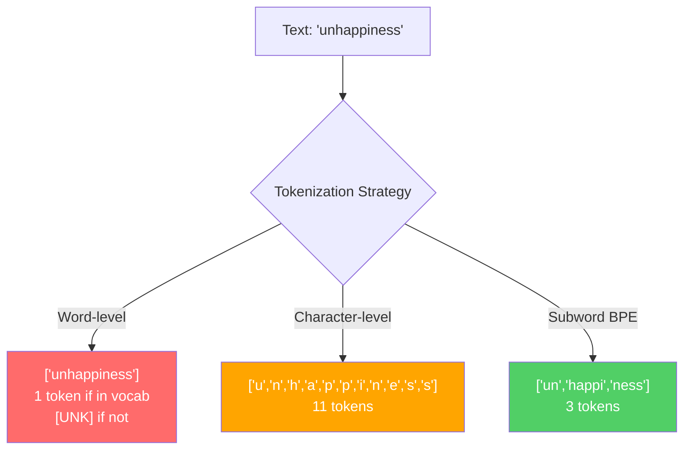
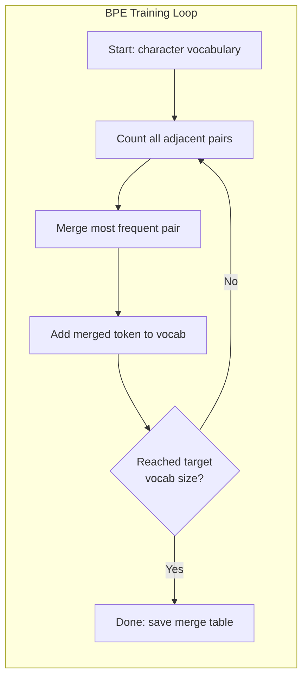
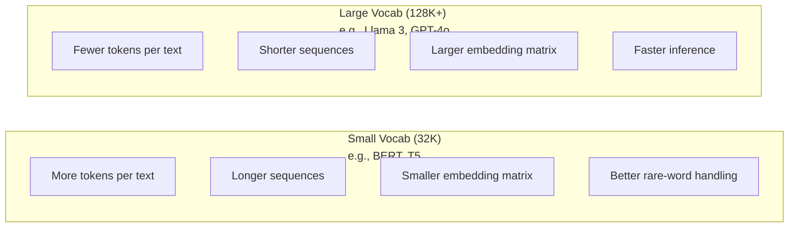

# Tokenizatory: BPE, WordPiece, SentencePiece

> Twój LLM nie czyta po angielsku. Odczytuje liczby całkowite. Tokenizator decyduje, czy te liczby niosą znaczenie, czy je marnują.

**Typ:** Kompilacja
**Języki:** Python
**Wymagania wstępne:** Faza 05 (Podstawy NLP)
**Czas:** ~90 minut

## Cele nauczania

- Zaimplementuj od podstaw algorytmy tokenizacji BPE, WordPiece i Unigram, a następnie porównaj ich strategie łączenia.
- Wyjaśnij, jak rozmiar słownika wpływa na efektywność modelu: zbyt mały powoduje długie sekwencje, zbyt duży marnuje parametry osadzania.
- Przeanalizuj artefakty tokenizacji w różnych językach i kodzie, wskazując miejsca, w których konkretne tokenizatory zawodzą.
- Użyj bibliotek tiktoken i SentencePiece, aby tokenizować tekst i sprawdzać identyfikatory powstałych tokenów.

## Problem

Twój LLM nie czyta po angielsku. Nie czyta żadnego języka. Przetwarza liczby.

Przepaść między słowami „Witaj, świecie!" a sekwencją [15496, 11, 995, 0] wypełnia tokenizator. Każde słowo, każda spacja i każdy znak interpunkcyjny muszą zostać przekształcone w liczbę całkowitą, zanim model będzie mógł je przetworzyć. Ta konwersja nie jest neutralna — wprowadza do modelu założenia, których nie można później cofnąć.

Jeśli zostanie wykonana źle, model marnuje pojemność na kodowanie pospolitych słów przy użyciu wielu tokenów. Słowo „niestety" staje się czterema tokenami zamiast jednego. Okno kontekstowe o rozmiarze 128 tys. tokenów kurczy się o 75% w przypadku tekstów bogatych w wyrazy wielosylabowe. Jeśli zostanie wykonana dobrze, to samo okno kontekstowe mieści dwa razy więcej treści. Różnica między „ten model dobrze radzi sobie z kodem" a „ten model nie daje sobie rady z Pythonem" często sprowadza się do sposobu, w jaki wytrenowano tokenizator.

Każde wywołanie API do GPT-4 lub Claude jest rozliczane per token. Każdy token generuje koszty obliczeniowe. Im mniej tokenów potrzeba do reprezentowania wyniku, tym szybsze przetwarzanie od końca do końca. Tokenizacja to nie etap wstępnego przetwarzania — to decyzja architektoniczna.

## Koncepcja

### Trzy podejścia, które zawiodły (i jedno, które zwyciężyło)

Istnieją trzy oczywiste sposoby zamiany tekstu na liczby. Dwa z nich nie sprawdzają się na dużą skalę.

**Tokenizacja na poziomie słów** polega na podziale tekstu według spacji i znaków interpunkcyjnych. „Kot usiadł" staje się `["The", "cat", "sat"]`. Proste. Ale co z wyrazem „tokenizacja"? Albo „GPT-4o"? A może niemieckim złożeniem „Geschwindigkeitsbegrenzung"? Podejście słowne wymaga ogromnego słownika, by objąć wszystkie formy wyrazów we wszystkich językach. Gdy trafimy na nieznane słowo, model zwraca token `[UNK]` — odpowiednik wzruszenia ramionami. Sam język angielski ma ponad milion form wyrazowych. Po dołączeniu kodu, adresów URL, notacji naukowej i stu innych języków słownik staje się praktycznie nieskończony.

**Tokenizacja na poziomie znaków** idzie w przeciwnym kierunku. „cześć" zamienia się na `["c", "z", "e", "ś", "ć"]`. Słownik jest niewielki (kilkaset znaków), a nieznane tokeny przestają istnieć. Za to sekwencje robią się bardzo długie. Zdanie złożone z 10 tokenów słownych rozrasta się do 50 tokenów znakowych. Model musi się nauczyć, że litery „t", „h", „e" razem oznaczają „the" — i zużywa na to uwagę, którą człowiek ćwiczy w wieku trzech lat.

**Tokenizacja podwyrazowa** trafia w złoty środek. Popularne słowa pozostają nienaruszone: „the" to jeden token. Rzadkie słowa rozkładają się na znaczące fragmenty: „unhappiness" staje się `["un", "happi", "ness"]`. Słownik pozostaje zarządzalny (30 000–128 000 tokenów), sekwencje są krótkie, a nieznane tokeny praktycznie znikają — z fragmentów podwyrazowych można złożyć niemal dowolne słowo.

Każdy nowoczesny LLM używa tokenizacji podwyrazowej: GPT-2, GPT-4, BERT, Llama 3, Claude — wszystkie. Różnią się jedynie wyborem algorytmu.



### BPE: Kodowanie par bajtów

BPE to zachłanny algorytm kompresji zaadaptowany do tokenizacji. Jego zasada jest na tyle prosta, że zmieści się na kartce.

Zacznij od pojedynczych znaków. Zlicz wszystkie sąsiadujące pary w korpusie treningowym. Połącz najczęściej występującą parę w nowy token. Powtarzaj, aż osiągniesz docelowy rozmiar słownika.

Oto BPE w działaniu na małym korpusie ze słowami „lower", „lowest" i „newest":

```
Corpus (with word frequencies):
  "lower"  x5
  "lowest" x2
  "newest" x6

Step 0 -- Start with characters:
  l o w e r       (x5)
  l o w e s t     (x2)
  n e w e s t     (x6)

Step 1 -- Count adjacent pairs:
  (e,s): 8    (s,t): 8    (l,o): 7    (o,w): 7
  (w,e): 13   (e,r): 5    (n,e): 6    ...

Step 2 -- Merge most frequent pair (w,e) -> "we":
  l o we r        (x5)
  l o we s t      (x2)
  n e we s t      (x6)

Step 3 -- Recount and merge (e,s) -> "es":
  l o we r        (x5)
  l o we s t      (x2)    <- 'es' only forms from 'e'+'s', not 'we'+'s'
  n e we s t      (x6)    <- wait, the 'e' before 'we' and 's' after 'we'

Actually tracking this precisely:
  After "we" merge, remaining pairs:
  (l,o): 7   (o,we): 7   (we,r): 5   (we,s): 8
  (s,t): 8   (n,e): 6    (e,we): 6

Step 3 -- Merge (we,s) -> "wes" or (s,t) -> "st" (tied at 8, pick first):
  Merge (we,s) -> "wes":
  l o we r        (x5)
  l o wes t       (x2)
  n e wes t       (x6)

Step 4 -- Merge (wes,t) -> "west":
  l o we r        (x5)
  l o west        (x2)
  n e west        (x6)

...continue until target vocab size reached.
```

Tabela scalań jest tokenizatorem. Aby zakodować nowy tekst, stosujemy scalenia w kolejności, w jakiej zostały wyuczone. Korpus treningowy określa, jakie połączenia istnieją — i ten wybór na trwałe kształtuje to, co widzi model.



### BPE na poziomie bajtów (GPT-2, GPT-3, GPT-4)

Standardowe BPE operuje na znakach Unicode. BPE na poziomie bajtów operuje na surowych bajtach (0–255). Daje to bazowy słownik dokładnie 256 elementów, obsługuje dowolny język i kodowanie, a nieznane tokeny nie mogą w nim wystąpić.

GPT-2 jako pierwszy zastosował to podejście. Baza słownika obejmuje każdy możliwy bajt, a scalenia BPE budują się na tej podstawie. Biblioteka tiktoken firmy OpenAI implementuje BPE na poziomie bajtów z następującymi rozmiarami słowników:

- GPT-2: 50 257 tokenów
- GPT-3.5/GPT-4: ~100 256 tokenów (kodowanie cl100k_base)
- GPT-4o: 200 019 tokenów (kodowanie o200k_base)

### WordPiece (BERT)

WordPiece wygląda podobnie do BPE, lecz scalenia wybierane są inaczej. Zamiast surowej częstości algorytm maksymalizuje prawdopodobieństwo danych treningowych:

```
BPE merge criterion:      count(A, B)
WordPiece merge criterion: count(AB) / (count(A) * count(B))
```

BPE pyta: „Która para pojawia się najczęściej?" WordPiece pyta: „Która para pojawia się razem częściej, niż można by oczekiwać przez przypadek?" Ta subtelna różnica prowadzi do odmiennych słowników. WordPiece preferuje połączenia, w których współwystępowanie jest zaskakujące, a nie tylko częste.

WordPiece używa też przedrostka `##` dla tokenów kontynuacyjnych:

```
"unhappiness" -> ["un", "##happi", "##ness"]
"embedding"   -> ["em", "##bed", "##ding"]
```

Przedrostek `##` sygnalizuje, że dany fragment jest kontynuacją poprzedniego tokenu. BERT używa WordPiece ze słownikiem 30 522 tokenów. Warianty takie jak DistilBERT zachowują ten tokenizator, natomiast RoBERTa korzysta z BPE — sam BERT jednak opiera się na WordPiece.

### SentencePiece (Llama, T5)

SentencePiece traktuje dane wejściowe jako surowy strumień znaków Unicode, włącznie ze spacjami. Nie ma etapu wstępnej tokenizacji ani reguł właściwych dla konkretnego języka. Dzięki temu działa naprawdę niezależnie od języka — sprawdza się w chińskim, japońskim, tajskim i innych językach, w których spacje nie wyznaczają granic słów.

SentencePiece obsługuje dwa algorytmy:
- **Tryb BPE**: ta sama logika scalania co standardowe BPE, zastosowana do surowych sekwencji znaków.
- **Tryb Unigram**: zaczyna od dużego słownika i iteracyjnie usuwa tokeny, które w najmniejszym stopniu wpływają na ogólne prawdopodobieństwo. To odwrotność BPE — zamiast łączyć, przycinamy.

Llama 2 używa SentencePiece BPE ze słownikiem 32 000 tokenów. T5 używa SentencePiece Unigram z 32 000 tokenami. Warto odnotować, że Llama 3 przeszła na tokenizator BPE na poziomie bajtów oparty na tiktoken, z 128 256 tokenami.

### Kompromisy dotyczące rozmiaru słownika

To realna decyzja inżynierska z wymiernymi konsekwencjami.



Konkretne liczby: przy słowniku 128 tys. i osadzaniach 4096-wymiarowych sama macierz osadzania ma 128 000 × 4096 = 524 miliony parametrów. Dla słownika 32 tys. jest to 131 milionów parametrów. Sam wybór tokenizatora przekłada się więc na różnicę rzędu 400 milionów parametrów.

Większe słowniki kompresują tekst agresywniej. Ten sam akapit po angielsku, który przy słowniku 32 tys. zajmuje 100 tokenów, przy słowniku 128 tys. może zająć 70. Oznacza to o 30% mniej operacji podczas generowania. Dla modelu obsługującego miliony zapytań to bezpośrednia redukcja kosztów obliczeniowych.

Tendencja jest wyraźna: rozmiary słowników rosną. GPT-2 miał 50 257 tokenów. GPT-4 ma ~100 tys. Llama 3 — 128 tys. GPT-4o — 200 tys.

| Model | Rozmiar słownika | Typ tokenizatora | Średnio tokenów na słowo angielskie |
|-------|------|----------------|-------------------------|
| BERT | 30 522 | WordPiece | ~1,4 |
| GPT-2 | 50 257 | BPE na poziomie bajtu | ~1,3 |
| Llama 2 | 32 000 | SentencePiece BPE | ~1,4 |
| GPT-4 | ~100 256 | BPE na poziomie bajtu | ~1,2 |
| Llama 3 | 128 256 | BPE na poziomie bajtu (tiktoken) | ~1,1 |
| GPT-4o | 200 019 | BPE na poziomie bajtu | ~1,0 |

### Podatek wielojęzyczny

Tokenizatory wytrenowane głównie na tekstach angielskich są bezlitosne dla innych języków. Tekst koreański w tokenizatorze GPT-2 daje średnio 2–3 tokeny na słowo. Chiński bywa jeszcze gorszy. Oznacza to, że użytkownik piszący po koreańsku ma w praktyce okno kontekstowe dwa razy mniejsze niż użytkownik anglojęzyczny — płacąc tę samą cenę za niższą gęstość informacji.

Właśnie dlatego Llama 3 czterokrotnie zwiększyła swój słownik: z 32 tys. do 128 tys. Więcej tokenów przypisanych do alfabetów innych niż łaciński przekłada się na bardziej sprawiedliwą kompresję w różnych językach.

## Zbuduj to

### Krok 1: Tokenizator na poziomie znaków

Zacznij od podstaw. Tokenizator znakowy odwzorowuje każdy znak na jego punkt kodowy Unicode. Nie wymaga treningu ani nie generuje nieznanych tokenów — to proste, bezpośrednie mapowanie.

```python
class CharTokenizer:
    def encode(self, text):
        return [ord(c) for c in text]

    def decode(self, tokens):
        return "".join(chr(t) for t in tokens)
```

„cześć" zamienia się na `[99, 122, 101, 347, 263]`. Każdy znak to osobny token. To punkt wyjścia, który możemy ulepszać.

### Krok 2: Tokenizator BPE od podstaw

Właściwa implementacja. Trenujemy na surowych bajtach (tak jak GPT-2), liczymy pary, łączymy najczęstszą i zapisujemy każde scalenie we właściwej kolejności. Tabela scalań jest tokenizatorem.

```python
from collections import Counter

class BPETokenizer:
    def __init__(self):
        self.merges = {}
        self.vocab = {}

    def _get_pairs(self, tokens):
        pairs = Counter()
        for i in range(len(tokens) - 1):
            pairs[(tokens[i], tokens[i + 1])] += 1
        return pairs

    def _merge_pair(self, tokens, pair, new_token):
        merged = []
        i = 0
        while i < len(tokens):
            if i < len(tokens) - 1 and tokens[i] == pair[0] and tokens[i + 1] == pair[1]:
                merged.append(new_token)
                i += 2
            else:
                merged.append(tokens[i])
                i += 1
        return merged

    def train(self, text, num_merges):
        tokens = list(text.encode("utf-8"))
        self.vocab = {i: bytes([i]) for i in range(256)}

        for i in range(num_merges):
            pairs = self._get_pairs(tokens)
            if not pairs:
                break
            best_pair = max(pairs, key=pairs.get)
            new_token = 256 + i
            tokens = self._merge_pair(tokens, best_pair, new_token)
            self.merges[best_pair] = new_token
            self.vocab[new_token] = self.vocab[best_pair[0]] + self.vocab[best_pair[1]]

        return self

    def encode(self, text):
        tokens = list(text.encode("utf-8"))
        for pair, new_token in self.merges.items():
            tokens = self._merge_pair(tokens, pair, new_token)
        return tokens

    def decode(self, tokens):
        byte_sequence = b"".join(self.vocab[t] for t in tokens)
        return byte_sequence.decode("utf-8", errors="replace")
```

Pętla treningowa to serce BPE: zlicz pary, połącz zwycięzcę, powtórz. Każde scalenie zmniejsza łączną liczbę tokenów. Po `num_merges` rundach słownik rośnie z 256 (bajty bazowe) do 256 + num_merges.

Kodowanie stosuje scalenia dokładnie w kolejności, w jakiej zostały wyuczone — kolejność ma znaczenie. Jeśli scalenie nr 1 utworzyło „th", a scalenie nr 5 — „the", to kodowanie musi najpierw zastosować scalenie nr 1, by „the" mogło powstać z „th" + „e" w scaleniu nr 5.

Dekodowanie przebiega odwrotnie: każdy identyfikator tokenu wyszukujemy w słowniku, łączymy bajty i dekodujemy do UTF-8.

### Krok 3: Kodowanie i dekodowanie — podróż w obie strony

```python
corpus = (
    "The cat sat on the mat. The cat ate the rat. "
    "The dog sat on the log. The dog ate the frog. "
    "Natural language processing is the study of how computers "
    "understand and generate human language. "
    "Tokenization is the first step in any NLP pipeline."
)

tokenizer = BPETokenizer()
tokenizer.train(corpus, num_merges=40)

test_sentences = [
    "The cat sat on the mat.",
    "Natural language processing",
    "tokenization pipeline",
    "unhappiness",
]

for sentence in test_sentences:
    encoded = tokenizer.encode(sentence)
    decoded = tokenizer.decode(encoded)
    raw_bytes = len(sentence.encode("utf-8"))
    ratio = len(encoded) / raw_bytes
    print(f"'{sentence}'")
    print(f"  Tokens: {len(encoded)} (from {raw_bytes} bytes) -- ratio: {ratio:.2f}")
    print(f"  Roundtrip: {'PASS' if decoded == sentence else 'FAIL'}")
```

Współczynnik kompresji pokazuje skuteczność tokenizatora. Wartość 0,50 oznacza, że tekst został skompresowany do połowy liczby surowych bajtów. Im niżej, tym lepiej. Na danych treningowych wskaźnik będzie wysoki. Na tekstach spoza rozkładu, takich jak „unhappiness" (nieobecne w korpusie), wynik będzie gorszy — tokenizator cofa się do kodowania znakowego dla nieznanych wzorców.

### Krok 4: Porównanie z tiktokenem

```python
import tiktoken

enc = tiktoken.get_encoding("cl100k_base")

texts = [
    "The cat sat on the mat.",
    "unhappiness",
    "Hello, world!",
    "def fibonacci(n): return n if n < 2 else fibonacci(n-1) + fibonacci(n-2)",
    "Geschwindigkeitsbegrenzung",
]

for text in texts:
    our_tokens = tokenizer.encode(text)
    tiktoken_tokens = enc.encode(text)
    tiktoken_pieces = [enc.decode([t]) for t in tiktoken_tokens]
    print(f"'{text}'")
    print(f"  Our BPE:   {len(our_tokens)} tokens")
    print(f"  tiktoken:  {len(tiktoken_tokens)} tokens -> {tiktoken_pieces}")
```

tiktoken używa dokładnie tego samego algorytmu, lecz wytrenowanego na setkach gigabajtów tekstu z 100 000 scaleń. Algorytm jest identyczny — różnica tkwi w danych treningowych i liczbie połączeń. Nasz tokenizator wytrenowany na jednym akapicie z zaledwie 40 scaleniami nie może konkurować z tiktokenem, ale mechanizm działania jest ten sam.

### Krok 5: Analiza słownika

```python
def analyze_vocabulary(tokenizer, test_texts):
    total_tokens = 0
    total_chars = 0
    token_usage = Counter()

    for text in test_texts:
        encoded = tokenizer.encode(text)
        total_tokens += len(encoded)
        total_chars += len(text)
        for t in encoded:
            token_usage[t] += 1

    print(f"Vocabulary size: {len(tokenizer.vocab)}")
    print(f"Total tokens across all texts: {total_tokens}")
    print(f"Total characters: {total_chars}")
    print(f"Avg tokens per character: {total_tokens / total_chars:.2f}")

    print(f"\nMost used tokens:")
    for token_id, count in token_usage.most_common(10):
        token_bytes = tokenizer.vocab[token_id]
        display = token_bytes.decode("utf-8", errors="replace")
        print(f"  Token {token_id:4d}: '{display}' (used {count} times)")

    unused = [t for t in tokenizer.vocab if t not in token_usage]
    print(f"\nUnused tokens: {len(unused)} out of {len(tokenizer.vocab)}")
```

Analiza ujawnia rozkład Zipfa w słowniku. Kilka tokenów dominuje (spacje, „the", „e"). Większość jest używana rzadko. Tokenizatory produkcyjne optymalizują ten rozkład — częste wzorce otrzymują krótkie identyfikatory, rzadkie — dłuższe reprezentacje.

## Użyj tego

Nasz uproszczony BPE działa. Pora zobaczyć, jak wyglądają narzędzia produkcyjne.

### tiktoken (OpenAI)

```python
import tiktoken

enc = tiktoken.get_encoding("cl100k_base")

text = "Tokenizers convert text to integers"
tokens = enc.encode(text)
print(f"Tokens: {tokens}")
print(f"Pieces: {[enc.decode([t]) for t in tokens]}")
print(f"Roundtrip: {enc.decode(tokens)}")
```

tiktoken jest napisany w Rust z interfejsem Pythona. Koduje miliony tokenów na sekundę. Ten sam algorytm BPE, implementacja o jakości produkcyjnej.

### Tokenizatory Hugging Face

```python
from tokenizers import Tokenizer
from tokenizers.models import BPE
from tokenizers.trainers import BpeTrainer
from tokenizers.pre_tokenizers import ByteLevel

tokenizer = Tokenizer(BPE())
tokenizer.pre_tokenizer = ByteLevel()

trainer = BpeTrainer(vocab_size=1000, special_tokens=["<pad>", "<eos>", "<unk>"])
tokenizer.train(["corpus.txt"], trainer)

output = tokenizer.encode("The cat sat on the mat.")
print(f"Tokens: {output.tokens}")
print(f"IDs: {output.ids}")
```

Biblioteka tokenizatorów Hugging Face również korzysta z Rust pod spodem. Trenuje BPE na korpusach liczonych w gigabajtach w ciągu kilku sekund. To właśnie jej używa się przy trenowaniu własnego modelu.

### Wczytywanie tokenizatora Llamy

```python
from transformers import AutoTokenizer

tokenizer = AutoTokenizer.from_pretrained("meta-llama/Llama-3.1-8B")

text = "Tokenizers are the unsung heroes of LLMs"
tokens = tokenizer.encode(text)
print(f"Token IDs: {tokens}")
print(f"Tokens: {tokenizer.convert_ids_to_tokens(tokens)}")
print(f"Vocab size: {tokenizer.vocab_size}")

multilingual = ["Hello world", "Hola mundo", "Bonjour le monde"]
for text in multilingual:
    ids = tokenizer.encode(text)
    print(f"'{text}' -> {len(ids)} tokens")
```

Słownik Llamy 3 o rozmiarze 128 tys. kompresuje teksty nieanglojęzyczne znacznie lepiej niż słownik GPT-2 o rozmiarze 50 tys. Można to sprawdzić samodzielnie — wystarczy zakodować to samo zdanie w kilku językach i porównać liczbę tokenów.

## Wyślij to

W ramach tej lekcji zostanie utworzony plik `outputs/prompt-tokenizer-analyzer.md` — wielokrotnego użytku monit analizujący wydajność tokenizacji dla dowolnej kombinacji tekstu i modelu. Po podaniu próbki tekstu wskaże, który tokenizator radzi sobie z nią najlepiej.

## Ćwiczenia

1. Zmodyfikuj tokenizator BPE tak, aby wypisywał słownik po każdym etapie scalania. Obserwuj, jak „t" + „h" tworzy „th", a następnie „th" + „e" tworzy „the". Śledź, jak popularne angielskie słowa są składane krok po kroku.

2. Dodaj specjalne tokeny (`<pad>`, `<eos>`, `<unk>`) do tokenizatora BPE. Przypisz im identyfikatory 0, 1, 2 i odpowiednio przesuń wszystkie pozostałe tokeny. Zaimplementuj etap wstępnej tokenizacji, który dzieli białe znaki przed uruchomieniem BPE.

3. Zastosuj kryterium scalania WordPiece (współczynnik wiarygodności zamiast częstości). Wytrenuj zarówno BPE, jak i WordPiece na tym samym korpusie z tą samą liczbą scaleń. Porównaj powstałe słowniki — który tworzy podwyrazysty o większym znaczeniu językowym?

4. Zbuduj wielojęzyczny test porównawczy wydajności tokenizatora. Przygotuj po 10 zdań po angielsku, hiszpańsku, chińsku, koreańsku i arabsku. Tokenizuj każde z nich za pomocą tiktoken (cl100k_base) i zmierz średnią liczbę tokenów na znak. Oblicz ilościowo „podatek wielojęzyczny" dla każdego języka.

5. Wytrenuj swój tokenizator BPE na większym korpusie (np. na artykule z Wikipedii). Dobierz liczbę scaleń tak, aby osiągnąć współczynnik kompresji mieszczący się w granicach 10% tiktoken na tym samym tekście. To ćwiczenie zmusza do zrozumienia zależności między rozmiarem korpusu, liczbą scaleń a jakością kompresji.

## Kluczowe terminy

| Termin | Potoczne rozumienie | Właściwe znaczenie |
|------|----------------|----------------------|
| Token | „Słowo" | Jednostka słownika modelu — może to być znak, podwyraz, całe słowo lub wielowyrazowy fragment |
| BPE | „Jakaś metoda kompresji" | Byte Pair Encoding — iteracyjne łączenie najczęściej sąsiadujących par tokenów aż do osiągnięcia docelowego rozmiaru słownika |
| WordPiece | „Tokenizator BERT" | Podobny do BPE, lecz kryterium scalania to współczynnik wiarygodności: count(AB) / (count(A) × count(B)) zamiast surowej częstości |
| SentencePiece | „Biblioteka tokenizatora" | Tokenizator niezależny od języka, operujący na surowym Unicode bez etapu wstępnej tokenizacji; obsługuje algorytmy BPE i Unigram |
| Rozmiar słownika | „Ile słów model zna" | Łączna liczba unikalnych tokenów: GPT-2 ma 50 257, BERT 30 522, Llama 3 — 128 256 |
| Płodność | „Termin spoza tokenizacji" | Średnia liczba tokenów na słowo — miara efektywności tokenizatora w różnych językach (1,0 to ideał, 3,0 oznacza trzykrotnie większe obciążenie modelu) |
| BPE na poziomie bajtu | „Tokenizator GPT" | BPE operujące na surowych bajtach (0–255) zamiast znaków Unicode; gwarantuje brak nieznanych tokenów |
| Tabela scaleń | „Plik tokenizatora" | Uporządkowana lista wyuczonych scaleń par — to ona jest tokenizatorem, a kolejność wpisów ma kluczowe znaczenie |
| Wstępna tokenizacja | „Podział na spacje" | Reguły stosowane przed tokenizacją podwyrazową: podział po białych znakach, separacja cyfr, obsługa interpunkcji |
| Współczynnik kompresji | „Jak wydajny jest tokenizator" | Liczba wygenerowanych tokenów podzielona przez liczbę bajtów wejściowych — niższy wynik oznacza lepszą kompresję i szybsze przetwarzanie |

## Dalsze czytanie

– [Sennrich i in., 2016 – „Neural Machine Translation of Rare Words with Subword Units"](https://arxiv.org/abs/1508.07909) – artykuł wprowadzający BPE do NLP, który przekształcił algorytm kompresji z 1994 roku w fundament współczesnej tokenizacji
– [Kudo i Richardson, 2018 – „SentencePiece: A simple and language independent subword tokenizer"](https://arxiv.org/abs/1808.06226) – tokenizacja niezależna od języka, która umożliwiła praktyczne wdrożenie modeli wielojęzycznych
- [Repozytorium tiktoken OpenAI](https://github.com/openai/tiktoken) -- produkcyjna implementacja BPE w Rust z interfejsem Pythona, używana przez GPT-3.5/4/4o
— [Dokumentacja Hugging Face Tokenizers](https://huggingface.co/docs/tokenizers) — narzędzia do trenowania tokenizatorów klasy produkcyjnej z wydajnością Rust
