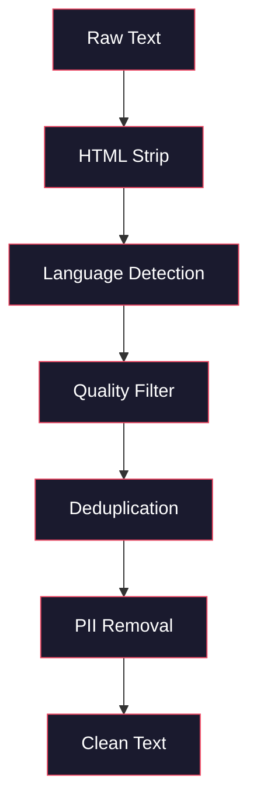
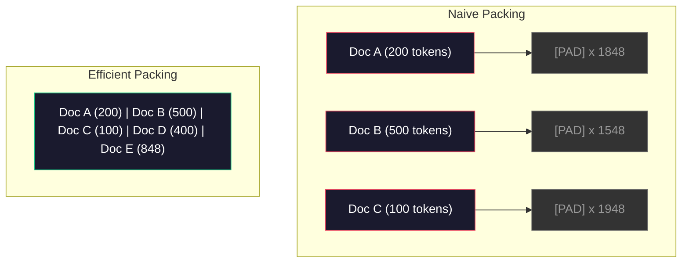

# Potoki danych do szkolenia wstępnego

> Model jest lustrem. Odzwierciedla wszelkie dane, które mu dostarczasz. Karm go śmieciami, odbija śmieci z doskonałą płynnością.

**Typ:** Kompilacja
**Języki:** Python
**Wymagania wstępne:** Faza 10, Lekcje 01-02 (Tokenizatory, Budowa tokenizera)
**Czas:** ~90 minut

## Cele nauczania

- Zbuduj potok danych strumieniowych, który tokenizuje, fragmentuje, tasuje i grupuje terabajty tekstu bez ładowania go całego do pamięci
- Wdrażaj filtry jakości danych (deduplikacja, wykrywanie języka, filtrowanie treści) stosowane w rzeczywistych potokach przedszkoleniowych
- Twórz sekwencje szkoleniowe o stałej długości z odpowiednimi maskami uwagi i obsługą granic dokumentów
- Profilowana przepustowość potoku zapewniająca, że moduł ładujący dane dotrzymuje kroku prędkości uczenia GPU

## Problem

Masz tokenizer. Teraz potrzebujesz danych.

Nie zbiór danych. To nie jest plik CSV. Terabajty tekstu — oczyszczone, usunięte zduplikowane, przefiltrowane pod kątem jakości, podzielone na tokeny w sekwencje o stałej długości i podawane w losowych partiach na tyle szybko, że Twój klaster z 8 procesorami graficznymi nigdy nie będzie czekał na następną partię.

Większość ludzi uważa, że ​​szkolenie LLM dotyczy architektury modelu. Tak nie jest. Lama 3 zużyła 15,6 biliona tokenów. GPT-3 zużył 300 miliardów. DeepSeek-V2 wykorzystał 8,1 biliona. Architektura wszystkich trzech jest mniej więcej taka sama: ułożone bloki transformatorów z warstwami uwagi i wyprzedzającymi. Różnica w jakości wyjściowej wynika w przeważającej mierze z danych.

Papier Chinchilla firmy DeepMind wyjaśnił to precyzyjnie. Dla danego budżetu obliczeniowego istnieje optymalny stosunek parametrów modelu do tokenów szkoleniowych. Szynszyla pokazała, że ​​większość modeli w 2022 r. była dramatycznie niedoszkolona – miały zbyt wiele parametrów w stosunku do ilości danych, które widziały. Model parametrów 70B wytrenowany na 1,4 biliona tokenów (optymalny dla szynszyli) był lepszy od modelu 280B wytrenowanego na 300 miliardach tokenów (Gopher).

Potok danych określa, czy model uczy się języka, czy szumu.

## Koncepcja

### Skąd pochodzą dane

Każdy duży model językowy jest szkolony na różnych źródłach. Dokładny skład jest ściśle strzeżoną tajemnicą większości laboratoriów, ale wiemy wystarczająco dużo, aby zrozumieć kategorie.

| Źródło | Rozmiar | Jakość | Używany przez |
|------------|------|---------|--------|
| Wspólne czołganie | ~250 TB surowego | Niski (wymaga silnego filtrowania) | GPT-3, Lama, modele najbardziej otwarte |
| Wikipedia | ~20 GB | Wysoki | Każdy większy LLM |
| Kod GitHuba | ~1 TB+ | Średni (dużo duplikatów, martwy kod) | StarCoder, CodeLlama, DeepSeek-Coder |
| Książki (Korpus Książek, Stos) | ~100 GB | Wysoki | GPT-2, GPT-3, wczesne modele |
| Artykuły akademickie (arXiv, S2ORC) | ~100 GB | Wysoki dla STEM | Lama, Galaktyka |
| StackOverflow, Reddit | ~100 GB | Średni | Lama, Sokół |
| Wyselekcjonowana sieć (C4, RefinedWeb) | ~5 TB | Średnio-wysoki (wstępnie filtrowany) | T5, Sokół |

Llama 3 ujawniła swój zestaw danych: około 50% danych internetowych, 25% kodu, 13% książek i artykułów akademickich, 8% danych matematycznych i 4% wielojęzycznych danych internetowych. Łącznie wyniosło 15,6 biliona tokenów ze źródeł o rozmiarze przekraczającym 5 TB surowego tekstu.

Proporcje są tak samo ważne, jak całkowity rozmiar. Za dużo danych sieciowych i model staje się papugą Reddita. Za mało kodu i nie da się programować. Za mało matematyki i brak rozumowania. Właściwe połączenie tego zestawu jest jedną z najtrudniejszych części szkolenia LLM i nie ma na to recepty – wymaga eksperymentowania i oceny.

### Czyszczenie danych

Surowe dane internetowe są brudne. Typowy zrzut Common Crawl zawiera:

- Tagi HTML i JavaScript
- Gotowe nagłówki, stopki, menu nawigacyjne
- Zduplikowane strony (dokładne i prawie zduplikowane)
- Spam generowany maszynowo
- Dane osobowe (PII)
- Tekst niskiej jakości (listy słów kluczowych, spam SEO)
- Treści nietekstowe zakodowane jako tekst

Czyszczenie tego nie jest opcjonalne. Jest to różnica pomiędzy modelem generującym spójne akapity a modelem generującym tagi HTML zmieszane z listami produktów.



Każdy krok eliminuje kategorię hałasu:

**Usuwanie HTML:** Usuń wszystkie znaczniki. Zachowaj tylko widoczną treść tekstową. Biblioteki takie jak `trafilatura` lub `readability` wyodrębniają treść artykułu, odrzucając nawigację, reklamy i szablony.

**Wykrywanie języka:** Do klasyfikacji każdego dokumentu użyj modelu identyfikacji języka fastText (lid.176.bin). Filtruj według języków docelowych. Dokument sklasyfikowany jako angielski z poziomem pewności mniejszym niż 0,8 prawdopodobnie nie jest czystym angielskim.

**Filtrowanie jakościowe:** Tutaj robi się interesująco. RefinedWeb (zbiór danych Falcona) wykorzystuje filtr oparty na złożoności: trenuj model małego języka na Wikipedii, a następnie oceniaj każdy dokument. Wysoki stopień skomplikowania oznacza, że ​​dokument różni się od Wikipedii – prawdopodobnie jest to spam, listy słów kluczowych lub treści wygenerowane maszynowo. Dokumenty z zakłopotaniem powyżej progu są usuwane.

**Deduplikacja:** Najskuteczniejszy etap czyszczenia. Common Crawl zawiera ogromną liczbę zduplikowanych stron – zastrzeżenia prawne, informacje o plikach cookie, warunki korzystania z usług. Trening na duplikatach marnuje obliczenia i może spowodować, że model zapamiętuje i dosłownie powtarza określone fragmenty.

**Usuwanie danych osobowych:** Imiona i nazwiska, adresy e-mail, numery telefonów, numery ubezpieczenia społecznego. Wykrywanie oparte na wyrażeniach regularnych dla ustrukturyzowanych modeli PII i NER dla nazw w kontekście.

### Deduplikacja za pomocą MinHash

Dokładna deduplikacja jest łatwa: haszuj każdy dokument, usuwaj duplikaty. Prawdziwym problemem są jednak niemalże duplikaty. Dwie kopie tego samego artykułu z nieco innymi reklamami to prawie duplikaty. Treść jest w 95% identyczna, ale bajt po bajcie się różnią.

MinHash + mieszanie wrażliwe na lokalizację (LSH) skutecznie rozwiązuje ten problem.


Pomysł:

1. **Shinling:** Konwertuj każdy dokument na zbiór n-gramów (np. 5 gramów słów lub znaków). „szybki brązowy lis” z 3-wyrazowymi gontami staje się {„szybkim brązowym”, „szybkim brązowym lisem”}.

2. **MinHash:** Dla zestawu gontów każdego dokumentu oblicz wartości skrótu k. Każda wartość skrótu jest minimalnym skrótem dla wszystkich gontów w ramach innej funkcji skrótu. Tworzy to „podpis” o stałym rozmiarze, który jest zbliżony do podobieństwa Jaccarda między dowolnymi dwoma dokumentami.

3. **LSH:** Grupuj dokumenty w segmenty na podstawie pasm ich podpisu MinHash. Dokumenty w tym samym zasobniku są potencjalnymi niemal duplikatami. Pozwala to uniknąć porównywania każdej pary — porównujesz tylko kandydatów.

4. **Sprawdź:** Dla każdej pary kandydatów oblicz dokładne podobieństwo Jaccarda. Usuń jedną kopię, jeśli podobieństwo przekracza próg (zwykle 0,8).

Zespół Llama zgłosił usunięcie około 38% swoich danych internetowych poprzez deduplikację. To nie jest mała liczba. Ponad jedna trzecia Common Crawl to zduplikowane lub prawie zduplikowane treści.

### Pakowanie sekwencyjne

Twój model oczekuje sekwencji wejściowych o stałej długości. Twoje dokumenty mają zmienną długość. Niektóre mają 50 żetonów. Niektóre mają 50 000 tokenów.

Naiwne podejście: dopasuj każdy dokument do maksymalnej długości sekwencji. Powoduje to marnowanie ogromnych mocy obliczeniowych na żetony dopełniające, które nie wnoszą żadnego wkładu w naukę.

Lepsze podejście: spakuj wiele dokumentów w jedną sekwencję, oddzielonych znacznikami końca sekwencji. Sekwencja 2048 tokenów może zawierać trzy krótkie dokumenty połączone ze sobą tokenami [EOS].



Maska uwagi musi być prawidłowo ustawiona. Tokeny z Dokumentu A nie powinny dotyczyć tokenów z Dokumentu B w tej samej spakowanej sekwencji. Wymaga to maski uwagi o przekątnej blokowej.

Długie dokumenty są obcinane lub dzielone na fragmenty na granicach sekwencji. Punkt podziału ma znaczenie: podział w połowie zdania zmusza model do dostrzeżenia niekompletnych myśli. Niektóre potoki wyrównują podziały do ​​granic akapitów lub zdań, jeśli to możliwe.

### Prawo dotyczące łuski szynszyli

W przypadku stałego budżetu obliczeniowego C (mierzonego w FLOPach) optymalny rozmiar modelu N i rozmiar zbioru danych D są następujące:

```
N_opt ~ C^0.5
D_opt ~ C^0.5
```

W praktyce oznacza to, że należy mniej więcej jednakowo skalować rozmiar modelu i rozmiar zbioru danych. Model z 10 razy większymi parametrami potrzebuje około 10 razy więcej żetonów szkoleniowych, aby osiągnąć tę samą stratę.

| Modelka | Parametry | Żetony szkoleniowe | Szynszyla-Optymalna? |
|-------|------|----------------|--------------------------------|
| GPT-3 | 175B | 300B | Nie (niedotrenowany 3-4x) |
| Szynszyla | 70B | 1,4T | Tak (zgodnie z projektem) |
| Lama 2 | 70B | 2T | Przetrenowany (celowo) |
| Lama 3 | 70B | 15T | Mocno przetrenowany |

Lama 3 celowo łamie prawo dotyczące szynszyli. Meta odkryła, że ​​przetrenowanie większej ilości danych – znacznie przekraczającej optymalny współczynnik obliczeniowy – pozwala uzyskać lepsze modele wnioskowania. Dodatkowy koszt szkolenia jest płacony jednorazowo, ale mniejszy model jest tańszy i może służyć na zawsze. Nazywa się to czasem podejściem skalowania „optymalnego na podstawie wniosków” i stało się standardem branżowym od 2024 r.

## Zbuduj to

### Krok 1: Czyszczenie tekstu

Usuń kod HTML, znormalizuj białe znaki, usuń zawartość nietekstową. Jako nasz mały korpus wykorzystamy tekst należący do domeny publicznej (Projekt Gutenberg).

```python
import re

def clean_text(text):
    text = re.sub(r"<[^>]+>", "", text)
    text = re.sub(r"http\S+", "", text)
    text = re.sub(r"[^\x20-\x7E\n]", "", text)
    text = re.sub(r"\n{3,}", "\n\n", text)
    text = re.sub(r" {2,}", " ", text)
    return text.strip()

def quality_filter(text, min_words=50, max_ratio_caps=0.3, max_ratio_special=0.1):
    words = text.split()
    if len(words) < min_words:
        return False
    caps_ratio = sum(1 for w in words if w.isupper()) / len(words)
    if caps_ratio > max_ratio_caps:
        return False
    special_chars = sum(1 for c in text if not c.isalnum() and not c.isspace())
    if special_chars / max(len(text), 1) > max_ratio_special:
        return False
    return True
```

Filtr jakości wychwytuje spam SEO (WIELKIE LITERY), szum generowany maszynowo (wysoki współczynnik znaków specjalnych) i strony pośredniczące (zbyt krótkie). Same te trzy kontrole usuwają zaskakującą ilość śmieci z przeszukiwania sieci.

### Krok 2: Deduplikacja MinHash

Wdrażaj MinHash od zera. Nie są wymagane żadne zewnętrzne biblioteki — wystarczy `hashlib`.

```python
import hashlib
from collections import defaultdict

def get_shingles(text, k=5):
    words = text.lower().split()
    if len(words) < k:
        return set()
    return {" ".join(words[i:i+k]) for i in range(len(words) - k + 1)}

def minhash_signature(shingles, num_hashes=128):
    signature = []
    for i in range(num_hashes):
        min_hash = float("inf")
        for shingle in shingles:
            h = int(hashlib.sha256(f"{i}:{shingle}".encode()).hexdigest(), 16)
            min_hash = min(min_hash, h)
        signature.append(min_hash)
    return signature

def lsh_buckets(signature, bands=16):
    rows_per_band = len(signature) // bands
    buckets = []
    for b in range(bands):
        start = b * rows_per_band
        band_data = tuple(signature[start:start + rows_per_band])
        bucket_hash = hashlib.md5(str(band_data).encode()).hexdigest()
        buckets.append((b, bucket_hash))
    return buckets

def deduplicate(documents, threshold=0.8, num_hashes=128, bands=16):
    signatures = []
    shingle_sets = []
    for doc in documents:
        shingles = get_shingles(doc)
        shingle_sets.append(shingles)
        signatures.append(minhash_signature(shingles, num_hashes))

    bucket_map = defaultdict(list)
    for doc_idx, sig in enumerate(signatures):
        for band_id, bucket_hash in lsh_buckets(sig, bands):
            bucket_map[(band_id, bucket_hash)].append(doc_idx)

    duplicate_pairs = set()
    for bucket_docs in bucket_map.values():
        if len(bucket_docs) < 2:
            continue
        for i in range(len(bucket_docs)):
            for j in range(i + 1, len(bucket_docs)):
                duplicate_pairs.add((bucket_docs[i], bucket_docs[j]))

    removed = set()
    for i, j in duplicate_pairs:
        if i in removed or j in removed:
            continue
        s1, s2 = shingle_sets[i], shingle_sets[j]
        if not s1 or not s2:
            continue
        jaccard = len(s1 & s2) / len(s1 | s2)
        if jaccard >= threshold:
            removed.add(j)

    return [doc for idx, doc in enumerate(documents) if idx not in removed], len(removed)
```

Parametry `num_hashes=128` i `bands=16` kontrolują kompromis w zakresie precyzji przywoływania. Więcej skrótów daje dokładniejsze szacunki podobieństwa. Więcej pasm zwiększa zapamiętywanie (wyłapuje więcej duplikatów) kosztem większej liczby fałszywych alarmów. Wartości te sprawdzają się dobrze w przypadku typowego tekstu internetowego.

### Krok 3: Tokenizacja i pakowanie sekwencji

Weź czysty, zdeduplikowany tekst, ztokenizuj go i spakuj w sekwencje o stałej długości na potrzeby szkolenia.

```python
def tokenize_corpus(documents, tokenizer):
    all_tokens = []
    for doc in documents:
        tokens = tokenizer.encode(doc)
        all_tokens.extend(tokens)
        all_tokens.append(tokenizer.eos_id)
    return all_tokens

def pack_sequences(token_ids, seq_length, pad_id=0):
    sequences = []
    attention_masks = []
    for i in range(0, len(token_ids), seq_length):
        seq = token_ids[i:i + seq_length]
        mask = [1] * len(seq)
        if len(seq) < seq_length:
            pad_count = seq_length - len(seq)
            seq = seq + [pad_id] * pad_count
            mask = mask + [0] * pad_count
        sequences.append(seq)
        attention_masks.append(mask)
    return sequences, attention_masks
```

### Krok 4: DataLoader do szkolenia

Uzyskaj losowe partie upakowanych sekwencji. To właśnie zużywa pętla treningowa.

```python
import random

class PreTrainingDataLoader:
    def __init__(self, sequences, attention_masks, batch_size, shuffle=True):
        self.sequences = sequences
        self.attention_masks = attention_masks
        self.batch_size = batch_size
        self.shuffle = shuffle

    def __len__(self):
        return (len(self.sequences) + self.batch_size - 1) // self.batch_size

    def __iter__(self):
        indices = list(range(len(self.sequences)))
        if self.shuffle:
            random.shuffle(indices)
        for start in range(0, len(indices), self.batch_size):
            batch_idx = indices[start:start + self.batch_size]
            batch_seqs = [self.sequences[i] for i in batch_idx]
            batch_masks = [self.attention_masks[i] for i in batch_idx]
            yield batch_seqs, batch_masks
```

### Krok 5: Statystyki zbioru danych

Oblicz najważniejsze liczby: całkowitą liczbę tokenów, unikalne tokeny, współczynnik kompresji, rozkład długości dokumentu.

```python
from collections import Counter

def compute_statistics(documents, token_ids, sequences, tokenizer_vocab_size):
    total_chars = sum(len(d) for d in documents)
    total_tokens = len(token_ids)
    unique_tokens = len(set(token_ids))
    compression_ratio = total_chars / total_tokens

    doc_lengths = [len(d.split()) for d in documents]
    avg_doc_length = sum(doc_lengths) / max(len(doc_lengths), 1)
    max_doc_length = max(doc_lengths) if doc_lengths else 0
    min_doc_length = min(doc_lengths) if doc_lengths else 0

    token_counts = Counter(token_ids)
    top_tokens = token_counts.most_common(10)

    non_pad_tokens = sum(sum(1 for t in seq if t != 0) for seq in sequences)
    total_positions = sum(len(seq) for seq in sequences)
    utilization = non_pad_tokens / max(total_positions, 1)

    stats = {
        "total_documents": len(documents),
        "total_characters": total_chars,
        "total_tokens": total_tokens,
        "unique_tokens": unique_tokens,
        "vocab_utilization": unique_tokens / tokenizer_vocab_size,
        "compression_ratio": compression_ratio,
        "avg_doc_length_words": avg_doc_length,
        "max_doc_length_words": max_doc_length,
        "min_doc_length_words": min_doc_length,
        "num_sequences": len(sequences),
        "sequence_utilization": utilization,
        "top_10_tokens": top_tokens,
    }
    return stats
```

Współczynnik kompresji informuje, jak skuteczny jest tokenizer w tym korpusie. Tekst w języku angielskim jest zwykle kompresowany do około 3-4 znaków na token. Jeśli widzisz 1,5 znaku na token, Twój tokenizer dzieli się zbyt agresywnie. Jeśli widzisz 8+, nauczył się połączeń bardzo specyficznych dla domeny.

Wykorzystanie sekwencji informuje, jaka część spakowanych sekwencji to rzeczywiste dane w porównaniu z dopełnieniem. Poniżej 90% oznacza, że ​​pakowanie jest nieefektywne — marnujesz moc obliczeniową na tokeny dopełniające.

## Użyj tego

### Porównaj ze zbiorami danych HuggingFace

Załaduj ten sam korpus za pośrednictwem biblioteki zestawów danych HuggingFace i porównaj prędkość potoku.

```python
from datasets import load_dataset
from transformers import AutoTokenizer

ds = load_dataset("wikitext", "wikitext-2-raw-v1", split="train")
tokenizer = AutoTokenizer.from_pretrained("meta-llama/Meta-Llama-3-8B")

import time

start = time.time()
tokenized = ds.map(
    lambda x: tokenizer(x["text"], truncation=True, max_length=2048),
    batched=True,
    num_proc=4,
)
hf_time = time.time() - start
total_tokens = sum(len(t) for t in tokenized["input_ids"])
print(f"HuggingFace: {total_tokens:,} tokens in {hf_time:.2f}s ({total_tokens/hf_time:,.0f} tokens/sec)")
```

Potok HuggingFace wykorzystuje pod maską tokenizatory Rust i przetwarzanie równoległe na 4 rdzeniach. Twój czysty potok Pythona będzie 10–50 razy wolniejszy. Ta luka jest powodem, dla którego zespoły produkcyjne używają skompilowanych tokenizatorów. Algorytm jest taki sam. Różnica polega na języku implementacji.

## Wyślij to

Ta lekcja generuje monit o sprawdzanie i debugowanie jakości danych w potokach szkoleniowych LLM. Zobacz `outputs/prompt-data-quality-checker.md`.

## Ćwiczenia

1. **Łatwe:** Dodaj wykrywanie języka do potoku czyszczącego za pomocą prostej heurystyki (analiza zestawu znaków). Filtruj tylko dokumenty w języku angielskim i mierz, ile dokumentów zostało usuniętych.
2. **Średni:** Zaimplementuj dokładną deduplikację przy użyciu skrótów SHA-256 wraz z funkcją niemal deduplikacji MinHash. Porównaj liczbę duplikatów wyłapanych przez każdą metodę w korpusie zeskanowanym z sieci.
3. **Trudne:** Zbuduj filtr jakości oparty na zakłopotaniu. Wytrenuj model języka małego bigramu na podstawie tekstu w Wikipedii, oceń każdy dokument pod względem złożoności i usuń dolne 20%. Porównaj jakość wyników modelu podczas uczenia na danych filtrowanych i niefiltrowanych.

## Kluczowe terminy

| Termin | Co ludzie mówią | Co to właściwie oznacza |
|------|----------------|----------------------|
| Wspólne czołganie | „Internet” | Organizacja non-profit, która co miesiąc przeszukuje sieć — ~250 TB w stanie surowym, punkt wyjścia dla większości danych szkoleniowych LLM |
| MinHash | „Jakaś sztuczka z mieszaniem” | Technika szacowania podobieństwa Jaccarda między zestawami przy użyciu sygnatur o stałym rozmiarze — umożliwia wykrywanie niemal duplikatów na dużą skalę |
| LSH | „Haszowanie zależne od lokalizacji” | Metoda grupowania podobnych elementów w tym samym segmencie — ogranicza porównania parami z O(n^2) do niemal liniowych |
| Pakowanie sekwencji | „Łączenie dokumentów” | Dopasowywanie wielu dokumentów w sekwencje o stałej długości przy użyciu odpowiednich masek uwagi — eliminuje straty związane z wypełnianiem |
| Łuskanie szynszyli | „Trenuj na większej ilości danych” | W przypadku stałego budżetu obliczeniowego optymalna wydajność wymaga skalowania rozmiaru modelu i tokenów szkoleniowych mniej więcej po równo |
| Płodność | „Tokeny za słowo” | Średnia liczba tokenów na słowo — 1,3 dla języka angielskiego w GPT-4, wyższa dla alfabetów innych niż łacińskie |
| Mieszanie danych | „Wybór danych treningowych” | Stosunek kodu, tekstu, matematyki i danych wielojęzycznych — brak wzoru, wymaga eksperymentowania |
| Filtr zakłopotania | „Punktowanie jakości” | Do oceniania dokumentów używaj modelu małego języka — duża złożoność oznacza, że ​​tekst różni się od czystych danych referencyjnych |
| Deduplikacja | „Usuwanie kopii” | Eliminowanie dokładnych i prawie zduplikowanych dokumentów — zazwyczaj usuwa 30–40% surowych danych internetowych |
| Uwaga maska ​​| „Na które tokeny patrzeć” | Maska binarna, która zapobiega przekroczeniu granic dokumentu w spakowanych sekwencjach |

## Dalsze czytanie

– [Hoffmann i in., 2022 – Training Compute-Optimal Large Language Models (Chinchilla)](https://arxiv.org/abs/2203.15556) – artykuł, który zmienił sposób, w jaki myślimy o skali danych
– [Penedo i in., 2023 – Zbiór danych RefinedWeb dla Falcon LLM](https://arxiv.org/abs/2306.01116) – jak filtrować Common Crawl do wysokiej jakości
– [Touvron i in., 2023 – Llama 2: Otwarte podstawy i dopracowane modele czatu](https://arxiv.org/abs/2307.09288) – szczegóły potoku danych dla Lamy 2
– [Lee i in., 2022 – Deduplikacja danych szkoleniowych poprawia modele językowe](https://arxiv.org/abs/2107.06499) – dlaczego deduplikacja ma większe znaczenie niż myślisz
– [Broder, 1997 – O podobieństwie i przechowywaniu dokumentów] (https://ieeexplore.ieee.org/document/666900) – oryginalny artykuł MinHash
– [Meta, 2024 – Raport techniczny Llama 3](https://arxiv.org/abs/2407.21783) – Tokeny 15,6 T, współczynniki mieszania danych, potok filtrujący