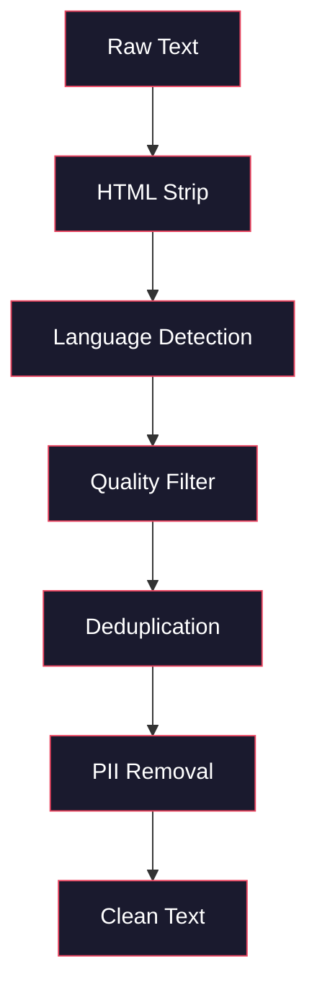
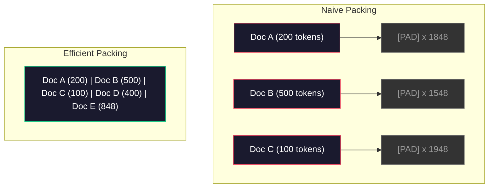

# Potoki danych do szkolenia wstępnego

> Model jest lustrem. Odzwierciedla dane, którymi go karmisz. Podaj mu śmieci — odtworzy je z doskonałą płynnością.

**Typ:** Kompilacja
**Języki:** Python
**Wymagania wstępne:** Faza 10, Lekcje 01-02 (Tokenizatory, Budowa tokenizera)
**Czas:** ~90 minut

## Cele nauczania

- Zbuduj strumieniowy potok danych, który tokenizuje, fragmentuje, tasuje i grupuje terabajty tekstu bez konieczności ładowania ich w całości do pamięci
- Wdrażaj filtry jakości danych (deduplikacja, wykrywanie języka, filtrowanie treści) stosowane w rzeczywistych potokach przedtreningowych
- Twórz sekwencje treningowe o stałej długości z odpowiednimi maskami uwagi i obsługą granic dokumentów
- Profiluj przepustowość potoku, aby upewnić się, że moduł ładujący dane nadąża za szybkością uczenia na GPU

## Problem

Masz tokenizer. Teraz potrzebujesz danych.

Nie chodzi o jeden zbiór danych ani plik CSV. Mowa o terabajtach tekstu — oczyszczonego, pozbawionego duplikatów, przefiltrowanego pod kątem jakości, podzielonego na tokeny w sekwencje o stałej długości i podawanego w losowych partiach wystarczająco szybko, by klaster z ośmioma procesorami graficznymi nigdy nie czekał na kolejną partię.

Większość ludzi sądzi, że trening LLM sprowadza się do architektury modelu. To błąd. Llama 3 pochłonęła 15,6 biliona tokenów. GPT-3 — 300 miliardów. DeepSeek-V2 wykorzystał 8,1 biliona. Architektura wszystkich trzech jest zbliżona: ułożone bloki transformatorów z warstwami uwagi i warstwami feed-forward. Różnica w jakości wyników wynika przede wszystkim z danych.

Artykuł Chinchilla firmy DeepMind wyjaśnił to precyzyjnie. Dla danego budżetu obliczeniowego istnieje optymalny stosunek parametrów modelu do liczby tokenów treningowych. Chinchilla wykazała, że większość modeli z 2022 roku była znacznie niedotrenowana — miały zbyt wiele parametrów w stosunku do ilości danych, na których pracowały. Model 70B parametrów wytrenowany na 1,4 biliona tokenów (optymum według Chinchilli) okazał się lepszy od modelu 280B wytrenowanego na 300 miliardach tokenów (Gopher).

Potok danych decyduje o tym, czy model uczy się języka, czy szumu.

## Koncepcja

### Skąd pochodzą dane

Każdy duży model językowy jest trenowany na różnorodnych źródłach. Dokładny skład stanowi ściśle strzeżoną tajemnicę większości laboratoriów, jednak wiemy wystarczająco wiele, by zrozumieć poszczególne kategorie.

| Źródło | Rozmiar | Jakość | Stosowany przez |
|------------|------|---------|--------|
| Common Crawl | ~250 TB (surowy) | Niska (wymaga silnego filtrowania) | GPT-3, Llama, większość modeli open-source |
| Wikipedia | ~20 GB | Wysoka | Każdy większy LLM |
| Kod GitHub | ~1 TB+ | Średnia (dużo duplikatów, nieużywany kod) | StarCoder, CodeLlama, DeepSeek-Coder |
| Książki (Books Corpus, The Stack) | ~100 GB | Wysoka | GPT-2, GPT-3, wczesne modele |
| Artykuły akademickie (arXiv, S2ORC) | ~100 GB | Wysoka dla nauk ścisłych | Llama, Galactica |
| StackOverflow, Reddit | ~100 GB | Średnia | Llama, Falcon |
| Wyselekcjonowana sieć (C4, RefinedWeb) | ~5 TB | Średnio-wysoka (wstępnie filtrowana) | T5, Falcon |

Llama 3 ujawniła skład swojego zbioru danych: około 50% danych internetowych, 25% kodu, 13% książek i artykułów akademickich, 8% danych matematycznych oraz 4% wielojęzycznych treści z sieci. Łącznie daje to 15,6 biliona tokenów pozyskanych ze źródeł o łącznym rozmiarze przekraczającym 5 TB surowego tekstu.

Proporcje są równie ważne jak całkowity rozmiar. Zbyt duży udział danych sieciowych sprawia, że model staje się papugą Reddita. Zbyt mało kodu uniemożliwia programowanie. Zbyt mało matematyki pozbawia model zdolności wnioskowania. Odpowiednie dobranie tych proporcji to jedna z najtrudniejszych części trenowania LLM — nie ma tu gotowej recepty, konieczne są eksperymenty i ewaluacja.

### Czyszczenie danych

Surowe dane internetowe są zanieczyszczone. Typowy zrzut Common Crawl zawiera:

- Tagi HTML i JavaScript
- Powtarzające się nagłówki, stopki i menu nawigacyjne
- Zduplikowane strony (dokładne i prawie identyczne)
- Spam generowany maszynowo
- Dane osobowe (PII)
- Tekst niskiej jakości (listy słów kluczowych, spam SEO)
- Treści niebędące tekstem, zakodowane jako tekst

Czyszczenie tych danych nie jest opcjonalne. To właśnie ono decyduje o różnicy między modelem generującym spójne akapity a modelem mieszającym tagi HTML z listami produktów.



Każdy etap eliminuje inną kategorię szumu:

**Usuwanie HTML:** Usuń wszystkie znaczniki, zachowując wyłącznie widoczną treść tekstową. Biblioteki takie jak `trafilatura` czy `readability` wyodrębniają treść artykułu, odrzucając nawigację, reklamy i szablony.

**Wykrywanie języka:** Do klasyfikacji każdego dokumentu użyj modelu identyfikacji języka fastText (lid.176.bin). Filtruj według docelowych języków. Dokument sklasyfikowany jako angielski z pewnością poniżej 0,8 prawdopodobnie nie jest czystym językiem angielskim.

**Filtrowanie jakości:** To właśnie tutaj dzieje się coś interesującego. RefinedWeb (zbiór danych Falcona) stosuje filtr oparty na perpleksji: trenuje mały model językowy na Wikipedii, a następnie ocenia każdy dokument. Wysoka perpleksja oznacza, że dokument odbiega od Wikipedii — jest zapewne spamem, listą słów kluczowych lub treścią wygenerowaną maszynowo. Dokumenty przekraczające próg perpleksji są usuwane.

**Deduplikacja:** Najskuteczniejszy etap czyszczenia. Common Crawl zawiera ogromną liczbę zduplikowanych stron — zastrzeżenia prawne, komunikaty o plikach cookie, regulaminy. Trenowanie na duplikatach marnuje zasoby obliczeniowe i może skłonić model do zapamiętywania i dosłownego odtwarzania określonych fragmentów.

**Usuwanie danych osobowych:** Imiona i nazwiska, adresy e-mail, numery telefonów, numery ubezpieczenia społecznego. Do wykrywania ustrukturyzowanych danych PII stosuje się wyrażenia regularne, do rozpoznawania nazw własnych w kontekście — modele NER.

### Deduplikacja za pomocą MinHash

Dokładna deduplikacja jest prosta: oblicz skrót każdego dokumentu i usuń duplikaty. Prawdziwym wyzwaniem są jednak dokumenty niemal identyczne. Dwie kopie tego samego artykułu z nieco różniącymi się reklamami to quasi-duplikaty — treść jest w 95% identyczna, lecz bajt po bajcie się różnią.

MinHash w połączeniu z Locality-Sensitive Hashing (LSH) skutecznie rozwiązuje ten problem.


Idea algorytmu:

1. **Shingling:** Zamień każdy dokument na zbiór n-gramów (np. 5-gramów słownych lub znakowych). Zdanie „szybki brązowy lis" z 3-wyrazowymi shingle'ami daje zbiór {„szybki brązowy", „szybki brązowy lis"}.

2. **MinHash:** Dla zbioru shingle'ów każdego dokumentu oblicz k wartości skrótu. Każda z nich to minimalna wartość skrótu dla wszystkich shingle'ów przy zastosowaniu odrębnej funkcji skrótu. W ten sposób powstaje „sygnatura" o stałym rozmiarze, która przybliża podobieństwo Jaccarda między dowolnymi dwoma dokumentami.

3. **LSH:** Grupuj dokumenty w kubełki na podstawie pasm ich sygnatury MinHash. Dokumenty w tym samym kubełku są kandydatami na quasi-duplikaty. Pozwala to uniknąć porównywania wszystkich par — zestawiamy wyłącznie kandydatów.

4. **Weryfikacja:** Dla każdej pary kandydatów oblicz dokładne podobieństwo Jaccarda. Usuń jedną kopię, jeśli podobieństwo przekracza próg (zwykle 0,8).

Zespół Llamy poinformował, że przez deduplikację odrzucił około 38% danych internetowych. To znacząca liczba — ponad jedna trzecia Common Crawl to treści zduplikowane lub prawie identyczne.

### Pakowanie sekwencji

Model oczekuje sekwencji wejściowych o stałej długości, podczas gdy dokumenty mają zmienną długość — jedne liczą 50 tokenów, inne 50 000.

Podejście naiwne: dopasuj każdy dokument do maksymalnej długości sekwencji, uzupełniając go tokenami paddingu. Powoduje to marnowanie ogromnych zasobów obliczeniowych na tokeny, które nie wnoszą nic do nauki.

Lepsze rozwiązanie: pakuj wiele dokumentów w jedną sekwencję, oddzielając je tokenami końca sekwencji. Sekwencja o długości 2048 tokenów może zawierać trzy krótkie dokumenty połączone tokenami [EOS].



Maska uwagi musi być skonfigurowana prawidłowo. Tokeny z Dokumentu A nie powinny mieć dostępu do tokenów z Dokumentu B w tej samej spakowanej sekwencji — wymaga to maski uwagi o strukturze blokowej przekątnej.

Długie dokumenty są przycinane lub dzielone na fragmenty na granicach sekwencji. Miejsce podziału ma znaczenie: cięcie w połowie zdania zmusza model do pracy z urwanymi myślami. Niektóre potoki wyrównują podziały do granic akapitów lub zdań, jeśli to możliwe.

### Prawo skalowania Chinchilli

Dla stałego budżetu obliczeniowego C (mierzonego w FLOPach) optymalny rozmiar modelu N oraz rozmiar zbioru danych D wynoszą:

```
N_opt ~ C^0.5
D_opt ~ C^0.5
```

W praktyce oznacza to, że rozmiar modelu i zbioru danych powinny rosnąć mniej więcej proporcjonalnie. Model z dziesięciokrotnie większą liczbą parametrów potrzebuje około dziesięciokrotnie więcej tokenów treningowych, by osiągnąć tę samą wartość funkcji straty.

| Model | Parametry | Tokeny treningowe | Optymalny wg Chinchilli? |
|-------|------|----------------|--------------------------------|
| GPT-3 | 175B | 300B | Nie (niedotrenowany 3–4x) |
| Chinchilla | 70B | 1,4T | Tak (zgodnie z założeniami) |
| Llama 2 | 70B | 2T | Przetrenowany (celowo) |
| Llama 3 | 70B | 15T | Znacznie przetrenowany |

Llama 3 celowo łamie prawo Chinchilli. Meta odkryła, że trenowanie na znacznie większej ilości danych — daleko poza optymalnym progiem obliczeniowym — przekłada się na lepsze modele podczas inferencji. Jednorazowy koszt treningu jest wyższy, ale mniejszy model jest tańszy w eksploatacji i może pracować bezterminowo. Podejście to bywa nazywane skalowaniem „optymalnym pod kątem inferencji" i od 2024 roku stało się standardem branżowym.

## Zbuduj to

### Krok 1: Czyszczenie tekstu

Usuń kod HTML, znormalizuj białe znaki, wyeliminuj treści niebędące tekstem. Jako przykładowy korpus wykorzystamy teksty z domeny publicznej (Projekt Gutenberg).

```python
import re

def clean_text(text):
    text = re.sub(r"<[^>]+>", "", text)
    text = re.sub(r"http\S+", "", text)
    text = re.sub(r"[^\x20-\x7E\n]", "", text)
    text = re.sub(r"\n{3,}", "\n\n", text)
    text = re.sub(r" {2,}", " ", text)
    return text.strip()

def quality_filter(text, min_words=50, max_ratio_caps=0.3, max_ratio_special=0.1):
    words = text.split()
    if len(words) < min_words:
        return False
    caps_ratio = sum(1 for w in words if w.isupper()) / len(words)
    if caps_ratio > max_ratio_caps:
        return False
    special_chars = sum(1 for c in text if not c.isalnum() and not c.isspace())
    if special_chars / max(len(text), 1) > max_ratio_special:
        return False
    return True
```

Filtr jakości wychwytuje spam SEO (WIELKIE LITERY), szum generowany maszynowo (wysoki odsetek znaków specjalnych) oraz strony przejściowe (zbyt krótki tekst). Te trzy proste sprawdzenia eliminują zaskakująco dużą ilość odpadów ze zrzutów sieciowych.

### Krok 2: Deduplikacja MinHash

Zaimplementuj MinHash od podstaw — nie są potrzebne żadne zewnętrzne biblioteki, wystarczy `hashlib`.

```python
import hashlib
from collections import defaultdict

def get_shingles(text, k=5):
    words = text.lower().split()
    if len(words) < k:
        return set()
    return {" ".join(words[i:i+k]) for i in range(len(words) - k + 1)}

def minhash_signature(shingles, num_hashes=128):
    signature = []
    for i in range(num_hashes):
        min_hash = float("inf")
        for shingle in shingles:
            h = int(hashlib.sha256(f"{i}:{shingle}".encode()).hexdigest(), 16)
            min_hash = min(min_hash, h)
        signature.append(min_hash)
    return signature

def lsh_buckets(signature, bands=16):
    rows_per_band = len(signature) // bands
    buckets = []
    for b in range(bands):
        start = b * rows_per_band
        band_data = tuple(signature[start:start + rows_per_band])
        bucket_hash = hashlib.md5(str(band_data).encode()).hexdigest()
        buckets.append((b, bucket_hash))
    return buckets

def deduplicate(documents, threshold=0.8, num_hashes=128, bands=16):
    signatures = []
    shingle_sets = []
    for doc in documents:
        shingles = get_shingles(doc)
        shingle_sets.append(shingles)
        signatures.append(minhash_signature(shingles, num_hashes))

    bucket_map = defaultdict(list)
    for doc_idx, sig in enumerate(signatures):
        for band_id, bucket_hash in lsh_buckets(sig, bands):
            bucket_map[(band_id, bucket_hash)].append(doc_idx)

    duplicate_pairs = set()
    for bucket_docs in bucket_map.values():
        if len(bucket_docs) < 2:
            continue
        for i in range(len(bucket_docs)):
            for j in range(i + 1, len(bucket_docs)):
                duplicate_pairs.add((bucket_docs[i], bucket_docs[j]))

    removed = set()
    for i, j in duplicate_pairs:
        if i in removed or j in removed:
            continue
        s1, s2 = shingle_sets[i], shingle_sets[j]
        if not s1 or not s2:
            continue
        jaccard = len(s1 & s2) / len(s1 | s2)
        if jaccard >= threshold:
            removed.add(j)

    return [doc for idx, doc in enumerate(documents) if idx not in removed], len(removed)
```

Parametry `num_hashes=128` i `bands=16` kontrolują kompromis między precyzją a czułością. Więcej skrótów daje dokładniejsze szacunki podobieństwa. Więcej pasm zwiększa czułość (wykrywa więcej duplikatów) kosztem wyższego odsetka wyników fałszywie pozytywnych. Podane wartości sprawdzają się dobrze w przypadku typowego tekstu internetowego.

### Krok 3: Tokenizacja i pakowanie sekwencji

Weź oczyszczony i zdeduplikowany tekst, podziel go na tokeny, a następnie spakuj w sekwencje o stałej długości na potrzeby trenowania.

```python
def tokenize_corpus(documents, tokenizer):
    all_tokens = []
    for doc in documents:
        tokens = tokenizer.encode(doc)
        all_tokens.extend(tokens)
        all_tokens.append(tokenizer.eos_id)
    return all_tokens

def pack_sequences(token_ids, seq_length, pad_id=0):
    sequences = []
    attention_masks = []
    for i in range(0, len(token_ids), seq_length):
        seq = token_ids[i:i + seq_length]
        mask = [1] * len(seq)
        if len(seq) < seq_length:
            pad_count = seq_length - len(seq)
            seq = seq + [pad_id] * pad_count
            mask = mask + [0] * pad_count
        sequences.append(seq)
        attention_masks.append(mask)
    return sequences, attention_masks
```

### Krok 4: DataLoader do trenowania

Generuj losowe partie ze spakowanych sekwencji. To właśnie z nich korzysta pętla treningowa.

```python
import random

class PreTrainingDataLoader:
    def __init__(self, sequences, attention_masks, batch_size, shuffle=True):
        self.sequences = sequences
        self.attention_masks = attention_masks
        self.batch_size = batch_size
        self.shuffle = shuffle

    def __len__(self):
        return (len(self.sequences) + self.batch_size - 1) // self.batch_size

    def __iter__(self):
        indices = list(range(len(self.sequences)))
        if self.shuffle:
            random.shuffle(indices)
        for start in range(0, len(indices), self.batch_size):
            batch_idx = indices[start:start + self.batch_size]
            batch_seqs = [self.sequences[i] for i in batch_idx]
            batch_masks = [self.attention_masks[i] for i in batch_idx]
            yield batch_seqs, batch_masks
```

### Krok 5: Statystyki zbioru danych

Oblicz kluczowe wskaźniki: łączną liczbę tokenów, unikalne tokeny, współczynnik kompresji oraz rozkład długości dokumentów.

```python
from collections import Counter

def compute_statistics(documents, token_ids, sequences, tokenizer_vocab_size):
    total_chars = sum(len(d) for d in documents)
    total_tokens = len(token_ids)
    unique_tokens = len(set(token_ids))
    compression_ratio = total_chars / total_tokens

    doc_lengths = [len(d.split()) for d in documents]
    avg_doc_length = sum(doc_lengths) / max(len(doc_lengths), 1)
    max_doc_length = max(doc_lengths) if doc_lengths else 0
    min_doc_length = min(doc_lengths) if doc_lengths else 0

    token_counts = Counter(token_ids)
    top_tokens = token_counts.most_common(10)

    non_pad_tokens = sum(sum(1 for t in seq if t != 0) for seq in sequences)
    total_positions = sum(len(seq) for seq in sequences)
    utilization = non_pad_tokens / max(total_positions, 1)

    stats = {
        "total_documents": len(documents),
        "total_characters": total_chars,
        "total_tokens": total_tokens,
        "unique_tokens": unique_tokens,
        "vocab_utilization": unique_tokens / tokenizer_vocab_size,
        "compression_ratio": compression_ratio,
        "avg_doc_length_words": avg_doc_length,
        "max_doc_length_words": max_doc_length,
        "min_doc_length_words": min_doc_length,
        "num_sequences": len(sequences),
        "sequence_utilization": utilization,
        "top_10_tokens": top_tokens,
    }
    return stats
```

Współczynnik kompresji pokazuje, jak skutecznie tokenizer przetwarza dany korpus. Tekst angielski zazwyczaj odpowiada około 3–4 znakom na token. Wynik rzędu 1,5 znaku na token świadczy o zbyt agresywnym podziale. Wynik powyżej 8 oznacza, że tokenizer nauczył się połączeń bardzo specyficznych dla danej domeny.

Wykorzystanie sekwencji informuje, jaki odsetek spakowanych sekwencji stanowią faktyczne dane, a jaki — padding. Wartość poniżej 90% sygnalizuje nieefektywne pakowanie i marnowanie mocy obliczeniowej na tokeny wypełniające.

## Użyj tego

### Porównaj ze zbiorami danych HuggingFace

Załaduj ten sam korpus za pośrednictwem biblioteki datasets HuggingFace i porównaj szybkość obu potoków.

```python
from datasets import load_dataset
from transformers import AutoTokenizer

ds = load_dataset("wikitext", "wikitext-2-raw-v1", split="train")
tokenizer = AutoTokenizer.from_pretrained("meta-llama/Meta-Llama-3-8B")

import time

start = time.time()
tokenized = ds.map(
    lambda x: tokenizer(x["text"], truncation=True, max_length=2048),
    batched=True,
    num_proc=4,
)
hf_time = time.time() - start
total_tokens = sum(len(t) for t in tokenized["input_ids"])
print(f"HuggingFace: {total_tokens:,} tokens in {hf_time:.2f}s ({total_tokens/hf_time:,.0f} tokens/sec)")
```

Potok HuggingFace korzysta z tokenizatorów napisanych w Rust oraz przetwarzania równoległego na 4 rdzeniach. Czysty potok w Pythonie będzie 10–50 razy wolniejszy. Ta różnica wyjaśnia, dlaczego zespoły produkcyjne sięgają po skompilowane tokenizatory. Algorytm jest identyczny — różni się wyłącznie język implementacji.

## Wyślij to

Ta lekcja generuje prompt do sprawdzania i debugowania jakości danych w potokach treningowych LLM. Zobacz `outputs/prompt-data-quality-checker.md`.

## Ćwiczenia

1. **Łatwe:** Dodaj wykrywanie języka do potoku czyszczącego za pomocą prostej heurystyki (analiza zestawu znaków). Filtruj wyłącznie dokumenty w języku angielskim i sprawdź, ile z nich zostało odrzuconych.
2. **Średnie:** Zaimplementuj dokładną deduplikację z użyciem skrótów SHA-256 oraz uzupełnij ją funkcją quasi-deduplikacji MinHash. Porównaj, ile duplikatów wykrywa każda z metod na korpusie ze zrzutu sieciowego.
3. **Trudne:** Zbuduj filtr jakości oparty na perpleksji. Wytrenuj mały bigramowy model językowy na tekście Wikipedii, oceń każdy dokument i usuń najsłabsze 20%. Porównaj jakość wyników modelu trenowanego na danych filtrowanych i niefiltrowanych.

## Kluczowe terminy

| Termin | Co się o nim mówi | Co naprawdę oznacza |
|------|----------------|----------------------|
| Common Crawl | „Internet" | Organizacja non-profit prowadząca miesięczne przeszukiwania sieci — ~250 TB surowych danych, punkt wyjścia dla większości zbiorów treningowych LLM |
| MinHash | „Jakaś sztuczka z haszowaniem" | Technika szacowania podobieństwa Jaccarda między zbiorami za pomocą sygnatur o stałym rozmiarze — umożliwia wykrywanie quasi-duplikatów na dużą skalę |
| LSH | „Locality-Sensitive Hashing" | Metoda grupowania podobnych elementów w tym samym kubełku — ogranicza porównania parami z O(n^2) do niemal liniowych |
| Pakowanie sekwencji | „Łączenie dokumentów" | Umieszczanie wielu dokumentów w sekwencjach o stałej długości przy użyciu odpowiednich masek uwagi — eliminuje straty związane z paddingiem |
| Prawo Chinchilli | „Trenuj na większej ilości danych" | Dla stałego budżetu obliczeniowego optymalna wydajność wymaga proporcjonalnego skalowania rozmiaru modelu i liczby tokenów treningowych |
| Fertility | „Tokeny na słowo" | Średnia liczba tokenów przypadająca na jedno słowo — wynosi 1,3 dla języka angielskiego w GPT-4, jest wyższa dla alfabetów niełacińskich |
| Mieszanie danych | „Dobór danych treningowych" | Proporcje kodu, tekstu, matematyki i danych wielojęzycznych — brak gotowej formuły, wymaga eksperymentowania |
| Filtr perpleksji | „Ocenianie jakości" | Użycie małego modelu językowego do punktowania dokumentów — wysoka perpleksja wskazuje, że tekst odbiega od czystych danych referencyjnych |
| Deduplikacja | „Usuwanie kopii" | Eliminowanie dokumentów dokładnie lub prawie identycznych — zazwyczaj usuwa 30–40% surowych danych internetowych |
| Maska uwagi | „Na które tokeny patrzeć" | Maska binarna zapobiegająca przekraczaniu granic dokumentów w spakowanych sekwencjach |

## Dalsze czytanie

– [Hoffmann i in., 2022 – Training Compute-Optimal Large Language Models (Chinchilla)](https://arxiv.org/abs/2203.15556) – artykuł, który zmienił sposób myślenia o skali danych
– [Penedo i in., 2023 – The RefinedWeb Dataset for Falcon LLM](https://arxiv.org/abs/2306.01116) – jak filtrować Common Crawl do wysokiej jakości
– [Touvron i in., 2023 – Llama 2: Open Foundation and Fine-Tuned Chat Models](https://arxiv.org/abs/2307.09288) – szczegóły potoku danych dla Llamy 2
– [Lee i in., 2022 – Deduplicating Training Data Makes Language Models Better](https://arxiv.org/abs/2107.06499) – dlaczego deduplikacja ma większe znaczenie, niż się wydaje
– [Broder, 1997 – On the Resemblance and Containment of Documents](https://ieeexplore.ieee.org/document/666900) – oryginalny artykuł o MinHash
– [Meta, 2024 – The Llama 3 Herd of Models](https://arxiv.org/abs/2407.21783) – 15,6 biliona tokenów, proporcje mieszania danych, potok filtrowania
