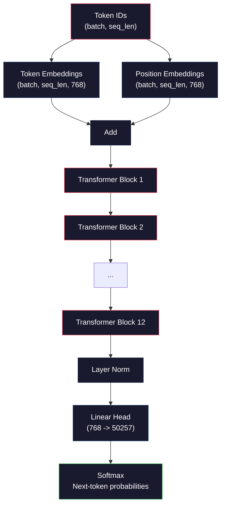
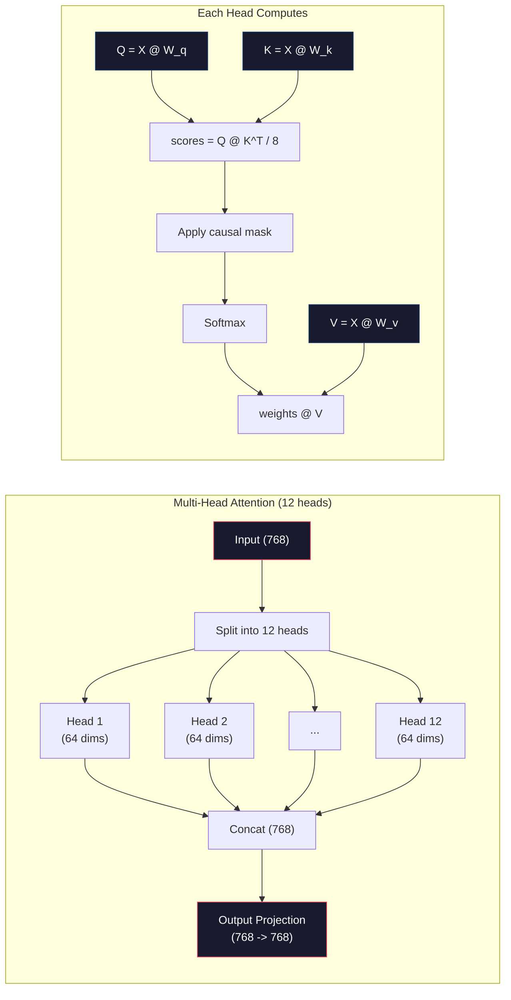
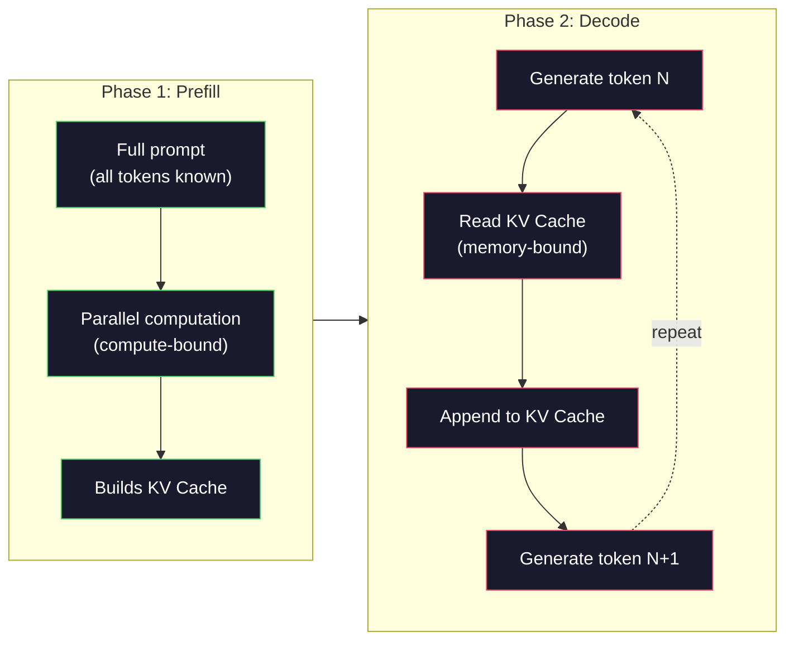

# Wstępne szkolenie Mini GPT (parametry 124M)

> GPT-2 Small ma 124 miliony parametrów. To 12 warstw transformatorów, 12 głów uwagi i 768-wymiarowe osadzenie. Możesz go wytrenować od podstaw na jednym procesorze graficznym w ciągu kilku godzin. Większość ludzi nigdy tego nie robi. Korzystają z wcześniej wyszkolonych punktów kontrolnych. Jeśli jednak sam go nie przeszkolisz, tak naprawdę nie rozumiesz, co dzieje się w modelu, na którym budujesz produkty.

**Typ:** Kompilacja
**Języki:** Python (z numpy)
**Wymagania wstępne:** Faza 10, lekcje 01-03 (Tokenizatory, budowanie tokenizera, potoki danych)
**Czas:** ~120 minut

## Cele nauczania

- Zaimplementuj od podstaw pełną architekturę GPT-2 (parametry 124M): osadzanie tokenów, osadzanie pozycyjne, bloki transformatorów i nagłówek modelu językowego
- Trenuj model GPT na korpusie tekstowym, korzystając z przewidywania następnego tokenu z utratą entropii krzyżowej
- Zaimplementuj generowanie tekstu autoregresyjnego z próbkowaniem temperatury i filtrowaniem top-k/top-p
- Monitoruj krzywe strat szkoleniowych i sprawdzaj, czy model uczy się spójnych wzorców językowych

## Problem

Wiesz, co to jest transformator. Przeczytałeś diagramy. Możesz recytować „wystarczy uwaga” i rysować na tablicy pola z napisem „Uwaga wielu głów”.

Nic z tego nie oznacza, że ​​rozumiesz, co się dzieje, gdy model generuje tekst.

W GPT-2 Small (z wiązaniem wag) znajduje się 124 438 272 parametrów. Każdy z nich został ustawiony poprzez wykonanie pętli treningowej: podanie w przód, utrata obliczeń, podanie w tył, aktualizacja ciężarów. Dwanaście bloków transformatorowych. Dwanaście głów uwagi na blok. 768-wymiarowa przestrzeń osadzania. Słownictwo składające się z 50 257 tokenów. Za każdym razem, gdy model generuje token, wszystkie 124 miliony parametrów uczestniczą w pojedynczym łańcuchu mnożenia macierzy, który pobiera sekwencję identyfikatorów tokenów i generuje rozkład prawdopodobieństwa dla następnego tokenu.

Jeśli nigdy tego sam nie budowałeś, pracujesz z czarną skrzynką. Możesz skorzystać z API. Możesz dostroić. Ale kiedy coś pójdzie nie tak – kiedy model ma halucynacje, kiedy się powtarza, kiedy odmawia wykonania instrukcji – nie masz mentalnego modelu na *dlaczego*.

Ta lekcja buduje GPT-2 Small od zera. Nie w PyTorchu. w numpy. Każde mnożenie macierzy jest widoczne. Każdy gradient jest obliczany przez Twój kod. Zobaczysz dokładnie, jak 124 miliony liczb współdziałają, aby przewidzieć następne słowo.

## Koncepcja

### Architektura GPT

GPT to model języka autoregresyjnego. „Autoregresja” oznacza, że ​​generuje jeden token na raz, każdy uzależniony od wszystkich poprzednich tokenów. Architektura to stos bloków dekodera transformatora.

Oto pełny wykres obliczeń od identyfikatorów tokenów do prawdopodobieństw następnego tokenu:

1. Pojawiają się identyfikatory tokenów. Kształt: (batch_size, seq_len).
2. Wyszukiwanie osadzania tokenu. Każdy identyfikator jest odwzorowywany na 768-wymiarowy wektor. Kształt: (rozmiar_partii, długość_sekcji, 768).
3. Wyszukiwanie osadzania pozycji. Każda pozycja (0, 1, 2, ...) jest odwzorowana na 768-wymiarowy wektor. Ten sam kształt.
4. Dodaj osadzanie tokenów + osadzanie pozycji.
5. Przejdź przez 12 bloków transformatorowych.
6. Normalizacja warstwy końcowej.
7. Projekcja liniowa wielkości słownictwa. Kształt: (rozmiar_batch, seq_len, vocab_size).
8. Softmax, aby uzyskać prawdopodobieństwa.

To jest cały model. Żadnych zwojów. Brak nawrotów. Tylko osadzanie, uwaga, sieci wyprzedzające i normy warstw ułożone 12 razy.



### Blok transformatorowy

Każdy z 12 bloków ma ten sam wzór. Architektura przed normą (GPT-2 wykorzystuje normę przed normą, a nie po normie, jak oryginalny transformator):

1. Norma warstwy
2. Wielogłowa samouważność
3. Połączenie resztkowe (dodaj ponownie wejście)
4. Norma warstwy
5. Sieć przekazująca (MLP)
6. Połączenie resztkowe (dodaj ponownie wejście)

Pozostałe połączenia są krytyczne. Bez nich gradienty znikają, zanim dotrą do bloku 1 podczas propagacji wstecznej. Dzięki nim gradienty mogą przepływać bezpośrednio ze straty do dowolnej warstwy poprzez ścieżkę „pominięcia”. Dlatego możesz układać w stosy 12, 32, a nawet 96 bloków (podobno w GPT-4 używa się 120).

### Uwaga: podstawowy mechanizm

Samouważność pozwala każdemu żetonowi spojrzeć na każdy poprzedni i zdecydować, ile uwagi poświęcić każdemu z nich. Oto matematyka.

Dla każdej pozycji tokena oblicz trzy wektory z danych wejściowych:
- **Zapytanie (Q)**: „Czego szukam?”
- **Klucz (K)**: „Co zawieram?”
- **Wartość (V)**: „Jakie informacje noszę?”

```
Q = input @ W_q    (768 -> 768)
K = input @ W_k    (768 -> 768)
V = input @ W_v    (768 -> 768)

attention_scores = Q @ K^T / sqrt(d_k)
attention_scores = mask(attention_scores)   # causal mask: -inf for future positions
attention_weights = softmax(attention_scores)
output = attention_weights @ V
```

Maska przyczynowa powoduje autoregresję GPT. Pozycja 5 może zajmować pozycje 0-5, ale nie 6, 7, 8 i tak dalej. Zapobiega to „oszukiwaniu” modelu poprzez sprawdzanie przyszłych tokenów podczas uczenia.

**Uwaga wielogłowa** dzieli 768-wymiarową przestrzeń na 12 głów po 64 wymiary każda. Każda głowa uczy się innego wzorca uwagi. Jedna głowa może śledzić relacje składniowe (zgodność podmiot-orzeczenie). Inny może śledzić podobieństwo semantyczne (synonimy). Inny może śledzić bliskość pozycyjną (słowa w pobliżu). Sygnały wyjściowe ze wszystkich 12 głowic są łączone i rzutowane z powrotem na 768 wymiarów.



Dzielenie przez sqrt(d_k) -- sqrt(64) = 8 -- jest skalowaniem. Bez tego iloczyny skalarne stają się duże w przypadku wektorów o dużych wymiarach, wypychając softmax w obszary, w których gradienty są prawie zerowe. Było to jedno z kluczowych spostrzeżeń zawartych w oryginalnym artykule „Uwaga to wszystko, czego potrzebujesz”.

### Pamięć podręczna KV: dlaczego wnioskowanie jest szybkie

Podczas treningu przetwarzasz całą sekwencję na raz. Podczas wnioskowania generujesz jeden token na raz. Bez optymalizacji wygenerowanie tokenu N wymaga ponownego obliczenia uwagi dla wszystkich poprzednich tokenów N-1. Oznacza to O(N^2) na wygenerowany token lub łącznie O(N^3) dla sekwencji o długości N.

KV Cache rozwiązuje ten problem. Po obliczeniu K i V dla każdego tokenu zapisz je. Generując token N+1, wystarczy obliczyć Q dla nowego tokena i wyszukać buforowane K i V ze wszystkich poprzednich tokenów. Zmniejsza to koszt na token z O(N) do O(1) w przypadku obliczeń K i V. Obliczenie wyniku uwagi nadal wynosi O(N), ponieważ uwzględniasz wszystkie poprzednie pozycje, ale unikasz zbędnego mnożenia macierzy na danych wejściowych.

W przypadku GPT-2 z 12 warstwami i 12 głowicami pamięć podręczna KV przechowuje 2 (K + V) x 12 warstw x 12 głowic x 64 dim = 18 432 wartości na token. Dla sekwencji 1024 tokenów oznacza to około 75 MB w FP32. W przypadku Llama 3 405B ze 128 warstwami pamięć podręczna KV dla pojedynczej sekwencji może przekraczać 10 GB. Dlatego wnioskowanie w długim kontekście jest powiązane z pamięcią.

### Wstępne wypełnienie a dekodowanie: dwie fazy wnioskowania

Kiedy wysyłasz monit do LLM, wnioskowanie odbywa się w dwóch odrębnych fazach.

**Wstępne wypełnienie** przetwarza cały monit równolegle. Wszystkie tokeny są znane, więc model może obliczyć uwagę dla wszystkich pozycji jednocześnie. Ta faza jest związana z obliczeniami — procesor graficzny wykonuje mnożenie macierzy przy pełnej przepustowości. W przypadku monitu o 1000 tokenów na A100 wstępne wypełnienie zajmuje około 20–50 ms.

**Dekodowanie** generuje tokeny pojedynczo. Każdy nowy token zależy od wszystkich poprzednich tokenów. Ta faza jest związana z pamięcią - wąskim gardłem odczytuje wagi modelu i pamięć podręczną KV z pamięci GPU, a nie samą matematykę macierzy. Rdzenie obliczeniowe procesora graficznego pozostają w większości bezczynne, czekając na odczyty pamięci. W przypadku GPT-2 każdy krok dekodowania zajmuje mniej więcej ten sam czas, niezależnie od liczby FLOP-ów wymaganych przez matmuls, ponieważ ograniczeniem jest przepustowość pamięci.

To rozróżnienie ma znaczenie dla systemów produkcyjnych. Wstępnie wypełnij skale przepustowości obliczeniami GPU (więcej FLOPS = szybsze wstępne wypełnienie). Przepustowość dekodowania skaluje się wraz z przepustowością pamięci (szybsza pamięć = szybsze dekodowanie). Właśnie dlatego NVIDIA H100 skupiła się na poprawie przepustowości pamięci w porównaniu z A100 - bezpośrednio przyspiesza generowanie tokenów.



### Pętla treningowa

Szkolenie LLM to prognoza następnego tokena. Biorąc pod uwagę żetony [0, 1, 2, ..., N-1], przewiduj żetony [1, 2, 3, ..., N]. Funkcja straty to entropia krzyżowa między przewidywanym rozkładem prawdopodobieństwa modelu a rzeczywistym następnym tokenem.

Jeden etap szkolenia:

1. **Przejście do przodu**: Przeprowadź partię przez wszystkie 12 bloków. Zdobądź logity (wyniki przed softmax) dla każdej pozycji.
2. **Strata obliczeniowa**: Entropia krzyżowa pomiędzy logitami i żetonami celu (dane wejściowe przesunięte o jedną pozycję).
3. **Przejście wstecz**: Oblicz gradienty dla wszystkich parametrów 124M przy użyciu propagacji wstecznej.
4. **Krok optymalizatora**: Zaktualizuj wagi. GPT-2 wykorzystuje Adama z rozgrzewaniem szybkości uczenia się i zanikiem cosinusa.

Harmonogram tempa nauki ma większe znaczenie, niż można by się spodziewać. GPT-2 nagrzewa się od 0 do szczytowej szybkości uczenia się w ciągu pierwszych 2000 kroków, a następnie zanika zgodnie z krzywą cosinus. Rozpoczęcie od wysokiego współczynnika uczenia się powoduje rozbieżność modelu. Utrzymywanie stałego wysokiego tempa powoduje oscylacje w późniejszym treningu. Wzorzec rozgrzewania, a następnie zaniku jest używany przez wszystkie główne LLM.

### GPT-2 Mały: Liczby

| Składnik | Kształt | Parametry |
|----------|-------|------------|
| Osadzanie tokenów | (50257, 768) | 38 597 376 |
| Osadzenie pozycji | (1024, 768) | 786 432 |
| Uwaga na blok (W_q, W_k, W_v, W_out) | 4 x (768, 768) | 2 359 296 |
| FFN na blok (w górę + w dół) | (768, 3072) + (3072, 768) | 4 718 592 |
| Normy warstw na blok (2x) | 2x768x2 | 3072 |
| Końcowa norma warstwy | 768 x 2 | 1536 |
| **Łącznie na blok** | | **7 080 960** |
| **Razem (12 bloków)** | | **85 054 464 + 39 383 808 = 124 438 272** |

Projekcja wyjściowa (głowa logitowa) ma wspólne wagi z macierzą osadzania tokenów. Nazywa się to wiązaniem wag — zmniejsza liczbę parametrów o 38M i poprawia wydajność, ponieważ zmusza model do używania tej samej przestrzeni reprezentacji dla danych wejściowych i wyjściowych.

## Zbuduj to

### Krok 1: Osadzanie warstwy

Osadzanie tokenów odwzorowuje każdy z 50 257 możliwych tokenów na 768-wymiarowy wektor. Osadzenie pozycji dodaje informacje o tym, gdzie znajduje się każdy token w sekwencji. Obydwa są zsumowane.

```python
import numpy as np

class Embedding:
    def __init__(self, vocab_size, embed_dim, max_seq_len):
        self.token_embed = np.random.randn(vocab_size, embed_dim) * 0.02
        self.pos_embed = np.random.randn(max_seq_len, embed_dim) * 0.02

    def forward(self, token_ids):
        seq_len = token_ids.shape[-1]
        tok_emb = self.token_embed[token_ids]
        pos_emb = self.pos_embed[:seq_len]
        return tok_emb + pos_emb
```

Odchylenie standardowe 0,02 dla inicjalizacji pochodzi z artykułu GPT-2. Zbyt duże i początkowe podania w przód dają ekstremalne wartości, które destabilizują trening. Zbyt mały i początkowe sygnały wyjściowe są prawie identyczne dla wszystkich wejść, co sprawia, że ​​sygnały wczesnego gradientu są bezużyteczne.

### Krok 2: Samouważność z maską przyczynową

Najpierw uwaga pojedynczej głowy. Maska przyczynowa ustawia przyszłe pozycje na ujemną nieskończoność przed softmaxem, zapewniając, że każda pozycja może dotyczyć tylko siebie i wcześniejszych pozycji.

```python
def attention(Q, K, V, mask=None):
    d_k = Q.shape[-1]
    scores = Q @ K.transpose(0, -1, -2 if Q.ndim == 4 else 1) / np.sqrt(d_k)
    if mask is not None:
        scores = scores + mask
    weights = np.exp(scores - scores.max(axis=-1, keepdims=True))
    weights = weights / weights.sum(axis=-1, keepdims=True)
    return weights @ V
```

Implementacja softmax odejmuje maksimum przed potęgowaniem. Bez tego exp(large_number) przepełnia się do nieskończoności. Jest to sztuczka ze stabilnością numeryczną, która nie zmienia wyniku, ponieważ softmax(x - c) = softmax(x) dla dowolnej stałej c.

### Krok 3: Uwaga wielogłowa

Podziel 768-wymiarowe dane wejściowe na 12 głowic po 64 wymiary każda. Każda głowa oblicza uwagę niezależnie. Połącz wyniki i wróć do 768 wymiarów.

```python
class MultiHeadAttention:
    def __init__(self, embed_dim, num_heads):
        self.num_heads = num_heads
        self.head_dim = embed_dim // num_heads
        self.W_q = np.random.randn(embed_dim, embed_dim) * 0.02
        self.W_k = np.random.randn(embed_dim, embed_dim) * 0.02
        self.W_v = np.random.randn(embed_dim, embed_dim) * 0.02
        self.W_out = np.random.randn(embed_dim, embed_dim) * 0.02

    def forward(self, x, mask=None):
        batch, seq_len, d = x.shape
        Q = (x @ self.W_q).reshape(batch, seq_len, self.num_heads, self.head_dim).transpose(0, 2, 1, 3)
        K = (x @ self.W_k).reshape(batch, seq_len, self.num_heads, self.head_dim).transpose(0, 2, 1, 3)
        V = (x @ self.W_v).reshape(batch, seq_len, self.num_heads, self.head_dim).transpose(0, 2, 1, 3)

        scores = Q @ K.transpose(0, 1, 3, 2) / np.sqrt(self.head_dim)
        if mask is not None:
            scores = scores + mask
        weights = np.exp(scores - scores.max(axis=-1, keepdims=True))
        weights = weights / weights.sum(axis=-1, keepdims=True)
        attn_out = weights @ V

        attn_out = attn_out.transpose(0, 2, 1, 3).reshape(batch, seq_len, d)
        return attn_out @ self.W_out
```

Taniec zmiany kształtu – transpozycji – zmiany kształtu jest najbardziej zagmatwaną częścią uwagi wielogłowej. Oto, co się dzieje: tensor (batch, seq_len, 768) przyjmuje postać (batch, seq_len, 12, 64), a następnie (batch, 12, seq_len, 64). Teraz każda z 12 głów ma swoją własną (seq_len, 64) matrycę, na którą można zwrócić uwagę. Po zwróceniu uwagi odwracamy proces: (partia, 12, seq_len, 64) staje się (partia, seq_len, 12, 64) staje się (partia, seq_len, 768).

### Krok 4: Blok transformatora

Jeden kompletny blok transformatora: LayerNorm, uwaga wielogłowicowa z resztkową, LayerNorm, wyprzedzająca z resztkową.

```python
class LayerNorm:
    def __init__(self, dim, eps=1e-5):
        self.gamma = np.ones(dim)
        self.beta = np.zeros(dim)
        self.eps = eps

    def forward(self, x):
        mean = x.mean(axis=-1, keepdims=True)
        var = x.var(axis=-1, keepdims=True)
        return self.gamma * (x - mean) / np.sqrt(var + self.eps) + self.beta

class FeedForward:
    def __init__(self, embed_dim, ff_dim):
        self.W1 = np.random.randn(embed_dim, ff_dim) * 0.02
        self.b1 = np.zeros(ff_dim)
        self.W2 = np.random.randn(ff_dim, embed_dim) * 0.02
        self.b2 = np.zeros(embed_dim)

    def forward(self, x):
        h = x @ self.W1 + self.b1
        h = np.maximum(0, h)  # GELU approximation: ReLU for simplicity
        return h @ self.W2 + self.b2

class TransformerBlock:
    def __init__(self, embed_dim, num_heads, ff_dim):
        self.ln1 = LayerNorm(embed_dim)
        self.attn = MultiHeadAttention(embed_dim, num_heads)
        self.ln2 = LayerNorm(embed_dim)
        self.ffn = FeedForward(embed_dim, ff_dim)

    def forward(self, x, mask=None):
        x = x + self.attn.forward(self.ln1.forward(x), mask)
        x = x + self.ffn.forward(self.ln2.forward(x))
        return x
```

Sieć ze sprzężeniem zwrotnym rozszerza 768-wymiarowe dane wejściowe do 3072 wymiarów (4x), stosuje nieliniowość, a następnie rzutuje z powrotem do 768. Ten wzór rozszerzania-kurczenia zapewnia modelowi „szerszą” wewnętrzną reprezentację do pracy w każdej pozycji. GPT-2 wykorzystuje aktywację GELU, ale tutaj używamy ReLU dla uproszczenia - różnica jest niewielka dla zrozumienia architektury.

### Krok 5: Pełny model GPT

Ułóż 12 bloków transformatorów. Dodaj warstwę osadzającą z przodu i projekcję wyjściową z tyłu.

```python
class MiniGPT:
    def __init__(self, vocab_size=50257, embed_dim=768, num_heads=12,
                 num_layers=12, max_seq_len=1024, ff_dim=3072):
        self.embedding = Embedding(vocab_size, embed_dim, max_seq_len)
        self.blocks = [
            TransformerBlock(embed_dim, num_heads, ff_dim)
            for _ in range(num_layers)
        ]
        self.ln_f = LayerNorm(embed_dim)
        self.vocab_size = vocab_size
        self.embed_dim = embed_dim

    def forward(self, token_ids):
        seq_len = token_ids.shape[-1]
        mask = np.triu(np.full((seq_len, seq_len), -1e9), k=1)

        x = self.embedding.forward(token_ids)
        for block in self.blocks:
            x = block.forward(x, mask)
        x = self.ln_f.forward(x)

        logits = x @ self.embedding.token_embed.T
        return logits

    def count_parameters(self):
        total = 0
        total += self.embedding.token_embed.size
        total += self.embedding.pos_embed.size
        for block in self.blocks:
            total += block.attn.W_q.size + block.attn.W_k.size
            total += block.attn.W_v.size + block.attn.W_out.size
            total += block.ffn.W1.size + block.ffn.b1.size
            total += block.ffn.W2.size + block.ffn.b2.size
            total += block.ln1.gamma.size + block.ln1.beta.size
            total += block.ln2.gamma.size + block.ln2.beta.size
        total += self.ln_f.gamma.size + self.ln_f.beta.size
        return total
```

Zwróć uwagę na wiązanie wag: `logits = x @ self.embedding.token_embed.T`. Projekcja wyjściowa ponownie wykorzystuje macierz osadzania tokenów (transponowana). To nie jest tylko sztuczka polegająca na oszczędzaniu parametrów. Oznacza to, że model wykorzystuje tę samą przestrzeń wektorową do zrozumienia tokenów (osadzania) i przewidywania ich (wynik).

### Krok 6: Pętla treningowa

Do prawdziwego treningu na parametrach 124M potrzebny byłby procesor graficzny i PyTorch. Ta pętla szkoleniowa demonstruje mechanikę małego modelu działającego w czystym numpy. Używamy małego modelu (4 warstwy, 4 głowice, 128 przyciemnień), aby był łatwy w obsłudze.

```python
def cross_entropy_loss(logits, targets):
    batch, seq_len, vocab_size = logits.shape
    logits_flat = logits.reshape(-1, vocab_size)
    targets_flat = targets.reshape(-1)

    max_logits = logits_flat.max(axis=-1, keepdims=True)
    log_softmax = logits_flat - max_logits - np.log(
        np.exp(logits_flat - max_logits).sum(axis=-1, keepdims=True)
    )

    loss = -log_softmax[np.arange(len(targets_flat)), targets_flat].mean()
    return loss

def train_mini_gpt(text, vocab_size=256, embed_dim=128, num_heads=4,
                   num_layers=4, seq_len=64, num_steps=200, lr=3e-4):
    tokens = np.array(list(text.encode("utf-8")[:2048]))
    model = MiniGPT(
        vocab_size=vocab_size, embed_dim=embed_dim, num_heads=num_heads,
        num_layers=num_layers, max_seq_len=seq_len, ff_dim=embed_dim * 4
    )

    print(f"Model parameters: {model.count_parameters():,}")
    print(f"Training tokens: {len(tokens):,}")
    print(f"Config: {num_layers} layers, {num_heads} heads, {embed_dim} dims")
    print()

    for step in range(num_steps):
        start_idx = np.random.randint(0, max(1, len(tokens) - seq_len - 1))
        batch_tokens = tokens[start_idx:start_idx + seq_len + 1]

        input_ids = batch_tokens[:-1].reshape(1, -1)
        target_ids = batch_tokens[1:].reshape(1, -1)

        logits = model.forward(input_ids)
        loss = cross_entropy_loss(logits, target_ids)

        if step % 20 == 0:
            print(f"Step {step:4d} | Loss: {loss:.4f}")

    return model
```

Strata zaczyna się w pobliżu ln(vocab_size) — dla słownictwa na poziomie 256 bajtów, czyli ln(256) = 5,55. Model losowy przypisuje każdemu żetonowi równe prawdopodobieństwo. W miarę postępu uczenia strata maleje, ponieważ model uczy się przewidywać typowe wzorce: „th” po „t”, spacja po kropce i tak dalej.

W środowisku produkcyjnym można używać optymalizatora Adama z akumulacją gradientów, podgrzewaniem szybkości uczenia się i obcinaniem gradientów. Pętla przekazywania-utraty-aktualizacji wstecznej jest identyczna. Optymalizator jest bardziej wyrafinowany.

### Krok 7: Generowanie tekstu

Generowanie używa przeszkolonego modelu do przewidywania jednego tokenu na raz. Każda prognoza jest próbkowana z rozkładu wyjściowego (lub pobierana zachłannie jako argmax).

```python
def generate(model, prompt_tokens, max_new_tokens=100, temperature=0.8):
    tokens = list(prompt_tokens)
    seq_len = model.embedding.pos_embed.shape[0]

    for _ in range(max_new_tokens):
        context = np.array(tokens[-seq_len:]).reshape(1, -1)
        logits = model.forward(context)
        next_logits = logits[0, -1, :]

        next_logits = next_logits / temperature
        probs = np.exp(next_logits - next_logits.max())
        probs = probs / probs.sum()

        next_token = np.random.choice(len(probs), p=probs)
        tokens.append(next_token)

    return tokens
```

Temperatura kontroluje losowość. Temperatura 1.0 wykorzystuje rozkład surowy. Temperatura 0,5 wyostrza go (bardziej deterministyczny – model częściej wybiera najlepsze wybory). Temperatura 1,5 spłaszcza go (bardziej losowy – żetony o niskim prawdopodobieństwie mają większą szansę). Temperatura 0,0 to dekodowanie zachłanne (zawsze wybieraj żeton o najwyższym prawdopodobieństwie).

Okno `tokens[-seq_len:]` jest konieczne, ponieważ model ma maksymalną długość kontekstu (1024 dla GPT-2). Po jej przekroczeniu należy upuścić najstarsze żetony. To jest „okno kontekstowe”, o którym wszyscy mówią.

## Użyj tego

### Pełne szkolenie i demonstracja generacji

```python
corpus = """The transformer architecture has revolutionized natural language processing.
Attention mechanisms allow the model to focus on relevant parts of the input.
Self-attention computes relationships between all pairs of positions in a sequence.
Multi-head attention splits the representation into multiple subspaces.
Each attention head can learn different types of relationships.
The feedforward network provides nonlinear transformations at each position.
Residual connections enable gradient flow through deep networks.
Layer normalization stabilizes training by normalizing activations.
Position embeddings give the model information about token ordering.
The causal mask ensures autoregressive generation during training.
Pre-training on large text corpora teaches the model general language understanding.
Fine-tuning adapts the pre-trained model to specific downstream tasks."""

model = train_mini_gpt(corpus, num_steps=200)

prompt = list("The transformer".encode("utf-8"))
output_tokens = generate(model, prompt, max_new_tokens=100, temperature=0.8)
generated_text = bytes(output_tokens).decode("utf-8", errors="replace")
print(f"\nGenerated: {generated_text}")
```

Na małym korpusie z małym modelem wygenerowany tekst będzie co najwyżej półspójny. Nauczy się pewnych wzorców na poziomie bajtów z tekstu szkoleniowego, ale nie może uogólniać sposobu, w jaki robi to GPT-2 z 40 GB danych treningowych i pełną architekturą parametrów 124 MB. Nie chodzi o jakość wyjściową. Chodzi o to, że możesz prześledzić każdy krok: wyszukiwanie osadzania, obliczanie uwagi, transformacja wyprzedzająca, projekcja logitowa, softmax i próbkowanie. Każda operacja jest widoczna.

## Wyślij to

W ramach tej lekcji zostanie wyświetlony `outputs/prompt-gpt-architecture-analyzer.md` — monit analizujący wybór architektury w dowolnym modelu w stylu GPT. Podaj mu kartę modelu lub raport techniczny, a on omówi alokację parametrów, projekt uwagi i decyzje dotyczące skalowania.

## Ćwiczenia

1. Zmodyfikuj model tak, aby używał 24 warstw i 16 głowic zamiast 12/12. Policz parametry. Jak podwojenie głębokości różni się od podwojenia szerokości (wymiaru osadzania)?

2. Zaimplementuj funkcję aktywacji GELU (GELU(x) = x * 0,5 * (1 + erf(x / sqrt(2)))) i zamień ReLU w sieci wyprzedzającej. Uruchom trening na 500 kroków przy każdej aktywacji i porównaj ostateczną stratę.

3. Dodaj pamięć podręczną KV do funkcji generowania. Przechowuj tensory K i V dla każdej warstwy po pierwszym przejściu do przodu i używaj ich ponownie w kolejnych tokenach. Zmierz przyspieszenie: wygeneruj 200 tokenów z pamięcią podręczną i bez niej i porównaj czas zegara ściennego.

4. Zastosuj próbkowanie top-k (uwzględnij tylko k tokenów o najwyższym prawdopodobieństwie) i próbkowanie top-p (próbkowanie jądra: rozważ najmniejszy zestaw tokenów, których skumulowane prawdopodobieństwo przekracza p). Porównaj jakość wyjściową w temperaturze 0,8 przy top-k=50 vs top-p=0,95.

5. Zbuduj ploter krzywej strat szkoleniowych. Trenuj model przez 1000 kroków i utratę wykresu w funkcji kroku. Zidentyfikuj trzy fazy: szybkie początkowe opadanie (uczenie się wspólnych bajtów), wolniejsza faza środkowa (uczenie się wzorców bajtów) i plateau (nadmierne dopasowanie w małym korpusie). Kształt tej krzywej jest taki sam niezależnie od tego, czy trenujesz model 128-dim, czy GPT-4.

## Kluczowe terminy

| Termin | Co ludzie mówią | Co to właściwie oznacza |
|------|----------------|----------------------|
| Autoregresja | „Generuje jedno słowo na raz” | Każdy token wyjściowy jest warunkowany wszystkimi poprzednimi tokenami — model przewiduje P(token_n \| token_0, ..., token_{n-1}) |
| Maska przyczynowa | „Nie widzi przyszłości” | Górnotrójkątna macierz wartości -nieskończoności, która zapobiega zwracaniu uwagi na przyszłe pozycje podczas treningu |
| Uwaga wielogłowa | „Wzorce wielu uwagi” | Podział Q, K, V na równoległe głowy (np. 12 głów po 64 przyciemnienia każda dla GPT-2), aby każda głowa mogła nauczyć się różnych typów relacji |
| Pamięć podręczna KV | „Buforowanie zwiększające szybkość” | Przechowywanie obliczonych tensorów klucza i wartości z poprzednich tokenów, aby uniknąć zbędnych obliczeń podczas generowania autoregresji |
| Wstępne wypełnienie | „Przetwarzanie monitu” | Pierwsza faza wnioskowania, w której wszystkie tokeny podpowiedzi są przetwarzane równolegle — związane z obliczeniami na GPU FLOPS |
| Dekoduj | „Generowanie tokenów” | Druga faza wnioskowania, w której tokeny są generowane pojedynczo — pamięć jest powiązana z przepustowością procesora graficznego |
| Wiązanie ciężarów | „Udostępnianie osadzonych” | Użycie tej samej matrycy do osadzania tokenów wejściowych i wyjściowej głowicy projekcyjnej – pozwala zaoszczędzić 38M parametrów w GPT-2 |
| Połączenie resztkowe | „Pomiń połączenie” | Dodanie wejścia bezpośrednio do wyjścia podwarstwy (x + podwarstwa(x)) - umożliwia przepływ gradientowy w głębokich sieciach |
| Normalizacja warstw | „Normalizacja aktywacji” | Normalizacja wymiaru cechy do średniej 0 i wariancji 1, z możliwymi do nauczenia się parametrami skali i odchylenia |
| Strata między entropią | „Jak błędne są przewidywania” | -log (prawdopodobieństwo przypisane do prawidłowego następnego tokena), uśrednione dla wszystkich pozycji — standardowy cel szkolenia LLM |

## Dalsze czytanie

– [Radford i in., 2019 – „Language Models are Unsupervised Multitask Learners” (GPT-2)](https://cdn.openai.com/better-language-models/language_models_are_unsupervised_multitask_learners.pdf) – artykuł GPT-2, w którym przedstawiono rodzinę parametrów od 124M do 1,5B
– [Vaswani i in., 2017 – „Uwaga to wszystko, czego potrzebujesz”](https://arxiv.org/abs/1706.03762) – oryginalny papier transformatorowy ze skalowaną uwagą iloczynu punktowego i uwagą wielogłowicową
– [Raport techniczny Llama 3](https://arxiv.org/abs/2407.21783) – jak Meta przeskalowała architekturę GPT do parametrów 405B z procesorami graficznymi 16K
– [Pope i in., 2022 – „Efficiently Scaling Transformer Inference”](https://arxiv.org/abs/2211.05102) – artykuł, w którym sformalizowano analizę wstępnego wypełnienia, dekodowania i pamięci podręcznej KV