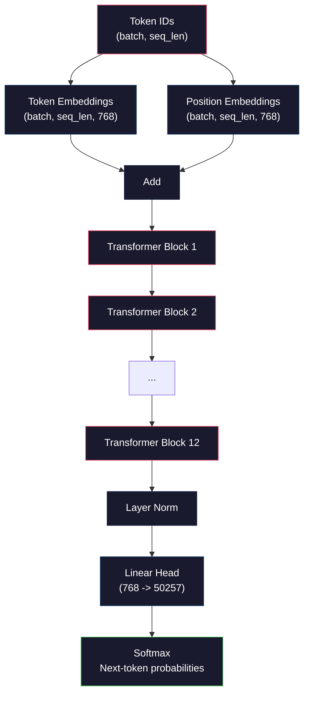
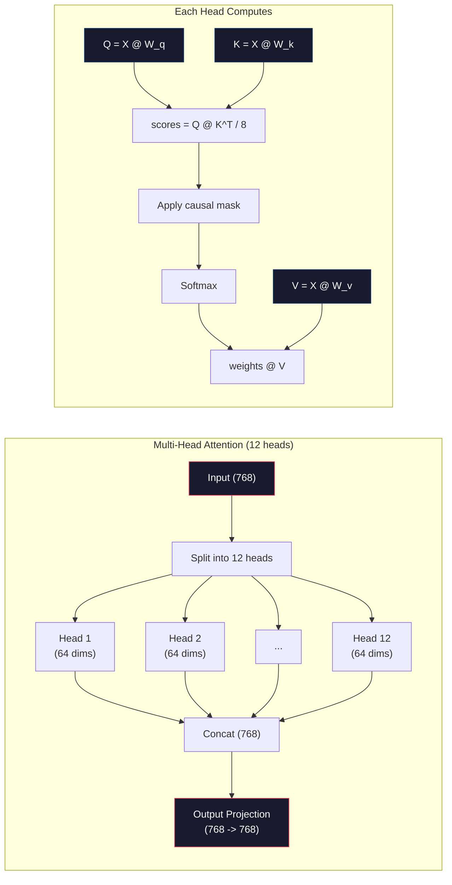
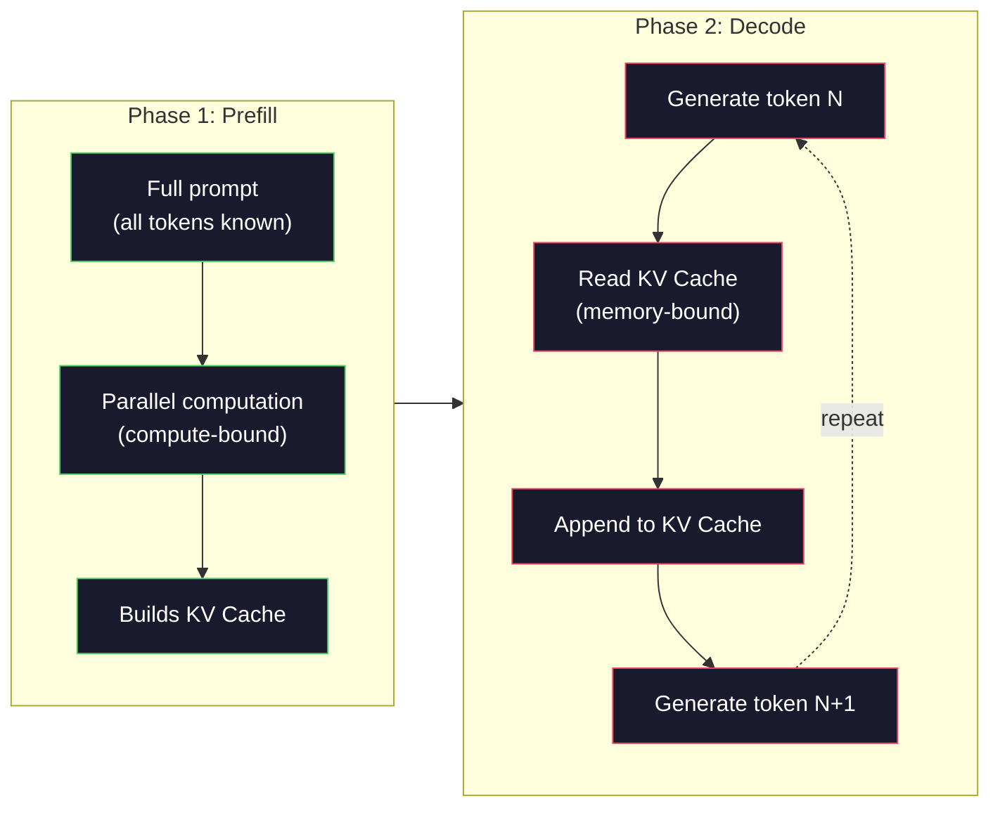

# Wstępne trenowanie Mini GPT (124M parametrów)

> GPT-2 Small ma 124 miliony parametrów. Składa się z 12 warstw transformatora, 12 głów uwagi i 768-wymiarowych osadzeń. Można go wytrenować od podstaw na jednym procesorze graficznym w ciągu kilku godzin. Większość ludzi nigdy tego nie robi — korzysta z gotowych punktów kontrolnych. Jeśli jednak samodzielnie nie przeprowadzisz treningu, tak naprawdę nie rozumiesz, co dzieje się w modelu, na którym budujesz produkty.

**Typ:** Kompilacja
**Języki:** Python (z numpy)
**Wymagania wstępne:** Faza 10, lekcje 01-03 (Tokenizatory, budowanie tokenizera, potoki danych)
**Czas:** ~120 minut

## Cele nauczania

- Zaimplementuj od podstaw pełną architekturę GPT-2 (124M parametrów): osadzenia tokenów, osadzenia pozycyjne, bloki transformatora i głowicę modelu językowego
- Trenuj model GPT na korpusie tekstowym, korzystając z przewidywania następnego tokenu z funkcją straty entropii krzyżowej
- Zaimplementuj autoregresyjne generowanie tekstu z próbkowaniem temperatury oraz filtrowaniem top-k/top-p
- Monitoruj krzywe strat podczas treningu i sprawdzaj, czy model uczy się spójnych wzorców językowych

## Problem

Wiesz, czym jest transformator. Czytałeś diagramy. Potrafisz recytować „wystarczy uwaga" i rysować na tablicy bloki z napisem „Uwaga wielogłowa".

To jeszcze nie oznacza, że rozumiesz, co się dzieje, gdy model generuje tekst.

W GPT-2 Small (z wiązaniem wag) znajduje się 124 438 272 parametrów. Każdy z nich został ustalony przez pętlę treningową: przepustka w przód, obliczenie straty, przepustka wstecz, aktualizacja wag. Dwanaście bloków transformatora. Dwanaście głów uwagi w każdym bloku. 768-wymiarowa przestrzeń osadzeń. Słownik złożony z 50 257 tokenów. Przy każdym generowanym tokenie wszystkie 124 miliony parametrów uczestniczą w jednym łańcuchu mnożeń macierzy, który pobiera sekwencję identyfikatorów tokenów i zwraca rozkład prawdopodobieństwa dla kolejnego tokenu.

Jeśli nigdy sam tego nie zbudowałeś, pracujesz z czarną skrzynką. Możesz korzystać z API. Możesz dostrajać model. Ale gdy coś pójdzie nie tak — gdy model halucynuje, powtarza się lub odmawia wykonania polecenia — nie masz mentalnego modelu wyjaśniającego *dlaczego*.

Ta lekcja buduje GPT-2 Small od podstaw. Nie w PyTorchu, lecz w numpy. Każde mnożenie macierzy jest widoczne. Każdy gradient jest obliczany przez Twój kod. Zobaczysz dokładnie, jak 124 miliony liczb współdziałają, przewidując kolejne słowo.

## Koncepcja

### Architektura GPT

GPT to autoregresyjny model językowy. „Autoregresja" oznacza generowanie jednego tokenu na raz, przy czym każdy kolejny zależy od wszystkich poprzednich. Architektura to stos bloków dekodera transformatora.

Poniżej przedstawiony jest pełny graf obliczeń — od identyfikatorów tokenów do prawdopodobieństw następnego tokenu:

1. Na wejście trafiają identyfikatory tokenów. Kształt: (batch_size, seq_len).
2. Wyszukiwanie osadzenia tokenu. Każdy identyfikator jest odwzorowywany na 768-wymiarowy wektor. Kształt: (batch_size, seq_len, 768).
3. Wyszukiwanie osadzenia pozycji. Każda pozycja (0, 1, 2, ...) jest odwzorowywana na 768-wymiarowy wektor. Ten sam kształt.
4. Dodanie osadzenia tokenu i osadzenia pozycji.
5. Przejście przez 12 bloków transformatora.
6. Końcowa normalizacja warstwy.
7. Liniowa projekcja na rozmiar słownika. Kształt: (batch_size, seq_len, vocab_size).
8. Softmax dający prawdopodobieństwa.

Na tym polega cały model. Bez splotów. Bez rekurencji. Tylko osadzenia, uwaga, sieci przekazujące i normalizacje warstw — ułożone 12 razy.



### Blok transformatora

Każdy z 12 bloków ma taki sam schemat. GPT-2 stosuje normalizację przed blokiem (pre-norm), a nie po nim jak oryginalny transformator:

1. Normalizacja warstwy
2. Wielogłowa samouwaga
3. Połączenie resztkowe (dodanie wejścia)
4. Normalizacja warstwy
5. Sieć przekazująca (MLP)
6. Połączenie resztkowe (dodanie wejścia)

Połączenia resztkowe mają kluczowe znaczenie. Bez nich gradienty zanikają, zanim w trakcie propagacji wstecznej dotrą do bloku 1. Dzięki nim gradienty mogą przepływać bezpośrednio od straty do dowolnej warstwy przez ścieżkę pomijającą. To właśnie dlatego można układać 12, 32, a nawet 96 bloków (podobno GPT-4 wykorzystuje 120).

### Uwaga: podstawowy mechanizm

Samouwaga pozwala każdemu tokenowi przyglądać się wszystkim poprzednim i decydować, ile uwagi im poświęcić. Oto matematyka.

Dla każdej pozycji tokenu obliczamy trzy wektory z wejścia:
- **Zapytanie (Q)**: „Czego szukam?"
- **Klucz (K)**: „Co zawiera moja pozycja?"
- **Wartość (V)**: „Jakie informacje przekazuję?"

```
Q = input @ W_q    (768 -> 768)
K = input @ W_k    (768 -> 768)
V = input @ W_v    (768 -> 768)

attention_scores = Q @ K^T / sqrt(d_k)
attention_scores = mask(attention_scores)   # causal mask: -inf for future positions
attention_weights = softmax(attention_scores)
output = attention_weights @ V
```

Maska przyczynowa sprawia, że GPT jest autoregresyjne. Pozycja 5 może uwzględniać pozycje 0–5, ale nie 6, 7, 8 i dalej. Zapobiega to „oszukiwaniu" przez model — sprawdzaniu przyszłych tokenów podczas treningu.

**Wielogłowa uwaga** dzieli 768-wymiarową przestrzeń na 12 głów po 64 wymiary każda. Każda głowa uczy się innego wzorca uwagi. Jedna może śledzić relacje składniowe (zgodność podmiotu z orzeczeniem), inna — podobieństwo semantyczne (synonimy), jeszcze inna — bliskość pozycyjną (sąsiedztwo słów). Wyniki ze wszystkich 12 głów są łączone i rzutowane z powrotem na 768 wymiarów.



Dzielenie przez sqrt(d_k) — sqrt(64) = 8 — pełni funkcję skalowania. Bez niego iloczyny skalarne przyjmują duże wartości przy wysokowymiarowych wektorach, wypychając softmax w obszary, gdzie gradienty są bliskie zeru. Było to jedno z kluczowych spostrzeżeń oryginalnego artykułu „Attention Is All You Need".

### Pamięć podręczna KV: dlaczego wnioskowanie jest szybkie

Podczas treningu przetwarzamy całą sekwencję naraz. Podczas wnioskowania generujemy tokeny jeden po drugim. Bez optymalizacji wygenerowanie tokenu N wymagałoby ponownego obliczenia uwagi dla wszystkich poprzednich N-1 tokenów — co daje złożoność O(N²) na token lub O(N³) łącznie dla sekwencji długości N.

KV Cache rozwiązuje ten problem. Po obliczeniu K i V dla każdego tokenu zapisujemy je. Generując token N+1, wystarczy obliczyć Q dla nowego tokenu i odczytać zbuforowane K i V ze wszystkich poprzednich tokenów. Zmniejsza to koszt na token z O(N) do O(1) w przypadku obliczeń K i V. Obliczenie wyniku uwagi nadal kosztuje O(N) — uwzględniamy bowiem wszystkie poprzednie pozycje — ale unikamy zbędnych mnożeń macierzy na danych wejściowych.

W GPT-2 z 12 warstwami i 12 głowami pamięć podręczna KV przechowuje 2 (K + V) × 12 warstw × 12 głów × 64 wymiary = 18 432 wartości na token. Dla sekwencji 1024 tokenów oznacza to około 75 MB w formacie FP32. W przypadku Llama 3 405B ze 128 warstwami pamięć podręczna KV dla pojedynczej sekwencji może przekroczyć 10 GB. Dlatego wnioskowanie przy długim kontekście jest ograniczone przez dostępną pamięć.

### Wstępne wypełnianie a dekodowanie: dwie fazy wnioskowania

Gdy wysyłasz zapytanie do modelu językowego, wnioskowanie przebiega w dwóch odrębnych fazach.

**Wstępne wypełnianie** przetwarza całe zapytanie równolegle. Wszystkie tokeny są znane, więc model oblicza uwagę dla wszystkich pozycji jednocześnie. Ta faza jest ograniczona obliczeniami — procesor graficzny wykonuje mnożenia macierzy przy pełnej przepustowości. Dla zapytania o 1000 tokenów na karcie A100 wstępne wypełnianie zajmuje około 20–50 ms.

**Dekodowanie** generuje tokeny pojedynczo. Każdy nowy token zależy od wszystkich poprzednich. Ta faza jest ograniczona przepustowością pamięci — wąskim gardłem jest odczyt wag modelu i pamięci podręcznej KV z pamięci GPU, nie sama matematyka macierzy. Rdzenie obliczeniowe procesora graficznego pozostają w dużej mierze bezczynne, czekając na dane z pamięci. W GPT-2 każdy krok dekodowania zajmuje mniej więcej tyle samo czasu niezależnie od liczby FLOP-ów wymaganych przez mnożenia macierzy, bo ograniczeniem jest przepustowość pamięci.

To rozróżnienie ma istotne znaczenie w systemach produkcyjnych. Przepustowość wstępnego wypełniania skaluje się z mocą obliczeniową GPU (więcej FLOPS = szybsze wypełnianie). Przepustowość dekodowania skaluje się z przepustowością pamięci (szybsza pamięć = szybsze generowanie). Właśnie dlatego NVIDIA H100 skupiła się na poprawie przepustowości pamięci względem A100 — bezpośrednio przyspiesza generowanie tokenów.



### Pętla treningowa

Trenowanie modelu językowego sprowadza się do przewidywania następnego tokenu. Mając tokeny [0, 1, 2, ..., N-1], przewidujemy tokeny [1, 2, 3, ..., N]. Funkcja straty to entropia krzyżowa między rozkładem prawdopodobieństwa modelu a rzeczywistym kolejnym tokenem.

Jeden krok treningowy:

1. **Przepustka w przód**: Przeprowadź partię przez wszystkie 12 bloków. Uzyskaj logity (wyniki przed softmaxem) dla każdej pozycji.
2. **Obliczenie straty**: Entropia krzyżowa między logitami a docelowymi tokenami (wejście przesunięte o jedną pozycję).
3. **Przepustka wstecz**: Oblicz gradienty dla wszystkich 124M parametrów metodą propagacji wstecznej.
4. **Krok optymalizatora**: Zaktualizuj wagi. GPT-2 używa optymalizatora Adam z rozgrzewaniem i kosinusowym harmonogramem współczynnika uczenia się.

Harmonogram współczynnika uczenia się ma większe znaczenie, niż mogłoby się wydawać. GPT-2 rozgrzewa się od 0 do szczytowego współczynnika przez pierwsze 2000 kroków, po czym następuje zanik zgodny z krzywą kosinusową. Zbyt wysoki współczynnik na starcie powoduje rozbieżność modelu. Utrzymywanie stale wysokiego współczynnika prowadzi do oscylacji w późniejszej fazie treningu. Wzorzec rozgrzewania i zaniku stosują wszystkie główne modele językowe.

### GPT-2 Small: liczby

| Składnik | Kształt | Parametry |
|----------|-------|------------|
| Osadzenie tokenów | (50257, 768) | 38 597 376 |
| Osadzenie pozycji | (1024, 768) | 786 432 |
| Uwaga na blok (W_q, W_k, W_v, W_out) | 4 x (768, 768) | 2 359 296 |
| FFN na blok (w górę + w dół) | (768, 3072) + (3072, 768) | 4 718 592 |
| Normalizacje warstw na blok (2x) | 2x768x2 | 3072 |
| Końcowa normalizacja warstwy | 768 x 2 | 1536 |
| **Łącznie na blok** | | **7 080 960** |
| **Razem (12 bloków)** | | **85 054 464 + 39 383 808 = 124 438 272** |

Projekcja wyjściowa (głowica logitów) współdzieli wagi z macierzą osadzeń tokenów. Nazywa się to wiązaniem wag — zmniejsza liczbę parametrów o 38M i poprawia wydajność, zmuszając model do korzystania z tej samej przestrzeni reprezentacji zarówno na wejściu, jak i na wyjściu.

## Zbuduj to

### Krok 1: Warstwa osadzeń

Osadzenie tokenów odwzorowuje każdy z 50 257 możliwych tokenów na 768-wymiarowy wektor. Osadzenie pozycji dodaje informację o miejscu tokenu w sekwencji. Oba wektory są sumowane.

```python
import numpy as np

class Embedding:
    def __init__(self, vocab_size, embed_dim, max_seq_len):
        self.token_embed = np.random.randn(vocab_size, embed_dim) * 0.02
        self.pos_embed = np.random.randn(max_seq_len, embed_dim) * 0.02

    def forward(self, token_ids):
        seq_len = token_ids.shape[-1]
        tok_emb = self.token_embed[token_ids]
        pos_emb = self.pos_embed[:seq_len]
        return tok_emb + pos_emb
```

Odchylenie standardowe 0,02 przy inicjalizacji pochodzi z artykułu GPT-2. Zbyt duże — i pierwsze przepustki w przód dają ekstremalne wartości destabilizujące trening. Zbyt małe — i pierwsze wyjścia są niemal identyczne dla wszystkich wejść, przez co wczesne sygnały gradientowe są bezużyteczne.

### Krok 2: Samouwaga z maską przyczynową

Zaczynamy od uwagi jednogłowej. Maska przyczynowa ustawia przyszłe pozycje na ujemną nieskończoność przed softmaxem, gwarantując, że każda pozycja uwzględnia tylko siebie i pozycje wcześniejsze.

```python
def attention(Q, K, V, mask=None):
    d_k = Q.shape[-1]
    scores = Q @ K.transpose(0, -1, -2 if Q.ndim == 4 else 1) / np.sqrt(d_k)
    if mask is not None:
        scores = scores + mask
    weights = np.exp(scores - scores.max(axis=-1, keepdims=True))
    weights = weights / weights.sum(axis=-1, keepdims=True)
    return weights @ V
```

Implementacja softmax odejmuje maksimum przed potęgowaniem. Bez tego exp(duża_liczba) przepełnia się do nieskończoności. To trick numeryczny, który nie zmienia wyniku, bo softmax(x − c) = softmax(x) dla dowolnej stałej c.

### Krok 3: Wielogłowa uwaga

768-wymiarowe wejście dzielimy na 12 głów po 64 wymiary każda. Każda głowa oblicza uwagę niezależnie. Wyniki są łączone i rzutowane z powrotem na 768 wymiarów.

```python
class MultiHeadAttention:
    def __init__(self, embed_dim, num_heads):
        self.num_heads = num_heads
        self.head_dim = embed_dim // num_heads
        self.W_q = np.random.randn(embed_dim, embed_dim) * 0.02
        self.W_k = np.random.randn(embed_dim, embed_dim) * 0.02
        self.W_v = np.random.randn(embed_dim, embed_dim) * 0.02
        self.W_out = np.random.randn(embed_dim, embed_dim) * 0.02

    def forward(self, x, mask=None):
        batch, seq_len, d = x.shape
        Q = (x @ self.W_q).reshape(batch, seq_len, self.num_heads, self.head_dim).transpose(0, 2, 1, 3)
        K = (x @ self.W_k).reshape(batch, seq_len, self.num_heads, self.head_dim).transpose(0, 2, 1, 3)
        V = (x @ self.W_v).reshape(batch, seq_len, self.num_heads, self.head_dim).transpose(0, 2, 1, 3)

        scores = Q @ K.transpose(0, 1, 3, 2) / np.sqrt(self.head_dim)
        if mask is not None:
            scores = scores + mask
        weights = np.exp(scores - scores.max(axis=-1, keepdims=True))
        weights = weights / weights.sum(axis=-1, keepdims=True)
        attn_out = weights @ V

        attn_out = attn_out.transpose(0, 2, 1, 3).reshape(batch, seq_len, d)
        return attn_out @ self.W_out
```

Sekwencja reshape–transpose–reshape jest najbardziej zawiłą częścią wielogłowej uwagi. Oto, co się dzieje: tensor (batch, seq_len, 768) przyjmuje postać (batch, seq_len, 12, 64), a następnie (batch, 12, seq_len, 64). Każda z 12 głów dysponuje własną macierzą (seq_len, 64), na której oblicza uwagę. Po tym kroku odwracamy operację: (batch, 12, seq_len, 64) → (batch, seq_len, 12, 64) → (batch, seq_len, 768).

### Krok 4: Blok transformatora

Jeden kompletny blok transformatora: LayerNorm, wielogłowa uwaga z połączeniem resztkowym, LayerNorm, sieć przekazująca z połączeniem resztkowym.

```python
class LayerNorm:
    def __init__(self, dim, eps=1e-5):
        self.gamma = np.ones(dim)
        self.beta = np.zeros(dim)
        self.eps = eps

    def forward(self, x):
        mean = x.mean(axis=-1, keepdims=True)
        var = x.var(axis=-1, keepdims=True)
        return self.gamma * (x - mean) / np.sqrt(var + self.eps) + self.beta

class FeedForward:
    def __init__(self, embed_dim, ff_dim):
        self.W1 = np.random.randn(embed_dim, ff_dim) * 0.02
        self.b1 = np.zeros(ff_dim)
        self.W2 = np.random.randn(ff_dim, embed_dim) * 0.02
        self.b2 = np.zeros(embed_dim)

    def forward(self, x):
        h = x @ self.W1 + self.b1
        h = np.maximum(0, h)  # GELU approximation: ReLU for simplicity
        return h @ self.W2 + self.b2

class TransformerBlock:
    def __init__(self, embed_dim, num_heads, ff_dim):
        self.ln1 = LayerNorm(embed_dim)
        self.attn = MultiHeadAttention(embed_dim, num_heads)
        self.ln2 = LayerNorm(embed_dim)
        self.ffn = FeedForward(embed_dim, ff_dim)

    def forward(self, x, mask=None):
        x = x + self.attn.forward(self.ln1.forward(x), mask)
        x = x + self.ffn.forward(self.ln2.forward(x))
        return x
```

Sieć przekazująca rozszerza 768-wymiarowe wejście do 3072 wymiarów (4×), stosuje nieliniowość, a następnie rzutuje z powrotem na 768. Ten wzorzec rozszerzania i zwężania daje modelowi „szerszą" wewnętrzną reprezentację w każdej pozycji. GPT-2 używa aktywacji GELU, lecz tutaj stosujemy ReLU dla uproszczenia — różnica jest niewielka z punktu widzenia zrozumienia architektury.

### Krok 5: Pełny model GPT

Składamy 12 bloków transformatora. Na początku umieszczamy warstwę osadzeń, na końcu — projekcję wyjściową.

```python
class MiniGPT:
    def __init__(self, vocab_size=50257, embed_dim=768, num_heads=12,
                 num_layers=12, max_seq_len=1024, ff_dim=3072):
        self.embedding = Embedding(vocab_size, embed_dim, max_seq_len)
        self.blocks = [
            TransformerBlock(embed_dim, num_heads, ff_dim)
            for _ in range(num_layers)
        ]
        self.ln_f = LayerNorm(embed_dim)
        self.vocab_size = vocab_size
        self.embed_dim = embed_dim

    def forward(self, token_ids):
        seq_len = token_ids.shape[-1]
        mask = np.triu(np.full((seq_len, seq_len), -1e9), k=1)

        x = self.embedding.forward(token_ids)
        for block in self.blocks:
            x = block.forward(x, mask)
        x = self.ln_f.forward(x)

        logits = x @ self.embedding.token_embed.T
        return logits

    def count_parameters(self):
        total = 0
        total += self.embedding.token_embed.size
        total += self.embedding.pos_embed.size
        for block in self.blocks:
            total += block.attn.W_q.size + block.attn.W_k.size
            total += block.attn.W_v.size + block.attn.W_out.size
            total += block.ffn.W1.size + block.ffn.b1.size
            total += block.ffn.W2.size + block.ffn.b2.size
            total += block.ln1.gamma.size + block.ln1.beta.size
            total += block.ln2.gamma.size + block.ln2.beta.size
        total += self.ln_f.gamma.size + self.ln_f.beta.size
        return total
```

Warto zwrócić uwagę na wiązanie wag: `logits = x @ self.embedding.token_embed.T`. Projekcja wyjściowa ponownie wykorzystuje macierz osadzeń tokenów (transponowaną). To nie tylko sposób na oszczędność parametrów. Oznacza to, że model stosuje tę samą przestrzeń wektorową do rozumienia tokenów (osadzenia) i ich przewidywania (logity).

### Krok 6: Pętla treningowa

Do rzeczywistego treningu przy 124M parametrach potrzebny byłby procesor graficzny i PyTorch. Poniższa pętla pokazuje mechanikę na małym modelu działającym w czystym numpy. Używamy zredukowanej konfiguracji (4 warstwy, 4 głowy, 128 wymiarów), by wszystko było łatwe w obsłudze.

```python
def cross_entropy_loss(logits, targets):
    batch, seq_len, vocab_size = logits.shape
    logits_flat = logits.reshape(-1, vocab_size)
    targets_flat = targets.reshape(-1)

    max_logits = logits_flat.max(axis=-1, keepdims=True)
    log_softmax = logits_flat - max_logits - np.log(
        np.exp(logits_flat - max_logits).sum(axis=-1, keepdims=True)
    )

    loss = -log_softmax[np.arange(len(targets_flat)), targets_flat].mean()
    return loss

def train_mini_gpt(text, vocab_size=256, embed_dim=128, num_heads=4,
                   num_layers=4, seq_len=64, num_steps=200, lr=3e-4):
    tokens = np.array(list(text.encode("utf-8")[:2048]))
    model = MiniGPT(
        vocab_size=vocab_size, embed_dim=embed_dim, num_heads=num_heads,
        num_layers=num_layers, max_seq_len=seq_len, ff_dim=embed_dim * 4
    )

    print(f"Model parameters: {model.count_parameters():,}")
    print(f"Training tokens: {len(tokens):,}")
    print(f"Config: {num_layers} layers, {num_heads} heads, {embed_dim} dims")
    print()

    for step in range(num_steps):
        start_idx = np.random.randint(0, max(1, len(tokens) - seq_len - 1))
        batch_tokens = tokens[start_idx:start_idx + seq_len + 1]

        input_ids = batch_tokens[:-1].reshape(1, -1)
        target_ids = batch_tokens[1:].reshape(1, -1)

        logits = model.forward(input_ids)
        loss = cross_entropy_loss(logits, target_ids)

        if step % 20 == 0:
            print(f"Step {step:4d} | Loss: {loss:.4f}")

    return model
```

Strata startuje w okolicach ln(vocab_size) — dla słownika 256 bajtów wynosi ln(256) = 5,55. Losowy model przypisuje każdemu tokenowi równe prawdopodobieństwo. W miarę postępu uczenia strata maleje, bo model uczy się rozpoznawać typowe wzorce: „th" po „t", spację po kropce i tak dalej.

W środowisku produkcyjnym stosuje się optymalizator Adam z akumulacją gradientów, rozgrzewaniem współczynnika uczenia się i obcinaniem gradientów. Pętla przepustka–strata–aktualizacja wsteczna pozostaje identyczna; optymalizator jest bardziej zaawansowany.

### Krok 7: Generowanie tekstu

Generowanie polega na tym, że wytrenowany model przewiduje po jednym tokenie na raz. Każda prognoza jest próbkowana z rozkładu wyjściowego lub wybierana zachłannie jako argmax.

```python
def generate(model, prompt_tokens, max_new_tokens=100, temperature=0.8):
    tokens = list(prompt_tokens)
    seq_len = model.embedding.pos_embed.shape[0]

    for _ in range(max_new_tokens):
        context = np.array(tokens[-seq_len:]).reshape(1, -1)
        logits = model.forward(context)
        next_logits = logits[0, -1, :]

        next_logits = next_logits / temperature
        probs = np.exp(next_logits - next_logits.max())
        probs = probs / probs.sum()

        next_token = np.random.choice(len(probs), p=probs)
        tokens.append(next_token)

    return tokens
```

Temperatura steruje losowością. Wartość 1,0 korzysta z surowego rozkładu. Wartość 0,5 wyostrza go (bardziej deterministyczny — model częściej wybiera tokeny o najwyższym prawdopodobieństwie). Wartość 1,5 spłaszcza go (bardziej losowy — tokeny o niskim prawdopodobieństwie mają większą szansę). Temperatura 0,0 to dekodowanie zachłanne (zawsze wybieramy token o najwyższym prawdopodobieństwie).

Okno `tokens[-seq_len:]` jest konieczne, ponieważ model ma maksymalną długość kontekstu (1024 dla GPT-2). Po jej przekroczeniu należy porzucić najstarsze tokeny. To właśnie jest „okno kontekstowe", o którym tyle się mówi.

## Użyj tego

### Pełne trenowanie i demonstracja generowania

```python
corpus = """The transformer architecture has revolutionized natural language processing.
Attention mechanisms allow the model to focus on relevant parts of the input.
Self-attention computes relationships between all pairs of positions in a sequence.
Multi-head attention splits the representation into multiple subspaces.
Each attention head can learn different types of relationships.
The feedforward network provides nonlinear transformations at each position.
Residual connections enable gradient flow through deep networks.
Layer normalization stabilizes training by normalizing activations.
Position embeddings give the model information about token ordering.
The causal mask ensures autoregressive generation during training.
Pre-training on large text corpora teaches the model general language understanding.
Fine-tuning adapts the pre-trained model to specific downstream tasks."""

model = train_mini_gpt(corpus, num_steps=200)

prompt = list("The transformer".encode("utf-8"))
output_tokens = generate(model, prompt, max_new_tokens=100, temperature=0.8)
generated_text = bytes(output_tokens).decode("utf-8", errors="replace")
print(f"\nGenerated: {generated_text}")
```

Na małym korpusie z niewielkim modelem wygenerowany tekst będzie co najwyżej półspójny. Model nauczy się pewnych wzorców na poziomie bajtów, lecz nie jest w stanie uogólniać tak, jak robi to GPT-2 trenowany na 40 GB danych z pełną architekturą 124M parametrów. Nie chodzi tu o jakość wyjścia. Chodzi o to, że można prześledzić każdy krok: wyszukiwanie osadzeń, obliczanie uwagi, transformację sieci przekazującej, projekcję logitów, softmax i próbkowanie. Każda operacja jest widoczna.

## Wyślij to

W ramach tej lekcji wygenerowany zostanie plik `outputs/prompt-gpt-architecture-analyzer.md` — zawiera on prompt analizujący wybory architektoniczne w dowolnym modelu w stylu GPT. Podaj mu kartę modelu lub raport techniczny, a przeanalizuje alokację parametrów, projekt uwagi i decyzje dotyczące skalowania.

## Ćwiczenia

1. Zmodyfikuj model tak, by używał 24 warstw i 16 głów zamiast 12/12. Policz parametry. Czym różni się podwojenie głębokości od podwojenia szerokości (wymiaru osadzeń)?

2. Zaimplementuj funkcję aktywacji GELU (GELU(x) = x * 0,5 * (1 + erf(x / sqrt(2)))) i zastąp nią ReLU w sieci przekazującej. Przeprowadź trening przez 500 kroków dla każdej aktywacji i porównaj końcowe straty.

3. Dodaj pamięć podręczną KV do funkcji generowania. Przechowuj tensory K i V dla każdej warstwy po pierwszej przepustce w przód i używaj ich ponownie przy kolejnych tokenach. Zmierz przyspieszenie: wygeneruj 200 tokenów z pamięcią podręczną i bez niej, porównując czas zegarowy.

4. Zaimplementuj próbkowanie top-k (uwzględniaj tylko k tokenów o najwyższym prawdopodobieństwie) oraz próbkowanie top-p (próbkowanie jądrowe: rozważ najmniejszy zbiór tokenów, którego skumulowane prawdopodobieństwo przekracza p). Porównaj jakość wyjścia przy temperaturze 0,8 dla top-k=50 i top-p=0,95.

5. Zbuduj wykres krzywej strat. Trenuj model przez 1000 kroków i nanieś stratę w funkcji kroku. Wyróżnij trzy fazy: szybki początkowy spadek (uczenie się częstych bajtów), wolniejszą fazę środkową (uczenie się wzorców bajtów) i plateau (przeuczenie na małym korpusie). Kształt tej krzywej jest taki sam niezależnie od tego, czy trenujesz model 128-wymiarowy, czy GPT-4.

## Kluczowe terminy

| Termin | Co się mówi | Co to właściwie oznacza |
|------|----------------|----------------------|
| Autoregresja | „Generuje jedno słowo na raz" | Każdy token wyjściowy jest warunkowany wszystkimi poprzednimi — model przewiduje P(token_n \| token_0, ..., token_{n-1}) |
| Maska przyczynowa | „Nie widzi przyszłości" | Górnotrójkątna macierz wartości -∞, która blokuje uwagę na przyszłe pozycje podczas treningu |
| Wielogłowa uwaga | „Wiele wzorców uwagi" | Podział Q, K, V na równoległe głowy (np. 12 głów po 64 wymiary w GPT-2), by każda mogła uczyć się innego rodzaju zależności |
| Pamięć podręczna KV | „Buforowanie przyspieszające wnioskowanie" | Przechowywanie obliczonych tensorów kluczy i wartości z poprzednich tokenów, by unikać zbędnych obliczeń podczas autoregresyjnego generowania |
| Wstępne wypełnianie | „Przetwarzanie zapytania" | Pierwsza faza wnioskowania, w której wszystkie tokeny zapytania przetwarzane są równolegle — ograniczona mocą obliczeniową GPU |
| Dekodowanie | „Generowanie tokenów" | Druga faza wnioskowania, w której tokeny są generowane po jednym — ograniczona przepustowością pamięci GPU |
| Wiązanie wag | „Współdzielenie osadzeń" | Użycie tej samej macierzy do osadzania tokenów wejściowych i wyjściowej głowicy projekcyjnej — pozwala zaoszczędzić 38M parametrów w GPT-2 |
| Połączenie resztkowe | „Połączenie pomijające" | Dodanie wejścia bezpośrednio do wyjścia podwarstwy (x + podwarstwa(x)) — umożliwia przepływ gradientów w głębokich sieciach |
| Normalizacja warstwy | „Normalizacja aktywacji" | Normalizacja wymiaru cech do średniej 0 i wariancji 1, z uczonymi parametrami skali i przesunięcia |
| Strata entropii krzyżowej | „Jak błędne są prognozy" | −log(prawdopodobieństwo przypisane właściwemu kolejnemu tokenowi), uśrednione po wszystkich pozycjach — standardowy cel treningu modeli językowych |

## Dalsze czytanie

– [Radford i in., 2019 – „Language Models are Unsupervised Multitask Learners" (GPT-2)](https://cdn.openai.com/better-language-models/language_models_are_unsupervised_multitask_learners.pdf) – artykuł GPT-2 przedstawiający rodzinę modeli od 124M do 1,5B parametrów
– [Vaswani i in., 2017 – „Attention Is All You Need"](https://arxiv.org/abs/1706.03762) – oryginalny artykuł o transformatorze ze skalowaną uwagą iloczynu skalarnego i uwagą wielogłową
– [Raport techniczny Llama 3](https://arxiv.org/abs/2407.21783) – jak Meta przeskalowała architekturę GPT do 405B parametrów z 16 tys. procesorów graficznych
– [Pope i in., 2022 – „Efficiently Scaling Transformer Inference"](https://arxiv.org/abs/2211.05102) – artykuł formalizujący analizę wstępnego wypełniania, dekodowania i pamięci podręcznej KV
