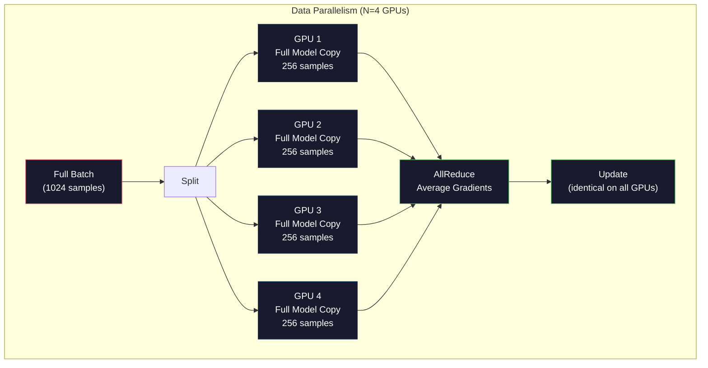
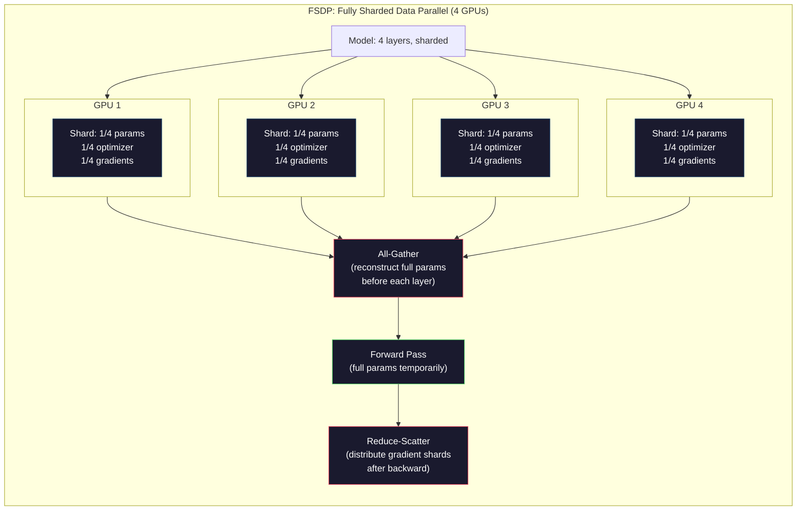
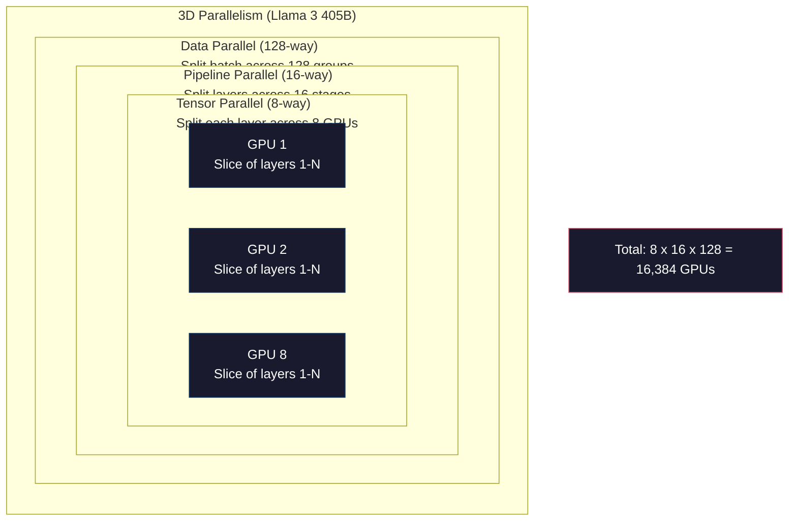

# Skalowanie: Szkolenie rozproszone, FSDP, DeepSpeed

> Twój model 124M trenowany na jednym procesorze graficznym. Teraz wypróbuj 7 miliardów parametrów. Model nie mieści się w pamięci. Dane zajmują tygodnie na jednej maszynie. Szkolenia rozproszone nie są opcjonalne na dużą skalę. To jedyna droga naprzód.

**Typ:** Kompilacja
**Języki:** Python
**Wymagania wstępne:** Faza 10, Lekcja 04 (Wstępne szkolenie Mini GPT)
**Czas:** ~120 minut

## Cele nauczania

- Wyjaśnij trzy typy równoległości (dane, tensor, potok) i kiedy każdy z nich jest konieczny, w oparciu o model i rozmiar klastra
- Wdrażaj szkolenie równoległe do danych przy użyciu PyTorch DDP z synchronizacją gradientów na wielu procesorach graficznych
- Oblicz budżet pamięci dla danego rozmiaru modelu (wagi + stany optymalizatora + gradienty + aktywacje), aby określić minimalny sprzęt
- Skonfiguruj etapy FSDP lub DeepSpeed ZeRO, aby podzielić stany modelu na fragmenty między procesorami graficznymi i dopasować modele przekraczające pamięć pojedynczego procesora graficznego

## Problem

Model z parametrami 7B w FP16 potrzebuje 14 GB na same wagi. Optymalizator Adam przechowuje dwie dodatkowe kopie każdego parametru (oszacowania pierwszego i drugiego momentu). To kolejne 28 GB. Gradienty podczas propagacji wstecznej dodają 14 GB więcej. Przed zapisaniem pojedynczej aktywacji masz 56 GB.

NVIDIA A100 ma 80 GB pamięci.

Zużyte 56 GB z 80 GB. Pozostawia to 24 GB na aktywacje – wartości pośrednie obliczone podczas przebiegu w przód, które muszą zostać zachowane na potrzeby propagacji wstecznej. W przypadku sekwencji 2048 tokenów z modelem 4096-wymiarowym aktywacje pojedynczej warstwy zajmują około 64 MB. Przy 32 warstwach potrzeba 2 GB na próbkę. Partia o rozmiarze 8 wymaga 16 GB. Masz 24 GB. Wysadza się partię o wielkości 12 sztuk.

Teraz wypróbuj parametry 70B. Sama waga: 140 GB w FP16. Nie mieści się na jednym GPU. Potrzebujesz co najmniej 2 A100 (2 x 80 GB = 160 GB), aby utrzymać ciężary. Dodaj stany i gradienty optymalizatora, a będziesz potrzebować znacznie więcej: minimum 3 lub więcej procesorów graficznych, a realistycznie 8-16, w zależności od strategii fragmentowania.

Llama 3 405B została przeszkolona na 16 384 procesorach graficznych NVIDIA H100. Szkolenie kosztowało szacunkowo $100 million in compute. DeepSeek V3 trained a comparable model for roughly $5,6 miliona, biorąc pod uwagę sprytne podejście do architektury (mieszanka ekspertów oznacza, że ​​tylko ułamek parametrów jest aktywowany na token) i efektywność szkolenia.

W tej lekcji omówiono cztery strategie umożliwiające szkolenie na dużą skalę: równoległość danych, równoległość tensorów, równoległość potoków i równoległość danych w pełni podzielonych na fragmenty. Będziesz symulował każdy z nich w czystym Pythonie, aby zrozumieć mechanikę, zanim dotkniesz rozproszonego środowiska szkoleniowego.

## Koncepcja

### Dlaczego wymagana jest dystrybucja

Oto matematyka pamięci dla prawdziwych modeli. Każda liczba jest obliczana, a nie szacowana.

| Modelka | Parametry | Wagi (PR16) | Adam stwierdza | Gradienty (FP16) | Razem (brak aktywacji) |
|-------|-------|----------------|------------|--------------------------------|----------------------|
| GPT-2 Mały | 124M | 248 MB | 992 MB | 248 MB | 1,5 GB |
| Lama 3 8B | 8B | 16 GB | 64 GB | 16 GB | 96 GB |
| Lama 3 70B | 70B | 140 GB | 560 GB | 140 GB | 840 GB |
| Lama 3 405B | 405B | 810 GB | 3240 GB | 810 GB | 4860 GB |

Kolumna „Adam States” jest zabójcza. Adam przechowuje średnią kroczącą (m) i wariancję bieżącą (v) dla każdego parametru, oba w FP32. W przypadku modelu 70B jest to 70B x 4 bajty x 2 = 560 GB. Sam optymalizator potrzebuje siedmiu A100.

Pojedynczy H100 ma 80 GB. Lama 3 405B potrzebuje co najmniej 61 H100 do utrzymania obciążników, optymalizatora i nachylenia. Dodaj aktywacje, a liczba będzie dalej rosła. Meta użyła 16 384 procesorów graficznych nie dlatego, że chciała, ale dlatego, że musiała.

### Równoległość danych

Najprostsza strategia rozproszona. Skopiuj cały model do N procesorów graficznych. Podziel każdą partię treningową na N równych części. Każdy procesor graficzny wykonuje przebieg do przodu i do tyłu na swoim fragmencie danych. Po przejściu wstecz uśrednij gradienty na wszystkich procesorach graficznych. Każdy procesor graficzny aktualizuje swoją kopię wag przy użyciu tych samych uśrednionych gradientów, zapewniając synchronizację wszystkich kopii.

**Dobro:** Liniowe skalowanie przepustowości. N procesorów graficznych przetwarza N razy więcej danych na krok. Komunikacja ogranicza się do uśredniania gradientowego, które pokrywa się z obliczeniami.

**Wady:** każdy procesor graficzny przechowuje pełną kopię modelu, stanów optymalizatora i gradientów. W przypadku modelu 70B każdy procesor graficzny potrzebuje 840 GB. Równoległość danych w żaden sposób nie zmniejsza pamięci przypadającej na procesor graficzny. To tylko skraca czas szkolenia.

**Matematyka:** Efektywny rozmiar partii = per_gpu_batch_size x N. Dla N=64 procesorów graficznych z partią 16 na procesor graficzny, efektywna partia wynosi 1024. Lama 3 wykorzystała efektywną wielkość partii wynoszącą 16 milionów tokenów na krok.



### Równoległość tensorowa

Podziel poszczególne warstwy na procesory graficzne. Pojedyncze mnożenie macierzy jest dzielone pomiędzy procesory graficzne, a każda część obliczeniowa wyniku.

Rozważmy macierz wag kształtu (8192, 8192) w warstwie wyprzedzającej. Dzięki 4-kierunkowej równoległości tensorów każdy procesor graficzny przechowuje fragment (8192, 2048). Każdy procesor graficzny mnoży dane wejściowe przez swój fragment, dając częściowy wynik. Wyniki częściowe są łączone (za pomocą metody all-reduce lub all-gather) w celu uzyskania pełnego wyniku.

**Dobro:** Zmniejsza pamięć przypadającą na procesor graficzny w zależności od wagi modelu. Model 70B podzielony na 8 procesorów graficznych oznacza, że ​​każdy procesor graficzny obsługuje parametry o wartości ~8,75B.

**Wada:** wymaga szybkiej komunikacji między procesorami graficznymi po każdej warstwie. All-Reduce po każdym matmul dodaje opóźnienie. Działa to dobrze w przypadku NVLink (900 GB/s między procesorami graficznymi w tym samym węźle), ale słabo w przypadku węzłów połączonych za pomocą InfiniBand (400 Gb/s, około 50 GB/s). Równoległość tensorów prawie zawsze ogranicza się do jednego węzła (8 procesorów graficznych).

**Prawdziwe zastosowanie:** Megatron-LM był pionierem równoległości tensorów. Lama 3 405B wykorzystuje 8-kierunkową równoległość tensorów w każdym węźle.

### Równoległość rurociągów

Podziel model na warstwy. GPU 1 obsługuje warstwy 1-8. GPU 2 obsługuje warstwy 9-16. GPU 3 obsługuje warstwy 17-24. GPU 4 obsługuje warstwy 25-32. Dane przepływają potokiem: procesor graficzny 1 oblicza swoje warstwy i wysyła aktywacje do procesora graficznego 2, który oblicza swoje warstwy i wysyła je do procesora graficznego 3 i tak dalej.

**Dobro:** Minimalna komunikacja pomiędzy procesorami graficznymi – tylko aktywacje na granicach warstw, które są niewielkie w porównaniu do gradientów i wag. Działa między węzłami, ponieważ wymagania dotyczące przepustowości są niskie.

**Wady:** Pęcherzyki w rurociągach. Kiedy procesor graficzny 4 oblicza przepływ w przód mikropartii 1, procesory graficzne 1, 2 i 3 są bezczynne (przesłały już swoją część). Podczas przejścia do tyłu wzór ulega odwróceniu. W przypadku naiwnego potokowania wykorzystanie procesora graficznego wynosi tylko 1/N dla N etapów potoku.

**GPipe i PipeDream** rozwiązują problem pęcherzyków, dzieląc partię na mikropartie. Procesor GPU 1 uruchamia mikropartię 2 zaraz po zakończeniu przesyłania mikropartii 1. Nakłada się to na obliczenia na poszczególnych etapach potoku. W przypadku M mikropartii i N etapów frakcja pęcherzyków spada do (N-1)/M. Użyj M=16 mikropartii z N=4 etapami, a czas przestoju wynosi 3/16 = 18,75%.

### FSDP: w pełni podzielone dane równolegle

FSDP łączy skalowalność równoległości danych z wydajnością pamięci dzięki shardingowi. Zamiast posiadania przez każdy procesor graficzny pełnej kopii modelu, każdy procesor graficzny przechowuje tylko 1/N parametrów, gradientów i stanów optymalizatora.

Przed przejściem warstwy do przodu FSDP uruchamia **all-gather** w celu zebrania pełnych parametrów ze wszystkich procesorów graficznych do pamięci każdego procesora graficznego. Po przekazaniu do przodu każdy procesor graficzny odrzuca parametry nielokalne. Podczas cofania funkcja zbierania danych jest uruchamiana ponownie w celu zrekonstruowania parametrów do obliczeń gradientu. Po przejściu wstecz **redukcja rozproszenia** rozdziela fragmenty gradientów, tak że każdy procesor graficzny przechowuje tylko 1/N gradientów.

** Obliczenia dla modelu 70B na 8 procesorach graficznych:**

| Składnik | Bez FSDP | Z FSDP |
|----------|------------|----------|
| Wagi (PR16) | 140 GB na procesor graficzny | 17,5 GB na procesor graficzny |
| Stany Adama (3PR) | 560 GB na procesor graficzny | 70 GB na procesor graficzny |
| Gradienty (FP16) | 140 GB na procesor graficzny | 17,5 GB na procesor graficzny |
| **Razem** | **840 GB na procesor graficzny** | **105 GB na procesor graficzny** |

Bez FSDP nie można zmieścić modelu 70B na pojedynczym procesorze graficznym 80 GB. Przy FSDP na 8 procesorach graficznych każdy procesor graficzny wykorzystuje 105 GB — czekaj, to wciąż nie pasuje. Potrzebujesz co najmniej 16 procesorów graficznych, aby uzyskać mniej niż 80 GB na procesor graficzny, lub łączysz FSDP z punktami kontrolnymi aktywacji (przeliczaj aktywacje podczas odtwarzania wstecz, zamiast je przechowywać).

Koszt komunikacji jest wyższy niż zwykła równoległość danych ze względu na gromadzenie wszystkich danych przed każdą warstwą. Jednak oszczędność pamięci umożliwia niemożliwe wcześniej przebiegi treningowe.



### DeepSpeed Zero

Rozwiązanie ZeRO (Zero Redundancy Optimizer) firmy DeepSpeed jest koncepcyjnie identyczne z FSDP, ale zostało opracowane niezależnie przez firmę Microsoft. Definiuje trzy etapy, z których każdy sharding jest bardziej agresywny:

| Scena | Odłamki | Oszczędność pamięci | Komunikacja |
|-------|--------|-------------------|--------------|
| ZeRO-1 | Optymalizator tylko stwierdza | ~4x redukcja | To samo co dane równoległe |
| ZeRO-2 | + Gradienty | ~8x redukcja | Nieco więcej |
| ZeRO-3 | + Parametry | ~Nx redukcja (N GPU) | Zbierz wszystko na warstwę |

ZeRO-3 jest odpowiednikiem FSDP. Nazewnictwo jest inne, mechanizm jest ten sam. PyTorch dodał FSDP jako natywną implementację po tym, jak DeepSpeed ​​potwierdził tę koncepcję.

DeepSpeed ​​wprowadził także ZeRO-Offload (odciążenie stanów optymalizatora do pamięci RAM procesora, która jest tańsza i większa) oraz ZeRO-Infinity (odciążenie do dysków SSD NVMe). Zamieniają one prędkość obliczeniową na pojemność pamięci — odciążone operacje są wolniejsze, ale zwalniają pamięć GPU.

### Mieszany trening precyzyjny

Nowoczesne szkolenie wykorzystuje jednocześnie wiele formatów zmiennoprzecinkowych:

- **Przejście do przodu**: FP16 lub BF16 (16-bit). Połowa pamięci FP32. Matmuls działają 2x szybciej na rdzeniach tensorowych.
- **Wagi główne**: FP32 (32-bit). Obsługiwane przez optymalizator w celu zapewnienia precyzji numerycznej podczas aktualizacji wagi.
- **Skalowanie strat**: Pomnóż stratę przez dużą stałą przed przejściem do tyłu, aby zapobiec spadkowi gradientów FP16 do zera. Podziel przez tę samą stałą przed krokiem optymalizatora.

BF16 (Brain Float 16) ma ten sam zakres wykładników co FP32 (8 bitów wykładnika), ale zmniejszoną precyzję (7 bitów mantysy w porównaniu do 23 bitów FP32). Rzadko wymaga skalowania strat, ponieważ może reprezentować ten sam zakres wartości. FP16 ma 5 bitów wykładnika i 10 bitów mantysy - może reprezentować drobnoziarniste wartości, ale przekroczenia/niedomiaru przy ekstremalnych wielkościach.

TPU Google używają natywnie BF16. Karty A100 i H100 firmy NVIDIA obsługują zarówno FP16, jak i BF16. Branża w dużej mierze przeniosła się na BF16, ponieważ eliminuje to problemy związane ze skalowaniem strat.

**Porównanie pamięci dla modelu 7B:**

| Precyzja | Ciężary | Optymalizator | Gradienty | Razem |
|-----------|---------|----------|-----------|-------|
| FP32 wszędzie | 28 GB | 56 GB | 28 GB | 112 GB |
| Mieszane (master BF16 + FP32) | 14 GB | 56 GB | 14 GB | 84 GB |

Mieszana precyzja pozwala zaoszczędzić 28 GB w tym modelu. Stany optymalizatora pozostają w FP32 niezależnie od tego, gdzie trafia większość pamięci.

### Megatron-LM i równoległość 3D

Prawdziwe szkolenie na dużą skalę łączy w sobie wszystkie trzy równoległości:

- **Równoległość danych** w grupach węzłów (wielkość partii w skali)
- **Równoległość tensorów** w węźle (podział warstw na 8 procesorów graficznych)
- **Równoległość potoku** między węzłami (podział grup warstw na maszyny)

Lama 3 405B na 16 384 H100:
- 8-kierunkowa równoległość tensorów w każdym węźle (8 procesorów graficznych na węzeł)
- 16-kierunkowa równoległość rurociągów pomiędzy węzłami (16 etapów rurociągu)
- 128-kierunkowa równoległość danych w pozostałym wymiarze (16 384/8/16 = 128)

Ta dekompozycja 3D (8 x 16 x 128 = 16 384) przedstawia sposób skalowania do tysięcy procesorów graficznych. Każdy procesor graficzny widzi inny fragment danych (dane równoległe), przechowuje jeden wycinek każdej warstwy (równolegle tensorowe) i oblicza inny zestaw warstw (równoległy potok).

DeepSeek V3 przyjął inne podejście. Ich architektura Mixture of Experts aktywuje tylko 37B z 671B parametrów na token. Oznacza to, że każdy procesor graficzny musi jedynie obliczyć (i zapisać aktywacje) aktywnych parametrów. Szkolenie odbywało się na 2048 procesorach graficznych H800 – mniej niż 1/8 liczby procesorów graficznych Meta – przez $5.6M vs Meta's estimated $100M.



## Zbuduj to

### Krok 1: Symuluj równoległość danych

Podziel partię na symulowane procesory graficzne. Każdy procesor graficzny oblicza przebieg w przód na swoim fragmencie. Uśrednij „gradienty” (symulujemy je jako wartości strat).

```python
import numpy as np

def simulate_data_parallelism(data, num_gpus, model_fn):
    batch_size = len(data)
    shard_size = batch_size // num_gpus
    remainder = batch_size % num_gpus

    gpu_losses = []
    gpu_gradients = []

    offset = 0
    for gpu_id in range(num_gpus):
        extra = 1 if gpu_id < remainder else 0
        shard = data[offset:offset + shard_size + extra]
        offset += shard_size + extra

        loss, grad = model_fn(shard)
        gpu_losses.append(loss)
        gpu_gradients.append(grad)

    avg_loss = np.mean(gpu_losses)
    avg_gradient = np.mean(gpu_gradients, axis=0)

    return avg_loss, avg_gradient
```

Operacja all-reduce (uśrednianie gradientów) jest jedyną komunikacją w równoległości danych. W praktyce wykorzystuje to bibliotekę NCCL na procesorach graficznych NVIDIA, która implementuje redukcję pierścieniową: każdy procesor graficzny wysyła 1/N swoich gradientów do sąsiada, otrzymuje 1/N od drugiego sąsiada, a po N-1 krokach każdy procesor graficzny ma pełną średnią. Całkowity wolumen komunikacji: 2 x rozmiar_gradientu x (N-1)/N, zbliżający się do 2-krotności rozmiaru gradientu dla dużego N.

### Krok 2: Symuluj równoległość tensorów

Podziel macierz wag na procesory graficzne. Każdy procesor graficzny oblicza częściowe mnożenie macierzy. Połącz wyniki.

```python
def simulate_tensor_parallelism(input_data, weight_matrix, num_gpus):
    d_in, d_out = weight_matrix.shape
    assert d_out % num_gpus == 0, f"d_out {d_out} not divisible by num_gpus {num_gpus}"
    shard_size = d_out // num_gpus

    partial_results = []
    for gpu_id in range(num_gpus):
        start = gpu_id * shard_size
        end = start + shard_size
        weight_shard = weight_matrix[:, start:end]

        partial = input_data @ weight_shard
        partial_results.append(partial)

    full_output = np.concatenate(partial_results, axis=-1)

    direct_output = input_data @ weight_matrix
    error = np.abs(full_output - direct_output).max()

    return full_output, error
```

Błąd powinien wynosić dokładnie zero (lub epsilon maszynowy). Równoległość tensorów jest matematycznie dokładna — daje taki sam wynik, jak obliczenie pełnego matmul na jednym procesorze graficznym. Podział odbywa się wzdłuż wymiaru wyjściowego, więc każdy procesor graficzny tworzy inny fragment kolumn, a połączenie rekonstruuje pełny wynik.

W przypadku warstw liniowych równoległych do kolumn (dzielenie wymiaru wyjściowego) należy połączyć. W przypadku wierszy równoległych (dzielenie wymiaru wejściowego) sumujesz. W transformatorze FFN pierwsza linia liniowa (rozszerzanie) wykorzystuje równoległość do kolumn, a druga liniowa (kontrakt) wykorzystuje równoległość rzędów. Pozwala to uniknąć całkowitego zmniejszenia pomiędzy dwiema warstwami.

### Krok 3: Symuluj równoległość rurociągu

Podziel warstwy modelu na wirtualne procesory graficzne. Pokaż problem bąbelkowy, w którym wczesne etapy pozostają bezczynne, podczas gdy późniejsze etapy wykonują obliczenia.

```python
def simulate_pipeline_parallelism(num_layers, num_stages, num_microbatches):
    layers_per_stage = num_layers // num_stages

    timeline = {}
    clock = 0

    for mb in range(num_microbatches):
        for stage in range(num_stages):
            start_time = max(
                timeline.get((stage, mb - 1, "fwd"), (0, 0))[1] if mb > 0 else 0,
                timeline.get((stage - 1, mb, "fwd"), (0, 0))[1] if stage > 0 else 0,
            )
            end_time = start_time + layers_per_stage
            timeline[(stage, mb, "fwd")] = (start_time, end_time)

    last_fwd_end = max(v[1] for v in timeline.values())

    for mb in range(num_microbatches - 1, -1, -1):
        for stage in range(num_stages - 1, -1, -1):
            deps = [last_fwd_end]
            if mb < num_microbatches - 1 and (stage, mb + 1, "bwd") in timeline:
                deps.append(timeline[(stage, mb + 1, "bwd")][1])
            if stage < num_stages - 1 and (stage + 1, mb, "bwd") in timeline:
                deps.append(timeline[(stage + 1, mb, "bwd")][1])
            start_time = max(deps)
            end_time = start_time + layers_per_stage
            timeline[(stage, mb, "bwd")] = (start_time, end_time)

    total_time = max(v[1] for v in timeline.values())
    compute_time = num_microbatches * num_stages * layers_per_stage * 2
    bubble_fraction = 1.0 - compute_time / (total_time * num_stages)

    return timeline, total_time, bubble_fraction
```

Przy 4 etapach i 1 mikropartii frakcja pęcherzyków wynosi 75% — trzy z czterech procesorów graficznych są w dowolnym momencie bezczynne. Przy 16 mikropartiach spada do około 19%. Kosztem eliminacji bąbelków jest pamięć: musisz jednocześnie przechowywać aktywacje wszystkich mikropartii w locie.

### Krok 4: Kalkulator pamięci

Oblicz dokładne wymagania dotyczące pamięci do szkolenia dowolnego rozmiaru modelu.

```python
def memory_calculator(
    params_billions,
    precision_bytes=2,
    optimizer="adam",
    num_gpus=1,
    sharding="none",
    sequence_length=2048,
    batch_size_per_gpu=1,
    hidden_dim=None,
    num_layers=None,
):
    params = params_billions * 1e9

    weight_memory = params * precision_bytes

    if optimizer == "adam":
        optimizer_memory = params * 4 * 2
    elif optimizer == "sgd":
        optimizer_memory = params * 4
    else:
        optimizer_memory = 0

    gradient_memory = params * precision_bytes

    total_no_activation = weight_memory + optimizer_memory + gradient_memory

    if hidden_dim and num_layers:
        activation_per_layer = (
            sequence_length * batch_size_per_gpu * hidden_dim * precision_bytes * 4
        )
        activation_memory = activation_per_layer * num_layers
    else:
        activation_memory = params * precision_bytes * 0.5

    if sharding == "fsdp" or sharding == "zero3":
        weight_memory /= num_gpus
        optimizer_memory /= num_gpus
        gradient_memory /= num_gpus
    elif sharding == "zero2":
        optimizer_memory /= num_gpus
        gradient_memory /= num_gpus
    elif sharding == "zero1":
        optimizer_memory /= num_gpus

    per_gpu_total = weight_memory + optimizer_memory + gradient_memory + activation_memory

    return {
        "params_billions": params_billions,
        "weights_gb": weight_memory / 1e9,
        "optimizer_gb": optimizer_memory / 1e9,
        "gradients_gb": gradient_memory / 1e9,
        "activations_gb": activation_memory / 1e9,
        "per_gpu_total_gb": per_gpu_total / 1e9,
        "total_across_gpus_gb": per_gpu_total * num_gpus / 1e9,
        "fits_on_80gb": per_gpu_total / 1e9 <= 80,
        "num_gpus": num_gpus,
        "sharding": sharding,
    }
```

Ten kalkulator odpowiada na pytanie, które zadaje sobie każdy inżynier ML: „Ile procesorów graficznych potrzebuję?” Podaj mu rozmiar modelu i sprawdź, czy pasuje. Dostosuj strategię fragmentowania, aż łączna wielkość przypadająca na procesor graficzny spadnie poniżej 80 GB.

### Krok 5: Mieszana symulacja precyzji

Porównaj wykorzystanie pamięci w treningu FP32, FP16 i treningu o mieszanej precyzji.

```python
def mixed_precision_comparison(params_billions):
    params = params_billions * 1e9

    fp32_weights = params * 4
    fp32_optimizer = params * 4 * 2
    fp32_gradients = params * 4
    fp32_total = fp32_weights + fp32_optimizer + fp32_gradients

    fp16_weights = params * 2
    fp16_master = params * 4
    fp16_optimizer = params * 4 * 2
    fp16_gradients = params * 2
    fp16_total = fp16_weights + fp16_master + fp16_optimizer + fp16_gradients

    mixed_weights = params * 2
    mixed_optimizer = params * 4 * 2
    mixed_gradients = params * 2
    mixed_total = mixed_weights + mixed_optimizer + mixed_gradients

    return {
        "fp32_total_gb": fp32_total / 1e9,
        "fp16_with_master_gb": fp16_total / 1e9,
        "mixed_bf16_gb": mixed_total / 1e9,
        "savings_vs_fp32": 1 - mixed_total / fp32_total,
    }
```

Największe zaskoczenie dla większości ludzi: mieszana precyzja nie zmniejsza o połowę pamięci. Stany optymalizatora (m i v Adama) pozostają w FP32 niezależnie od precyzji. W przypadku modelu 7B szkolenie FP32 wykorzystuje 112 GB. Mieszana precyzja wykorzystuje 84 GB. To jest obniżka o 25%, a nie 50%. Optymalizator dominuje.

## Użyj tego

### Uruchom wszystkie symulacje

```python
def run_all_demos():
    print("=" * 70)
    print("DATA PARALLELISM SIMULATION")
    print("=" * 70)

    np.random.seed(42)
    data = np.random.randn(64, 32)
    weight = np.random.randn(32, 16)

    def model_fn(batch):
        output = batch @ weight
        loss = np.mean(output ** 2)
        grad = 2 * batch.T @ (batch @ weight) / len(batch)
        return loss, grad

    for n_gpus in [1, 2, 4, 8]:
        loss, grad = simulate_data_parallelism(data, n_gpus, model_fn)
        print(f"  {n_gpus} GPUs: loss={loss:.4f}, grad_norm={np.linalg.norm(grad):.4f}")

    print()
    print("=" * 70)
    print("TENSOR PARALLELISM SIMULATION")
    print("=" * 70)

    x = np.random.randn(4, 8192)
    W = np.random.randn(8192, 8192)

    for n_gpus in [1, 2, 4, 8]:
        output, error = simulate_tensor_parallelism(x, W, n_gpus)
        print(f"  {n_gpus} GPUs: output_shape={output.shape}, max_error={error:.2e}")

    print()
    print("=" * 70)
    print("PIPELINE PARALLELISM SIMULATION")
    print("=" * 70)

    for n_mb in [1, 4, 8, 16, 32]:
        _, total_t, bubble = simulate_pipeline_parallelism(32, 4, n_mb)
        print(f"  {n_mb:2d} micro-batches: total_time={total_t:4d}, bubble={bubble:.1%}")

    print()
    print("=" * 70)
    print("MEMORY CALCULATOR")
    print("=" * 70)

    configs = [
        (7, "none", 1),
        (7, "fsdp", 8),
        (70, "none", 1),
        (70, "fsdp", 8),
        (70, "fsdp", 16),
        (405, "fsdp", 64),
        (405, "fsdp", 128),
    ]

    print(f"  {'Model':>8} {'Sharding':>8} {'GPUs':>5} {'Per-GPU':>10} {'Fits 80GB':>10}")
    print("  " + "-" * 50)
    for params, shard, gpus in configs:
        result = memory_calculator(params, num_gpus=gpus, sharding=shard)
        fits = "Yes" if result["fits_on_80gb"] else "No"
        print(f"  {params:>6}B {shard:>8} {gpus:>5} {result['per_gpu_total_gb']:>8.1f}GB {fits:>10}")

    print()
    print("=" * 70)
    print("MIXED PRECISION COMPARISON")
    print("=" * 70)

    for params_b in [7, 13, 70, 405]:
        result = mixed_precision_comparison(params_b)
        print(f"  {params_b}B: FP32={result['fp32_total_gb']:.0f}GB, "
              f"Mixed BF16={result['mixed_bf16_gb']:.0f}GB, "
              f"Savings={result['savings_vs_fp32']:.0%}")
```

## Wyślij to

Ta lekcja generuje `outputs/prompt-distributed-training-planner.md` — monit, który pobiera rozmiar modelu i dostępny sprzęt, a następnie tworzy kompletny rozproszony plan szkolenia: strategia równoległości, budżet pamięci, obciążenie komunikacyjne i oczekiwana przepustowość.

## Ćwiczenia

1. Zmodyfikuj kalkulator pamięci, aby uwzględnić punkt kontrolny aktywacji. W przypadku punktów kontrolnych przechowuj tylko aktywacje w każdej K-tej warstwie (typowo K = 1, co oznacza ponowne obliczenie wszystkiego). Pokaż kompromis między pamięcią a obliczeniami: ile pamięci oszczędza punkt kontrolny i o ile spowalnia trening (około 33% więcej mocy obliczeniowej w przypadku pełnego punktu kontrolnego)?

2. Rozszerz symulację równoległości rurociągu, aby zaimplementować harmonogram 1F1B (jeden do przodu, jeden do tyłu) używany przez PipeDream. Porównaj frakcję pęcherzykową z naiwnym harmonogramem dla 4 etapów i 8 mikropartii. Harmonogram 1F1B powinien mieć mniejszą pamięć szczytową, ponieważ wcześniej rozpoczyna przejścia wstecz.

3. Zaimplementuj symulator akumulacji gradientu. Zamiast całkowicie redukować po każdej mikropartii, gromadź gradienty lokalnie dla K kroków, a następnie całkowicie redukuj. Pokaż, jak zmniejsza to komunikację K razy, ale daje identyczne gradienty końcowe (a tym samym identyczne szkolenie).

4. Zbuduj estymator kosztów. Biorąc pod uwagę rozmiar modelu, docelową liczbę tokenów, typ procesora GPU (A100 przy $2/hr, H100 at $3,50/hr) i strategię równoległości, oszacuj całkowity koszt szkolenia w dolarach. Porównaj ze znanymi kosztami: według doniesień lama 3 405B kosztowała ~$100M, DeepSeek V3 cost ~$5,6 mln.

5. Dodaj ZeRO-Offload do kalkulatora pamięci. Załóżmy, że pamięć RAM procesora wynosi 512 GB na węzeł, a pamięć NVMe to 2 TB. Pokaż, jak przeniesienie stanów optymalizatora na procesor umożliwia modelowi 70B trenowanie na 4 procesorach graficznych zamiast 16, kosztem 30–50% wolniejszych kroków optymalizatora.

## Kluczowe terminy

| Termin | Co ludzie mówią | Co to właściwie oznacza |
|------|----------------|----------------------|
| Równoległość danych | „Skopiuj model do każdego procesora graficznego” | Każdy procesor graficzny przetwarza inny fragment danych; gradienty są uśredniane za pomocą funkcji all-reduce po każdym kroku |
| Równoległość tensorowa | „Podziel warstwę na procesory graficzne” | Macierze wag partycji, dzięki czemu każdy procesor graficzny oblicza część matmul; wymaga szybkiego interkonektu NVLink |
| Równoległość rurociągu | „Podziel warstwy na procesory graficzne” | Każdy procesor graficzny obsługuje inną grupę warstw; dane przepływają rurociągiem za pomocą mikropartii, aby zredukować pęcherzyki |
| FSDP | „Rozdrobnij wszystko” | Całkowicie podzielone dane równolegle — każdy procesor graficzny przechowuje 1/N wag, gradientów i stanów optymalizatora; zbieranie wszystkiego przed obliczeniem |
| Zero | „Wersja FSDP firmy DeepSpeed” | Zero Redundancy Optimizer z 3 etapami: optymalizator fragmentu (etap 1), + gradienty (etap 2), + parametry (etap 3) |
| Wszystko-redukuj | „Średnia dla procesorów graficznych” | Operacja zbiorowa, w której każdy procesor graficzny kończy się sumą (lub średnią) wejść wszystkich procesorów graficznych — zazwyczaj implementowana jako pierścień all-reduce |
| Zbierzcie wszystko | „Zbieraj ze wszystkich procesorów graficznych” | Operacja zbiorowa, w której każdy procesor graficzny kończy się połączeniem danych wszystkich procesorów graficznych – wykorzystywana w FSDP do rekonstrukcji pełnych parametrów |
| Zmniejsz-rozproszenie | „Sumuj i rozdzielaj” | Zbiorowa operacja, która redukuje (sumuje) dane i rozprasza różne fragmenty do różnych procesorów graficznych – używana w FSDP do fragmentowania gradientowego |
| Mieszana precyzja | „Trenuj z połową precyzji” | Użyj FP16/BF16 do przodu/do tyłu i FP32 do stanów optymalizatora - oszczędza ~25% pamięci, a nie 50%, ponieważ dominuje optymalizator |
| Bańka rurociągowa | „Czas bezczynności w przygotowaniu” | Część czasu, w którym procesory graficzne pozostają bezczynne w oczekiwaniu na dane z poprzedniego etapu – zmniejszona dzięki zastosowaniu większej liczby mikropartii |

## Dalsze czytanie

– [Rajbhandari i in., 2020 – „ZeRO: Memory Optimizations Toward Training Trillion Parameter Models”](https://arxiv.org/abs/1910.02054) – artykuł DeepSpeed ZeRO, w którym zdefiniowano trzy etapy fragmentowania
— [Shoeybi i in., 2020 — „Megatron-LM: szkolenie wielomiliardowych modeli języka parametrów przy użyciu równoległości modeli”](https://arxiv.org/abs/1909.08053) — Równoległość tensorów firmy NVIDIA dla transformatorów
– [Narayanan i in., 2021 – „Efektywne szkolenie w zakresie modeli językowych na dużą skalę w klastrach GPU przy użyciu Megatron-LM”](https://arxiv.org/abs/2104.04473) – Równoległość 3D łącząca dane, tensor i potok
– [Zhao i in., 2023 – „PyTorch FSDP: Experiences on Scaling Fully Sharded Data Parallel”](https://arxiv.org/abs/2304.11277) – Natywna implementacja FSDP PyTorch
– [Raport techniczny Llama 3](https://arxiv.org/abs/2407.21783) – 16 384 treningów GPU ze szczegółami równoległości 3D
- [Raport techniczny DeepSeek-V3](https://arxiv.org/abs/2412.19437) - jak architektura MoE zmniejsza koszty szkolenia o rząd wielkości