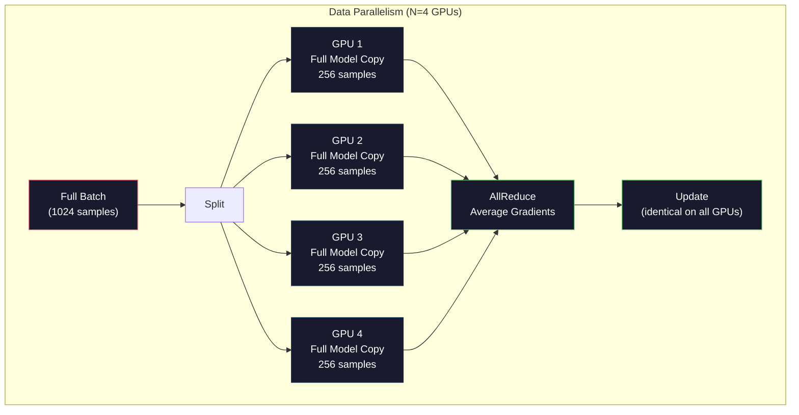
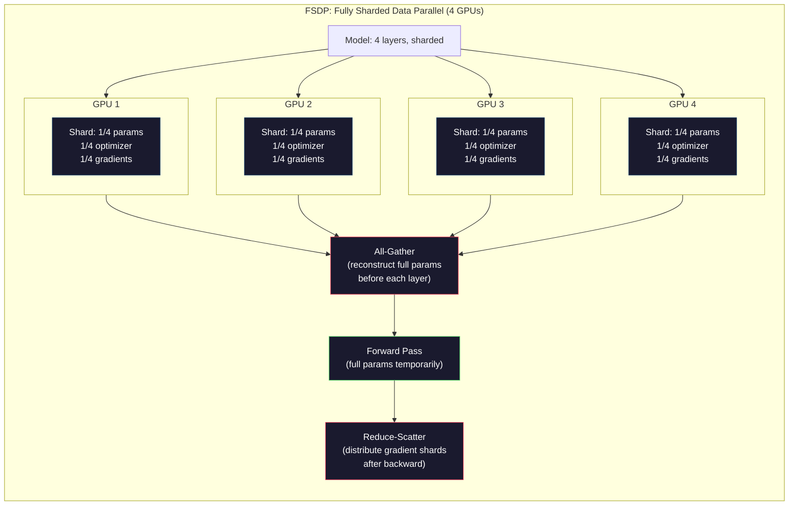
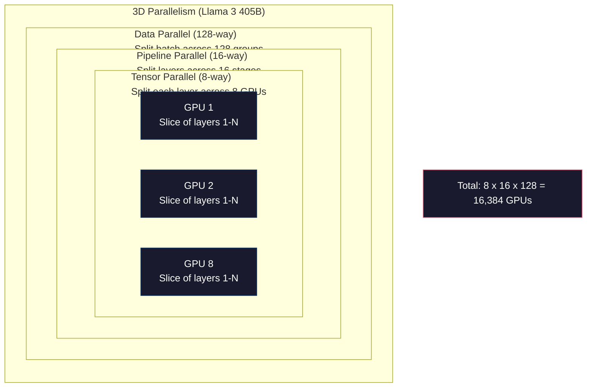

# Skalowanie: Szkolenie rozproszone, FSDP, DeepSpeed

> Twój model 124M był trenowany na jednym procesorze graficznym. Teraz spróbuj z 7 miliardami parametrów. Model nie mieści się w pamięci. Przetwarzanie danych na jednej maszynie zajęłoby tygodnie. Na dużą skalę szkolenie rozproszone nie jest opcją — to jedyna droga naprzód.

**Typ:** Kompilacja
**Języki:** Python
**Wymagania wstępne:** Faza 10, Lekcja 04 (Wstępne szkolenie Mini GPT)
**Czas:** ~120 minut

## Cele nauczania

- Wyjaśnij trzy rodzaje równoległości (danych, tensorów, potoku) i wskaż, kiedy każdy z nich jest niezbędny w zależności od rozmiaru modelu i klastra
- Zaimplementuj równoległość danych przy użyciu PyTorch DDP z synchronizacją gradientów na wielu procesorach graficznych
- Oblicz budżet pamięci dla modelu o danym rozmiarze (wagi + stany optymalizatora + gradienty + aktywacje), aby określić minimalne wymagania sprzętowe
- Skonfiguruj etapy FSDP lub DeepSpeed ZeRO w celu podziału stanów modelu między procesory graficzne i umożliwienia trenowania modeli przekraczających pojemność pojedynczego GPU

## Problem

Model 7B parametrów w FP16 wymaga 14 GB na same wagi. Optymalizator Adam przechowuje dwie dodatkowe kopie każdego parametru — estymaty pierwszego i drugiego momentu. To kolejne 28 GB. Gradienty podczas propagacji wstecznej dodają 14 GB. Zanim zapisze się choć jedną aktywację, zużycie pamięci wynosi już 56 GB.

NVIDIA A100 dysponuje 80 GB pamięci.

Po odjęciu 56 GB zostaje 24 GB na aktywacje — wartości pośrednie obliczane podczas przebiegu w przód, które muszą być przechowywane na potrzeby propagacji wstecznej. Dla sekwencji 2048 tokenów i modelu 4096-wymiarowego aktywacje jednej warstwy zajmują około 64 MB. Przy 32 warstwach daje to 2 GB na próbkę. Partia o rozmiarze 8 wymaga 16 GB. Przy dostępnych 24 GB możliwa jest partia o wielkości 12.

Teraz rozważ model 70B parametrów. Same wagi: 140 GB w FP16. Nie mieszczą się na jednym GPU. Do przechowania wag potrzeba co najmniej dwóch A100 (2 × 80 GB = 160 GB). Po doliczeniu stanów optymalizatora i gradientów minimalna liczba procesorów graficznych wzrasta do 3, a w praktyce — do 8–16, w zależności od przyjętej strategii podziału.

Llama 3 405B była trenowana na 16 384 procesorach graficznych NVIDIA H100. Koszt obliczeń szacuje się na 100 milionów dolarów. DeepSeek V3 wytrenował porównywalny model za około 5,6 miliona dolarów, stosując przemyślaną architekturę (Mixture of Experts aktywuje tylko ułamek parametrów na token) oraz efektywne metody szkolenia.

W tej lekcji omówione są cztery strategie umożliwiające szkolenie na dużą skalę: równoległość danych, równoległość tensorów, równoległość potoku oraz w pełni pofragmentowana równoległość danych. Każdą z nich zasymulujesz w czystym Pythonie, aby zrozumieć mechanikę działania, zanim przejdziesz do właściwego środowiska szkolenia rozproszonego.

## Koncepcja

### Dlaczego dystrybucja jest konieczna

Poniżej przedstawiono rzeczywiste liczby dotyczące pamięci dla prawdziwych modeli — każda z nich jest obliczona, a nie szacowana.

| Model | Parametry | Wagi (FP16) | Stany Adama | Gradienty (FP16) | Łącznie (bez aktywacji) |
|-------|-----------|-------------|-------------|------------------|------------------------|
| GPT-2 Small | 124M | 248 MB | 992 MB | 248 MB | 1,5 GB |
| Llama 3 8B | 8B | 16 GB | 64 GB | 16 GB | 96 GB |
| Llama 3 70B | 70B | 140 GB | 560 GB | 140 GB | 840 GB |
| Llama 3 405B | 405B | 810 GB | 3240 GB | 810 GB | 4860 GB |

Kolumna „Stany Adama" jest kluczowa. Adam przechowuje średnią kroczącą (m) i wariancję bieżącą (v) dla każdego parametru — oba w FP32. Dla modelu 70B to 70B × 4 bajty × 2 = 560 GB. Sam optymalizator potrzebuje siedmiu A100.

Pojedynczy H100 ma 80 GB. Llama 3 405B wymaga co najmniej 61 H100, aby przechować wagi, stany optymalizatora i gradienty. Po dodaniu aktywacji liczba ta rośnie dalej. Meta użyła 16 384 procesorów graficznych nie z wyboru, lecz z konieczności.

### Równoległość danych

Najprostsza ze strategii rozproszonych. Cały model jest kopiowany na N procesorów graficznych. Każda partia treningowa jest dzielona na N równych części. Każdy GPU wykonuje przebieg w przód i wstecz na swoim fragmencie danych. Po propagacji wstecznej gradienty są uśredniane na wszystkich procesorach graficznych. Każdy GPU aktualizuje swoją kopię wag z użyciem tych samych uśrednionych gradientów, co gwarantuje synchronizację wszystkich kopii.

**Zalety:** liniowe skalowanie przepustowości. N procesorów graficznych przetwarza N razy więcej danych na krok. Komunikacja ogranicza się do uśredniania gradientów i może być nakładana na obliczenia.

**Wady:** każdy GPU przechowuje pełną kopię modelu, stanów optymalizatora i gradientów. Dla modelu 70B każdy procesor graficzny potrzebuje 840 GB. Równoległość danych nie zmniejsza zużycia pamięci przypadającej na GPU — jedynie skraca czas szkolenia.

**Matematyka:** efektywny rozmiar partii = per_gpu_batch_size × N. Dla N = 64 procesorów graficznych z partią 16 na GPU efektywna partia wynosi 1024. Llama 3 używała efektywnej partii wynoszącej 16 milionów tokenów na krok.



### Równoległość tensorów

Strategia ta polega na podziale poszczególnych warstw między procesory graficzne. Pojedyncze mnożenie macierzy jest rozprowadzane między GPU, z których każdy oblicza część wyniku.

Rozważmy macierz wag o kształcie (8192, 8192) w warstwie feed-forward. Przy 4-kierunkowej równoległości tensorów każdy procesor graficzny przechowuje fragment o rozmiarze (8192, 2048). Każdy GPU mnoży dane wejściowe przez swój fragment, uzyskując częściowy wynik. Wyniki cząstkowe są następnie łączone (przy użyciu all-reduce lub all-gather) w celu uzyskania pełnego wyjścia.

**Zalety:** zmniejsza zużycie pamięci przypadające na GPU proporcjonalnie do rozmiaru wag. Model 70B podzielony na 8 procesorów graficznych oznacza, że każdy z nich obsługuje około 8,75B parametrów.

**Wady:** wymaga szybkiej komunikacji między GPU po każdej warstwie. All-reduce po każdym mnożeniu macierzy wprowadza dodatkowe opóźnienie. Strategia sprawdza się przy NVLink (900 GB/s między GPU w tym samym węźle), lecz jest nieefektywna przy połączeniach InfiniBand między węzłami (400 Gb/s, około 50 GB/s). W praktyce równoległość tensorów niemal zawsze ogranicza się do jednego węzła (8 GPU).

**Zastosowania:** Megatron-LM był pionierem tej techniki. Llama 3 405B wykorzystuje 8-kierunkową równoległość tensorów w każdym węźle.

### Równoległość potoku

Polega na podziale modelu na grupy warstw przypisane do kolejnych procesorów graficznych. GPU 1 obsługuje warstwy 1–8, GPU 2 — warstwy 9–16, GPU 3 — warstwy 17–24, GPU 4 — warstwy 25–32. Dane przepływają przez potok: GPU 1 oblicza swoje warstwy i przekazuje aktywacje do GPU 2, który robi to samo i przekazuje je dalej.

**Zalety:** minimalna komunikacja między GPU — przesyłane są tylko aktywacje na granicach warstw, które są niewielkie w porównaniu do gradientów i wag. Strategia działa między węzłami, ponieważ wymagania dotyczące przepustowości są niskie.

**Wady:** problem bąbelków potoku. Gdy GPU 4 oblicza przebieg w przód dla mikropartii 1, procesory GPU 1, 2 i 3 pozostają bezczynne. Podczas przebiegu wstecznego wzorzec jest odwrócony. Przy naiwnym potokowaniu wykorzystanie GPU wynosi jedynie 1/N dla N etapów potoku.

**GPipe i PipeDream** rozwiązują problem bąbelków, dzieląc partię na mikropartie. GPU 1 rozpoczyna przetwarzanie mikropartii 2 natychmiast po zakończeniu mikropartii 1, co nakłada obliczenia na różnych etapach potoku. Dla M mikropartii i N etapów frakcja czasu traconego na bąbelki spada do (N-1)/M. Przy M = 16 mikropartiach i N = 4 etapach czas bezczynności wynosi 3/16 = 18,75%.

### FSDP: w pełni pofragmentowana równoległość danych

FSDP łączy skalowalność równoległości danych z efektywnością pamięci dzięki fragmentowaniu (sharding). Zamiast przechowywać pełną kopię modelu, każdy GPU trzyma tylko 1/N parametrów, gradientów i stanów optymalizatora.

Przed przejściem warstwy do przodu FSDP wykonuje operację **all-gather**, zbierając pełne parametry ze wszystkich GPU do pamięci każdego z nich. Po przejściu w przód parametry nielokalne są odrzucane. Podczas przebiegu wstecznego all-gather jest powtarzany w celu zrekonstruowania parametrów do obliczeń gradientów. Po zakończeniu propagacji wstecznej operacja **reduce-scatter** dystrybuuje fragmenty gradientów tak, by każdy GPU przechowywał jedynie 1/N z nich.

**Obliczenia dla modelu 70B na 8 procesorach graficznych:**

| Składnik | Bez FSDP | Z FSDP |
|----------|----------|--------|
| Wagi (FP16) | 140 GB na GPU | 17,5 GB na GPU |
| Stany Adama (FP32) | 560 GB na GPU | 70 GB na GPU |
| Gradienty (FP16) | 140 GB na GPU | 17,5 GB na GPU |
| **Łącznie** | **840 GB na GPU** | **105 GB na GPU** |

Bez FSDP model 70B nie mieści się na pojedynczym GPU 80 GB. Przy FSDP na 8 GPU każdy z nich potrzebuje 105 GB — co nadal przekracza limit. Do uzyskania poniżej 80 GB na GPU potrzeba co najmniej 16 procesorów graficznych, albo należy połączyć FSDP z punktami kontrolnymi aktywacji (aktywacje są przeliczane podczas przebiegu wstecznego zamiast przechowywane).

Narzut komunikacyjny jest wyższy niż przy zwykłej równoległości danych ze względu na konieczność przeprowadzania all-gather przed każdą warstwą. Oszczędność pamięci otwiera jednak możliwość trenowania modeli, które wcześniej były nieosiągalne.



### DeepSpeed ZeRO

Rozwiązanie ZeRO (Zero Redundancy Optimizer) firmy DeepSpeed jest koncepcyjnie tożsame z FSDP, lecz zostało opracowane niezależnie przez Microsoft. Definiuje trzy etapy o coraz bardziej agresywnym fragmentowaniu:

| Etap | Co jest fragmentowane | Oszczędność pamięci | Narzut komunikacyjny |
|------|-----------------------|---------------------|----------------------|
| ZeRO-1 | Tylko stany optymalizatora | ~4× redukcja | Taki sam jak przy równoległości danych |
| ZeRO-2 | + Gradienty | ~8× redukcja | Nieznacznie większy |
| ZeRO-3 | + Parametry | ~N× redukcja (N GPU) | All-gather na każdą warstwę |

ZeRO-3 odpowiada FSDP. Nazewnictwo jest inne, mechanizm — identyczny. PyTorch dodał natywną implementację FSDP po tym, jak DeepSpeed potwierdził skuteczność tej koncepcji.

DeepSpeed wprowadził również ZeRO-Offload (przeniesienie stanów optymalizatora do pamięci RAM procesora, która jest tańsza i pojemniejsza) oraz ZeRO-Infinity (odciążenie na dyski NVMe). Obydwa rozwiązania zamieniają wydajność obliczeniową na pojemność pamięci — operacje na odciążonych danych są wolniejsze, lecz zwalniają pamięć GPU.

### Trening w mieszanej precyzji

Nowoczesne szkolenie używa jednocześnie kilku formatów zmiennoprzecinkowych:

- **Przebieg w przód i wstecz**: FP16 lub BF16 (16-bit). Połowa zużycia pamięci FP32. Operacje matmul działają 2× szybciej na rdzeniach tensorowych.
- **Wagi główne**: FP32 (32-bit). Przechowywane przez optymalizator w celu zachowania precyzji numerycznej podczas aktualizacji wag.
- **Skalowanie strat**: mnożenie straty przez dużą stałą przed przebiegiem wstecznym, aby zapobiec zanikaniu gradientów FP16 do zera. Przed krokiem optymalizatora straty są dzielone przez tę samą stałą.

BF16 (Brain Float 16) ma taki sam zakres wykładników co FP32 (8 bitów), ale mniejszą precyzję mantysy (7 bitów wobec 23 w FP32). Rzadko wymaga skalowania strat, ponieważ reprezentuje ten sam zakres wartości. FP16 ma 5 bitów wykładnika i 10 bitów mantysy — oferuje drobnoziarnistą precyzję, lecz jest podatny na przekroczenia zakresu przy skrajnych wartościach.

Układy TPU firmy Google natywnie używają BF16. Karty A100 i H100 firmy NVIDIA obsługują zarówno FP16, jak i BF16. Branża w dużej mierze przeszła na BF16, eliminując problemy ze skalowaniem strat.

**Porównanie zużycia pamięci dla modelu 7B:**

| Precyzja | Wagi | Optymalizator | Gradienty | Łącznie |
|----------|------|---------------|-----------|---------|
| FP32 wszędzie | 28 GB | 56 GB | 28 GB | 112 GB |
| Mieszana (BF16 + FP32 master) | 14 GB | 56 GB | 14 GB | 84 GB |

Trening w mieszanej precyzji pozwala zaoszczędzić 28 GB w tym modelu. Stany optymalizatora pozostają w FP32 niezależnie od wybranej precyzji — to właśnie dlatego oszczędność wynosi 25%, a nie 50%.

### Megatron-LM i równoległość 3D

Prawdziwe szkolenie na dużą skalę łączy wszystkie trzy rodzaje równoległości:

- **Równoległość danych** między grupami węzłów (skalowanie rozmiaru partii)
- **Równoległość tensorów** w węźle (podział warstw na 8 GPU)
- **Równoległość potoku** między węzłami (podział grup warstw na kolejne maszyny)

Llama 3 405B na 16 384 H100:
- 8-kierunkowa równoległość tensorów w każdym węźle (8 GPU na węzeł)
- 16-kierunkowa równoległość potoku między węzłami (16 etapów potoku)
- 128-kierunkowa równoległość danych w pozostałym wymiarze (16 384 / 8 / 16 = 128)

Ta dekompozycja 3D (8 × 16 × 128 = 16 384) pokazuje, jak skalować szkolenie do tysięcy procesorów graficznych. Każdy GPU przetwarza inny fragment danych (równoległość danych), przechowuje jeden wycinek każdej warstwy (równoległość tensorów) i oblicza inny zestaw warstw (równoległość potoku).

DeepSeek V3 obrał odmienną drogę. Architektura Mixture of Experts aktywuje tylko 37B z 671B parametrów na token, co oznacza, że każdy GPU musi obliczać i przechowywać aktywacje wyłącznie aktywnych parametrów. Szkolenie odbyło się na 2048 procesorach graficznych H800 — mniej niż 1/8 liczby GPU użytej przez Meta — za 5,6 miliona dolarów wobec szacowanych 100 milionów dolarów wydanych przez Meta.



## Zbuduj to

### Krok 1: Symuluj równoległość danych

Podziel partię na symulowane procesory graficzne. Każdy GPU oblicza przebieg w przód na swoim fragmencie. Uśrednij „gradienty" (symulowane jako wartości strat).

```python
import numpy as np

def simulate_data_parallelism(data, num_gpus, model_fn):
    batch_size = len(data)
    shard_size = batch_size // num_gpus
    remainder = batch_size % num_gpus

    gpu_losses = []
    gpu_gradients = []

    offset = 0
    for gpu_id in range(num_gpus):
        extra = 1 if gpu_id < remainder else 0
        shard = data[offset:offset + shard_size + extra]
        offset += shard_size + extra

        loss, grad = model_fn(shard)
        gpu_losses.append(loss)
        gpu_gradients.append(grad)

    avg_loss = np.mean(gpu_losses)
    avg_gradient = np.mean(gpu_gradients, axis=0)

    return avg_loss, avg_gradient
```

Operacja all-reduce (uśrednianie gradientów) to jedyna komunikacja w równoległości danych. W praktyce korzysta z biblioteki NCCL na GPU NVIDIA, która implementuje ring all-reduce: każdy GPU wysyła 1/N swoich gradientów do sąsiada i odbiera 1/N od drugiego sąsiada. Po N-1 krokach każdy GPU dysponuje pełną średnią. Całkowity wolumen komunikacji wynosi 2 × rozmiar_gradientu × (N-1)/N, co dla dużego N zbliża się do dwukrotności rozmiaru gradientu.

### Krok 2: Symuluj równoległość tensorów

Podziel macierz wag między procesory graficzne. Każdy GPU oblicza cząstkowe mnożenie macierzy. Połącz wyniki.

```python
def simulate_tensor_parallelism(input_data, weight_matrix, num_gpus):
    d_in, d_out = weight_matrix.shape
    assert d_out % num_gpus == 0, f"d_out {d_out} not divisible by num_gpus {num_gpus}"
    shard_size = d_out // num_gpus

    partial_results = []
    for gpu_id in range(num_gpus):
        start = gpu_id * shard_size
        end = start + shard_size
        weight_shard = weight_matrix[:, start:end]

        partial = input_data @ weight_shard
        partial_results.append(partial)

    full_output = np.concatenate(partial_results, axis=-1)

    direct_output = input_data @ weight_matrix
    error = np.abs(full_output - direct_output).max()

    return full_output, error
```

Błąd powinien wynosić dokładnie zero (lub epsilon maszynowy). Równoległość tensorów jest matematycznie precyzyjna — daje taki sam wynik jak obliczenie pełnego matmul na jednym GPU. Podział odbywa się wzdłuż wymiaru wyjściowego: każdy GPU generuje inny fragment kolumn, a konkatenacja rekonstruuje pełny wynik.

Dla warstw liniowych z podziałem wzdłuż kolumn (podział wymiaru wyjściowego) stosuje się konkatenację. Przy podziale wierszowym (podział wymiaru wejściowego) sumuje się wyniki cząstkowe. W warstwie FFN transformatora pierwsza operacja liniowa (rozszerzanie) używa podziału kolumnowego, a druga (kontrakcja) — podziału wierszowego. Pozwala to uniknąć all-reduce między dwiema warstwami.

### Krok 3: Symuluj równoległość potoku

Podziel warstwy modelu na wirtualne procesory graficzne. Zwizualizuj problem bąbelków, w którym wcześniejsze etapy pozostają bezczynne, gdy późniejsze wykonują obliczenia.

```python
def simulate_pipeline_parallelism(num_layers, num_stages, num_microbatches):
    layers_per_stage = num_layers // num_stages

    timeline = {}
    clock = 0

    for mb in range(num_microbatches):
        for stage in range(num_stages):
            start_time = max(
                timeline.get((stage, mb - 1, "fwd"), (0, 0))[1] if mb > 0 else 0,
                timeline.get((stage - 1, mb, "fwd"), (0, 0))[1] if stage > 0 else 0,
            )
            end_time = start_time + layers_per_stage
            timeline[(stage, mb, "fwd")] = (start_time, end_time)

    last_fwd_end = max(v[1] for v in timeline.values())

    for mb in range(num_microbatches - 1, -1, -1):
        for stage in range(num_stages - 1, -1, -1):
            deps = [last_fwd_end]
            if mb < num_microbatches - 1 and (stage, mb + 1, "bwd") in timeline:
                deps.append(timeline[(stage, mb + 1, "bwd")][1])
            if stage < num_stages - 1 and (stage + 1, mb, "bwd") in timeline:
                deps.append(timeline[(stage + 1, mb, "bwd")][1])
            start_time = max(deps)
            end_time = start_time + layers_per_stage
            timeline[(stage, mb, "bwd")] = (start_time, end_time)

    total_time = max(v[1] for v in timeline.values())
    compute_time = num_microbatches * num_stages * layers_per_stage * 2
    bubble_fraction = 1.0 - compute_time / (total_time * num_stages)

    return timeline, total_time, bubble_fraction
```

Przy 4 etapach i 1 mikropartii frakcja bąbelków wynosi 75% — trzy z czterech GPU są bezczynne w dowolnym momencie. Przy 16 mikropartiach spada do około 19%. Ceną redukcji bąbelków jest pamięć: konieczne jest jednoczesne przechowywanie aktywacji wszystkich mikropartii będących w toku przetwarzania.

### Krok 4: Kalkulator pamięci

Oblicz dokładne wymagania pamięciowe dla trenowania modelu o dowolnym rozmiarze.

```python
def memory_calculator(
    params_billions,
    precision_bytes=2,
    optimizer="adam",
    num_gpus=1,
    sharding="none",
    sequence_length=2048,
    batch_size_per_gpu=1,
    hidden_dim=None,
    num_layers=None,
):
    params = params_billions * 1e9

    weight_memory = params * precision_bytes

    if optimizer == "adam":
        optimizer_memory = params * 4 * 2
    elif optimizer == "sgd":
        optimizer_memory = params * 4
    else:
        optimizer_memory = 0

    gradient_memory = params * precision_bytes

    total_no_activation = weight_memory + optimizer_memory + gradient_memory

    if hidden_dim and num_layers:
        activation_per_layer = (
            sequence_length * batch_size_per_gpu * hidden_dim * precision_bytes * 4
        )
        activation_memory = activation_per_layer * num_layers
    else:
        activation_memory = params * precision_bytes * 0.5

    if sharding == "fsdp" or sharding == "zero3":
        weight_memory /= num_gpus
        optimizer_memory /= num_gpus
        gradient_memory /= num_gpus
    elif sharding == "zero2":
        optimizer_memory /= num_gpus
        gradient_memory /= num_gpus
    elif sharding == "zero1":
        optimizer_memory /= num_gpus

    per_gpu_total = weight_memory + optimizer_memory + gradient_memory + activation_memory

    return {
        "params_billions": params_billions,
        "weights_gb": weight_memory / 1e9,
        "optimizer_gb": optimizer_memory / 1e9,
        "gradients_gb": gradient_memory / 1e9,
        "activations_gb": activation_memory / 1e9,
        "per_gpu_total_gb": per_gpu_total / 1e9,
        "total_across_gpus_gb": per_gpu_total * num_gpus / 1e9,
        "fits_on_80gb": per_gpu_total / 1e9 <= 80,
        "num_gpus": num_gpus,
        "sharding": sharding,
    }
```

Ten kalkulator odpowiada na pytanie, które zadaje sobie każdy inżynier ML: „Ile GPU potrzebuję?" Wystarczy podać rozmiar modelu i sprawdzić, czy mieści się w pamięci. Następnie należy dostosować strategię fragmentowania, aż zużycie pamięci na GPU spadnie poniżej 80 GB.

### Krok 5: Symulacja mieszanej precyzji

Porównaj zużycie pamięci przy trenowaniu w FP32, FP16 i mieszanej precyzji.

```python
def mixed_precision_comparison(params_billions):
    params = params_billions * 1e9

    fp32_weights = params * 4
    fp32_optimizer = params * 4 * 2
    fp32_gradients = params * 4
    fp32_total = fp32_weights + fp32_optimizer + fp32_gradients

    fp16_weights = params * 2
    fp16_master = params * 4
    fp16_optimizer = params * 4 * 2
    fp16_gradients = params * 2
    fp16_total = fp16_weights + fp16_master + fp16_optimizer + fp16_gradients

    mixed_weights = params * 2
    mixed_optimizer = params * 4 * 2
    mixed_gradients = params * 2
    mixed_total = mixed_weights + mixed_optimizer + mixed_gradients

    return {
        "fp32_total_gb": fp32_total / 1e9,
        "fp16_with_master_gb": fp16_total / 1e9,
        "mixed_bf16_gb": mixed_total / 1e9,
        "savings_vs_fp32": 1 - mixed_total / fp32_total,
    }
```

Największe zaskoczenie dla wielu osób: mieszana precyzja nie redukuje pamięci o połowę. Stany optymalizatora (m i v w Adamie) pozostają w FP32 niezależnie od wybranej precyzji. Dla modelu 7B trening FP32 zużywa 112 GB, a mieszana precyzja — 84 GB. To redukcja o 25%, nie o 50%, ponieważ dominującym składnikiem jest optymalizator.

## Użyj tego

### Uruchom wszystkie symulacje

```python
def run_all_demos():
    print("=" * 70)
    print("DATA PARALLELISM SIMULATION")
    print("=" * 70)

    np.random.seed(42)
    data = np.random.randn(64, 32)
    weight = np.random.randn(32, 16)

    def model_fn(batch):
        output = batch @ weight
        loss = np.mean(output ** 2)
        grad = 2 * batch.T @ (batch @ weight) / len(batch)
        return loss, grad

    for n_gpus in [1, 2, 4, 8]:
        loss, grad = simulate_data_parallelism(data, n_gpus, model_fn)
        print(f"  {n_gpus} GPUs: loss={loss:.4f}, grad_norm={np.linalg.norm(grad):.4f}")

    print()
    print("=" * 70)
    print("TENSOR PARALLELISM SIMULATION")
    print("=" * 70)

    x = np.random.randn(4, 8192)
    W = np.random.randn(8192, 8192)

    for n_gpus in [1, 2, 4, 8]:
        output, error = simulate_tensor_parallelism(x, W, n_gpus)
        print(f"  {n_gpus} GPUs: output_shape={output.shape}, max_error={error:.2e}")

    print()
    print("=" * 70)
    print("PIPELINE PARALLELISM SIMULATION")
    print("=" * 70)

    for n_mb in [1, 4, 8, 16, 32]:
        _, total_t, bubble = simulate_pipeline_parallelism(32, 4, n_mb)
        print(f"  {n_mb:2d} micro-batches: total_time={total_t:4d}, bubble={bubble:.1%}")

    print()
    print("=" * 70)
    print("MEMORY CALCULATOR")
    print("=" * 70)

    configs = [
        (7, "none", 1),
        (7, "fsdp", 8),
        (70, "none", 1),
        (70, "fsdp", 8),
        (70, "fsdp", 16),
        (405, "fsdp", 64),
        (405, "fsdp", 128),
    ]

    print(f"  {'Model':>8} {'Sharding':>8} {'GPUs':>5} {'Per-GPU':>10} {'Fits 80GB':>10}")
    print("  " + "-" * 50)
    for params, shard, gpus in configs:
        result = memory_calculator(params, num_gpus=gpus, sharding=shard)
        fits = "Yes" if result["fits_on_80gb"] else "No"
        print(f"  {params:>6}B {shard:>8} {gpus:>5} {result['per_gpu_total_gb']:>8.1f}GB {fits:>10}")

    print()
    print("=" * 70)
    print("MIXED PRECISION COMPARISON")
    print("=" * 70)

    for params_b in [7, 13, 70, 405]:
        result = mixed_precision_comparison(params_b)
        print(f"  {params_b}B: FP32={result['fp32_total_gb']:.0f}GB, "
              f"Mixed BF16={result['mixed_bf16_gb']:.0f}GB, "
              f"Savings={result['savings_vs_fp32']:.0%}")
```

## Wyślij to

Ta lekcja generuje `outputs/prompt-distributed-training-planner.md` — prompt przyjmujący rozmiar modelu i dostępny sprzęt, a następnie tworzący kompletny rozproszony plan szkolenia: strategię równoległości, budżet pamięci, narzut komunikacyjny i oczekiwaną przepustowość.

## Ćwiczenia

1. Zmodyfikuj kalkulator pamięci, aby uwzględniał punkty kontrolne aktywacji. Przy zastosowaniu punktów kontrolnych przechowywane są tylko aktywacje co K-tej warstwy (typowo K = 1, czyli ponowne obliczanie wszystkiego). Pokaż kompromis między pamięcią a obliczeniami: ile pamięci oszczędzają punkty kontrolne i o ile spowalniają trening (pełne punkty kontrolne wymagają około 33% więcej obliczeń)?

2. Rozszerz symulację równoległości potoku o harmonogram 1F1B (jeden w przód, jeden wstecz) stosowany przez PipeDream. Porównaj frakcję bąbelków z naiwnym harmonogramem dla 4 etapów i 8 mikropartii. Harmonogram 1F1B powinien mieć mniejsze szczytowe zużycie pamięci, ponieważ wcześniej rozpoczyna przebiegi wsteczne.

3. Zaimplementuj symulator akumulacji gradientów. Zamiast wykonywać all-reduce po każdej mikropartii, gromadź gradienty lokalnie przez K kroków, a następnie przeprowadź all-reduce. Pokaż, że zmniejsza to komunikację K-krotnie, przy zachowaniu identycznych gradientów końcowych (a tym samym identycznego przebiegu treningu).

4. Zbuduj estymator kosztów. Na podstawie rozmiaru modelu, docelowej liczby tokenów, typu GPU (A100 za $2/godz., H100 za $3,50/godz.) i strategii równoległości oszacuj całkowity koszt szkolenia w dolarach. Porównaj z rzeczywistymi kosztami: Llama 3 405B kosztowała według doniesień około 100 milionów dolarów, a DeepSeek V3 — około 5,6 miliona dolarów.

5. Dodaj ZeRO-Offload do kalkulatora pamięci. Przyjmij, że pamięć RAM procesora wynosi 512 GB na węzeł, a pojemność NVMe — 2 TB. Pokaż, jak przeniesienie stanów optymalizatora na CPU umożliwia trenowanie modelu 70B na 4 GPU zamiast 16, kosztem 30–50% wolniejszych kroków optymalizatora.

## Kluczowe terminy

| Termin | Potoczne znaczenie | Właściwe znaczenie |
|--------|-------------------|-------------------|
| Równoległość danych | „Skopiuj model na każdy GPU" | Każdy GPU przetwarza inny fragment danych; gradienty są uśredniane za pomocą all-reduce po każdym kroku |
| Równoległość tensorów | „Podziel warstwę między GPU" | Macierze wag są partycjonowane, każdy GPU oblicza część matmul; wymaga szybkiego połączenia NVLink |
| Równoległość potoku | „Podziel warstwy między GPU" | Każdy GPU obsługuje inną grupę warstw; dane przepływają przez potok za pomocą mikropartii, ograniczając bąbelki |
| FSDP | „Podziel wszystko na fragmenty" | W pełni pofragmentowana równoległość danych — każdy GPU przechowuje 1/N wag, gradientów i stanów optymalizatora; all-gather przed każdym obliczeniem |
| ZeRO | „Wersja FSDP od DeepSpeed" | Zero Redundancy Optimizer z 3 etapami: fragmentowanie optymalizatora (etap 1), + gradienty (etap 2), + parametry (etap 3) |
| All-reduce | „Uśrednianie między GPU" | Operacja zbiorowa, w której każdy GPU uzyskuje sumę (lub średnią) danych ze wszystkich GPU — zazwyczaj implementowana jako ring all-reduce |
| All-gather | „Zbieranie ze wszystkich GPU" | Operacja zbiorowa, w której każdy GPU uzyskuje połączone dane ze wszystkich GPU — stosowana w FSDP do rekonstrukcji pełnych parametrów |
| Reduce-scatter | „Sumuj i rozdzielaj" | Operacja zbiorowa redukująca (sumująca) dane i rozpraszająca różne fragmenty do poszczególnych GPU — stosowana w FSDP do fragmentowania gradientów |
| Mieszana precyzja | „Trening w obniżonej precyzji" | FP16/BF16 do przebiegów w przód i wstecz, FP32 dla stanów optymalizatora — oszczędza ~25% pamięci, a nie 50%, ponieważ optymalizator dominuje |
| Bąbel potoku | „Czas bezczynności w potoku" | Część czasu, gdy GPU czekają na dane z poprzedniego etapu — minimalizowana przez zwiększenie liczby mikropartii |

## Dalsze czytanie

– [Rajbhandari i in., 2020 – „ZeRO: Memory Optimizations Toward Training Trillion Parameter Models"](https://arxiv.org/abs/1910.02054) – artykuł DeepSpeed ZeRO definiujący trzy etapy fragmentowania
– [Shoeybi i in., 2020 – „Megatron-LM: Training Multi-Billion Parameter Language Models Using Model Parallelism"](https://arxiv.org/abs/1909.08053) – równoległość tensorów NVIDIA dla transformatorów
– [Narayanan i in., 2021 – „Efficient Large-Scale Language Model Training on GPU Clusters Using Megatron-LM"](https://arxiv.org/abs/2104.04473) – równoległość 3D łącząca dane, tensory i potok
– [Zhao i in., 2023 – „PyTorch FSDP: Experiences on Scaling Fully Sharded Data Parallel"](https://arxiv.org/abs/2304.11277) – natywna implementacja FSDP w PyTorch
– [Raport techniczny Llama 3](https://arxiv.org/abs/2407.21783) – trening na 16 384 GPU ze szczegółami dotyczącymi równoległości 3D
– [Raport techniczny DeepSeek-V3](https://arxiv.org/abs/2412.19437) – jak architektura MoE obniża koszty szkolenia o rząd wielkości
