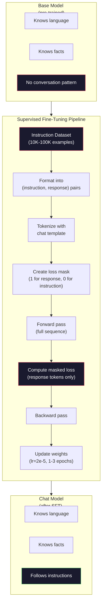

# Strojenie instrukcji (SFT)

> Model podstawowy przewiduje następny token. To wszystko. Nie postępuje zgodnie z instrukcjami, nie odpowiada na pytania ani nie odrzuca szkodliwych próśb. SFT jest pomostem pomiędzy predyktorem tokena a użytecznym asystentem. Każda modelka, z którą kiedykolwiek rozmawiałeś – Claude, GPT, Llama Chat – przeszła ten etap.

**Typ:** Kompilacja
**Języki:** Python (z numpy)
**Wymagania wstępne:** Faza 10, Lekcja 04 (Wstępne szkolenie Mini GPT)
**Czas:** ~90 minut

## Cele nauczania

- Zaimplementuj nadzorowane dostrajanie (SFT), które przekształca model języka podstawowego w asystenta wykonującego instrukcje
- Formatuj dane szkoleniowe za pomocą szablonów czatów z rolami systemowymi, użytkownikami i asystentami oraz utratą maski na tokenach innych niż asystujące
- Wyjaśnij, dlaczego SFT jest konieczne: modele podstawowe kontynuują tekst, zamiast odpowiadać na pytania
- Oceń jakość SFT, porównując odpowiedzi modelu podstawowego z odpowiedziami modelu dostrojonego na ustalonym zestawie instrukcji

## Problem

Wytrenowałeś model w lekcji 04. Potrafi on przewidzieć następny żeton na podstawie sekwencji. Nakarm go „Architekturą transformatora”, a może kontynuować „zrewolucjonizował przetwarzanie języka naturalnego”. To imponujące jak na predyktor następnego tokena.

Teraz spróbuj tego: nakarm go „Jaka jest stolica Francji?” Model podstawowy nie odpowiada „Paryż”. Kontynuuje wzór. Może pojawić się pytanie: „Jaka jest stolica Niemiec? Jaka jest stolica Hiszpanii?” ponieważ uczył się z dokumentów zawierających listy pytań. Lub może spowodować, że „jest to pytanie, które zadaje wiele osób”, ponieważ jest to wiarygodna kontynuacja następnego symbolu. Modelka nie ma pojęcia *odpowiadania*. On tylko wie *kontynuując*.

Jest to różnica między GPT-3 (model podstawowy, wydany w czerwcu 2020 r.) a ChatGPT (dostrojony do instrukcji, wydany w listopadzie 2022 r.). Ta sama architektura. Ten sam trening przedtreningowy. Różnica wynosi od 20 000 do 100 000 starannie opracowanych par (instrukcja, odpowiedź), które nauczyły model podążania za wzorcem rozmowy.

Stanford Alpaca udowodniła, że ​​nie potrzebujesz milionów przykładów. W marcu 2023 r. dostroili Llamę 7B na zaledwie 52 000 par instrukcja-odpowiedź wygenerowanych przez GPT-3.5. Całkowity koszt: $600. The result was a chatbot that could follow instructions, answer questions, and hold conversations. Not as good as ChatGPT, but shockingly close for $600 i kilka godzin szkolenia.

Meta's Llama 2 Chat wykorzystała jedynie około 27 000 wysokiej jakości przykładów na początkowym etapie SFT. Kluczowy wniosek: jakość jest ważniejsza niż ilość. 27 000 przykładów napisanych przez wykwalifikowanych komentatorów przewyższa 1 milion hałaśliwych przykładów pobranych z Internetu.

## Koncepcja

### Czym właściwie zajmuje się SFT

Nadzorowane dostrajanie kontynuuje tę samą pętlę treningową, co przed treningiem – przejście w przód, utrata obliczeń, przejście w tył, aktualizacja wag – ale na innym rodzaju danych. Zamiast surowego tekstu ćwiczysz w oparciu o ustrukturyzowane rozmowy:

```json
{
  "system": "You are a helpful assistant.",
  "user": "What is the capital of France?",
  "assistant": "The capital of France is Paris."
}
```

Modelka już wie, że Paryż jest stolicą Francji. Nauczyła się tego podczas wstępnego szkolenia z Wikipedii, podręczników i stron internetowych. SFT nie uczy modelu nowych faktów. Uczy model nowego *zachowania*: kiedy zobaczysz pytanie, odpowiedz. Gdy zobaczysz instrukcję, zakończ ją. Gdy zobaczysz szkodliwą prośbę, odmów.

Pomyśl o tym w ten sposób. Szkolenie wstępne daje wiedzę o modelu. SFT nadaje modelowi maniery.

###Formaty danych

W branży dominują trzy formaty. Każdy koduje tę samą informację – kto co powiedział – z różnymi ogranicznikami.

**Format alpaki** (Stanford, marzec 2023 r.):

```json
{
  "instruction": "Summarize the following article in 3 sentences.",
  "input": "The European Central Bank raised interest rates...",
  "output": "The ECB increased rates by 25 basis points..."
}
```

Proste i powszechnie stosowane. Pole `input` jest opcjonalne — wiele instrukcji nie wymaga dodatkowego kontekstu. Stanford wypuścił 52 000 przykładów w tym formacie, wygenerowanych przez GPT-3.5 za 600 dolarów. To zapoczątkowało ruch dostrajania instrukcji open source.

**Udostępnij format GPT** (społeczność, 2023 r.):

```json
{
  "conversations": [
    {"from": "system", "value": "You are a helpful assistant."},
    {"from": "human", "value": "What causes tides?"},
    {"from": "gpt", "value": "Tides are caused by the gravitational pull of the Moon..."},
    {"from": "human", "value": "How often do they occur?"},
    {"from": "gpt", "value": "Most coastal areas experience two high tides and two low tides per day..."}
  ]
}
```

Obsługuje rozmowy wieloobrotowe. W polu „from” zgodnie z konwencją używane są słowa „human” i „gpt”, ​​niezależnie od rzeczywistego modelu. Vicuna została przeszkolona na podstawie 70 000 rozmów ShareGPT pobranych z udostępnionych przez użytkowników transkrypcji ChatGPT.

**Format ChatML** (OpenAI, używany w wielu modelach open source):

```
<|im_start|>system
You are a helpful assistant.<|im_end|>
<|im_start|>user
What is the capital of France?<|im_end|>
<|im_start|>assistant
The capital of France is Paris.<|im_end|>
```

Używa specjalnych tokenów (`<|im_start|>`, `<|im_end|>`) do rozgraniczenia ról. Tokeny te są dodawane do słownika tokenizatora podczas dostrajania. Qwen, Yi i wiele innych modeli korzysta z ChatML.

Wszystkie trzy formaty osiągają ten sam cel: mówią modelowi: „to jest instrukcja, to jest odpowiedź, naucz się tego wzorca”.

### Dlaczego to działa

Modelka zna już język z przedszkolenia. Widział miliardy przykładów pytań, po których następują odpowiedzi, instrukcji i uzupełnień oraz rozmów między ludźmi. Wzory są już zakodowane w wagach.

SFT koncentruje tę ukrytą zdolność. Zamiast tego, aby model musiał dowiedzieć się z kontekstu, czy powinien odpowiedzieć na pytanie, czy kontynuować dokument, SFT wyraźnie trenuje wzorzec konwersacji. Po kilku tysiącach przykładów model uczy się: kiedy zobaczysz znacznik roli asystenta, udziel przydatnej odpowiedzi.

Dlatego wystarczy 27 000 przykładów. Nie uczysz modelowego angielskiego. Nie uczysz go faktów o świecie. Uczysz go jednego prostego zachowania: reagowania na instrukcje. Wiedza już była.

### Zamaskowana strata

Jest to najważniejszy szczegół techniczny w SFT i większość tutoriali go pomija.

Podczas wstępnego szkolenia obliczasz stratę na każdym żetonie. Model uczy się przewidywać każdy kolejny token w sekwencji. Podczas SFT obliczasz stratę tylko na żetonach *odpowiedzi*. Żetony instrukcji służą do kontekstu, ale model nie jest karany za nieprawidłowe ich „przewidywanie”.

Dlaczego? Ponieważ nie chcesz, aby model nauczył się *generować* instrukcje. Chcesz, żeby nauczyło się *reagować na* instrukcje. Jeśli obliczysz stratę na żetonach instrukcji, uczysz model przewidywania „Jaka jest stolica Francji?” jakby to on zadawał pytanie. To marnuje sygnał gradientu i może dezorientować model co do jego roli.

W praktyce tworzysz maskę straty: 1 dla żetonów odpowiedzi, 0 dla żetonów instrukcji. Przed uśrednieniem pomnóż stratę na token przez tę maskę.

```
Tokens:    [SYS] You are helpful [USER] What is the capital? [ASST] Paris is the capital [EOS]
Loss mask:   0    0    0     0      0     0   0  0     0       1     1    1   1     1      1
```

Tylko tokeny po `[ASST]` przyczyniają się do straty. Model widzi całą rozmowę podczas podania w przód (potrzebuje instrukcji, aby uzyskać właściwą reakcję), ale aktualizuje swoje wagi jedynie na podstawie tego, jak dobrze przewidział reakcję.

### Hiperparametry szkoleniowe

SFT wykorzystuje radykalnie inne hiperparametry niż przed treningiem. Nie trenujesz od zera. Dostosowujesz model, który już działa.

| Parametr | Przedtreningowy (Lama 2 7B) | SFT (Czat Lamy 2) |
|----------|---------------------------|----------------------------------|
| Szybkość uczenia się | 3e-4 (szczyt) | 2e-5 |
| Epoki | 1 (dane jednoprzebiegowe) | 2 |
| Wielkość partii | 4M tokenów | 64 przykłady |
| Kroki rozgrzewkowe | 2000 | 0-100 |
| Spadek wagi | 0,1 | 0,0-0,1 |
| Rozmiar danych | tokeny 2T | 27 000 przykładów |

Szybkość uczenia się jest 15 razy niższa w przypadku SFT. To jest krytyczne. Wysoka szybkość uczenia się podczas dostrajania niszczy wcześniej wyszkoloną wiedzę. Model „zapomina” tego, czego się nauczył i nadmiernie dopasowuje się do małego, dostrajającego zbioru danych. To katastrofalne zapomnienie.

Dwie epoki oznaczają, że model widzi każdy przykład uczący dwukrotnie. Więcej niż 3 epoki na małym zbiorze danych prowadzi do zapamiętywania – model zaczyna dosłownie odtwarzać przykłady szkoleniowe zamiast uogólniać.

### Katastrofalne zapomnienie

Dostrajanie może zniszczyć ogólne możliwości. Trenuj zbyt długo na danych zgodnych z instrukcjami, a model traci zdolność do pisania kodu, wykonywania obliczeń matematycznych lub tworzenia kreatywnego tekstu. Staje się bardzo dobry w specyficznym formacie danych treningowych i fatalny we wszystkim innym.

Trzy łagodzenia:

1. **Niski wskaźnik uczenia się.** 1e-5 do 5e-5. Mniejsze aktualizacje oznaczają mniejsze niszczenie wstępnie wyszkolonych funkcji.

2. **Krótkie szkolenie.** 1-3 epoki. Zatrzymaj się, zanim model się przeuczy.

3. **Wmieszaj dane przedtreningowe.** Lama 2 Chat zmieszał niewielki procent (2–5%) surowych danych przedtreningowych ze zbiorem danych SFT. To „przypomina” modelowi jego ogólne możliwości podczas uczenia się nowego zachowania polegającego na wykonywaniu instrukcji.

### Liczby rzeczywiste

Dopracowanie modelu 7B na 10 000 wysokiej jakości par instrukcji zajmuje około 1 godziny na pojedynczym procesorze graficznym NVIDIA A100 80 GB. Oto matematyka:

- 10 000 przykładów x średnio 512 tokenów = 5,12 mln tokenów
- 2 epoki = łącznie 10,24 mln tokenów
- Przepustowość A100 dla dostrajania modelu 7B: ~3000 tokenów/sekundę
- 10,24M / 3000 = ~3400 sekund = ~57 minut

W przypadku naszego mini GPT (4 warstwy, 128 przyciemnień) szkolenie jest niemal natychmiastowe. Chodzi o zrozumienie mechaniki, a nie skali.



## Zbuduj to

### Krok 1: Zbiór danych instrukcji

Utwórz zestaw danych instrukcji syntetycznych. Podczas produkcji firmy takie jak Scale AI i Anthropic zatrudniają do ich pisania ludzkich adnotatorów. Utworzymy je programowo, aby zademonstrować format.

```python
import numpy as np

INSTRUCTION_DATA = [
    {
        "instruction": "What is the capital of France?",
        "response": "The capital of France is Paris."
    },
    {
        "instruction": "Explain gravity in one sentence.",
        "response": "Gravity is the force that attracts objects with mass toward each other."
    },
    {
        "instruction": "Write a haiku about the ocean.",
        "response": "Waves crash on the shore, salt and foam beneath the sun, endless blue expanse."
    },
    {
        "instruction": "What is 15 multiplied by 7?",
        "response": "15 multiplied by 7 is 105."
    },
    {
        "instruction": "Name three programming languages.",
        "response": "Three programming languages are Python, Rust, and TypeScript."
    },
    {
        "instruction": "Summarize photosynthesis.",
        "response": "Photosynthesis converts sunlight, water, and carbon dioxide into glucose and oxygen."
    },
    {
        "instruction": "What year did World War II end?",
        "response": "World War II ended in 1945."
    },
    {
        "instruction": "Define machine learning.",
        "response": "Machine learning is a field where algorithms learn patterns from data to make predictions."
    },
]
```

Osiem przykładów to niewiele. Stanford Alpaca zużyła 52 000 sztuk. Ale mechanika jest identyczna, niezależnie od tego, czy masz 8, czy 52 000: tokenizacja, maskowanie, obliczanie strat tylko na odpowiedziach.

### Krok 2: Tokenizuj za pomocą szablonu czatu

Konwertuj pary instrukcja-odpowiedź na sekwencje tokenów za pomocą specjalnych znaczników ról. Znaczniki informują model, gdzie kończy się instrukcja i zaczyna odpowiedź.

```python
SPECIAL_TOKENS = {
    "INST_START": 253,
    "INST_END": 254,
    "RESP_START": 255,
}

def tokenize_instruction_pair(instruction, response, vocab_size=256):
    inst_tokens = list(instruction.encode("utf-8"))
    resp_tokens = list(response.encode("utf-8"))

    inst_tokens = [min(t, vocab_size - 4) for t in inst_tokens]
    resp_tokens = [min(t, vocab_size - 4) for t in resp_tokens]

    tokens = (
        [SPECIAL_TOKENS["INST_START"]]
        + inst_tokens
        + [SPECIAL_TOKENS["INST_END"]]
        + [SPECIAL_TOKENS["RESP_START"]]
        + resp_tokens
    )

    return tokens

def create_loss_mask(tokens):
    mask = np.zeros(len(tokens), dtype=np.float32)
    in_response = False

    for i, token in enumerate(tokens):
        if token == SPECIAL_TOKENS["RESP_START"]:
            in_response = True
            continue
        if in_response:
            mask[i] = 1.0

    return mask
```

Maska straty składa się wyłącznie z zer dla żetonów instrukcji i samych jedynek dla żetonów odpowiedzi. Sam token `RESP_START` otrzymuje maskę 0, ponieważ jest ogranicznikiem, a nie częścią treści odpowiedzi.

### Krok 3: Zamaskowana utrata entropii krzyżowej

Standardowa entropia krzyżowa, ale pomnożona przez maskę strat. Do gradientu przyczyniają się tylko żetony odpowiedzi.

```python
def masked_cross_entropy_loss(logits, targets, loss_mask):
    batch, seq_len, vocab_size = logits.shape
    logits_flat = logits.reshape(-1, vocab_size)
    targets_flat = targets.reshape(-1)
    mask_flat = loss_mask.reshape(-1)

    max_logits = logits_flat.max(axis=-1, keepdims=True)
    log_softmax = logits_flat - max_logits - np.log(
        np.exp(logits_flat - max_logits).sum(axis=-1, keepdims=True)
    )

    per_token_loss = -log_softmax[np.arange(len(targets_flat)), targets_flat]

    masked_loss = per_token_loss * mask_flat
    num_response_tokens = mask_flat.sum()
    if num_response_tokens == 0:
        return 0.0
    loss = masked_loss.sum() / num_response_tokens

    return loss
```

Mianownik to `num_response_tokens`, a nie `seq_len`. Jeśli podzielisz przez całkowitą długość sekwencji, dłuższe instrukcje osłabią sygnał gradientu. Dzielenie przez liczbę tokenów odpowiedzi zapewnia równą wagę na token odpowiedzi niezależnie od długości instrukcji.

### Krok 4: Pętla szkoleniowa SFT

Użyj ponownie MiniGPT z lekcji 04. Pętla treningowa wygląda prawie identycznie jak przed treningiem, ale z formatowaniem instrukcji i zamaskowaną utratą.

```python
import sys
import os
sys.path.insert(0, os.path.join(os.path.dirname(__file__), "..", "..", "04-pre-training-mini-gpt", "code"))
from main import MiniGPT, LayerNorm, FeedForward, MultiHeadAttention, TransformerBlock, Embedding

def sft_train(model, dataset, num_epochs=2, lr=2e-5, seq_len=64):
    formatted_data = []
    for example in dataset:
        tokens = tokenize_instruction_pair(example["instruction"], example["response"])
        mask = create_loss_mask(tokens)
        formatted_data.append((tokens, mask))

    print(f"SFT Training: {len(formatted_data)} examples, {num_epochs} epochs, lr={lr}")
    print(f"Total tokens: {sum(len(t) for t, _ in formatted_data):,}")
    print()

    losses = []

    for epoch in range(num_epochs):
        epoch_loss = 0.0
        num_batches = 0

        indices = np.random.permutation(len(formatted_data))

        for idx in indices:
            tokens, mask = formatted_data[idx]

            if len(tokens) < 3:
                continue
            if len(tokens) > seq_len:
                tokens = tokens[:seq_len]
                mask = mask[:seq_len]

            input_ids = np.array(tokens[:-1]).reshape(1, -1)
            target_ids = np.array(tokens[1:]).reshape(1, -1)
            loss_mask = np.array(mask[1:]).reshape(1, -1)

            logits = model.forward(input_ids)
            loss = masked_cross_entropy_loss(logits, target_ids, loss_mask)

            batch_size, s_len, v_size = logits.shape
            probs = np.exp(logits - logits.max(axis=-1, keepdims=True))
            probs = probs / probs.sum(axis=-1, keepdims=True)
            dlogits = probs.copy()
            dlogits[np.arange(batch_size)[:, None], np.arange(s_len), target_ids] -= 1.0

            mask_expanded = loss_mask[:, :, np.newaxis]
            num_resp = loss_mask.sum()
            if num_resp > 0:
                dlogits = dlogits * mask_expanded / num_resp

            for block in model.blocks:
                block.ffn.W1 -= lr * np.random.randn(*block.ffn.W1.shape) * 0.01
                block.ffn.W2 -= lr * np.random.randn(*block.ffn.W2.shape) * 0.01
                block.ffn.b1 -= lr * np.random.randn(*block.ffn.b1.shape) * 0.01
                block.ffn.b2 -= lr * np.random.randn(*block.ffn.b2.shape) * 0.01

            epoch_loss += loss
            num_batches += 1
            losses.append(loss)

        avg_loss = epoch_loss / max(num_batches, 1)
        print(f"Epoch {epoch + 1}/{num_epochs} | Avg Loss: {avg_loss:.4f}")

    return model, losses
```

Szybkość uczenia się wynosi 2e-5, co odpowiada czatowi Llama 2. Porównaj to z 3e-4 używanym przed treningiem – 15 razy mniejszym. Gradient jest maskowany: żetony instrukcji dają gradient zerowy. Tylko żetony odpowiedzi przesuwają ciężary.

### Krok 5: Porównanie modelu podstawowego z modelem SFT

Istotą SFT jest zmiana zachowania. Zmierzmy to, sprawdzając, jak model reaguje na dane wejściowe w formacie instrukcji w porównaniu z kontynuacjami w surowym tekście.

```python
def generate_response(model, prompt_tokens, max_new_tokens=50, temperature=0.8):
    tokens = list(prompt_tokens)
    seq_len = model.embedding.pos_embed.shape[0]

    for _ in range(max_new_tokens):
        context = np.array(tokens[-seq_len:]).reshape(1, -1)
        logits = model.forward(context)
        next_logits = logits[0, -1, :]

        next_logits = next_logits / max(temperature, 1e-8)
        probs = np.exp(next_logits - next_logits.max())
        probs = probs / probs.sum()
        probs = np.clip(probs, 1e-10, 1.0)
        probs = probs / probs.sum()

        next_token = np.random.choice(len(probs), p=probs)
        tokens.append(int(next_token))

    return tokens

def evaluate_instruction_following(model, instructions):
    print("Evaluating instruction following:")
    print("-" * 50)

    for instruction in instructions:
        tokens = (
            [SPECIAL_TOKENS["INST_START"]]
            + [min(t, 252) for t in list(instruction.encode("utf-8"))]
            + [SPECIAL_TOKENS["INST_END"]]
            + [SPECIAL_TOKENS["RESP_START"]]
        )

        output = generate_response(model, tokens, max_new_tokens=30, temperature=0.6)
        response_start = len(tokens)
        response_tokens = output[response_start:]
        response_bytes = bytes([t for t in response_tokens if t < 128])
        response_text = response_bytes.decode("utf-8", errors="replace")

        print(f"  Q: {instruction}")
        print(f"  A: {response_text[:80]}")
        print()
```

W przypadku małego modelu z 8 przykładami odpowiedzi nie będą znaczące. Tego można się spodziewać. Ważną rzeczą jest *struktura*: model uczy się generować dane wyjściowe po znaczniku odpowiedzi, zamiast kontynuować generowanie kolejnych instrukcji.

### Krok 6: Zmierz katastrofalne zapominanie

Porównaj zdolność przewidywania następnego tokenu modelu przed i po SFT. Jeśli SFT uszkodzi ogólne możliwości, straty na nieprzetworzonym tekście wzrosną.

```python
def measure_forgetting(model, test_text, seq_len=64):
    tokens = np.array(list(test_text.encode("utf-8")[:512]))

    total_loss = 0.0
    num_windows = 0

    for start in range(0, len(tokens) - seq_len - 1, seq_len):
        input_ids = tokens[start:start + seq_len].reshape(1, -1)
        target_ids = tokens[start + 1:start + seq_len + 1].reshape(1, -1)

        logits = model.forward(input_ids)

        batch, s_len, vocab_size = logits.shape
        logits_flat = logits.reshape(-1, vocab_size)
        targets_flat = target_ids.reshape(-1)

        max_logits = logits_flat.max(axis=-1, keepdims=True)
        log_softmax = logits_flat - max_logits - np.log(
            np.exp(logits_flat - max_logits).sum(axis=-1, keepdims=True)
        )

        loss = -log_softmax[np.arange(len(targets_flat)), targets_flat].mean()
        total_loss += loss
        num_windows += 1

    return total_loss / max(num_windows, 1)
```

W przypadku prawdziwego dostrajania będziesz śledzić tę metrykę przez cały trening. Jeśli utrata nieprzetworzonego tekstu wzrasta o więcej niż 10-15%, Twoja transakcja SFT jest zbyt agresywna. Obniż szybkość uczenia się lub zmniejsz liczbę epok.

## Użyj tego

### Pełna wersja demonstracyjna potoku SFT

```python
if __name__ == "__main__":
    np.random.seed(42)

    test_text = """The transformer architecture processes sequences through self-attention.
Each layer applies multi-head attention followed by a feedforward network.
Residual connections and layer normalization stabilize deep networks.
The model learns to predict the next token given all previous tokens."""

    print("=" * 70)
    print("INSTRUCTION TUNING (SFT) DEMO")
    print("=" * 70)
    print()

    model = MiniGPT(
        vocab_size=256, embed_dim=128, num_heads=4,
        num_layers=4, max_seq_len=128, ff_dim=512
    )
    print(f"Model: {model.count_parameters():,} parameters")
    print(f"Config: 4 layers, 4 heads, 128 dims (mini GPT from Lesson 04)")
    print()

    print("PRE-SFT: Measuring base model loss on raw text")
    base_loss = measure_forgetting(model, test_text)
    print(f"  Base model loss: {base_loss:.4f}")
    print()

    print("=" * 70)
    print("SFT TRAINING")
    print("=" * 70)

    model, losses = sft_train(
        model, INSTRUCTION_DATA, num_epochs=3, lr=2e-5, seq_len=128
    )

    print()
    print("POST-SFT: Measuring fine-tuned model loss on raw text")
    sft_loss = measure_forgetting(model, test_text)
    print(f"  SFT model loss: {sft_loss:.4f}")
    print(f"  Change: {((sft_loss - base_loss) / base_loss * 100):+.1f}%")
    if abs(sft_loss - base_loss) / base_loss < 0.15:
        print("  Minimal forgetting (< 15% change)")
    else:
        print("  Significant forgetting detected")
    print()

    print("=" * 70)
    print("INSTRUCTION FOLLOWING EVALUATION")
    print("=" * 70)
    print()

    test_instructions = [
        "What is the capital of France?",
        "Name a programming language.",
        "Define gravity.",
    ]
    evaluate_instruction_following(model, test_instructions)

    print("=" * 70)
    print("DATA FORMAT EXAMPLES")
    print("=" * 70)
    print()

    for i, example in enumerate(INSTRUCTION_DATA[:3]):
        tokens = tokenize_instruction_pair(example["instruction"], example["response"])
        mask = create_loss_mask(tokens)
        resp_count = int(mask.sum())
        total_count = len(tokens)
        print(f"  Example {i + 1}: {total_count} tokens, {resp_count} response tokens ({resp_count/total_count:.0%} of sequence)")
        print(f"    Instruction: {example['instruction']}")
        print(f"    Response: {example['response']}")
        print()

    print("=" * 70)
    print("TRAINING LOSS CURVE")
    print("=" * 70)
    print()

    if losses:
        window = max(1, len(losses) // 5)
        for i in range(0, len(losses), window):
            chunk = losses[i:i + window]
            avg = sum(chunk) / len(chunk)
            print(f"  Steps {i:3d}-{i + len(chunk) - 1:3d}: avg loss = {avg:.4f}")
```

## Wyślij to

W ramach tej lekcji zostanie wyświetlony `outputs/prompt-sft-data-curator.md` — monit, który pomoże Ci zaprojektować i wybrać zestawy danych instrukcji dla SFT. Biorąc pod uwagę docelową możliwość (generowanie kodu, matematyka, konwersacja), tworzy plan gromadzenia danych ze specyfikacjami formatu, kryteriami jakości i wymaganiami dotyczącymi różnorodności.

## Ćwiczenia

1. Dodaj obsługę podpowiedzi systemowych. Zmodyfikuj `tokenize_instruction_pair`, aby zaakceptować komunikat systemowy i dodać go przed instrukcją. Utwórz 5 przykładów z różnymi podpowiedziami systemowymi („Jesteś poetą”, „Jesteś korepetytorem matematyki”) i sprawdź, czy model widzi różne podpowiedzi systemowe podczas szkolenia.

2. Zastosuj mieszanie danych. Utwórz funkcję, która pobiera zbiór danych SFT i surowy korpus tekstowy, a następnie tworzy partie szkoleniowe, w których 5% przykładów to nieprzetworzony tekst (bez maskowania), a 95% to pary instrukcji (maskowane). Przeprowadź 3 epoki i porównaj wskaźniki zapominania z czystym treningiem SFT.

3. Zbuduj narzędzie do oceny jakości danych. Dla każdej pary instrukcja-odpowiedź oblicz: (a) długość odpowiedzi w tokenach, (b) stosunek instrukcji do odpowiedzi, (c) różnorodność słownictwa (unikalne tokeny/tokeny ogółem). Odfiltruj przykłady z długością odpowiedzi < 10 tokenów lub różnorodnością < 0,3. Pokaż jak filtrowanie wpływa na ostateczną stratę.

4. Wdrożyć wieloobrotowe szkolenie konwersacyjne. Rozszerz tokenizację, aby obsłużyć rozmowy 3-turowe (asystent użytkownika-asystent użytkownika-asystent użytkownika). Maska straty powinna obejmować wszystkie trzy tury asystenta. Sprawdź, czy maska ​​jest poprawna, drukując wyrównanie maski tokena dla jednego przykładu.

5. Porównaj tempo uczenia się. Trenuj ten sam model trzy razy z lr=1e-4, lr=2e-5 i lr=1e-6. Narysuj krzywe strat. Bieg 1e-4 powinien wykazywać szybkie opadanie początkowe, ale wyższą stratę końcową (przeuczenie). Bieg 1e-6 powinien ledwo się poruszać. Bieg 2e-5 powinien być najlepszym miejscem.

## Kluczowe terminy

| Termin | Co ludzie mówią | Co to właściwie oznacza |
|------|----------------|----------------------|
| SFT | „Dostrajanie rozmów” | Nadzorowane dostrajanie: ciągłe szkolenie na parach (instrukcja, odpowiedź) ze stratą obliczoną tylko na żetonach odpowiedzi |
| Instrukcja strojenia | „Nauczanie modelu wykonywania poleceń” | Trening na wyraźnych parach instrukcja-odpowiedź, dzięki czemu model podstawowy uczy się wzorca konwersacji, a nie nowej wiedzy |
| Maskowanie strat | „Ignorowanie monitu” | Ustawienie straty na zero dla tokenów instrukcji, tak aby gradienty wynikały tylko z przewidywań tokenów odpowiedzi |
| CzatML | „Język znaczników czatu” | Format tokenu wykorzystujący ograniczniki `<\|im_start\|>` i `<\|im_end\|>` do oznaczania ról mówiących w danych konwersacji |
| Format alpaki | „Format Stanforda” | Format JSON z polami instrukcji/wejścia/wyjścia używany w przykładach wygenerowanych za pomocą GPT-3.5 o wielkości 52 tys., które kosztują 600 USD |
| Katastrofalne zapomnienie | „Modelka staje się głupsza” | Dostrajanie niszczy wstępnie wyszkolone możliwości, ponieważ aktualizacje gradientu zastępują ogólną wiedzę wzorcami specyficznymi dla zadania
| Wiązanie ciężarów | „Współdzielone osadzania” | Używanie tej samej matrycy do osadzania tokenów wejściowych i głowicy przewidywania wyników, zapisywanie parametrów i poprawa spójności |
| Szablon czatu | „Jak sformatować zachętę” | Specyficzna sekwencja tokenów (znaczniki ról, ograniczniki), która tworzy konwersację dla modelu |

## Dalsze czytanie

– [Ouyang i in., 2022 – „Trening modeli językowych w zakresie wykonywania instrukcji przy wykorzystaniu informacji zwrotnych od ludzi” (InstructGPT)](https://arxiv.org/abs/2203.02155) – artykuł wprowadzający strojenie instrukcji + RLHF w OpenAI
– [Taori i in., 2023 – „Stanford Alpaca: model LLaMA zgodny z instrukcjami”](https://github.com/tatsu-lab/stanford_alpaca) – 52 tys. przykładów instrukcji za 600 USD, co dowodzi, że SFT działa na małych zbiorach danych
– [Touvron i in., 2023 – „Llama 2: Open Foundation and Fine-Tuned Chat Models”](https://arxiv.org/abs/2307.09288) – Potok SFT + RLHF firmy Meta z 27 tys. przykładów wysokiej jakości
– [Chiang i in., 2023 – „Vicuna: chatbot o otwartym kodzie źródłowym robi wrażenie na GPT-4”](https://lmsys.org/blog/2023-03-30-vicuna/) – szkolenie dotyczące rozmów 70 tys. ShareGPT
– [Zhou i in., 2023 – „LIMA: Less Is More for Alignment”](https://arxiv.org/abs/2305.11206) – udowadniając, że 1000 starannie wybranych przykładów może dopasować SFT na znacznie większych zbiorach danych