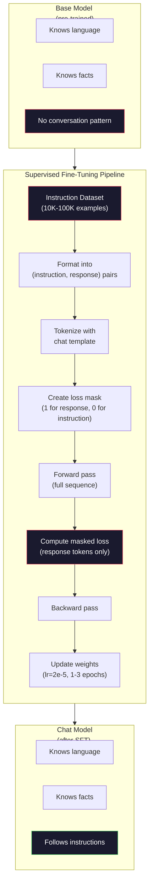

# Strojenie instrukcji (SFT)

> Model podstawowy przewiduje następny token — i nic więcej. Nie wykonuje instrukcji, nie odpowiada na pytania ani nie odrzuca szkodliwych próśb. SFT stanowi pomost między predyktorem tokenów a użytecznym asystentem. Każdy model, z którym kiedykolwiek rozmawiałeś — Claude, GPT, Llama Chat — przeszedł ten etap.

**Typ:** Kompilacja
**Języki:** Python (z numpy)
**Wymagania wstępne:** Faza 10, Lekcja 04 (Wstępne szkolenie Mini GPT)
**Czas:** ~90 minut

## Cele nauczania

- Zaimplementuj nadzorowane dostrajanie (SFT), które przekształca model języka podstawowego w asystenta wykonującego instrukcje
- Formatuj dane treningowe za pomocą szablonów czatu z rolami systemowymi, użytkownikami i asystentem oraz maskuj straty na tokenach spoza odpowiedzi
- Wyjaśnij, dlaczego SFT jest konieczne: modele podstawowe kontynuują tekst zamiast odpowiadać na pytania
- Oceń jakość SFT, porównując odpowiedzi modelu podstawowego z odpowiedziami modelu dostrojonego na ustalonym zestawie instrukcji

## Problem

W lekcji 04 wytrenowałeś model potrafiący przewidywać następny token na podstawie sekwencji. Podaj mu „Architektura transformatora", a prawdopodobnie kontynuuje „zrewolucjonizowała przetwarzanie języka naturalnego". To imponujący wynik jak na predyktor tokenów.

Teraz spróbuj czegoś innego: podaj mu „Jaka jest stolica Francji?" Model podstawowy nie odpowie „Paryż" — kontynuuje wzorzec. Może wygenerować kolejne pytania: „Jaka jest stolica Niemiec? Jaka jest stolica Hiszpanii?" — bo uczył się na dokumentach zawierających listy pytań. Albo wyprodukuje „to jest pytanie, które zadaje wiele osób", ponieważ jest to wiarygodna kontynuacja. Model nie wie, jak *odpowiadać*. Umie tylko *kontynuować*.

To właśnie różni GPT-3 (model podstawowy, wydany w czerwcu 2020 r.) od ChatGPT (dostrojony do instrukcji, wydany w listopadzie 2022 r.). Ta sama architektura. Ten sam wstępny trening. Różnica to od 20 000 do 100 000 starannie opracowanych par (instrukcja, odpowiedź), które nauczyły model wzorca konwersacji.

Stanford Alpaca udowodniła, że nie potrzebujesz milionów przykładów. W marcu 2023 r. dostrojono tam model Llama 7B na zaledwie 52 000 par instrukcja-odpowiedź wygenerowanych przez GPT-3.5. Łączny koszt: 600 dolarów. Efektem był chatbot potrafiący wykonywać instrukcje, odpowiadać na pytania i prowadzić rozmowy. Nie dorównywał ChatGPT, ale za 600 dolarów i kilka godzin treningu był zaskakująco bliski.

Meta's Llama 2 Chat wykorzystała zaledwie około 27 000 wysokiej jakości przykładów na początkowym etapie SFT. Kluczowy wniosek: jakość jest ważniejsza niż ilość. 27 000 przykładów napisanych przez wykwalifikowanych adnotatorów przewyższa milion hałaśliwych próbek pobranych z Internetu.

## Koncepcja

### Czym właściwie zajmuje się SFT

Nadzorowane dostrajanie kontynuuje tę samą pętlę treningową co wstępny trening — przejście w przód, obliczenie straty, przejście wsteczne, aktualizacja wag — ale na innym rodzaju danych. Zamiast surowego tekstu model uczy się na ustrukturyzowanych rozmowach:

```json
{
  "system": "You are a helpful assistant.",
  "user": "What is the capital of France?",
  "assistant": "The capital of France is Paris."
}
```

Model już wie, że Paryż jest stolicą Francji — nauczył się tego podczas wstępnego treningu z Wikipedii, podręczników i stron internetowych. SFT nie uczy modelu nowych faktów, lecz nowego *zachowania*: kiedy zobaczysz pytanie, odpowiedz; kiedy zobaczysz instrukcję, wykonaj ją; kiedy zobaczysz szkodliwą prośbę, odmów.

Można to ująć tak: wstępny trening daje modelowi wiedzę, a SFT uczy go manier.

### Formaty danych

W branży dominują trzy formaty. Każdy koduje tę samą informację — kto co powiedział — za pomocą różnych ograniczników.

**Format Alpaca** (Stanford, marzec 2023 r.):

```json
{
  "instruction": "Summarize the following article in 3 sentences.",
  "input": "The European Central Bank raised interest rates...",
  "output": "The ECB increased rates by 25 basis points..."
}
```

Prosty i powszechnie stosowany. Pole `input` jest opcjonalne — wiele instrukcji nie wymaga dodatkowego kontekstu. Stanford opublikował 52 000 przykładów w tym formacie, wygenerowanych przez GPT-3.5 za 600 dolarów, zapoczątkowując ruch dostrajania instrukcji w projektach open source.

**Format ShareGPT** (społeczność, 2023 r.):

```json
{
  "conversations": [
    {"from": "system", "value": "You are a helpful assistant."},
    {"from": "human", "value": "What causes tides?"},
    {"from": "gpt", "value": "Tides are caused by the gravitational pull of the Moon..."},
    {"from": "human", "value": "How often do they occur?"},
    {"from": "gpt", "value": "Most coastal areas experience two high tides and two low tides per day..."}
  ]
}
```

Obsługuje rozmowy wieloturowe. W polu `from` przyjęto konwencję używania słów `human` i `gpt`, niezależnie od rzeczywistego modelu. Vicuna była trenowana na 70 000 rozmów ShareGPT pobranych z transkrypcji ChatGPT udostępnionych przez użytkowników.

**Format ChatML** (OpenAI, stosowany w wielu modelach open source):

```
<|im_start|>system
You are a helpful assistant.<|im_end|>
<|im_start|>user
What is the capital of France?<|im_end|>
<|im_start|>assistant
The capital of France is Paris.<|im_end|>
```

Używa specjalnych tokenów (`<|im_start|>`, `<|im_end|>`) do rozgraniczenia ról. Tokeny te są dodawane do słownika tokenizatora podczas dostrajania. Format ChatML stosują Qwen, Yi i wiele innych modeli.

Wszystkie trzy formaty realizują ten sam cel: informują model, co jest instrukcją, co odpowiedzią i jakiego wzorca ma się nauczyć.

### Dlaczego to działa

Model zna już język ze wstępnego treningu. Widział miliardy przykładów pytań z następującymi po nich odpowiedziami, instrukcji z uzupełnieniami oraz rozmów między ludźmi. Wzorce są już zakodowane w wagach.

SFT skupia tę ukrytą zdolność. Zamiast zmuszać model do wnioskowania z kontekstu, czy powinien odpowiedzieć na pytanie czy kontynuować dokument, SFT wprost trenuje wzorzec konwersacji. Po kilku tysiącach przykładów model uczy się prostej reguły: gdy zobaczysz znacznik roli asystenta, udziel użytecznej odpowiedzi.

Dlatego wystarczy 27 000 przykładów. Nie uczysz modelu angielskiego ani faktów o świecie — uczysz go jednego prostego zachowania: reagowania na instrukcje. Wiedza już była.

### Zamaskowana strata

To najważniejszy szczegół techniczny SFT, pomijany przez większość poradników.

Podczas wstępnego treningu strata obliczana jest dla każdego tokenu — model uczy się przewidywać każdy kolejny element sekwencji. W SFT strata obliczana jest wyłącznie na tokenach *odpowiedzi*. Tokeny instrukcji służą jako kontekst, ale model nie jest karany za ich niepoprawne „przewidywanie".

Powód jest prosty: nie chcemy, żeby model uczył się *generować* instrukcje, lecz żeby uczył się na nie *reagować*. Obliczanie straty na tokenach instrukcji oznaczałoby trening modelu do przewidywania „Jaka jest stolica Francji?" tak, jakby to on zadawał pytanie. Takie podejście marnuje sygnał gradientu i może dezorientować model co do jego roli.

W praktyce tworzy się maskę straty: 1 dla tokenów odpowiedzi, 0 dla tokenów instrukcji. Przed uśrednieniem stratę per token mnoży się przez tę maskę.

```
Tokens:    [SYS] You are helpful [USER] What is the capital? [ASST] Paris is the capital [EOS]
Loss mask:   0    0    0     0      0     0   0  0     0       1     1    1   1     1      1
```

Tylko tokeny po `[ASST]` wpływają na stratę. Model widzi całą rozmowę podczas przejścia w przód (potrzebuje instrukcji, by udzielić właściwej odpowiedzi), ale aktualizuje wagi wyłącznie na podstawie tego, jak dobrze przewidział odpowiedź.

### Hiperparametry treningowe

SFT wykorzystuje radykalnie inne hiperparametry niż wstępny trening. Nie uczysz modelu od zera — dostrajasz coś, co już działa.

| Parametr | Wstępny trening (Llama 2 7B) | SFT (Llama 2 Chat) |
|----------|------------------------------|---------------------|
| Szybkość uczenia się | 3e-4 (szczyt) | 2e-5 |
| Epoki | 1 (dane jednoprzebiegowe) | 2 |
| Rozmiar partii | 4M tokenów | 64 przykłady |
| Kroki rozgrzewkowe | 2000 | 0–100 |
| Zanik wag | 0,1 | 0,0–0,1 |
| Rozmiar danych | 2T tokenów | 27 000 przykładów |

Szybkość uczenia się jest 15 razy niższa niż podczas wstępnego treningu — to kluczowe. Zbyt wysoka wartość niszczy wcześniej nabytą wiedzę: model „zapomina" tego, czego się nauczył, i nadmiernie dopasowuje się do małego zbioru dostrajającego. To właśnie katastrofalne zapomnienie.

Dwie epoki oznaczają, że model widzi każdy przykład treningowy dwukrotnie. Więcej niż trzy epoki na małym zbiorze danych prowadzi do zapamiętywania — model zaczyna dosłownie odtwarzać przykłady treningowe zamiast uogólniać.

### Katastrofalne zapomnienie

Dostrajanie może zniszczyć ogólne możliwości modelu. Zbyt długi trening na danych zgodnych z instrukcjami powoduje, że model traci zdolność pisania kodu, wykonywania obliczeń matematycznych czy tworzenia kreatywnych tekstów. Staje się bardzo dobry w określonym formacie danych treningowych, a fatalny we wszystkim innym.

Trzy sposoby łagodzenia tego zjawiska:

1. **Niska szybkość uczenia się.** 1e-5 do 5e-5. Mniejsze aktualizacje wag oznaczają mniejsze niszczenie cech wypracowanych podczas wstępnego treningu.

2. **Krótki trening.** 1–3 epoki. Należy zatrzymać się, zanim model zacznie się przeuczać.

3. **Mieszanie danych wstępnego treningu.** Llama 2 Chat mieszała niewielki odsetek (2–5%) surowych danych wstępnego treningu z zestawem SFT. Dzięki temu model „przypomina sobie" ogólne możliwości, ucząc się jednocześnie nowego zachowania — wykonywania instrukcji.

### Liczby rzeczywiste

Dostrojenie modelu 7B na 10 000 wysokiej jakości par instrukcji zajmuje około godziny na pojedynczym procesorze graficznym NVIDIA A100 80 GB. Oto matematyka:

- 10 000 przykładów × średnio 512 tokenów = 5,12 mln tokenów
- 2 epoki = łącznie 10,24 mln tokenów
- Przepustowość A100 przy dostrajaniu modelu 7B: ~3000 tokenów/sekundę
- 10,24M / 3000 = ~3400 sekund = ~57 minut

W przypadku naszego mini GPT (4 warstwy, 128 wymiarów) trening jest niemal natychmiastowy. Chodzi tu o zrozumienie mechaniki, nie skali.



## Zbuduj to

### Krok 1: Zbiór danych instrukcji

Utwórz syntetyczny zestaw danych instrukcji. W środowiskach produkcyjnych firmy takie jak Scale AI i Anthropic zatrudniają ludzkich adnotatorów do ich tworzenia. Tu wygenerujemy je programowo, by zademonstrować format.

```python
import numpy as np

INSTRUCTION_DATA = [
    {
        "instruction": "What is the capital of France?",
        "response": "The capital of France is Paris."
    },
    {
        "instruction": "Explain gravity in one sentence.",
        "response": "Gravity is the force that attracts objects with mass toward each other."
    },
    {
        "instruction": "Write a haiku about the ocean.",
        "response": "Waves crash on the shore, salt and foam beneath the sun, endless blue expanse."
    },
    {
        "instruction": "What is 15 multiplied by 7?",
        "response": "15 multiplied by 7 is 105."
    },
    {
        "instruction": "Name three programming languages.",
        "response": "Three programming languages are Python, Rust, and TypeScript."
    },
    {
        "instruction": "Summarize photosynthesis.",
        "response": "Photosynthesis converts sunlight, water, and carbon dioxide into glucose and oxygen."
    },
    {
        "instruction": "What year did World War II end?",
        "response": "World War II ended in 1945."
    },
    {
        "instruction": "Define machine learning.",
        "response": "Machine learning is a field where algorithms learn patterns from data to make predictions."
    },
]
```

Osiem przykładów to niewiele — Stanford Alpaca użyła 52 000. Mechanika jest jednak identyczna niezależnie od tego, czy dysponujesz 8 czy 52 000 przykładami: tokenizacja, maskowanie, obliczanie straty wyłącznie na odpowiedziach.

### Krok 2: Tokenizuj za pomocą szablonu czatu

Przekształć pary instrukcja-odpowiedź na sekwencje tokenów, używając specjalnych znaczników ról. Znaczniki informują model, gdzie kończy się instrukcja, a zaczyna odpowiedź.

```python
SPECIAL_TOKENS = {
    "INST_START": 253,
    "INST_END": 254,
    "RESP_START": 255,
}

def tokenize_instruction_pair(instruction, response, vocab_size=256):
    inst_tokens = list(instruction.encode("utf-8"))
    resp_tokens = list(response.encode("utf-8"))

    inst_tokens = [min(t, vocab_size - 4) for t in inst_tokens]
    resp_tokens = [min(t, vocab_size - 4) for t in resp_tokens]

    tokens = (
        [SPECIAL_TOKENS["INST_START"]]
        + inst_tokens
        + [SPECIAL_TOKENS["INST_END"]]
        + [SPECIAL_TOKENS["RESP_START"]]
        + resp_tokens
    )

    return tokens

def create_loss_mask(tokens):
    mask = np.zeros(len(tokens), dtype=np.float32)
    in_response = False

    for i, token in enumerate(tokens):
        if token == SPECIAL_TOKENS["RESP_START"]:
            in_response = True
            continue
        if in_response:
            mask[i] = 1.0

    return mask
```

Maska straty składa się z zer dla tokenów instrukcji i jedynek dla tokenów odpowiedzi. Sam token `RESP_START` otrzymuje maskę 0, ponieważ jest ogranicznikiem, a nie częścią treści odpowiedzi.

### Krok 3: Zamaskowana entropia krzyżowa

Standardowa entropia krzyżowa pomnożona przez maskę straty. Do gradientu przyczyniają się tylko tokeny odpowiedzi.

```python
def masked_cross_entropy_loss(logits, targets, loss_mask):
    batch, seq_len, vocab_size = logits.shape
    logits_flat = logits.reshape(-1, vocab_size)
    targets_flat = targets.reshape(-1)
    mask_flat = loss_mask.reshape(-1)

    max_logits = logits_flat.max(axis=-1, keepdims=True)
    log_softmax = logits_flat - max_logits - np.log(
        np.exp(logits_flat - max_logits).sum(axis=-1, keepdims=True)
    )

    per_token_loss = -log_softmax[np.arange(len(targets_flat)), targets_flat]

    masked_loss = per_token_loss * mask_flat
    num_response_tokens = mask_flat.sum()
    if num_response_tokens == 0:
        return 0.0
    loss = masked_loss.sum() / num_response_tokens

    return loss
```

Mianownikiem jest `num_response_tokens`, nie `seq_len`. Dzielenie przez całkowitą długość sekwencji osłabiałoby sygnał gradientu w przypadku długich instrukcji. Dzielenie przez liczbę tokenów odpowiedzi zapewnia każdemu tokenowi odpowiedzi równą wagę, niezależnie od długości instrukcji.

### Krok 4: Pętla treningowa SFT

Ponownie użyj MiniGPT z lekcji 04. Pętla treningowa wygląda niemal identycznie jak we wstępnym treningu, ale z formatowaniem instrukcji i zamaskowaną stratą.

```python
import sys
import os
sys.path.insert(0, os.path.join(os.path.dirname(__file__), "..", "..", "04-pre-training-mini-gpt", "code"))
from main import MiniGPT, LayerNorm, FeedForward, MultiHeadAttention, TransformerBlock, Embedding

def sft_train(model, dataset, num_epochs=2, lr=2e-5, seq_len=64):
    formatted_data = []
    for example in dataset:
        tokens = tokenize_instruction_pair(example["instruction"], example["response"])
        mask = create_loss_mask(tokens)
        formatted_data.append((tokens, mask))

    print(f"SFT Training: {len(formatted_data)} examples, {num_epochs} epochs, lr={lr}")
    print(f"Total tokens: {sum(len(t) for t, _ in formatted_data):,}")
    print()

    losses = []

    for epoch in range(num_epochs):
        epoch_loss = 0.0
        num_batches = 0

        indices = np.random.permutation(len(formatted_data))

        for idx in indices:
            tokens, mask = formatted_data[idx]

            if len(tokens) < 3:
                continue
            if len(tokens) > seq_len:
                tokens = tokens[:seq_len]
                mask = mask[:seq_len]

            input_ids = np.array(tokens[:-1]).reshape(1, -1)
            target_ids = np.array(tokens[1:]).reshape(1, -1)
            loss_mask = np.array(mask[1:]).reshape(1, -1)

            logits = model.forward(input_ids)
            loss = masked_cross_entropy_loss(logits, target_ids, loss_mask)

            batch_size, s_len, v_size = logits.shape
            probs = np.exp(logits - logits.max(axis=-1, keepdims=True))
            probs = probs / probs.sum(axis=-1, keepdims=True)
            dlogits = probs.copy()
            dlogits[np.arange(batch_size)[:, None], np.arange(s_len), target_ids] -= 1.0

            mask_expanded = loss_mask[:, :, np.newaxis]
            num_resp = loss_mask.sum()
            if num_resp > 0:
                dlogits = dlogits * mask_expanded / num_resp

            for block in model.blocks:
                block.ffn.W1 -= lr * np.random.randn(*block.ffn.W1.shape) * 0.01
                block.ffn.W2 -= lr * np.random.randn(*block.ffn.W2.shape) * 0.01
                block.ffn.b1 -= lr * np.random.randn(*block.ffn.b1.shape) * 0.01
                block.ffn.b2 -= lr * np.random.randn(*block.ffn.b2.shape) * 0.01

            epoch_loss += loss
            num_batches += 1
            losses.append(loss)

        avg_loss = epoch_loss / max(num_batches, 1)
        print(f"Epoch {epoch + 1}/{num_epochs} | Avg Loss: {avg_loss:.4f}")

    return model, losses
```

Szybkość uczenia się wynosi 2e-5, zgodnie z Llama 2 Chat. Dla porównania, wstępny trening używał 3e-4 — wartości 15 razy wyższej. Gradient jest maskowany: tokeny instrukcji dają gradient zerowy, tylko tokeny odpowiedzi wpływają na wagi.

### Krok 5: Porównanie modelu podstawowego z modelem SFT

Istotą SFT jest zmiana zachowania. Zmierzmy ją, sprawdzając jak model reaguje na dane wejściowe w formacie instrukcji w porównaniu z kontynuacjami surowego tekstu.

```python
def generate_response(model, prompt_tokens, max_new_tokens=50, temperature=0.8):
    tokens = list(prompt_tokens)
    seq_len = model.embedding.pos_embed.shape[0]

    for _ in range(max_new_tokens):
        context = np.array(tokens[-seq_len:]).reshape(1, -1)
        logits = model.forward(context)
        next_logits = logits[0, -1, :]

        next_logits = next_logits / max(temperature, 1e-8)
        probs = np.exp(next_logits - next_logits.max())
        probs = probs / probs.sum()
        probs = np.clip(probs, 1e-10, 1.0)
        probs = probs / probs.sum()

        next_token = np.random.choice(len(probs), p=probs)
        tokens.append(int(next_token))

    return tokens

def evaluate_instruction_following(model, instructions):
    print("Evaluating instruction following:")
    print("-" * 50)

    for instruction in instructions:
        tokens = (
            [SPECIAL_TOKENS["INST_START"]]
            + [min(t, 252) for t in list(instruction.encode("utf-8"))]
            + [SPECIAL_TOKENS["INST_END"]]
            + [SPECIAL_TOKENS["RESP_START"]]
        )

        output = generate_response(model, tokens, max_new_tokens=30, temperature=0.6)
        response_start = len(tokens)
        response_tokens = output[response_start:]
        response_bytes = bytes([t for t in response_tokens if t < 128])
        response_text = response_bytes.decode("utf-8", errors="replace")

        print(f"  Q: {instruction}")
        print(f"  A: {response_text[:80]}")
        print()
```

W przypadku małego modelu z 8 przykładami odpowiedzi nie będą znaczące — tego należy się spodziewać. Kluczowa jest *struktura*: model uczy się generować dane wyjściowe po znaczniku odpowiedzi zamiast kontynuować kolejne instrukcje.

### Krok 6: Pomiar katastrofalnego zapominania

Porównaj zdolność modelu do przewidywania następnego tokenu przed SFT i po nim. Jeśli SFT uszkodzi ogólne możliwości, strata na surowym tekście wzrośnie.

```python
def measure_forgetting(model, test_text, seq_len=64):
    tokens = np.array(list(test_text.encode("utf-8")[:512]))

    total_loss = 0.0
    num_windows = 0

    for start in range(0, len(tokens) - seq_len - 1, seq_len):
        input_ids = tokens[start:start + seq_len].reshape(1, -1)
        target_ids = tokens[start + 1:start + seq_len + 1].reshape(1, -1)

        logits = model.forward(input_ids)

        batch, s_len, vocab_size = logits.shape
        logits_flat = logits.reshape(-1, vocab_size)
        targets_flat = target_ids.reshape(-1)

        max_logits = logits_flat.max(axis=-1, keepdims=True)
        log_softmax = logits_flat - max_logits - np.log(
            np.exp(logits_flat - max_logits).sum(axis=-1, keepdims=True)
        )

        loss = -log_softmax[np.arange(len(targets_flat)), targets_flat].mean()
        total_loss += loss
        num_windows += 1

    return total_loss / max(num_windows, 1)
```

W prawdziwym dostrajaniu warto śledzić tę metrykę przez cały trening. Jeśli strata na surowym tekście wzrasta o więcej niż 10–15%, SFT jest zbyt agresywne — należy obniżyć szybkość uczenia się lub zmniejszyć liczbę epok.

## Użyj tego

### Pełna wersja demonstracyjna potoku SFT

```python
if __name__ == "__main__":
    np.random.seed(42)

    test_text = """The transformer architecture processes sequences through self-attention.
Each layer applies multi-head attention followed by a feedforward network.
Residual connections and layer normalization stabilize deep networks.
The model learns to predict the next token given all previous tokens."""

    print("=" * 70)
    print("INSTRUCTION TUNING (SFT) DEMO")
    print("=" * 70)
    print()

    model = MiniGPT(
        vocab_size=256, embed_dim=128, num_heads=4,
        num_layers=4, max_seq_len=128, ff_dim=512
    )
    print(f"Model: {model.count_parameters():,} parameters")
    print(f"Config: 4 layers, 4 heads, 128 dims (mini GPT from Lesson 04)")
    print()

    print("PRE-SFT: Measuring base model loss on raw text")
    base_loss = measure_forgetting(model, test_text)
    print(f"  Base model loss: {base_loss:.4f}")
    print()

    print("=" * 70)
    print("SFT TRAINING")
    print("=" * 70)

    model, losses = sft_train(
        model, INSTRUCTION_DATA, num_epochs=3, lr=2e-5, seq_len=128
    )

    print()
    print("POST-SFT: Measuring fine-tuned model loss on raw text")
    sft_loss = measure_forgetting(model, test_text)
    print(f"  SFT model loss: {sft_loss:.4f}")
    print(f"  Change: {((sft_loss - base_loss) / base_loss * 100):+.1f}%")
    if abs(sft_loss - base_loss) / base_loss < 0.15:
        print("  Minimal forgetting (< 15% change)")
    else:
        print("  Significant forgetting detected")
    print()

    print("=" * 70)
    print("INSTRUCTION FOLLOWING EVALUATION")
    print("=" * 70)
    print()

    test_instructions = [
        "What is the capital of France?",
        "Name a programming language.",
        "Define gravity.",
    ]
    evaluate_instruction_following(model, test_instructions)

    print("=" * 70)
    print("DATA FORMAT EXAMPLES")
    print("=" * 70)
    print()

    for i, example in enumerate(INSTRUCTION_DATA[:3]):
        tokens = tokenize_instruction_pair(example["instruction"], example["response"])
        mask = create_loss_mask(tokens)
        resp_count = int(mask.sum())
        total_count = len(tokens)
        print(f"  Example {i + 1}: {total_count} tokens, {resp_count} response tokens ({resp_count/total_count:.0%} of sequence)")
        print(f"    Instruction: {example['instruction']}")
        print(f"    Response: {example['response']}")
        print()

    print("=" * 70)
    print("TRAINING LOSS CURVE")
    print("=" * 70)
    print()

    if losses:
        window = max(1, len(losses) // 5)
        for i in range(0, len(losses), window):
            chunk = losses[i:i + window]
            avg = sum(chunk) / len(chunk)
            print(f"  Steps {i:3d}-{i + len(chunk) - 1:3d}: avg loss = {avg:.4f}")
```

## Wyslij to

W ramach tej lekcji zostanie wygenerowany plik `outputs/prompt-sft-data-curator.md` — monit pomagający zaprojektować i dobrać zestawy danych instrukcji do SFT. Na podstawie docelowej zdolności modelu (generowanie kodu, matematyka, konwersacja) tworzy plan gromadzenia danych wraz ze specyfikacjami formatu, kryteriami jakości i wymaganiami dotyczącymi różnorodności.

## Ćwiczenia

1. Dodaj obsługę komunikatów systemowych. Zmodyfikuj `tokenize_instruction_pair`, aby przyjmował komunikat systemowy i dodawał go przed instrukcją. Utwórz 5 przykładów z różnymi komunikatami systemowymi („Jesteś poetą", „Jesteś korepetytorem matematyki") i sprawdź, czy model widzi je podczas treningu.

2. Zastosuj mieszanie danych. Napisz funkcję pobierającą zbiór danych SFT i surowy korpus tekstowy, a następnie tworzącą partie treningowe, w których 5% przykładów to surowy tekst (bez maskowania), a 95% to pary instrukcji (z maskowaniem). Przeprowadź 3 epoki i porównaj wskaźniki zapominania z wynikami czystego treningu SFT.

3. Zbuduj narzędzie do oceny jakości danych. Dla każdej pary instrukcja-odpowiedź oblicz: (a) długość odpowiedzi w tokenach, (b) stosunek długości instrukcji do odpowiedzi, (c) różnorodność słownictwa (unikalne tokeny / tokeny ogółem). Odfiltruj przykłady z odpowiedzią krótszą niż 10 tokenów lub różnorodnością poniżej 0,3. Zbadaj, jak filtrowanie wpływa na końcową stratę.

4. Zaimplementuj wieloturowy trening konwersacyjny. Rozszerz tokenizację, aby obsługiwała rozmowy 3-turowe (użytkownik–asystent–użytkownik–asystent–użytkownik–asystent). Maska straty powinna obejmować wszystkie trzy tury asystenta. Zweryfikuj poprawność maski, wypisując wyrównanie token–maska dla jednego przykładu.

5. Porównaj szybkości uczenia się. Trenuj ten sam model trzykrotnie z lr=1e-4, lr=2e-5 i lr=1e-6. Narysuj krzywe strat. Przebieg z 1e-4 powinien wykazywać szybki spadek na początku, ale wyższą stratę końcową (przeuczenie). Przebieg z 1e-6 powinien ledwo wykazywać zmiany. Przebieg z 2e-5 powinien być optymalny.

## Kluczowe terminy

| Termin | Co się mówi | Co to właściwie oznacza |
|--------|-------------|------------------------|
| SFT | „Dostrajanie konwersacyjne" | Nadzorowane dostrajanie: kontynuacja treningu na parach (instrukcja, odpowiedź), gdzie strata obliczana jest wyłącznie na tokenach odpowiedzi |
| Instruction tuning | „Uczenie modelu wykonywania poleceń" | Trening na jawnych parach instrukcja-odpowiedź, dzięki któremu model podstawowy przyswaja wzorzec konwersacji, nie zaś nową wiedzę |
| Maskowanie straty | „Ignorowanie monitu" | Zerowanie straty dla tokenów instrukcji, tak aby gradienty wynikały wyłącznie z przewidywania tokenów odpowiedzi |
| ChatML | „Język znaczników czatu" | Format tokenów używający ograniczników `<\|im_start\|>` i `<\|im_end\|>` do oznaczania ról mówiących w danych konwersacyjnych |
| Format Alpaca | „Format Stanforda" | Format JSON z polami instruction/input/output, użyty w 52 000 przykładów wygenerowanych przez GPT-3.5 za 600 USD |
| Katastrofalne zapomnienie | „Model głupieje" | Dostrajanie niszczy możliwości wypracowane podczas wstępnego treningu, ponieważ aktualizacje gradientu zastępują ogólną wiedzę wzorcami specyficznymi dla zadania |
| Wiązanie wag | „Współdzielone osadzenia" | Używanie tej samej macierzy do osadzania tokenów wejściowych i do głowicy predykcji wyjścia — zmniejsza liczbę parametrów i poprawia spójność |
| Szablon czatu | „Jak formatować monit" | Określona sekwencja tokenów (znaczniki ról, ograniczniki) tworząca strukturę konwersacji dla modelu |

## Dalsze czytanie

– [Ouyang i in., 2022 – „Trening modeli językowych w zakresie wykonywania instrukcji przy wykorzystaniu informacji zwrotnych od ludzi" (InstructGPT)](https://arxiv.org/abs/2203.02155) – artykuł wprowadzający strojenie instrukcji i RLHF w OpenAI
– [Taori i in., 2023 – „Stanford Alpaca: model LLaMA zgodny z instrukcjami"](https://github.com/tatsu-lab/stanford_alpaca) – 52 000 przykładów instrukcji za 600 USD, dowód że SFT działa na małych zbiorach danych
– [Touvron i in., 2023 – „Llama 2: Open Foundation and Fine-Tuned Chat Models"](https://arxiv.org/abs/2307.09288) – potok SFT i RLHF firmy Meta z 27 000 przykładów wysokiej jakości
– [Chiang i in., 2023 – „Vicuna: chatbot o otwartym kodzie źródłowym robi wrażenie na GPT-4"](https://lmsys.org/blog/2023-03-30-vicuna/) – trening na 70 000 rozmów ShareGPT
– [Zhou i in., 2023 – „LIMA: Less Is More for Alignment"](https://arxiv.org/abs/2305.11206) – dowód że 1000 starannie dobranych przykładów może dorównać SFT na znacznie większych zbiorach danych
