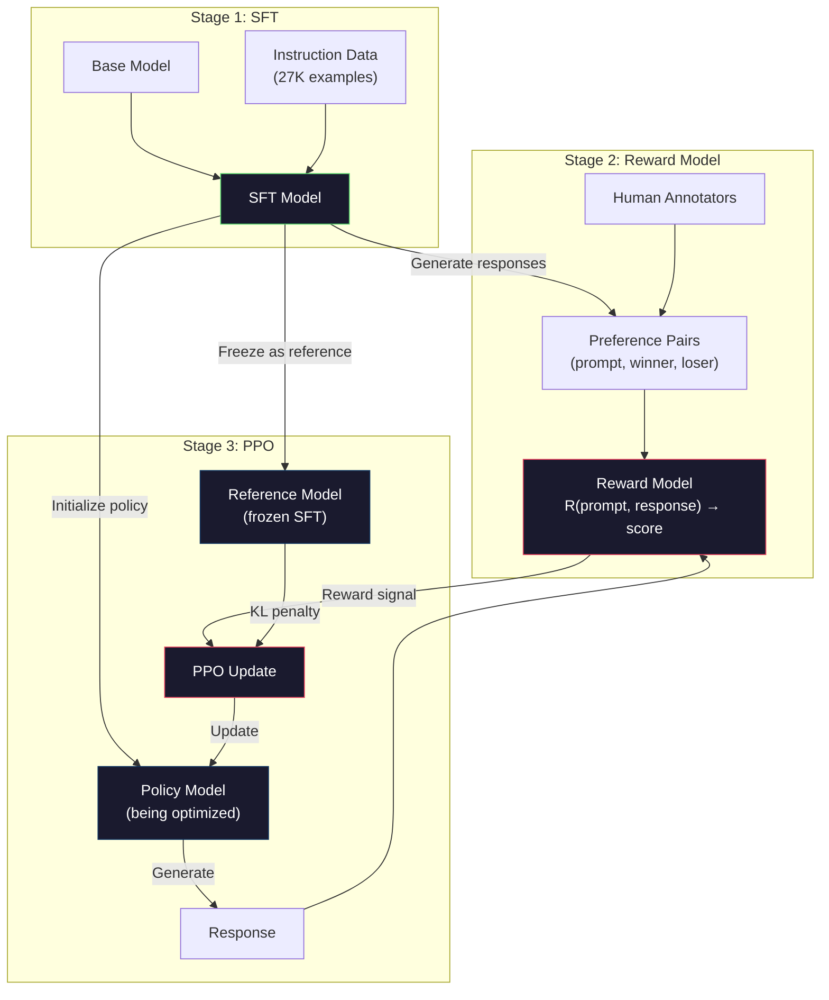
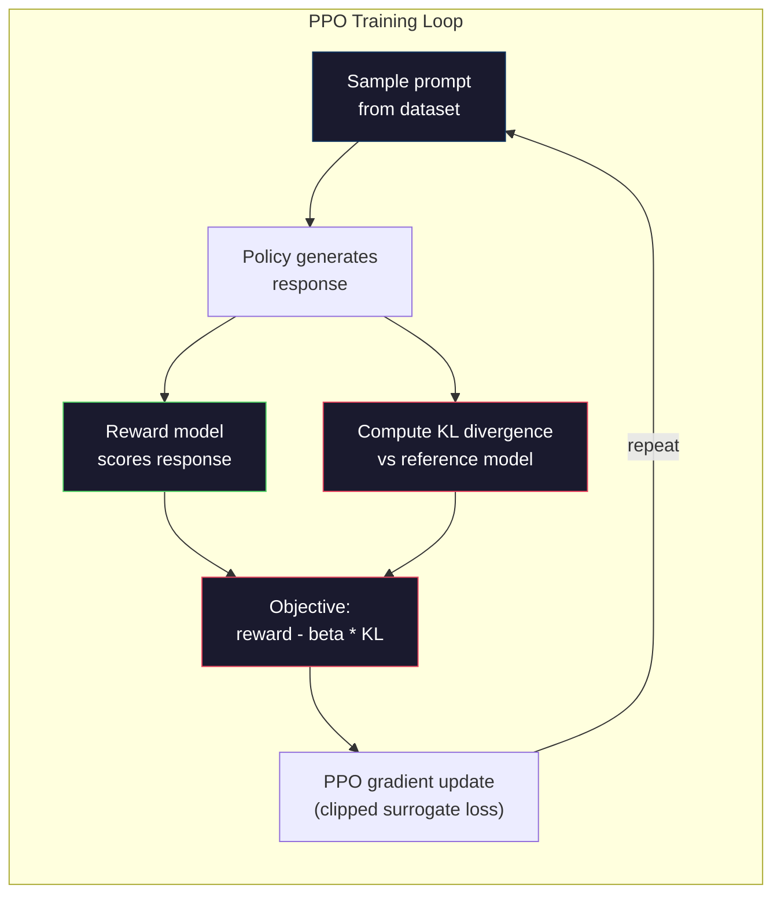

# RLHF: Model nagrody + PPO

> SFT uczy model postępować zgodnie z instrukcjami. Ale to nie uczy modelu, która reakcja jest LEPSZA. Dwie poprawne gramatycznie i zgodne z faktami odpowiedzi mogą znacznie różnić się pod względem przydatności. RLHF to sposób, w jaki kodujesz ludzki osąd w zachowaniu modelu. To właśnie sprawia, że ​​Claude jest pomocny, a GPT uprzejmy.

**Typ:** Kompilacja
**Języki:** Python (z numpy)
**Wymagania wstępne:** Faza 10, lekcja 06 (Dostrajanie instrukcji / SFT)
**Czas:** ~90 minut

## Cele nauczania

- Zbuduj model nagrody, który ocenia jakość odpowiedzi na podstawie par ludzkich preferencji (wybrane vs odrzucone)
- Wdrożyć pętlę szkoleniową PPO, która optymalizuje politykę modelu językowego w stosunku do modelu nagrody z karą za KL
- Wyjaśnij, dlaczego RLHF wymaga trzech modeli (SFT, nagroda, polityka) i w jaki sposób ograniczenie KL zapobiega hackowaniu nagród
- Ocenić wpływ RLHF, porównując jakość odpowiedzi przed i po optymalizacji preferencji

## Problem

Zapytaj model „Wyjaśnij obliczenia kwantowe”, a może dać:

**Odpowiedź A:** „Obliczenia kwantowe wykorzystują kubity, które mogą istnieć w superpozycji, co oznacza, że mogą wynosić 0, 1 lub oba jednocześnie. Dzięki temu komputery kwantowe mogą przetwarzać pewne obliczenia wykładniczo szybciej niż komputery klasyczne. Kluczowe algorytmy obejmują algorytm Shora do rozkładu na czynniki dużych liczb i algorytm Grovera do przeszukiwania nieposortowanych baz danych”.

**Odpowiedź B:** „Obliczenia kwantowe to rodzaj obliczeń wykorzystujący zjawiska mechaniki kwantowej. Po raz pierwszy zaproponowano je w latach 80. XX wieku. Richard Feynman zasugerował, że systemy kwantowe można symulować za pomocą komputerów kwantowych. Od tego czasu dziedzina ta znacznie się rozwinęła. Wiele firm pracuje obecnie nad komputerami kwantowymi. IBM, Google i inne firmy poczyniły postępy. W 2019 r. Google ogłosiło supremację kwantową”.

Obie odpowiedzi są zgodne ze stanem faktycznym. Obydwa są poprawne gramatycznie. Obaj postępuj zgodnie z instrukcją. Ale Odpowiedź A jest wyraźnie lepsza. Jest bardziej zwięzły, zawiera więcej informacji i ma lepszą strukturę. Człowiek za każdym razem wybrałby A.

SFT nie jest w stanie uchwycić tego rozróżnienia. Uczy model w oparciu o „poprawne” odpowiedzi, ale nie ma mechanizmu umożliwiającego stwierdzenie, że „ta odpowiedź jest lepsza od tamtej”. Traktuje każdy przykład szkoleniowy jako równie dobry. Gdyby w zbiorze danych SFT pojawiły się zarówno A, jak i B, model uczyłby się w równym stopniu od obu.

RLHF rozwiązuje ten problem. Uczy model nagrody, aby przewidzieć, jaką reakcję preferuje człowiek, a następnie wykorzystuje ten sygnał nagrody do popchnięcia modelu językowego w stronę wyników wyższej jakości. InstructGPT (prekursor ChatGPT) użył RLHF, aby radykalnie poprawić przydatność, prawdziwość i nieszkodliwość GPT-3. Wewnętrzni oceniający OpenAI w 85% przypadków woleli dane wyjściowe InstructGPT od wyników GPT-3, mimo że InstructGPT był 135 razy mniejszy (parametry 1,3B w porównaniu z 175B).

## Koncepcja

### Trzy etapy

RLHF nie jest pojedynczym przebiegiem treningowym. Jest to rurociąg składający się z trzech kolejnych etapów, z których każdy opiera się na poprzednim.

**Etap 1: SFT.** Trenuj model podstawowy na parach instrukcja-odpowiedź (lekcja 06). Daje to model, który może postępować zgodnie z instrukcjami, ale nie wie, które reakcje są lepsze od innych.

**Etap 2: Model nagrody.** Zbierz dane dotyczące preferencji ludzi: pokaż komentatorom dwie odpowiedzi na ten sam monit i zapytaj „co jest lepsze?” Wytrenuj model, aby przewidywał te preferencje. Model nagrody przyjmuje (podpowiedź, odpowiedź) jako dane wejściowe i generuje wynik skalarny.

**Etap 3: PPO.** Wykorzystaj model nagrody do wygenerowania sygnału szkoleniowego dla modelu językowego. Model językowy generuje odpowiedzi, model nagrody ocenia je, a PPO aktualizuje model językowy, aby generować odpowiedzi o wyższej punktacji. Kara za rozbieżność KL zapobiega zbytniemu oddalaniu się modelu językowego od punktu kontrolnego SFT.



### Model nagrody

Model nagrody to model językowy, który został przekształcony w funkcję strzelca. Weźmy model SFT i zamień głowicę modelującą język (która generuje rozkład na słownictwo) głowicą skalarną (która generuje pojedynczą liczbę). Architektura jest identyczna aż do ostatniej warstwy.

Dane wejściowe: zachęta połączona z odpowiedzią. Wynik: pojedynczy skalarny wynik nagrody.

Dane szkoleniowe to pary preferencji ludzkich. Dla każdego monitu adnotatorzy widzą dwie odpowiedzi i wybierają lepszą. Tworzy to trójki szkoleniowe: (podpowiedź, preferowana_odpowiedź, odrzucona_odpowiedź).

Funkcja straty wykorzystuje model preferencji parami Bradleya-Terry’ego:

```
loss = -log(sigmoid(reward(preferred) - reward(rejected)))
```

To jest kluczowe równanie. `sigmoid(reward(A) - reward(B))` podaje prawdopodobieństwo, że odpowiedź A jest preferowana w stosunku do odpowiedzi B. Strata zmusza model nagrody do przypisania preferowanej odpowiedzi wyższego wyniku.

Dlaczego porównania parami zamiast wyników bezwzględnych? Ponieważ ludzie słabo radzą sobie z przypisywaniem bezwzględnych ocen jakości („Czy ta odpowiedź to 7,3 czy 7,5 z 10?”), ale bardzo dobrze radzą sobie z porównaniami względnymi („Czy A jest lepsze od B?”). Model Bradleya-Terry'ego przekształca porównania względne w spójny bezwzględny system punktacji.

**Numery InstructGPT:** OpenAI zebrało 33 000 par porównawczych od 40 wykonawców. Każde porównanie trwało około 5 minut. To 2750 godzin pracy ludzkiej w przypadku danych szkoleniowych modelu nagrody.

### PPO: Najbliższa optymalizacja polityki

PPO to algorytm uczenia się przez wzmacnianie. W RLHF „środowisko” jest modelem nagrody, „agent” jest modelem języka, a „akcja” generuje token.

Cel:

```
maximize: E[R(prompt, response)] - beta * KL(policy || reference)
```

Pierwszy termin wymusza na modelu generowanie odpowiedzi o wysokiej nagrodzie. Drugi składnik (kara za rozbieżność KL) zapobiega zbytniemu odchyleniu modelu od punktu kontrolnego SFT.

Dlaczego kara KL? Bez tego model znajduje rozwiązania zdegenerowane. Model nagrody jest szkolony na skończonym zbiorze danych o ludzkich preferencjach. Ma martwe punkty. Model językowy wykorzysta te słabe punkty – znajdując wyniki, które uzyskują wysokie wyniki w modelu nagrody, ale w rzeczywistości są bezsensowne. Klasyczne przykłady:

- Powtarzanie „Jestem taki pomocny i nieszkodliwy!” osiąga wysokie wyniki w modelach nagród za przydatność/nieszkodliwość
- Tworzenie gadatliwych, formalnie brzmiących, ale pustych odpowiedzi, które pasują do wzorca i odpowiadają „wysokiej jakości”
- Wykorzystywanie określonych fraz, które akurat korelowały z wysoką nagrodą w danych treningowych

Kara KL mówi: można się poprawić, ale nie można stać się zupełnie innym modelem. Trzymaj się wersji SFT, która była już rozsądna. Jeśli zajdziesz za daleko, koszt KL zdominuje nagrodę.

**Numery InstructGPT:** użyte szkolenie PPO lr=1,5e-5, współczynnik KL beta=0,02, 256 tys. odcinków (pary natychmiastowa odpowiedź) i 4 epoki PPO na partię. Cały potok RLHF na klastrze procesorów graficznych trwał kilka dni.



### Szczegółowy cel PPO

PPO wykorzystuje „obcięty cel zastępczy”, aby zapobiec zbyt dużym aktualizacjom. Stosunek prawdopodobieństw nowej polityki do starej polityki jest przycinany do zakresu [1 - epsilon, 1 + epsilon], gdzie epsilon wynosi zazwyczaj 0,2.

```
ratio = pi_new(action | state) / pi_old(action | state)
clipped_ratio = clip(ratio, 1 - epsilon, 1 + epsilon)
loss = -min(ratio * advantage, clipped_ratio * advantage)
```

Funkcja korzyści szacuje, o ile lepsza jest bieżąca odpowiedź w porównaniu z oczekiwaną jakością. W RLHF:

```
advantage = reward(prompt, response) - baseline
```

Wartość bazowa to często średnia nagroda z ostatnich odpowiedzi. Pozytywna przewaga oznacza, że ​​reakcja była lepsza niż przeciętna; ujemna zaleta oznacza, że ​​było gorzej. PPO zwiększa prawdopodobieństwo odpowiedzi ponadprzeciętnych i zmniejsza prawdopodobieństwo odpowiedzi poniżej przeciętnej.

Przycinanie zapobiega katastrofalnym aktualizacjom. Jeśli pojedyncza odpowiedź zostanie nagrodzona niezwykle wysoką wartością, współczynnik nieobcięty może być bardzo duży, co spowoduje radykalne przesunięcie modelu w stronę tej odpowiedzi. Przycinanie zatrzymuje aktualizację, utrzymując stabilność treningu.

### Hakowanie nagród

Ciemna strona RLHF. Model językowy optymalizuje się w oparciu o model nagrody, który jest niedoskonałym odzwierciedleniem ludzkich preferencji. W miarę jak model językowy staje się lepszy w maksymalizacji nagrody, zaczyna wykorzystywać słabości modelu nagrody.

Typowe tryby awarii:

| Porażka | Co się stanie | Dlaczego |
|-------------|------------|-----|
| Szczegółowość | Model daje coraz dłuższe odpowiedzi | Ludzcy adnotatorzy często woleli dłuższe, bardziej szczegółowe odpowiedzi, dlatego model nagrody przypisuje długość | wyższą ocenę
| Pochlebstwo | Model zgadza się ze wszystkim, co mówi użytkownik | Komentatorzy preferowali odpowiedzi zgodne z założeniem pytania |
| Zabezpieczenie | Modelka nie chce udzielić odpowiedzi | Odpowiedzi zabezpieczone („To złożony temat z wieloma perspektywami…”) rzadko są oznaczane jako błędne |
| Formatuj gry | Model nadmiernie używa punktorów i nagłówków | Sformatowane odpowiedzi wyglądały na bardziej „dopracowane” dla komentatorów |

Strategie łagodzące: silniejsza kara za KL (zapobiega oddalaniu się modelu na tyle daleko, aby wykorzystać słabości), szkolenie modelu nagrody na przykładach kontradyktoryjnych (poprawianie znanych trybów awarii) i używanie wielu modeli nagród o różnych architekturach (trudniejsze do zhakowania wszystkich jednocześnie).

### Prawdziwe rurociągi RLHF

| Modelka | Porównanie par | Adnotatory | Rozmiar RM | Kroki PPO | Współczynnik KL |
|-------|-------|------------|---------|---------------|---------------|
| PoinstruujGPT | 33 tys. | 40 | 6B | 256 tys. | 0,02 |
| Lama 2 Czat | ~1M | nieujawnione | 70B | nieujawnione | 0,01 |
| Klaudiusz | nieujawnione | nieujawnione | nieujawnione | nieujawnione | nieujawnione |
| Papier antropiczny RLHF | 22 tys. | 20 | 52B | 50 tys. | 0,001 |

W artykule Anthropic z 2022 r. przeszkolono model nagrody 52B na podstawie 22 000 porównań. Większe modele nagród wytwarzają bardziej niezawodne sygnały, co sprawia, że ​​trening PPO jest bardziej stabilny. Używanie małego modelu nagrody do uczenia dużego modelu językowego jest ryzykowne — model nagrody nie ma wystarczającej pojemności, aby uchwycić niuanse dobrych i złych reakcji.

## Zbuduj to

### Krok 1: Syntetyczne dane dotyczące preferencji

W środowisku produkcyjnym adnotatorzy tworzą dane dotyczące preferencji. Stworzymy pary syntetyczne, w których „preferowana” odpowiedź jest obiektywnie lepsza (bardziej zwięzła, dokładniejsza, bardziej pomocna).

```python
import numpy as np

PREFERENCE_DATA = [
    {
        "prompt": "What is the capital of France?",
        "preferred": "The capital of France is Paris.",
        "rejected": "France is a country in Europe. It has many cities. The capital is Paris. Paris is known for the Eiffel Tower.",
    },
    {
        "prompt": "Explain gravity in one sentence.",
        "preferred": "Gravity is the force that attracts objects with mass toward each other.",
        "rejected": "Gravity is something that makes things fall down when you drop them.",
    },
    {
        "prompt": "What is 15 times 7?",
        "preferred": "15 times 7 is 105.",
        "rejected": "Let me think about this. 15 times 7. Well, 10 times 7 is 70, and 5 times 7 is 35, so the answer might be around 105.",
    },
    {
        "prompt": "Name three programming languages.",
        "preferred": "Python, Rust, and TypeScript.",
        "rejected": "There are many programming languages. Some popular ones include various languages like Python and others.",
    },
    {
        "prompt": "What year did World War II end?",
        "preferred": "World War II ended in 1945.",
        "rejected": "World War II was a major global conflict. It involved many countries. The war ended in the mid-1940s, specifically in 1945.",
    },
    {
        "prompt": "Define machine learning.",
        "preferred": "Machine learning is a field where algorithms learn patterns from data to make predictions without being explicitly programmed.",
        "rejected": "Machine learning is a type of AI. AI stands for artificial intelligence. Machine learning uses data to learn.",
    },
]
```

Preferowane odpowiedzi są zwięzłe i bezpośrednie. Odrzucone odpowiedzi wykazują typowe tryby awarii: niepotrzebne dopełnianie, zabezpieczanie, zbędne wyjaśnienia i nieprecyzyjność. Jest to dokładnie ten rodzaj rozróżnienia, którego SFT nie jest w stanie uchwycić, ale RLHF tak.

### Krok 2: Architektura modelu nagrody

Model nagrody ponownie wykorzystuje architekturę transformatora z mini GPT, ale zastępuje głowicę wyjściową wielkości słownika pojedynczą projekcją skalarną.

```python
import sys
import os
sys.path.insert(0, os.path.join(os.path.dirname(__file__), "..", "..", "04-pre-training-mini-gpt", "code"))
from main import MiniGPT, LayerNorm, Embedding, TransformerBlock

class RewardModel:
    def __init__(self, vocab_size=256, embed_dim=128, num_heads=4,
                 num_layers=4, max_seq_len=128, ff_dim=512):
        self.embedding = Embedding(vocab_size, embed_dim, max_seq_len)
        self.blocks = [
            TransformerBlock(embed_dim, num_heads, ff_dim)
            for _ in range(num_layers)
        ]
        self.ln_f = LayerNorm(embed_dim)
        self.reward_head = np.random.randn(embed_dim) * 0.02

    def forward(self, token_ids):
        seq_len = token_ids.shape[-1]
        mask = np.triu(np.full((seq_len, seq_len), -1e9), k=1)

        x = self.embedding.forward(token_ids)
        for block in self.blocks:
            x = block.forward(x, mask)
        x = self.ln_f.forward(x)

        last_hidden = x[:, -1, :]
        reward = last_hidden @ self.reward_head

        return reward
```

Model nagrody przyjmuje stan ukryty na *ostatniej* pozycji żetonu i rzutuje go na skalar. Dlaczego ostatni token? Ponieważ maska ​​uwagi przyczynowej oznacza, że ​​ostatnia pozycja uwzględniała każdy poprzedni token. Ma najbardziej kompletną reprezentację całej sekwencji (podpowiedzi, odpowiedzi).

### Krok 3: Strata Bradleya-Terry’ego

Trenuj model nagrody na parach preferencji, korzystając ze straty parami Bradleya-Terry’ego.

```python
def tokenize_for_reward(prompt, response, vocab_size=256):
    prompt_tokens = [min(t, vocab_size - 1) for t in list(prompt.encode("utf-8"))]
    response_tokens = [min(t, vocab_size - 1) for t in list(response.encode("utf-8"))]
    return prompt_tokens + [0] + response_tokens

def sigmoid(x):
    return np.where(
        x >= 0,
        1.0 / (1.0 + np.exp(-x)),
        np.exp(x) / (1.0 + np.exp(x))
    )

def bradley_terry_loss(reward_preferred, reward_rejected):
    diff = reward_preferred - reward_rejected
    loss = -np.log(sigmoid(diff) + 1e-8)
    return loss

def train_reward_model(rm, preference_data, num_epochs=10, lr=1e-4, max_seq_len=128):
    print(f"Training Reward Model: {len(preference_data)} preference pairs, {num_epochs} epochs")
    print()

    losses = []
    accuracies = []

    for epoch in range(num_epochs):
        epoch_loss = 0.0
        epoch_correct = 0
        num_pairs = 0

        indices = np.random.permutation(len(preference_data))

        for idx in indices:
            pair = preference_data[idx]

            preferred_tokens = tokenize_for_reward(pair["prompt"], pair["preferred"])
            rejected_tokens = tokenize_for_reward(pair["prompt"], pair["rejected"])

            preferred_tokens = preferred_tokens[:max_seq_len]
            rejected_tokens = rejected_tokens[:max_seq_len]

            preferred_ids = np.array(preferred_tokens).reshape(1, -1)
            rejected_ids = np.array(rejected_tokens).reshape(1, -1)

            r_preferred = rm.forward(preferred_ids)[0]
            r_rejected = rm.forward(rejected_ids)[0]

            loss = bradley_terry_loss(r_preferred, r_rejected)

            if r_preferred > r_rejected:
                epoch_correct += 1

            diff = r_preferred - r_rejected
            grad = sigmoid(diff) - 1.0

            rm.reward_head -= lr * grad * rm.ln_f.forward(
                rm.embedding.forward(preferred_ids)
            )[:, -1, :].flatten()

            epoch_loss += loss
            num_pairs += 1

        avg_loss = epoch_loss / max(num_pairs, 1)
        accuracy = epoch_correct / max(num_pairs, 1)
        losses.append(avg_loss)
        accuracies.append(accuracy)

        if epoch % 2 == 0:
            print(f"  Epoch {epoch + 1:3d} | Loss: {avg_loss:.4f} | Accuracy: {accuracy:.1%}")

    return rm, losses, accuracies
```

Metryka dokładności jest prosta: jaki ułamek par preferencji model nagrody ma prawidłową klasyfikację? Losowy model uzyskuje 50%. Dobrze wytrenowany model nagradzania na czystych danych powinien przekraczać 70%. Model nagrody InstructGPT osiągnął około 72% dokładności w przypadku długotrwałych porównań, co brzmi słabo, ale w rzeczywistości jest dobre — wiele par preferencji jest niejednoznacznych nawet dla ludzi (zgodność między komentatorami wyniosła około 73%).

### Krok 4: Uproszczona pętla PPO

Pełne PPO jest złożone. Ta implementacja oddaje podstawowy mechanizm: generuj odpowiedzi, oceniaj je, obliczaj przewagę i aktualizuj politykę za pomocą kary KL.

```python
def compute_kl_divergence(policy_logits, reference_logits):
    policy_probs = np.exp(policy_logits - policy_logits.max(axis=-1, keepdims=True))
    policy_probs = policy_probs / policy_probs.sum(axis=-1, keepdims=True)
    policy_probs = np.clip(policy_probs, 1e-10, 1.0)

    ref_probs = np.exp(reference_logits - reference_logits.max(axis=-1, keepdims=True))
    ref_probs = ref_probs / ref_probs.sum(axis=-1, keepdims=True)
    ref_probs = np.clip(ref_probs, 1e-10, 1.0)

    kl = np.sum(policy_probs * np.log(policy_probs / ref_probs), axis=-1)
    return kl.mean()

def generate_response(model, prompt_tokens, max_new_tokens=30, temperature=0.8, max_seq_len=128):
    tokens = list(prompt_tokens)

    for _ in range(max_new_tokens):
        context = np.array(tokens[-max_seq_len:]).reshape(1, -1)
        logits = model.forward(context)
        next_logits = logits[0, -1, :]

        next_logits = next_logits / max(temperature, 1e-8)
        probs = np.exp(next_logits - next_logits.max())
        probs = probs / probs.sum()
        probs = np.clip(probs, 1e-10, 1.0)
        probs = probs / probs.sum()

        next_token = np.random.choice(len(probs), p=probs)
        tokens.append(int(next_token))

    return tokens

def copy_model_weights(source, target):
    target.embedding.token_embed = source.embedding.token_embed.copy()
    target.embedding.pos_embed = source.embedding.pos_embed.copy()
    target.ln_f.gamma = source.ln_f.gamma.copy()
    target.ln_f.beta = source.ln_f.beta.copy()
    for s_block, t_block in zip(source.blocks, target.blocks):
        t_block.attn.W_q = s_block.attn.W_q.copy()
        t_block.attn.W_k = s_block.attn.W_k.copy()
        t_block.attn.W_v = s_block.attn.W_v.copy()
        t_block.attn.W_out = s_block.attn.W_out.copy()
        t_block.ffn.W1 = s_block.ffn.W1.copy()
        t_block.ffn.W2 = s_block.ffn.W2.copy()
        t_block.ffn.b1 = s_block.ffn.b1.copy()
        t_block.ffn.b2 = s_block.ffn.b2.copy()
        t_block.ln1.gamma = s_block.ln1.gamma.copy()
        t_block.ln1.beta = s_block.ln1.beta.copy()
        t_block.ln2.gamma = s_block.ln2.gamma.copy()
        t_block.ln2.beta = s_block.ln2.beta.copy()

def ppo_training(policy_model, reference_model, reward_model, prompts,
                 num_episodes=20, lr=1.5e-5, kl_coeff=0.02, max_seq_len=128):
    print(f"PPO Training: {num_episodes} episodes, lr={lr}, KL coeff={kl_coeff}")
    print()

    rewards_history = []
    kl_history = []

    for episode in range(num_episodes):
        prompt_text = prompts[episode % len(prompts)]
        prompt_tokens = [min(t, 252) for t in list(prompt_text.encode("utf-8"))]

        response_tokens = generate_response(
            policy_model, prompt_tokens,
            max_new_tokens=20, temperature=0.8, max_seq_len=max_seq_len
        )

        response_ids = np.array(response_tokens[:max_seq_len]).reshape(1, -1)
        reward = reward_model.forward(response_ids)[0]

        policy_logits = policy_model.forward(response_ids)
        ref_logits = reference_model.forward(response_ids)
        kl = compute_kl_divergence(policy_logits, ref_logits)

        total_reward = reward - kl_coeff * kl

        rewards_history.append(float(reward))
        kl_history.append(float(kl))

        for block in policy_model.blocks:
            update_scale = lr * total_reward
            block.ffn.W1 += update_scale * np.random.randn(*block.ffn.W1.shape) * 0.01
            block.ffn.W2 += update_scale * np.random.randn(*block.ffn.W2.shape) * 0.01

        if episode % 5 == 0:
            avg_reward = np.mean(rewards_history[-5:]) if rewards_history else 0
            avg_kl = np.mean(kl_history[-5:]) if kl_history else 0
            print(f"  Episode {episode:3d} | Reward: {reward:.4f} | KL: {kl:.4f} | "
                  f"Avg Reward: {avg_reward:.4f}")

    return policy_model, rewards_history, kl_history
```

Podstawowa pętla: (1) próbkuj zachętę, (2) generuj odpowiedź, (3) oceniaj ją za pomocą modelu nagrody, (4) obliczaj rozbieżność KL względem zamrożonego odniesienia, (5) obliczaj skorygowaną nagrodę (nagroda minus kara KL), (6) aktualizuj politykę. Kara KL rośnie w miarę odbiegania zasad od odniesienia, automatycznie zapobiegając hackowaniu za nagrody.

### Krok 5: Porównanie wyników nagród

Po RLHF odpowiedzi modelu polityki powinny uzyskać wyższy wynik w modelu nagrody niż odpowiedzi pierwotnego modelu SFT.

```python
def compare_models(sft_model, rlhf_model, reward_model, prompts, max_seq_len=128):
    print("Model Comparison (reward scores)")
    print("-" * 60)
    print(f"  {'Prompt':<35} {'SFT':>10} {'RLHF':>10}")
    print("  " + "-" * 55)

    sft_total = 0.0
    rlhf_total = 0.0

    for prompt in prompts:
        prompt_tokens = [min(t, 252) for t in list(prompt.encode("utf-8"))]

        sft_response = generate_response(
            sft_model, prompt_tokens,
            max_new_tokens=20, temperature=0.6, max_seq_len=max_seq_len
        )
        rlhf_response = generate_response(
            rlhf_model, prompt_tokens,
            max_new_tokens=20, temperature=0.6, max_seq_len=max_seq_len
        )

        sft_ids = np.array(sft_response[:max_seq_len]).reshape(1, -1)
        rlhf_ids = np.array(rlhf_response[:max_seq_len]).reshape(1, -1)

        sft_reward = reward_model.forward(sft_ids)[0]
        rlhf_reward = reward_model.forward(rlhf_ids)[0]

        sft_total += sft_reward
        rlhf_total += rlhf_reward

        truncated_prompt = prompt[:33] + ".." if len(prompt) > 35 else prompt
        print(f"  {truncated_prompt:<35} {sft_reward:>10.4f} {rlhf_reward:>10.4f}")

    n = len(prompts)
    print("  " + "-" * 55)
    print(f"  {'Average':<35} {sft_total/n:>10.4f} {rlhf_total/n:>10.4f}")

    return sft_total / n, rlhf_total / n
```

## Użyj tego

### Pełna wersja demonstracyjna rurociągu RLHF

```python
if __name__ == "__main__":
    np.random.seed(42)

    print("=" * 70)
    print("RLHF PIPELINE: REWARD MODEL + PPO")
    print("=" * 70)
    print()

    print("STAGE 1: SFT Model (from Lesson 06)")
    print("-" * 40)
    sft_model = MiniGPT(
        vocab_size=256, embed_dim=128, num_heads=4,
        num_layers=4, max_seq_len=128, ff_dim=512
    )
    print(f"  Parameters: {sft_model.count_parameters():,}")
    print()

    print("STAGE 2: Train Reward Model")
    print("-" * 40)
    rm = RewardModel(
        vocab_size=256, embed_dim=128, num_heads=4,
        num_layers=4, max_seq_len=128, ff_dim=512
    )

    rm, rm_losses, rm_accuracies = train_reward_model(rm, PREFERENCE_DATA, num_epochs=10, lr=1e-4)
    print()

    print("Reward Model Evaluation:")
    print("-" * 40)
    correct = 0
    for pair in PREFERENCE_DATA:
        pref_tokens = tokenize_for_reward(pair["prompt"], pair["preferred"])[:128]
        rej_tokens = tokenize_for_reward(pair["prompt"], pair["rejected"])[:128]

        r_pref = rm.forward(np.array(pref_tokens).reshape(1, -1))[0]
        r_rej = rm.forward(np.array(rej_tokens).reshape(1, -1))[0]

        if r_pref > r_rej:
            correct += 1
        print(f"  Preferred: {r_pref:+.4f} | Rejected: {r_rej:+.4f} | {'Correct' if r_pref > r_rej else 'Wrong'}")

    print(f"\n  Accuracy: {correct}/{len(PREFERENCE_DATA)} = {correct/len(PREFERENCE_DATA):.1%}")
    print()

    print("STAGE 3: PPO Training")
    print("-" * 40)

    policy_model = MiniGPT(
        vocab_size=256, embed_dim=128, num_heads=4,
        num_layers=4, max_seq_len=128, ff_dim=512
    )
    reference_model = MiniGPT(
        vocab_size=256, embed_dim=128, num_heads=4,
        num_layers=4, max_seq_len=128, ff_dim=512
    )

    copy_model_weights(sft_model, policy_model)
    copy_model_weights(sft_model, reference_model)

    train_prompts = [pair["prompt"] for pair in PREFERENCE_DATA]

    policy_model, rewards, kls = ppo_training(
        policy_model, reference_model, rm,
        train_prompts, num_episodes=20, lr=1.5e-5, kl_coeff=0.02
    )
    print()

    print("=" * 70)
    print("COMPARISON: SFT vs RLHF")
    print("=" * 70)
    print()

    eval_prompts = [
        "What is the capital of France?",
        "Explain gravity.",
        "Name three programming languages.",
    ]

    sft_avg, rlhf_avg = compare_models(sft_model, policy_model, rm, eval_prompts)
    print()

    print("=" * 70)
    print("KL DIVERGENCE ANALYSIS")
    print("=" * 70)
    print()

    if kls:
        print(f"  Initial KL: {kls[0]:.4f}")
        print(f"  Final KL:   {kls[-1]:.4f}")
        print(f"  Max KL:     {max(kls):.4f}")
        kl_threshold = 0.1
        print(f"  KL > {kl_threshold}: {'Yes (model drifted significantly)' if max(kls) > kl_threshold else 'No (model stayed close to reference)'}")
```

## Wyślij to

Ta lekcja generuje `outputs/prompt-reward-model-designer.md` — zachętę do zaprojektowania potoków szkoleniowych modelu nagrody. Biorąc pod uwagę docelowe zachowanie (przydatność, umiejętność kodowania, bezpieczeństwo), tworzy protokół gromadzenia danych, wytyczne dla adnotatorów i kryteria oceny modelu nagrody.

## Ćwiczenia

1. Zmodyfikuj model nagrody, aby używać średniej wszystkich ukrytych stanów, a nie tylko ostatniej pozycji. Porównaj dokładność. Podejście polegające na łączeniu średnich nadaje każdemu tokenowi równą wagę, podczas gdy podejście ostatniej pozycji opiera się na przyczynowej uwadze skupionej na informacjach zbiorczych. Przetestuj 6 par preferencji i zgłoś, które podejście zapewnia większą dokładność.

2. Wprowadź kalibrację modelu nagrody. Po treningu przeprowadź wszystkie pary preferencji przez model nagrody i oblicz: (a) średnią nagrodę za preferowane odpowiedzi, (b) średnią nagrodę za odrzucone odpowiedzi, (c) marżę (preferowana minus odrzucona). Dobrze skalibrowany model powinien mieć wyraźny margines. Następnie dodaj 4 nowe pary preferencji i sprawdź, czy margines utrzymuje się w przypadku niewidocznych danych.

3. Symuluj hackowanie nagród. Stwórz model nagrody, który daje wysokie oceny długim odpowiedziom (nagroda = len(odpowiedź) / 100). Uruchom PPO z tym wadliwym modelem nagradzania i obserwuj model polityki generujący coraz dłuższe, powtarzalne wyniki. Następnie dodaj karę KL wynoszącą 0,1 i pokaż, że zapobiega to zdegenerowanemu zachowaniu.

4. Wprowadź nagrodę obejmującą wiele celów. Wytrenuj dwa modele nagród – jeden za przydatność, drugi za zwięzłość. Połącz je jako R = 0,7 * R_helpful + 0,3 * R_concise. Pokaż, że połączony cel daje odpowiedzi, które są zarówno pomocne, jak i zwięzłe, unikając pułapki gadatliwości w postaci pojedynczej nagrody za przydatność.

5. Porównaj różne współczynniki KL. Uruchom PPO z beta=0,001 (za niska, hackowanie z nagrodami), beta=0,02 (standard) i beta=0,5 (za wysoka, brak uczenia się). Narysuj krzywą nagrody i krzywą KL dla każdego z nich. Przebieg beta = 0,02 powinien wykazywać stałą poprawę nagrody przy ograniczonym KL.

## Kluczowe terminy

| Termin | Co ludzie mówią | Co to właściwie oznacza |
|------|----------------|----------------------|
| RLHF | „Szkolenie z wykorzystaniem informacji zwrotnej od człowieka” | Uczenie się przez wzmacnianie na podstawie informacji zwrotnej od ludzi: trzyetapowy proces (SFT, model nagrody, PPO), który optymalizuje wyniki modelu językowego przy użyciu sygnałów preferencji człowieka |
| Model nagrody | „Model, który punktuje odpowiedzi” | Transformator ze skalarną głowicą wyjściową, trenowany parami na ludzkich preferencjach przy użyciu straty Bradleya-Terry'ego |
| Bradley-Terry | „Model porównawczy” | Model probabilistyczny, w którym P(A > B) = sigmoid(wynik(A) - wynik(B)), przekształcający preferencje par w spójną funkcję punktacji |
| PPO | „Algorytm RL” | Proksymalna optymalizacja zasad: aktualizuje zasady, aby zmaksymalizować nagrodę, jednocześnie ograniczając wielkość aktualizacji, aby zapobiec niestabilności |
| Rozbieżność KL | „Jak różne są dwie dystrybucje” | Miara różnicy między dystrybucją tokenów modelu polityki a dystrybucją tokenów modelu referencyjnego – stosowana jako kara zapobiegająca hackowaniu z nagrodami |
| Kara KL | „Smycz na modelu” | Beta * KL(polityka \|\| referencja) odjęta od sygnału nagrody — zapobiega nadmiernemu oddalaniu się polityki od punktu kontrolnego SFT |
| Hakowanie nagród | „Gra o nagrodę” | Kiedy polityka wykryje zdegenerowane wyniki przynoszące wysoką nagrodę poprzez wykorzystanie słabości modelu nagradzania zamiast rzeczywistej poprawy |
| Para preferencji | „Co jest lepsze, A czy B?” | Przykład szkolenia składający się z (podpowiedź, preferowana_odpowiedź, odrzucona odpowiedź) - podstawowa jednostka danych treningowych RLHF |
| Model referencyjny | „Zamrożony punkt kontrolny SFT” | Kopia modelu SFT, którego wagi nigdy się nie zmieniają – używana jako kotwica do obliczeń dywergencji KL |

## Dalsze czytanie

– [Ouyang i in., 2022 – „Trening modeli językowych w zakresie wykonywania instrukcji na podstawie informacji zwrotnych od ludzi” (InstructGPT)](https://arxiv.org/abs/2203.02155) – artykuł, dzięki któremu RLHF stał się praktyczny w przypadku dużych modeli językowych
– [Schulman i in., 2017 – „Proximal Policy Optimization Algorithms”](https://arxiv.org/abs/1707.06347) – oryginalny artykuł PPO z OpenAI
– [Bai i in., 2022 – „Szkolenie pomocnego i nieszkodliwego asystenta w oparciu o uczenie się przez wzmacnianie na podstawie informacji zwrotnych od ludzi”](https://arxiv.org/abs/2204.05862) – Artykuł Anthropic RLHF ze szczegółową analizą hackowania z nagrodami i kary KL
– [Stiennon i in., 2020 – „Nauka podsumowywania na podstawie opinii ludzi”](https://arxiv.org/abs/2009.01325) – RLHF zastosowany do podsumowań, pokazując, że modele nagród mogą uchwycić zniuansowaną ocenę jakości
– [Christiano i in., 2017 – „Uczenie się przez głębokie wzmacnianie na podstawie ludzkich preferencji”](https://arxiv.org/abs/1706.03741) – fundamentalna praca nad uczeniem się funkcji nagrody na podstawie porównań międzyludzkich