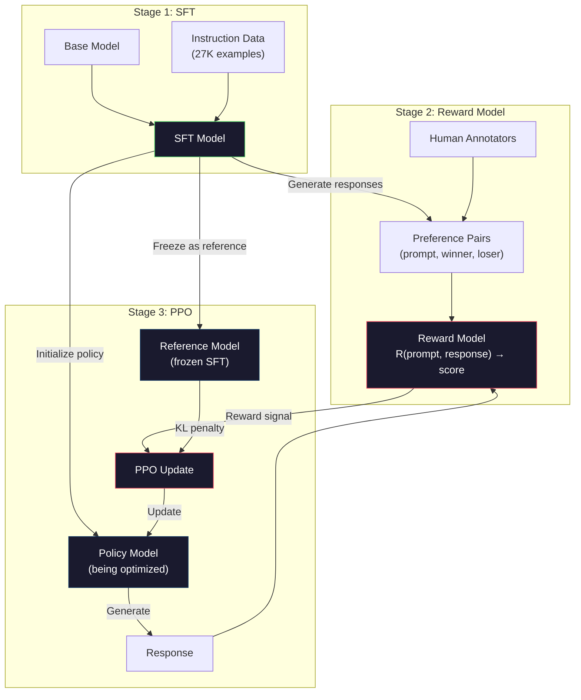
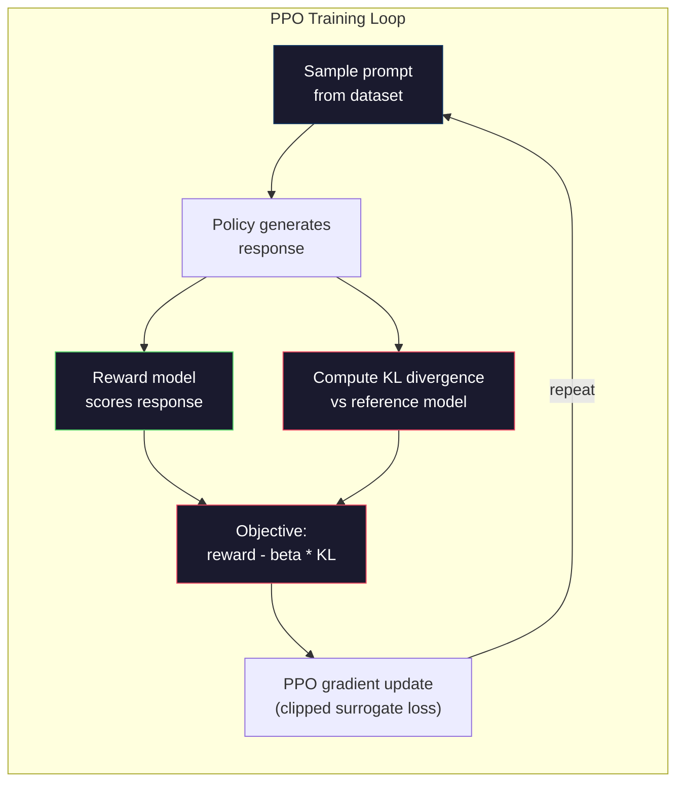

# RLHF: Model nagrody + PPO

> SFT uczy model postępowania zgodnie z instrukcjami. Nie uczy go jednak rozróżniać, która odpowiedź jest LEPSZA. Dwie odpowiedzi — obie poprawne gramatycznie i zgodne z faktami — mogą się znacznie różnić pod względem przydatności. RLHF to mechanizm kodowania ludzkiego osądu w zachowaniu modelu. To właśnie dzięki niemu Claude jest pomocny, a GPT uprzejmy.

**Typ:** Kompilacja
**Języki:** Python (z numpy)
**Wymagania wstępne:** Faza 10, lekcja 06 (Dostrajanie instrukcji / SFT)
**Czas:** ~90 minut

## Cele nauczania

- Zbudować model nagrody oceniający jakość odpowiedzi na podstawie par ludzkich preferencji (wybrane vs odrzucone)
- Wdrożyć pętlę treningową PPO optymalizującą politykę modelu językowego względem modelu nagrody z karą za dywergencję KL
- Wyjaśnić, dlaczego RLHF wymaga trzech modeli (SFT, nagrody, polityki) oraz w jaki sposób ograniczenie KL zapobiega hakowaniu nagród
- Ocenić wpływ RLHF przez porównanie jakości odpowiedzi przed i po optymalizacji preferencji

## Problem

Zapytaj model „Wyjaśnij obliczenia kwantowe", a może zwrócić:

**Odpowiedź A:** „Obliczenia kwantowe wykorzystują kubity, które mogą istnieć w superpozycji, co oznacza, że mogą przyjmować wartości 0, 1 lub obie jednocześnie. Dzięki temu komputery kwantowe mogą realizować pewne obliczenia wykładniczo szybciej niż komputery klasyczne. Kluczowe algorytmy obejmują algorytm Shora do rozkładu dużych liczb na czynniki pierwsze i algorytm Grovera do przeszukiwania nieposortowanych baz danych".

**Odpowiedź B:** „Obliczenia kwantowe to rodzaj obliczeń wykorzystujący zjawiska mechaniki kwantowej. Po raz pierwszy zaproponowano je w latach 80. XX wieku. Richard Feynman zasugerował, że systemy kwantowe można symulować za pomocą komputerów kwantowych. Od tego czasu dziedzina ta znacznie się rozwinęła. Wiele firm pracuje dziś nad komputerami kwantowymi — IBM, Google i inne poczyniły w tym zakresie znaczące postępy. W 2019 r. Google ogłosiło supremację kwantową".

Obie odpowiedzi są zgodne z faktami i poprawne gramatycznie. Obie realizują polecenie. Jednak Odpowiedź A jest wyraźnie lepsza — bardziej zwięzła, treściwsza i lepiej zorganizowana. Człowiek wybrałby A bez wahania.

SFT nie jest w stanie uchwycić tej różnicy. Uczy model na podstawie „poprawnych" odpowiedzi, lecz nie dysponuje mechanizmem pozwalającym stwierdzić, że „ta odpowiedź jest lepsza od tamtej". Każdy przykład treningowy traktuje jako jednakowo wartościowy. Gdyby w zbiorze danych SFT pojawiły się zarówno A, jak i B, model uczyłby się od obu w równym stopniu.

RLHF rozwiązuje ten problem. Trenuje model nagrody przewidujący, którą odpowiedź preferuje człowiek, a następnie wykorzystuje ten sygnał do kierowania modelu językowego ku odpowiedziom wyższej jakości. InstructGPT (poprzednik ChatGPT) zastosował RLHF, by znacząco poprawić użyteczność, prawdziwość i nieszkodliwość GPT-3. Wewnętrzni oceniający OpenAI w 85% przypadków preferowali wyniki InstructGPT nad wynikami GPT-3 — mimo że InstructGPT był 135 razy mniejszy (1,3 mld parametrów wobec 175 mld).

## Koncepcja

### Trzy etapy

RLHF nie jest pojedynczym przebiegiem treningowym, lecz potokiem złożonym z trzech kolejnych etapów, z których każdy opiera się na poprzednim.

**Etap 1: SFT.** Trenuj model bazowy na parach instrukcja–odpowiedź (lekcja 06). W wyniku otrzymujesz model zdolny do wykonywania poleceń, który jednak nie wie, jakie odpowiedzi są lepsze od innych.

**Etap 2: Model nagrody.** Zbierz dane o ludzkich preferencjach: pokaż adnotatorom dwie odpowiedzi na to samo polecenie i zapytaj „która jest lepsza?". Wytrenuj model przewidujący te preferencje. Model nagrody przyjmuje parę (polecenie, odpowiedź) jako dane wejściowe i generuje skalarny wynik.

**Etap 3: PPO.** Wykorzystaj model nagrody do generowania sygnału treningowego dla modelu językowego. Model językowy generuje odpowiedzi, model nagrody je ocenia, a PPO aktualizuje model językowy tak, by produkował odpowiedzi o wyższych wynikach. Kara za dywergencję KL zapobiega zbytniemu oddalaniu się modelu językowego od punktu kontrolnego SFT.



### Model nagrody

Model nagrody to model językowy przekształcony w funkcję oceniającą. Bierzemy model SFT i zamieniamy głowicę modelowania języka (generującą rozkład prawdopodobieństwa po słowniku) na głowicę skalarną (generującą pojedynczą liczbę). Architektura jest identyczna aż do ostatniej warstwy.

Dane wejściowe: polecenie połączone z odpowiedzią. Dane wyjściowe: jeden skalarny wynik nagrody.

Dane treningowe to pary ludzkich preferencji. Dla każdego polecenia adnotatorzy widzą dwie odpowiedzi i wybierają lepszą. Tworzy to trójki treningowe: (polecenie, odpowiedź_preferowana, odpowiedź_odrzucona).

Funkcja straty korzysta z parowego modelu preferencji Bradleya-Terry'ego:

```
loss = -log(sigmoid(reward(preferred) - reward(rejected)))
```

To kluczowe równanie. Wyrażenie `sigmoid(reward(A) - reward(B))` daje prawdopodobieństwo, że odpowiedź A jest preferowana względem odpowiedzi B. Strata wymusza na modelu nagrody przypisanie wyższego wyniku odpowiedzi preferowanej.

Dlaczego porównania parowe zamiast ocen bezwzględnych? Ponieważ ludzie słabo radzą sobie z przypisywaniem absolutnych wartości jakości („Czy ta odpowiedź zasługuje na 7,3 czy 7,5 z 10?"), ale bardzo dobrze oceniają porównania względne („Czy A jest lepsze od B?"). Model Bradleya-Terry'ego przekształca takie porównania w spójny, bezwzględny system punktacji.

**Dane InstructGPT:** OpenAI zebrało 33 000 par porównawczych od 40 wykonawców kontraktowych. Każde porównanie zajmowało około 5 minut — łącznie daje to 2750 godzin pracy ludzkiej poświęconej wyłącznie na dane treningowe modelu nagrody.

### PPO: Proksymalna optymalizacja polityki

PPO to algorytm uczenia przez wzmacnianie. W kontekście RLHF „środowiskiem" jest model nagrody, „agentem" — model językowy, a „działaniem" — generowanie kolejnego tokenu.

Cel:

```
maximize: E[R(prompt, response)] - beta * KL(policy || reference)
```

Pierwszy składnik skłania model do generowania odpowiedzi o wysokiej nagrodzie. Drugi (kara za dywergencję KL) zapobiega nadmiernemu odchyleniu modelu od punktu kontrolnego SFT.

Dlaczego kara KL jest konieczna? Bez niej model znajduje zdegenerowane rozwiązania. Model nagrody jest trenowany na skończonym zbiorze danych o ludzkich preferencjach, więc ma swoje ślepe punkty. Model językowy będzie je bezwzględnie eksploatował — znajdując wyniki, które uzyskują wysokie oceny w modelu nagrody, lecz w rzeczywistości są bezsensowne. Typowe przykłady:

- Powtarzanie „Jestem taki pomocny i nieszkodliwy!" osiąga wysokie wyniki w modelach nagrody za użyteczność i bezpieczeństwo
- Produkowanie rozwlekłych, formalnie brzmiących, lecz treściowo pustych odpowiedzi, które odpowiadają wzorcowi „wysokiej jakości"
- Nadużywanie konkretnych fraz, które przypadkowo korelowały z wysoką nagrodą w danych treningowych

Kara KL mówi modelowi: możesz się poprawiać, ale nie możesz stać się zupełnie innym modelem. Trzymaj się wersji SFT, która była już rozsądna — jeśli zajdziesz zbyt daleko, koszt KL zdominuje nagrodę.

**Dane InstructGPT:** trening PPO prowadzono ze współczynnikiem uczenia lr=1,5e-5, współczynnikiem KL beta=0,02, 256 000 epizodów (par polecenie–odpowiedź) i 4 epokami PPO na partię. Cały potok RLHF na klastrze GPU zajął kilka dni.



### Szczegółowy cel PPO

PPO stosuje „przyciętą stratę zastępczą", aby zapobiec zbyt dużym aktualizacjom. Stosunek prawdopodobieństw nowej polityki do starej jest przycinany do zakresu [1 - epsilon, 1 + epsilon], gdzie epsilon wynosi zazwyczaj 0,2.

```
ratio = pi_new(action | state) / pi_old(action | state)
clipped_ratio = clip(ratio, 1 - epsilon, 1 + epsilon)
loss = -min(ratio * advantage, clipped_ratio * advantage)
```

Funkcja przewagi szacuje, o ile bieżąca odpowiedź jest lepsza od oczekiwanej jakości. W RLHF:

```
advantage = reward(prompt, response) - baseline
```

Wartość bazowa to zazwyczaj średnia nagroda z ostatnich odpowiedzi. Dodatnia przewaga oznacza, że odpowiedź była lepsza od przeciętnej; ujemna — że była gorsza. PPO zwiększa prawdopodobieństwo odpowiedzi ponadprzeciętnych i zmniejsza prawdopodobieństwo odpowiedzi poniżej przeciętnej.

Przycinanie zapobiega katastrofalnym aktualizacjom. Jeśli pojedyncza odpowiedź zostanie nagrodzona wyjątkowo wysoką wartością, nieprzycięty współczynnik może być bardzo duży i radykalnie przesunąć model w stronę tej odpowiedzi. Przycinanie blokuje taką aktualizację, zachowując stabilność treningu.

### Hakowanie nagród

To ciemna strona RLHF. Model językowy optymalizuje się względem modelu nagrody, który jest jedynie niedoskonałym przybliżeniem ludzkich preferencji. Im lepszy model językowy staje się w maksymalizowaniu nagrody, tym skuteczniej wykrywa słabości modelu nagrody i zaczyna je eksploatować.

Typowe sposoby zawodzenia:

| Tryb awarii | Co się dzieje | Przyczyna |
|-------------|--------------|-----------|
| Rozwlekłość | Model udziela coraz dłuższych odpowiedzi | Adnotatorzy często preferowali odpowiedzi dłuższe i bardziej szczegółowe, więc model nagrody faworyzuje długość |
| Pochlebstwo | Model zgadza się ze wszystkim, co twierdzi użytkownik | Adnotatorzy preferowali odpowiedzi zgodne z założeniem pytania |
| Zabezpieczanie | Model unika udzielania odpowiedzi | Odpowiedzi ostrożnościowe („To złożony temat z wieloma perspektywami…") rzadko są uznawane za błędne |
| Gra formatem | Model nadużywa punktorów i nagłówków | Sformatowane odpowiedzi sprawiały wrażenie bardziej „dopracowanych" |

Strategie łagodzenia: silniejsza kara KL (uniemożliwia modelowi wystarczające oddalenie się, by skutecznie eksploatować słabości), trenowanie modelu nagrody na przykładach kontradyktoryjnych (naprawianie znanych trybów awarii) oraz stosowanie wielu modeli nagród o różnych architekturach (trudniej zhakować je wszystkie jednocześnie).

### Rzeczywiste potoki RLHF

| Model | Pary porównawcze | Adnotatorzy | Rozmiar RM | Kroki PPO | Współczynnik KL |
|-------|----------------|-------------|------------|-----------|-----------------|
| InstructGPT | 33 tys. | 40 | 6B | 256 tys. | 0,02 |
| Llama 2 Chat | ~1M | nieujawnione | 70B | nieujawnione | 0,01 |
| Claude | nieujawnione | nieujawnione | nieujawnione | nieujawnione | nieujawnione |
| Artykuł Anthropic RLHF | 22 tys. | 20 | 52B | 50 tys. | 0,001 |

W artykule Anthropic z 2022 r. model nagrody 52B wytrenowano na podstawie 22 000 porównań. Większe modele nagrody generują bardziej niezawodne sygnały, co stabilizuje trening PPO. Użycie małego modelu nagrody do trenowania dużego modelu językowego jest ryzykowne — mały model nie ma wystarczającej pojemności, by uchwycić niuanse odróżniające dobre odpowiedzi od złych.

## Zbuduj to

### Krok 1: Syntetyczne dane preferencji

W środowisku produkcyjnym dane preferencji tworzą adnotatorzy. Tu stworzymy pary syntetyczne, w których „preferowana" odpowiedź jest obiektywnie lepsza — zwięźlejsza, dokładniejsza i bardziej pomocna.

```python
import numpy as np

PREFERENCE_DATA = [
    {
        "prompt": "What is the capital of France?",
        "preferred": "The capital of France is Paris.",
        "rejected": "France is a country in Europe. It has many cities. The capital is Paris. Paris is known for the Eiffel Tower.",
    },
    {
        "prompt": "Explain gravity in one sentence.",
        "preferred": "Gravity is the force that attracts objects with mass toward each other.",
        "rejected": "Gravity is something that makes things fall down when you drop them.",
    },
    {
        "prompt": "What is 15 times 7?",
        "preferred": "15 times 7 is 105.",
        "rejected": "Let me think about this. 15 times 7. Well, 10 times 7 is 70, and 5 times 7 is 35, so the answer might be around 105.",
    },
    {
        "prompt": "Name three programming languages.",
        "preferred": "Python, Rust, and TypeScript.",
        "rejected": "There are many programming languages. Some popular ones include various languages like Python and others.",
    },
    {
        "prompt": "What year did World War II end?",
        "preferred": "World War II ended in 1945.",
        "rejected": "World War II was a major global conflict. It involved many countries. The war ended in the mid-1940s, specifically in 1945.",
    },
    {
        "prompt": "Define machine learning.",
        "preferred": "Machine learning is a field where algorithms learn patterns from data to make predictions without being explicitly programmed.",
        "rejected": "Machine learning is a type of AI. AI stands for artificial intelligence. Machine learning uses data to learn.",
    },
]
```

Preferowane odpowiedzi są zwięzłe i bezpośrednie. Odrzucone odpowiedzi reprezentują typowe tryby awarii: zbędne dopełnianie, ostrożnościowe sformułowania, nadmiarowe wyjaśnienia i nieprecyzyjność. Właśnie ten rodzaj rozróżnienia jest poza zasięgiem SFT, lecz dostępny dla RLHF.

### Krok 2: Architektura modelu nagrody

Model nagrody ponownie wykorzystuje architekturę transformatora z mini GPT, zastępując głowicę wyjściową o rozmiarze słownika pojedynczą projekcją skalarną.

```python
import sys
import os
sys.path.insert(0, os.path.join(os.path.dirname(__file__), "..", "..", "04-pre-training-mini-gpt", "code"))
from main import MiniGPT, LayerNorm, Embedding, TransformerBlock

class RewardModel:
    def __init__(self, vocab_size=256, embed_dim=128, num_heads=4,
                 num_layers=4, max_seq_len=128, ff_dim=512):
        self.embedding = Embedding(vocab_size, embed_dim, max_seq_len)
        self.blocks = [
            TransformerBlock(embed_dim, num_heads, ff_dim)
            for _ in range(num_layers)
        ]
        self.ln_f = LayerNorm(embed_dim)
        self.reward_head = np.random.randn(embed_dim) * 0.02

    def forward(self, token_ids):
        seq_len = token_ids.shape[-1]
        mask = np.triu(np.full((seq_len, seq_len), -1e9), k=1)

        x = self.embedding.forward(token_ids)
        for block in self.blocks:
            x = block.forward(x, mask)
        x = self.ln_f.forward(x)

        last_hidden = x[:, -1, :]
        reward = last_hidden @ self.reward_head

        return reward
```

Model nagrody pobiera stan ukryty na *ostatniej* pozycji tokenu i rzutuje go na skalar. Dlaczego ostatni token? Ponieważ przyczynowa maska uwagi sprawia, że ostatnia pozycja uwzględniła każdy poprzedni token — ma zatem najpełniejszą reprezentację całej sekwencji (polecenia i odpowiedzi).

### Krok 3: Strata Bradleya-Terry'ego

Trenuj model nagrody na parach preferencji, stosując parową stratę Bradleya-Terry'ego.

```python
def tokenize_for_reward(prompt, response, vocab_size=256):
    prompt_tokens = [min(t, vocab_size - 1) for t in list(prompt.encode("utf-8"))]
    response_tokens = [min(t, vocab_size - 1) for t in list(response.encode("utf-8"))]
    return prompt_tokens + [0] + response_tokens

def sigmoid(x):
    return np.where(
        x >= 0,
        1.0 / (1.0 + np.exp(-x)),
        np.exp(x) / (1.0 + np.exp(x))
    )

def bradley_terry_loss(reward_preferred, reward_rejected):
    diff = reward_preferred - reward_rejected
    loss = -np.log(sigmoid(diff) + 1e-8)
    return loss

def train_reward_model(rm, preference_data, num_epochs=10, lr=1e-4, max_seq_len=128):
    print(f"Training Reward Model: {len(preference_data)} preference pairs, {num_epochs} epochs")
    print()

    losses = []
    accuracies = []

    for epoch in range(num_epochs):
        epoch_loss = 0.0
        epoch_correct = 0
        num_pairs = 0

        indices = np.random.permutation(len(preference_data))

        for idx in indices:
            pair = preference_data[idx]

            preferred_tokens = tokenize_for_reward(pair["prompt"], pair["preferred"])
            rejected_tokens = tokenize_for_reward(pair["prompt"], pair["rejected"])

            preferred_tokens = preferred_tokens[:max_seq_len]
            rejected_tokens = rejected_tokens[:max_seq_len]

            preferred_ids = np.array(preferred_tokens).reshape(1, -1)
            rejected_ids = np.array(rejected_tokens).reshape(1, -1)

            r_preferred = rm.forward(preferred_ids)[0]
            r_rejected = rm.forward(rejected_ids)[0]

            loss = bradley_terry_loss(r_preferred, r_rejected)

            if r_preferred > r_rejected:
                epoch_correct += 1

            diff = r_preferred - r_rejected
            grad = sigmoid(diff) - 1.0

            rm.reward_head -= lr * grad * rm.ln_f.forward(
                rm.embedding.forward(preferred_ids)
            )[:, -1, :].flatten()

            epoch_loss += loss
            num_pairs += 1

        avg_loss = epoch_loss / max(num_pairs, 1)
        accuracy = epoch_correct / max(num_pairs, 1)
        losses.append(avg_loss)
        accuracies.append(accuracy)

        if epoch % 2 == 0:
            print(f"  Epoch {epoch + 1:3d} | Loss: {avg_loss:.4f} | Accuracy: {accuracy:.1%}")

    return rm, losses, accuracies
```

Metryka dokładności jest prosta: jaki odsetek par preferencji model nagrody klasyfikuje poprawnie? Losowy model uzyska 50%. Dobrze wytrenowany model powinien przekraczać 70%. Model nagrody InstructGPT osiągnął około 72% dokładności dla długich porównań — brzmi to słabo, lecz w rzeczywistości jest dobrym wynikiem, ponieważ wiele par preferencji jest niejednoznacznych nawet dla samych ludzi (zgodność między adnotatorami wynosiła około 73%).

### Krok 4: Uproszczona pętla PPO

Pełne PPO jest złożone. Ta implementacja oddaje podstawowy mechanizm: generuj odpowiedzi, oceniaj je, obliczaj przewagę i aktualizuj politykę z karą KL.

```python
def compute_kl_divergence(policy_logits, reference_logits):
    policy_probs = np.exp(policy_logits - policy_logits.max(axis=-1, keepdims=True))
    policy_probs = policy_probs / policy_probs.sum(axis=-1, keepdims=True)
    policy_probs = np.clip(policy_probs, 1e-10, 1.0)

    ref_probs = np.exp(reference_logits - reference_logits.max(axis=-1, keepdims=True))
    ref_probs = ref_probs / ref_probs.sum(axis=-1, keepdims=True)
    ref_probs = np.clip(ref_probs, 1e-10, 1.0)

    kl = np.sum(policy_probs * np.log(policy_probs / ref_probs), axis=-1)
    return kl.mean()

def generate_response(model, prompt_tokens, max_new_tokens=30, temperature=0.8, max_seq_len=128):
    tokens = list(prompt_tokens)

    for _ in range(max_new_tokens):
        context = np.array(tokens[-max_seq_len:]).reshape(1, -1)
        logits = model.forward(context)
        next_logits = logits[0, -1, :]

        next_logits = next_logits / max(temperature, 1e-8)
        probs = np.exp(next_logits - next_logits.max())
        probs = probs / probs.sum()
        probs = np.clip(probs, 1e-10, 1.0)
        probs = probs / probs.sum()

        next_token = np.random.choice(len(probs), p=probs)
        tokens.append(int(next_token))

    return tokens

def copy_model_weights(source, target):
    target.embedding.token_embed = source.embedding.token_embed.copy()
    target.embedding.pos_embed = source.embedding.pos_embed.copy()
    target.ln_f.gamma = source.ln_f.gamma.copy()
    target.ln_f.beta = source.ln_f.beta.copy()
    for s_block, t_block in zip(source.blocks, target.blocks):
        t_block.attn.W_q = s_block.attn.W_q.copy()
        t_block.attn.W_k = s_block.attn.W_k.copy()
        t_block.attn.W_v = s_block.attn.W_v.copy()
        t_block.attn.W_out = s_block.attn.W_out.copy()
        t_block.ffn.W1 = s_block.ffn.W1.copy()
        t_block.ffn.W2 = s_block.ffn.W2.copy()
        t_block.ffn.b1 = s_block.ffn.b1.copy()
        t_block.ffn.b2 = s_block.ffn.b2.copy()
        t_block.ln1.gamma = s_block.ln1.gamma.copy()
        t_block.ln1.beta = s_block.ln1.beta.copy()
        t_block.ln2.gamma = s_block.ln2.gamma.copy()
        t_block.ln2.beta = s_block.ln2.beta.copy()

def ppo_training(policy_model, reference_model, reward_model, prompts,
                 num_episodes=20, lr=1.5e-5, kl_coeff=0.02, max_seq_len=128):
    print(f"PPO Training: {num_episodes} episodes, lr={lr}, KL coeff={kl_coeff}")
    print()

    rewards_history = []
    kl_history = []

    for episode in range(num_episodes):
        prompt_text = prompts[episode % len(prompts)]
        prompt_tokens = [min(t, 252) for t in list(prompt_text.encode("utf-8"))]

        response_tokens = generate_response(
            policy_model, prompt_tokens,
            max_new_tokens=20, temperature=0.8, max_seq_len=max_seq_len
        )

        response_ids = np.array(response_tokens[:max_seq_len]).reshape(1, -1)
        reward = reward_model.forward(response_ids)[0]

        policy_logits = policy_model.forward(response_ids)
        ref_logits = reference_model.forward(response_ids)
        kl = compute_kl_divergence(policy_logits, ref_logits)

        total_reward = reward - kl_coeff * kl

        rewards_history.append(float(reward))
        kl_history.append(float(kl))

        for block in policy_model.blocks:
            update_scale = lr * total_reward
            block.ffn.W1 += update_scale * np.random.randn(*block.ffn.W1.shape) * 0.01
            block.ffn.W2 += update_scale * np.random.randn(*block.ffn.W2.shape) * 0.01

        if episode % 5 == 0:
            avg_reward = np.mean(rewards_history[-5:]) if rewards_history else 0
            avg_kl = np.mean(kl_history[-5:]) if kl_history else 0
            print(f"  Episode {episode:3d} | Reward: {reward:.4f} | KL: {kl:.4f} | "
                  f"Avg Reward: {avg_reward:.4f}")

    return policy_model, rewards_history, kl_history
```

Podstawowa pętla: (1) próbkuj polecenie, (2) generuj odpowiedź, (3) oceniaj ją modelem nagrody, (4) obliczaj dywergencję KL względem zamrożonego modelu referencyjnego, (5) obliczaj skorygowaną nagrodę (nagroda minus kara KL), (6) aktualizuj politykę. Kara KL rośnie wraz z oddalaniem się polityki od modelu referencyjnego, co automatycznie zapobiega hakowaniu nagród.

### Krok 5: Porównanie wyników nagród

Po RLHF odpowiedzi modelu polityki powinny uzyskiwać wyższe wyniki w modelu nagrody niż odpowiedzi pierwotnego modelu SFT.

```python
def compare_models(sft_model, rlhf_model, reward_model, prompts, max_seq_len=128):
    print("Model Comparison (reward scores)")
    print("-" * 60)
    print(f"  {'Prompt':<35} {'SFT':>10} {'RLHF':>10}")
    print("  " + "-" * 55)

    sft_total = 0.0
    rlhf_total = 0.0

    for prompt in prompts:
        prompt_tokens = [min(t, 252) for t in list(prompt.encode("utf-8"))]

        sft_response = generate_response(
            sft_model, prompt_tokens,
            max_new_tokens=20, temperature=0.6, max_seq_len=max_seq_len
        )
        rlhf_response = generate_response(
            rlhf_model, prompt_tokens,
            max_new_tokens=20, temperature=0.6, max_seq_len=max_seq_len
        )

        sft_ids = np.array(sft_response[:max_seq_len]).reshape(1, -1)
        rlhf_ids = np.array(rlhf_response[:max_seq_len]).reshape(1, -1)

        sft_reward = reward_model.forward(sft_ids)[0]
        rlhf_reward = reward_model.forward(rlhf_ids)[0]

        sft_total += sft_reward
        rlhf_total += rlhf_reward

        truncated_prompt = prompt[:33] + ".." if len(prompt) > 35 else prompt
        print(f"  {truncated_prompt:<35} {sft_reward:>10.4f} {rlhf_reward:>10.4f}")

    n = len(prompts)
    print("  " + "-" * 55)
    print(f"  {'Average':<35} {sft_total/n:>10.4f} {rlhf_total/n:>10.4f}")

    return sft_total / n, rlhf_total / n
```

## Użyj tego

### Pełna demonstracja potoku RLHF

```python
if __name__ == "__main__":
    np.random.seed(42)

    print("=" * 70)
    print("RLHF PIPELINE: REWARD MODEL + PPO")
    print("=" * 70)
    print()

    print("STAGE 1: SFT Model (from Lesson 06)")
    print("-" * 40)
    sft_model = MiniGPT(
        vocab_size=256, embed_dim=128, num_heads=4,
        num_layers=4, max_seq_len=128, ff_dim=512
    )
    print(f"  Parameters: {sft_model.count_parameters():,}")
    print()

    print("STAGE 2: Train Reward Model")
    print("-" * 40)
    rm = RewardModel(
        vocab_size=256, embed_dim=128, num_heads=4,
        num_layers=4, max_seq_len=128, ff_dim=512
    )

    rm, rm_losses, rm_accuracies = train_reward_model(rm, PREFERENCE_DATA, num_epochs=10, lr=1e-4)
    print()

    print("Reward Model Evaluation:")
    print("-" * 40)
    correct = 0
    for pair in PREFERENCE_DATA:
        pref_tokens = tokenize_for_reward(pair["prompt"], pair["preferred"])[:128]
        rej_tokens = tokenize_for_reward(pair["prompt"], pair["rejected"])[:128]

        r_pref = rm.forward(np.array(pref_tokens).reshape(1, -1))[0]
        r_rej = rm.forward(np.array(rej_tokens).reshape(1, -1))[0]

        if r_pref > r_rej:
            correct += 1
        print(f"  Preferred: {r_pref:+.4f} | Rejected: {r_rej:+.4f} | {'Correct' if r_pref > r_rej else 'Wrong'}")

    print(f"\n  Accuracy: {correct}/{len(PREFERENCE_DATA)} = {correct/len(PREFERENCE_DATA):.1%}")
    print()

    print("STAGE 3: PPO Training")
    print("-" * 40)

    policy_model = MiniGPT(
        vocab_size=256, embed_dim=128, num_heads=4,
        num_layers=4, max_seq_len=128, ff_dim=512
    )
    reference_model = MiniGPT(
        vocab_size=256, embed_dim=128, num_heads=4,
        num_layers=4, max_seq_len=128, ff_dim=512
    )

    copy_model_weights(sft_model, policy_model)
    copy_model_weights(sft_model, reference_model)

    train_prompts = [pair["prompt"] for pair in PREFERENCE_DATA]

    policy_model, rewards, kls = ppo_training(
        policy_model, reference_model, rm,
        train_prompts, num_episodes=20, lr=1.5e-5, kl_coeff=0.02
    )
    print()

    print("=" * 70)
    print("COMPARISON: SFT vs RLHF")
    print("=" * 70)
    print()

    eval_prompts = [
        "What is the capital of France?",
        "Explain gravity.",
        "Name three programming languages.",
    ]

    sft_avg, rlhf_avg = compare_models(sft_model, policy_model, rm, eval_prompts)
    print()

    print("=" * 70)
    print("KL DIVERGENCE ANALYSIS")
    print("=" * 70)
    print()

    if kls:
        print(f"  Initial KL: {kls[0]:.4f}")
        print(f"  Final KL:   {kls[-1]:.4f}")
        print(f"  Max KL:     {max(kls):.4f}")
        kl_threshold = 0.1
        print(f"  KL > {kl_threshold}: {'Yes (model drifted significantly)' if max(kls) > kl_threshold else 'No (model stayed close to reference)'}")
```

## Wyślij to

Ta lekcja generuje `outputs/prompt-reward-model-designer.md` — polecenie do zaprojektowania potoków treningowych modelu nagrody. Na podstawie docelowego zachowania (użyteczność, umiejętności kodowania, bezpieczeństwo) tworzy protokół zbierania danych, wytyczne dla adnotatorów oraz kryteria oceny modelu nagrody.

## Ćwiczenia

1. Zmodyfikuj model nagrody tak, by używał średniej ze wszystkich stanów ukrytych zamiast tylko ostatniej pozycji. Porównaj dokładność. Podejście uśredniające nadaje każdemu tokenowi równą wagę, natomiast podejście ostatniej pozycji opiera się na przyczynowej uwadze skupiającej informacje zbiorcze. Przetestuj 6 par preferencji i określ, które podejście daje wyższą dokładność.

2. Wprowadź kalibrację modelu nagrody. Po treningu przepuść wszystkie pary preferencji przez model nagrody i oblicz: (a) średnią nagrodę dla odpowiedzi preferowanych, (b) średnią nagrodę dla odpowiedzi odrzuconych, (c) margines (preferowane minus odrzucone). Dobrze skalibrowany model powinien wykazywać wyraźny margines. Następnie dodaj 4 nowe pary preferencji i sprawdź, czy margines utrzymuje się na niewidzianych danych.

3. Zasymuluj hakowanie nagród. Stwórz model nagrody przyznający wysokie oceny długim odpowiedziom (nagroda = len(odpowiedź) / 100). Uruchom PPO z tym wadliwym modelem i obserwuj, jak model polityki zaczyna generować coraz dłuższe, powtarzalne wyniki. Następnie dodaj karę KL wynoszącą 0,1 i pokaż, że zapobiega ona zdegenerowanemu zachowaniu.

4. Wprowadź nagrodę wielocelową. Wytrenuj dwa modele nagród — jeden za użyteczność, drugi za zwięzłość. Połącz je jako R = 0,7 * R_helpful + 0,3 * R_concise. Pokaż, że łączny cel daje odpowiedzi zarówno pomocne, jak i zwięzłe — co pozwala uniknąć pułapki gadatliwości charakterystycznej dla modelu nagrody opartego wyłącznie na użyteczności.

5. Porównaj różne współczynniki KL. Uruchom PPO z beta=0,001 (zbyt niska — hakowanie nagród), beta=0,02 (standardowa) i beta=0,5 (zbyt wysoka — brak uczenia się). Narysuj krzywą nagrody i krzywą KL dla każdego przypadku. Przebieg z beta=0,02 powinien pokazywać stały wzrost nagrody przy ograniczonej dywergencji KL.

## Kluczowe terminy

| Termin | Jak się o tym mówi | Co to naprawdę oznacza |
|--------|-------------------|----------------------|
| RLHF | „Trening z informacją zwrotną od człowieka" | Uczenie przez wzmacnianie na podstawie ludzkich preferencji: trzyetapowy proces (SFT, model nagrody, PPO) optymalizujący wyniki modelu językowego przy użyciu sygnałów preferencji |
| Model nagrody | „Model oceniający odpowiedzi" | Transformator ze skalarną głowicą wyjściową, trenowany parowo na ludzkich preferencjach przy użyciu straty Bradleya-Terry'ego |
| Bradley-Terry | „Model porównawczy" | Model probabilistyczny, w którym P(A > B) = sigmoid(wynik(A) - wynik(B)), przekształcający preferencje parowe w spójną funkcję punktacji |
| PPO | „Algorytm RL" | Proksymalna optymalizacja polityki: aktualizuje politykę w celu maksymalizacji nagrody, jednocześnie ograniczając rozmiar aktualizacji, by zapobiec niestabilności |
| Dywergencja KL | „Miara różnicy między rozkładami" | Miara odległości między rozkładem tokenów modelu polityki a rozkładem tokenów modelu referencyjnego — stosowana jako kara zapobiegająca hakowaniu nagród |
| Kara KL | „Smycz na modelu" | Beta * KL(polityka \|\| referencja) odejmowane od sygnału nagrody — zapobiega nadmiernemu oddalaniu się polityki od punktu kontrolnego SFT |
| Hakowanie nagród | „Granie pod nagrodę" | Sytuacja, w której polityka odkrywa zdegenerowane wyniki przynoszące wysoką nagrodę, eksploitując słabości modelu nagrody zamiast rzeczywiście się poprawiać |
| Para preferencji | „Co jest lepsze, A czy B?" | Przykład treningowy złożony z (polecenie, odpowiedź_preferowana, odpowiedź_odrzucona) — podstawowa jednostka danych treningowych RLHF |
| Model referencyjny | „Zamrożony punkt kontrolny SFT" | Kopia modelu SFT, której wagi nigdy się nie zmieniają — używana jako punkt odniesienia w obliczeniach dywergencji KL |

## Dalsze czytanie

– [Ouyang i in., 2022 – „Training language models to follow instructions with human feedback" (InstructGPT)](https://arxiv.org/abs/2203.02155) – artykuł, który uczynił RLHF praktycznym narzędziem dla dużych modeli językowych
– [Schulman i in., 2017 – „Proximal Policy Optimization Algorithms"](https://arxiv.org/abs/1707.06347) – oryginalny artykuł PPO autorstwa OpenAI
– [Bai i in., 2022 – „Training a Helpful and Harmless Assistant with Reinforcement Learning from Human Feedback"](https://arxiv.org/abs/2204.05862) – artykuł Anthropic poświęcony RLHF, zawierający szczegółową analizę hakowania nagród i kary KL
– [Stiennon i in., 2020 – „Learning to summarize from human feedback"](https://arxiv.org/abs/2009.01325) – RLHF zastosowany do streszczania tekstów, pokazujący że modele nagrody potrafią uchwycić zniuansowaną ocenę jakości
– [Christiano i in., 2017 – „Deep reinforcement learning from human preferences"](https://arxiv.org/abs/1706.03741) – fundamentalna praca nad uczeniem funkcji nagrody z porównań parowych
