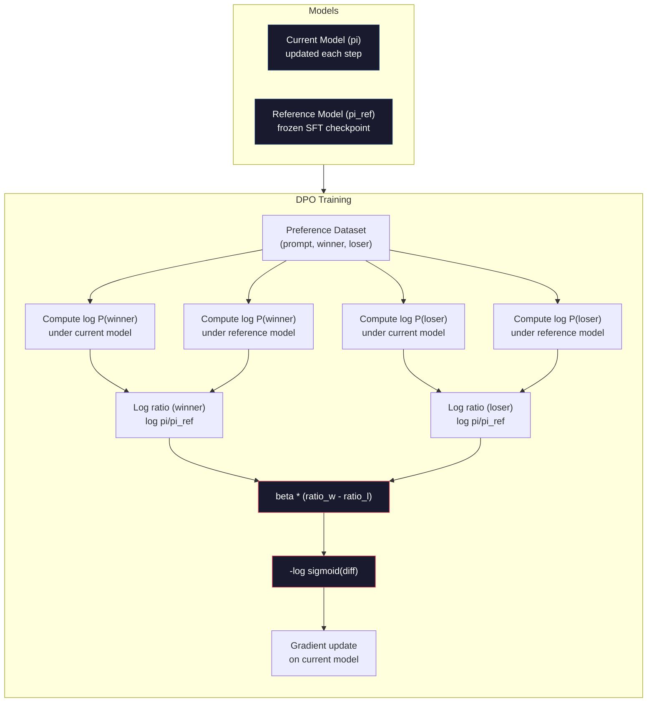

# DPO: Bezpośrednia optymalizacja preferencji

> RLHF działa. Wymaga to również przeszkolenia trzech modeli (SFT, model nagrody, polityka), zarządzania niestabilnością PPO i dostrojenia kary KL. DPO pyta: co by było, gdybyś mógł to wszystko pominąć? DPO bezpośrednio optymalizuje model językowy na parach preferencji. Brak modelu nagrody. Żadnego PPO. Jedna pętla treningowa. Te same wyniki.

**Typ:** Kompilacja
**Języki:** Python (z numpy)
**Wymagania wstępne:** Faza 10, lekcja 07 (RLHF)
**Czas:** ~90 minut

## Cele nauczania

- Wdrożenie szkolenia DPO, które bezpośrednio optymalizuje model językowy na parach preferencji bez oddzielnego modelu nagrody
- Wyprowadź funkcję straty DPO i wyjaśnij, w jaki sposób pośrednio reprezentuje ona model nagrody na podstawie logarytmów prawdopodobieństwa polisy
- Porównaj DPO z RLHF pod względem stabilności szkolenia, kosztów obliczeniowych i liczby wymaganych modeli
- Dostosuj parametr beta, aby kontrolować, jak bardzo wyszkolona polityka odbiega od modelu referencyjnego

## Problem

Rurociąg RLHF zbudowałeś w lekcji 07. Trzy etapy. Trzy modele. Model SFT, model nagrody i model polityki zoptymalizowany za pomocą PPO. Sam model nagrody wymagał tysięcy par preferencji ludzkich i oddzielnej pętli treningowej. PPO wymagało dokładnego dostrojenia współczynnika KL, szybkości uczenia się, współczynnika klipu i liczby epok.

W praktyce szkolenie PPO jest notorycznie niestabilne. Małe zmiany hiperparametrów powodują rozbieżność uczenia. Model nagrody jest niedoskonałym odzwierciedleniem ludzkich preferencji, a polityka znajduje sposoby na wykorzystanie jego słabości. Kara za KL jest pomocna, ale wymaga własnego dostrojenia – zbyt niska oznacza nagrodę za hakowanie, zbyt wysoka i model ledwo się uczy.

Z powodu tej złożoności większość modeli open source borykała się z problemem RLHF przez lata po opublikowaniu InstructGPT. Trójstopniowy rurociąg jest kruchy. Każdy etap ma swoje własne tryby awarii i nawarstwiają się błędy.

W maju 2023 roku Rafael Rafailov, Archit Sharma i współpracownicy ze Stanford opublikowali „Bezpośrednia optymalizacja preferencji: Twój model językowy jest potajemnie modelem nagrody”. Kluczowy wniosek: nie potrzebujesz osobnego modelu wynagrodzeń. Optymalna funkcja nagrody jest określana matematycznie na podstawie prawdopodobieństw tokenowych modelu języka. Możesz całkowicie pominąć model nagrody i zoptymalizować model językowy bezpośrednio na parach preferencji.

DPO ogranicza RLHF do jednego nadzorowanego etapu uczenia się. Jeden model. Jedna funkcja straty. Jedna pętla treningowa. Brak uczenia się przez wzmacnianie. Zephyr-7B, jeden z pierwszych modeli wykorzystujących DPO na dużą skalę, dopasowywał lub pokonywał modele trenowane z pełnym RLHF w kilku testach porównawczych. Meta użyła DPO jako część rurociągu dopasowującego Llama 3. W swoich badaniach nad wyrównaniem firma Anthropic przytoczyła metody w stylu DPO.

## Koncepcja

### Kluczowy spostrzeżenie

RLHF optymalizuje ten cel:

```
maximize: E[R(x, y)] - beta * KL(pi || pi_ref)
```

gdzie R to model nagrody, pi to polityka, pi_ref to model referencyjny, a beta to współczynnik KL.

W artykule DPO wykazano, że cel ten ma optymalne rozwiązanie w formie zamkniętej. Dla dowolnej funkcji nagrody R optymalna polityka to:

```
pi*(y | x) = pi_ref(y | x) * exp(R(x, y) / beta) / Z(x)
```

gdzie Z(x) jest stałą normalizującą. Przestawianie:

```
R(x, y) = beta * log(pi*(y | x) / pi_ref(y | x)) + beta * log Z(x)
```

To jest przełom. Nagroda jest wyrażona całkowicie w kategoriach prawdopodobieństw modelu polityki i prawdopodobieństw modelu referencyjnego. Nie musisz trenować osobnego modelu nagrody. Nagroda jest *ukryta* w stosunku prawdopodobieństwa.

Zastępując to modelem preferencji Bradleya-Terry’ego:

```
P(y_w > y_l | x) = sigmoid(R(x, y_w) - R(x, y_l))
                  = sigmoid(beta * (log pi(y_w|x)/pi_ref(y_w|x) - log pi(y_l|x)/pi_ref(y_l|x)))
```

Warunki Z(x) anulują się, ponieważ obie odpowiedzi warunkują ten sam znak zachęty x. To, co pozostało, jest funkcją jedynie logarytmów prawdopodobieństw modelu polityki i logarytmów prawdopodobieństw modelu referencyjnego dla preferowanych i odrzuconych odpowiedzi.

### Strata DPO

```
L_DPO = -log(sigmoid(beta * (log pi(y_w|x)/pi_ref(y_w|x) - log pi(y_l|x)/pi_ref(y_l|x))))
```

Rozpakujmy każdy element:

- **y_w** = preferowana (zwycięska) odpowiedź
- **y_l** = odpowiedź odrzucona (przegrana).
- **x** = monit
- **pi** = aktualny model (w trakcie szkolenia)
- **pi_ref** = model referencyjny (zamrożony punkt kontrolny SFT)
- **beta** = parametr temperatury kontrolujący odchylenie od wartości zadanej (typowo 0,1 do 0,5)

Stosunek `log pi(y|x) / pi_ref(y|x)` to stosunek logarytmu prawdopodobieństwa. Gdy ten stosunek jest dodatni, bieżący model przypisuje odpowiedzi y większe prawdopodobieństwo niż model odniesienia. Gdy wartość jest ujemna, bieżący model przypisuje mniejsze prawdopodobieństwo.

Utrata DPO zmusza model do zwiększenia współczynnika logarytmicznego prawdopodobieństwa dla preferowanych odpowiedzi i zmniejszenia go dla odpowiedzi odrzuconych. Parametr beta kontroluje, jak agresywnie model może odbiegać od odniesienia — mała beta oznacza, że ​​dozwolone są duże odchylenia, duża beta utrzymuje model blisko odniesienia.



### Dlaczego DPO jest prostszy

| Aspekt | RLHF (PPO) | IOD |
|--------|------|-----|
| Modele do trenowania | 3 (SFT + nagroda + polisa) | 1 (tylko zasady) |
| Pętle treningowe | 3 (szkolenia SFT, RM, PPO) | 2 (SFT, DPO) |
| Hiperparametry | lr, współczynnik KL, współczynnik obcinania, RM lr, epoki x3 | lr, beta, epoki |
| Model nagrody | Wymagane (oddzielne szkolenie) | Ukryte w prawdopodobieństwach modelu |
| Algorytm RL | PPO (złożony, niestabilny) | Uczenie się nadzorowane (stabilne) |
| Pamięć GPU | 3-4 modele w pamięci podczas PPO | 2 modele (aktualne + referencyjne) |
| Stabilność treningu | Wrażliwy na hiperparametry | Solidny, podobny do SFT |

Podczas uczenia DPO potrzebuje w pamięci dwóch modeli — modelu bieżącego i zamrożonego odniesienia. RLHF potrzebuje trzech lub czterech: polityki, odniesienia, modelu nagrody i opcjonalnie linii bazowej funkcji wartości. W przypadku modelu 70B każda kopia zajmuje 140 GB w FP16. Oszczędności pamięci wynikające z wyeliminowania modelu nagrody są znaczne.

### Kiedy DPO pokonuje RLHF

**Małe zbiory danych.** Przy 5 000–20 000 par preferencji DPO często dorównuje lub przekracza RLHF. Model nagrody w RLHF wymaga wystarczającej ilości danych, aby można było go uogólnić – przy ograniczonej liczbie danych nadmiernie się dopasowuje i generuje niewiarygodne sygnały nagrody. DPO omija ten problem, nie potrzebując w ogóle modelu nagrody.

**Ograniczone obliczenia.** DPO wymaga mniej więcej jednej trzeciej obliczeń pełnego RLHF (jedna pętla treningowa zamiast trzech). Jest to praktyczny wybór dla zespołów bez dużych klastrów GPU.

**Szybka iteracja.** Chcesz wypróbować 10 różnych zbiorów danych dotyczących preferencji, aby zobaczyć, który z nich da najlepszy model? DPO pozwala na uruchomienie każdego eksperymentu w ciągu kilku godzin. RLHF wymaga ponownego szkolenia modelu nagrody dla każdego zestawu danych.

### Kiedy RLHF pokonuje DPO

**Szkolenie na dużą skalę.** W skali GPT-4 lub Claude oddzielny model nagrody RLHF może wychwytywać bardziej zróżnicowane sygnały preferencji. Model nagrody działa jak wyuczona funkcja straty, która dostosowuje się do złożonych kryteriów jakości.

**Złożone sygnały nagrody.** Kiedy „lepiej” obejmuje wiele wymiarów (przydatność, nieszkodliwość, uczciwość), model nagrody może nauczyć się tego wielocelowego kompromisu. DPO traktuje każdą parę preferencji jako sygnał binarny – jeden jest lepszy, drugi gorszy – bez modelowania dlaczego.

**Dopasowanie iteracyjne.** Rurociągi RLHF mogą generować nowe odpowiedzi w ramach bieżących zasad, oceniać je ludzie i ponownie szkolić model nagród w pętli online. DPO pracuje na stałym zestawie danych par preferencji. Konstytucyjna sztuczna inteligencja (podejście Anthropic) szeroko wykorzystuje tę iteracyjną właściwość RLHF.

### Poza DPO: KTO, ORPO, SimPO

DPO zainspirował rodzinę uproszczonych metod wyrównywania.

**KTO (Optymalizacja Kahnemana-Tversky’ego, 2024):** Nie potrzebujesz nawet par. KTO działa z niesparowanym sprzężeniem zwrotnym — wystarczy oznaczyć każdą odpowiedź jako „dobrą” lub „złą”, bez porównywania jej z alternatywą. To znacznie upraszcza gromadzenie danych. Zamiast pokazywać komentatorom dwie odpowiedzi i pytać „co jest lepsze?”, pokazujesz jedną odpowiedź i pytasz „czy to dobrze?” Funkcja straty wykorzystuje awersję do straty z teorii perspektywy: złe reakcje są karane bardziej niż dobre reakcje są nagradzane.

**ORPO (Optymalizacja preferencji ilorazu szans, 2024):** Łączy SFT i wyrównanie w jednym etapie szkolenia. Zamiast najpierw wykonywać SFT, a następnie DPO, ORPO modyfikuje stratę SFT, aby uwzględnić sygnał preferencji. Strata ma dwa składniki: standardową przewidywaną stratę następnego tokena w przypadku preferowanych odpowiedzi oraz składnik ilorazu szans, który zwiększa różnicę między prawdopodobieństwem preferowanej i odrzuconej odpowiedzi. Jedna pętla treningowa zamiast dwóch.

**SimPO (Simple Preference Optimization, 2024):** Całkowicie eliminuje model referencyjny. Zamiast obliczać współczynniki logarytmicznego prawdopodobieństwa względem zamrożonego odniesienia, SimPO wykorzystuje średnie logarytmiczne prawdopodobieństwo odpowiedzi (znormalizowane według długości) jako ukrytą nagrodę. Oszczędza to pamięć (nie jest potrzebny model referencyjny) i upraszcza szkolenie. Normalizacja długości zapobiega faworyzowaniu przez model krótszych odpowiedzi.

| Metoda | Rok | Modele w pamięci | Potrzebuje par? | Potrzebuje odniesienia? | Pętle treningowe |
|------------|------|-------|------------|----------------|----------------|
| RLHF | 2022 | 3-4 | Tak (dla RM) | Tak | 3 |
| IOD | 2023 | 2 | Tak | Tak | 2 |
| KTO | 2024 | 2 | Nie (niesparowane) | Tak | 2 |
| ORPO | 2024 | 1 | Tak | Nie | 1 |
| SimPO | 2024 | 1 | Tak | Nie | 1 |

Trend jest jasny: każda metoda eliminuje jeszcze jeden element złożoności. RLHF potrzebował modelu nagrody i PPO. DPO wyeliminował oba. KTO wyeliminowało sparowane dane. ORPO wyeliminowało odrębny etap SFT. SimPO wyeliminowało model referencyjny. Podatek od wyrównania – koszt obliczeń i złożoności przejścia z modelu podstawowego do modelu wyrównanego – stale spada.

### Prawdziwe wdrożenia DPO

**Zephyr-7B (HuggingFace, październik 2023 r.):** Baza Mistral 7B, SFT na UltraChat (200 tys. przykładów), następnie DPO na UltraFeedback (60 tys. par preferencji). Wynik 6,47 w MT-Bench – wówczas najwyższy model 7B. Dla porównania Llama 2 Chat 70B uzyskała wynik 6,86, co oznacza, że ​​Zephyr uzyskał wynik w zakresie 6% w stosunku do modelu 10-krotnie większego przy użyciu jedynie wyrównania DPO.

**Lama 3 (Meta, kwiecień 2024 r.):** Używany DPO po początkowych etapach RLHF. Połączenie sugeruje, że DPO i RLHF mogą się uzupełniać – RLHF dla szerokiego dostosowania, DPO dla ukierunkowanego udoskonalenia.

**Neural Magic / nm-chat (2024):** Zastosowano DPO do wielu modeli typu open source, stale wykazując poprawę o 5–15% w testach porównawczych wyrównania w porównaniu z wartościami bazowymi obejmującymi wyłącznie SFT.

## Zbuduj to

### Krok 1: Zbiór danych preferencji

Ten sam format co RLHF – (podpowiedź, preferowana, odrzucona) potrójne. DPO wykorzystuje te dane bezpośrednio, bez pośredniego modelu nagrody.

```python
import numpy as np
import sys
import os
sys.path.insert(0, os.path.join(os.path.dirname(__file__), "..", "..", "04-pre-training-mini-gpt", "code"))
from main import MiniGPT, LayerNorm, Embedding, TransformerBlock

PREFERENCE_DATA = [
    {
        "prompt": "What is the capital of France?",
        "preferred": "The capital of France is Paris.",
        "rejected": "France is a country in Europe. It has many cities. The capital is Paris. Paris is known for the Eiffel Tower.",
    },
    {
        "prompt": "Explain gravity in one sentence.",
        "preferred": "Gravity is the force that attracts objects with mass toward each other.",
        "rejected": "Gravity is something that makes things fall down when you drop them.",
    },
    {
        "prompt": "What is 15 times 7?",
        "preferred": "15 times 7 is 105.",
        "rejected": "Let me think about this. 15 times 7. Well, 10 times 7 is 70, and 5 times 7 is 35, so the answer might be around 105.",
    },
    {
        "prompt": "Name three programming languages.",
        "preferred": "Python, Rust, and TypeScript.",
        "rejected": "There are many programming languages. Some popular ones include various languages like Python and others.",
    },
    {
        "prompt": "What year did World War II end?",
        "preferred": "World War II ended in 1945.",
        "rejected": "World War II was a major global conflict. It involved many countries. The war ended in the mid-1940s, specifically in 1945.",
    },
    {
        "prompt": "Define machine learning.",
        "preferred": "Machine learning is a field where algorithms learn patterns from data to make predictions without being explicitly programmed.",
        "rejected": "Machine learning is a type of AI. AI stands for artificial intelligence. Machine learning uses data to learn.",
    },
]
```

### Krok 2: Logowanie prawdopodobieństwa sekwencji

Utrata DPO wymaga obliczenia całkowitego logarytmicznego prawdopodobieństwa odpowiedzi na monit. Oznacza to uruchomienie modelu w pełnej sekwencji (podpowiedź + odpowiedź) i zsumowanie logarytmów prawdopodobieństw każdego tokenu odpowiedzi.

```python
def tokenize_sequence(text, vocab_size=256):
    return [min(t, vocab_size - 1) for t in list(text.encode("utf-8"))]

def compute_sequence_log_prob(model, prompt_tokens, response_tokens, max_seq_len=128):
    full_sequence = prompt_tokens + response_tokens
    if len(full_sequence) > max_seq_len:
        full_sequence = full_sequence[:max_seq_len]

    if len(full_sequence) < 2:
        return 0.0

    input_ids = np.array(full_sequence[:-1]).reshape(1, -1)
    target_ids = np.array(full_sequence[1:])

    logits = model.forward(input_ids)
    logits = logits[0]

    max_logits = logits.max(axis=-1, keepdims=True)
    log_probs = logits - max_logits - np.log(
        np.exp(logits - max_logits).sum(axis=-1, keepdims=True)
    )

    prompt_len = len(prompt_tokens)
    response_start = max(0, prompt_len - 1)
    response_end = len(target_ids)

    if response_start >= response_end:
        return 0.0

    response_log_probs = log_probs[response_start:response_end, :]
    response_targets = target_ids[response_start:response_end]

    total_log_prob = 0.0
    for i, target in enumerate(response_targets):
        total_log_prob += response_log_probs[i, target]

    return total_log_prob
```

Ta funkcja jest podstawą DPO. Dla każdej pary preferencji przebiega cztery razy: model na preferowanej odpowiedzi, model na odrzuconej odpowiedzi, odwołanie na preferowanej odpowiedzi, odwołanie na odrzuconej odpowiedzi. To 4 podania do przodu na przykład szkolenia w porównaniu z generacją RLHF + punktacja nagrody + oszacowanie wartości + aktualizacja PPO. Prostsze, szybsze i stabilniejsze.

### Krok 3: Utrata DPO

Trzon artykułu w kodzie. Jedna funkcja. Jedna strata. Brak modelu nagrody.

```python
def sigmoid(x):
    return np.where(
        x >= 0,
        1.0 / (1.0 + np.exp(-x)),
        np.exp(x) / (1.0 + np.exp(x))
    )

def dpo_loss(policy_logprob_preferred, policy_logprob_rejected,
             ref_logprob_preferred, ref_logprob_rejected, beta=0.1):
    preferred_ratio = policy_logprob_preferred - ref_logprob_preferred
    rejected_ratio = policy_logprob_rejected - ref_logprob_rejected

    logit = beta * (preferred_ratio - rejected_ratio)

    loss = -np.log(sigmoid(logit) + 1e-8)

    preferred_reward = beta * preferred_ratio
    rejected_reward = beta * rejected_ratio

    return loss, {
        "preferred_ratio": float(preferred_ratio),
        "rejected_ratio": float(rejected_ratio),
        "logit": float(logit),
        "implicit_preferred_reward": float(preferred_reward),
        "implicit_rejected_reward": float(rejected_reward),
        "reward_margin": float(preferred_reward - rejected_reward),
    }
```

`preferred_ratio` i `rejected_ratio` to współczynniki logarytmicznego prawdopodobieństwa uzyskane z DPO. Kiedy bieżący model przypisuje wyższe prawdopodobieństwo preferowanej odpowiedzi (w stosunku do odniesienia) i mniejsze prawdopodobieństwo odpowiedzi odrzuconej, logit jest dodatni, a strata jest niska. Sygnał treningowy popycha model dokładnie w tym kierunku.

`implicit_preferred_reward` i `implicit_rejected_reward` to nagrody, które w sposób dorozumiany przypisuje utrata DPO. Możesz je wyodrębnić, aby sprawdzić, czy szkolenie działa – margines między preferowanymi a odrzuconymi nagrodami powinien rosnąć w miarę szkolenia.

### Krok 4: Pętla szkoleniowa DPO

Standardowa nadzorowana pętla treningowa. Żadnego PPO. Brak modelu nagrody. Tylko przepustki do przodu i aktualizacje gradientów.

```python
def copy_model_weights(source, target):
    target.embedding.token_embed = source.embedding.token_embed.copy()
    target.embedding.pos_embed = source.embedding.pos_embed.copy()
    target.ln_f.gamma = source.ln_f.gamma.copy()
    target.ln_f.beta = source.ln_f.beta.copy()
    for s_block, t_block in zip(source.blocks, target.blocks):
        t_block.attn.W_q = s_block.attn.W_q.copy()
        t_block.attn.W_k = s_block.attn.W_k.copy()
        t_block.attn.W_v = s_block.attn.W_v.copy()
        t_block.attn.W_out = s_block.attn.W_out.copy()
        t_block.ffn.W1 = s_block.ffn.W1.copy()
        t_block.ffn.W2 = s_block.ffn.W2.copy()
        t_block.ffn.b1 = s_block.ffn.b1.copy()
        t_block.ffn.b2 = s_block.ffn.b2.copy()
        t_block.ln1.gamma = s_block.ln1.gamma.copy()
        t_block.ln1.beta = s_block.ln1.beta.copy()
        t_block.ln2.gamma = s_block.ln2.gamma.copy()
        t_block.ln2.beta = s_block.ln2.beta.copy()

def dpo_train(policy_model, reference_model, preference_data,
              num_epochs=5, lr=5e-6, beta=0.1, max_seq_len=128):
    print(f"DPO Training: {len(preference_data)} pairs, {num_epochs} epochs, "
          f"lr={lr}, beta={beta}")
    print()

    losses = []
    margins = []

    for epoch in range(num_epochs):
        epoch_loss = 0.0
        epoch_margin = 0.0
        num_examples = 0

        indices = np.random.permutation(len(preference_data))

        for idx in indices:
            pair = preference_data[idx]

            prompt_tokens = tokenize_sequence(pair["prompt"])
            preferred_tokens = tokenize_sequence(pair["preferred"])
            rejected_tokens = tokenize_sequence(pair["rejected"])

            pi_logprob_w = compute_sequence_log_prob(
                policy_model, prompt_tokens, preferred_tokens, max_seq_len
            )
            pi_logprob_l = compute_sequence_log_prob(
                policy_model, prompt_tokens, rejected_tokens, max_seq_len
            )
            ref_logprob_w = compute_sequence_log_prob(
                reference_model, prompt_tokens, preferred_tokens, max_seq_len
            )
            ref_logprob_l = compute_sequence_log_prob(
                reference_model, prompt_tokens, rejected_tokens, max_seq_len
            )

            loss, metrics = dpo_loss(
                pi_logprob_w, pi_logprob_l,
                ref_logprob_w, ref_logprob_l, beta
            )

            update_direction = 1.0 if metrics["logit"] < 0 else -0.1
            for block in policy_model.blocks:
                block.ffn.W1 += lr * update_direction * np.random.randn(*block.ffn.W1.shape) * 0.01
                block.ffn.W2 += lr * update_direction * np.random.randn(*block.ffn.W2.shape) * 0.01

            epoch_loss += loss
            epoch_margin += metrics["reward_margin"]
            num_examples += 1
            losses.append(float(loss))
            margins.append(metrics["reward_margin"])

        avg_loss = epoch_loss / max(num_examples, 1)
        avg_margin = epoch_margin / max(num_examples, 1)

        print(f"  Epoch {epoch + 1}/{num_epochs} | Loss: {avg_loss:.4f} | "
              f"Avg Margin: {avg_margin:.4f}")

    return policy_model, losses, margins
```

Pętla treningowa jest odświeżająco prosta w porównaniu do RLHF. Dla każdej pary preferencji: oblicz cztery logarytmiczne prawdopodobieństwa (dwa modele, dwie odpowiedzi), podłącz je do straty DPO, oblicz gradient, zaktualizuj politykę. Brak kroku generacji. Brak wnioskowania o modelu nagrody. Brak oceny korzyści. Bez przycinania.

### Krok 5: Porównanie DPO i RLHF

Zmierz ukryte marże nagrody i przesunięcia logarytmiczne prawdopodobieństwa, aby porównać DPO z modelem RLHF z lekcji 07.

```python
def evaluate_preference_accuracy(model, reference_model, preference_data, beta=0.1, max_seq_len=128):
    correct = 0
    total = 0

    for pair in preference_data:
        prompt_tokens = tokenize_sequence(pair["prompt"])
        preferred_tokens = tokenize_sequence(pair["preferred"])
        rejected_tokens = tokenize_sequence(pair["rejected"])

        pi_w = compute_sequence_log_prob(model, prompt_tokens, preferred_tokens, max_seq_len)
        pi_l = compute_sequence_log_prob(model, prompt_tokens, rejected_tokens, max_seq_len)
        ref_w = compute_sequence_log_prob(reference_model, prompt_tokens, preferred_tokens, max_seq_len)
        ref_l = compute_sequence_log_prob(reference_model, prompt_tokens, rejected_tokens, max_seq_len)

        preferred_reward = beta * (pi_w - ref_w)
        rejected_reward = beta * (pi_l - ref_l)

        if preferred_reward > rejected_reward:
            correct += 1
        total += 1

    return correct / max(total, 1)

def analyze_implicit_rewards(model, reference_model, preference_data, beta=0.1, max_seq_len=128):
    print("Implicit Reward Analysis:")
    print("-" * 65)
    print(f"  {'Prompt':<30} {'Pref Reward':>12} {'Rej Reward':>12} {'Margin':>10}")
    print("  " + "-" * 60)

    for pair in preference_data:
        prompt_tokens = tokenize_sequence(pair["prompt"])
        preferred_tokens = tokenize_sequence(pair["preferred"])
        rejected_tokens = tokenize_sequence(pair["rejected"])

        pi_w = compute_sequence_log_prob(model, prompt_tokens, preferred_tokens, max_seq_len)
        pi_l = compute_sequence_log_prob(model, prompt_tokens, rejected_tokens, max_seq_len)
        ref_w = compute_sequence_log_prob(reference_model, prompt_tokens, preferred_tokens, max_seq_len)
        ref_l = compute_sequence_log_prob(reference_model, prompt_tokens, rejected_tokens, max_seq_len)

        pref_reward = beta * (pi_w - ref_w)
        rej_reward = beta * (pi_l - ref_l)
        margin = pref_reward - rej_reward

        truncated = pair["prompt"][:28] + ".." if len(pair["prompt"]) > 30 else pair["prompt"]
        print(f"  {truncated:<30} {pref_reward:>12.4f} {rej_reward:>12.4f} {margin:>10.4f}")

    print()
```

### Krok 6: Analiza wrażliwości beta

Parametr beta jest odpowiednikiem DPO współczynnika KL w RLHF. Kontroluje, jak bardzo model może odbiegać od odniesienia. Ten eksperyment pokazuje jego efekt.

```python
def beta_sensitivity_analysis(sft_model, preference_data, betas, max_seq_len=128):
    print("Beta Sensitivity Analysis")
    print("-" * 60)
    print(f"  {'Beta':>8} {'Final Loss':>12} {'Final Margin':>14} {'Accuracy':>10}")
    print("  " + "-" * 55)

    results = []

    for beta in betas:
        policy = MiniGPT(
            vocab_size=256, embed_dim=128, num_heads=4,
            num_layers=4, max_seq_len=max_seq_len, ff_dim=512
        )
        reference = MiniGPT(
            vocab_size=256, embed_dim=128, num_heads=4,
            num_layers=4, max_seq_len=max_seq_len, ff_dim=512
        )
        copy_model_weights(sft_model, policy)
        copy_model_weights(sft_model, reference)

        policy, losses, margins_list = dpo_train(
            policy, reference, preference_data,
            num_epochs=3, lr=5e-6, beta=beta, max_seq_len=max_seq_len
        )

        accuracy = evaluate_preference_accuracy(
            policy, reference, preference_data, beta, max_seq_len
        )

        final_loss = losses[-1] if losses else 0
        final_margin = margins_list[-1] if margins_list else 0

        print(f"  {beta:>8.3f} {final_loss:>12.4f} {final_margin:>14.4f} {accuracy:>10.1%}")
        results.append({
            "beta": beta,
            "final_loss": final_loss,
            "final_margin": final_margin,
            "accuracy": accuracy,
        })

        print()

    return results
```

Mała beta (0,01) pozwala modelowi na swobodne odbieganie od odniesienia – szybkie uczenie się, ale ryzyko zdegenerowanych rozwiązań. Duża wersja beta (1.0) utrzymuje model blisko odniesienia — stabilne, ale powolne uczenie się. Najlepszy punkt dla większości zastosowań wynosi od 0,1 do 0,3.

## Użyj tego

### Pełna wersja demonstracyjna potoku DPO

```python
if __name__ == "__main__":
    np.random.seed(42)

    print("=" * 70)
    print("DPO: DIRECT PREFERENCE OPTIMIZATION")
    print("=" * 70)
    print()

    print("STEP 1: Initialize SFT Model (from Lesson 06)")
    print("-" * 50)
    sft_model = MiniGPT(
        vocab_size=256, embed_dim=128, num_heads=4,
        num_layers=4, max_seq_len=128, ff_dim=512
    )
    print(f"  Parameters: {sft_model.count_parameters():,}")
    print()

    print("STEP 2: DPO Training")
    print("-" * 50)

    policy_model = MiniGPT(
        vocab_size=256, embed_dim=128, num_heads=4,
        num_layers=4, max_seq_len=128, ff_dim=512
    )
    reference_model = MiniGPT(
        vocab_size=256, embed_dim=128, num_heads=4,
        num_layers=4, max_seq_len=128, ff_dim=512
    )
    copy_model_weights(sft_model, policy_model)
    copy_model_weights(sft_model, reference_model)

    policy_model, losses, margins = dpo_train(
        policy_model, reference_model, PREFERENCE_DATA,
        num_epochs=5, lr=5e-6, beta=0.1
    )
    print()

    print("=" * 70)
    print("STEP 3: Evaluate")
    print("=" * 70)
    print()

    pre_accuracy = evaluate_preference_accuracy(
        sft_model, reference_model, PREFERENCE_DATA, beta=0.1
    )
    post_accuracy = evaluate_preference_accuracy(
        policy_model, reference_model, PREFERENCE_DATA, beta=0.1
    )

    print(f"  Preference accuracy (pre-DPO):  {pre_accuracy:.1%}")
    print(f"  Preference accuracy (post-DPO): {post_accuracy:.1%}")
    print()

    analyze_implicit_rewards(policy_model, reference_model, PREFERENCE_DATA, beta=0.1)

    print("=" * 70)
    print("STEP 4: Training Dynamics")
    print("=" * 70)
    print()

    if losses:
        print("  Loss curve:")
        window = max(1, len(losses) // 5)
        for i in range(0, len(losses), window):
            chunk = losses[i:i + window]
            avg = sum(chunk) / len(chunk)
            print(f"    Steps {i:3d}-{i + len(chunk) - 1:3d}: loss = {avg:.4f}")
        print()

    if margins:
        print("  Reward margin curve:")
        window = max(1, len(margins) // 5)
        for i in range(0, len(margins), window):
            chunk = margins[i:i + window]
            avg = sum(chunk) / len(chunk)
            print(f"    Steps {i:3d}-{i + len(chunk) - 1:3d}: margin = {avg:.4f}")
        print()

    print("=" * 70)
    print("STEP 5: Beta Sensitivity")
    print("=" * 70)
    print()

    beta_results = beta_sensitivity_analysis(
        sft_model, PREFERENCE_DATA, betas=[0.01, 0.1, 0.3, 1.0]
    )

    print("=" * 70)
    print("DPO vs RLHF COMPARISON")
    print("=" * 70)
    print()
    print("  DPO advantages:")
    print("    - 1 training loop (vs 3 for RLHF)")
    print("    - 2 models in memory (vs 3-4 for RLHF)")
    print("    - Supervised learning (vs RL, more stable)")
    print("    - No reward model to train or maintain")
    print()
    print("  RLHF advantages:")
    print("    - Separate reward model captures complex preferences")
    print("    - Online learning: generate, rate, retrain")
    print("    - Better for multi-objective alignment")
    print("    - Proven at largest scales (GPT-4, Claude)")
    print()
    print("  Practical guidance:")
    print("    - Start with DPO. It's simpler and often sufficient.")
    print("    - Switch to RLHF if DPO plateaus on your eval metrics.")
    print("    - Many production systems use both: RLHF first, DPO to refine.")
```

## Wyślij to

W ramach tej lekcji zostanie wyświetlony `outputs/prompt-alignment-method-selector.md` — monit, który pomoże Ci wybrać właściwą metodę dopasowania (SFT, RLHF, DPO, KTO, ORPO, SimPO) dla Twojego przypadku użycia. Biorąc pod uwagę dostępność danych, budżet obliczeniowy i cele dostosowania, zaleca metodę i plan szkoleniowy.

## Ćwiczenia

1. Wdrażaj KTO (optymalizację Kahnemana-Tversky'ego). KTO nie potrzebuje par – po prostu oznacz każdą odpowiedź jako „dobrą” lub „złą”. Strata w przypadku dobrej odpowiedzi wynosi `-log(sigmoid(beta * log_ratio))`, a w przypadku złej odpowiedzi wynosi `-log(1 - sigmoid(beta * log_ratio))` z mnożnikiem niechęci do straty (zwykle 1,5x) w przypadku utraty złej odpowiedzi. Trenuj na tych samych danych (niezależnie traktuj preferowane jako „dobre” i odrzucane jako „złe”) i porównuj dokładność z DPO.

2. Zaimplementuj DPO o znormalizowanej długości. Zamiast surowego prawdopodobieństwa logu podziel przez liczbę tokenów odpowiedzi: `normalized_logprob = total_logprob / num_tokens`. Zapobiega to faworyzowaniu przez model krótszych odpowiedzi (które mają wyższy całkowity log-prob). Porównaj ukryte marże nagrody z normalizacją i bez niej.

3. Zbuduj łączną stratę w stylu ORPO. Dodaj standardową stratę przewidywania następnego tokena w preferowanej odpowiedzi na utratę DPO: `L = L_sft(preferred) + alpha * L_dpo`. Wypróbuj wartości alfa 0,1, 0,5 i 1,0. Łączna strata powinna stworzyć model, który zarówno postępuje zgodnie z instrukcjami (z terminu SFT), jak i preferuje lepsze reakcje (z terminu DPO), eliminując potrzebę oddzielnego etapu SFT.

4. Wdrażaj iteracyjny DPO. Uruchom DPO dla 3 epok, następnie wygeneruj nowe odpowiedzi z wyuczonego modelu, połącz je z oryginalnymi preferowanymi odpowiedziami jako nowe pary preferencji i ponownie uruchom DPO. Dwie rundy procesu „samodzielnej gry”. Porównaj dokładność preferencji po rundzie 1 i rundzie 2, aby sprawdzić, czy iteracyjne udoskonalanie pomaga.

5. Porównaj DPO z różnymi modelami referencyjnymi. Zamiast używać punktu kontrolnego SFT jako odniesienia, spróbuj: (a) modelu podstawowego (przed SFT), (b) punktu kontrolnego z pierwszej epoki DPO, (c) wykładniczej średniej kroczącej modelu polityki. Zgłoś, które odniesienie zapewnia najwyższą dokładność preferencji i najbardziej stabilną krzywą uczenia.

## Kluczowe terminy

| Termin | Co ludzie mówią | Co to właściwie oznacza |
|------|----------------|----------------------|
| IOD | „RLHF bez RL” | Direct Preference Optimization: algorytm uczenia się nadzorowanego, który optymalizuje model języka bezpośrednio na parach preferencji, z pominięciem modelu nagrody i PPO |
| Ukryta nagroda | „Nagroda jest w modelu” | Funkcja nagrody jest określana na podstawie logarytmu współczynnika prawdopodobieństwa pomiędzy modelem polityki a modelem referencyjnym – nie jest potrzebny oddzielny model nagrody |
| Beta (DPO) | „Temperatura” | Kontroluje, jak bardzo polityka może odbiegać od modelu referencyjnego — mała beta pozwala na duże odchylenia, duża beta utrzymuje model blisko |
| Współczynnik logarytmicznego prawdopodobieństwa | „Jak bardzo zmienił się model” | log pi(y\|x) - log pi_ref(y\|x) -- dodatni oznacza, że ​​bieżący model przypisuje większe prawdopodobieństwo niż odniesienie |
| Model referencyjny | „Zamrożony punkt kontrolny” | Kopia modelu SFT, którego wagi nigdy się nie zmieniają, służy jako kotwica do obliczania współczynników prawdopodobieństwa
| KTO | „DPO bez par” | Optymalizacja Kahnemana-Tversky'ego: działa z niesparowanymi etykietami „dobry” i „zły” zamiast wymagać par preferencji |
| ORPO | „Jednoetapowe dostosowanie” | Optymalizacja preferencji ilorazu szans: łączy SFT i wyrównanie w jedną pętlę treningową poprzez dodanie warunku preferencji do straty SFT |
| SimPO | „Nie jest potrzebne żadne odniesienie” | Prosta optymalizacja preferencji: eliminuje model referencyjny, używając średniego prawdopodobieństwa znormalizowanego według długości jako ukrytej nagrody |
| Podatek wyrównawczy | „Koszt zabezpieczenia modeli” | Dodatkowe obliczenia, dane i złożoność wymagane do przejścia z modelu podstawowego do modelu dostosowanego – DPO znacznie to zmniejsza

## Dalsze czytanie

– [Rafailov i in., 2023 – „Bezpośrednia optymalizacja preferencji: Twój model językowy jest w tajemnicy modelem nagrody”](https://arxiv.org/abs/2305.18290) – dokument DPO, który uprościł dostosowanie od RLHF do uczenia się pod nadzorem
– [Tunstall i in., 2023 – „Zephyr: Direct Distillation of LM Alignment”](https://arxiv.org/abs/2310.16944) – Zephyr-7B, pokazujący DPO w UltraFeedback odpowiada RLHF w testach porównawczych
– [Ethayarajh i in., 2024 – „KTO: Wyrównanie modelu jako teoretyczna optymalizacja perspektywy”](https://arxiv.org/abs/2402.01306) – wyeliminowanie potrzeby stosowania sparowanych preferencji
– [Hong i in., 2024 – „ORPO: Optymalizacja preferencji monolitycznych bez modelu referencyjnego”](https://arxiv.org/abs/2403.07691) – połączenie SFT i wyrównania w jednym kroku
– [Meng i in., 2024 – „SimPO: prosta optymalizacja preferencji z nagrodą bez referencji”](https://arxiv.org/abs/2405.14734) – całkowite wyeliminowanie modelu referencyjnego
– [Raport techniczny Lamy 3](https://arxiv.org/abs/2407.21783) – Rurociąg dopasowujący Meta łączący RLHF i DPO