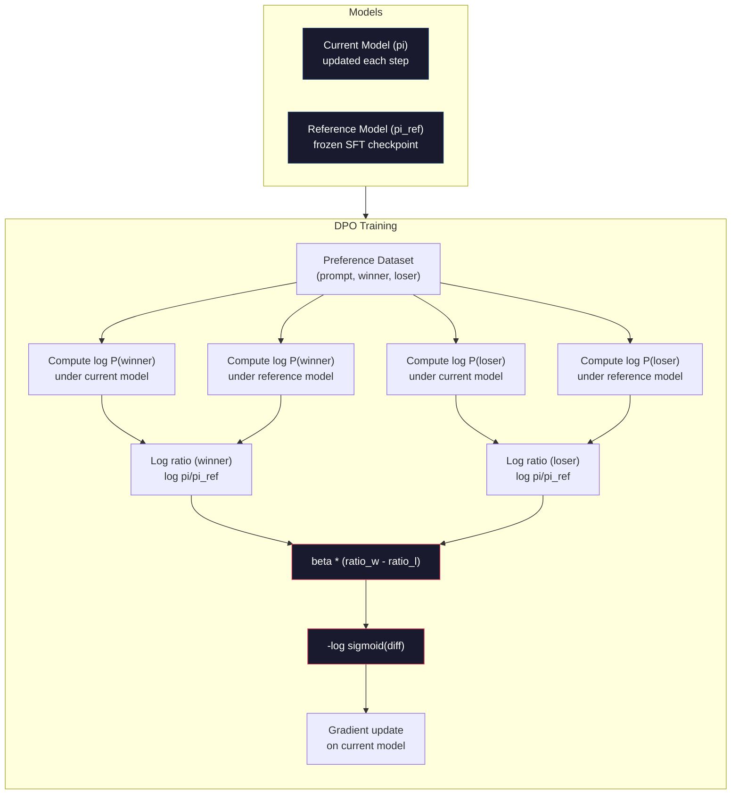

# DPO: Bezpośrednia optymalizacja preferencji

> RLHF działa. Wymaga jednak trenowania trzech modeli (SFT, model nagrody, polityka), radzenia sobie z niestabilnością PPO i strojenia kary KL. DPO zadaje pytanie: co gdybyś mógł to wszystko pominąć? DPO bezpośrednio optymalizuje model językowy na parach preferencji. Bez modelu nagrody. Bez PPO. Jedna pętla treningowa. Te same wyniki.

**Typ:** Kompilacja
**Języki:** Python (z numpy)
**Wymagania wstępne:** Faza 10, lekcja 07 (RLHF)
**Czas:** ~90 minut

## Cele nauczania

- Zaimplementuj trening DPO, który optymalizuje model językowy bezpośrednio na parach preferencji bez oddzielnego modelu nagrody
- Wyprowadź funkcję straty DPO i wyjaśnij, w jaki sposób pośrednio reprezentuje ona model nagrody na podstawie logarytmów prawdopodobieństwa polityki
- Porównaj DPO z RLHF pod kątem stabilności treningu, kosztów obliczeniowych i liczby wymaganych modeli
- Dostosuj parametr beta, aby kontrolować stopień, w jakim wytrenowana polityka odbiega od modelu referencyjnego

## Problem

W lekcji 07 zbudowałeś potok RLHF: trzy etapy, trzy modele. Sam model nagrody wymagał tysięcy par ludzkich preferencji i oddzielnej pętli treningowej. PPO wymagało precyzyjnego strojenia współczynnika KL, szybkości uczenia się, współczynnika obcinania i liczby epok.

W praktyce trening PPO jest notorycznie niestabilny. Drobne zmiany hiperparametrów powodują rozbieżność uczenia. Model nagrody niedoskonale odzwierciedla ludzkie preferencje, a polityka potrafi wykorzystywać jego słabości. Kara za KL jest pomocna, ale wymaga własnego strojenia — zbyt niska prowadzi do hakowania nagrody, zbyt wysoka sprawia, że model niemal nie przyswaja wiedzy.

Ta złożoność sprawiła, że przez lata po publikacji InstructGPT większość modeli open source miała trudności z wdrożeniem RLHF. Trójstopniowy potok jest kruchy: każdy etap ma własne tryby awarii, a błędy się nawarstwiają.

W maju 2023 roku Rafael Rafailov, Archit Sharma i współpracownicy ze Stanfordu opublikowali pracę „Direct Preference Optimization: Your Language Model is Secretly a Reward Model". Kluczowy wniosek: oddzielny model nagrody nie jest potrzebny. Optymalna funkcja nagrody wynika wprost z prawdopodobieństw tokenów modelu językowego. Można całkowicie pominąć model nagrody i optymalizować model językowy bezpośrednio na parach preferencji.

DPO sprowadza RLHF do jednego etapu uczenia nadzorowanego. Jeden model. Jedna funkcja straty. Jedna pętla treningowa. Bez uczenia przez wzmacnianie. Zephyr-7B, jeden z pierwszych modeli stosujących DPO na dużą skalę, dorównywał modelom trenowanym z pełnym RLHF lub je przewyższał w wielu testach porównawczych. Meta użyła DPO jako elementu potoku dopasowującego Llama 3. W swoich badaniach nad wyrównaniem Anthropic przywoływało metody zbliżone do DPO.

## Koncepcja

### Kluczowe spostrzeżenie

RLHF optymalizuje następujący cel:

```
maximize: E[R(x, y)] - beta * KL(pi || pi_ref)
```

gdzie R oznacza model nagrody, pi — politykę, pi_ref — model referencyjny, a beta — współczynnik KL.

W artykule DPO wykazano, że cel ten ma optymalne rozwiązanie w postaci zamkniętej. Dla dowolnej funkcji nagrody R optymalna polityka wynosi:

```
pi*(y | x) = pi_ref(y | x) * exp(R(x, y) / beta) / Z(x)
```

gdzie Z(x) jest stałą normalizującą. Po przekształceniu:

```
R(x, y) = beta * log(pi*(y | x) / pi_ref(y | x)) + beta * log Z(x)
```

To jest przełom. Nagroda wyraża się wyłącznie przez prawdopodobieństwa modelu polityki i modelu referencyjnego. Nie trzeba trenować oddzielnego modelu nagrody — jest on *ukryty* w stosunku prawdopodobieństw.

Po podstawieniu do modelu preferencji Bradleya-Terry'ego:

```
P(y_w > y_l | x) = sigmoid(R(x, y_w) - R(x, y_l))
                  = sigmoid(beta * (log pi(y_w|x)/pi_ref(y_w|x) - log pi(y_l|x)/pi_ref(y_l|x)))
```

Składniki Z(x) znoszą się, ponieważ obie odpowiedzi są uwarunkowane tym samym promptem x. Pozostaje jedynie funkcja logarytmów prawdopodobieństwa modelu polityki i modelu referencyjnego dla odpowiedzi preferowanej i odrzuconej.

### Strata DPO

```
L_DPO = -log(sigmoid(beta * (log pi(y_w|x)/pi_ref(y_w|x) - log pi(y_l|x)/pi_ref(y_l|x))))
```

Objaśnienie poszczególnych elementów:

- **y_w** = odpowiedź preferowana (zwycięska)
- **y_l** = odpowiedź odrzucona (przegrana)
- **x** = prompt
- **pi** = model bieżący (trenowany)
- **pi_ref** = model referencyjny (zamrożony punkt kontrolny SFT)
- **beta** = parametr temperatury kontrolujący odchylenie od modelu referencyjnego (typowo 0,1–0,5)

Stosunek `log pi(y|x) / pi_ref(y|x)` to logarytmiczny iloraz prawdopodobieństwa. Gdy jest dodatni, bieżący model przypisuje odpowiedzi y większe prawdopodobieństwo niż model referencyjny; gdy ujemny — mniejsze.

Strata DPO zmusza model do zwiększenia logarytmicznego ilorazu prawdopodobieństwa dla odpowiedzi preferowanych i zmniejszenia go dla odrzuconych. Parametr beta kontroluje, jak agresywnie model może oddalać się od modelu referencyjnego — mała wartość beta dopuszcza duże odchylenia, duża wartość utrzymuje model blisko referencji.



### Dlaczego DPO jest prostszy

| Aspekt | RLHF (PPO) | DPO |
|--------|------|-----|
| Modele do trenowania | 3 (SFT + nagroda + polityka) | 1 (tylko polityka) |
| Pętle treningowe | 3 (SFT, RM, PPO) | 2 (SFT, DPO) |
| Hiperparametry | lr, współczynnik KL, współczynnik obcinania, RM lr, epoki x3 | lr, beta, epoki |
| Model nagrody | Wymagany (oddzielny trening) | Ukryty w prawdopodobieństwach modelu |
| Algorytm RL | PPO (złożony, niestabilny) | Uczenie nadzorowane (stabilne) |
| Pamięć GPU | 3–4 modele podczas PPO | 2 modele (bieżący + referencyjny) |
| Stabilność treningu | Wrażliwy na hiperparametry | Solidny, zbliżony do SFT |

Podczas treningu DPO w pamięci potrzeba dwóch modeli — bieżącego i zamrożonego referencyjnego. RLHF wymaga trzech lub czterech: polityki, modelu referencyjnego, modelu nagrody i opcjonalnie linii bazowej funkcji wartości. Dla modelu 70B każda kopia zajmuje 140 GB w FP16. Oszczędności pamięci wynikające z eliminacji modelu nagrody są więc znaczące.

### Kiedy DPO przewyższa RLHF

**Małe zbiory danych.** Przy 5 000–20 000 par preferencji DPO często dorównuje RLHF lub go przewyższa. Model nagrody w RLHF potrzebuje wystarczającej ilości danych do generalizacji — przy ograniczonym zbiorze danych nadmiernie się dopasowuje i generuje niewiarygodne sygnały nagrody. DPO ten problem omija, rezygnując z modelu nagrody w ogóle.

**Ograniczone zasoby obliczeniowe.** DPO wymaga mniej więcej jednej trzeciej obliczeń pełnego RLHF (jedna pętla treningowa zamiast trzech). To praktyczny wybór dla zespołów nieposiadających dużych klastrów GPU.

**Szybka iteracja.** Chcesz przetestować 10 różnych zbiorów danych preferencji i wybrać najlepszy? DPO pozwala przeprowadzić każdy eksperyment w ciągu kilku godzin. RLHF wymaga ponownego trenowania modelu nagrody dla każdego zestawu danych.

### Kiedy RLHF przewyższa DPO

**Trening na dużą skalę.** W skali GPT-4 lub Claude oddzielny model nagrody RLHF może wychwytywać bardziej zróżnicowane sygnały preferencji. Działając jak wyuczona funkcja straty, dostosowuje się do złożonych kryteriów jakości.

**Złożone sygnały nagrody.** Gdy pojęcie „lepsza odpowiedź" obejmuje wiele wymiarów (przydatność, nieszkodliwość, rzetelność), model nagrody może nauczyć się obsługiwać te wielowymiarowe kompromisy. DPO traktuje każdą parę preferencji jako sygnał binarny — jedna odpowiedź jest lepsza, druga gorsza — bez modelowania przyczyny.

**Dopasowanie iteracyjne.** Potoki RLHF mogą generować nowe odpowiedzi w ramach bieżącej polityki, poddawać je ocenie ludzkiej i na bieżąco douczać model nagrody. DPO pracuje na stałym zbiorze par preferencji. Constitutional AI (podejście Anthropic) szeroko korzysta z tej iteracyjnej właściwości RLHF.

### Poza DPO: KTO, ORPO, SimPO

DPO zapoczątkował rodzinę uproszczonych metod wyrównywania modeli.

**KTO (Kahneman-Tversky Optimization, 2024):** Nie wymaga nawet par preferencji. KTO działa z nieparowaną informacją zwrotną — wystarczy oznaczyć każdą odpowiedź jako „dobrą" lub „złą", bez porównywania jej z alternatywą. Znacznie upraszcza to gromadzenie danych: zamiast pokazywać anotatorom dwie odpowiedzi i pytać „która jest lepsza?", pokazuje się jedną odpowiedź i pyta „czy to dobrze?". Funkcja straty korzysta z awersji do straty z teorii perspektyw: złe odpowiedzi są karane mocniej, niż dobre są nagradzane.

**ORPO (Odds Ratio Preference Optimization, 2024):** Łączy SFT i wyrównywanie w jednym etapie treningu. Zamiast najpierw przeprowadzać SFT, a następnie DPO, ORPO modyfikuje stratę SFT tak, aby uwzględniała sygnał preferencji. Strata składa się z dwóch elementów: standardowej straty przewidywania następnego tokenu dla odpowiedzi preferowanych oraz składnika ilorazu szans, który zwiększa różnicę między prawdopodobieństwem odpowiedzi preferowanej a odrzuconej. Jedna pętla treningowa zamiast dwóch.

**SimPO (Simple Preference Optimization, 2024):** Całkowicie eliminuje model referencyjny. Zamiast obliczać logarytmiczne ilorazy prawdopodobieństwa względem zamrożonego modelu referencyjnego, SimPO używa średniego logarytmicznego prawdopodobieństwa odpowiedzi (znormalizowanego według długości) jako ukrytej nagrody. Zmniejsza to zapotrzebowanie na pamięć i upraszcza trening. Normalizacja według długości zapobiega faworyzowaniu przez model krótszych odpowiedzi.

| Metoda | Rok | Modele w pamięci | Potrzebuje par? | Potrzebuje modelu referencyjnego? | Pętle treningowe |
|------------|------|-------|------------|----------------|----------------|
| RLHF | 2022 | 3–4 | Tak (dla RM) | Tak | 3 |
| DPO | 2023 | 2 | Tak | Tak | 2 |
| KTO | 2024 | 2 | Nie (nieparowane) | Tak | 2 |
| ORPO | 2024 | 1 | Tak | Nie | 1 |
| SimPO | 2024 | 1 | Tak | Nie | 1 |

Trend jest wyraźny: każda kolejna metoda eliminuje jeden element złożoności. RLHF wymagał modelu nagrody i PPO. DPO wyeliminował oba. KTO wyeliminowało sparowane dane. ORPO wyeliminowało odrębny etap SFT. SimPO wyeliminowało model referencyjny. Koszt wyrównywania — obliczenia i złożoność przejścia od modelu bazowego do modelu wyrównanego — systematycznie maleje.

### Rzeczywiste wdrożenia DPO

**Zephyr-7B (HuggingFace, październik 2023):** Model bazowy Mistral 7B, SFT na zbiorze UltraChat (200 tys. przykładów), następnie DPO na UltraFeedback (60 tys. par preferencji). Wynik 6,47 w MT-Bench — najlepszy ówcześnie dla modeli 7B. Llama 2 Chat 70B uzyskała 6,86, co oznacza, że Zephyr osiągnął wynik zaledwie 6% niższy od modelu dziesięciokrotnie większego, korzystając wyłącznie z wyrównywania DPO.

**Llama 3 (Meta, kwiecień 2024):** DPO zastosowano po wstępnych etapach RLHF. Takie połączenie sugeruje, że DPO i RLHF mogą się uzupełniać — RLHF zapewnia szerokie dostosowanie, DPO służy do precyzyjnego udoskonalania.

**Neural Magic / nm-chat (2024):** DPO zastosowano do wielu modeli open source, konsekwentnie uzyskując poprawę o 5–15% w testach porównawczych wyrównywania względem wartości bazowych opartych wyłącznie na SFT.

## Zbuduj to

### Krok 1: Zbiór danych preferencji

Ten sam format co w RLHF — trójki (prompt, preferowana, odrzucona). DPO wykorzystuje te dane bezpośrednio, bez pośrednictwa modelu nagrody.

```python
import numpy as np
import sys
import os
sys.path.insert(0, os.path.join(os.path.dirname(__file__), "..", "..", "04-pre-training-mini-gpt", "code"))
from main import MiniGPT, LayerNorm, Embedding, TransformerBlock

PREFERENCE_DATA = [
    {
        "prompt": "What is the capital of France?",
        "preferred": "The capital of France is Paris.",
        "rejected": "France is a country in Europe. It has many cities. The capital is Paris. Paris is known for the Eiffel Tower.",
    },
    {
        "prompt": "Explain gravity in one sentence.",
        "preferred": "Gravity is the force that attracts objects with mass toward each other.",
        "rejected": "Gravity is something that makes things fall down when you drop them.",
    },
    {
        "prompt": "What is 15 times 7?",
        "preferred": "15 times 7 is 105.",
        "rejected": "Let me think about this. 15 times 7. Well, 10 times 7 is 70, and 5 times 7 is 35, so the answer might be around 105.",
    },
    {
        "prompt": "Name three programming languages.",
        "preferred": "Python, Rust, and TypeScript.",
        "rejected": "There are many programming languages. Some popular ones include various languages like Python and others.",
    },
    {
        "prompt": "What year did World War II end?",
        "preferred": "World War II ended in 1945.",
        "rejected": "World War II was a major global conflict. It involved many countries. The war ended in the mid-1940s, specifically in 1945.",
    },
    {
        "prompt": "Define machine learning.",
        "preferred": "Machine learning is a field where algorithms learn patterns from data to make predictions without being explicitly programmed.",
        "rejected": "Machine learning is a type of AI. AI stands for artificial intelligence. Machine learning uses data to learn.",
    },
]
```

### Krok 2: Logarytmiczne prawdopodobieństwo sekwencji

Strata DPO wymaga obliczenia łącznego logarytmicznego prawdopodobieństwa odpowiedzi na prompt. Polega to na uruchomieniu modelu na pełnej sekwencji (prompt + odpowiedź) i zsumowaniu logarytmów prawdopodobieństw dla każdego tokenu odpowiedzi.

```python
def tokenize_sequence(text, vocab_size=256):
    return [min(t, vocab_size - 1) for t in list(text.encode("utf-8"))]

def compute_sequence_log_prob(model, prompt_tokens, response_tokens, max_seq_len=128):
    full_sequence = prompt_tokens + response_tokens
    if len(full_sequence) > max_seq_len:
        full_sequence = full_sequence[:max_seq_len]

    if len(full_sequence) < 2:
        return 0.0

    input_ids = np.array(full_sequence[:-1]).reshape(1, -1)
    target_ids = np.array(full_sequence[1:])

    logits = model.forward(input_ids)
    logits = logits[0]

    max_logits = logits.max(axis=-1, keepdims=True)
    log_probs = logits - max_logits - np.log(
        np.exp(logits - max_logits).sum(axis=-1, keepdims=True)
    )

    prompt_len = len(prompt_tokens)
    response_start = max(0, prompt_len - 1)
    response_end = len(target_ids)

    if response_start >= response_end:
        return 0.0

    response_log_probs = log_probs[response_start:response_end, :]
    response_targets = target_ids[response_start:response_end]

    total_log_prob = 0.0
    for i, target in enumerate(response_targets):
        total_log_prob += response_log_probs[i, target]

    return total_log_prob
```

Ta funkcja stanowi fundament DPO. Dla każdej pary preferencji jest wywoływana czterokrotnie: model bieżący na odpowiedzi preferowanej, model bieżący na odpowiedzi odrzuconej, model referencyjny na odpowiedzi preferowanej, model referencyjny na odpowiedzi odrzuconej. To 4 przejścia w przód na przykład treningowy, w porównaniu z generowaniem w RLHF + punktacja nagrody + szacowanie wartości + aktualizacja PPO. Prostsze, szybsze i stabilniejsze.

### Krok 3: Strata DPO

Sedno artykułu w kodzie. Jedna funkcja. Jedna strata. Bez modelu nagrody.

```python
def sigmoid(x):
    return np.where(
        x >= 0,
        1.0 / (1.0 + np.exp(-x)),
        np.exp(x) / (1.0 + np.exp(x))
    )

def dpo_loss(policy_logprob_preferred, policy_logprob_rejected,
             ref_logprob_preferred, ref_logprob_rejected, beta=0.1):
    preferred_ratio = policy_logprob_preferred - ref_logprob_preferred
    rejected_ratio = policy_logprob_rejected - ref_logprob_rejected

    logit = beta * (preferred_ratio - rejected_ratio)

    loss = -np.log(sigmoid(logit) + 1e-8)

    preferred_reward = beta * preferred_ratio
    rejected_reward = beta * rejected_ratio

    return loss, {
        "preferred_ratio": float(preferred_ratio),
        "rejected_ratio": float(rejected_ratio),
        "logit": float(logit),
        "implicit_preferred_reward": float(preferred_reward),
        "implicit_rejected_reward": float(rejected_reward),
        "reward_margin": float(preferred_reward - rejected_reward),
    }
```

`preferred_ratio` i `rejected_ratio` to logarytmiczne ilorazy prawdopodobieństwa wyznaczane przez DPO. Gdy model bieżący przypisuje wyższe prawdopodobieństwo odpowiedzi preferowanej (względem modelu referencyjnego) i niższe odpowiedzi odrzuconej, logit jest dodatni, a strata niska. Sygnał treningowy popycha model właśnie w tym kierunku.

`implicit_preferred_reward` i `implicit_rejected_reward` to nagrody, które strata DPO przypisuje pośrednio. Można je wyodrębnić, by sprawdzić, czy trening przebiega poprawnie — margines między nagrodą preferowaną a odrzuconą powinien rosnąć w trakcie treningu.

### Krok 4: Pętla treningowa DPO

Standardowa nadzorowana pętla treningowa. Bez PPO. Bez modelu nagrody. Tylko przejścia w przód i aktualizacje gradientów.

```python
def copy_model_weights(source, target):
    target.embedding.token_embed = source.embedding.token_embed.copy()
    target.embedding.pos_embed = source.embedding.pos_embed.copy()
    target.ln_f.gamma = source.ln_f.gamma.copy()
    target.ln_f.beta = source.ln_f.beta.copy()
    for s_block, t_block in zip(source.blocks, target.blocks):
        t_block.attn.W_q = s_block.attn.W_q.copy()
        t_block.attn.W_k = s_block.attn.W_k.copy()
        t_block.attn.W_v = s_block.attn.W_v.copy()
        t_block.attn.W_out = s_block.attn.W_out.copy()
        t_block.ffn.W1 = s_block.ffn.W1.copy()
        t_block.ffn.W2 = s_block.ffn.W2.copy()
        t_block.ffn.b1 = s_block.ffn.b1.copy()
        t_block.ffn.b2 = s_block.ffn.b2.copy()
        t_block.ln1.gamma = s_block.ln1.gamma.copy()
        t_block.ln1.beta = s_block.ln1.beta.copy()
        t_block.ln2.gamma = s_block.ln2.gamma.copy()
        t_block.ln2.beta = s_block.ln2.beta.copy()

def dpo_train(policy_model, reference_model, preference_data,
              num_epochs=5, lr=5e-6, beta=0.1, max_seq_len=128):
    print(f"DPO Training: {len(preference_data)} pairs, {num_epochs} epochs, "
          f"lr={lr}, beta={beta}")
    print()

    losses = []
    margins = []

    for epoch in range(num_epochs):
        epoch_loss = 0.0
        epoch_margin = 0.0
        num_examples = 0

        indices = np.random.permutation(len(preference_data))

        for idx in indices:
            pair = preference_data[idx]

            prompt_tokens = tokenize_sequence(pair["prompt"])
            preferred_tokens = tokenize_sequence(pair["preferred"])
            rejected_tokens = tokenize_sequence(pair["rejected"])

            pi_logprob_w = compute_sequence_log_prob(
                policy_model, prompt_tokens, preferred_tokens, max_seq_len
            )
            pi_logprob_l = compute_sequence_log_prob(
                policy_model, prompt_tokens, rejected_tokens, max_seq_len
            )
            ref_logprob_w = compute_sequence_log_prob(
                reference_model, prompt_tokens, preferred_tokens, max_seq_len
            )
            ref_logprob_l = compute_sequence_log_prob(
                reference_model, prompt_tokens, rejected_tokens, max_seq_len
            )

            loss, metrics = dpo_loss(
                pi_logprob_w, pi_logprob_l,
                ref_logprob_w, ref_logprob_l, beta
            )

            update_direction = 1.0 if metrics["logit"] < 0 else -0.1
            for block in policy_model.blocks:
                block.ffn.W1 += lr * update_direction * np.random.randn(*block.ffn.W1.shape) * 0.01
                block.ffn.W2 += lr * update_direction * np.random.randn(*block.ffn.W2.shape) * 0.01

            epoch_loss += loss
            epoch_margin += metrics["reward_margin"]
            num_examples += 1
            losses.append(float(loss))
            margins.append(metrics["reward_margin"])

        avg_loss = epoch_loss / max(num_examples, 1)
        avg_margin = epoch_margin / max(num_examples, 1)

        print(f"  Epoch {epoch + 1}/{num_epochs} | Loss: {avg_loss:.4f} | "
              f"Avg Margin: {avg_margin:.4f}")

    return policy_model, losses, margins
```

Pętla treningowa jest przyjemnie prosta w porównaniu z RLHF. Dla każdej pary preferencji: oblicz cztery logarytmiczne prawdopodobieństwa (dwa modele, dwie odpowiedzi), podstaw do straty DPO, oblicz gradient, zaktualizuj politykę. Bez etapu generowania. Bez wnioskowania modelu nagrody. Bez szacowania korzyści. Bez obcinania.

### Krok 5: Porównanie DPO i RLHF

Zmierz ukryte marginesy nagrody i przesunięcia logarytmicznych prawdopodobieństw, aby porównać DPO z modelem RLHF z lekcji 07.

```python
def evaluate_preference_accuracy(model, reference_model, preference_data, beta=0.1, max_seq_len=128):
    correct = 0
    total = 0

    for pair in preference_data:
        prompt_tokens = tokenize_sequence(pair["prompt"])
        preferred_tokens = tokenize_sequence(pair["preferred"])
        rejected_tokens = tokenize_sequence(pair["rejected"])

        pi_w = compute_sequence_log_prob(model, prompt_tokens, preferred_tokens, max_seq_len)
        pi_l = compute_sequence_log_prob(model, prompt_tokens, rejected_tokens, max_seq_len)
        ref_w = compute_sequence_log_prob(reference_model, prompt_tokens, preferred_tokens, max_seq_len)
        ref_l = compute_sequence_log_prob(reference_model, prompt_tokens, rejected_tokens, max_seq_len)

        preferred_reward = beta * (pi_w - ref_w)
        rejected_reward = beta * (pi_l - ref_l)

        if preferred_reward > rejected_reward:
            correct += 1
        total += 1

    return correct / max(total, 1)

def analyze_implicit_rewards(model, reference_model, preference_data, beta=0.1, max_seq_len=128):
    print("Implicit Reward Analysis:")
    print("-" * 65)
    print(f"  {'Prompt':<30} {'Pref Reward':>12} {'Rej Reward':>12} {'Margin':>10}")
    print("  " + "-" * 60)

    for pair in preference_data:
        prompt_tokens = tokenize_sequence(pair["prompt"])
        preferred_tokens = tokenize_sequence(pair["preferred"])
        rejected_tokens = tokenize_sequence(pair["rejected"])

        pi_w = compute_sequence_log_prob(model, prompt_tokens, preferred_tokens, max_seq_len)
        pi_l = compute_sequence_log_prob(model, prompt_tokens, rejected_tokens, max_seq_len)
        ref_w = compute_sequence_log_prob(reference_model, prompt_tokens, preferred_tokens, max_seq_len)
        ref_l = compute_sequence_log_prob(reference_model, prompt_tokens, rejected_tokens, max_seq_len)

        pref_reward = beta * (pi_w - ref_w)
        rej_reward = beta * (pi_l - ref_l)
        margin = pref_reward - rej_reward

        truncated = pair["prompt"][:28] + ".." if len(pair["prompt"]) > 30 else pair["prompt"]
        print(f"  {truncated:<30} {pref_reward:>12.4f} {rej_reward:>12.4f} {margin:>10.4f}")

    print()
```

### Krok 6: Analiza wrażliwości na beta

Parametr beta pełni w DPO rolę analogiczną do współczynnika KL w RLHF: kontroluje, jak bardzo model może oddalać się od modelu referencyjnego. Poniższy eksperyment pokazuje jego wpływ na trening.

```python
def beta_sensitivity_analysis(sft_model, preference_data, betas, max_seq_len=128):
    print("Beta Sensitivity Analysis")
    print("-" * 60)
    print(f"  {'Beta':>8} {'Final Loss':>12} {'Final Margin':>14} {'Accuracy':>10}")
    print("  " + "-" * 55)

    results = []

    for beta in betas:
        policy = MiniGPT(
            vocab_size=256, embed_dim=128, num_heads=4,
            num_layers=4, max_seq_len=max_seq_len, ff_dim=512
        )
        reference = MiniGPT(
            vocab_size=256, embed_dim=128, num_heads=4,
            num_layers=4, max_seq_len=max_seq_len, ff_dim=512
        )
        copy_model_weights(sft_model, policy)
        copy_model_weights(sft_model, reference)

        policy, losses, margins_list = dpo_train(
            policy, reference, preference_data,
            num_epochs=3, lr=5e-6, beta=beta, max_seq_len=max_seq_len
        )

        accuracy = evaluate_preference_accuracy(
            policy, reference, preference_data, beta, max_seq_len
        )

        final_loss = losses[-1] if losses else 0
        final_margin = margins_list[-1] if margins_list else 0

        print(f"  {beta:>8.3f} {final_loss:>12.4f} {final_margin:>14.4f} {accuracy:>10.1%}")
        results.append({
            "beta": beta,
            "final_loss": final_loss,
            "final_margin": final_margin,
            "accuracy": accuracy,
        })

        print()

    return results
```

Mała wartość beta (0,01) pozwala modelowi swobodnie oddalać się od referencji — uczenie przebiega szybko, ale istnieje ryzyko zdegenerowanych rozwiązań. Duża wartość beta (1,0) utrzymuje model blisko referencji — trening jest stabilny, lecz powolny. Optymalna wartość dla większości zastosowań mieści się w przedziale 0,1–0,3.

## Użyj tego

### Pełna demonstracja potoku DPO

```python
if __name__ == "__main__":
    np.random.seed(42)

    print("=" * 70)
    print("DPO: DIRECT PREFERENCE OPTIMIZATION")
    print("=" * 70)
    print()

    print("STEP 1: Initialize SFT Model (from Lesson 06)")
    print("-" * 50)
    sft_model = MiniGPT(
        vocab_size=256, embed_dim=128, num_heads=4,
        num_layers=4, max_seq_len=128, ff_dim=512
    )
    print(f"  Parameters: {sft_model.count_parameters():,}")
    print()

    print("STEP 2: DPO Training")
    print("-" * 50)

    policy_model = MiniGPT(
        vocab_size=256, embed_dim=128, num_heads=4,
        num_layers=4, max_seq_len=128, ff_dim=512
    )
    reference_model = MiniGPT(
        vocab_size=256, embed_dim=128, num_heads=4,
        num_layers=4, max_seq_len=128, ff_dim=512
    )
    copy_model_weights(sft_model, policy_model)
    copy_model_weights(sft_model, reference_model)

    policy_model, losses, margins = dpo_train(
        policy_model, reference_model, PREFERENCE_DATA,
        num_epochs=5, lr=5e-6, beta=0.1
    )
    print()

    print("=" * 70)
    print("STEP 3: Evaluate")
    print("=" * 70)
    print()

    pre_accuracy = evaluate_preference_accuracy(
        sft_model, reference_model, PREFERENCE_DATA, beta=0.1
    )
    post_accuracy = evaluate_preference_accuracy(
        policy_model, reference_model, PREFERENCE_DATA, beta=0.1
    )

    print(f"  Preference accuracy (pre-DPO):  {pre_accuracy:.1%}")
    print(f"  Preference accuracy (post-DPO): {post_accuracy:.1%}")
    print()

    analyze_implicit_rewards(policy_model, reference_model, PREFERENCE_DATA, beta=0.1)

    print("=" * 70)
    print("STEP 4: Training Dynamics")
    print("=" * 70)
    print()

    if losses:
        print("  Loss curve:")
        window = max(1, len(losses) // 5)
        for i in range(0, len(losses), window):
            chunk = losses[i:i + window]
            avg = sum(chunk) / len(chunk)
            print(f"    Steps {i:3d}-{i + len(chunk) - 1:3d}: loss = {avg:.4f}")
        print()

    if margins:
        print("  Reward margin curve:")
        window = max(1, len(margins) // 5)
        for i in range(0, len(margins), window):
            chunk = margins[i:i + window]
            avg = sum(chunk) / len(chunk)
            print(f"    Steps {i:3d}-{i + len(chunk) - 1:3d}: margin = {avg:.4f}")
        print()

    print("=" * 70)
    print("STEP 5: Beta Sensitivity")
    print("=" * 70)
    print()

    beta_results = beta_sensitivity_analysis(
        sft_model, PREFERENCE_DATA, betas=[0.01, 0.1, 0.3, 1.0]
    )

    print("=" * 70)
    print("DPO vs RLHF COMPARISON")
    print("=" * 70)
    print()
    print("  DPO advantages:")
    print("    - 1 training loop (vs 3 for RLHF)")
    print("    - 2 models in memory (vs 3-4 for RLHF)")
    print("    - Supervised learning (vs RL, more stable)")
    print("    - No reward model to train or maintain")
    print()
    print("  RLHF advantages:")
    print("    - Separate reward model captures complex preferences")
    print("    - Online learning: generate, rate, retrain")
    print("    - Better for multi-objective alignment")
    print("    - Proven at largest scales (GPT-4, Claude)")
    print()
    print("  Practical guidance:")
    print("    - Start with DPO. It's simpler and often sufficient.")
    print("    - Switch to RLHF if DPO plateaus on your eval metrics.")
    print("    - Many production systems use both: RLHF first, DPO to refine.")
```

## Wyślij to

W ramach tej lekcji zostanie wygenerowany plik `outputs/prompt-alignment-method-selector.md` — prompt, który pomoże Ci wybrać właściwą metodę wyrównywania (SFT, RLHF, DPO, KTO, ORPO, SimPO) dla Twojego przypadku użycia. Na podstawie dostępnych danych, budżetu obliczeniowego i celów wyrównywania zaleci metodę oraz plan treningowy.

## Ćwiczenia

1. Zaimplementuj KTO (Kahneman-Tversky Optimization). KTO nie wymaga par — wystarczy oznaczyć każdą odpowiedź jako „dobrą" lub „złą". Strata dla dobrej odpowiedzi wynosi `-log(sigmoid(beta * log_ratio))`, a dla złej `-log(1 - sigmoid(beta * log_ratio))` z mnożnikiem awersji do straty (zazwyczaj 1,5x) dla złych odpowiedzi. Wytrenuj na tych samych danych (traktując odpowiedzi preferowane jako „dobre", a odrzucone jako „złe") i porównaj dokładność z DPO.

2. Zaimplementuj DPO z normalizacją długości. Zamiast surowego logarytmicznego prawdopodobieństwa podziel je przez liczbę tokenów odpowiedzi: `normalized_logprob = total_logprob / num_tokens`. Zapobiega to faworyzowaniu przez model krótszych odpowiedzi, które mają wyższe łączne prawdopodobieństwo logarytmiczne. Porównaj ukryte marginesy nagrody z normalizacją i bez niej.

3. Zbuduj łączoną stratę w stylu ORPO. Dodaj standardową stratę przewidywania następnego tokenu dla odpowiedzi preferowanej do straty DPO: `L = L_sft(preferred) + alpha * L_dpo`. Wypróbuj wartości alfa równe 0,1, 0,5 i 1,0. Łączona strata powinna dać model, który zarówno przestrzega instrukcji (dzięki składnikowi SFT), jak i preferuje lepsze odpowiedzi (dzięki składnikowi DPO), eliminując potrzebę oddzielnego etapu SFT.

4. Zaimplementuj iteracyjne DPO. Uruchom DPO przez 3 epoki, następnie wygeneruj nowe odpowiedzi z wytrenowanego modelu, połącz je z oryginalnymi preferowanymi odpowiedziami jako nowe pary preferencji i uruchom DPO ponownie. Przeprowadź dwie rundy tego procesu „samogry". Porównaj dokładność preferencji po rundzie pierwszej i drugiej, aby sprawdzić, czy iteracyjne udoskonalanie przynosi poprawę.

5. Porównaj DPO z różnymi modelami referencyjnymi. Zamiast punktu kontrolnego SFT jako modelu referencyjnego wypróbuj: (a) model bazowy (przed SFT), (b) punkt kontrolny z pierwszej epoki DPO, (c) wykładniczą średnią kroczącą modelu polityki. Sprawdź, które rozwiązanie daje najwyższą dokładność preferencji i najbardziej stabilną krzywą uczenia.

## Kluczowe terminy

| Termin | Co się mówi | Co to faktycznie oznacza |
|------|----------------|----------------------|
| DPO | „RLHF bez RL" | Direct Preference Optimization: algorytm uczenia nadzorowanego, który optymalizuje model językowy bezpośrednio na parach preferencji, z pominięciem modelu nagrody i PPO |
| Ukryta nagroda | „Nagroda jest w modelu" | Funkcja nagrody wyznaczana z logarytmicznego ilorazu prawdopodobieństwa między modelem polityki a modelem referencyjnym — bez potrzeby oddzielnego modelu nagrody |
| Beta (DPO) | „Temperatura" | Kontroluje, jak bardzo polityka może odbiegać od modelu referencyjnego — mała beta dopuszcza duże odchylenia, duża beta utrzymuje model blisko referencji |
| Logarytmiczny iloraz prawdopodobieństwa | „Jak bardzo model się zmienił" | log pi(y\|x) - log pi_ref(y\|x) — wartość dodatnia oznacza, że bieżący model przypisuje wyższe prawdopodobieństwo niż model referencyjny |
| Model referencyjny | „Zamrożony punkt kontrolny" | Kopia modelu SFT, której wagi nigdy się nie zmieniają; służy jako kotwica do obliczania ilorazów prawdopodobieństwa |
| KTO | „DPO bez par" | Kahneman-Tversky Optimization: działa z nieparowanymi etykietami „dobry" i „zły" zamiast wymagać par preferencji |
| ORPO | „Jednoetapowe wyrównywanie" | Odds Ratio Preference Optimization: łączy SFT i wyrównywanie w jedną pętlę treningową, dodając składnik preferencji do straty SFT |
| SimPO | „Bez modelu referencyjnego" | Simple Preference Optimization: eliminuje model referencyjny, używając średniego znormalizowanego według długości prawdopodobieństwa logarytmicznego jako ukrytej nagrody |
| Koszt wyrównywania | „Cena zabezpieczenia modeli" | Dodatkowe obliczenia, dane i złożoność wymagane do przejścia od modelu bazowego do modelu wyrównanego — DPO znacząco ten koszt redukuje |

## Dalsze czytanie

– [Rafailov i in., 2023 – „Direct Preference Optimization: Your Language Model is Secretly a Reward Model"](https://arxiv.org/abs/2305.18290) – artykuł DPO, który uprościł wyrównywanie od RLHF do uczenia nadzorowanego
– [Tunstall i in., 2023 – „Zephyr: Direct Distillation of LM Alignment"](https://arxiv.org/abs/2310.16944) – Zephyr-7B, pokazujący że DPO na UltraFeedback dorównuje RLHF w testach porównawczych
– [Ethayarajh i in., 2024 – „KTO: Model Alignment as Prospect Theoretic Optimization"](https://arxiv.org/abs/2402.01306) – eliminacja potrzeby stosowania sparowanych preferencji
– [Hong i in., 2024 – „ORPO: Monolithic Preference Optimization without Reference Model"](https://arxiv.org/abs/2403.07691) – połączenie SFT i wyrównywania w jednym kroku
– [Meng i in., 2024 – „SimPO: Simple Preference Optimization with a Reference-Free Reward"](https://arxiv.org/abs/2405.14734) – całkowita eliminacja modelu referencyjnego
– [Llama 3 Technical Report](https://arxiv.org/abs/2407.21783) – potok dopasowujący Meta łączący RLHF i DPO
