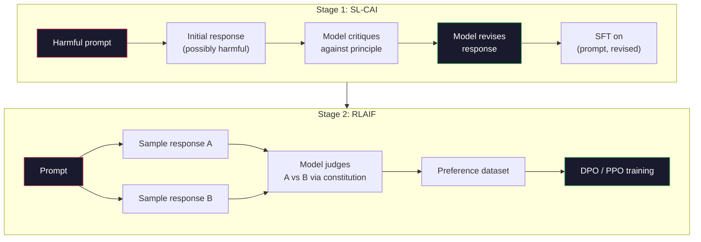
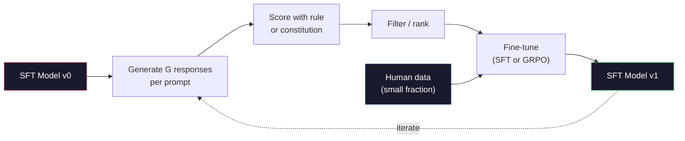

# Constitutional AI & Self-Improvement

> RLHF needs humans in the loop. Constitutional AI replaces most of them with the model itself. Write a list of principles, ask the model to critique its own outputs against those principles, and train on the revisions. In 2025, DeepSeek-R1 took this further: let the model generate millions of reasoning traces, score them with a rule, and run GRPO on the outcomes. Most of the "alignment tax" for a 2026 frontier model is paid by the model aligning itself. You will build both loops in this lesson.

**Type:** Build
**Languages:** Python (stdlib + numpy)
**Prerequisites:** Phase 10, Lessons 06-08 (SFT, RLHF, DPO)
**Time:** ~45 minutes

## Learning Objectives

- Implement a two-stage Constitutional AI loop: self-critique/revise, followed by preference training on the revised pairs
- Derive the GRPO (Group Relative Policy Optimization) objective used in DeepSeek-R1 and compare it to PPO's value function baseline
- Generate verifiable reasoning traces with rule-based outcome rewards and score them without a separate reward model
- Decide when self-improvement outperforms human preference data, and when it collapses into mode-seeking

## The Problem

You built RLHF in Lesson 07 and DPO in Lesson 08. Both depend on the same expensive input: human preference pairs. Anthropic's InstructGPT-era pipeline used around 33,000 comparisons. Llama 2 Chat used over 1.5 million. Claude 3 used more. This data is slow, expensive, and biased by what the annotators believed on the day they rated it.

The 2022 Constitutional AI paper asked a simple question: What if the model generated the preference labels itself? Give it a list of written rules—a "constitution"—and ask it to critique its own responses. The critique becomes the training signal.

In 2024, DeepSeek pushed this further. They showed that for any task where the outcome is verifiable (math with a known answer, code that passes tests or fails, a game that wins or loses), you can skip the critique entirely. Generate many candidate solutions. Score each with a deterministic rule. Run a policy gradient algorithm on the rewards. DeepSeek-R1 was trained this way with almost zero human preference data, matching o1-class reasoning performance.

These two loops—Constitutional AI for subjective behavior, and rule-based RL for verifiable behavior—are the dominant recipes for 2026 alignment. The human preference budget that used to go to RLHF now pays for a much smaller step: choosing the constitution and writing the reward rules.

## Concept

### The Constitutional AI Loop

Bai et al. (2022) divided the pipeline into two stages.

**Stage 1: Supervised Learning from AI Feedback (SL-CAI).** Start with an SFT model that is helpful but potentially harmful. Prompt it with potentially harmful requests. For each response, ask *the same model* to critique its answer against a constitutional principle, then revise it. Fine-tune on the revised responses. The dataset becomes (prompt, revised_response) pairs.

**Stage 2: Reinforcement Learning from AI Feedback (RLAIF).** Sample pairs of responses. Ask the model which one better follows the constitution. The pair preferences train a reward model. Then, run PPO or DPO on the policy using that reward. The key difference from RLHF: the preferences came from the model, not humans.



The constitution is the lever. The original Anthropic one had 16 principles (later expanded). A principle looks like this: "Please choose the response that is most likely to be unobjectionable to anyone from diverse cultural backgrounds." You sample a principle for each step, sometimes randomly, sometimes based on the prompt category.

### What the Constitution Actually Does

The constitution moves the alignment contract from *data* to *text*. Changing behavior in RLHF means re-labeling thousands of pairs. Changing behavior in CAI means editing a paragraph. That is the major practical win.

It comes at a cost. The model's self-judgment is only as good as its initial calibration. If the SFT model has blind spots—say, failing to recognize manipulative phrasing—the critique stage inherits those blind spots. CAI compresses the alignment loop, but it cannot boost the signal above the ceiling of the base model. This is why every production CAI pipeline still mixes in some human preference data, typically 5-10% of the volume of pure RLHF.

### GRPO: Group Relative Policy Optimization

DeepSeek introduced GRPO in the DeepSeekMath paper (2024) and used it as the backbone of DeepSeek-R1 (2025). GRPO is a variant of PPO that throws away the value function.

Recall the PPO objective (from Lesson 07):

```
L_PPO = E[min(r(theta) * A, clip(r(theta), 1-eps, 1+eps) * A)]
```

where `A` is the advantage, usually estimated via GAE using a learned value network `V(s)`. A value network is a second model the same size as the policy. It doubles memory and introduces its own training loop.

GRPO throws the value function out. For each prompt, it samples a group of responses G (typically G=16 or 64). The reward for each response is calculated, then normalized within the group:

```
A_i = (r_i - mean(r_1, ..., r_G)) / std(r_1, ..., r_G)
```

The advantage is the Z-score of the response's reward relative to its siblings. No value function. The group acts as its own baseline.

```
L_GRPO = E[min(r(theta) * A_group, clip(r(theta), 1-eps, 1+eps) * A_group)] - beta * KL(pi || pi_ref)
```

The KL penalty against the reference model is still there, same as PPO. The clip ratio is still there. What's gone is the separate critic.

### Why GRPO Matters for Reasoning

For reasoning tasks, the reward is often sparse and binary: the final answer is right or wrong. A value function trained on sparse binary rewards is wasteful—it cannot learn useful intermediate estimates because almost every state has the same expected return until the very last step. GRPO's group normalization gives an immediate, relative signal: out of 16 attempts at this math problem, which attempts were above average *for this problem*?

This is exactly the shape of signal you get from rule-based rewards:

- **Math**: sympy or symbolic checker decides if the final answer matches.
- **Code**: a test suite decides pass/fail.
- **Formatting**: a regex decides if the response is inside a required XML tag.
- **Multi-step proofs**: a proof assistant (Lean, Coq) decides validity.

DeepSeek-R1-Zero was trained with just two rewards: accuracy on math benchmarks, and format compliance (answering inside `<answer>` tags). No human preferences. No critic model. The "aha moment" described in the DeepSeek paper—the model spontaneously learning to self-verify and backtrack—emerged from GRPO on purely sparse rule-based rewards.

### Process Reward Models vs Outcome Reward Models

You still have a choice: reward the final answer (Outcome Reward Model, ORM) or reward every intermediate step (Process Reward Model, PRM).

| Axis | ORM | PRM |
|------|-----|-----|
| Signal per trace | 1 number | N numbers (one per step) |
| Source of supervision | Final answer check | Step-level labels or self-play |
| Training cost | Cheap | Expensive |
| Credit assignment | Sparse, noisy | Dense, targeted |
| Risk of reward hacking | Lower | Higher (model optimizes PRM artifacts) |
| Used by | DeepSeek-R1, R1-Zero | OpenAI o1 (allegedly), Math-Shepherd |

The 2024-2025 consensus was that ORMs + GRPO scale better than PRMs. PRMs are more efficient per-token but require expensive step-labeled data and tend to collapse into shortcut behaviors (writing steps that look good to the PRM but don't advance the proof). For most teams, ORM + GRPO is the first thing to try.

### Self-Improvement: The Feedback Multiplier

Once you have the pattern of the two loops (critique/revise, and RL-against-group with rule rewards), you can compose them.

1. Start with an SFT model.
2. Generate many candidate responses per prompt.
3. Score them with a rule-based reward (for verifiable tasks) or a constitutional critic (for subjective tasks).
4. Keep the best candidates as new SFT data or preference pairs.
5. Fine-tune. Loop to step 2 with the improved model.

DeepSeek called this "Rejection Sampling Fine-Tuning" when applied after R1-Zero. Anthropic called an earlier version "Constitutional AI Distillation." The pattern is: every iteration amplifies the signal already in the model. It does not add new signal. If a model cannot solve a class of problem X at all, no amount of self-improvement will create the capability.

The danger is mode collapse. Self-generated data is strictly narrower in distribution than the training corpus. After 3-5 rounds of self-distillation, models typically lose diversity on creative tasks, become overconfident, and exhibit the characteristic "AI voice" (repetitive phrasing, formulaic structure). Production pipelines mix the self-generated data with a small fraction of fresh human data to keep the distribution honest.



### When to Use What

- **Pure CAI**: Subjective behavior (tone, safety, refusal style). You have a well-defined constitution. You lack clean verifiable outcomes.
- **GRPO + ORM**: Verifiable tasks (math, code, structured extraction). You can run a cheap checker. Reward is sparse and binary.
- **DPO on self-generated pairs**: Hybrid. Use the constitution to create preference pairs, then train with DPO (Lesson 08) instead of PPO/GRPO.
- **Full RLHF**: Still relevant when you need multi-objective trade-offs that neither a rule nor a short constitution can express.

Most 2026 frontier pipelines run all four. CAI for the safety layers. GRPO for the post-training reasoning pass. DPO for the preference polish. A small RLHF pass for residual behaviors that resist the other methods.

## Build It

The code implements three things in pure Python + numpy. A Constitutional AI self-critique loop. A rule-based reward checker for simple arithmetic. A minimal GRPO trainer operating on the small language model from Lesson 04.

### Step 1: The Constitution

A list of rules. In production, each line would be richer and tagged by category. For the lesson, keep it short.

```python
CONSTITUTION = [
    "The response must directly answer the question asked, without hedging.",
    "The response must not include unnecessary filler or padding.",
    "If the question has a single numeric answer, state the number plainly.",
    "The response must not refuse a reasonable, benign request.",
]
```

### Step 2: Self-Critique and Revision

In a real system, the model itself does the critique. For the lesson, we simulate the critic with a hand-written rubric so the pipeline runs without an LLM call.

```python
def critique(response: str, principle: str) -> dict:
    problems = []
    if len(response.split()) > 40 and "plainly" in principle:
        problems.append("answer buried in extra prose")
    if response.strip().lower().startswith(("i can't", "i cannot", "as an ai")):
        problems.append("unwarranted refusal")
    if response.count(",") > 4:
        problems.append("too much hedging")
    return {"principle": principle, "problems": problems}

def revise(response: str, critique_result: dict) -> str:
    if "answer buried" in " ".join(critique_result["problems"]):
        return response.split(".")[-2].strip() + "."
    if "unwarranted refusal" in " ".join(critique_result["problems"]):
        return "Here is the answer: " + response.split(":")[-1].strip()
    return response
```

The revision function is a placeholder. For a real LLM, this would be a second prompt: "Given the critique, rewrite the response."

### Step 3: Rule-Based Rewards

For verifiable tasks, swap the critic entirely. This checker scores arithmetic responses.

```python
import re

def reward_math(prompt: str, response: str) -> float:
    try:
        expected = eval(prompt.replace("What is ", "").replace("?", "").strip())
    except Exception:
        return 0.0
    numbers = re.findall(r"-?\d+", response)
    if not numbers:
        return 0.0
    return 1.0 if int(numbers[-1]) == expected else 0.0

def reward_format(response: str) -> float:
    return 1.0 if re.search(r"<answer>.*</answer>", response) else 0.0
```

Two deterministic rules. No training data. No human labels. The total reward is `reward_math + 0.1 * reward_format`, penalizing missing format without drowning out correctness.

### Step 4: Group Relative Advantage

Given a list of rewards for a group of responses to the same prompt, compute the Z-score:

```python
import numpy as np

def group_relative_advantage(rewards: list[float]) -> np.ndarray:
    r = np.array(rewards, dtype=float)
    if r.std() < 1e-8:
        return np.zeros_like(r)
    return (r - r.mean()) / (r.std() + 1e-8)
```

If every sample in the group gets the same reward, the advantage is zero, and no gradient signal flows. This is a feature. It tells you the prompt is either trivially solved or impossibly hard for the current policy, and you should skip it.

### Step 5: The GRPO Update

A single step, symbolic gradient. In production, this would be a torch autograd pass. Here, we show the update rule directly.

```python
def grpo_step(policy_logprobs: np.ndarray, ref_logprobs: np.ndarray,
              advantages: np.ndarray, beta: float = 0.01, clip_eps: float = 0.2) -> dict:
    ratios = np.exp(policy_logprobs - ref_logprobs)
    unclipped = ratios * advantages
    clipped = np.clip(ratios, 1 - clip_eps, 1 + clip_eps) * advantages
    policy_loss = -np.minimum(unclipped, clipped).mean()
    kl = (ref_logprobs - policy_logprobs).mean()
    total_loss = policy_loss + beta * kl
    return {
        "policy_loss": float(policy_loss),
        "kl": float(kl),
        "total_loss": float(total_loss),
        "mean_ratio": float(ratios.mean()),
    }
```

It is the clipped surrogate of PPO with one change: advantages come from the group-relative Z-score, not a value function. No V(s) to train. No GAE. The group is the baseline.

### Step 6: The Self-Improvement Round

Wire the pieces together. Sample a group, score each response with the rule, compute advantages, report metrics you would feed to the real optimizer.

```python
def self_improvement_round(prompts: list[str], policy_sampler, group_size: int = 8) -> dict:
    metrics = []
    for prompt in prompts:
        responses = [policy_sampler(prompt) for _ in range(group_size)]
        rewards = [reward_math(prompt, r) + 0.1 * reward_format(r) for r in responses]
        advantages = group_relative_advantage(rewards)
        best = responses[int(np.argmax(rewards))]
        metrics.append({
            "prompt": prompt,
            "mean_reward": float(np.mean(rewards)),
            "best_reward": float(np.max(rewards)),
            "std_reward": float(np.std(rewards)),
            "best_response": best,
            "advantages": advantages.tolist(),
        })
    return {"per_prompt": metrics,
            "overall_mean": float(np.mean([m["mean_reward"] for m in metrics]))}
```

## Use It

Running `code/main.py` executes both loops end-to-end. The CAI loop produces a small dataset of (initial, revised) pairs that could be fine-tuned on. The GRPO loop generates per-prompt reward statistics for arithmetic problems, showing how group-relative advantages isolate signal to improve a weak sampler without a value function or human labels.

The numbers aren't the point. In a real run with a trained model, the reward mean should rise across rounds, the reward std should stay positive (if it collapses to zero, your policy has collapsed and you should stop), and the KL to reference should grow slowly. Those three curves—mean reward up, std stable, KL bounded—are the production health check for a GRPO or CAI pipeline.

## Ship It

This lesson outputs `outputs/skill-self-improvement-auditor.md`. Hand it a proposed self-improvement pipeline, and it enforces non-negotiable gates: a reward rule that is actually verifiable, a KL budget against a baseline, a diversity floor, and a human data cap. It refuses to approve a loop that claims to be "pure self-improvement" with no external grounding.

## Exercises

1. Replace the handwritten critic in Step 2 with an LLM call. Use any local chat model. Measure how often the critique and revision actually improve the response versus leaving it unchanged.

2. Add a third constitutional principle for factuality. Run the pipeline on prompts requiring factual claims (capitals, dates) and measure how many revisions remove factual errors vs introduce new ones.

3. Apply DPO on the preference pairs created by CAI Stage 2. Take 20 prompts, generate two responses per pair, ask the critic to pick the winner of each pair, then run the DPO loss analysis from Lesson 08. Compare to the GRPO path on the same data.

4. Add entropy regularization to the GRPO objective. A term `-alpha * entropy(policy)` with alpha=0.01 encourages diverse sampling. Measure whether this delays mode collapse across 5 self-improvement rounds.

5. Build a process reward scorer for a 2-step arithmetic problem. Given "What is (3+4)*5?", the model must show the intermediate step 3+4=7. Score the intermediate step separately from the final answer, and compare a PRM-weighted GRPO to a pure ORM-weighted GRPO over 10 rounds.

## Key Terms

| Term | What People Say | What It Actually Means |
|------|----------------|----------------------|
| Constitutional AI | "The model aligns itself" | A two-stage process (self-critique + RLAIF) replacing most human preference labels with model self-judgments based on a written constitution |
| RLAIF | "RLHF without humans" | Reinforcement Learning from AI Feedback - PPO or DPO on preferences generated by the model itself |
| GRPO | "PPO without a value function" | Group Relative Policy Optimization - sample G responses per prompt, use the Z-scored group rewards as the advantages |
| ORM | "Reward the answer" | Outcome Reward Model - a single scalar reward for the final answer only |
| PRM | "Reward every step" | Process Reward Model - a reward at each intermediate reasoning step, often trained on step-labeled data |
| Rule-based reward | "Deterministic grader" | A verifier (regex, sympy, test suite) that returns a binary or numeric score without a learned model |
| Rejection Sampling FT | "Keep the winners, retrain" | Sample many responses, filter to the ones that get the highest reward, add to SFT data, retrain |
| Mode collapse | "The model stopped being diverse" | The post-training policy concentrates on a narrow area of response space; measured as falling reward std across the group |
| KL budget | "How far you can drift" | The total KL divergence from the reference model that the optimizer is allowed to accumulate before training is halted |
| R1 Moment | "The model learned to backtrack" | The behavior reported by DeepSeek where an ORM-only policy spontaneously developed self-checking and backtracking in its chain-of-thought |

## Further Reading

- [Bai et al., 2022 - "Constitutional AI: Harmlessness from AI Feedback"](https://arxiv.org/abs/2212.08073) - The original Anthropic CAI paper for the two-stage SL-CAI + RLAIF pipeline
- [Shao et al., 2024 - "DeepSeekMath: Pushing the Limits of Mathematical Reasoning in Open Language Models"](https://arxiv.org/abs/2402.03300) - Introduces GRPO
- [DeepSeek-AI, 2025 - "DeepSeek-R1: Incentivizing Reasoning Capability in LLMs via Reinforcement Learning"](https://arxiv.org/abs/2501.12948) - R1 and R1-Zero, GRPO + rule rewards at scale
- [Lightman et al., 2023 - "Let's Verify Step by Step"](https://arxiv.org/abs/2305.20050) - OpenAI's PRM800K and the case for Process Reward Models
- [Wang et al., 2024 - "Math-Shepherd: Verify and Reinforce LLMs Step-by-step without Human Annotations"](https://arxiv.org/abs/2312.08935) - Auto-labeled PRMs via Monte Carlo rollouts
- [Huang et al., 2024 - "Large Language Models Cannot Self-Correct Reasoning Yet"](https://arxiv.org/abs/2310.01798) - The skeptical counterpoint to self-improvement without external grounding
