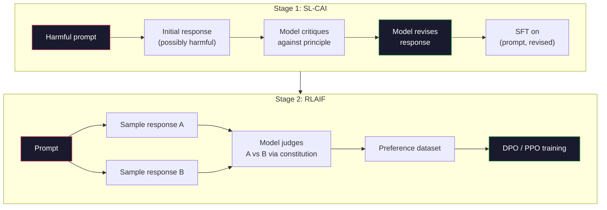
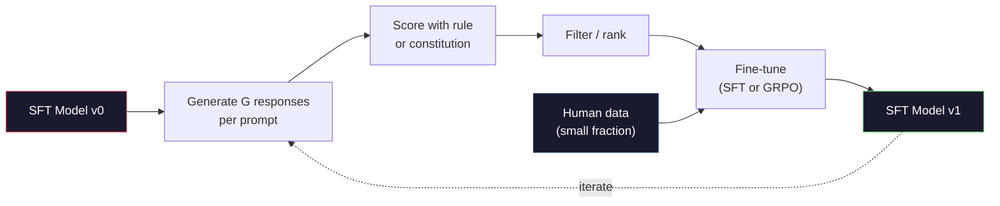

# Konstytucyjna sztuczna inteligencja i samodoskonalenie

> RLHF potrzebuje ludzi na bieżąco. Konstytucyjna sztuczna inteligencja zastępuje większość z nich samym modelem. Napisz listę zasad, poproś model o krytykę własnych wyników w oparciu o te zasady i ćwicz się w oparciu o krytykę. W 2025 r. DeepSeek-R1 posunął się dalej: pozwól modelowi wygenerować miliony śladów rozumowania, sklasyfikowaj je za pomocą reguły i przeprowadź GRPO na podstawie wyników. Większość „prac związanych z dopasowywaniem” w modelu granicznym na rok 2026 polega na samym dostosowaniu modelu. W tej lekcji zbudowane zostaną obie pętle.

**Typ:** Kompilacja
**Języki:** Python (stdlib + numpy)
**Wymagania wstępne:** Faza 10, lekcje 06-08 (SFT, RLHF, DPO)
**Czas:** ~45 minut

## Cele nauczania

- Wdrożyć dwuetapową pętlę konstytucyjnej sztucznej inteligencji: samokrytyka i samoweryfikacja, a następnie szkolenie w zakresie preferencji w zakresie poprawionych par
- Wyprowadź cel GRPO (optymalizacja polityki względnej grupy w DeepSeek-R1) i porównaj go z wartością bazową funkcji wartości PPO
- Generuj weryfikowalne ślady rozumowania za pomocą nagród wynikowych opartych na regułach i oceniaj je bez osobnego modelu nagród
- Zdecyduj, kiedy samodoskonalenie przewyższa dane dotyczące ludzkich preferencji, a kiedy zapada się w poszukiwanie trybu

## Problem

Zbudowałeś RLHF w lekcji 07 i DPO w lekcji 08. Obydwa zależą od tych samych kosztownych danych wejściowych: par preferencji ludzkich. W rurociągu Anthropic z epoki InstructGPT wykorzystano około 33 000 porównań. Z czatu Llama 2 skorzystało ponad 1,5 miliona osób. Claude 3 użył więcej. Dane te są powolne, kosztowne i stronnicze w stosunku do tego, w co komentatorzy wierzyli w dniu, w którym oceniali.

W dokumencie dotyczącym konstytucyjnej sztucznej inteligencji z 2022 r. zadano proste pytanie. Co się stanie, jeśli model sam wygeneruje etykiety preferencji? Daj mu listę spisanych zasad – „konstytucję” – i poproś o krytykę własnych reakcji. Krytyka staje się sygnałem szkoleniowym.

W 2024 r. DeepSeek rozwinął ten pomysł dalej. Pokazali, że w przypadku każdego zadania, którego wynik jest weryfikowalny (matematyka ze znaną odpowiedzią, kod, który przechodzi testy lub kończy się niepowodzeniem, gra, która albo wygrywa, albo przegrywa), można całkowicie pominąć krytykę. Wygeneruj wiele potencjalnych rozwiązań. Oceń każdy z nich za pomocą reguły deterministycznej. Uruchom algorytm gradientu zasad dla nagród. DeepSeek-R1 został przeszkolony w ten sposób, prawie bez danych dotyczących ludzkich preferencji, a jego wydajność rozumowania odpowiadała klasie o1.

Te dwie pętle – konstytucyjna sztuczna inteligencja dotycząca zachowań subiektywnych i oparta na regułach RL dotycząca zachowań weryfikowalnych – to dominujące recepty na dostosowanie się do roku 2026. Budżet preferencji ludzkich, który wcześniej trafiał do RLHF, teraz opłaca znacznie mniejszy krok: wybór konstytucji i wybór zasad nagradzania.

## Koncepcja

### Konstytucyjna pętla sztucznej inteligencji

Bai i in. (2022) podzielili rurociąg na dwa etapy.

**Etap 1: Nadzorowane uczenie się na podstawie informacji zwrotnych AI (SL-CAI).** Zacznij od modelu SFT, który jest pomocny, ale potencjalnie szkodliwy. Monituj go za pomocą potencjalnie szkodliwych żądań. W przypadku każdej odpowiedzi poproś *ten sam model* o krytykę swojej odpowiedzi w kontekście zasady konstytucyjnej, a następnie sprawdź ją. Dostosuj poprawione odpowiedzi. Zbiór danych składa się z par (podpowiedź, poprawiona_odpowiedź).

**Etap 2: Uczenie się przez wzmacnianie na podstawie informacji zwrotnej AI (RLAIF).** Przykładowe pary odpowiedzi. Zapytaj modela, który lepiej przestrzega konstytucji. Preferencje dotyczące par trenują model nagrody. Następnie uruchom PPO lub DPO na modelu, korzystając z tej nagrody. Kluczowa różnica w porównaniu z RLHF: preferencje pochodziły z modelu, a nie od ludzi.



Konstytucja jest dźwignią. Oryginał Anthropic miał 16 zasad (później rozszerzonych). Zasada brzmi następująco: „Proszę wybrać odpowiedź, która najprawdopodobniej będzie niestosowna dla kogokolwiek z różnych środowisk kulturowych”. Wybierasz zasadę dla każdego kroku, czasem losowo, czasem na podstawie kategorii podpowiedzi.

### Co właściwie robi konstytucja

Konstytucja przenosi umowę dostosowawczą z *danych* na *tekst*. Zmiana zachowania w ramach RLHF oznacza ponowne oznakowanie tysięcy par. Zmiana zachowania w ramach CAI oznacza edycję akapitu. To jest główna praktyczna wygrana.

To ma swoją cenę. Samoocena modelu jest tak dobra, jak jego początkowa kalibracja. Jeśli model SFT ma słabe punkty – na przykład nie potrafi rozpoznać manipulacyjnych sformułowań – etap krytyki dziedziczy te martwe punkty. CAI kompresuje pętlę dopasowującą, ale nie może wzmocnić sygnału poza sufitem modelu podstawowego. Właśnie dlatego każdy rurociąg produkcyjny CAI nadal wykorzystuje pewne dane dotyczące preferencji ludzkich, zazwyczaj 5–10% objętości czystego RLHF.

### GRPO: Optymalizacja polityki względem grupy

DeepSeek wprowadził GRPO w artykule DeepSeekMath (2024) i wykorzystał go jako szkielet DeepSeek-R1 (2025). GRPO jest odmianą PPO, która usuwa funkcję wartości.

Przypomnijmy sobie cel PPO (z lekcji 07):

```
L_PPO = E[min(r(theta) * A, clip(r(theta), 1-eps, 1+eps) * A)]
```

gdzie `A` to zaleta, zwykle szacowana za pomocą GAE przy użyciu sieci wartości wyuczonych `V(s)`. Sieć wartości to drugi model tej samej wielkości co polityka. Podwaja pamięć i wprowadza własną pętlę treningową.

GRPO wyrzuca funkcję wartości. Dla każdego monitu próbkuje grupę odpowiedzi G (zazwyczaj G=16 lub 64). Nagroda za każdą odpowiedź jest obliczana, a następnie normalizowana w obrębie grupy:

```
A_i = (r_i - mean(r_1, ..., r_G)) / std(r_1, ..., r_G)
```

Zaletą jest wynik Z nagrody za odpowiedź w stosunku do jej rodzeństwa. Brak funkcji wartości. Grupa działa jako własny punkt odniesienia.

```
L_GRPO = E[min(r(theta) * A_group, clip(r(theta), 1-eps, 1+eps) * A_group)] - beta * KL(pi || pi_ref)
```

Kara KL wobec modelu referencyjnego nadal obowiązuje, tak samo jak PPO. Współczynnik klipu nadal istnieje. To, co zniknęło, to oddzielny krytyk.

### Dlaczego GRPO ma znaczenie dla rozumowania

Za zadania polegające na rozumowaniu nagroda jest często skąpa i binarna: ostateczna odpowiedź jest dobra lub zła. Funkcja wartości wyszkolona na rzadkich nagrodach binarnych jest marnotrawstwem — nie może nauczyć się użytecznych szacunków pośrednich, ponieważ prawie każdy stan ma taki sam oczekiwany zwrot aż do ostatniego kroku. Normalizacja grupowa GRPO daje natychmiastowy względny sygnał: spośród 16 prób rozwiązania tego samego problemu matematycznego, które próby były powyżej średniej dla tego problemu?

Oto dokładny kształt sygnału, jaki otrzymujesz z nagród opartych na regułach:

- **Matematyka**: sympy lub symboliczne sprawdzanie decyduje, czy ostateczna odpowiedź pasuje.
- **Kod**: zestaw testów decyduje o zaliczeniu/niezaliczeniu.
- **Formatowanie**: wyrażenie regularne decyduje, czy odpowiedź znajduje się w wymaganym tagu XML.
- **Dowody wieloetapowe**: asystent dowodu (Lean, Coq) decyduje o ważności.

DeepSeek-R1-Zero został przeszkolony i przyniósł tylko dwie nagrody: dokładność w testach matematycznych i zgodność z formatem (odpowiedź w tagach `<answer>`). Żadnych ludzkich preferencji. Brak modelu krytyka. „Chwila aha” opisana w artykule DeepSeek – model spontanicznie uczący się samokontroli i wycofywania się – wyłonił się z GRPO wyłącznie dzięki nielicznym nagrodom opartym na zasadach.

### Modele nagrody za proces a modele nagrody za wynik

Nadal masz wybór: nagradzaj ostateczną odpowiedź (Outcome Reward Model, ORM) lub nagradzaj każdy etap pośredni (Process Reward Model, PRM).

| Oś | ORMO | PRM |
|------|-----|-----|
| Sygnał na ślad | 1 liczba | N liczb (po jednej na krok) |
| Źródło nadzoru | Ostateczna kontrola odpowiedzi | Etykiety stopniowe lub samoocena |
| Koszt szkolenia | Tanie | Drogie |
| Cesja kredytu | Rzadki, głośny | Gęsty, ukierunkowany |
| Ryzyko hakowania nagród | Niższy | Wyższa (model optymalizuje artefakty PRM) |
| Używany przez | DeepSeek-R1, R1-Zero | OpenAI o1 (rzekomo), Math-Shepherd |

Konsensus na lata 2024–2025 był taki, że ORM i GRPO skalują się lepiej niż PRM. PRM są bardziej wydajne w przeliczeniu na token, ale wymagają kosztownych danych oznaczonych krokami i mają tendencję do zapadania się w zachowania skrótowe (zapisywanie kroków, które dobrze wyglądają dla PRM, ale nie przyspieszają dowodu). Dla większości zespołów ORM + GRPO to pierwsza rzecz, którą należy wypróbować.

### Samodoskonalenie: mnożnik informacji zwrotnej

Kiedy już będziesz mieć wzór dwóch pętli (krytyka/poprawka i RL względem grupy z nagrodami za zasady), możesz je połączyć.

1. Zacznij od modelu SFT.
2. Generuj wiele odpowiedzi kandydatów na monit.
3. Oceń je nagrodą opartą na zasadach (za zadania sprawdzalne) lub krytykiem konstytucyjnym (za zadania subiektywne).
4. Zachowaj najlepszych kandydatów jako nowe dane SFT lub pary preferencji.
5. Dostosuj. Przejdź do kroku 2 z ulepszonym modelem.

DeepSeek nazwał to „dostrajaniem próbkowania odrzucenia”, gdy zostało zastosowane po R1-Zero. Anthropic nazwał wcześniejszą wersję tej „konstytucyjnej destylacji AI”. Wzór jest następujący: każda iteracja wzmacnia sygnał znajdujący się już w modelu. Nie dodaje nowego sygnału. Jeśli model w ogóle nie jest w stanie rozwiązać problemu klasy X, żadne samodoskonalenie nie stworzy takiej możliwości.

Niebezpieczeństwo polega na załamaniu trybu. Dane wygenerowane samodzielnie mają zawsze węższy rozkład niż korpus szkoleniowy. Po 3-5 rundach samodestylacji modelki zazwyczaj tracą różnorodność w zakresie kreatywnych zadań, stają się zbyt pewne siebie i wykazują charakterystyczny „głos sztucznej inteligencji” (powtarzające się frazy, formułowa struktura). Rurociągi produkcyjne łączą samodzielnie wygenerowane dane z niewielką częścią świeżych danych ludzkich, aby zapewnić uczciwą dystrybucję.



### Kiedy czego używać

- **Czysty CAI**: Subiektywne zachowanie (ton, bezpieczeństwo, styl odmowy). Masz dobrze określoną konstytucję. Nie masz czystych, weryfikowalnych wyników.
- **GRPO + ORM**: Zadania weryfikowalne (matematyka, kod, ekstrakcja strukturalna). Można tanio sprawdzić poprawność. Nagroda jest rzadka i binarna.
- **DPO dla par wygenerowanych samodzielnie**: Hybrydowe. Użyj konstytucji, aby stworzyć pary preferencji, a następnie trenuj z DPO (lekcja 08) zamiast z PPO/GRPO.
- **Pełny RLHF**: Nadal odpowiedni, gdy potrzebujesz kompromisów obejmujących wiele celów, których nie może wyrazić ani zasada, ani krótka konstytucja.

Większość gazociągów granicznych na rok 2026 będzie przebiegać wszystkimi czterema. CAI dla warstw bezpieczeństwa. GRPO za przepustkę uzasadniającą po szkoleniu. DPO dla preferowanego lakieru. Mały RLHF przechodzi dla zachowań resztkowych, które opierają się innym metodom.

## Zbuduj to

Kod implementuje trzy rzeczy w czystym Pythonie + numpy. Pętla samokrytyki konstytucyjnej sztucznej inteligencji. Oparty na regułach moduł sprawdzania nagród do wykonywania prostych obliczeń arytmetycznych. Minimalny trener GRPO działający na małym modelu językowym z lekcji 04.

### Krok 1: Konstytucja

Lista zasad. W produkcji każda linia byłaby bogatsza i oznaczona kategorią. Lekcja powinna być krótka.

```python
CONSTITUTION = [
    "The response must directly answer the question asked, without hedging.",
    "The response must not include unnecessary filler or padding.",
    "If the question has a single numeric answer, state the number plainly.",
    "The response must not refuse a reasonable, benign request.",
]
```

### Krok 2: Samokrytyka i weryfikacja

W rzeczywistym systemie sam model dokonuje krytyki. Podczas lekcji symulujemy krytyka za pomocą odręcznie napisanej rubryki, tak aby potok działał bez wywołania LLM.

```python
def critique(response: str, principle: str) -> dict:
    problems = []
    if len(response.split()) > 40 and "plainly" in principle:
        problems.append("answer buried in extra prose")
    if response.strip().lower().startswith(("i can't", "i cannot", "as an ai")):
        problems.append("unwarranted refusal")
    if response.count(",") > 4:
        problems.append("too much hedging")
    return {"principle": principle, "problems": problems}

def revise(response: str, critique_result: dict) -> str:
    if "answer buried" in " ".join(critique_result["problems"]):
        return response.split(".")[-2].strip() + "."
    if "unwarranted refusal" in " ".join(critique_result["problems"]):
        return "Here is the answer: " + response.split(":")[-1].strip()
    return response
```

Funkcja korekty jest funkcją zastępczą. W przypadku prawdziwego LLM byłaby to druga podpowiedź: „Biorąc pod uwagę krytykę, przepisz odpowiedź”.

### Krok 3: Nagrody oparte na zasadach

W przypadku zadań sprawdzalnych całkowicie wymień krytyka. Ten moduł sprawdzający ocenia odpowiedzi arytmetyczne.

```python
import re

def reward_math(prompt: str, response: str) -> float:
    try:
        expected = eval(prompt.replace("What is ", "").replace("?", "").strip())
    except Exception:
        return 0.0
    numbers = re.findall(r"-?\d+", response)
    if not numbers:
        return 0.0
    return 1.0 if int(numbers[-1]) == expected else 0.0

def reward_format(response: str) -> float:
    return 1.0 if re.search(r"<answer>.*</answer>", response) else 0.0
```

Dwie reguły deterministyczne. Brak danych treningowych. Żadnych ludzkich etykiet. Łączna nagroda to `reward_math + 0.1 * reward_format`, kara za brakujący format bez zagłuszania poprawności.

### Krok 4: Przewaga względna grupy

Biorąc pod uwagę listę nagród dla grupy odpowiedzi na ten sam monit, oblicz wynik Z:

```python
import numpy as np

def group_relative_advantage(rewards: list[float]) -> np.ndarray:
    r = np.array(rewards, dtype=float)
    if r.std() < 1e-8:
        return np.zeros_like(r)
    return (r - r.mean()) / (r.std() + 1e-8)
```

Jeśli każda próbka w grupie ma tę samą nagrodę, przewaga wynosi zero i nie przepływa żaden sygnał gradientu. To jest funkcja. Informuje, że monit został rozwiązany w banalny sposób lub jest niemożliwie trudny dla bieżących zasad i należy go pominąć.

### Krok 5: Aktualizacja GRPO

Jeden krok, symboliczny gradient. W produkcji byłaby to przepustka autogradowa palnika. Tutaj pokazujemy bezpośrednio regułę aktualizacji.

```python
def grpo_step(policy_logprobs: np.ndarray, ref_logprobs: np.ndarray,
              advantages: np.ndarray, beta: float = 0.01, clip_eps: float = 0.2) -> dict:
    ratios = np.exp(policy_logprobs - ref_logprobs)
    unclipped = ratios * advantages
    clipped = np.clip(ratios, 1 - clip_eps, 1 + clip_eps) * advantages
    policy_loss = -np.minimum(unclipped, clipped).mean()
    kl = (ref_logprobs - policy_logprobs).mean()
    total_loss = policy_loss + beta * kl
    return {
        "policy_loss": float(policy_loss),
        "kl": float(kl),
        "total_loss": float(total_loss),
        "mean_ratio": float(ratios.mean()),
    }
```

Jest to obcięty surogat PPO z jedną zmianą: korzyści wynikają z wartości Z-score względnych dla grupy, a nie z funkcji wartości. Brak V(ów) do trenowania. Żadnego GAE. Grupa to podstawa.

### Krok 6: Runda samodoskonalenia

Połącz kawałki razem. Próbuj na grupie, oceń każdą odpowiedź regułą, oblicz korzyści, zgłoś metryki, które mógłbyś wprowadzić do prawdziwego optymalizatora.

```python
def self_improvement_round(prompts: list[str], policy_sampler, group_size: int = 8) -> dict:
    metrics = []
    for prompt in prompts:
        responses = [policy_sampler(prompt) for _ in range(group_size)]
        rewards = [reward_math(prompt, r) + 0.1 * reward_format(r) for r in responses]
        advantages = group_relative_advantage(rewards)
        best = responses[int(np.argmax(rewards))]
        metrics.append({
            "prompt": prompt,
            "mean_reward": float(np.mean(rewards)),
            "best_reward": float(np.max(rewards)),
            "std_reward": float(np.std(rewards)),
            "best_response": best,
            "advantages": advantages.tolist(),
        })
    return {"per_prompt": metrics,
            "overall_mean": float(np.mean([m["mean_reward"] for m in metrics]))}
```

## Użyj tego

Uruchomienie `code/main.py` powoduje uruchomienie obu pętli od końca do końca. Pętla CAI tworzy mały zestaw (początkowych, poprawionych) par, które można dostroić. Pętla GRPO generuje statystyki nagród za monit dla problemów arytmetycznych, pokazując, w jaki sposób przewagi względne względem grupy pozwalają na poprawę słabego próbnika bez funkcji wartości lub ludzkich etykiet.

Liczby nie są najważniejsze. W prawdziwym działaniu z wytrenowanym modelem średnia nagrody powinna rosnąć w kolejnych rundach, standard nagrody powinien pozostać dodatni (jeśli spadnie do zera, polityka uległa załamaniu i powinieneś się zatrzymać), a KL do odniesienia powinien rosnąć powoli. Te trzy krzywe – średnia nagroda w górę, std stabilna, ograniczona KL – stanowią kontrolę stanu produkcji dla potoku GRPO lub CAI.

## Wyślij to

Ta lekcja przedstawia `outputs/skill-self-improvement-auditor.md`. Podaj mu proponowany proces samodoskonalenia, a on narzuci niepodlegające negocjacjom bramy: zasadę nagradzania, która jest faktycznie weryfikowalna, budżet KL w stosunku do punktu odniesienia, minimalny poziom różnorodności i limit danych ludzkich. Odmawia zatwierdzenia pętli, która twierdzi, że jest „czystym samodoskonaleniem” bez zewnętrznego uziemienia.

## Ćwiczenia

1. Zastąp odręcznego krytyka w kroku 2 telefonem LLM. Użyj dowolnego modelu czatu lokalnego. Zmierz, jak często krytyka i powtórka faktycznie poprawiają reakcję, w porównaniu z pozostawieniem jej bez zmian.

2. Dodaj trzecią konstytucyjną zasadę dotyczącą faktyczności. Uruchom potok na podstawie monitów wymagających twierdzeń faktycznych (wielkie litery, daty) i zmierz, ile wersji usuwa błędy merytoryczne w porównaniu z wprowadzaniem nowych.

3. Zastosuj DPO na parach preferencji utworzonych przez CAI etap 2. Weź 20 podpowiedzi, wygeneruj po dwie odpowiedzi na każdą parę, poproś krytyka o wybranie zwycięzcy z każdej pary, a następnie przeprowadź analizę utraty DPO z lekcji 08. Porównaj ze ścieżką GRPO na tych samych danych.

4. Dodaj regularyzację entropii do celu GRPO. Termin `-alpha * entropy(policy)` z alfa=0,01 zachęca do zróżnicowanego próbkowania. Zmierz, czy opóźnia to załamanie trybu w ciągu 5 rund samodoskonalenia.

5. Zbuduj narzędzie do obliczania punktacji procesu dla dwuetapowego problemu arytmetycznego. Biorąc pod uwagę „Co to jest (3+4)*5?”, model musi pokazywać pośredni krok 3+4=7. Oceń etap pośredni oddzielnie od odpowiedzi końcowej i porównaj GRPO ważone PRM z czystym GRPO ważonym ORM w ciągu 10 rund.

## Kluczowe terminy

| Termin | Co ludzie mówią | Co to właściwie oznacza |
|------|----------------|----------------------|
| Konstytucyjna sztuczna inteligencja | „Model sam się dopasowuje” | Dwuetapowy proces (samokrytyka + RLAIF), który zastępuje większość etykiet dotyczących ludzkich preferencji modelowymi samoocenami w oparciu o pisemną konstytucję |
| RLAIF | „RLHF bez ludzi” | Wzmocnienie Uczenie się na podstawie informacji zwrotnych AI – PPO lub DPO na temat preferencji generowanych przez sam model |
| GRPO | „PPO bez funkcji wartości” | Optymalizacja polityki względem grupy — próbuj G odpowiedzi na monit, wykorzystaj nagrody grupowe z oceną Z jako zalety |
| ORMO | „Nagradzaj odpowiedź” | Model nagrody za wynik — pojedyncza nagroda skalarna tylko za ostateczną odpowiedź |
| PRM | „Nagradzaj każdy krok” | Model nagrody procesu — nagroda na każdym pośrednim etapie rozumowania, często trenowana na podstawie danych oznaczonych etapami |
| Nagroda oparta na zasadach | „Oceniacz deterministyczny” | Weryfikator (regex, sympy, zestaw testów), który zwraca wynik binarny lub numeryczny bez wyuczonego modelu |
| Próbkowanie odrzucone FT | „Zatrzymaj zwycięzców, przekwalifikuj się” | Próbuj wiele odpowiedzi, filtruj do tych, które przynoszą najwyższą nagrodę, dodaj do danych SFT, przekwalifikuj się |
| Załamanie trybu | „Model przestał być różnorodny” | Polityka poszkoleniowa koncentruje się na wąskim obszarze przestrzeni reakcji; mierzone jako spadający standard nagrody w całej grupie |
| Budżet KL | „Jak daleko możesz dryfować” | Całkowita rozbieżność KL z modelem referencyjnym, którą optymalizator może zgromadzić przed zatrzymaniem uczenia |
| Moment R1 | „Model nauczył się cofać” | Zgłoszone przez DeepSeek zachowanie, w którym polityka skupiała się wyłącznie na nagrodach za wyniki, samokontrola i wycofywanie się w łańcuchu myślowym spontanicznie rozwinęły się |

## Dalsze czytanie

– [Bai i in., 2022 – „Constitutional AI: Harmless from AI Feedback”](https://arxiv.org/abs/2212.08073) – Oryginalny artykuł firmy Anthropic CAI dotyczący dwuetapowego rurociągu SL-CAI + RLAIF
– [Shao i in., 2024 – „DeepSeekMath: przesuwanie granic rozumowania matematycznego w modelach języka otwartego”](https://arxiv.org/abs/2402.03300) – przedstawia GRPO
– [DeepSeek-AI, 2025 – „DeepSeek-R1: zachęcanie do umiejętności rozumowania w LLM poprzez uczenie się przez wzmacnianie”](https://arxiv.org/abs/2501.12948) – R1 i R1-Zero, GRPO + nagrody za zasady na dużą skalę
– [Lightman i in., 2023 – „Sprawdźmy krok po kroku”](https://arxiv.org/abs/2305.20050) – PRM800K OpenAI i uzasadnienie modeli nagród procesowych
– [Wang i in., 2024 – „Math-Shepherd: weryfikacja i wzmacnianie LLM krok po kroku bez adnotacji ludzkich”](https://arxiv.org/abs/2312.08935) – automatycznie oznakowane PRM poprzez wdrożenia Monte Carlo
– [Huang i in., 2024 – „Modele wielkojęzykowe nie potrafią jeszcze samodzielnie skorygować rozumowania”](https://arxiv.org/abs/2310.01798) – sceptyczny kontrapunkt dotyczący samodoskonalenia bez zewnętrznego uziemienia