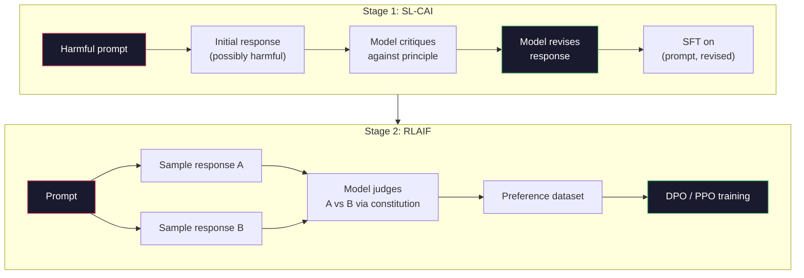
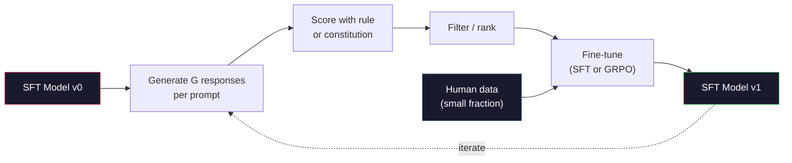

# Konstytucyjna sztuczna inteligencja i samodoskonalenie

> RLHF wymaga stałego udziału ludzi. Konstytucyjna sztuczna inteligencja zastępuje większość z nich samym modelem. Wystarczy napisać listę zasad, poprosić model o krytykę własnych odpowiedzi w odniesieniu do tych zasad i uczyć go na podstawie tej krytyki. W 2025 roku DeepSeek-R1 poszedł krok dalej: pozwolił modelowi wygenerować miliony śladów rozumowania, ocenił je za pomocą reguły deterministycznej i przeprowadził GRPO na wynikowych nagrodach. Większość pracy dostosowawczej w modelach granicznych roku 2026 polega na samodoskonaleniu modelu. W tej lekcji zostaną zbudowane obie pętle.

**Typ:** Kompilacja
**Języki:** Python (stdlib + numpy)
**Wymagania wstępne:** Faza 10, lekcje 06-08 (SFT, RLHF, DPO)
**Czas:** ~45 minut

## Cele nauczania

- Wdrożyć dwuetapową pętlę konstytucyjnej sztucznej inteligencji: samokrytykę i samokorektę, a następnie uczenie się na podstawie preferencji z użyciem poprawionych par
- Wyprowadzić cel GRPO (Group Relative Policy Optimization w DeepSeek-R1) i porównać go z funkcją wartości bazowej w PPO
- Generować weryfikowalne ślady rozumowania z użyciem nagród opartych na regułach i oceniać je bez osobnego modelu nagród
- Określić, kiedy samodoskonalenie przewyższa dane dotyczące ludzkich preferencji, a kiedy prowadzi do zawężenia rozkładu odpowiedzi

## Problem

W lekcji 07 zbudowałeś RLHF, a w lekcji 08 — DPO. Oba podejścia wymagają tych samych kosztownych danych wejściowych: par preferencji ludzkich. Potok Anthropic z ery InstructGPT wykorzystał około 33 000 porównań. Llama 2 Chat — ponad 1,5 miliona. Claude 3 — jeszcze więcej. Takie dane są trudne do zebrania, kosztowne i obciążone subiektywizmem oceniających.

W artykule o konstytucyjnej sztucznej inteligencji z 2022 roku postawiono proste pytanie: co się stanie, jeśli model sam wygeneruje etykiety preferencji? Daj mu listę zapisanych zasad — „konstytucję" — i poproś, żeby krytykował własne odpowiedzi. Ta krytyka staje się sygnałem treningowym.

W 2024 roku DeepSeek rozwinął ten pomysł. Pokazał, że dla każdego zadania z weryfikowalnym wynikiem (matematyka ze znaną odpowiedzią, kod przechodzący testy, gra z jednoznacznym rezultatem) można całkowicie pominąć etap krytyki. Wystarczy wygenerować wiele potencjalnych rozwiązań, ocenić każde z nich deterministyczną regułą i uruchomić algorytm gradientu polityki na podstawie nagród. DeepSeek-R1 wytrenowano właśnie w ten sposób — niemal bez danych z ludzkich preferencji — a jego zdolności rozumowania dorównały modelowi o1.

Te dwie pętle — konstytucyjna AI dla zachowań subiektywnych i RL oparty na regułach dla zachowań weryfikowalnych — stanowią dominujące metody dostosowania w 2026 roku. Budżet przeznaczony wcześniej na dane do RLHF teraz finansuje znacznie węższy zakres pracy: wybór konstytucji i zasad nagradzania.

## Koncepcja

### Pętla konstytucyjnej AI

Bai i in. (2022) podzielili potok na dwa etapy.

**Etap 1: Nadzorowane uczenie się na podstawie informacji zwrotnej AI (SL-CAI).** Zaczynamy od modelu SFT, który jest pomocny, ale potencjalnie szkodliwy. Podajemy mu potencjalnie szkodliwe żądania. Dla każdej odpowiedzi prosimy *ten sam model* o jej krytykę w kontekście wybranej zasady konstytucyjnej, a następnie o korektę. Model dostrajamy na poprawionych odpowiedziach. Zbiór danych tworzą pary (zapytanie, poprawiona_odpowiedź).

**Etap 2: Uczenie przez wzmacnianie na podstawie informacji zwrotnej AI (RLAIF).** Próbkujemy pary odpowiedzi i pytamy model, która z nich lepiej respektuje konstytucję. Wynikające z tego preferencje służą do trenowania modelu nagród. Następnie uruchamiamy PPO lub DPO z tą nagrodą. Kluczowa różnica w stosunku do RLHF: preferencje pochodzą od modelu, nie od ludzi.



Konstytucja jest głównym mechanizmem sterowania. Oryginalna wersja Anthropic zawierała 16 zasad (później rozszerzonych). Przykładowa zasada brzmi: „Wybierz odpowiedź, która najprawdopodobniej będzie odpowiednia dla osób z różnych środowisk kulturowych". Zasadę dobiera się dla każdego kroku — czasem losowo, czasem na podstawie kategorii zapytania.

### Co właściwie robi konstytucja

Konstytucja przenosi ciężar dostosowania z *danych* na *tekst*. Zmiana zachowania w RLHF wymaga ponownego oznakowania tysięcy par. Zmiana zachowania w CAI sprowadza się do edycji jednego akapitu. To jest główna, praktyczna zaleta tej metody.

Wiąże się z nią jednak pewna cena. Samoocena modelu jest tak dobra, jak jego wyjściowa kalibracja. Jeśli model SFT ma martwe punkty — na przykład nie rozpoznaje manipulacyjnych sformułowań — etap krytyki dziedziczy te słabości. CAI skraca pętlę dostosowania, ale nie może wzmocnić sygnału ponad sufit modelu bazowego. Dlatego każdy produkcyjny potok CAI nadal korzysta z pewnej liczby ludzkich preferencji — zazwyczaj 5–10% wolumenu czystego RLHF.

### GRPO: Optymalizacja polityki względem grupy

DeepSeek wprowadził GRPO w artykule DeepSeekMath (2024) i zastosował go jako szkielet DeepSeek-R1 (2025). GRPO to wariant PPO, który eliminuje funkcję wartości.

Cel PPO (z lekcji 07):

```
L_PPO = E[min(r(theta) * A, clip(r(theta), 1-eps, 1+eps) * A)]
```

gdzie `A` to zaleta, szacowana zazwyczaj za pomocą GAE z użyciem wyuczonej sieci wartości `V(s)`. Sieć wartości to drugi model tej samej wielkości co polityka — podwaja zużycie pamięci i wymaga własnej pętli treningowej.

GRPO rezygnuje z funkcji wartości. Dla każdego zapytania próbkuje grupę G odpowiedzi (zazwyczaj G=16 lub 64), oblicza nagrodę za każdą z nich, a następnie normalizuje wyniki w obrębie grupy:

```
A_i = (r_i - mean(r_1, ..., r_G)) / std(r_1, ..., r_G)
```

Zaleta to wynik Z nagrody danej odpowiedzi względem pozostałych w grupie. Żadnej funkcji wartości — grupa służy jako własny punkt odniesienia.

```
L_GRPO = E[min(r(theta) * A_group, clip(r(theta), 1-eps, 1+eps) * A_group)] - beta * KL(pi || pi_ref)
```

Kara KL względem modelu referencyjnego oraz współczynnik przycinania pozostają takie same jak w PPO. Jedyna zmiana to brak osobnego krytyka.

### Dlaczego GRPO ma znaczenie dla rozumowania

W zadaniach rozumowania nagroda jest często rzadka i binarna: ostateczna odpowiedź jest albo poprawna, albo nie. Funkcja wartości trenowana na takich nagrodach jest mało efektywna — nie może nauczyć się użytecznych szacunków pośrednich, bo niemal każdy stan ma taki sam oczekiwany zwrot aż do ostatniego kroku. Normalizacja grupowa GRPO daje natychmiastowy sygnał względny: spośród 16 prób rozwiązania tego samego zadania matematycznego, które z nich były powyżej średniej?

Nagrody oparte na regułach przyjmują następujące formy:

- **Matematyka**: sympy lub weryfikacja symboliczna sprawdza, czy ostateczna odpowiedź jest zgodna z oczekiwaną.
- **Kod**: zestaw testów decyduje o zaliczeniu lub odrzuceniu.
- **Formatowanie**: wyrażenie regularne sprawdza, czy odpowiedź zawiera wymagany tag XML.
- **Dowody wieloetapowe**: asystent dowodów (Lean, Coq) weryfikuje poprawność.

DeepSeek-R1-Zero wytrenowano z zaledwie dwiema nagrodami: dokładnością na testach matematycznych i zgodnością z formatem (odpowiedź w tagach `<answer>`). Żadnych ludzkich preferencji, żadnego modelu krytyka. Opisany w artykule DeepSeek „moment aha" — model spontanicznie uczący się samokontroli i wycofywania się — wyłonił się wyłącznie z GRPO i kilku prostych reguł.

### Modele nagrody za wynik a modele nagrody za proces

Masz do wyboru dwa podejścia: nagradzać ostateczną odpowiedź (Outcome Reward Model, ORM) albo nagradzać każdy etap pośredni (Process Reward Model, PRM).

| Oś | ORM | PRM |
|------|-----|-----|
| Sygnał na ślad | 1 liczba | N liczb (po jednej na krok) |
| Źródło nadzoru | Weryfikacja odpowiedzi końcowej | Etykiety kroków lub samoocena |
| Koszt trenowania | Niski | Wysoki |
| Przypisanie zasługi | Rzadkie, zaszumione | Gęste, ukierunkowane |
| Ryzyko hackowania nagród | Niższe | Wyższe (model optymalizuje artefakty PRM) |
| Stosowane przez | DeepSeek-R1, R1-Zero | OpenAI o1 (rzekomo), Math-Shepherd |

Konsensus z lat 2024–2025 wskazuje, że ORM i GRPO skalują się lepiej niż PRM. PRM jest bardziej efektywny przeliczeniowo, jednak wymaga kosztownych danych oznaczonych na poziomie kroków i ma tendencję do wywoływania zachowań skrótowych — model zapisuje kroki, które wyglądają dobrze dla PRM, ale nie przybliżają do poprawnego dowodu. Dla większości zespołów ORM + GRPO to naturalny punkt startowy.

### Samodoskonalenie: wzmacnianie istniejącego sygnału

Mając wzorzec dwóch pętli (krytyka i korekta oraz RL względem grupy z nagrodami regułowymi), można je ze sobą połączyć.

1. Zacznij od modelu SFT.
2. Wygeneruj wiele odpowiedzi kandydatów dla danego zapytania.
3. Oceń je nagrodą opartą na regułach (dla zadań weryfikowalnych) lub krytykiem konstytucyjnym (dla zadań subiektywnych).
4. Zachowaj najlepsze odpowiedzi jako nowe dane SFT lub pary preferencji.
5. Dostosuj model. Wróć do kroku 2 z ulepszonym modelem.

DeepSeek nazwał to „dostrajaniem przez próbkowanie z odrzucaniem", gdy zastosował tę technikę po R1-Zero. Anthropic wcześniej używał określenia „konstytucyjna destylacja AI". Wzorzec jest ten sam: każda iteracja wzmacnia sygnał już obecny w modelu — nie wprowadza nowego. Jeśli model w ogóle nie potrafi rozwiązywać zadań klasy X, żadne samodoskonalenie tej zdolności nie stworzy.

Głównym zagrożeniem jest zawężenie rozkładu odpowiedzi. Dane wygenerowane przez model mają zawsze węższy rozkład niż oryginalny korpus treningowy. Po 3–5 rundach samodestylacji modele zazwyczaj tracą różnorodność w zadaniach kreatywnych, stają się nadmiernie pewne siebie i zyskują charakterystyczny „głos AI" — powtarzające się zwroty i schematyczną strukturę. Produkcyjne potoki łączą dane generowane przez model z niewielką porcją świeżych danych ludzkich, żeby zachować odpowiednie zróżnicowanie.



### Kiedy stosować którą metodę

- **Czysty CAI**: Zachowania subiektywne (ton, bezpieczeństwo, styl odmowy). Masz dobrze zdefiniowaną konstytucję. Brak jednoznacznie weryfikowalnych wyników.
- **GRPO + ORM**: Zadania weryfikowalne (matematyka, kod, ekstrakcja strukturalna). Poprawność da się sprawdzić szybko i tanio. Nagroda jest rzadka i binarna.
- **DPO na parach generowanych przez model**: Podejście hybrydowe. Konstytucja służy do tworzenia par preferencji, a następnie trenujemy z DPO (lekcja 08) zamiast PPO/GRPO.
- **Pełny RLHF**: Nadal zasadny, gdy potrzebujesz kompromisów między wieloma celami, których nie da się wyrazić ani jedną zasadą, ani krótką konstytucją.

Większość produkcyjnych potoków granicznych w 2026 roku łączy wszystkie cztery podejścia: CAI dla warstw bezpieczeństwa, GRPO w fazie doszkalania rozumowania, DPO dla finalnego szlifu zachowania, a mały komponent RLHF dla zachowań, które opierają się pozostałym metodom.

## Zbuduj to

Kod implementuje trzy elementy w czystym Pythonie z numpy: pętlę samokrytyki konstytucyjnej AI, moduł sprawdzający nagrody oparte na regułach dla prostych zadań arytmetycznych oraz minimalny trener GRPO działający na małym modelu językowym z lekcji 04.

### Krok 1: Konstytucja

Lista zasad. W środowisku produkcyjnym każda linia byłaby bogatsza i oznaczona kategorią. Na potrzeby lekcji zachowujemy ją w skróconej formie.

```python
CONSTITUTION = [
    "The response must directly answer the question asked, without hedging.",
    "The response must not include unnecessary filler or padding.",
    "If the question has a single numeric answer, state the number plainly.",
    "The response must not refuse a reasonable, benign request.",
]
```

### Krok 2: Samokrytyka i korekta

W rzeczywistym systemie krytyki dokonuje sam model. W lekcji symulujemy krytyka za pomocą ręcznie napisanej rubryki, dzięki czemu potok działa bez wywołania LLM.

```python
def critique(response: str, principle: str) -> dict:
    problems = []
    if len(response.split()) > 40 and "plainly" in principle:
        problems.append("answer buried in extra prose")
    if response.strip().lower().startswith(("i can't", "i cannot", "as an ai")):
        problems.append("unwarranted refusal")
    if response.count(",") > 4:
        problems.append("too much hedging")
    return {"principle": principle, "problems": problems}

def revise(response: str, critique_result: dict) -> str:
    if "answer buried" in " ".join(critique_result["problems"]):
        return response.split(".")[-2].strip() + "."
    if "unwarranted refusal" in " ".join(critique_result["problems"]):
        return "Here is the answer: " + response.split(":")[-1].strip()
    return response
```

Funkcja korekty jest uproszczoną namiastką. W przypadku prawdziwego LLM byłaby to druga podpowiedź: „Biorąc pod uwagę powyższą krytykę, przepisz odpowiedź".

### Krok 3: Nagrody oparte na regułach

Dla zadań weryfikowalnych krytyk można całkowicie zastąpić deterministycznym modułem sprawdzającym. Poniższy moduł ocenia odpowiedzi arytmetyczne.

```python
import re

def reward_math(prompt: str, response: str) -> float:
    try:
        expected = eval(prompt.replace("What is ", "").replace("?", "").strip())
    except Exception:
        return 0.0
    numbers = re.findall(r"-?\d+", response)
    if not numbers:
        return 0.0
    return 1.0 if int(numbers[-1]) == expected else 0.0

def reward_format(response: str) -> float:
    return 1.0 if re.search(r"<answer>.*</answer>", response) else 0.0
```

Dwie deterministyczne reguły. Żadnych danych treningowych ani ludzkich etykiet. Łączna nagroda wynosi `reward_math + 0.1 * reward_format` — kara za brak wymaganego formatu, która nie przysłania jednak sygnału poprawności.

### Krok 4: Zaleta względna grupy

Dla listy nagród za grupę odpowiedzi na to samo zapytanie obliczamy wynik Z:

```python
import numpy as np

def group_relative_advantage(rewards: list[float]) -> np.ndarray:
    r = np.array(rewards, dtype=float)
    if r.std() < 1e-8:
        return np.zeros_like(r)
    return (r - r.mean()) / (r.std() + 1e-8)
```

Jeśli wszystkie próbki w grupie mają tę samą nagrodę, zaleta wynosi zero i żaden gradient nie przepływa. To zamierzone zachowanie: informuje, że zapytanie zostało rozwiązane w banalny sposób albo jest zbyt trudne dla bieżącej polityki — i należy je pominąć.

### Krok 5: Aktualizacja GRPO

Jeden krok z symbolicznym gradientem. W środowisku produkcyjnym byłby to przebieg autoróżniczkowania. Poniżej pokazujemy regułę aktualizacji bezpośrednio.

```python
def grpo_step(policy_logprobs: np.ndarray, ref_logprobs: np.ndarray,
              advantages: np.ndarray, beta: float = 0.01, clip_eps: float = 0.2) -> dict:
    ratios = np.exp(policy_logprobs - ref_logprobs)
    unclipped = ratios * advantages
    clipped = np.clip(ratios, 1 - clip_eps, 1 + clip_eps) * advantages
    policy_loss = -np.minimum(unclipped, clipped).mean()
    kl = (ref_logprobs - policy_logprobs).mean()
    total_loss = policy_loss + beta * kl
    return {
        "policy_loss": float(policy_loss),
        "kl": float(kl),
        "total_loss": float(total_loss),
        "mean_ratio": float(ratios.mean()),
    }
```

To obcięty surogat PPO z jedną zmianą: zalety pochodzą z wyników Z znormalizowanych względem grupy, a nie z funkcji wartości. Żadnego V(s) do trenowania, żadnego GAE — grupa jest własnym punktem odniesienia.

### Krok 6: Runda samodoskonalenia

Składamy wszystkie elementy razem. Dla każdego zapytania pobieramy próbki grupowe, oceniamy każdą odpowiedź regułą, obliczamy zalety i rejestrujemy metryki, które można następnie przekazać do właściwego optymalizatora.

```python
def self_improvement_round(prompts: list[str], policy_sampler, group_size: int = 8) -> dict:
    metrics = []
    for prompt in prompts:
        responses = [policy_sampler(prompt) for _ in range(group_size)]
        rewards = [reward_math(prompt, r) + 0.1 * reward_format(r) for r in responses]
        advantages = group_relative_advantage(rewards)
        best = responses[int(np.argmax(rewards))]
        metrics.append({
            "prompt": prompt,
            "mean_reward": float(np.mean(rewards)),
            "best_reward": float(np.max(rewards)),
            "std_reward": float(np.std(rewards)),
            "best_response": best,
            "advantages": advantages.tolist(),
        })
    return {"per_prompt": metrics,
            "overall_mean": float(np.mean([m["mean_reward"] for m in metrics]))}
```

## Użyj tego

Uruchomienie `code/main.py` wykonuje obie pętle od początku do końca. Pętla CAI tworzy mały zbiór par (wyjściowa, poprawiona), gotowy do dostrajania. Pętla GRPO generuje statystyki nagród dla problemów arytmetycznych, ilustrując, jak zalety względne grupy umożliwiają poprawę słabego próbnika bez funkcji wartości i bez ludzkich etykiet.

Liczby same w sobie nie są najważniejsze. W realnym działaniu z wytrenowanym modelem średnia nagroda powinna rosnąć z rundą na rundę, odchylenie standardowe nagród powinno pozostawać dodatnie (jeśli spadnie do zera, polityka uległa zawężeniu i należy zatrzymać trening), a dywergencja KL względem modelu referencyjnego powinna rosnąć powoli. Te trzy krzywe — rosnąca średnia nagroda, stabilne odchylenie standardowe, ograniczona KL — stanowią podstawową kontrolę kondycji potoku GRPO lub CAI w środowisku produkcyjnym.

## Wyślij to

Lekcja prezentuje `outputs/skill-self-improvement-auditor.md`. Podaj mu proponowany proces samodoskonalenia, a narzuci niepodlegające negocjacjom wymagania: weryfikowalność reguły nagradzania, budżet KL względem modelu referencyjnego, minimalny poziom różnorodności oraz limit udziału danych ludzkich. Audytor odmówi zatwierdzenia pętli, która twierdzi, że jest „czystym samodoskonaleniem" bez zewnętrznego zakotwiczenia.

## Ćwiczenia

1. Zastąp ręcznie napisanego krytyka z kroku 2 wywołaniem LLM. Użyj dowolnego lokalnego modelu czatu. Zmierz, jak często krytyka i korekta faktycznie poprawiają odpowiedź w porównaniu z pozostawieniem jej bez zmian.

2. Dodaj trzecią zasadę konstytucyjną dotyczącą rzetelności faktograficznej. Uruchom potok na zapytaniach wymagających podania faktów (nazwy własne, daty) i sprawdź, ile korekt usuwa błędy merytoryczne, a ile wprowadza nowe.

3. Zastosuj DPO na parach preferencji utworzonych w etapie 2 CAI. Weź 20 zapytań, wygeneruj po dwie odpowiedzi na każde, poproś krytyka o wybranie lepszej z każdej pary, a następnie oblicz stratę DPO z lekcji 08. Porównaj wyniki ze ścieżką GRPO na tych samych danych.

4. Dodaj regularyzację entropii do celu GRPO. Składnik `-alpha * entropy(policy)` z alfa=0,01 zachęca do zróżnicowanego próbkowania. Zbadaj, czy opóźnia to zawężenie rozkładu odpowiedzi w ciągu 5 rund samodoskonalenia.

5. Zbuduj moduł oceniający nagrody procesowe dla dwuetapowego zadania arytmetycznego. Dla zapytania „Co to jest (3+4)*5?" model musi pokazać krok pośredni 3+4=7. Oceniaj krok pośredni osobno od ostatecznej odpowiedzi i porównaj GRPO ważone PRM z czystym GRPO ważonym ORM przez 10 rund.

## Kluczowe terminy

| Termin | Co się mówi | Co to naprawdę oznacza |
|------|----------------|----------------------|
| Konstytucyjna sztuczna inteligencja | „Model sam się dopasowuje" | Dwuetapowy proces (samokrytyka + RLAIF), który zastępuje większość ludzkich etykiet preferencji samooceną modelu opartą na pisanej konstytucji |
| RLAIF | „RLHF bez ludzi" | Uczenie przez wzmacnianie na podstawie informacji zwrotnej AI — PPO lub DPO z preferencjami generowanymi przez sam model |
| GRPO | „PPO bez funkcji wartości" | Group Relative Policy Optimization — próbkuj G odpowiedzi na zapytanie i użyj wyników Z nagród grupowych jako zalet |
| ORM | „Nagradzaj odpowiedź" | Outcome Reward Model — pojedyncza nagroda skalarna przyznawana wyłącznie za ostateczną odpowiedź |
| PRM | „Nagradzaj każdy krok" | Process Reward Model — nagroda na każdym etapie pośrednim rozumowania, często trenowana na danych oznaczonych krok po kroku |
| Nagroda oparta na regułach | „Oceniacz deterministyczny" | Weryfikator (wyrażenie regularne, sympy, zestaw testów) zwracający wynik binarny lub numeryczny bez wyuczonego modelu |
| Dostrajanie przez próbkowanie z odrzucaniem | „Zatrzymaj najlepszych, douczaj" | Wygeneruj wiele odpowiedzi, przefiltruj do tych z najwyższą nagrodą, dodaj do danych SFT i douczaj |
| Zawężenie rozkładu odpowiedzi | „Model przestał być różnorodny" | Polityka po treningu skupia się na wąskim fragmencie przestrzeni odpowiedzi; mierzone jako malejące odchylenie standardowe nagród w grupie |
| Budżet KL | „Jak daleko można dryfować" | Łączna dywergencja KL od modelu referencyjnego, jaką optymalizator może zgromadzić przed zatrzymaniem uczenia |
| Moment R1 | „Model nauczył się cofać" | Zachowanie opisane przez DeepSeek, w którym polityka trenowana wyłącznie na nagrodach za wyniki spontanicznie rozwinęła samokorektę i wycofywanie się w trakcie myślenia |

## Dalsze czytanie

– [Bai i in., 2022 – „Constitutional AI: Harmless from AI Feedback"](https://arxiv.org/abs/2212.08073) – Oryginalny artykuł Anthropic o CAI i dwuetapowym potoku SL-CAI + RLAIF
– [Shao i in., 2024 – „DeepSeekMath: przesuwanie granic rozumowania matematycznego w modelach języka otwartego"](https://arxiv.org/abs/2402.03300) – wprowadzenie GRPO
– [DeepSeek-AI, 2025 – „DeepSeek-R1: zachęcanie do umiejętności rozumowania w LLM poprzez uczenie przez wzmacnianie"](https://arxiv.org/abs/2501.12948) – R1 i R1-Zero, GRPO z nagrodami regułowymi na dużą skalę
– [Lightman i in., 2023 – „Sprawdźmy krok po kroku"](https://arxiv.org/abs/2305.20050) – PRM800K OpenAI i uzasadnienie modeli nagród procesowych
– [Wang i in., 2024 – „Math-Shepherd: weryfikacja i wzmacnianie LLM krok po kroku bez adnotacji ludzkich"](https://arxiv.org/abs/2312.08935) – automatycznie oznakowane PRM przez rozwinięcia Monte Carlo
– [Huang i in., 2024 – „Modele wielkojęzykowe nie potrafią jeszcze samodzielnie korygować rozumowania"](https://arxiv.org/abs/2310.01798) – sceptyczny głos w debacie o samodoskonaleniu bez zewnętrznego zakotwiczenia
