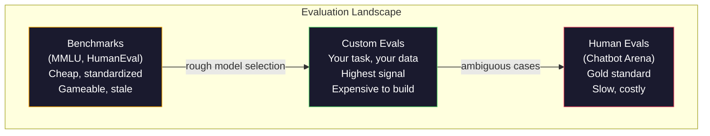
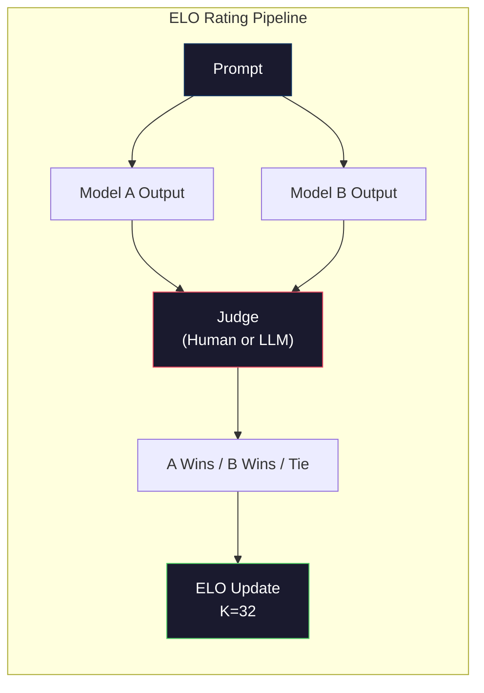

# Evaluation: Benchmarks, Evals, LM Harness

> Goodhart's Law: when a measure becomes a target, it ceases to be a good measure. The Frontier Lab benchmark game is broken. MMLU scores climb while models still fail to reliably count the number of R's in 'strawberry'. The only eval that matters is YOUR eval—on YOUR task, with YOUR data.

**Type:** Build
**Languages:** Python
**Prerequisites:** Phase 10, Lessons 01-05 (LLMs from Scratch)
**Time:** ~90 minutes

## Learning Objectives

- Build a custom evaluation harness that runs multiple-choice and open-ended benchmarks against a language model
- Explain why standard benchmarks (MMLU, HumanEval) saturate and fail to differentiate frontier models
- Implement task-specific evaluators using appropriate metrics: exact match, token F1, BLEU, and LLM-as-a-Judge
- Design a custom evaluation suite targeted to a specific use case, rather than relying solely on public leaderboards

## The Problem

MMLU was published in 2020 with 15,908 questions across 57 subjects. Within three years, frontier models saturated it. GPT-4 scored 86.4%. Claude 3 Opus scored 86.8%. Llama 3 405B scored 88.6%. The leaderboard compressed into a 3-point range where the differences are statistical noise rather than actual capability gaps.

Meanwhile, these same models fail tasks a 10-year-old can do without thinking. Claude 3.5 Sonnet, which scored 88.7% on MMLU, initially failed to count the letters in "strawberry"—a task requiring zero world knowledge and zero reasoning, just character-level iteration. HumanEval tests code generation with 164 problems. Models score over 90% on it, while simultaneously writing code that crashes on edge cases any junior engineer would catch.

The core problem of LLM evaluation is the gap between benchmark performance and real-world reliability. Benchmarks tell you how well a model takes a standardized test. They tell you almost nothing about how that model will perform on your specific task, with your specific data, against your specific failure modes. If you are building a customer support bot, MMLU is irrelevant. If you are building a coding assistant, HumanEval only covers function-level generation—it tells you nothing about debugging, refactoring, or explaining code across files.

You need custom evals. Not because benchmarks are useless—they are useful for rough model selection—but because the final evaluation must exactly match the deployment conditions.

## Concept

### The Eval Landscape

There are three categories of evaluation, each with a different cost and signal quality.

**Benchmarks** are standardized test suites. MMLU, HumanEval, SWE-bench, MATH, ARC, HellaSwag. You run the model against the benchmark and get a score. Advantage: everyone uses the same test, so you can compare models. Disadvantage: models and training data increasingly contaminate these benchmarks. Labs train on data that includes benchmark questions. The scores go up. The capabilities might not.

**Custom Evals** are test suites built for a specific use case. You define the inputs, expected outputs, and the scoring function. A legal document summarizer gets evaluated on legal documents. A SQL generator gets evaluated against your database schema. These are expensive to build, but they are the only eval that predicts production performance.

**Human Evals** use paid annotators to rate model outputs based on criteria like helpfulness, correctness, fluency, and safety. The gold standard for open-ended tasks where automated scoring fails. Chatbot Arena has collected over 2 million human preference votes across 100+ models. Disadvantage: cost ($0.10-$2.00 per rating) and speed (hours to days).



### Why Benchmarks Break

Three mechanisms cause benchmark scores to stop reflecting real-world capabilities.

**Data Contamination.** Training corpora scrape the internet. Benchmark questions live on the internet. Models see the answers during training. This isn't cheating in the traditional sense—labs try to deliberately exclude benchmark data. But web-scale scraping makes exclusion nearly impossible.

**Teaching to the Test.** Labs optimize their training mixes for benchmark performance. If 5% of the training mix is MMLU-style multiple choice, the model learns the format and the distribution of answers. MMLU is 4-way multiple choice. Models learn that the answer distribution is roughly uniform across A/B/C/D, which helps even when the model doesn't know the answer.

**Saturation.** When every frontier model hits 85-90% on a benchmark, the benchmark stops discriminating. The remaining 10-15% of questions might be ambiguous, incorrectly labeled, or require obscure domain knowledge. Improving from 87% to 89% on MMLU might mean the model memorized two more obscure questions, not that it got smarter.

### Perplexity: The Quick Sanity Check

Perplexity measures how surprised a model is by a sequence of tokens. Formally, it's the exponential of the average negative log-likelihood:

```
PPL = exp(-1/N * sum(log P(token_i | context)))
```

A perplexity of 10 means the model is, on average, as uncertain as rolling a 10-sided die at each token position. Lower is better. GPT-2 has a perplexity of ~30 on WikiText-103. GPT-3 gets ~20. Llama 3 8B gets ~7.

Perplexity is useful for comparing models on the exact same test set, but it has blind spots. A model can have low perplexity because it is good at predicting common patterns, while still being terrible at rare but important patterns. It also tells you nothing about instruction following, reasoning, or factual accuracy. Use it as a sanity check, not a final verdict.

### LLM-as-a-Judge

Use a strong model to evaluate the outputs of a weaker model. The idea is simple: ask GPT-4o or Claude Sonnet to grade responses on a 1-5 scale for correctness, helpfulness, and safety. It costs ~$0.01 per judgment with GPT-4o-mini and correlates surprisingly well with human evaluation—around 80% agreement for most tasks.

The scoring prompt matters more than the model. A vague prompt ("Grade this answer") produces noisy scores. A structured prompt with a rubric ("Score 5 if the answer is factually correct and cites a source, 4 if correct but no source, 3 if partially correct...") produces consistent, reproducible scores.

Failure modes: judge models exhibit position bias (preferring the first answer in pairwise comparisons), verbosity bias (preferring longer answers), and self-preference (GPT-4 scores GPT-4 outputs higher than equivalent Claude outputs). Mitigations: randomize order, normalize by length, use a different judge than the model being evaluated.

### ELO Ratings from Pairwise Comparisons

The Chatbot Arena approach. Show two responses to the same prompt from different models. A human (or LLM judge) picks the better one. Based on thousands of these comparisons, compute an ELO rating for each model—the same system used in chess.

ELO advantages: relative ranking is more reliable than absolute scoring, it handles ties gracefully, and it converges with fewer comparisons than scoring every output independently. In early 2026, the Chatbot Arena leaderboards show GPT-4o, Claude 3.5 Sonnet, and Gemini 1.5 Pro clustered within 20 ELO points of each other.



### Evaluation Frameworks

**lm-evaluation-harness** (EleutherAI): The open-source standard for benchmarks. Supports 200+ benchmarks. Run any Hugging Face model against MMLU, HellaSwag, ARC, etc. with a single command. Used by the Open LLM Leaderboard.

**RAGAS**: An evaluation framework specifically for RAG pipelines. Measures faithfulness (does the answer match the retrieved context?), answer relevancy (is the retrieved context relevant to the question?), and answer correctness.

**promptfoo**: Configuration-driven eval for prompt engineering. Define test cases in YAML, run them across multiple models, get a pass/fail report. Useful for prompt regression testing—ensuring a prompt change doesn't break existing test cases.

### Building Custom Evals

The only eval that matters for production. The process:

1. **Define the task.** What exactly should the model do? Be specific. "Answer questions" is too vague. "Given a customer complaint email, extract the product name, issue category, and sentiment" is a task you can evaluate.

2. **Create test cases.** Minimum 50 for a prototype eval, 200+ for production. Each test case is an (input, expected_output) pair. Include edge cases: empty input, adversarial input, ambiguous input, input in other languages.

3. **Determine scoring.** Exact match for structured outputs. BLEU/ROUGE for text similarity. LLM-as-a-judge for open-ended quality. F1 for extraction tasks. Combine multiple metrics with weights.

4. **Automate.** Every eval run operates with a single command. No manual steps. Store results in a format you can compare over time.

5. **Track over time.** An eval score is meaningless in isolation. You need a trendline. Did the score improve after your last prompt change? Did it regress after a model swap? Version your eval suite alongside your prompts.

| Eval Type | Cost per judgment | Human Agreement | Best For |
|----------|--------------------------------|----------------------|--------------|
| Exact Match | ~$0 | 100% (where applicable) | Structured output, classification |
| BLEU/ROUGE | ~$0 | ~60% | Translation, summarization |
| LLM-as-Judge | ~$0.01 | ~80% | Open-ended generation |
| Human Eval | $0.10-$2.00 | N/A (is ground truth) | High-stakes, ambiguous tasks |

## Build It

### Step 1: The Minimal Eval Framework

Define the core abstractions. An eval case has an input, an expected output, and an optional metadata dictionary. A scorer takes a prediction and a reference, and returns a score between 0 and 1.

```python
import json
from collections import Counter

class EvalCase:
    def __init__(self, input_text, expected, metadata=None):
        self.input_text = input_text
        self.expected = expected
        self.metadata = metadata or {}

class EvalSuite:
    def __init__(self, name, cases, scorers):
        self.name = name
        self.cases = cases
        self.scorers = scorers

    def run(self, model_fn):
        results = []
        for case in self.cases:
            prediction = model_fn(case.input_text)
            scores = {}
            for scorer_name, scorer_fn in self.scorers.items():
                scores[scorer_name] = scorer_fn(prediction, case.expected)
            results.append({
                "input": case.input_text,
                "expected": case.expected,
                "prediction": prediction,
                "scores": scores,
            })
        return results
```

### Step 2: Scoring Functions

Build exact match, token F1, and a simulated LLM-as-a-judge scorer.

```python
def exact_match(prediction, expected):
    return 1.0 if prediction.strip().lower() == expected.strip().lower() else 0.0

def token_f1(prediction, expected):
    pred_tokens = set(prediction.lower().split())
    exp_tokens = set(expected.lower().split())
    if not pred_tokens or not exp_tokens:
        return 0.0
    common = pred_tokens & exp_tokens
    precision = len(common) / len(pred_tokens)
    recall = len(common) / len(exp_tokens)
    if precision + recall == 0:
        return 0.0
    return 2 * (precision * recall) / (precision + recall)

def llm_judge_simulated(prediction, expected):
    pred_words = set(prediction.lower().split())
    exp_words = set(expected.lower().split())
    if not exp_words:
        return 0.0
    overlap = len(pred_words & exp_words) / len(exp_words)
    length_penalty = min(1.0, len(prediction) / max(len(expected), 1))
    return round(overlap * 0.7 + length_penalty * 0.3, 3)
```

### Step 3: ELO Rating System

Implement pairwise comparisons with ELO updates. This is exactly the system Chatbot Arena uses to rank models.

```python
class ELOTracker:
    def __init__(self, k=32, initial_rating=1500):
        self.ratings = {}
        self.k = k
        self.initial_rating = initial_rating
        self.history = []

    def _ensure_player(self, name):
        if name not in self.ratings:
            self.ratings[name] = self.initial_rating

    def expected_score(self, rating_a, rating_b):
        return 1 / (1 + 10 ** ((rating_b - rating_a) / 400))

    def record_match(self, player_a, player_b, outcome):
        self._ensure_player(player_a)
        self._ensure_player(player_b)

        ea = self.expected_score(self.ratings[player_a], self.ratings[player_b])
        eb = 1 - ea

        if outcome == "a":
            sa, sb = 1.0, 0.0
        elif outcome == "b":
            sa, sb = 0.0, 1.0
        else:
            sa, sb = 0.5, 0.5

        self.ratings[player_a] += self.k * (sa - ea)
        self.ratings[player_b] += self.k * (sb - eb)

        self.history.append({
            "a": player_a, "b": player_b,
            "outcome": outcome,
            "rating_a": round(self.ratings[player_a], 1),
            "rating_b": round(self.ratings[player_b], 1),
        })

    def leaderboard(self):
        return sorted(self.ratings.items(), key=lambda x: -x[1])
```

### Step 4: Perplexity Calculation

Calculate perplexity using token probabilities. In practice, you get these from the model's logits. Here, we simulate it with a probability distribution.

```python
import numpy as np

def perplexity(log_probs):
    if not log_probs:
        return float("inf")
    avg_neg_log_prob = -np.mean(log_probs)
    return float(np.exp(avg_neg_log_prob))

def token_log_probs_simulated(text, model_quality=0.8):
    np.random.seed(hash(text) % 2**31)
    tokens = text.split()
    log_probs = []
    for i, token in enumerate(tokens):
        base_prob = model_quality
        if len(token) > 8:
            base_prob *= 0.6
        if i == 0:
            base_prob *= 0.7
        prob = np.clip(base_prob + np.random.normal(0, 0.1), 0.01, 0.99)
        log_probs.append(float(np.log(prob)))
    return log_probs
```

### Step 5: Aggregate Results

Compute summary statistics across an eval run: mean, median, pass rate at a threshold, and breakdown by metric.

```python
def summarize_results(results, threshold=0.8):
    all_scores = {}
    for r in results:
        for metric, score in r["scores"].items():
            all_scores.setdefault(metric, []).append(score)

    summary = {}
    for metric, scores in all_scores.items():
        arr = np.array(scores)
        summary[metric] = {
            "mean": round(float(np.mean(arr)), 3),
            "median": round(float(np.median(arr)), 3),
            "std": round(float(np.std(arr)), 3),
            "min": round(float(np.min(arr)), 3),
            "max": round(float(np.max(arr)), 3),
            "pass_rate": round(float(np.mean(arr >= threshold)), 3),
            "n": len(scores),
        }
    return summary

def print_summary(summary, suite_name="Eval"):
    print(f"\n{'=' * 60}")
    print(f"  {suite_name} Summary")
    print(f"{'=' * 60}")
    for metric, stats in summary.items():
        print(f"\n  {metric}:")
        print(f"    Mean:      {stats['mean']:.3f}")
        print(f"    Median:    {stats['median']:.3f}")
        print(f"    Std:       {stats['std']:.3f}")
        print(f"    Range:     [{stats['min']:.3f}, {stats['max']:.3f}]")
        print(f"    Pass rate: {stats['pass_rate']:.1%} (threshold >= 0.8)")
        print(f"    N:         {stats['n']}")
```

### Step 6: Run the Full Pipeline

Wire it together. Define a task, create test cases, simulate two models, run the evals, compute ELO from pairwise comparisons, and print the leaderboard.

```python
def demo_model_good(prompt):
    responses = {
        "What is the capital of France?": "Paris",
        "What is 2 + 2?": "4",
        "Who wrote Hamlet?": "William Shakespeare",
        "What language is PyTorch written in?": "Python and C++",
        "What is the boiling point of water?": "100 degrees Celsius",
    }
    return responses.get(prompt, "I don't know")

def demo_model_bad(prompt):
    responses = {
        "What is the capital of France?": "Paris is the capital city of France",
        "What is 2 + 2?": "The answer is four",
        "Who wrote Hamlet?": "Shakespeare",
        "What language is PyTorch written in?": "Python",
        "What is the boiling point of water?": "212 Fahrenheit",
    }
    return responses.get(prompt, "Unknown")

cases = [
    EvalCase("What is the capital of France?", "Paris"),
    EvalCase("What is 2 + 2?", "4"),
    EvalCase("Who wrote Hamlet?", "William Shakespeare"),
    EvalCase("What language is PyTorch written in?", "Python and C++"),
    EvalCase("What is the boiling point of water?", "100 degrees Celsius"),
]

suite = EvalSuite(
    name="General Knowledge",
    cases=cases,
    scorers={
        "exact_match": exact_match,
        "token_f1": token_f1,
        "llm_judge": llm_judge_simulated,
    },
)

results_good = suite.run(demo_model_good)
results_bad = suite.run(demo_model_bad)

print_summary(summarize_results(results_good), "Model A (concise)")
print_summary(summarize_results(results_bad), "Model B (verbose)")
```

The "good" model gives exact answers. The "bad" model gives verbose paraphrases. The exact match metric heavily penalizes the verbose model. Token F1 and LLM-as-a-judge are more forgiving. This shows why metric choice matters: the same model looks great or terrible depending on how you score it.

### Step 7: The ELO Tournament

Run pairwise comparisons between the models over multiple rounds.

```python
elo = ELOTracker(k=32)

for case in cases:
    pred_a = demo_model_good(case.input_text)
    pred_b = demo_model_bad(case.input_text)

    score_a = token_f1(pred_a, case.expected)
    score_b = token_f1(pred_b, case.expected)

    if score_a > score_b:
        outcome = "a"
    elif score_b > score_a:
        outcome = "b"
    else:
        outcome = "tie"

    elo.record_match("model_a_concise", "model_b_verbose", outcome)

print("\nELO Leaderboard:")
for name, rating in elo.leaderboard():
    print(f"  {name}: {rating:.0f}")
```

### Step 8: Perplexity Comparison

Compare perplexity across "models" of different quality levels.

```python
test_text = "The quick brown fox jumps over the lazy dog in the garden"

for quality, label in [(0.9, "Strong model"), (0.7, "Medium model"), (0.4, "Weak model")]:
    log_probs = token_log_probs_simulated(test_text, model_quality=quality)
    ppl = perplexity(log_probs)
    print(f"  {label} (quality={quality}): perplexity = {ppl:.2f}")
```

## Use It

### lm-evaluation-harness (EleutherAI)

The standard tool for running benchmarks on any model.

```python
# pip install lm-eval
# Command line:
# lm_eval --model hf --model_args pretrained=meta-llama/Llama-3.1-8B --tasks mmlu --batch_size 8

# Python API:
# import lm_eval
# results = lm_eval.simple_evaluate(
#     model="hf",
#     model_args="pretrained=meta-llama/Llama-3.1-8B",
#     tasks=["mmlu", "hellaswag", "arc_easy"],
#     batch_size=8,
# )
# print(results["results"])
```

### promptfoo

Configuration-driven eval for prompt engineering. Define tests in YAML and run across multiple providers.

```yaml
# promptfoo.yaml
providers:
  - openai:gpt-4o-mini
  - anthropic:claude-3-haiku

prompts:
  - "Answer in one word: {{question}}"

tests:
  - vars:
    question: "What is the capital of France?"
    assert:
      - type: contains
        value: "Paris"
  - vars:
    question: "What is 2 + 2?"
    assert:
      - type: equals
        value: "4"
```

### RAGAS for RAG Evaluation

```python
# pip install ragas
# from ragas import evaluate
# from ragas.metrics import faithfulness, answer_relevancy, context_precision
#
# result = evaluate(
#     dataset,
#     metrics=[faithfulness, answer_relevancy, context_precision],
# )
# print(result)
```

RAGAS measures what generic evals miss: is the model's answer grounded in the retrieved context, not just whether the answer is "correct" in the abstract.

## Ship It

This lesson outputs `outputs/prompt-eval-designer.md` - a reusable prompt that designs custom evaluation suites for any task. Feed it a task description, and it generates test cases, scoring functions, and a pass/fail threshold recommendation.

It also produces `outputs/skill-llm-evaluation.md` - a decision framework for choosing the right evaluation strategy based on the task type, budget, and latency requirements.

## Exercises

1. Add a "consistency" scorer that runs the same input through the model 5 times and measures how often the outputs agree. Inconsistent answers to deterministic inputs reveal fragile prompts or high temperature settings.

2. Extend the ELO tracker to support multiple judging functions (exact match, F1, LLM-as-judge) and weight them. Compare how the leaderboard shifts when you heavily weight exact match vs heavily weight F1.

3. Build a task-specific evaluation suite: classifying emails into 5 categories. Create 100 test cases with diverse examples, including edge cases (emails that could belong to multiple categories, empty emails, emails in other languages). Measure the performance of different "models" (rule-based, keyword matching, simulated LLM).

4. Implement contamination detection: given a set of evaluation questions and a training corpus, check what percentage of the eval questions (or close paraphrases) appear in the training data. This is how researchers check the validity of benchmarks.

5. Build a model comparison tool. Given the eval results for two versions of a model, highlight which specific test cases improved, which regressed, and which stayed the same. This is the equivalent of a code diff—essential for understanding if a change actually helped or hurt.

## Key Terms

| Term | What People Say | What It Actually Means |
|------|----------------|----------------------|
| MMLU | "The benchmark" | Massive Multitask Language Understanding - 15,908 multiple choice questions across 57 subjects, saturated at 88%+ by 2025 |
| HumanEval | "The coding eval" | 164 Python function completion problems from OpenAI, only tests isolated function generation |
| SWE-bench | "Real coding eval" | 2,294 GitHub issues from 12 Python repos, measures end-to-end bug fixing including test generation |
| Perplexity | "How confused the model is" | exp(-avg(log P(token_i given context))) -- lower means the model assigns higher probability to the actual tokens |
| ELO Rating | "Chess ranking for models" | A relative skill rating calculated from pairwise win/loss records, used by Chatbot Arena to rank 100+ models |
| LLM-as-a-Judge | "Using AI to grade AI" | A strong model evaluates a weaker model's outputs against a rubric, ~80% agreement with human judges, ~$0.01/judgment |
| Data Contamination | "The model saw the test" | Training data includes benchmark questions, artificially inflating scores without improving real capabilities |
| Eval Suite | "A bunch of tests" | A versioned collection of (input, expected_output, scoring) triples that measures a specific capability |
| Pass Rate | "What percent it got right" | The fraction of eval cases that scored above a threshold - more actionable than an average score because it measures reliability |
| Chatbot Arena | "The model ranking site" | An LMSYS platform with 2M+ human preference votes, producing the most trusted real-world LLM leaderboard via ELO ratings |

## Further Reading

- [Hendrycks et al., 2021 - "Measuring Massive Multitask Language Understanding"](https://arxiv.org/abs/2009.03300) - The MMLU paper, still the most cited LLM benchmark despite its saturation
- [Chen et al., 2021 - "Evaluating Large Language Models Trained on Code"](https://arxiv.org/abs/2107.03374) - The HumanEval paper from OpenAI, establishing the standard methodology for evaluating code generation
- [Zheng et al., 2023 - "Judging LLM-as-a-Judge"](https://arxiv.org/abs/2306.05685) - A systematic analysis of using LLMs to evaluate LLMs, including findings on position bias and verbosity bias
- [LMSYS Chatbot Arena](https://chat.lmsys.org/) - The crowdsourced model comparison platform, with 2M+ votes, the most trusted real-world ranking of LLMs
