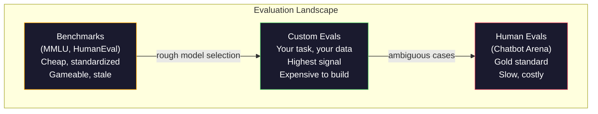
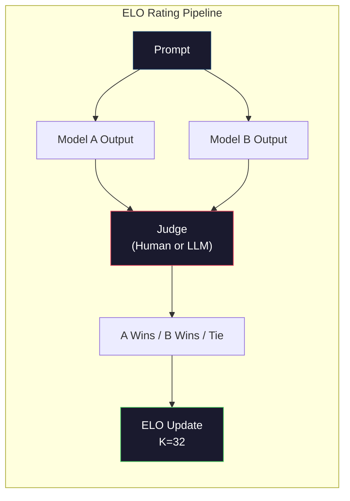

# Ocena: testy porównawcze, oceny, uprząż LM

> Prawo Goodharta: kiedy środek staje się celem, przestaje być dobrym środkiem. Testy porównawcze wszystkich gier Frontier Lab. Wyniki MMLU rosną, podczas gdy modele nadal nie są w stanie wiarygodnie policzyć liczby R w „truskawce”. Jedyna ewaluacja, która się liczy, to TWOJA ewaluacja – dotycząca TWOJEGO zadania i TWOICH danych.

**Typ:** Kompilacja
**Języki:** Python
**Wymagania wstępne:** Faza 10, lekcje 01-05 (LLM od podstaw)
**Czas:** ~90 minut

## Cele nauczania

- Zbuduj niestandardową wiązkę ewaluacyjną, która przeprowadza testy wielokrotnego wyboru i otwarte testy porównawcze z modelem językowym
- Wyjaśnij, dlaczego standardowe testy porównawcze (MMLU, HumanEval) nasycają i nie różnicują modeli granicznych
- Wdrażaj oceny specyficzne dla zadania z odpowiednimi wskaźnikami: dokładne dopasowanie, punktacja F1, BLEU i LLM-jako sędzia
- Zaprojektuj niestandardowy zestaw ocen ukierunkowany na konkretny przypadek użycia, zamiast polegać wyłącznie na publicznych rankingach

## Problem

MMLU zostało opublikowane w 2020 r. i zawierało 15 908 pytań z 57 tematów. W ciągu trzech lat modele graniczne go nasyciły. GPT-4 uzyskał 86,4%. Claude 3 Opus uzyskał 86,8%. Lama 3 405B uzyskała 88,6%. Tabela liderów skompresowana do 3-punktowego zakresu, w którym różnice wynikają z szumu statystycznego, a nie rzeczywistych luk w możliwościach.

Tymczasem te same modele nie radzą sobie z zadaniami, z którymi 10-latek radzi sobie bez zastanowienia. Claude 3.5 Sonnet, który uzyskał 88,7% w MMLU, początkowo nie potrafił policzyć liter w wyrazie „truskawka” – zadanie wymagające zerowej wiedzy o świecie i zerowego rozumowania, a jedynie iteracji na poziomie postaci. HumanEval testuje generowanie kodu ze 164 problemami. Modele uzyskują w tym zakresie ponad 90% wyników, jednocześnie tworząc kod, który ulega awarii w przypadkach brzegowych, które mógłby złapać każdy młodszy programista.

Głównym problemem oceny LLM jest różnica między wydajnością wzorcową a niezawodnością w świecie rzeczywistym. Benchmarki pokazują, jak model radzi sobie w teście porównawczym. Nie mówią prawie nic o tym, jak ten model będzie działał w przypadku konkretnego zadania, na podstawie konkretnych danych i w ramach określonych trybów awarii. Jeśli budujesz bota obsługi klienta, MMLU jest nieistotne. Jeśli tworzysz asystenta kodu, HumanEval obejmuje jedynie generowanie na poziomie funkcji — nie mówi nic o debugowaniu, refaktoryzacji czy wyjaśnianiu kodu w plikach.

Potrzebujesz niestandardowych ewaluacji. Nie dlatego, że testy porównawcze są bezużyteczne — są przydatne do przybliżonego wyboru modelu — ale dlatego, że ostateczna ocena musi dokładnie odpowiadać warunkom wdrożenia.

## Koncepcja

### Krajobraz Ewalu

Istnieją trzy kategorie oceny, każda charakteryzująca się innym kosztem i jakością sygnału.

**Benchmarki** to ustandaryzowane zestawy testów. MMLU, HumanEval, ławka SWE, MATH, ARC, HellaSwag. Porównujesz model z benchmarkiem i otrzymujesz wynik. Zaleta: wszyscy korzystają z tego samego testu, dzięki czemu można porównywać modele. Wada: modele i dane szkoleniowe w coraz większym stopniu zanieczyszczają te benchmarki. Laboratoria szkolą się na danych zawierających pytania porównawcze. Wyniki idą w górę. Możliwości mogą nie.

**Ewaluacje niestandardowe** to zestawy testów tworzone dla konkretnego przypadku użycia. Definiujesz dane wejściowe, oczekiwane wyniki i funkcję punktacji. Podsumowanie dokumentów prawnych jest oceniane na podstawie dokumentów prawnych. Generator SQL jest oceniany w schemacie bazy danych. Są one drogie w przygotowaniu, ale stanowią jedyną ocenę, która pozwala przewidzieć wydajność produkcji.

**Oceny ludzkie** wykorzystują płatnych adnotatorów do oceny wyników modelu na podstawie kryteriów takich jak przydatność, poprawność, płynność i bezpieczeństwo. Złoty standard dla zadań otwartych, w których zawodzi automatyczna punktacja. Chatbot Arena zebrała ponad 2 miliony głosów dotyczących preferencji ludzkich w ponad 100 modelach. Wadą: koszt ($0.10-$2,00 za ocenę) i szybkość (od godzin do dni).



### Dlaczego testy porównawcze się psują

Trzy mechanizmy powodują, że wyniki testów porównawczych przestają odzwierciedlać rzeczywiste możliwości.

**Zanieczyszczenie danych.** Korpusy szkoleniowe przeszukują Internet. Pytania testowe na żywo w Internecie. Modele widzą odpowiedzi podczas treningu. Nie jest to oszustwo w tradycyjnym znaczeniu – laboratoria celowo nie uwzględniają danych porównawczych. Jednak skrobanie na skalę internetową sprawia, że ​​wykluczenie jest prawie niemożliwe.

**Nauczanie do testu.** Laboratoria optymalizują mieszanki treningowe pod kątem wzorcowej wydajności. Jeśli 5% miksu szkoleniowego to wielokrotny wybór w stylu MMLU, model uczy się formatu i rozkładu odpowiedzi. MMLU to 4-kierunkowy wybór wielokrotnego wyboru. Modele uczą się, że rozkład odpowiedzi jest w przybliżeniu jednolity w obszarach A/B/C/D, co pomaga nawet wtedy, gdy model nie zna odpowiedzi.

**Nasycenie.** Kiedy każdy model pionierski osiąga 85–90% w teście porównawczym, przestaje on dyskryminować. Pozostałe 10-15% pytań może być niejednoznacznych, błędnie oznakowanych lub wymagać niejasnej wiedzy dziedzinowej. Poprawa MMLU z 87% do 89% może oznaczać, że model zapamiętał dwa bardziej niejasne pytania, a nie, że stał się mądrzejszy.

### Zakłopotanie: szybka kontrola stanu

Zakłopotanie mierzy stopień zaskoczenia modelu sekwencją żetonów. Formalnie jest to wykładniczy średni ujemny logarytm wiarygodności:

```
PPL = exp(-1/N * sum(log P(token_i | context)))
```

Zakłopotanie wynoszące 10 oznacza, że model jest średnio tak niepewny, jak równomierny wybór spośród 10 opcji na każdej pozycji tokena. Niżej jest lepiej. GPT-2 jest zakłopotany na poziomie ~30 na WikiText-103. GPT-3 dostaje ~20. Lama 3 8B dostaje ~7.

Zagubienie jest przydatne przy porównywaniu modeli na tym samym zestawie testowym, ale ma słabe punkty. Model może cechować się niskim poziomem zakłopotania, ponieważ jest dobry w przewidywaniu typowych wzorców, a jednocześnie fatalny w przypadku rzadkich, ale ważnych wzorców. Nie mówi też nic o przestrzeganiu instrukcji, rozumowaniu czy dokładności opartej na faktach. Użyj go jako kontroli zdrowego rozsądku, a nie ostatecznego werdyktu.

### LLM-jako sędzia

Użyj silnego modelu, aby ocenić wyniki słabszego modelu. Pomysł jest prosty: poproś GPT-4o lub Claude'a Sonneta o ocenę odpowiedzi w skali 1-5 pod kątem poprawności, przydatności i bezpieczeństwa. Kosztuje to około 0,01 dolara za ocenę w przypadku GPT-4o-mini i zaskakująco dobrze koreluje z oceną dokonywaną przez ludzi — około 80% zgodności w przypadku większości zadań.

Podpowiedź punktacji ma większe znaczenie niż model. Niejasny monit („Oceń tę odpowiedź”) daje zaszumione wyniki. Ustrukturyzowany monit z rubryką („Oceń 5, jeśli odpowiedź jest poprawna pod względem faktycznym i cytuje źródło, 4, jeśli jest poprawna, ale bez źródła, 3, jeśli częściowo poprawna…”) daje spójne, powtarzalne wyniki.

Tryby niepowodzeń: modele oceniające wykazują błąd pozycyjny (preferują pierwszą odpowiedź w porównaniach parami), błąd gadatliwości (preferują dłuższe odpowiedzi) i preferencje własne (GPT-4 ocenia wyniki GPT-4 wyższe niż równoważne wyniki Claude). Środki zaradcze: losuj kolejność, normalizuj pod względem długości, użyj innego sędziego niż oceniany model.

### Oceny ELO na podstawie porównań parami

Podejście Chatbot Arena. Pokaż dwie odpowiedzi na ten sam monit z różnych modeli. Człowiek (lub sędzia LLM) wybiera lepszy. Na podstawie tysięcy tych porównań oblicz ranking ELO dla każdego modelu – tego samego systemu, który jest używany w szachach.

Zalety ELO: ranking względny jest bardziej niezawodny niż punktacja bezwzględna, sprawnie radzi sobie z remisami i zapewnia zbieżność przy mniejszej liczbie porównań niż punktowanie każdego wyniku niezależnie. Na początku 2026 r. rankingi Chatbot Arena pokazują GPT-4o, Claude 3.5 Sonnet i Gemini 1.5 Pro na szczycie w odległości 20 punktów ELO od siebie.



### Struktury ewaluacyjne

**lm-evaluation-harness** (EleutherAI): standardowa platforma ewaluacyjna o otwartym kodzie źródłowym. Obsługuje ponad 200 testów porównawczych. Uruchom dowolny model Hugging Face przeciwko MMLU, HellaSwag, ARC itp. za pomocą jednego polecenia. Używany przez tabelę liderów Open LLM.

**RAGAS**: ramy oceny specjalnie dla rurociągów RAG. Mierzy wierność (czy odpowiedź pasuje do odzyskanego kontekstu?), trafność (czy uzyskany kontekst jest istotny dla pytania?) i poprawność odpowiedzi.

**promptfoo**: ewaluacja oparta na konfiguracji zapewniająca szybką inżynierię. Zdefiniuj przypadki testowe w YAML, uruchamiaj je na wielu modelach, uzyskaj raport pozytywny/negatywny. Przydatne w przypadku monitów o testowanie regresyjne — upewnij się, że szybka zmiana nie psuje istniejących przypadków testowych.

### Tworzenie niestandardowych ocen

Jedyna ewaluacja, która ma znaczenie dla produkcji. Proces:

1. **Określ zadanie.** Co dokładnie powinien robić model? Dokładnie. „Odpowiedz na pytania” jest zbyt niejasne. „Biorąc pod uwagę wiadomość e-mail ze skargą klienta, wyodrębnij nazwę produktu, kategorię problemu i opinię” to zadanie, które możesz ocenić.

2. **Tworzenie przypadków testowych.** Minimum 50 do oceny prototypu, ponad 200 do produkcji. Każdy przypadek testowy to para (wejście, oczekiwane_wyjście). Uwzględnij przypadki brzegowe: puste dane wejściowe, dane wejściowe kontradyktoryjne, dane niejednoznaczne, dane wejściowe w innych językach.

3. **Określ punktację.** Dokładne dopasowanie wyników ustrukturyzowanych. BLEU/ROUGE dla podobieństwa tekstu. LLM-jako sędzia ds. jakości otwartej. F1 do zadań ekstrakcji. Połącz wiele metryk z wagami.

4. **Automatyzacja.** Każda ewaluacja działa z jednym poleceniem. Żadnych ręcznych kroków. Przechowuj wyniki w formacie umożliwiającym porównywanie w czasie.

5. **Śledzenie w czasie.** Wynik ewaluacyjny jest bez znaczenia sam w sobie. Potrzebujesz linii trendu. Czy wynik poprawił się po ostatniej zmianie podpowiedzi? Czy ustąpiło po zmianie modelu? Wprowadź wersję eval wraz z podpowiedziami.

| Typ oceny | Koszt wyroku | Umowa z ludźmi | Najlepsze dla |
|----------|--------------------------------|----------------------|--------------|
| Dokładne dopasowanie | ~0 $ | 100% (w stosownych przypadkach) | Dane wyjściowe strukturyzowane, klasyfikacja |
| NIEBIESKI/ROUGE | ~0 $ | ~60% | Tłumaczenie, streszczenie |
| LLM jako sędzia | ~0,01 USD | ~80% | Generacja otwarta |
| Ocena człowieka | $0.10-$2,00 | N/A (jest podstawową prawdą) | Niejednoznaczne zadania o wysokiej stawce |

## Zbuduj to

### Krok 1: Minimalna struktura ewaluacyjna

Zdefiniuj podstawowe abstrakcje. Przypadek eval ma dane wejściowe, oczekiwany wynik i opcjonalny słownik metadanych. Osoba zapisująca bierze przewidywanie i odniesienie i zwraca wynik w przedziale od 0 do 1.

```python
import json
from collections import Counter

class EvalCase:
    def __init__(self, input_text, expected, metadata=None):
        self.input_text = input_text
        self.expected = expected
        self.metadata = metadata or {}

class EvalSuite:
    def __init__(self, name, cases, scorers):
        self.name = name
        self.cases = cases
        self.scorers = scorers

    def run(self, model_fn):
        results = []
        for case in self.cases:
            prediction = model_fn(case.input_text)
            scores = {}
            for scorer_name, scorer_fn in self.scorers.items():
                scores[scorer_name] = scorer_fn(prediction, case.expected)
            results.append({
                "input": case.input_text,
                "expected": case.expected,
                "prediction": prediction,
                "scores": scores,
            })
        return results
```

### Krok 2: Funkcje punktacji

Zbuduj dokładny mecz, token F1 i symulowanego strzelca LLM jako sędziego.

```python
def exact_match(prediction, expected):
    return 1.0 if prediction.strip().lower() == expected.strip().lower() else 0.0

def token_f1(prediction, expected):
    pred_tokens = set(prediction.lower().split())
    exp_tokens = set(expected.lower().split())
    if not pred_tokens or not exp_tokens:
        return 0.0
    common = pred_tokens & exp_tokens
    precision = len(common) / len(pred_tokens)
    recall = len(common) / len(exp_tokens)
    if precision + recall == 0:
        return 0.0
    return 2 * (precision * recall) / (precision + recall)

def llm_judge_simulated(prediction, expected):
    pred_words = set(prediction.lower().split())
    exp_words = set(expected.lower().split())
    if not exp_words:
        return 0.0
    overlap = len(pred_words & exp_words) / len(exp_words)
    length_penalty = min(1.0, len(prediction) / max(len(expected), 1))
    return round(overlap * 0.7 + length_penalty * 0.3, 3)
```

### Krok 3: System ocen ELO

Implementuj porównania parami z aktualizacjami ELO. To jest dokładnie system, którego Chatbot Arena używa do oceniania modeli.

```python
class ELOTracker:
    def __init__(self, k=32, initial_rating=1500):
        self.ratings = {}
        self.k = k
        self.initial_rating = initial_rating
        self.history = []

    def _ensure_player(self, name):
        if name not in self.ratings:
            self.ratings[name] = self.initial_rating

    def expected_score(self, rating_a, rating_b):
        return 1 / (1 + 10 ** ((rating_b - rating_a) / 400))

    def record_match(self, player_a, player_b, outcome):
        self._ensure_player(player_a)
        self._ensure_player(player_b)

        ea = self.expected_score(self.ratings[player_a], self.ratings[player_b])
        eb = 1 - ea

        if outcome == "a":
            sa, sb = 1.0, 0.0
        elif outcome == "b":
            sa, sb = 0.0, 1.0
        else:
            sa, sb = 0.5, 0.5

        self.ratings[player_a] += self.k * (sa - ea)
        self.ratings[player_b] += self.k * (sb - eb)

        self.history.append({
            "a": player_a, "b": player_b,
            "outcome": outcome,
            "rating_a": round(self.ratings[player_a], 1),
            "rating_b": round(self.ratings[player_b], 1),
        })

    def leaderboard(self):
        return sorted(self.ratings.items(), key=lambda x: -x[1])
```

### Krok 4: Obliczanie zakłopotania

Oblicz zakłopotanie, korzystając z prawdopodobieństw symbolicznych. W praktyce można je uzyskać z logitów modelu. Tutaj przeprowadzamy symulację z rozkładem prawdopodobieństwa.

```python
import numpy as np

def perplexity(log_probs):
    if not log_probs:
        return float("inf")
    avg_neg_log_prob = -np.mean(log_probs)
    return float(np.exp(avg_neg_log_prob))

def token_log_probs_simulated(text, model_quality=0.8):
    np.random.seed(hash(text) % 2**31)
    tokens = text.split()
    log_probs = []
    for i, token in enumerate(tokens):
        base_prob = model_quality
        if len(token) > 8:
            base_prob *= 0.6
        if i == 0:
            base_prob *= 0.7
        prob = np.clip(base_prob + np.random.normal(0, 0.1), 0.01, 0.99)
        log_probs.append(float(np.log(prob)))
    return log_probs
```

### Krok 5: Wyniki zbiorcze

Oblicz statystyki podsumowujące w przebiegu ewaluacyjnym: średnią, medianę, współczynnik zdawalności na poziomie progowym i podział na metryki.

```python
def summarize_results(results, threshold=0.8):
    all_scores = {}
    for r in results:
        for metric, score in r["scores"].items():
            all_scores.setdefault(metric, []).append(score)

    summary = {}
    for metric, scores in all_scores.items():
        arr = np.array(scores)
        summary[metric] = {
            "mean": round(float(np.mean(arr)), 3),
            "median": round(float(np.median(arr)), 3),
            "std": round(float(np.std(arr)), 3),
            "min": round(float(np.min(arr)), 3),
            "max": round(float(np.max(arr)), 3),
            "pass_rate": round(float(np.mean(arr >= threshold)), 3),
            "n": len(scores),
        }
    return summary

def print_summary(summary, suite_name="Eval"):
    print(f"\n{'=' * 60}")
    print(f"  {suite_name} Summary")
    print(f"{'=' * 60}")
    for metric, stats in summary.items():
        print(f"\n  {metric}:")
        print(f"    Mean:      {stats['mean']:.3f}")
        print(f"    Median:    {stats['median']:.3f}")
        print(f"    Std:       {stats['std']:.3f}")
        print(f"    Range:     [{stats['min']:.3f}, {stats['max']:.3f}]")
        print(f"    Pass rate: {stats['pass_rate']:.1%} (threshold >= 0.8)")
        print(f"    N:         {stats['n']}")
```

### Krok 6: Uruchom pełny potok

Połącz wszystko razem. Zdefiniuj zadanie, utwórz przypadki testowe, symuluj dwa modele, przeprowadzaj ewaluacje, obliczaj ELO na podstawie porównań parami i wydrukuj tabelę wyników.

```python
def demo_model_good(prompt):
    responses = {
        "What is the capital of France?": "Paris",
        "What is 2 + 2?": "4",
        "Who wrote Hamlet?": "William Shakespeare",
        "What language is PyTorch written in?": "Python and C++",
        "What is the boiling point of water?": "100 degrees Celsius",
    }
    return responses.get(prompt, "I don't know")

def demo_model_bad(prompt):
    responses = {
        "What is the capital of France?": "Paris is the capital city of France",
        "What is 2 + 2?": "The answer is four",
        "Who wrote Hamlet?": "Shakespeare",
        "What language is PyTorch written in?": "Python",
        "What is the boiling point of water?": "212 Fahrenheit",
    }
    return responses.get(prompt, "Unknown")

cases = [
    EvalCase("What is the capital of France?", "Paris"),
    EvalCase("What is 2 + 2?", "4"),
    EvalCase("Who wrote Hamlet?", "William Shakespeare"),
    EvalCase("What language is PyTorch written in?", "Python and C++"),
    EvalCase("What is the boiling point of water?", "100 degrees Celsius"),
]

suite = EvalSuite(
    name="General Knowledge",
    cases=cases,
    scorers={
        "exact_match": exact_match,
        "token_f1": token_f1,
        "llm_judge": llm_judge_simulated,
    },
)

results_good = suite.run(demo_model_good)
results_bad = suite.run(demo_model_bad)

print_summary(summarize_results(results_good), "Model A (concise)")
print_summary(summarize_results(results_bad), "Model B (verbose)")
```

„Dobry” model daje dokładne odpowiedzi. „Zły” model podaje pełne parafrazy. Dokładne dopasowanie surowo karze szczegółowy model. Token F1 i LLM-as-sędzia są bardziej wyrozumiałe. To pokazuje, dlaczego wybór metryki ma znaczenie: ten sam model wygląda świetnie lub okropnie, w zależności od tego, jak go ocenisz.

### Krok 7: Turniej ELO

Przeprowadzaj porównania parami pomiędzy modelami w wielu rundach.

```python
elo = ELOTracker(k=32)

for case in cases:
    pred_a = demo_model_good(case.input_text)
    pred_b = demo_model_bad(case.input_text)

    score_a = token_f1(pred_a, case.expected)
    score_b = token_f1(pred_b, case.expected)

    if score_a > score_b:
        outcome = "a"
    elif score_b > score_a:
        outcome = "b"
    else:
        outcome = "tie"

    elo.record_match("model_a_concise", "model_b_verbose", outcome)

print("\nELO Leaderboard:")
for name, rating in elo.leaderboard():
    print(f"  {name}: {rating:.0f}")
```

### Krok 8: Porównanie zakłopotania

Porównaj zakłopotanie w „modelach” o różnych poziomach jakości.

```python
test_text = "The quick brown fox jumps over the lazy dog in the garden"

for quality, label in [(0.9, "Strong model"), (0.7, "Medium model"), (0.4, "Weak model")]:
    log_probs = token_log_probs_simulated(test_text, model_quality=quality)
    ppl = perplexity(log_probs)
    print(f"  {label} (quality={quality}): perplexity = {ppl:.2f}")
```

## Użyj tego

### Uprząż-ewaluacyjna lm (EleutherAI)

Standardowe narzędzie do przeprowadzania testów porównawczych na dowolnym modelu.

```python
# pip install lm-eval
# Command line:
# lm_eval --model hf --model_args pretrained=meta-llama/Llama-3.1-8B --tasks mmlu --batch_size 8

# Python API:
# import lm_eval
# results = lm_eval.simple_evaluate(
#     model="hf",
#     model_args="pretrained=meta-llama/Llama-3.1-8B",
#     tasks=["mmlu", "hellaswag", "arc_easy"],
#     batch_size=8,
# )
# print(results["results"])
```

### monit

Ocena oparta na konfiguracji zapewniająca szybką inżynierię. Zdefiniuj testy w YAML i uruchamiaj je dla wielu dostawców.

```yaml
# promptfoo.yaml
providers:
  - openai:gpt-4o-mini
  - anthropic:claude-3-haiku

prompts:
  - "Answer in one word: {{question}}"

tests:
  - vars:
      question: "What is the capital of France?"
    assert:
      - type: contains
        value: "Paris"
  - vars:
      question: "What is 2 + 2?"
    assert:
      - type: equals
        value: "4"
```

### RAGAS do oceny RAG

```python
# pip install ragas
# from ragas import evaluate
# from ragas.metrics import faithfulness, answer_relevancy, context_precision
#
# result = evaluate(
#     dataset,
#     metrics=[faithfulness, answer_relevancy, context_precision],
# )
# print(result)
```

RAGAS mierzy, czego brakuje w ogólnych ewaluacjach: czy odpowiedź modelu jest osadzona w odzyskanym kontekście, a nie tylko czy odpowiedź jest „poprawna” w skrócie.

## Wyślij to

W ramach tej lekcji powstał `outputs/prompt-eval-designer.md` — monit wielokrotnego użytku, który projektuje niestandardowe zestawy ewaluacyjne dla dowolnego zadania. Dodaj opis zadania, a wygeneruje przypadki testowe, funkcje oceniające i zalecenie dotyczące progu pozytywnego/niepomyślnego.

Tworzy także `outputs/skill-llm-evaluation.md` — ramy decyzyjne umożliwiające wybór właściwej strategii oceny w oparciu o rodzaj zadania, budżet i wymagania dotyczące opóźnień.

## Ćwiczenia

1. Dodaj punktator „spójności”, który przeprowadza te same dane wejściowe przez model 5 razy i mierzy, jak często wyniki się zgadzają. Niespójne odpowiedzi na deterministyczne dane wejściowe ujawniają delikatne podpowiedzi lub wysokie ustawienia temperatury.

2. Rozszerz moduł śledzący ELO, aby obsługiwał wiele funkcji sędziowskich (dokładny mecz, F1, LLM-jako sędzia) i waż je. Porównaj, jak zmienia się tabela liderów, gdy mocno ważysz dokładne dopasowanie, w porównaniu z dużą ilością F1.

3. Zbuduj pakiet ewaluacyjny do konkretnego zadania: klasyfikacja wiadomości e-mail na 5 kategorii. Utwórz 100 przypadków testowych z różnorodnymi przykładami, w tym przypadki brzegowe (e-maile, które mogą należeć do wielu kategorii, puste e-maile, e-maile w innych językach). Zmierz skuteczność różnych „modeli” (opartych na regułach, dopasowywaniu słów kluczowych, symulowanym LLM).

4. Zastosuj wykrywanie zanieczyszczeń: mając zestaw pytań ewaluacyjnych i korpus szkoleniowy, sprawdź, jaki procent pytań ewaluacyjnych (lub parafraz zamkniętych) pojawia się w danych szkoleniowych. W ten sposób badacze sprawdzają ważność benchmarków.

5. Zbuduj narzędzie do porównywania modeli. Biorąc pod uwagę wyniki ewaluacji dwóch wersji modelu, podkreśl, które konkretne przypadki testowe uległy poprawie, które uległy regresji, a które pozostały takie same. Jest to odpowiednik różnicy w kodzie — niezbędny do zrozumienia, czy zmiana pomogła, czy zaszkodziła.

## Kluczowe terminy

| Termin | Co ludzie mówią | Co to właściwie oznacza |
|------|----------------|----------------------|
| MMLU | „Wzorzec” | Ogromne wielozadaniowe zrozumienie języka — 15 908 pytań wielokrotnego wyboru z 57 przedmiotów, nasycenie powyżej 88% do 2025 r. |
| HumanEval | „Ewaluacja kodu” | 164 Problemy z uzupełnianiem funkcji Pythona z OpenAI, testuje tylko generowanie izolowanych funkcji |
| Ławka SWE | „Prawdziwa ocena kodowania” | 2294 problemów z GitHubem z 12 repozytoriów Pythona, pomiary kompleksowego naprawiania błędów, łącznie z generowaniem testów |
| Zakłopotanie | „Jak zdezorientowany jest model” | exp(-avg(log P(token_i podany kontekst))) -- less oznacza, że ​​model przypisuje większe prawdopodobieństwo rzeczywistym tokenom |
| Ocena ELO | „Ranking szachowy dla modeli” | Względna ocena umiejętności obliczona na podstawie rekordów wygranych/przegranych parami, wykorzystana przez Chatbot Arena do uszeregowania ponad 100 modeli |
| LLM jako sędzia | „Wykorzystywanie sztucznej inteligencji do oceniania sztucznej inteligencji” | Silny model ocenia wyniki słabszego modelu w rubryce, ~80% zgodności z sędziami-ludźmi, na poziomie ~0,01 USD/orzeczenie |
| Zanieczyszczenie danych | „Modelka zdała egzamin” | Dane szkoleniowe obejmują pytania porównawcze, zawyżające wyniki bez poprawy rzeczywistych możliwości |
| Apartament ewaluacyjny | „Kilka testów” | Wersjonowany zbiór trójek (wejściowych, oczekiwanych_wyjściowych, punktacji) mierzących określoną zdolność |
| Zdawalność | „Jaki procent ma rację” | Część przypadków eval, które uzyskały wynik powyżej progu – bardziej praktyczny niż średni wynik, ponieważ mierzy niezawodność |
| Arena Chatbotów | „Witryna z rankingiem modeli” | Platforma LMSYS z ponad 2 milionami głosów preferencji ludzkich, tworząca najbardziej zaufaną tabelę liderów LLM według ocen ELO |

## Dalsze czytanie

– [Hendrycks i in., 2021 – „Measuring Massive Multitask Language Understanding”](https://arxiv.org/abs/2009.03300) – artykuł MMLU, pomimo jego nasycenia, wciąż najczęściej cytowanym punktem odniesienia w LLM
– [Chen i in., 2021 – „Evaluating Large Language Models Trained on Code”](https://arxiv.org/abs/2107.03374) – artykuł HumanEval z OpenAI, dotyczący ustalonej metodologii oceny generowania kodu
– [Zheng i in., 2023 – „Judging LLM-as-a-Judge”](https://arxiv.org/abs/2306.05685) – systematyczna analiza wykorzystania LLM do oceny LLM, w tym wyniki dotyczące stronniczości pozycji i gadatliwości
– [LMSYS Chatbot Arena](https://chat.lmsys.org/) – platforma porównywania modeli oparta na crowdsourcingu, z ponad 2 milionami głosów, najbardziej zaufanym rankingiem LLM w świecie rzeczywistym