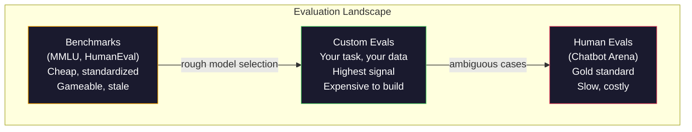
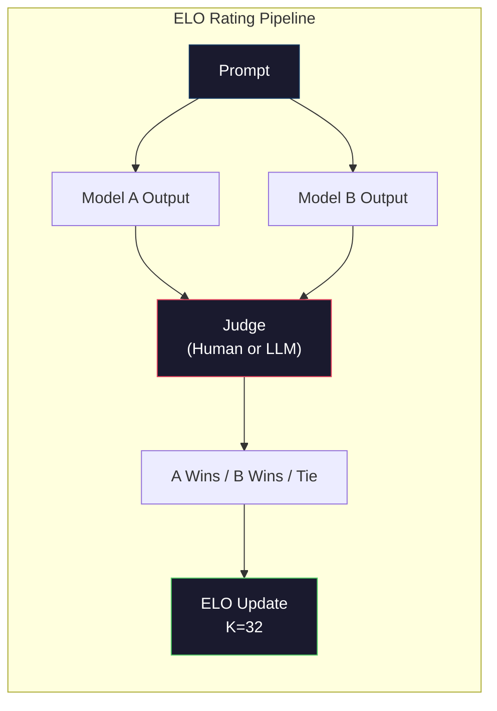

# Ocena: testy porównawcze, ewaluacje, uprząż LM

> Prawo Goodharta: gdy miernik staje się celem, przestaje być dobrym miernikiem. Laboratoria graniczne grają na testach porównawczych. Wyniki MMLU rosną, a tymczasem modele wciąż nie potrafią niezawodnie policzyć liter w słowie „truskawka". Jedyna ewaluacja, która naprawdę ma znaczenie, to TWOJA ewaluacja — dotycząca TWOJEGO zadania i TWOICH danych.

**Typ:** Kompilacja
**Języki:** Python
**Wymagania wstępne:** Faza 10, lekcje 01-05 (LLM od podstaw)
**Czas:** ~90 minut

## Cele nauczania

- Zbuduj własną wiązkę ewaluacyjną, która przeprowadza testy wielokrotnego wyboru oraz otwarte testy porównawcze z modelem językowym
- Wyjaśnij, dlaczego standardowe testy porównawcze (MMLU, HumanEval) nasycają się i przestają różnicować modele graniczne
- Wdrażaj ewaluacje dostosowane do konkretnego zadania z odpowiednimi metrykami: dokładne dopasowanie, wynik F1, BLEU i LLM jako sędzia
- Projektuj własne zestawy ewaluacyjne ukierunkowane na konkretny przypadek użycia, zamiast polegać wyłącznie na publicznych rankingach

## Problem

MMLU opublikowano w 2020 r. Zestaw zawierał 15 908 pytań z 57 tematów. W ciągu trzech lat modele graniczne osiągnęły jego pułap. GPT-4 uzyskał 86,4%, Claude 3 Opus — 86,8%, a Llama 3 405B — 88,6%. Tabela liderów skompresowała się do zakresu 3 punktów, gdzie różnice wynikają z szumu statystycznego, nie zaś z rzeczywistych różnic w możliwościach.

Tymczasem te same modele nie radzą sobie z zadaniami, z którymi dziesięciolatek poradzi sobie bez zastanowienia. Claude 3.5 Sonnet, który uzyskał 88,7% w MMLU, początkowo nie potrafił policzyć liter w wyrazie „truskawka" — zadanie niewymagające żadnej wiedzy o świecie ani rozumowania, lecz jedynie iteracji na poziomie znaków. HumanEval testuje generowanie kodu na podstawie 164 problemów. Modele osiągają tu ponad 90%, a mimo to tworzą kod, który zawodzi na przypadkach brzegowych, które wyłapałby każdy młodszy programista.

Głównym problemem ewaluacji LLM jest rozbieżność między wydajnością wzorcową a niezawodnością w środowisku produkcyjnym. Testy porównawcze pokazują, jak model radzi sobie na egzaminie. Nie mówią niemal nic o tym, jak będzie działał dla konkretnego zadania, na konkretnych danych i wobec określonych trybów awarii. Jeśli budujesz bota obsługi klienta, MMLU jest bez znaczenia. Jeśli tworzysz asystenta kodowania, HumanEval obejmuje jedynie generowanie na poziomie funkcji — nic nie mówi o debugowaniu, refaktoryzacji ani wyjaśnianiu kodu w plikach.

Potrzebujesz własnych ewaluacji. Nie dlatego, że testy porównawcze są bezużyteczne — przydają się do wstępnego wyboru modelu — ale dlatego, że ostateczna ocena musi ściśle odpowiadać warunkom wdrożenia.

## Koncepcja

### Krajobraz ewaluacji

Istnieją trzy kategorie oceny, różniące się kosztem i jakością sygnału.

**Testy porównawcze** to ustandaryzowane zestawy testów: MMLU, HumanEval, SWE-bench, MATH, ARC, HellaSwag. Porównujesz model z testem i otrzymujesz wynik. Zaleta: wszyscy korzystają z tego samego testu, co umożliwia porównywanie modeli. Wada: modele i dane treningowe coraz bardziej zanieczyszczają te testy. Laboratoria trenują na danych zawierających pytania testowe. Wyniki rosną, ale możliwości niekoniecznie.

**Ewaluacje własne** to zestawy testów tworzone pod konkretny przypadek użycia. Definiujesz dane wejściowe, oczekiwane wyniki i funkcję punktacji. Podsumowywanie dokumentów prawnych oceniasz na dokumentach prawnych. Generator SQL oceniasz na schemacie bazy danych. Są kosztowne w przygotowaniu, lecz to jedyna metoda oceny pozwalająca prognozować wydajność produkcyjną.

**Oceny ludzkie** wykorzystują płatnych adnotatorów do oceny wyników modelu według kryteriów takich jak trafność, poprawność, płynność i bezpieczeństwo. To złoty standard dla zadań otwartych, gdzie automatyczna punktacja zawodzi. Chatbot Arena zebrała ponad 2 miliony głosów preferencji ludzkich dla ponad 100 modeli. Wady: koszt (0,10–2,00 USD za ocenę) i czas (od godzin do dni).



### Dlaczego testy porównawcze się psują

Trzy mechanizmy sprawiają, że wyniki testów porównawczych przestają odzwierciedlać rzeczywiste możliwości modeli.

**Zanieczyszczenie danych.** Korpusy treningowe przeszukują internet, a pytania testowe są dostępne online. Modele mogą zetknąć się z odpowiedziami podczas treningu. Nie jest to oszustwo w tradycyjnym sensie — laboratoria nie uwzględniają celowo danych testowych — jednak skrobanie internetu na dużą skalę sprawia, że ich wykluczenie jest niemal niemożliwe.

**Uczenie pod test.** Laboratoria optymalizują mieszanki treningowe pod kątem wyników testowych. Jeśli 5% zbioru treningowego stanowią zadania wielokrotnego wyboru w stylu MMLU, model uczy się formatu i rozkładu odpowiedzi. MMLU to czteropunktowy wybór wielokrotny. Modele uczą się, że odpowiedzi A/B/C/D rozkładają się w przybliżeniu równomiernie, co pomaga nawet wtedy, gdy model nie zna właściwej odpowiedzi.

**Nasycenie.** Gdy każdy czołowy model osiąga 85–90% w danym teście, test przestaje różnicować. Pozostałe 10–15% pytań bywa niejednoznacznych, błędnie oznaczonych lub wymaga niszowej wiedzy dziedzinowej. Poprawa z 87% do 89% może oznaczać, że model zapamiętał dwa dodatkowe obscuryjne pytania — niekoniecznie stał się mądrzejszy.

### Perplexity: szybka kontrola stanu modelu

Perplexity mierzy stopień zaskoczenia modelu daną sekwencją tokenów. Formalnie jest to wykładnicza wartość ze średniego ujemnego logarytmu prawdopodobieństwa:

```
PPL = exp(-1/N * sum(log P(token_i | context)))
```

Perplexity równa 10 oznacza, że model jest średnio tak niepewny, jakby wybierał losowo spośród 10 opcji na każdej pozycji tokena. Im niższa wartość, tym lepiej. GPT-2 osiąga perplexity ~30 na zbiorze WikiText-103, GPT-3 — ~20, a Llama 3 8B — ~7.

Perplexity jest użyteczna przy porównywaniu modeli na tym samym zbiorze testowym, ale ma swoje ograniczenia. Model może mieć niską perplexity dlatego, że sprawnie przewiduje typowe wzorce, a jednocześnie fatalnie radzić sobie z rzadkimi, lecz istotnymi wzorcami. Nie mówi też nic o przestrzeganiu instrukcji, rozumowaniu ani poprawności faktograficznej. Traktuj ją jako kontrolę zdrowego rozsądku, nie jako ostateczny werdykt.

### LLM jako sędzia

Podejście polega na użyciu silnego modelu do oceny wyników modelu słabszego. Idea jest prosta: poproś GPT-4o lub Claude Sonnet o ocenę odpowiedzi w skali 1–5 pod kątem poprawności, trafności i bezpieczeństwa. Koszt to około 0,01 USD za ocenę w przypadku GPT-4o-mini, a wyniki zaskakująco dobrze korelują z ocenami ludzkimi — zgodność na poziomie około 80% dla większości zadań.

Treść promptu ma tu większe znaczenie niż wybór modelu. Niejasny prompt („Oceń tę odpowiedź") daje zaszumione wyniki. Ustrukturyzowany prompt z rubryką („Daj 5, jeśli odpowiedź jest poprawna faktograficznie i cytuje źródło; 4, jeśli jest poprawna, ale bez źródła; 3, jeśli jest częściowo poprawna…") daje spójne i powtarzalne wyniki.

Typowe błędy oceniających modeli: błąd pozycyjny (preferowanie pierwszej odpowiedzi w porównaniach parami), błąd nadmiarowości (preferowanie dłuższych odpowiedzi) oraz własne uprzedzenia (GPT-4 wyżej ocenia wyniki GPT-4 niż równoważne wyniki Claude'a). Środki zaradcze: losuj kolejność, normalizuj pod względem długości, stosuj innego sędziego niż oceniany model.

### Oceny ELO na podstawie porównań parami

To podejście stosowane w Chatbot Arena. Pokazujesz dwie odpowiedzi na ten sam prompt z różnych modeli. Człowiek lub sędzia LLM wybiera lepszą. Na podstawie tysięcy takich porównań obliczasz ranking ELO dla każdego modelu — tym samym systemem, który stosuje się w szachach.

Zalety ELO: ranking względny jest bardziej niezawodny niż punktacja bezwzględna, sprawnie radzi sobie z remisami i szybciej zbiega się niż niezależne punktowanie każdego wyniku. Na początku 2026 r. rankingi Chatbot Arena pokazują GPT-4o, Claude 3.5 Sonnet i Gemini 1.5 Pro na czele — w odstępie 20 punktów ELO od siebie.



### Narzędzia ewaluacyjne

**lm-evaluation-harness** (EleutherAI): standardowa platforma ewaluacyjna o otwartym kodzie źródłowym. Obsługuje ponad 200 testów porównawczych. Za pomocą jednego polecenia możesz uruchomić dowolny model Hugging Face na MMLU, HellaSwag, ARC i wielu innych. Jest to narzędzie używane przez tabelę liderów Open LLM.

**RAGAS**: framework ewaluacyjny przeznaczony specjalnie dla potoków RAG. Mierzy wierność (czy odpowiedź wynika z odzyskanego kontekstu?), trafność (czy pobrany kontekst jest istotny dla pytania?) i poprawność odpowiedzi.

**promptfoo**: ewaluacja oparta na konfiguracji, wspomagająca inżynierię promptów. Definiujesz przypadki testowe w YAML, uruchamiasz je na wielu modelach i otrzymujesz raport z wynikami. Przydatne do regresyjnego testowania promptów — pozwala upewnić się, że zmiana promptu nie psuje istniejących przypadków testowych.

### Tworzenie własnych ewaluacji

To jedyna forma ewaluacji, która ma znaczenie w środowisku produkcyjnym. Proces:

1. **Zdefiniuj zadanie.** Co dokładnie model ma robić? Precyzyjnie. „Odpowiadaj na pytania" to za mało. „Mając e-mail ze skargą klienta, wyodrębnij nazwę produktu, kategorię problemu i wydźwięk" — to zadanie, które możesz ocenić.

2. **Utwórz przypadki testowe.** Minimum 50 do oceny prototypu, ponad 200 do zastosowania produkcyjnego. Każdy przypadek testowy to para (wejście, oczekiwane_wyjście). Uwzględnij przypadki brzegowe: puste dane wejściowe, dane kontradyktoryjne, niejednoznaczne, a także wejścia w innych językach.

3. **Wybierz metodę punktacji.** Dokładne dopasowanie dla wyników ustrukturyzowanych. BLEU/ROUGE dla podobieństwa tekstu. LLM jako sędzia dla jakości odpowiedzi otwartych. F1 dla zadań ekstrakcji. Łącz wiele metryk z odpowiednimi wagami.

4. **Zautomatyzuj.** Każda ewaluacja powinna działać jednym poleceniem, bez ręcznych kroków. Przechowuj wyniki w formacie umożliwiającym porównywanie w czasie.

5. **Śledź trend.** Pojedynczy wynik ewaluacji sam w sobie niewiele znaczy — potrzebujesz linii trendu. Czy wynik poprawił się po ostatniej zmianie promptu? Czy pogorszył się po zmianie modelu? Wersjonuj ewaluacje razem z promptami.

| Typ oceny | Koszt | Zgodność z ludźmi | Najlepsze zastosowanie |
|----------|-------|-------------------|------------------------|
| Dokładne dopasowanie | ~0 USD | 100% (tam, gdzie ma zastosowanie) | Wyniki ustrukturyzowane, klasyfikacja |
| BLEU/ROUGE | ~0 USD | ~60% | Tłumaczenie, streszczanie |
| LLM jako sędzia | ~0,01 USD | ~80% | Generacja otwarta |
| Ocena ludzka | 0,10–2,00 USD | N/D (jest podstawą odniesienia) | Niejednoznaczne zadania o wysokich stawkach |

## Zbuduj to

### Krok 1: Minimalna struktura ewaluacyjna

Zdefiniuj podstawowe abstrakcje. Przypadek ewaluacyjny zawiera dane wejściowe, oczekiwany wynik i opcjonalny słownik metadanych. Funkcja punktująca przyjmuje predykcję i wartość referencyjną, a zwraca wynik w przedziale 0–1.

```python
import json
from collections import Counter

class EvalCase:
    def __init__(self, input_text, expected, metadata=None):
        self.input_text = input_text
        self.expected = expected
        self.metadata = metadata or {}

class EvalSuite:
    def __init__(self, name, cases, scorers):
        self.name = name
        self.cases = cases
        self.scorers = scorers

    def run(self, model_fn):
        results = []
        for case in self.cases:
            prediction = model_fn(case.input_text)
            scores = {}
            for scorer_name, scorer_fn in self.scorers.items():
                scores[scorer_name] = scorer_fn(prediction, case.expected)
            results.append({
                "input": case.input_text,
                "expected": case.expected,
                "prediction": prediction,
                "scores": scores,
            })
        return results
```

### Krok 2: Funkcje punktacji

Zbuduj dokładne dopasowanie, token F1 i symulowanego sędziego LLM.

```python
def exact_match(prediction, expected):
    return 1.0 if prediction.strip().lower() == expected.strip().lower() else 0.0

def token_f1(prediction, expected):
    pred_tokens = set(prediction.lower().split())
    exp_tokens = set(expected.lower().split())
    if not pred_tokens or not exp_tokens:
        return 0.0
    common = pred_tokens & exp_tokens
    precision = len(common) / len(pred_tokens)
    recall = len(common) / len(exp_tokens)
    if precision + recall == 0:
        return 0.0
    return 2 * (precision * recall) / (precision + recall)

def llm_judge_simulated(prediction, expected):
    pred_words = set(prediction.lower().split())
    exp_words = set(expected.lower().split())
    if not exp_words:
        return 0.0
    overlap = len(pred_words & exp_words) / len(exp_words)
    length_penalty = min(1.0, len(prediction) / max(len(expected), 1))
    return round(overlap * 0.7 + length_penalty * 0.3, 3)
```

### Krok 3: System ocen ELO

Zaimplementuj porównania parami z aktualizacjami ELO. To dokładnie ten system, którego Chatbot Arena używa do oceniania modeli.

```python
class ELOTracker:
    def __init__(self, k=32, initial_rating=1500):
        self.ratings = {}
        self.k = k
        self.initial_rating = initial_rating
        self.history = []

    def _ensure_player(self, name):
        if name not in self.ratings:
            self.ratings[name] = self.initial_rating

    def expected_score(self, rating_a, rating_b):
        return 1 / (1 + 10 ** ((rating_b - rating_a) / 400))

    def record_match(self, player_a, player_b, outcome):
        self._ensure_player(player_a)
        self._ensure_player(player_b)

        ea = self.expected_score(self.ratings[player_a], self.ratings[player_b])
        eb = 1 - ea

        if outcome == "a":
            sa, sb = 1.0, 0.0
        elif outcome == "b":
            sa, sb = 0.0, 1.0
        else:
            sa, sb = 0.5, 0.5

        self.ratings[player_a] += self.k * (sa - ea)
        self.ratings[player_b] += self.k * (sb - eb)

        self.history.append({
            "a": player_a, "b": player_b,
            "outcome": outcome,
            "rating_a": round(self.ratings[player_a], 1),
            "rating_b": round(self.ratings[player_b], 1),
        })

    def leaderboard(self):
        return sorted(self.ratings.items(), key=lambda x: -x[1])
```

### Krok 4: Obliczanie perplexity

Oblicz perplexity na podstawie prawdopodobieństw tokenów. W praktyce uzyskuje się je z logitów modelu. Tutaj symulujemy je za pomocą rozkładu prawdopodobieństwa.

```python
import numpy as np

def perplexity(log_probs):
    if not log_probs:
        return float("inf")
    avg_neg_log_prob = -np.mean(log_probs)
    return float(np.exp(avg_neg_log_prob))

def token_log_probs_simulated(text, model_quality=0.8):
    np.random.seed(hash(text) % 2**31)
    tokens = text.split()
    log_probs = []
    for i, token in enumerate(tokens):
        base_prob = model_quality
        if len(token) > 8:
            base_prob *= 0.6
        if i == 0:
            base_prob *= 0.7
        prob = np.clip(base_prob + np.random.normal(0, 0.1), 0.01, 0.99)
        log_probs.append(float(np.log(prob)))
    return log_probs
```

### Krok 5: Wyniki zbiorcze

Oblicz statystyki podsumowujące dla przebiegu ewaluacyjnego: średnią, medianę, współczynnik zdawalności przy zadanym progu oraz podział według metryk.

```python
def summarize_results(results, threshold=0.8):
    all_scores = {}
    for r in results:
        for metric, score in r["scores"].items():
            all_scores.setdefault(metric, []).append(score)

    summary = {}
    for metric, scores in all_scores.items():
        arr = np.array(scores)
        summary[metric] = {
            "mean": round(float(np.mean(arr)), 3),
            "median": round(float(np.median(arr)), 3),
            "std": round(float(np.std(arr)), 3),
            "min": round(float(np.min(arr)), 3),
            "max": round(float(np.max(arr)), 3),
            "pass_rate": round(float(np.mean(arr >= threshold)), 3),
            "n": len(scores),
        }
    return summary

def print_summary(summary, suite_name="Eval"):
    print(f"\n{'=' * 60}")
    print(f"  {suite_name} Summary")
    print(f"{'=' * 60}")
    for metric, stats in summary.items():
        print(f"\n  {metric}:")
        print(f"    Mean:      {stats['mean']:.3f}")
        print(f"    Median:    {stats['median']:.3f}")
        print(f"    Std:       {stats['std']:.3f}")
        print(f"    Range:     [{stats['min']:.3f}, {stats['max']:.3f}]")
        print(f"    Pass rate: {stats['pass_rate']:.1%} (threshold >= 0.8)")
        print(f"    N:         {stats['n']}")
```

### Krok 6: Uruchom pełny potok

Połącz wszystkie elementy. Zdefiniuj zadanie, utwórz przypadki testowe, zasymuluj dwa modele, przeprowadź ewaluacje, oblicz ELO na podstawie porównań parami i wydrukuj tabelę wyników.

```python
def demo_model_good(prompt):
    responses = {
        "What is the capital of France?": "Paris",
        "What is 2 + 2?": "4",
        "Who wrote Hamlet?": "William Shakespeare",
        "What language is PyTorch written in?": "Python and C++",
        "What is the boiling point of water?": "100 degrees Celsius",
    }
    return responses.get(prompt, "I don't know")

def demo_model_bad(prompt):
    responses = {
        "What is the capital of France?": "Paris is the capital city of France",
        "What is 2 + 2?": "The answer is four",
        "Who wrote Hamlet?": "Shakespeare",
        "What language is PyTorch written in?": "Python",
        "What is the boiling point of water?": "212 Fahrenheit",
    }
    return responses.get(prompt, "Unknown")

cases = [
    EvalCase("What is the capital of France?", "Paris"),
    EvalCase("What is 2 + 2?", "4"),
    EvalCase("Who wrote Hamlet?", "William Shakespeare"),
    EvalCase("What language is PyTorch written in?", "Python and C++"),
    EvalCase("What is the boiling point of water?", "100 degrees Celsius"),
]

suite = EvalSuite(
    name="General Knowledge",
    cases=cases,
    scorers={
        "exact_match": exact_match,
        "token_f1": token_f1,
        "llm_judge": llm_judge_simulated,
    },
)

results_good = suite.run(demo_model_good)
results_bad = suite.run(demo_model_bad)

print_summary(summarize_results(results_good), "Model A (concise)")
print_summary(summarize_results(results_bad), "Model B (verbose)")
```

„Dobry" model daje zwięzłe odpowiedzi, „zły" podaje rozbudowane parafrazy. Dokładne dopasowanie surowo karze model rozbudowany. Token F1 i LLM jako sędzia są bardziej wyrozumiałe. To pokazuje, dlaczego wybór metryki jest kluczowy: ten sam model wygląda świetnie lub okropnie — zależnie od tego, jak go oceniasz.

### Krok 7: Turniej ELO

Przeprowadź porównania parami między modelami w wielu rundach.

```python
elo = ELOTracker(k=32)

for case in cases:
    pred_a = demo_model_good(case.input_text)
    pred_b = demo_model_bad(case.input_text)

    score_a = token_f1(pred_a, case.expected)
    score_b = token_f1(pred_b, case.expected)

    if score_a > score_b:
        outcome = "a"
    elif score_b > score_a:
        outcome = "b"
    else:
        outcome = "tie"

    elo.record_match("model_a_concise", "model_b_verbose", outcome)

print("\nELO Leaderboard:")
for name, rating in elo.leaderboard():
    print(f"  {name}: {rating:.0f}")
```

### Krok 8: Porównanie perplexity

Porównaj perplexity dla modeli o różnych poziomach jakości.

```python
test_text = "The quick brown fox jumps over the lazy dog in the garden"

for quality, label in [(0.9, "Strong model"), (0.7, "Medium model"), (0.4, "Weak model")]:
    log_probs = token_log_probs_simulated(test_text, model_quality=quality)
    ppl = perplexity(log_probs)
    print(f"  {label} (quality={quality}): perplexity = {ppl:.2f}")
```

## Użyj tego

### lm-evaluation-harness (EleutherAI)

Standardowe narzędzie do przeprowadzania testów porównawczych na dowolnym modelu.

```python
# pip install lm-eval
# Command line:
# lm_eval --model hf --model_args pretrained=meta-llama/Llama-3.1-8B --tasks mmlu --batch_size 8

# Python API:
# import lm_eval
# results = lm_eval.simple_evaluate(
#     model="hf",
#     model_args="pretrained=meta-llama/Llama-3.1-8B",
#     tasks=["mmlu", "hellaswag", "arc_easy"],
#     batch_size=8,
# )
# print(results["results"])
```

### promptfoo

Ewaluacja oparta na konfiguracji, wspomagająca inżynierię promptów. Definiujesz testy w YAML i uruchamiasz je dla wielu dostawców.

```yaml
# promptfoo.yaml
providers:
  - openai:gpt-4o-mini
  - anthropic:claude-3-haiku

prompts:
  - "Answer in one word: {{question}}"

tests:
  - vars:
      question: "What is the capital of France?"
    assert:
      - type: contains
        value: "Paris"
  - vars:
      question: "What is 2 + 2?"
    assert:
      - type: equals
        value: "4"
```

### RAGAS do oceny RAG

```python
# pip install ragas
# from ragas import evaluate
# from ragas.metrics import faithfulness, answer_relevancy, context_precision
#
# result = evaluate(
#     dataset,
#     metrics=[faithfulness, answer_relevancy, context_precision],
# )
# print(result)
```

RAGAS mierzy to, czego brakuje w ogólnych ewaluacjach: czy odpowiedź modelu wynika z odzyskanego kontekstu, a nie tylko czy jest „poprawna" w ogólnym sensie.

## Wyślij to

W ramach tej lekcji powstał `outputs/prompt-eval-designer.md` — wielokrotnego użytku prompt projektujący własne zestawy ewaluacyjne dla dowolnego zadania. Podaj opis zadania, a wygeneruje przypadki testowe, funkcje punktacji i rekomendację progu zdawalności.

Powstaje też `outputs/skill-llm-evaluation.md` — schemat decyzyjny pomagający wybrać właściwą strategię ewaluacji na podstawie rodzaju zadania, budżetu i wymagań dotyczących opóźnień.

## Ćwiczenia

1. Dodaj funkcję punktującą „spójność", która przepuszcza te same dane wejściowe przez model 5 razy i mierzy, jak często wyniki się pokrywają. Niespójne odpowiedzi na deterministyczne dane ujawniają niestabilne prompty lub zbyt wysoką temperaturę.

2. Rozszerz moduł śledzący ELO o obsługę wielu funkcji sędziowskich (dokładne dopasowanie, F1, LLM jako sędzia) z wagami. Porównaj, jak zmienia się tabela liderów przy silnym nacisku na dokładne dopasowanie w stosunku do wysokiego współczynnika F1.

3. Zbuduj zestaw ewaluacyjny dla konkretnego zadania: klasyfikacja wiadomości e-mail do 5 kategorii. Utwórz 100 przypadków testowych z różnorodnymi przykładami, w tym przypadkami brzegowymi (e-maile potencjalnie należące do wielu kategorii, puste e-maile, e-maile w innych językach). Zmierz skuteczność różnych „modeli": opartego na regułach, dopasowaniu słów kluczowych i symulowanym LLM.

4. Zastosuj wykrywanie zanieczyszczeń: mając zestaw pytań ewaluacyjnych i korpus treningowy, sprawdź, jaki odsetek pytań (lub ich bliskich parafraz) pojawia się w danych treningowych. Tak właśnie badacze weryfikują trafność testów porównawczych.

5. Zbuduj narzędzie do porównywania wersji modeli. Mając wyniki ewaluacji dwóch wersji modelu, wskaż, które przypadki testowe uległy poprawie, które się cofnęły, a które pozostały bez zmian. To odpowiednik różnicy w kodzie — niezbędny do oceny, czy dana zmiana przyniosła korzyść, czy szkodę.

## Kluczowe terminy

| Termin | Co się mówi | Co to faktycznie oznacza |
|------|-------------|--------------------------|
| MMLU | „Test porównawczy" | Massive Multitask Language Understanding — 15 908 pytań wielokrotnego wyboru z 57 dziedzin; wyniki modeli granicznych nasycają się powyżej 88% od 2025 r. |
| HumanEval | „Ewaluacja kodu" | 164 zadania polegające na uzupełnianiu funkcji Pythona, opracowane przez OpenAI; testuje wyłącznie generowanie izolowanych funkcji |
| SWE-bench | „Prawdziwa ocena kodowania" | 2294 zgłoszenia z GitHuba z 12 repozytoriów Pythona; mierzy kompleksowe naprawianie błędów, w tym generowanie testów |
| Perplexity | „Jak zdezorientowany jest model" | exp(-avg(log P(token_i | kontekst))) — niższa wartość oznacza, że model przypisuje wyższe prawdopodobieństwo rzeczywistym tokenom |
| Ocena ELO | „Szachowy ranking dla modeli" | Względna ocena umiejętności obliczana na podstawie wyników pojedynków parami; stosowana przez Chatbot Arena do rankingu ponad 100 modeli |
| LLM jako sędzia | „Sztuczna inteligencja ocenia sztuczną inteligencję" | Silny model ocenia wyniki słabszego według rubryki; ~80% zgodności z ludzkimi sędziami; koszt ~0,01 USD za ocenę |
| Zanieczyszczenie danych | „Model zdał egzamin" | Dane treningowe zawierają pytania testowe, co zawyża wyniki bez rzeczywistej poprawy możliwości modelu |
| Zestaw ewaluacyjny | „Kilka testów" | Wersjonowany zbiór trójek (wejście, oczekiwane_wyjście, punktacja) mierzących określoną zdolność |
| Współczynnik zdawalności | „Jaki odsetek odpowiedzi jest poprawny" | Część przypadków ewaluacyjnych z wynikiem powyżej progu — bardziej praktyczna niż średni wynik, bo mierzy niezawodność |
| Chatbot Arena | „Strona z rankingiem modeli" | Platforma LMSYS z ponad 2 milionami głosów preferencji ludzkich; tworzy najbardziej wiarygodną tabelę liderów LLM na podstawie ocen ELO |

## Dalsze czytanie

– [Hendrycks i in., 2021 – „Measuring Massive Multitask Language Understanding"](https://arxiv.org/abs/2009.03300) – artykuł opisujący MMLU; mimo nasycenia wciąż najczęściej cytowany punkt odniesienia w badaniach nad LLM
– [Chen i in., 2021 – „Evaluating Large Language Models Trained on Code"](https://arxiv.org/abs/2107.03374) – artykuł HumanEval od OpenAI; ustanowił metodologię ewaluacji generowania kodu
– [Zheng i in., 2023 – „Judging LLM-as-a-Judge"](https://arxiv.org/abs/2306.05685) – systematyczna analiza wykorzystania LLM do oceniania LLM, zawierająca wyniki dotyczące błędu pozycyjnego i uprzedzenia do nadmiarowości
– [LMSYS Chatbot Arena](https://chat.lmsys.org/) – platforma porównywania modeli oparta na crowdsourcingu, z ponad 2 milionami głosów; najbardziej wiarygodny ranking LLM oparty na danych rzeczywistych
