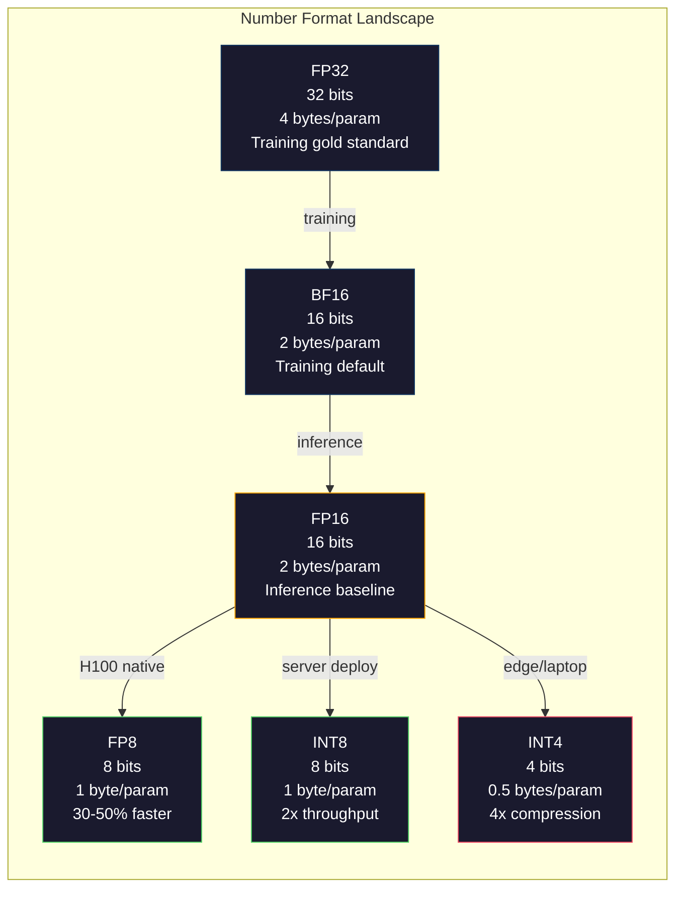
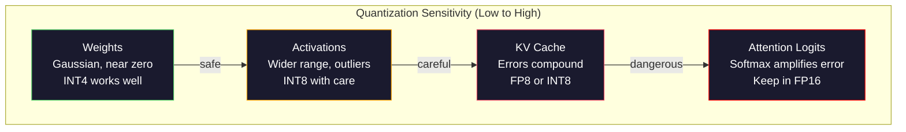
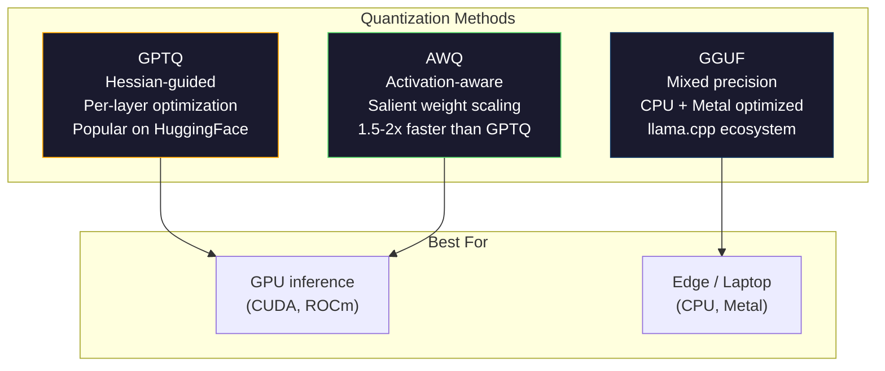

# Kwantyzacja: dopasowanie modeli

> Model 70B w FP16 potrzebuje 140 GB. Dwa A100 tylko do ciężarków. Kwantyzacja do 8PR: jeden procesor graficzny 80 GB. INT4: MacBook.

**Typ:** Kompilacja
**Języki:** Python (z numpy)
**Wymagania wstępne:** Faza 10, lekcje 01-10 (LLM od podstaw)
**Czas:** ~120 minut

## Cele nauczania

- Implementuj kwantyzację symetryczną i asymetryczną od FP16 do INT8 i INT4, w tym skalowanie na tensor i na kanał
- Oblicz oszczędność pamięci dzięki kwantyzacji i określ, jaka precyzja pasuje do pamięci VRAM danego procesora graficznego
- Wyjaśnij różnicę pomiędzy kwantyzacją potreningową (PTQ) a treningiem świadomym kwantyzacji (QAT)
- Zastosuj GPTQ lub AWQ do kwantyzacji rzeczywistego modelu i zmierzenia kompromisu między dokładnością a pamięcią w benchmarku

## Problem

Lama 3 70B ma 70 miliardów parametrów. Każdy parametr jest 16-bitową liczbą zmiennoprzecinkową. To jest 140 miliardów bajtów. 140 GB. Pojedynczy A100 ma 80 GB pamięci VRAM. Nie można nawet załadować ciężarów, nie mówiąc już o uruchomieniu wnioskowania, na pojedynczym procesorze graficznym. Potrzebujesz dwóch A100 po 2 USD za godzinę każdy, aby obsłużyć jeden model.

Ale 16 bitów na parametr jest marnotrawstwem. Większość wag w klastrze sieci neuronowej jest bliska zeru. Pełny zakres dynamiki FP16 (od 0,000000059 do 65 504) jest prawie całkowicie niewykorzystany. Jeśli zmierzymy rzeczywisty rozkład ciężarów w Lamie 3 70B, 95% z nich mieści się w przedziale od -0,1 do +0,1. Spalasz 16 bitów, aby reprezentować wartości, które mieszczą się w 4.

Kwantyzacja zastępuje liczby o wysokiej precyzji liczbami o mniejszej precyzji. Od FP16 do FP8 zmniejsza się pamięć o połowę. FP16 do INT4 skracają go o jedną czwartą. Ten model 140 GB staje się 35 GB. Pasuje do pojedynczego procesora graficznego dla konsumentów. Wciśnij kwantyzację 2-bitową (agresywna, stratna, ale użyteczna do niektórych zadań) i ten sam model działa na laptopie 16 GB.

Kosztem jest dokładność. Każdy usunięty fragment niszczy informacje. Pytanie brzmi, ile dokładności tracisz i gdzie. Dobrze skwantowany model INT4 zachowuje 95–99% jakości oryginału w większości testów porównawczych. Naiwna kwantyzacja do INT4 może całkowicie zniszczyć model. Różnica polega na technice.

Społecznościowe kwantyzacje Lamy 3 do INT4 za pomocą GPTQ pokazują w przybliżeniu 1-2 punkty zagubienia utracone w WikiText. Mistral wypuścił punkty kontrolne 8PR dla Mixtrala 8x22B z zerową mierzalną utratą jakości na MMLU. Format GGUF obsługuje plik llama.cpp, obsługujący modele 70B na MacBookach z chipami z serii M. Kwantyzacja to nie hack. Jest to standardowa ścieżka wdrożenia dla każdego modelu większego niż 7B.

## Koncepcja

### Formaty liczb: działanie każdego bitu

Każda liczba zmiennoprzecinkowa składa się z trzech części: znaku, wykładnika i mantysy (zwanej także mantysą). Znak jest jeden bit. Wykładnik określa zakres (jak duża lub mała może być liczba). Mantysa określa precyzję (ile miejsc po przecinku otrzymasz).

```
FP32:  [1 sign] [8 exponent] [23 mantissa]  = 32 bits
FP16:  [1 sign] [5 exponent] [10 mantissa]  = 16 bits
BF16:  [1 sign] [8 exponent] [7  mantissa]  = 16 bits
FP8:   [1 sign] [4 exponent] [3  mantissa]  = 8  bits (E4M3)
FP8:   [1 sign] [5 exponent] [2  mantissa]  = 8  bits (E5M2)
INT8:  [1 sign] [7 value]                   = 8  bits (uniform steps)
INT4:  [1 sign] [3 value]                   = 4  bits (16 levels total)
```

**FP32** to pełna precyzja. 23 bity mantysy dają około 7 cyfr dziesiętnych precyzji. Zakres: około 1,2 x 10^-38 do 3,4 x 10^38. Szkolenia odbywały się wyłącznie w FP32. Nadal ma to zastosowanie w przypadku akumulacji (sumy bieżące podczas mnożenia macierzy).

**FP16** dzieli bity na pół. 10 bitów mantysy daje około 3,3 cyfry dziesiętnej. Wykładnik zmniejsza się do 5 bitów, radykalnie zmniejszając zakres (maksymalna wartość ~65 504). Jest to dobre w przypadku ciężarów (które skupiają się blisko zera), ale niebezpieczne w przypadku aktywacji i gradientów, które mogą wzrosnąć podczas treningu. Szkolenie w ramach 16PR wymaga skalowania strat, aby zapobiec niedoborom.

**BF16** (Brain Float 16) zachowuje 8-bitowy wykładnik z FP32, ale zmniejsza mantysę do 7 bitów. Ten sam zakres co FP32, mniejsza precyzja niż FP16. Google zaprojektowało go specjalnie do głębokiego uczenia się. Intuicja: w przypadku sieci neuronowych zasięg ma większe znaczenie niż precyzja. Gradient 10^-20, który w FP16 spada do zera, utrzymuje się w BF16. Waga 0,07342, która zaokrągla się do 0,0734 w BF16, jest wystarczająco blisko. Każdy nowoczesny bieg treningowy wykorzystuje BF16 lub mieszankę BF16/FP32.

**FP8** jest dostępny w dwóch wersjach. E4M3 (4 wykładniki, 3 mantysy) jest używane do wag i aktywacji podczas wnioskowania. E5M2 (5 wykładników, 2 mantysy) stosuje się do nachyleń podczas treningu, gdzie zasięg ma większe znaczenie niż precyzja. Wnioskowanie FP8 na procesorach graficznych H100 osiąga 30-50% przyspieszenia w porównaniu z FP16 przy znikomej utracie jakości.

**INT8** jest formatem liczby całkowitej. Żadnego wykładnika, żadnej mantysy. Tylko 256 równomiernie rozmieszczonych wartości od -128 do 127. Aby odwzorować wagi zmiennoprzecinkowe w tym zakresie, potrzebny jest współczynnik skali. Zaleta: arytmetyka liczb całkowitych jest szybsza i bardziej energooszczędna niż arytmetyka zmiennoprzecinkowa. Mnożenie macierzy INT8 na A100 przebiega przy 624 TOPS w porównaniu z 312 TFLOPS dla FP16.

**INT4** posuwa się dalej. Tylko 16 możliwych wartości. Współczynnik skali wymaga dużego wysiłku. Jakość zależy całkowicie od tego, jak wybierzesz skalę i jakie wagi kwantyzujesz. Najnowocześniejsze metody INT4 (GPTQ, AWQ) zachowują ponad 95% oryginalnej jakości modelu.



### Jak działa kwantyzacja

Podstawowa operacja jest prosta. Weź tensor wartości zmiennoprzecinkowych, znajdź współczynnik skali, pomnóż, zaokrąglij do najbliższej liczby całkowitej i zapisz liczby całkowite plus współczynnik skali.

**Kwantyzacja:**

```
scale = max(abs(tensor)) / max_int_value
quantized = round(tensor / scale)
```

**Dekwantyzacja:**

```
reconstructed = quantized * scale
```

Dla INT8 z zakresem symetrycznym (-127 do 127):

```
scale = max(abs(tensor)) / 127
quantized = clamp(round(tensor / scale), -128, 127)
```

Błąd to błąd zaokrąglenia. Każda wartość może być przesunięta najwyżej o `scale / 2`. Całkowity błąd w warstwie zależy od liczby posiadanych wag i wrażliwości modelu na zakłócenia tych wag.

**Kwantyzacja na tensor vs. na kanał.** Na tensor stosuje się jeden współczynnik skali dla całej macierzy wag. Proste, ale stratne: jeśli jedna kolumna zawiera duże wartości, a druga małe wartości, małe wartości tracą większość swojej precyzji. Na kanał wykorzystuje jeden współczynnik skali na kanał wyjściowy (na wiersz lub kolumnę macierzy wag). Większy narzut (przechowujesz N współczynników skali zamiast 1), ale znacznie lepsza jakość. Każda metoda kwantyzacji produkcyjnej wykorzystuje granulację na kanał lub drobniejszą.

**Kwantyzacja asymetryczna** dodaje przesunięcie punktu zerowego: `quantized = round(tensor / scale) + zero_point`. Obsługuje to rozkłady, które nie są wyśrodkowane na zero. Na przykład aktywacje ReLU są zawsze nieujemne. Kwantyzacja symetryczna marnuje połowę zakresu liczb całkowitych na wartości ujemne, które nigdy się nie pojawiają. Asymetryczna kwantyzacja odwzorowuje rzeczywisty zakres [min, max] na pełny zakres liczb całkowitych.

### Hierarchia czułości

Nie wszystko w modelu toleruje kwantyzację jednakowo. Istnieje jasna hierarchia.

**Wagi (najsolidniejsze).** Ciężary modeli zmieniają się powoli podczas treningu i odpowiadają mniej więcej rozkładowi Gaussa ze środkiem w pobliżu zera. Dobrze kwantyzują. Wagi INT8 ze skalami dla poszczególnych kanałów dają prawie bezstratne wyniki. INT4 wymaga bardziej wyrafinowanych metod, ale działa.

**Aktywacje (umiarkowana czułość).** Aktywacje to wartości pośrednie przepływające przez sieć podczas wnioskowania. Mają szerszy zakres dynamiczny niż wagi i zawierają wartości odstające. Pojedyncza głowa uwagi może wygenerować wartości aktywacji 100 razy większe niż średnia. Te wartości odstające mają kluczowe znaczenie dla jakości modelu. Kwantowanie ich naiwnie niszczy informację. Rozwiązania: zachowaj większą precyzję kanałów odstających (LLM.int8()), użyj skal aktywacji dla każdego tokena lub kanału.

**Pamięć podręczna KV (wysoka czułość).** Pamięć podręczna klucz-wartość przechowuje stany uwagi dla wszystkich poprzednich tokenów. Przy długich kontekstach pamięć podręczna KV dominuje w pamięci. W przypadku modelu 70B w kontekście 32K sama pamięć podręczna KV wynosi 40 GB w FP16. Kwantyzacja pamięci podręcznej KV do FP8 lub INT8 pozwala zaoszczędzić ogromną ilość pamięci, ale wszelkie błędy wpływają na wszystkie przyszłe obliczenia uwagi. Wpływ na jakość skaluje się wraz z długością sekwencji.

**Logity uwagi (najbardziej czułe).** Softmax w uwadze jest bardzo wrażliwy na niewielkie zmiany na swoich wejściach. Błąd kwantyzacji wynoszący 0,01 w logicie sprzed softmax może znacząco przesunąć rozkład uwagi. Większość schematów kwantyzacji utrzymuje obliczenia uwagi z większą precyzją (FP16 lub BF16), nawet jeśli wszystko inne jest kwantowane.



### PTQ kontra QAT

**Kwantyzacja po treningu (PTQ)** kwantyzuje już wytrenowany model. Żadnego przekwalifikowania. Bierzesz wagi FP16, obliczasz współczynniki skali, zaokrąglasz i wdrażasz. Szybko (od minut do godzin) i tanio. Działa dobrze dla INT8 i FP8. W przypadku INT4 naiwne PTQ często zawodzi, ponieważ kumulują się błędy zaokrągleń. Zaawansowane metody PTQ (GPTQ, AWQ) wykorzystują dane kalibracyjne w celu zminimalizowania błędu kwantyzacji.

**Trening uwzględniający kwantyzację (QAT)** podczas treningu wstawia fałszywe operacje kwantyzacji do podania w przód. Model uczy się umieszczać swoje ciężary tam, gdzie błędy zaokrągleń są małe. Gradienty przepływają przez fałszywą kwantyzację przy użyciu prostego estymatora (STE): udawaj, że operacja zaokrąglania ma gradient 1. QAT tworzy lepsze modele INT4 i INT2 niż PTQ, ale wymaga pełnego przebiegu szkoleniowego. Google użył QAT do wydajnej obsługi Gemini. Meta użyła QAT do niektórych celów wdrożenia Lamy.

| Aspekt | PTQ | QAT |
|--------|-----|-----|
| Koszt | Minuty do godzin | Pełny przebieg treningowy |
| Jakość w INT8 | Znakomity (< 0,1% straty) | Znakomity |
| Jakość w INT4 | Dobry z GPTQ/AWQ (strata 1-3%) | Lepiej (< 1% straty) |
| Jakość w INT2 | Biedny | Przydatne do niektórych zadań |
| Dane kalibracyjne | 128-1024 przykłady | Pełny zestaw danych szkoleniowych |
| Kiedy używać | Wdrożenie, iteracja | Maksymalna jakość przy małej szerokości bitowej |

### GPTQ, AWQ, GGUF

**GPTQ (kwantyzacja GPT)** to jednorazowa metoda PTQ. Kwantyzuje ciężary w jednej warstwie na raz, korzystając z małego zestawu danych kalibracyjnych (typowo 128 przykładów) w celu pomiaru hesja (informacja drugiego rzędu o wrażliwości sygnału wyjściowego na każdy ciężar). Wagi, które według Hesja są ważne, są kwantowane dokładniej. GPTQ była pierwszą metodą, dzięki której kwantyzacja INT4 stała się praktyczna dla LLM. TheBloke na Hugging Face spopularyzował GPTQ, wypuszczając skwantowane wersje setek modeli.

**AWQ (kwantyzacja wagowa uwzględniająca aktywację)** obserwuje, że niewielki ułamek wag (około 1%) jest nieproporcjonalnie ważny, ponieważ mnoży się z dużymi wartościami aktywacji. AWQ identyfikuje te istotne wagi za pomocą danych kalibracyjnych i skaluje je w górę przed kwantyzacją (następnie skaluje odpowiednie aktywacje w dół). Dzięki temu ważne wagi mieszczą się w zakresie, w którym kwantyzacja INT4 jest dokładna. AWQ zazwyczaj dorównuje lub nieznacznie przewyższa jakość GPTQ, a jednocześnie jest 1,5–2 razy szybsze w zastosowaniu.

**GGUF (GPT-Generated Unified Format)** to format pliku używany przez plik llama.cpp i jego ekosystem. Obsługuje mieszaną kwantyzację: różne warstwy uzyskują różne szerokości bitowe. Pierwsza i ostatnia warstwa (głowica osadzająca i wyjściowa) są zwykle utrzymywane z większą precyzją. Warstwy środkowe otrzymują INT4 lub INT3. Pliki GGUF są samodzielne: wagi, tokenizator i metadane w jednym pliku. Format jest przeznaczony do wnioskowania procesora i Apple Silicon, gdzie ładowanie całego modelu do pamięci i wykonywanie mnożenia macierzy na procesorze CPU lub metalowym GPU jest standardową ścieżką. Q4_K_M to najpopularniejszy wariant kwantyzacji GGUF, równoważący jakość i rozmiar.



### Pomiar jakości

Skąd wiesz, czy Twój skwantowany model jest nadal dobry?

**Zaskoczenie.** Najczęstszy wskaźnik. Niżej jest lepiej. Oblicz złożoność na zatrzymanym zbiorze danych (WikiText-2 jest standardem) zarówno dla modelu oryginalnego, jak i skwantowanego. Delta informuje, ile informacji zniszczyło kwantowanie. Praktyczne zasady: delta < 0,5 jest doskonała, 0,5-1,0 jest dobra, 1,0-2,0 jest akceptowalna w przypadku większości zadań, > 2,0 oznacza, że ​​coś poszło nie tak.

**Testy porównawcze specyficzne dla zadania.** Uruchom skwantowany model na MMLU, HumanEval, GSM8K lub niestandardowym pakiecie ewaluacyjnym. Porównaj z oryginałem. Kwantyzacja wpływa nierównomiernie na różne możliwości. Zadania matematyczne i kodowanie są bardziej wrażliwe na utratę precyzji niż wiedza ogólna.

**Porównanie wyników.** Wygeneruj odpowiedzi z obu modeli na podstawie tych samych podpowiedzi i porównaj. LLM-as-sędzia (lekcja 10) sprawdza się tutaj dobrze. Oblicz współczynnik wygranych: jaki ułamek podpowiedzi skwantowany model pasuje lub przewyższa oryginał?

**Opóźnienie i przepustowość.** Kwantyzacja ma na celu szybsze i tańsze modele. Mierz tokeny na sekundę, czas do pierwszego tokena i użycie pamięci. Skwantowany model, który jest wolniejszy od oryginału, jest gorszy niż bezużyteczny.

| Modelka | Formatuj | Rozmiar | Zakłopotanie (WikiText-2) | MMLU | Tokeny/s (A100) |
|-------|-------|------|----------------------|------|--------------------------------|
| Lama 3 70B | FP16 | 140 GB | 3.12 | 79,5% | 38 |
| Lama 3 70B | 8PR | 70 GB | 3.14 | 79,3% | 55 |
| Lama 3 70B | GPTQ INT4 | 35 GB | 4,32 | 77,8% | 72 |
| Lama 3 70B | AWQ INT4 | 35 GB | 4.18 | 78,1% | 75 |
| Lama 3 70B | GGUF Q4_K_M | 40 GB | 4,25 | 77,9% | 28 (procesor) |

Wzór: 8PR jest prawie darmowy. INT4 kosztuje 1-2 punkty MMLU, ale podwaja przepustowość i zmniejsza ilość pamięci. Kompromis jest tego wart w przypadku niemal każdego wdrożenia.

### Liczby rzeczywiste

FP16 do FP8 na H100: przyspieszenie wnioskowania o 30-50%, utrata jakości < 0,1%. To jest oczywista kwantyzacja. Każde wdrożenie H100 powinno z niego korzystać.

FP16 do INT8 (LLM.int8()): 2x redukcja pamięci, utrata jakości < 0,5%. Podejście o mieszanej precyzji utrzymuje cechy odstające w FP16, jednocześnie kwantyzując wszystko inne do INT8.

FP16 do INT4 (GPTQ/AWQ): 4-krotna redukcja pamięci, 1-3% utrata jakości w zależności od modelu i metody. Obsługuje modele 70B na pojedynczym procesorze graficznym 48 GB.

FP16 do INT4 (GGUF Q4_K_M): 3,5-krotna redukcja pamięci, 1-2% utrata jakości. Zoptymalizowany pod kątem wnioskowania o procesorze. Model 70B w Q4_K_M ma około 40 GB i działa z prędkością 10-15 tokenów na sekundę na M3 Max z 64 GB.

FP16 do INT2: 8-krotna redukcja pamięci, utrata jakości 5-15%. Nadaje się tylko do określonych, wąskich zadań, w których można tolerować degradację. Front badawczy, nie gotowy do produkcji do ogólnego użytku.

## Zbuduj to

### Krok 1: Reprezentacje formatu liczb

Zbuduj reprezentację każdego formatu na poziomie bitowym, aby dokładnie zobaczyć, co robią znak, wykładnik i mantysa.

```python
import numpy as np

def float_to_fp32_bits(value):
    bits = np.float32(value).view(np.uint32)
    sign = (bits >> 31) & 1
    exponent = (bits >> 23) & 0xFF
    mantissa = bits & 0x7FFFFF
    return {"sign": int(sign), "exponent": int(exponent), "mantissa": int(mantissa),
            "exponent_bits": format(int(exponent), '08b'),
            "mantissa_bits": format(int(mantissa), '023b'),
            "value": float(value),
            "actual_exponent": int(exponent) - 127}

def float_to_fp16_bits(value):
    fp16 = np.float16(value)
    bits = fp16.view(np.uint16)
    sign = (bits >> 15) & 1
    exponent = (bits >> 10) & 0x1F
    mantissa = bits & 0x3FF
    return {"sign": int(sign), "exponent": int(exponent), "mantissa": int(mantissa),
            "exponent_bits": format(int(exponent), '05b'),
            "mantissa_bits": format(int(mantissa), '010b'),
            "value": float(fp16),
            "actual_exponent": int(exponent) - 15}

def float_to_bf16_bits(value):
    fp32_bits = np.float32(value).view(np.uint32)
    bf16_bits = (fp32_bits >> 16).astype(np.uint16)
    sign = (bf16_bits >> 15) & 1
    exponent = (bf16_bits >> 7) & 0xFF
    mantissa = bf16_bits & 0x7F
    reconstructed = np.uint32(bf16_bits.astype(np.uint32) << 16).view(np.float32)
    return {"sign": int(sign), "exponent": int(exponent), "mantissa": int(mantissa),
            "exponent_bits": format(int(exponent), '08b'),
            "mantissa_bits": format(int(mantissa), '07b'),
            "value": float(reconstructed),
            "actual_exponent": int(exponent) - 127}

def simulate_fp8_e4m3(value):
    sign = 1 if value < 0 else 0
    abs_val = abs(value)
    max_val = 448.0
    abs_val = min(abs_val, max_val)
    if abs_val == 0:
        return {"sign": sign, "exponent": 0, "mantissa": 0, "value": 0.0,
                "exponent_bits": "0000", "mantissa_bits": "000"}
    exp = int(np.floor(np.log2(abs_val)))
    exp = max(-6, min(8, exp))
    mantissa_val = abs_val / (2.0 ** exp) - 1.0
    mantissa_quant = round(mantissa_val * 8) / 8
    mantissa_quant = max(0, min(0.875, mantissa_quant))
    reconstructed = (1.0 + mantissa_quant) * (2.0 ** exp)
    if sign:
        reconstructed = -reconstructed
    mantissa_int = int(round(mantissa_quant * 8))
    return {"sign": sign, "exponent": exp + 7, "mantissa": mantissa_int,
            "exponent_bits": format(exp + 7, '04b'),
            "mantissa_bits": format(mantissa_int, '03b'),
            "value": float(reconstructed),
            "actual_exponent": exp}

def display_format_comparison(value):
    fp32 = float_to_fp32_bits(value)
    fp16 = float_to_fp16_bits(value)
    bf16 = float_to_bf16_bits(value)
    fp8 = simulate_fp8_e4m3(value)

    print(f"\n  Value: {value}")
    print(f"  {'Format':<8} {'Stored Value':>14} {'Error':>12} {'Sign':>5} {'Exp Bits':>10} {'Man Bits':>25}")
    print(f"  {'-'*76}")
    print(f"  {'FP32':<8} {fp32['value']:>14.6f} {abs(fp32['value'] - value):>12.8f} {fp32['sign']:>5} {fp32['exponent_bits']:>10} {fp32['mantissa_bits']:>25}")
    print(f"  {'FP16':<8} {fp16['value']:>14.6f} {abs(fp16['value'] - value):>12.8f} {fp16['sign']:>5} {fp16['exponent_bits']:>10} {fp16['mantissa_bits']:>25}")
    print(f"  {'BF16':<8} {bf16['value']:>14.6f} {abs(bf16['value'] - value):>12.8f} {bf16['sign']:>5} {bf16['exponent_bits']:>10} {bf16['mantissa_bits']:>25}")
    print(f"  {'FP8e4m3':<8} {fp8['value']:>14.6f} {abs(fp8['value'] - value):>12.8f} {fp8['sign']:>5} {fp8['exponent_bits']:>10} {fp8['mantissa_bits']:>25}")
```

### Krok 2: Kwantyzacja symetryczna (na tensor i na kanał)

Podstawowe operacje kwantyzacji. Na tensor używa jednej skali dla całej macierzy. Na kanał używana jest jedna skala na wiersz lub kolumnę.

```python
def quantize_symmetric(tensor, num_bits=8):
    qmin = -(2 ** (num_bits - 1))
    qmax = 2 ** (num_bits - 1) - 1
    abs_max = np.max(np.abs(tensor))
    if abs_max == 0:
        return np.zeros_like(tensor, dtype=np.int32), 1.0
    scale = abs_max / qmax
    quantized = np.clip(np.round(tensor / scale), qmin, qmax).astype(np.int32)
    return quantized, float(scale)

def dequantize_symmetric(quantized, scale):
    return quantized.astype(np.float64) * scale

def quantize_per_channel(tensor, num_bits=8, axis=0):
    qmin = -(2 ** (num_bits - 1))
    qmax = 2 ** (num_bits - 1) - 1

    if axis == 0:
        abs_max = np.max(np.abs(tensor), axis=1, keepdims=True)
    else:
        abs_max = np.max(np.abs(tensor), axis=0, keepdims=True)

    abs_max = np.where(abs_max == 0, 1.0, abs_max)
    scales = abs_max / qmax
    quantized = np.clip(np.round(tensor / scales), qmin, qmax).astype(np.int32)
    return quantized, scales.squeeze()

def dequantize_per_channel(quantized, scales, axis=0):
    if axis == 0:
        return quantized.astype(np.float64) * scales.reshape(-1, 1)
    else:
        return quantized.astype(np.float64) * scales.reshape(1, -1)

def quantize_asymmetric(tensor, num_bits=8):
    qmin = 0
    qmax = 2 ** num_bits - 1
    t_min = np.min(tensor)
    t_max = np.max(tensor)
    if t_max == t_min:
        return np.zeros_like(tensor, dtype=np.int32), 1.0, 0
    scale = (t_max - t_min) / (qmax - qmin)
    zero_point = int(np.round(qmin - t_min / scale))
    zero_point = max(qmin, min(qmax, zero_point))
    quantized = np.clip(np.round(tensor / scale + zero_point), qmin, qmax).astype(np.int32)
    return quantized, float(scale), int(zero_point)

def dequantize_asymmetric(quantized, scale, zero_point):
    return (quantized.astype(np.float64) - zero_point) * scale
```

### Krok 3: Pomiar jakości

Zmierz, ile informacji niszczy kwantyzacja. Błąd średniokwadratowy, stosunek sygnału do szumu i podobieństwo cosinus między oryginalnymi i zrekonstruowanymi tensorami.

```python
def quantization_error(original, reconstructed):
    diff = original - reconstructed
    mse = float(np.mean(diff ** 2))
    rmse = float(np.sqrt(mse))
    max_error = float(np.max(np.abs(diff)))
    signal_power = float(np.mean(original ** 2))
    snr_db = 10 * np.log10(signal_power / max(mse, 1e-20))

    orig_flat = original.flatten()
    recon_flat = reconstructed.flatten()
    norm_orig = np.linalg.norm(orig_flat)
    norm_recon = np.linalg.norm(recon_flat)
    if norm_orig == 0 or norm_recon == 0:
        cosine_sim = 0.0
    else:
        cosine_sim = float(np.dot(orig_flat, recon_flat) / (norm_orig * norm_recon))

    return {"mse": mse, "rmse": rmse, "max_error": max_error,
            "snr_db": float(snr_db), "cosine_similarity": cosine_sim}

def compare_quantization_methods(tensor, num_bits=8):
    q_pt, s_pt = quantize_symmetric(tensor, num_bits)
    recon_pt = dequantize_symmetric(q_pt, s_pt)
    err_pt = quantization_error(tensor, recon_pt)

    q_pc, s_pc = quantize_per_channel(tensor, num_bits, axis=0)
    recon_pc = dequantize_per_channel(q_pc, s_pc, axis=0)
    err_pc = quantization_error(tensor, recon_pc)

    q_asym, s_asym, zp = quantize_asymmetric(tensor, num_bits)
    recon_asym = dequantize_asymmetric(q_asym, s_asym, zp)
    err_asym = quantization_error(tensor, recon_asym)

    print(f"\n  Quantization Comparison ({num_bits}-bit, tensor shape {tensor.shape}):")
    print(f"  {'Method':<20} {'MSE':>12} {'SNR (dB)':>10} {'Cosine Sim':>12} {'Max Error':>12}")
    print(f"  {'-'*68}")
    print(f"  {'Per-tensor sym':<20} {err_pt['mse']:>12.8f} {err_pt['snr_db']:>10.2f} {err_pt['cosine_similarity']:>12.8f} {err_pt['max_error']:>12.8f}")
    print(f"  {'Per-channel sym':<20} {err_pc['mse']:>12.8f} {err_pc['snr_db']:>10.2f} {err_pc['cosine_similarity']:>12.8f} {err_pc['max_error']:>12.8f}")
    print(f"  {'Asymmetric':<20} {err_asym['mse']:>12.8f} {err_asym['snr_db']:>10.2f} {err_asym['cosine_similarity']:>12.8f} {err_asym['max_error']:>12.8f}")

    return {"per_tensor": err_pt, "per_channel": err_pc, "asymmetric": err_asym}
```

### Krok 4: Przemiatanie szerokością bitów

Kwantyzuj ten sam tensor przy różnych szerokościach bitowych (2, 3, 4, 8, 16) i mierz jakość na każdym poziomie. To pokazuje dokładnie, gdzie znajduje się klif jakościowy.

```python
def bit_width_sweep(tensor):
    print(f"\n  Bit-Width Sweep (tensor shape {tensor.shape}):")
    print(f"  {'Bits':>6} {'Levels':>8} {'MSE':>14} {'SNR (dB)':>10} {'Cosine Sim':>12} {'Compression':>12}")
    print(f"  {'-'*64}")

    results = []
    for bits in [2, 3, 4, 8, 16]:
        q, s = quantize_per_channel(tensor, bits, axis=0)
        recon = dequantize_per_channel(q, s, axis=0)
        err = quantization_error(tensor, recon)
        levels = 2 ** bits
        compression = 32.0 / bits

        print(f"  {bits:>6} {levels:>8} {err['mse']:>14.8f} {err['snr_db']:>10.2f} {err['cosine_similarity']:>12.8f} {compression:>11.1f}x")
        results.append({"bits": bits, "levels": levels, "error": err, "compression": compression})

    return results
```

### Krok 5: Eksperyment z wrażliwością

Symuluj kwantyzację różnych części transformatora i zmierz, które elementy są najbardziej czułe. To pokazuje hierarchię czułości: wagi < aktywacje < pamięć podręczna KV < uwaga.

```python
def simulate_transformer_layer(input_data, weights, kv_scale=1.0):
    hidden = input_data @ weights["qkv"]
    seq_len = hidden.shape[1]
    d_model = weights["qkv"].shape[1] // 3
    q, k, v = hidden[:, :, :d_model], hidden[:, :, d_model:2*d_model], hidden[:, :, 2*d_model:]

    attn_scores = (q @ k.transpose(0, 2, 1)) / np.sqrt(d_model) * kv_scale
    attn_max = np.max(attn_scores, axis=-1, keepdims=True)
    attn_exp = np.exp(attn_scores - attn_max)
    attn_weights = attn_exp / np.sum(attn_exp, axis=-1, keepdims=True)

    attn_output = attn_weights @ v
    output = attn_output @ weights["out"]
    return output, {"q": q, "k": k, "v": v, "attn_scores": attn_scores,
                    "attn_weights": attn_weights, "attn_output": attn_output}

def sensitivity_experiment(batch_size=2, seq_len=16, d_model=64, num_bits=8):
    np.random.seed(42)
    input_data = np.random.randn(batch_size, seq_len, d_model) * 0.1

    weights = {
        "qkv": np.random.randn(d_model, 3 * d_model) * (2.0 / d_model) ** 0.5,
        "out": np.random.randn(d_model, d_model) * (2.0 / d_model) ** 0.5,
    }

    baseline_output, baseline_internals = simulate_transformer_layer(input_data, weights)

    experiments = {}

    q_qkv, s_qkv = quantize_per_channel(weights["qkv"], num_bits, axis=0)
    q_out, s_out = quantize_per_channel(weights["out"], num_bits, axis=0)
    quantized_weights = {
        "qkv": dequantize_per_channel(q_qkv, s_qkv, axis=0),
        "out": dequantize_per_channel(q_out, s_out, axis=0),
    }
    weight_quant_output, _ = simulate_transformer_layer(input_data, quantized_weights)
    experiments["Weights only"] = quantization_error(baseline_output, weight_quant_output)

    _, fresh_internals = simulate_transformer_layer(input_data, weights)
    q_act, s_act = quantize_per_channel(
        fresh_internals["attn_output"].reshape(-1, d_model), num_bits, axis=0
    )
    quant_attn_out = dequantize_per_channel(q_act, s_act, axis=0).reshape(batch_size, seq_len, d_model)
    act_quant_output = quant_attn_out @ weights["out"]
    experiments["Activations only"] = quantization_error(baseline_output, act_quant_output)

    q_k, s_k = quantize_per_channel(fresh_internals["k"].reshape(-1, d_model), num_bits, axis=0)
    q_v, s_v = quantize_per_channel(fresh_internals["v"].reshape(-1, d_model), num_bits, axis=0)
    quant_k = dequantize_per_channel(q_k, s_k, axis=0).reshape(batch_size, seq_len, d_model)
    quant_v = dequantize_per_channel(q_v, s_v, axis=0).reshape(batch_size, seq_len, d_model)
    attn_scores_kv = (fresh_internals["q"] @ quant_k.transpose(0, 2, 1)) / np.sqrt(d_model)
    attn_max_kv = np.max(attn_scores_kv, axis=-1, keepdims=True)
    attn_exp_kv = np.exp(attn_scores_kv - attn_max_kv)
    attn_weights_kv = attn_exp_kv / np.sum(attn_exp_kv, axis=-1, keepdims=True)
    kv_quant_output = (attn_weights_kv @ quant_v) @ weights["out"]
    experiments["KV cache only"] = quantization_error(baseline_output, kv_quant_output)

    noise_scale = np.std(fresh_internals["attn_scores"]) * 0.05
    noisy_scores = fresh_internals["attn_scores"] + np.random.randn(*fresh_internals["attn_scores"].shape) * noise_scale
    noisy_max = np.max(noisy_scores, axis=-1, keepdims=True)
    noisy_exp = np.exp(noisy_scores - noisy_max)
    noisy_weights = noisy_exp / np.sum(noisy_exp, axis=-1, keepdims=True)
    attn_quant_output = (noisy_weights @ fresh_internals["v"]) @ weights["out"]
    experiments["Attention logits (5% noise)"] = quantization_error(baseline_output, attn_quant_output)

    print(f"\n  Sensitivity Experiment ({num_bits}-bit quantization):")
    print(f"  {'Component':<30} {'MSE':>14} {'SNR (dB)':>10} {'Cosine Sim':>12}")
    print(f"  {'-'*68}")
    for name, err in sorted(experiments.items(), key=lambda x: x[1]["mse"]):
        print(f"  {name:<30} {err['mse']:>14.8f} {err['snr_db']:>10.2f} {err['cosine_similarity']:>12.8f}")

    return experiments
```

### Krok 6: Symulowany GPTQ

GPTQ kwantyzuje jedną kolumnę na raz, używając hesjanu do decydowania o sposobie rozłożenia błędu zaokrąglenia. Jest to uproszczona wersja, która oddaje podstawową ideę: wykorzystanie danych kalibracyjnych do pomiaru ważności ciężarków, a następnie bardziej agresywne kwantyfikowanie najmniej ważnych wag.

```python
def simulated_gptq(weight_matrix, calibration_inputs, num_bits=4):
    n_in, n_out = weight_matrix.shape
    qmin = -(2 ** (num_bits - 1))
    qmax = 2 ** (num_bits - 1) - 1

    H = np.zeros((n_in, n_in))
    for x in calibration_inputs:
        x = x.reshape(-1, 1) if x.ndim == 1 else x
        for row in range(x.shape[0]):
            xi = x[row].reshape(-1, 1)
            H += xi @ xi.T
    H /= len(calibration_inputs)
    H += np.eye(n_in) * 1e-4

    weight_importance = np.diag(H)

    quantized = np.zeros_like(weight_matrix, dtype=np.int32)
    scales = np.zeros(n_out)
    errors = np.zeros(n_out)

    W = weight_matrix.copy()

    for col in range(n_out):
        w_col = W[:, col]
        abs_max = np.max(np.abs(w_col))
        if abs_max == 0:
            scales[col] = 1.0
            continue
        scale = abs_max / qmax
        scales[col] = scale

        q_col = np.clip(np.round(w_col / scale), qmin, qmax).astype(np.int32)
        quantized[:, col] = q_col

        quant_error = w_col - q_col * scale
        errors[col] = np.sqrt(np.mean(quant_error ** 2))

        if col < n_out - 1:
            importance_weights = weight_importance / (np.max(weight_importance) + 1e-10)
            for next_col in range(col + 1, min(col + 4, n_out)):
                compensation = quant_error * importance_weights * 0.1
                W[:, next_col] += compensation

    return quantized, scales, {"column_errors": errors,
                               "mean_error": float(np.mean(errors)),
                               "max_error": float(np.max(errors))}

def dequantize_gptq(quantized, scales):
    result = np.zeros_like(quantized, dtype=np.float64)
    for col in range(quantized.shape[1]):
        result[:, col] = quantized[:, col] * scales[col]
    return result
```

### Krok 7: Symulacja AWQ

AWQ identyfikuje najważniejsze wagi (te, które mnożą się przy dużych aktywacjach) i chroni je poprzez skalowanie przed kwantyzacją.

```python
def simulated_awq(weight_matrix, calibration_inputs, num_bits=4, salient_fraction=0.01):
    n_in, n_out = weight_matrix.shape
    qmin = -(2 ** (num_bits - 1))
    qmax = 2 ** (num_bits - 1) - 1

    activation_magnitudes = np.zeros(n_in)
    for x in calibration_inputs:
        if x.ndim == 1:
            activation_magnitudes += np.abs(x)
        else:
            activation_magnitudes += np.mean(np.abs(x), axis=0)
    activation_magnitudes /= len(calibration_inputs)

    n_salient = max(1, int(n_in * salient_fraction))
    salient_indices = np.argsort(activation_magnitudes)[-n_salient:]

    scale_factors = np.ones(n_in)
    for idx in salient_indices:
        col_max = np.max(np.abs(weight_matrix[idx, :]))
        if col_max > 0:
            scale_factors[idx] = min(4.0, 1.0 / (col_max + 1e-8) * np.mean(np.abs(weight_matrix)))

    scaled_weights = weight_matrix * scale_factors.reshape(-1, 1)

    quantized, scales = quantize_per_channel(scaled_weights, num_bits, axis=0)
    dequantized = dequantize_per_channel(quantized, scales, axis=0)

    result = dequantized / scale_factors.reshape(-1, 1)

    err = quantization_error(weight_matrix, result)

    return result, {"salient_indices": salient_indices,
                    "scale_factors": scale_factors[salient_indices],
                    "error": err,
                    "n_salient": n_salient}
```

### Krok 8: Pełny potok

Połącz wszystko razem. Porównaj kwantyzację naiwną, na kanał, GPTQ i AWQ na tej samej macierzy wagowej.

```python
def full_quantization_comparison(d_in=256, d_out=512, num_bits=4, n_calibration=32):
    np.random.seed(42)

    weight = np.random.randn(d_in, d_out) * 0.02
    outlier_rows = np.random.choice(d_in, size=5, replace=False)
    weight[outlier_rows] *= 10

    calibration = [np.random.randn(8, d_in) * 0.1 for _ in range(n_calibration)]

    q_naive, s_naive = quantize_symmetric(weight, num_bits)
    recon_naive = dequantize_symmetric(q_naive, s_naive)
    err_naive = quantization_error(weight, recon_naive)

    q_pc, s_pc = quantize_per_channel(weight, num_bits, axis=0)
    recon_pc = dequantize_per_channel(q_pc, s_pc, axis=0)
    err_pc = quantization_error(weight, recon_pc)

    q_gptq, s_gptq, gptq_info = simulated_gptq(weight, calibration, num_bits)
    recon_gptq = dequantize_gptq(q_gptq, s_gptq)
    err_gptq = quantization_error(weight, recon_gptq)

    recon_awq, awq_info = simulated_awq(weight, calibration, num_bits)
    err_awq = awq_info["error"]

    print(f"\n  Full Quantization Comparison ({num_bits}-bit, {d_in}x{d_out} matrix)")
    print(f"  Matrix has {len(outlier_rows)} outlier rows (10x scale)")
    print()
    print(f"  {'Method':<20} {'MSE':>14} {'SNR (dB)':>10} {'Cosine Sim':>12}")
    print(f"  {'-'*58}")
    print(f"  {'Naive per-tensor':<20} {err_naive['mse']:>14.8f} {err_naive['snr_db']:>10.2f} {err_naive['cosine_similarity']:>12.8f}")
    print(f"  {'Per-channel':<20} {err_pc['mse']:>14.8f} {err_pc['snr_db']:>10.2f} {err_pc['cosine_similarity']:>12.8f}")
    print(f"  {'Simulated GPTQ':<20} {err_gptq['mse']:>14.8f} {err_gptq['snr_db']:>10.2f} {err_gptq['cosine_similarity']:>12.8f}")
    print(f"  {'Simulated AWQ':<20} {err_awq['mse']:>14.8f} {err_awq['snr_db']:>10.2f} {err_awq['cosine_similarity']:>12.8f}")

    test_input = np.random.randn(4, d_in) * 0.1
    baseline = test_input @ weight
    output_naive = test_input @ recon_naive
    output_pc = test_input @ recon_pc
    output_gptq = test_input @ recon_gptq
    output_awq = test_input @ recon_awq

    print(f"\n  End-to-End Output Error (matmul with test input):")
    print(f"  {'Method':<20} {'Output MSE':>14} {'Output Cosine':>14}")
    print(f"  {'-'*50}")
    for name, output in [("Naive", output_naive), ("Per-channel", output_pc),
                          ("GPTQ", output_gptq), ("AWQ", output_awq)]:
        out_err = quantization_error(baseline, output)
        print(f"  {name:<20} {out_err['mse']:>14.8f} {out_err['cosine_similarity']:>14.8f}")

    return {"naive": err_naive, "per_channel": err_pc, "gptq": err_gptq, "awq": err_awq}

def memory_calculator(num_params_billions, bits_per_param):
    bytes_per_param = bits_per_param / 8
    total_bytes = num_params_billions * 1e9 * bytes_per_param
    total_gb = total_bytes / (1024 ** 3)
    return total_gb

def print_memory_table():
    print("\n  Memory Requirements by Model and Precision:")
    print(f"  {'Model':<15} {'FP32':>8} {'FP16':>8} {'FP8':>8} {'INT8':>8} {'INT4':>8} {'INT2':>8}")
    print(f"  {'-'*64}")
    for name, params in [("7B", 7), ("13B", 13), ("34B", 34), ("70B", 70), ("405B", 405)]:
        fp32 = memory_calculator(params, 32)
        fp16 = memory_calculator(params, 16)
        fp8 = memory_calculator(params, 8)
        int8 = memory_calculator(params, 8)
        int4 = memory_calculator(params, 4)
        int2 = memory_calculator(params, 2)
        print(f"  {name:<15} {fp32:>7.1f}G {fp16:>7.1f}G {fp8:>7.1f}G {int8:>7.1f}G {int4:>7.1f}G {int2:>7.1f}G")

if __name__ == "__main__":
    np.random.seed(42)

    print("=" * 70)
    print("QUANTIZATION: MAKING MODELS FIT")
    print("=" * 70)

    print("\nSTEP 1: Number Format Comparison")
    print("-" * 50)
    for val in [0.1, 3.14159, -0.00073, 42.5, 0.0000012]:
        display_format_comparison(val)

    print("\n\nSTEP 2: Memory Requirements")
    print("-" * 50)
    print_memory_table()

    print("\n\nSTEP 3: Quantization Methods Comparison")
    print("-" * 50)
    weight_matrix = np.random.randn(128, 256) * 0.02
    weight_matrix[0] *= 15
    weight_matrix[42] *= 8
    compare_quantization_methods(weight_matrix, num_bits=8)
    compare_quantization_methods(weight_matrix, num_bits=4)

    print("\n\nSTEP 4: Bit-Width Sweep")
    print("-" * 50)
    sweep_tensor = np.random.randn(64, 128) * 0.05
    bit_width_sweep(sweep_tensor)

    print("\n\nSTEP 5: Sensitivity Experiment")
    print("-" * 50)
    print("\n  INT8:")
    sensitivity_experiment(num_bits=8)
    print("\n  INT4:")
    sensitivity_experiment(num_bits=4)

    print("\n\nSTEP 6: GPTQ vs AWQ vs Naive (INT4)")
    print("-" * 50)
    full_quantization_comparison(d_in=256, d_out=512, num_bits=4)

    print("\n\nSTEP 7: Distribution Analysis")
    print("-" * 50)
    np.random.seed(0)
    simulated_weights = np.random.randn(1000) * 0.02
    abs_vals = np.abs(simulated_weights)
    pct_in_range = np.mean(abs_vals < 0.1) * 100
    print(f"\n  Simulated weight distribution (1000 params, std=0.02):")
    print(f"  Weights in [-0.1, 0.1]: {pct_in_range:.1f}%")
    print(f"  Weights in [-0.05, 0.05]: {np.mean(abs_vals < 0.05) * 100:.1f}%")
    print(f"  Weights in [-0.01, 0.01]: {np.mean(abs_vals < 0.01) * 100:.1f}%")
    print(f"  Max absolute value: {np.max(abs_vals):.6f}")
    print(f"  Mean absolute value: {np.mean(abs_vals):.6f}")

    histogram = np.histogram(simulated_weights, bins=20)
    print(f"\n  Weight histogram:")
    max_count = max(histogram[0])
    for i in range(len(histogram[0])):
        bar_len = int(histogram[0][i] / max_count * 40)
        lo = histogram[1][i]
        hi = histogram[1][i + 1]
        print(f"  [{lo:>7.4f}, {hi:>7.4f}] {'#' * bar_len} ({histogram[0][i]})")

    print("\n\n" + "=" * 70)
    print("DONE")
    print("=" * 70)
```

## Użyj tego

### Kwantyzacja za pomocą AutoGPTQ

```python
# pip install auto-gptq transformers
# from auto_gptq import AutoGPTQForCausalLM, BaseQuantizeConfig
# from transformers import AutoTokenizer
#
# model_id = "meta-llama/Llama-3.1-8B"
# quantize_config = BaseQuantizeConfig(
#     bits=4,
#     group_size=128,
#     desc_act=False,
# )
#
# tokenizer = AutoTokenizer.from_pretrained(model_id)
# model = AutoGPTQForCausalLM.from_pretrained(model_id, quantize_config)
#
# calibration = [tokenizer(t, return_tensors="pt") for t in calibration_texts[:128]]
# model.quantize(calibration)
# model.save_quantized("llama-8b-gptq-int4")
```

### Kwantyzacja za pomocą AutoAWQ

```python
# pip install autoawq
# from awq import AutoAWQForCausalLM
# from transformers import AutoTokenizer
#
# model_id = "meta-llama/Llama-3.1-8B"
# model = AutoAWQForCausalLM.from_pretrained(model_id)
# tokenizer = AutoTokenizer.from_pretrained(model_id)
#
# model.quantize(tokenizer, quant_config={"zero_point": True, "q_group_size": 128, "w_bit": 4})
# model.save_quantized("llama-8b-awq-int4")
```

### Konwersja do GGUF

```bash
# pip install llama-cpp-python
# python convert_hf_to_gguf.py meta-llama/Llama-3.1-8B --outtype q4_k_m --outfile llama-8b-q4km.gguf
# llama-server -m llama-8b-q4km.gguf -c 4096 -ngl 99
```

### Udostępnianie za pomocą vLLM

```python
# pip install vllm
# vllm serve model-awq --quantization awq --dtype half --max-model-len 8192
```

vLLM natywnie obsługuje modele AWQ i GPTQ. Obsługuje dekwantyzację podczas mnożenia macierzy i wykorzystuje uwagę stronicowaną dla pamięci podręcznej KV. Dla 8PR na H100 dodaj `--dtype float8_e4m3fn`.

## Wyślij to

Ta lekcja przedstawia `outputs/skill-quantization.md`, ramy decyzyjne umożliwiające wybór właściwej strategii kwantyzacji. Biorąc pod uwagę rozmiar modelu, docelowy sprzęt i wymagania jakościowe, informuje, jakiego formatu, metody i kroków walidacji należy użyć. Obejmuje obliczenia budżetu pamięci, zalecenia dotyczące precyzji poszczególnych komponentów i przepisy dotyczące wdrażania vLLM, llama.cpp i TensorRT-LLM.

## Ćwiczenia

1. Zaimplementuj kwantyzację grupową. Zamiast jednej skali na kanał, użyj jednej skali na grupę 128 wag w kanale. Tego właśnie używają GPTQ i AWQ. Porównaj liczebność grup 32, 64, 128 i 256 w tej samej matrycy wagowej. Mniejsze grupy zapewniają lepszą jakość, ale zwiększają obciążenie magazynu ze względu na współczynniki skali.

2. Zbuduj kwantyzator o mieszanej precyzji. Kwantyzuj pierwszą i ostatnią warstwę sieci wielowarstwowej na INT8, jednocześnie kwantyzując warstwy środkowe na INT4. Porównaj kompleksową jakość wyjściową z jednolitym INT4 i jednolitym INT8. Zmierz oszczędność pamięci w porównaniu do wszystkich rozwiązań INT8.

3. Zaimplementuj prosty estymator (STE) do uczenia uwzględniającego kwantyzację. Wstaw fałszywe operacje kwantyzacji/dekwantyzacji w przebiegu w przód prostej sieci dwuwarstwowej przeszkolonej w zakresie zadania regresyjnego. Porównaj ostateczną stratę pomiędzy modelem trenowanym normalnie (następnie PTQ do INT4) a modelem trenowanym od początku za pomocą QAT.

4. Zbuduj kwantyzator uwzględniający wartości odstające, zainspirowany LLM.int8(). Wykrywa kanały, w których wielkość aktywacji przekracza 6-krotność średniej. Zachowaj te kanały w FP16 i skwantuj wszystko inne do INT8. Zmierz kompleksową jakość warstwy transformatora od kroku 5, stosując różne progi wartości odstających (3x, 6x, 10x).

5. Zaimplementuj pulpit nawigacyjny jakości kwantyzacji. Mając macierz wag, oblicz i wyświetl: histogram rozkładu wag, rozkład błędu kwantyzacji, współczynniki skali na kanał, kanały o najgorszej kwantyzacji (najwyższy błąd rekonstrukcji) i cosinus podobieństwa między oryginalnymi i skwantowanymi wynikami na 100 losowych danych wejściowych. Określ, które kanały powinny być utrzymywane z większą precyzją.

## Kluczowe terminy

| Termin | Co ludzie mówią | Co to właściwie oznacza |
|------|----------------|----------------------|
| FP16 | „Półprecyzja” | 16-bitowy float z 5 bitami wykładnika i 10 bitami mantysy, maksymalna wartość 65 504, standardowy format wnioskowania |
| BF16 | „Unoszenie się mózgu” | 16-bitowy float z 8 bitami wykładnika (ten sam zakres co FP32) i 7 bitami mantysy, zaprojektowany przez Google do celów szkoleniowych |
| 8PR | „Osmiobitowy float” | Dwa warianty: E4M3 (wnioskowanie, większa precyzja) i E5M2 (trening, większy zasięg), natywne na H100 |
| INT8 | „Ośmiobitowa liczba całkowita” | 256 równomiernie rozmieszczonych wartości od -128 do 127, wymaga współczynnika skali do odwzorowania z liczb zmiennoprzecinkowych |
| INT4 | „Czterobitowa liczba całkowita” | Łącznie 16 poziomów, wymaga wyrafinowanych metod (GPTQ, AWQ) w celu utrzymania jakości |
| Kwantyzacja na kanał | „Jedna skala w rzędzie” | Używa oddzielnego współczynnika skali dla każdego kanału wyjściowego zamiast jednego dla całego tensora, radykalnie zmniejszając błąd |
| GPTQ | „Metoda Hesja” | Kwantyzacja po treningu z wykorzystaniem informacji drugiego rzędu w celu zminimalizowania błędu wyjściowego, jedna warstwa na raz |
| AWQ | „Świadomy aktywacji” | Skaluje istotne wagi (pomnożone przez duże aktywacje) przed kwantyzacją, aby je chronić |
| GGUF | „Format lamy.cpp” | Samodzielny plik modelu z warstwami o mieszanej precyzji, zoptymalizowany pod kątem wnioskowania dotyczącego procesora i Apple Silicon |
| PTQ | „Kwantyzacja po treningu” | Konwertuj ciężary wyszkolonego modelu na niższą precyzję bez ponownego szkolenia, szybko, ale z ograniczeniami przy ekstremalnej kompresji |
| QAT | „Kwantyzacja podczas treningu” | Wstaw fałszywą kwantyzację do przebiegu w przód, aby model nauczył się tolerować zaokrąglenia lepiej w INT4/INT2 |
| Dane kalibracyjne | „128 przykładów” | Mały zestaw danych przechodzi przez model w celu obliczenia statystyk aktywacji w celu ustawienia współczynników skali
| Współczynnik skali | „Mnożnik” | Konwertuje między zakresem zmiennoprzecinkowym a zakresem liczb całkowitych: `float_val = int_val * scale` |
| Delta zakłopotania | „O ile gorzej” | Różnica w zakłopotaniu pomiędzy modelem oryginalnym i skwantowanym, < 0,5 to znakomita wartość > 2,0 to problem |

## Dalsze czytanie

– [Frantar i in., 2022 – „GPTQ: Accurate Post-Training Quantization for Generative Pre-trained Transformers”](https://arxiv.org/abs/2210.17323) – artykuł, w którym kwantyzacja INT4 stała się praktyczna w przypadku LLM przy użyciu zaokrąglania masy pod kontrolą Hesja
– [Lin i in., 2023 – „AWQ: Kwantyzacja wagowa uwzględniająca aktywację dla kompresji i przyspieszenia LLM”](https://arxiv.org/abs/2306.00978) – ochrona najistotniejszych wag poprzez skalowanie przed kwantyzacją, dopasowywanie lub pokonywanie GPTQ
— [Dettmers et al., 2022 — „LLM.int8(): 8-bitowe mnożenie macierzy dla transformatorów na dużą skalę”](https://arxiv.org/abs/2208.07339) — INT8 o mieszanej precyzji, który utrzymuje funkcje odstające w FP16, umożliwiając wnioskowanie INT8 bez utraty jakości
– [Xiao i in., 2023 – „SmoothQuant: dokładna i wydajna kwantyzacja po treningu dla dużych modeli językowych”](https://arxiv.org/abs/2211.10438) – migracja trudności kwantyzacji z aktywacji do wag na potrzeby wdrożenia W8A8
– [Micikevicius i in., 2022 – „Formaty FP8 do głębokiego uczenia się”](https://arxiv.org/abs/2209.05433) – artykuł NVIDIA/ARM/Intel definiujący formaty E4M3 i E5M2, które są teraz dostępne na platformie H100