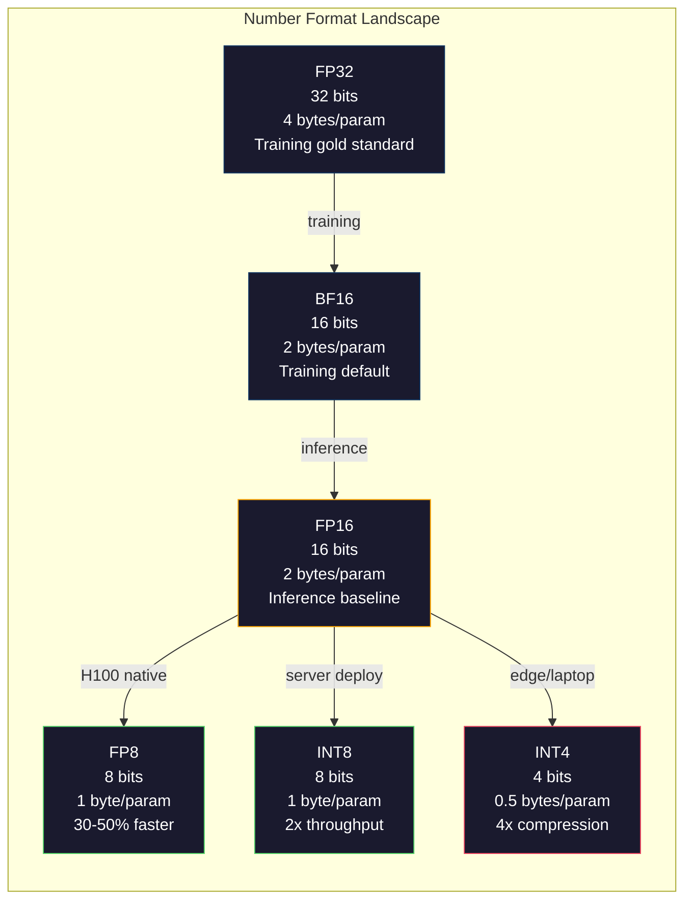
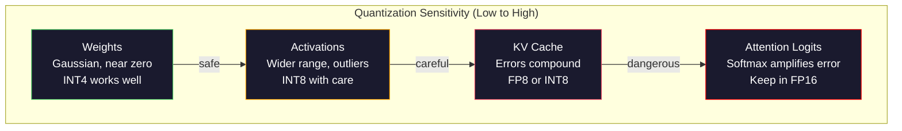
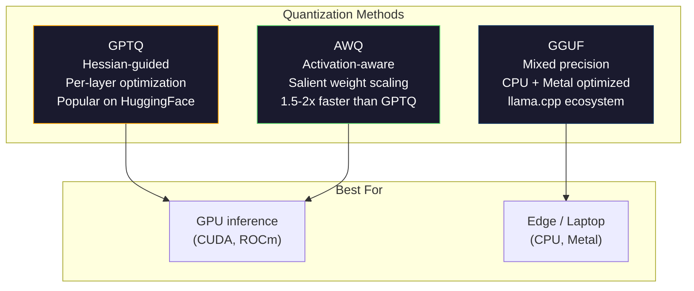

# Kwantyzacja: dopasowanie modeli

> Model 70B w FP16 wymaga 140 GB — dwa karty A100 tylko na wagi. Po kwantyzacji do FP8: jedna karta 80 GB. INT4: MacBook.

**Typ:** Kompilacja
**Języki:** Python (z numpy)
**Wymagania wstępne:** Faza 10, lekcje 01-10 (LLM od podstaw)
**Czas:** ~120 minut

## Cele nauczania

- Zaimplementuj kwantyzację symetryczną i asymetryczną w zakresie od FP16 do INT8 i INT4, uwzględniając skalowanie per-tensor i per-channel
- Oblicz oszczędności pamięci wynikające z kwantyzacji i określ, jaka precyzja mieści się w VRAM danej karty graficznej
- Wyjaśnij różnicę między kwantyzacją potreningową (PTQ) a treningiem ze świadomością kwantyzacji (QAT)
- Zastosuj GPTQ lub AWQ do kwantyzacji rzeczywistego modelu i zmierz kompromis między dokładnością a zużyciem pamięci w benchmarku

## Problem

Llama 3 70B ma 70 miliardów parametrów. Każdy parametr jest 16-bitową liczbą zmiennoprzecinkową, co daje łącznie 140 miliardów bajtów — 140 GB. Pojedyncza karta A100 ma 80 GB pamięci VRAM. Nie można nawet załadować wag, nie mówiąc już o uruchomieniu wnioskowania, na jednej karcie graficznej. Do obsługi tego modelu potrzeba dwóch A100 po 2 USD za godzinę każda.

Tymczasem 16 bitów na parametr to marnotrawstwo. Większość wag sieci neuronowej jest bliska zeru. Pełny zakres dynamiki FP16 (od 0,000000059 do 65 504) pozostaje niemal całkowicie niewykorzystany. Gdy zmierzymy rzeczywisty rozkład wag w Llamie 3 70B, okazuje się, że 95% z nich mieści się w przedziale od -0,1 do +0,1. Zużywa się 16 bitów na wartości, które spokojnie zmieszczą się w 4.

Kwantyzacja zastępuje liczby o wysokiej precyzji liczbami o niższej precyzji. Przejście z FP16 na FP8 zmniejsza zużycie pamięci o połowę. FP16 na INT4 — o trzy czwarte. Model, który zajmował 140 GB, teraz zajmuje 35 GB. Mieści się na pojedynczej konsumenckiej karcie graficznej. Przy agresywnej kwantyzacji 2-bitowej — stratnej, lecz przydatnej do wybranych zadań — ten sam model działa na laptopie z 16 GB RAM.

Ceną jest dokładność. Każdy utracony bit niszczy informację. Kluczowe pytanie brzmi: ile dokładności tracimy i w których miejscach. Dobrze skwantowany model INT4 zachowuje 95–99% jakości oryginału w większości benchmarków. Naiwna kwantyzacja do INT4 może natomiast całkowicie zniszczyć model. Różnica tkwi w technice.

Społecznościowe kwantyzacje Llamy 3 do INT4 z użyciem GPTQ wykazują utratę rzędu 1–2 punktów perplexity na WikiText. Mistral udostępnił checkpointy FP8 dla Mixtrala 8x22B bez mierzalnej utraty jakości na MMLU. Format GGUF jest obsługiwany przez llama.cpp, który umożliwia uruchamianie modeli 70B na MacBookach z układami serii M. Kwantyzacja to nie obejście problemu — to standardowa ścieżka wdrożenia każdego modelu większego niż 7B.

## Koncepcja

### Formaty liczb: rola każdego bitu

Każda liczba zmiennoprzecinkowa składa się z trzech części: znaku, wykładnika i mantysy. Bit znaku jest jeden. Wykładnik określa zakres (jak duże lub jak małe mogą być liczby). Mantysa określa precyzję (ile cyfr znaczących jest dostępnych).

```
FP32:  [1 sign] [8 exponent] [23 mantissa]  = 32 bits
FP16:  [1 sign] [5 exponent] [10 mantissa]  = 16 bits
BF16:  [1 sign] [8 exponent] [7  mantissa]  = 16 bits
FP8:   [1 sign] [4 exponent] [3  mantissa]  = 8  bits (E4M3)
FP8:   [1 sign] [5 exponent] [2  mantissa]  = 8  bits (E5M2)
INT8:  [1 sign] [7 value]                   = 8  bits (uniform steps)
INT4:  [1 sign] [3 value]                   = 4  bits (16 levels total)
```

**FP32** to pełna precyzja. 23 bity mantysy dają około 7 cyfr dziesiętnych. Zakres: od około 1,2 × 10^-38 do 3,4 × 10^38. Przez lata trening odbywał się wyłącznie w FP32. Format ten nadal znajduje zastosowanie przy akumulacji (sumy częściowe podczas mnożenia macierzy).

**FP16** dzieli liczbę bitów na pół. 10 bitów mantysy daje około 3,3 cyfry dziesiętnej. Wykładnik zmniejsza się do 5 bitów, radykalnie zawężając zakres (wartość maksymalna to około 65 504). Dla wag, które skupiają się blisko zera, jest to wystarczające — jednak aktywacje i gradienty podczas treningu mogą osiągać większe wartości. Trening w FP16 wymaga skalowania straty, aby zapobiec niedomiarowi.

**BF16** (Brain Float 16) zachowuje 8-bitowy wykładnik z FP32, redukując mantysę do 7 bitów. Oferuje ten sam zakres co FP32 przy nieco mniejszej precyzji niż FP16. Format ten zaprojektował Google specjalnie pod kątem głębokiego uczenia. Intuicja jest prosta: w sieciach neuronowych zakres ważniejszy jest od precyzji. Gradient rzędu 10^-20, który w FP16 zaokrągla się do zera, w BF16 jest reprezentowalny. Waga 0,07342 zaokrąglona do 0,0734 jest wystarczająco bliska. Każdy nowoczesny proces treningowy korzysta z BF16 lub mieszanki BF16/FP32.

**FP8** występuje w dwóch wariantach. E4M3 (4 bity wykładnika, 3 bity mantysy) stosuje się do wag i aktywacji podczas wnioskowania. E5M2 (5 bitów wykładnika, 2 bity mantysy) używany jest do gradientów podczas treningu, gdzie zakres jest ważniejszy od precyzji. Wnioskowanie FP8 na kartach H100 jest o 30–50% szybsze niż FP16 przy niemal zerowej utracie jakości.

**INT8** to format całkowitoliczbowy — bez wykładnika, bez mantysy. Dostępnych jest tylko 256 równomiernie rozmieszczonych wartości od -128 do 127. Aby odwzorować wagi zmiennoprzecinkowe na ten zakres, potrzebny jest współczynnik skali. Zaletą jest szybkość: arytmetyka liczb całkowitych jest wydajniejsza i mniej energochłonna niż zmiennoprzecinkowa. Mnożenie macierzy INT8 na A100 osiąga 624 TOPS, podczas gdy FP16 daje 312 TFLOPS.

**INT4** idzie jeszcze dalej. Zaledwie 16 możliwych wartości. Dobór współczynnika skali wymaga szczególnej staranności, a jakość wynikowa zależy całkowicie od sposobu jego wyznaczenia oraz od tego, które wagi są kwantowane. Nowoczesne metody INT4 — GPTQ i AWQ — zachowują ponad 95% oryginalnej jakości modelu.



### Jak działa kwantyzacja

Podstawowa operacja jest prosta. Pobieramy tensor wartości zmiennoprzecinkowych, wyznaczamy współczynnik skali, mnożymy przez niego wartości, zaokrąglamy do najbliższej liczby całkowitej, a następnie zapisujemy liczby całkowite wraz ze współczynnikiem.

**Kwantyzacja:**

```
scale = max(abs(tensor)) / max_int_value
quantized = round(tensor / scale)
```

**Dekwantyzacja:**

```
reconstructed = quantized * scale
```

Dla INT8 z zakresem symetrycznym (-127 do 127):

```
scale = max(abs(tensor)) / 127
quantized = clamp(round(tensor / scale), -128, 127)
```

Błąd kwantyzacji to błąd zaokrąglenia. Każda wartość może być przesunięta co najwyżej o `scale / 2`. Całkowity błąd w warstwie zależy od liczby wag i wrażliwości modelu na ich zaburzenia.

**Kwantyzacja per-tensor kontra per-channel.** Kwantyzacja per-tensor stosuje jeden współczynnik skali dla całej macierzy wag. Jest prosta, lecz stratna: jeśli jedna kolumna zawiera duże wartości, a inna małe, te drugie tracą większość precyzji. Kwantyzacja per-channel stosuje oddzielny współczynnik skali dla każdego kanału wyjściowego (wiersza lub kolumny macierzy wag). Narzut jest wyższy — przechowujemy N współczynników zamiast jednego — ale jakość znacznie lepsza. Każda produkcyjna metoda kwantyzacji stosuje granulację per-channel lub drobniejszą.

**Kwantyzacja asymetryczna** dodaje przesunięcie punktu zerowego: `quantized = round(tensor / scale) + zero_point`. Obsługuje tym samym rozkłady niesymetryczne względem zera. Przykładowo aktywacje ReLU są zawsze nieujemne. Kwantyzacja symetryczna marnuje połowę zakresu liczb całkowitych na wartości ujemne, które nigdy nie wystąpią. Kwantyzacja asymetryczna odwzorowuje rzeczywisty zakres [min, max] na pełny zakres całkowitoliczbowy.

### Hierarchia czułości

Nie wszystkie elementy modelu tolerują kwantyzację w równym stopniu. Można wyróżnić wyraźną hierarchię.

**Wagi (najmniej wrażliwe).** Wagi modeli zmieniają się powoli podczas treningu i mają w przybliżeniu rozkład Gaussa ze środkiem bliskim zeru. Dobrze poddają się kwantyzacji. Wagi INT8 ze skalami per-channel dają niemal bezstratne wyniki. INT4 wymaga bardziej zaawansowanych metod, ale jest wykonalne.

**Aktywacje (umiarkowana czułość).** Aktywacje to wartości pośrednie przepływające przez sieć podczas wnioskowania. Mają szerszy zakres dynamiczny niż wagi i zawierają wartości odstające. Pojedyncza głowica uwagi może generować aktywacje stukrotnie większe od średniej. Te wartości odstające są kluczowe dla jakości modelu — ich naiwna kwantyzacja niszczy informację. Rozwiązania to zachowanie wyższej precyzji dla kanałów odstających (LLM.int8()), bądź stosowanie skal per-token lub per-channel.

**Pamięć podręczna KV (wysoka czułość).** Pamięć podręczna klucz-wartość przechowuje stany uwagi dla wszystkich poprzednich tokenów. Przy długich kontekstach dominuje ona w zużyciu pamięci. Dla modelu 70B w kontekście 32K sama pamięć podręczna KV zajmuje 40 GB w FP16. Kwantyzacja do FP8 lub INT8 pozwala zaoszczędzić znaczną ilość pamięci, lecz błędy kwantyzacji wpływają na wszystkie kolejne obliczenia uwagi. Ich wpływ na jakość rośnie wraz z długością sekwencji.

**Logity uwagi (najbardziej wrażliwe).** Softmax zastosowany w mechanizmie uwagi jest bardzo czuły na drobne zmiany wejść. Błąd kwantyzacji wynoszący zaledwie 0,01 w logicie przed softmaxem może znacząco zmienić rozkład uwagi. Większość schematów kwantyzacji utrzymuje obliczenia uwagi w wyższej precyzji (FP16 lub BF16), nawet gdy pozostałe elementy są kwantowane.



### PTQ kontra QAT

**Kwantyzacja potreningowa (PTQ)** kwantyzuje już wytrenowany model bez ponownego uczenia. Pobieramy wagi FP16, obliczamy współczynniki skali, zaokrąglamy i wdrażamy. Jest szybka (od minut do godzin) i tania. Działa dobrze dla INT8 i FP8. Przy INT4 naiwne PTQ często zawodzi z powodu kumulujących się błędów zaokrąglenia. Zaawansowane metody PTQ — GPTQ i AWQ — korzystają z danych kalibracyjnych, aby zminimalizować błąd kwantyzacji.

**Trening ze świadomością kwantyzacji (QAT)** wstawia symulowane operacje kwantyzacji do przejścia w przód podczas uczenia. Model uczy się rozmieszczać wagi tak, by błędy zaokrąglenia były małe. Gradienty przepływają przez symulowaną kwantyzację za pomocą prostego estymatora STE (Straight-Through Estimator): operacja zaokrąglania jest traktowana tak, jakby miała gradient równy 1. QAT daje lepsze modele INT4 i INT2 niż PTQ, ale wymaga pełnego przebiegu treningowego. Google zastosował QAT przy wdrożeniu Gemini, a Meta przy wybranych wariantach Llamy.

| Aspekt | PTQ | QAT |
|--------|-----|-----|
| Koszt | Minuty do godzin | Pełny przebieg treningowy |
| Jakość w INT8 | Znakomita (< 0,1% straty) | Znakomita |
| Jakość w INT4 | Dobra z GPTQ/AWQ (strata 1–3%) | Lepsza (< 1% straty) |
| Jakość w INT2 | Słaba | Użyteczna do wybranych zadań |
| Dane kalibracyjne | 128–1024 przykłady | Pełny zestaw treningowy |
| Kiedy stosować | Wdrożenie, szybka iteracja | Maksymalna jakość przy niskiej szerokości bitowej |

### GPTQ, AWQ, GGUF

**GPTQ (kwantyzacja GPT)** to jednoetapowa metoda PTQ. Kwantyzuje wagi warstwa po warstwie, korzystając z małego zbioru kalibracyjnego (zazwyczaj 128 przykładów) do obliczenia hesjanu — informacji drugiego rzędu o tym, jak bardzo dane wyjściowe są wrażliwe na każdą wagę. Wagi uznane przez hesian za istotne są kwantowane z wyższą precyzją. GPTQ była pierwszą metodą, która uczyniła kwantyzację INT4 praktyczną dla LLM. Popularność GPTQ na Hugging Face zawdzięczamy użytkownikowi TheBloke, który udostępnił skwantowane wersje setek modeli.

**AWQ (kwantyzacja wagowa ze świadomością aktywacji)** opiera się na obserwacji, że niewielki ułamek wag (około 1%) jest nieproporcjonalnie ważny, ponieważ mnoży się przez duże wartości aktywacji. AWQ identyfikuje te kluczowe wagi za pomocą danych kalibracyjnych i skaluje je w górę przed kwantyzacją, odpowiednio skalując w dół powiązane aktywacje. Dzięki temu ważne wagi trafiają w zakres, gdzie kwantyzacja INT4 jest dokładna. AWQ zazwyczaj dorównuje jakości GPTQ lub ją nieznacznie przewyższa, a jednocześnie jest 1,5–2 razy szybsza w zastosowaniu.

**GGUF (GPT-Generated Unified Format)** to format pliku używany przez llama.cpp i jego ekosystem. Obsługuje kwantyzację mieszaną: różne warstwy mogą mieć różną szerokość bitową. Pierwsza i ostatnia warstwa (warstwa osadzeń i głowica wyjściowa) są zazwyczaj zachowywane z wyższą precyzją, natomiast warstwy środkowe otrzymują INT4 lub INT3. Pliki GGUF są samowystarczalne: wagi, tokenizator i metadane mieszczą się w jednym pliku. Format jest zoptymalizowany pod kątem wnioskowania na CPU i Apple Silicon, gdzie standardową ścieżką jest załadowanie całego modelu do pamięci i wykonanie mnożenia macierzy na procesorze lub Metal GPU. Wariant Q4_K_M to najpopularniejszy format kwantyzacji GGUF, oferujący dobry kompromis między jakością a rozmiarem.



### Pomiar jakości

Skąd wiemy, czy skwantowany model jest nadal wystarczająco dobry?

**Perplexity.** Najczęściej stosowana miara. Im niższa, tym lepiej. Obliczamy perplexity na zbiorze testowym (WikiText-2 to standard) zarówno dla modelu oryginalnego, jak i skwantowanego. Różnica pokazuje, ile informacji zniszczyła kwantyzacja. Reguły praktyczne: delta < 0,5 jest doskonała, 0,5–1,0 jest dobra, 1,0–2,0 jest akceptowalna dla większości zadań, a > 2,0 oznacza problem.

**Benchmarki zadaniowe.** Uruchamiamy skwantowany model na MMLU, HumanEval, GSM8K lub własnym zestawie ewaluacyjnym i porównujemy wyniki z oryginałem. Kwantyzacja wpływa nierównomiernie na różne zdolności modelu — zadania matematyczne i programistyczne są bardziej wrażliwe na utratę precyzji niż wiedza ogólna.

**Porównanie odpowiedzi.** Generujemy odpowiedzi obu modeli dla tych samych promptów i je zestawiamy. Podejście LLM-as-judge (lekcja 10) sprawdza się tu dobrze. Obliczamy współczynnik wygranych: dla jakiego ułamka promptów skwantowany model dorównuje oryginałowi lub go przewyższa.

**Opóźnienie i przepustowość.** Celem kwantyzacji są szybsze i tańsze modele. Mierzymy tokeny na sekundę, czas do pierwszego tokena i zużycie pamięci. Skwantowany model wolniejszy od oryginału jest pozbawiony sensu.

| Model | Format | Rozmiar | Perplexity (WikiText-2) | MMLU | Tokeny/s (A100) |
|-------|--------|---------|------------------------|------|-----------------|
| Llama 3 70B | FP16 | 140 GB | 3,12 | 79,5% | 38 |
| Llama 3 70B | FP8 | 70 GB | 3,14 | 79,3% | 55 |
| Llama 3 70B | GPTQ INT4 | 35 GB | 4,32 | 77,8% | 72 |
| Llama 3 70B | AWQ INT4 | 35 GB | 4,18 | 78,1% | 75 |
| Llama 3 70B | GGUF Q4_K_M | 40 GB | 4,25 | 77,9% | 28 (CPU) |

Widoczny wzorzec: FP8 jest niemal darmowy. INT4 kosztuje 1–2 punkty MMLU, lecz podwaja przepustowość i zmniejsza zużycie pamięci o połowę. Ten kompromis jest opłacalny w przypadku niemal każdego wdrożenia.

### Liczby rzeczywiste

FP16 do FP8 na H100: 30–50% przyspieszenia wnioskowania, utrata jakości poniżej 0,1%. To oczywisty wybór — każde wdrożenie na H100 powinno z niego korzystać.

FP16 do INT8 (LLM.int8()): 2-krotna redukcja pamięci, utrata jakości poniżej 0,5%. Podejście z mieszaną precyzją zachowuje wartości odstające w FP16, kwantując wszystko pozostałe do INT8.

FP16 do INT4 (GPTQ/AWQ): 4-krotna redukcja pamięci, utrata jakości 1–3% w zależności od modelu i metody. Umożliwia uruchamianie modeli 70B na jednej karcie 48 GB.

FP16 do INT4 (GGUF Q4_K_M): 3,5-krotna redukcja pamięci, utrata jakości 1–2%. Zoptymalizowany pod kątem wnioskowania na CPU. Model 70B w formacie Q4_K_M zajmuje około 40 GB i działa z prędkością 10–15 tokenów na sekundę na M3 Max z 64 GB RAM.

FP16 do INT2: 8-krotna redukcja pamięci, utrata jakości 5–15%. Nadaje się wyłącznie do wąsko zdefiniowanych zadań, w których można tolerować degradację. To obszar badań, a nie rozwiązanie gotowe do produkcji.

## Zbuduj to

### Krok 1: Reprezentacje formatów liczb

Zbuduj reprezentację każdego formatu na poziomie bitowym, aby dokładnie zobaczyć, co robią znak, wykładnik i mantysa.

```python
import numpy as np

def float_to_fp32_bits(value):
    bits = np.float32(value).view(np.uint32)
    sign = (bits >> 31) & 1
    exponent = (bits >> 23) & 0xFF
    mantissa = bits & 0x7FFFFF
    return {"sign": int(sign), "exponent": int(exponent), "mantissa": int(mantissa),
            "exponent_bits": format(int(exponent), '08b'),
            "mantissa_bits": format(int(mantissa), '023b'),
            "value": float(value),
            "actual_exponent": int(exponent) - 127}

def float_to_fp16_bits(value):
    fp16 = np.float16(value)
    bits = fp16.view(np.uint16)
    sign = (bits >> 15) & 1
    exponent = (bits >> 10) & 0x1F
    mantissa = bits & 0x3FF
    return {"sign": int(sign), "exponent": int(exponent), "mantissa": int(mantissa),
            "exponent_bits": format(int(exponent), '05b'),
            "mantissa_bits": format(int(mantissa), '010b'),
            "value": float(fp16),
            "actual_exponent": int(exponent) - 15}

def float_to_bf16_bits(value):
    fp32_bits = np.float32(value).view(np.uint32)
    bf16_bits = (fp32_bits >> 16).astype(np.uint16)
    sign = (bf16_bits >> 15) & 1
    exponent = (bf16_bits >> 7) & 0xFF
    mantissa = bf16_bits & 0x7F
    reconstructed = np.uint32(bf16_bits.astype(np.uint32) << 16).view(np.float32)
    return {"sign": int(sign), "exponent": int(exponent), "mantissa": int(mantissa),
            "exponent_bits": format(int(exponent), '08b'),
            "mantissa_bits": format(int(mantissa), '07b'),
            "value": float(reconstructed),
            "actual_exponent": int(exponent) - 127}

def simulate_fp8_e4m3(value):
    sign = 1 if value < 0 else 0
    abs_val = abs(value)
    max_val = 448.0
    abs_val = min(abs_val, max_val)
    if abs_val == 0:
        return {"sign": sign, "exponent": 0, "mantissa": 0, "value": 0.0,
                "exponent_bits": "0000", "mantissa_bits": "000"}
    exp = int(np.floor(np.log2(abs_val)))
    exp = max(-6, min(8, exp))
    mantissa_val = abs_val / (2.0 ** exp) - 1.0
    mantissa_quant = round(mantissa_val * 8) / 8
    mantissa_quant = max(0, min(0.875, mantissa_quant))
    reconstructed = (1.0 + mantissa_quant) * (2.0 ** exp)
    if sign:
        reconstructed = -reconstructed
    mantissa_int = int(round(mantissa_quant * 8))
    return {"sign": sign, "exponent": exp + 7, "mantissa": mantissa_int,
            "exponent_bits": format(exp + 7, '04b'),
            "mantissa_bits": format(mantissa_int, '03b'),
            "value": float(reconstructed),
            "actual_exponent": exp}

def display_format_comparison(value):
    fp32 = float_to_fp32_bits(value)
    fp16 = float_to_fp16_bits(value)
    bf16 = float_to_bf16_bits(value)
    fp8 = simulate_fp8_e4m3(value)

    print(f"\n  Value: {value}")
    print(f"  {'Format':<8} {'Stored Value':>14} {'Error':>12} {'Sign':>5} {'Exp Bits':>10} {'Man Bits':>25}")
    print(f"  {'-'*76}")
    print(f"  {'FP32':<8} {fp32['value']:>14.6f} {abs(fp32['value'] - value):>12.8f} {fp32['sign']:>5} {fp32['exponent_bits']:>10} {fp32['mantissa_bits']:>25}")
    print(f"  {'FP16':<8} {fp16['value']:>14.6f} {abs(fp16['value'] - value):>12.8f} {fp16['sign']:>5} {fp16['exponent_bits']:>10} {fp16['mantissa_bits']:>25}")
    print(f"  {'BF16':<8} {bf16['value']:>14.6f} {abs(bf16['value'] - value):>12.8f} {bf16['sign']:>5} {bf16['exponent_bits']:>10} {bf16['mantissa_bits']:>25}")
    print(f"  {'FP8e4m3':<8} {fp8['value']:>14.6f} {abs(fp8['value'] - value):>12.8f} {fp8['sign']:>5} {fp8['exponent_bits']:>10} {fp8['mantissa_bits']:>25}")
```

### Krok 2: Kwantyzacja symetryczna (per-tensor i per-channel)

Podstawowe operacje kwantyzacji. Wariant per-tensor stosuje jedną skalę dla całej macierzy, wariant per-channel — oddzielną skalę dla każdego wiersza lub kolumny.

```python
def quantize_symmetric(tensor, num_bits=8):
    qmin = -(2 ** (num_bits - 1))
    qmax = 2 ** (num_bits - 1) - 1
    abs_max = np.max(np.abs(tensor))
    if abs_max == 0:
        return np.zeros_like(tensor, dtype=np.int32), 1.0
    scale = abs_max / qmax
    quantized = np.clip(np.round(tensor / scale), qmin, qmax).astype(np.int32)
    return quantized, float(scale)

def dequantize_symmetric(quantized, scale):
    return quantized.astype(np.float64) * scale

def quantize_per_channel(tensor, num_bits=8, axis=0):
    qmin = -(2 ** (num_bits - 1))
    qmax = 2 ** (num_bits - 1) - 1

    if axis == 0:
        abs_max = np.max(np.abs(tensor), axis=1, keepdims=True)
    else:
        abs_max = np.max(np.abs(tensor), axis=0, keepdims=True)

    abs_max = np.where(abs_max == 0, 1.0, abs_max)
    scales = abs_max / qmax
    quantized = np.clip(np.round(tensor / scales), qmin, qmax).astype(np.int32)
    return quantized, scales.squeeze()

def dequantize_per_channel(quantized, scales, axis=0):
    if axis == 0:
        return quantized.astype(np.float64) * scales.reshape(-1, 1)
    else:
        return quantized.astype(np.float64) * scales.reshape(1, -1)

def quantize_asymmetric(tensor, num_bits=8):
    qmin = 0
    qmax = 2 ** num_bits - 1
    t_min = np.min(tensor)
    t_max = np.max(tensor)
    if t_max == t_min:
        return np.zeros_like(tensor, dtype=np.int32), 1.0, 0
    scale = (t_max - t_min) / (qmax - qmin)
    zero_point = int(np.round(qmin - t_min / scale))
    zero_point = max(qmin, min(qmax, zero_point))
    quantized = np.clip(np.round(tensor / scale + zero_point), qmin, qmax).astype(np.int32)
    return quantized, float(scale), int(zero_point)

def dequantize_asymmetric(quantized, scale, zero_point):
    return (quantized.astype(np.float64) - zero_point) * scale
```

### Krok 3: Pomiar jakości

Zmierz, ile informacji niszczy kwantyzacja. Obliczamy błąd średniokwadratowy, stosunek sygnału do szumu oraz podobieństwo cosinusowe między oryginalnymi a zrekonstruowanymi tensorami.

```python
def quantization_error(original, reconstructed):
    diff = original - reconstructed
    mse = float(np.mean(diff ** 2))
    rmse = float(np.sqrt(mse))
    max_error = float(np.max(np.abs(diff)))
    signal_power = float(np.mean(original ** 2))
    snr_db = 10 * np.log10(signal_power / max(mse, 1e-20))

    orig_flat = original.flatten()
    recon_flat = reconstructed.flatten()
    norm_orig = np.linalg.norm(orig_flat)
    norm_recon = np.linalg.norm(recon_flat)
    if norm_orig == 0 or norm_recon == 0:
        cosine_sim = 0.0
    else:
        cosine_sim = float(np.dot(orig_flat, recon_flat) / (norm_orig * norm_recon))

    return {"mse": mse, "rmse": rmse, "max_error": max_error,
            "snr_db": float(snr_db), "cosine_similarity": cosine_sim}

def compare_quantization_methods(tensor, num_bits=8):
    q_pt, s_pt = quantize_symmetric(tensor, num_bits)
    recon_pt = dequantize_symmetric(q_pt, s_pt)
    err_pt = quantization_error(tensor, recon_pt)

    q_pc, s_pc = quantize_per_channel(tensor, num_bits, axis=0)
    recon_pc = dequantize_per_channel(q_pc, s_pc, axis=0)
    err_pc = quantization_error(tensor, recon_pc)

    q_asym, s_asym, zp = quantize_asymmetric(tensor, num_bits)
    recon_asym = dequantize_asymmetric(q_asym, s_asym, zp)
    err_asym = quantization_error(tensor, recon_asym)

    print(f"\n  Quantization Comparison ({num_bits}-bit, tensor shape {tensor.shape}):")
    print(f"  {'Method':<20} {'MSE':>12} {'SNR (dB)':>10} {'Cosine Sim':>12} {'Max Error':>12}")
    print(f"  {'-'*68}")
    print(f"  {'Per-tensor sym':<20} {err_pt['mse']:>12.8f} {err_pt['snr_db']:>10.2f} {err_pt['cosine_similarity']:>12.8f} {err_pt['max_error']:>12.8f}")
    print(f"  {'Per-channel sym':<20} {err_pc['mse']:>12.8f} {err_pc['snr_db']:>10.2f} {err_pc['cosine_similarity']:>12.8f} {err_pc['max_error']:>12.8f}")
    print(f"  {'Asymmetric':<20} {err_asym['mse']:>12.8f} {err_asym['snr_db']:>10.2f} {err_asym['cosine_similarity']:>12.8f} {err_asym['max_error']:>12.8f}")

    return {"per_tensor": err_pt, "per_channel": err_pc, "asymmetric": err_asym}
```

### Krok 4: Przegląd szerokości bitowych

Kwantyzuj ten sam tensor przy różnych szerokościach bitowych (2, 3, 4, 8, 16) i mierz jakość na każdym poziomie. Pokazuje to dokładnie, gdzie pojawia się próg jakościowy.

```python
def bit_width_sweep(tensor):
    print(f"\n  Bit-Width Sweep (tensor shape {tensor.shape}):")
    print(f"  {'Bits':>6} {'Levels':>8} {'MSE':>14} {'SNR (dB)':>10} {'Cosine Sim':>12} {'Compression':>12}")
    print(f"  {'-'*64}")

    results = []
    for bits in [2, 3, 4, 8, 16]:
        q, s = quantize_per_channel(tensor, bits, axis=0)
        recon = dequantize_per_channel(q, s, axis=0)
        err = quantization_error(tensor, recon)
        levels = 2 ** bits
        compression = 32.0 / bits

        print(f"  {bits:>6} {levels:>8} {err['mse']:>14.8f} {err['snr_db']:>10.2f} {err['cosine_similarity']:>12.8f} {compression:>11.1f}x")
        results.append({"bits": bits, "levels": levels, "error": err, "compression": compression})

    return results
```

### Krok 5: Eksperyment z czułością

Symuluj kwantyzację różnych części transformatora i zmierz, które elementy są najbardziej wrażliwe. Pokazuje to hierarchię czułości: wagi < aktywacje < pamięć podręczna KV < uwaga.

```python
def simulate_transformer_layer(input_data, weights, kv_scale=1.0):
    hidden = input_data @ weights["qkv"]
    seq_len = hidden.shape[1]
    d_model = weights["qkv"].shape[1] // 3
    q, k, v = hidden[:, :, :d_model], hidden[:, :, d_model:2*d_model], hidden[:, :, 2*d_model:]

    attn_scores = (q @ k.transpose(0, 2, 1)) / np.sqrt(d_model) * kv_scale
    attn_max = np.max(attn_scores, axis=-1, keepdims=True)
    attn_exp = np.exp(attn_scores - attn_max)
    attn_weights = attn_exp / np.sum(attn_exp, axis=-1, keepdims=True)

    attn_output = attn_weights @ v
    output = attn_output @ weights["out"]
    return output, {"q": q, "k": k, "v": v, "attn_scores": attn_scores,
                    "attn_weights": attn_weights, "attn_output": attn_output}

def sensitivity_experiment(batch_size=2, seq_len=16, d_model=64, num_bits=8):
    np.random.seed(42)
    input_data = np.random.randn(batch_size, seq_len, d_model) * 0.1

    weights = {
        "qkv": np.random.randn(d_model, 3 * d_model) * (2.0 / d_model) ** 0.5,
        "out": np.random.randn(d_model, d_model) * (2.0 / d_model) ** 0.5,
    }

    baseline_output, baseline_internals = simulate_transformer_layer(input_data, weights)

    experiments = {}

    q_qkv, s_qkv = quantize_per_channel(weights["qkv"], num_bits, axis=0)
    q_out, s_out = quantize_per_channel(weights["out"], num_bits, axis=0)
    quantized_weights = {
        "qkv": dequantize_per_channel(q_qkv, s_qkv, axis=0),
        "out": dequantize_per_channel(q_out, s_out, axis=0),
    }
    weight_quant_output, _ = simulate_transformer_layer(input_data, quantized_weights)
    experiments["Weights only"] = quantization_error(baseline_output, weight_quant_output)

    _, fresh_internals = simulate_transformer_layer(input_data, weights)
    q_act, s_act = quantize_per_channel(
        fresh_internals["attn_output"].reshape(-1, d_model), num_bits, axis=0
    )
    quant_attn_out = dequantize_per_channel(q_act, s_act, axis=0).reshape(batch_size, seq_len, d_model)
    act_quant_output = quant_attn_out @ weights["out"]
    experiments["Activations only"] = quantization_error(baseline_output, act_quant_output)

    q_k, s_k = quantize_per_channel(fresh_internals["k"].reshape(-1, d_model), num_bits, axis=0)
    q_v, s_v = quantize_per_channel(fresh_internals["v"].reshape(-1, d_model), num_bits, axis=0)
    quant_k = dequantize_per_channel(q_k, s_k, axis=0).reshape(batch_size, seq_len, d_model)
    quant_v = dequantize_per_channel(q_v, s_v, axis=0).reshape(batch_size, seq_len, d_model)
    attn_scores_kv = (fresh_internals["q"] @ quant_k.transpose(0, 2, 1)) / np.sqrt(d_model)
    attn_max_kv = np.max(attn_scores_kv, axis=-1, keepdims=True)
    attn_exp_kv = np.exp(attn_scores_kv - attn_max_kv)
    attn_weights_kv = attn_exp_kv / np.sum(attn_exp_kv, axis=-1, keepdims=True)
    kv_quant_output = (attn_weights_kv @ quant_v) @ weights["out"]
    experiments["KV cache only"] = quantization_error(baseline_output, kv_quant_output)

    noise_scale = np.std(fresh_internals["attn_scores"]) * 0.05
    noisy_scores = fresh_internals["attn_scores"] + np.random.randn(*fresh_internals["attn_scores"].shape) * noise_scale
    noisy_max = np.max(noisy_scores, axis=-1, keepdims=True)
    noisy_exp = np.exp(noisy_scores - noisy_max)
    noisy_weights = noisy_exp / np.sum(noisy_exp, axis=-1, keepdims=True)
    attn_quant_output = (noisy_weights @ fresh_internals["v"]) @ weights["out"]
    experiments["Attention logits (5% noise)"] = quantization_error(baseline_output, attn_quant_output)

    print(f"\n  Sensitivity Experiment ({num_bits}-bit quantization):")
    print(f"  {'Component':<30} {'MSE':>14} {'SNR (dB)':>10} {'Cosine Sim':>12}")
    print(f"  {'-'*68}")
    for name, err in sorted(experiments.items(), key=lambda x: x[1]["mse"]):
        print(f"  {name:<30} {err['mse']:>14.8f} {err['snr_db']:>10.2f} {err['cosine_similarity']:>12.8f}")

    return experiments
```

### Krok 6: Symulowany GPTQ

GPTQ kwantyzuje jedną kolumnę na raz, korzystając z hesjanu do decydowania o rozkładzie błędu zaokrąglenia. Poniżej uproszczona wersja oddająca istotę metody: dane kalibracyjne służą do oceny ważności wag, a najmniej istotne są kwantowane agresywniej.

```python
def simulated_gptq(weight_matrix, calibration_inputs, num_bits=4):
    n_in, n_out = weight_matrix.shape
    qmin = -(2 ** (num_bits - 1))
    qmax = 2 ** (num_bits - 1) - 1

    H = np.zeros((n_in, n_in))
    for x in calibration_inputs:
        x = x.reshape(-1, 1) if x.ndim == 1 else x
        for row in range(x.shape[0]):
            xi = x[row].reshape(-1, 1)
            H += xi @ xi.T
    H /= len(calibration_inputs)
    H += np.eye(n_in) * 1e-4

    weight_importance = np.diag(H)

    quantized = np.zeros_like(weight_matrix, dtype=np.int32)
    scales = np.zeros(n_out)
    errors = np.zeros(n_out)

    W = weight_matrix.copy()

    for col in range(n_out):
        w_col = W[:, col]
        abs_max = np.max(np.abs(w_col))
        if abs_max == 0:
            scales[col] = 1.0
            continue
        scale = abs_max / qmax
        scales[col] = scale

        q_col = np.clip(np.round(w_col / scale), qmin, qmax).astype(np.int32)
        quantized[:, col] = q_col

        quant_error = w_col - q_col * scale
        errors[col] = np.sqrt(np.mean(quant_error ** 2))

        if col < n_out - 1:
            importance_weights = weight_importance / (np.max(weight_importance) + 1e-10)
            for next_col in range(col + 1, min(col + 4, n_out)):
                compensation = quant_error * importance_weights * 0.1
                W[:, next_col] += compensation

    return quantized, scales, {"column_errors": errors,
                               "mean_error": float(np.mean(errors)),
                               "max_error": float(np.max(errors))}

def dequantize_gptq(quantized, scales):
    result = np.zeros_like(quantized, dtype=np.float64)
    for col in range(quantized.shape[1]):
        result[:, col] = quantized[:, col] * scales[col]
    return result
```

### Krok 7: Symulacja AWQ

AWQ identyfikuje najważniejsze wagi — te, które mnożą się przez duże aktywacje — i chroni je poprzez skalowanie przed kwantyzacją.

```python
def simulated_awq(weight_matrix, calibration_inputs, num_bits=4, salient_fraction=0.01):
    n_in, n_out = weight_matrix.shape
    qmin = -(2 ** (num_bits - 1))
    qmax = 2 ** (num_bits - 1) - 1

    activation_magnitudes = np.zeros(n_in)
    for x in calibration_inputs:
        if x.ndim == 1:
            activation_magnitudes += np.abs(x)
        else:
            activation_magnitudes += np.mean(np.abs(x), axis=0)
    activation_magnitudes /= len(calibration_inputs)

    n_salient = max(1, int(n_in * salient_fraction))
    salient_indices = np.argsort(activation_magnitudes)[-n_salient:]

    scale_factors = np.ones(n_in)
    for idx in salient_indices:
        col_max = np.max(np.abs(weight_matrix[idx, :]))
        if col_max > 0:
            scale_factors[idx] = min(4.0, 1.0 / (col_max + 1e-8) * np.mean(np.abs(weight_matrix)))

    scaled_weights = weight_matrix * scale_factors.reshape(-1, 1)

    quantized, scales = quantize_per_channel(scaled_weights, num_bits, axis=0)
    dequantized = dequantize_per_channel(quantized, scales, axis=0)

    result = dequantized / scale_factors.reshape(-1, 1)

    err = quantization_error(weight_matrix, result)

    return result, {"salient_indices": salient_indices,
                    "scale_factors": scale_factors[salient_indices],
                    "error": err,
                    "n_salient": n_salient}
```

### Krok 8: Pełny potok

Połącz wszystko razem. Porównaj kwantyzację naiwną, per-channel, GPTQ i AWQ na tej samej macierzy wag.

```python
def full_quantization_comparison(d_in=256, d_out=512, num_bits=4, n_calibration=32):
    np.random.seed(42)

    weight = np.random.randn(d_in, d_out) * 0.02
    outlier_rows = np.random.choice(d_in, size=5, replace=False)
    weight[outlier_rows] *= 10

    calibration = [np.random.randn(8, d_in) * 0.1 for _ in range(n_calibration)]

    q_naive, s_naive = quantize_symmetric(weight, num_bits)
    recon_naive = dequantize_symmetric(q_naive, s_naive)
    err_naive = quantization_error(weight, recon_naive)

    q_pc, s_pc = quantize_per_channel(weight, num_bits, axis=0)
    recon_pc = dequantize_per_channel(q_pc, s_pc, axis=0)
    err_pc = quantization_error(weight, recon_pc)

    q_gptq, s_gptq, gptq_info = simulated_gptq(weight, calibration, num_bits)
    recon_gptq = dequantize_gptq(q_gptq, s_gptq)
    err_gptq = quantization_error(weight, recon_gptq)

    recon_awq, awq_info = simulated_awq(weight, calibration, num_bits)
    err_awq = awq_info["error"]

    print(f"\n  Full Quantization Comparison ({num_bits}-bit, {d_in}x{d_out} matrix)")
    print(f"  Matrix has {len(outlier_rows)} outlier rows (10x scale)")
    print()
    print(f"  {'Method':<20} {'MSE':>14} {'SNR (dB)':>10} {'Cosine Sim':>12}")
    print(f"  {'-'*58}")
    print(f"  {'Naive per-tensor':<20} {err_naive['mse']:>14.8f} {err_naive['snr_db']:>10.2f} {err_naive['cosine_similarity']:>12.8f}")
    print(f"  {'Per-channel':<20} {err_pc['mse']:>14.8f} {err_pc['snr_db']:>10.2f} {err_pc['cosine_similarity']:>12.8f}")
    print(f"  {'Simulated GPTQ':<20} {err_gptq['mse']:>14.8f} {err_gptq['snr_db']:>10.2f} {err_gptq['cosine_similarity']:>12.8f}")
    print(f"  {'Simulated AWQ':<20} {err_awq['mse']:>14.8f} {err_awq['snr_db']:>10.2f} {err_awq['cosine_similarity']:>12.8f}")

    test_input = np.random.randn(4, d_in) * 0.1
    baseline = test_input @ weight
    output_naive = test_input @ recon_naive
    output_pc = test_input @ recon_pc
    output_gptq = test_input @ recon_gptq
    output_awq = test_input @ recon_awq

    print(f"\n  End-to-End Output Error (matmul with test input):")
    print(f"  {'Method':<20} {'Output MSE':>14} {'Output Cosine':>14}")
    print(f"  {'-'*50}")
    for name, output in [("Naive", output_naive), ("Per-channel", output_pc),
                          ("GPTQ", output_gptq), ("AWQ", output_awq)]:
        out_err = quantization_error(baseline, output)
        print(f"  {name:<20} {out_err['mse']:>14.8f} {out_err['cosine_similarity']:>14.8f}")

    return {"naive": err_naive, "per_channel": err_pc, "gptq": err_gptq, "awq": err_awq}

def memory_calculator(num_params_billions, bits_per_param):
    bytes_per_param = bits_per_param / 8
    total_bytes = num_params_billions * 1e9 * bytes_per_param
    total_gb = total_bytes / (1024 ** 3)
    return total_gb

def print_memory_table():
    print("\n  Memory Requirements by Model and Precision:")
    print(f"  {'Model':<15} {'FP32':>8} {'FP16':>8} {'FP8':>8} {'INT8':>8} {'INT4':>8} {'INT2':>8}")
    print(f"  {'-'*64}")
    for name, params in [("7B", 7), ("13B", 13), ("34B", 34), ("70B", 70), ("405B", 405)]:
        fp32 = memory_calculator(params, 32)
        fp16 = memory_calculator(params, 16)
        fp8 = memory_calculator(params, 8)
        int8 = memory_calculator(params, 8)
        int4 = memory_calculator(params, 4)
        int2 = memory_calculator(params, 2)
        print(f"  {name:<15} {fp32:>7.1f}G {fp16:>7.1f}G {fp8:>7.1f}G {int8:>7.1f}G {int4:>7.1f}G {int2:>7.1f}G")

if __name__ == "__main__":
    np.random.seed(42)

    print("=" * 70)
    print("QUANTIZATION: MAKING MODELS FIT")
    print("=" * 70)

    print("\nSTEP 1: Number Format Comparison")
    print("-" * 50)
    for val in [0.1, 3.14159, -0.00073, 42.5, 0.0000012]:
        display_format_comparison(val)

    print("\n\nSTEP 2: Memory Requirements")
    print("-" * 50)
    print_memory_table()

    print("\n\nSTEP 3: Quantization Methods Comparison")
    print("-" * 50)
    weight_matrix = np.random.randn(128, 256) * 0.02
    weight_matrix[0] *= 15
    weight_matrix[42] *= 8
    compare_quantization_methods(weight_matrix, num_bits=8)
    compare_quantization_methods(weight_matrix, num_bits=4)

    print("\n\nSTEP 4: Bit-Width Sweep")
    print("-" * 50)
    sweep_tensor = np.random.randn(64, 128) * 0.05
    bit_width_sweep(sweep_tensor)

    print("\n\nSTEP 5: Sensitivity Experiment")
    print("-" * 50)
    print("\n  INT8:")
    sensitivity_experiment(num_bits=8)
    print("\n  INT4:")
    sensitivity_experiment(num_bits=4)

    print("\n\nSTEP 6: GPTQ vs AWQ vs Naive (INT4)")
    print("-" * 50)
    full_quantization_comparison(d_in=256, d_out=512, num_bits=4)

    print("\n\nSTEP 7: Distribution Analysis")
    print("-" * 50)
    np.random.seed(0)
    simulated_weights = np.random.randn(1000) * 0.02
    abs_vals = np.abs(simulated_weights)
    pct_in_range = np.mean(abs_vals < 0.1) * 100
    print(f"\n  Simulated weight distribution (1000 params, std=0.02):")
    print(f"  Weights in [-0.1, 0.1]: {pct_in_range:.1f}%")
    print(f"  Weights in [-0.05, 0.05]: {np.mean(abs_vals < 0.05) * 100:.1f}%")
    print(f"  Weights in [-0.01, 0.01]: {np.mean(abs_vals < 0.01) * 100:.1f}%")
    print(f"  Max absolute value: {np.max(abs_vals):.6f}")
    print(f"  Mean absolute value: {np.mean(abs_vals):.6f}")

    histogram = np.histogram(simulated_weights, bins=20)
    print(f"\n  Weight histogram:")
    max_count = max(histogram[0])
    for i in range(len(histogram[0])):
        bar_len = int(histogram[0][i] / max_count * 40)
        lo = histogram[1][i]
        hi = histogram[1][i + 1]
        print(f"  [{lo:>7.4f}, {hi:>7.4f}] {'#' * bar_len} ({histogram[0][i]})")

    print("\n\n" + "=" * 70)
    print("DONE")
    print("=" * 70)
```

## Użyj tego

### Kwantyzacja za pomocą AutoGPTQ

```python
# pip install auto-gptq transformers
# from auto_gptq import AutoGPTQForCausalLM, BaseQuantizeConfig
# from transformers import AutoTokenizer
#
# model_id = "meta-llama/Llama-3.1-8B"
# quantize_config = BaseQuantizeConfig(
#     bits=4,
#     group_size=128,
#     desc_act=False,
# )
#
# tokenizer = AutoTokenizer.from_pretrained(model_id)
# model = AutoGPTQForCausalLM.from_pretrained(model_id, quantize_config)
#
# calibration = [tokenizer(t, return_tensors="pt") for t in calibration_texts[:128]]
# model.quantize(calibration)
# model.save_quantized("llama-8b-gptq-int4")
```

### Kwantyzacja za pomocą AutoAWQ

```python
# pip install autoawq
# from awq import AutoAWQForCausalLM
# from transformers import AutoTokenizer
#
# model_id = "meta-llama/Llama-3.1-8B"
# model = AutoAWQForCausalLM.from_pretrained(model_id)
# tokenizer = AutoTokenizer.from_pretrained(model_id)
#
# model.quantize(tokenizer, quant_config={"zero_point": True, "q_group_size": 128, "w_bit": 4})
# model.save_quantized("llama-8b-awq-int4")
```

### Konwersja do GGUF

```bash
# pip install llama-cpp-python
# python convert_hf_to_gguf.py meta-llama/Llama-3.1-8B --outtype q4_k_m --outfile llama-8b-q4km.gguf
# llama-server -m llama-8b-q4km.gguf -c 4096 -ngl 99
```

### Serwowanie za pomocą vLLM

```python
# pip install vllm
# vllm serve model-awq --quantization awq --dtype half --max-model-len 8192
```

vLLM natywnie obsługuje modele AWQ i GPTQ. Realizuje dekwantyzację podczas mnożenia macierzy i korzysta z mechanizmu stronicowanej uwagi dla pamięci podręcznej KV. Dla FP8 na H100 należy dodać `--dtype float8_e4m3fn`.

## Wyślij to

Ta lekcja tworzy plik `outputs/skill-quantization.md` — strukturę decyzyjną pomagającą wybrać właściwą strategię kwantyzacji. Na podstawie rozmiaru modelu, docelowego sprzętu i wymagań jakościowych wskazuje odpowiedni format, metodę i kroki walidacji. Dokument obejmuje obliczenia budżetu pamięci, zalecenia dotyczące precyzji poszczególnych komponentów oraz przepisy wdrożeniowe dla vLLM, llama.cpp i TensorRT-LLM.

## Ćwiczenia

1. Zaimplementuj kwantyzację grupową. Zamiast jednej skali per-channel, zastosuj oddzielną skalę na każdą grupę 128 wag w obrębie kanału. Dokładnie tak działają GPTQ i AWQ. Porównaj rozmiary grup 32, 64, 128 i 256 na tej samej macierzy wag. Mniejsze grupy dają lepszą jakość, lecz zwiększają narzut pamięciowy ze względu na większą liczbę współczynników skali.

2. Zbuduj kwantyzer o mieszanej precyzji. Kwantyzuj pierwszą i ostatnią warstwę sieci wielowarstwowej do INT8, a warstwy środkowe do INT4. Porównaj kompleksową jakość wyjściową z jednolitym INT4 i INT8. Zmierz oszczędność pamięci w zestawieniu z wariantem całkowicie INT8.

3. Zaimplementuj prosty estymator STE do treningu ze świadomością kwantyzacji. Wstaw symulowane operacje kwantyzacji i dekwantyzacji w przejście w przód prostej sieci dwuwarstwowej trenowanej na zadaniu regresyjnym. Porównaj końcową stratę między modelem trenowanym normalnie i następnie poddanym PTQ do INT4 a modelem trenowanym od zera z użyciem QAT.

4. Zbuduj kwantyzer obsługujący wartości odstające, inspirowany LLM.int8(). Wykrywa kanały, w których amplituda aktywacji przekracza 6-krotność średniej. Zachowaj te kanały w FP16 i skwantuj pozostałe do INT8. Zmierz kompleksową jakość warstwy transformatora z kroku 5, stosując różne progi dla wartości odstających (3x, 6x, 10x).

5. Zbuduj panel jakości kwantyzacji. Dla danej macierzy wag oblicz i wyświetl: histogram rozkładu wag, rozkład błędu kwantyzacji, współczynniki skali per-channel, kanały o najgorszej kwantyzacji (z najwyższym błędem rekonstrukcji) oraz podobieństwo cosinusowe między oryginalnymi a skwantowanymi wyjściami dla 100 losowych wejść. Wskaż, które kanały powinny być zachowane z wyższą precyzją.

## Kluczowe terminy

| Termin | Co się mówi | Co to właściwie oznacza |
|--------|-------------|------------------------|
| FP16 | „Półprecyzja" | 16-bitowy float z 5 bitami wykładnika i 10 bitami mantysy, wartość maksymalna 65 504, standardowy format wnioskowania |
| BF16 | „Brain Float" | 16-bitowy float z 8 bitami wykładnika (ten sam zakres co FP32) i 7 bitami mantysy, zaprojektowany przez Google na potrzeby treningu |
| FP8 | „Ośmiobitowy float" | Dwa warianty: E4M3 (wnioskowanie, wyższa precyzja) i E5M2 (trening, szerszy zakres), natywnie obsługiwany na H100 |
| INT8 | „Ośmiobitowa liczba całkowita" | 256 równomiernie rozmieszczonych wartości od -128 do 127, wymaga współczynnika skali do odwzorowania z formatu zmiennoprzecinkowego |
| INT4 | „Czterobitowa liczba całkowita" | Zaledwie 16 poziomów, wymaga zaawansowanych metod (GPTQ, AWQ) dla zachowania jakości |
| Kwantyzacja per-channel | „Jedna skala na wiersz" | Oddzielny współczynnik skali dla każdego kanału wyjściowego zamiast jednego dla całego tensora — radykalnie zmniejsza błąd |
| GPTQ | „Metoda hesjanowa" | Kwantyzacja potreningowa z wykorzystaniem informacji drugiego rzędu do minimalizacji błędu wyjściowego, warstwa po warstwie |
| AWQ | „Ze świadomością aktywacji" | Skaluje kluczowe wagi (mnożone przez duże aktywacje) przed kwantyzacją, aby je chronić |
| GGUF | „Format llama.cpp" | Samowystarczalny plik modelu z warstwami o mieszanej precyzji, zoptymalizowany pod kątem wnioskowania na CPU i Apple Silicon |
| PTQ | „Kwantyzacja potreningowa" | Konwersja wag wytrenowanego modelu do niższej precyzji bez ponownego uczenia — szybka, lecz z ograniczeniami przy ekstremalnej kompresji |
| QAT | „Trening ze świadomością kwantyzacji" | Wstawianie symulowanej kwantyzacji w przejście w przód, aby model nauczył się tolerować zaokrąglenia przy INT4/INT2 |
| Dane kalibracyjne | „128 przykładów" | Mały zbiór danych przepuszczany przez model w celu obliczenia statystyk aktywacji potrzebnych do wyznaczenia współczynników skali |
| Współczynnik skali | „Mnożnik" | Przelicza między zakresem zmiennoprzecinkowym a całkowitoliczbowym: `float_val = int_val * scale` |
| Delta perplexity | „O ile gorzej" | Różnica perplexity między modelem oryginalnym a skwantowanym; delta < 0,5 jest doskonała, > 2,0 wskazuje na problem |

## Dalsze czytanie

– [Frantar i in., 2022 – „GPTQ: Accurate Post-Training Quantization for Generative Pre-trained Transformers"](https://arxiv.org/abs/2210.17323) – artykuł, w którym kwantyzacja INT4 stała się praktyczna dla LLM dzięki zaokrąglaniu wag sterowanemu hessianem
– [Lin i in., 2023 – „AWQ: Activation-aware Weight Quantization for LLM Compression and Acceleration"](https://arxiv.org/abs/2306.00978) – ochrona najważniejszych wag przez skalowanie przed kwantyzacją, dorównuje GPTQ lub go przewyższa
– [Dettmers i in., 2022 – „LLM.int8(): 8-bit Matrix Multiplication for Transformers at Scale"](https://arxiv.org/abs/2208.07339) – kwantyzacja INT8 z mieszaną precyzją zachowująca wartości odstające w FP16, umożliwiająca wnioskowanie bez utraty jakości
– [Xiao i in., 2023 – „SmoothQuant: Accurate and Efficient Post-Training Quantization for Large Language Models"](https://arxiv.org/abs/2211.10438) – przeniesienie trudności kwantyzacji z aktywacji na wagi na potrzeby wdrożenia W8A8
– [Micikevicius i in., 2022 – „FP8 Formats for Deep Learning"](https://arxiv.org/abs/2209.05433) – artykuł NVIDIA/ARM/Intel definiujący formaty E4M3 i E5M2, dostępne natywnie na H100
