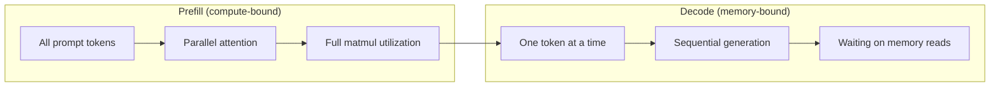
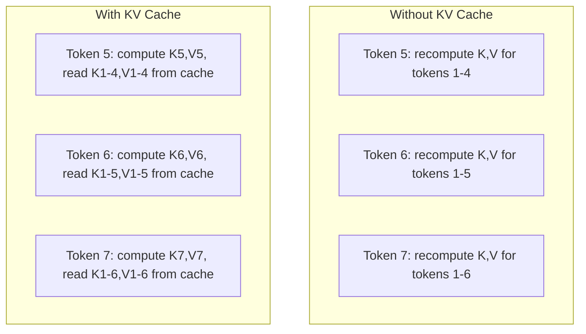
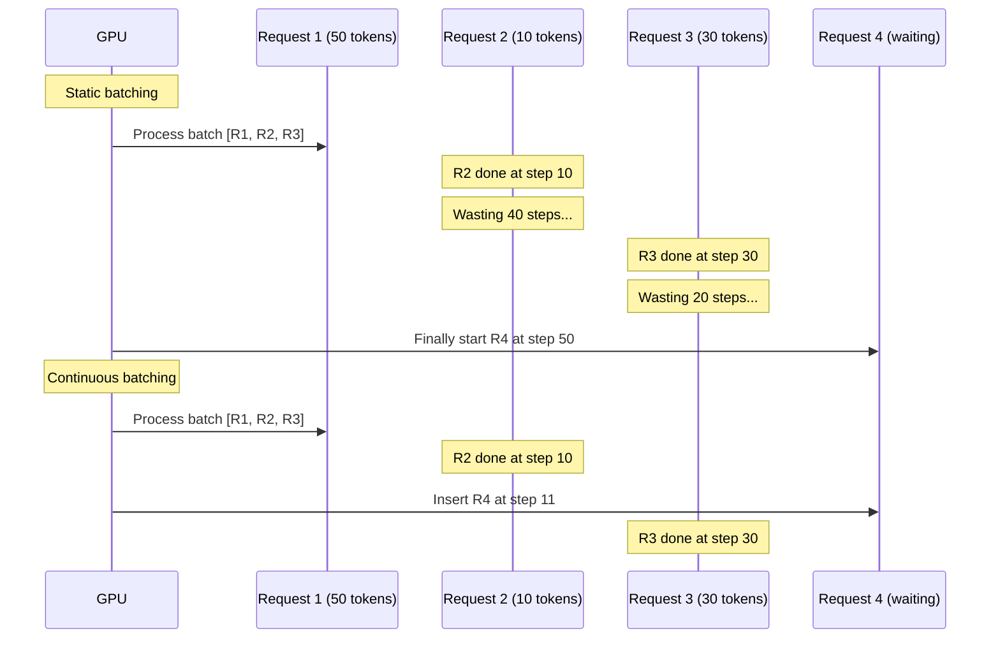
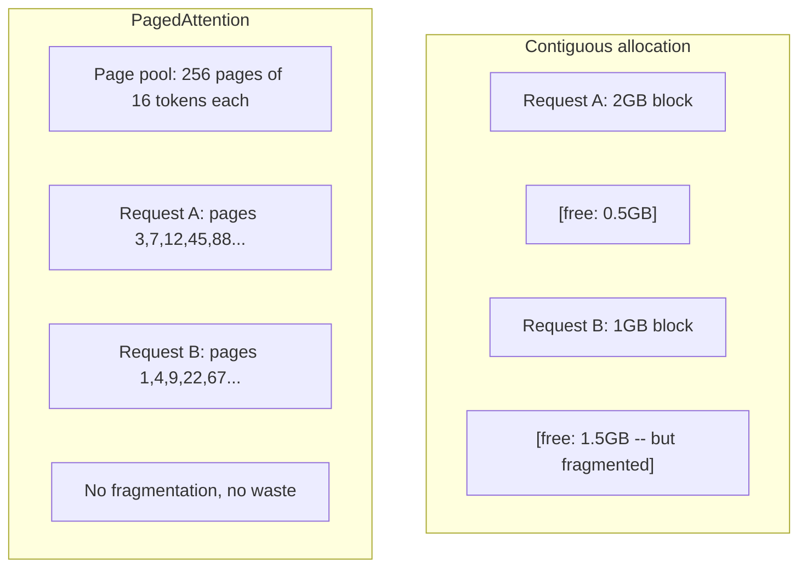
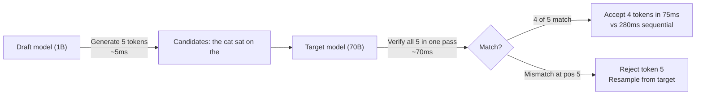

# Optymalizacja wnioskowania

> Dwie fazy definiują wnioskowanie LLM. Funkcja Prefill przetwarza monit równolegle — w oparciu o obliczenia. Dekodowanie generuje tokeny pojedynczo — powiązane z pamięcią. Każda optymalizacja ma na celu jeden lub oba.

**Typ:** Kompilacja
**Języki:** Python
**Wymagania wstępne:** Faza 10, lekcje 01-08 (architektura transformatora, uwaga)
**Czas:** ~120 minut

## Cele nauczania

- Zaimplementuj pamięć podręczną KV, aby wyeliminować zbędne obliczenia podczas generowania tokenu autoregresyjnego
- Wyjaśnij fazy wstępnego wypełniania i dekodowania wnioskowania LLM i dlaczego każdy z nich ma różne wąskie gardła (związane z obliczeniami i związane z pamięcią)
- Wdrażaj koncepcje ciągłego przetwarzania wsadowego i PagedAttention, aby zmaksymalizować wykorzystanie procesora graficznego w przypadku równoczesnych żądań
- Porównaj techniki optymalizacji wnioskowania (pamięć podręczna KV, dekodowanie spekulatywne, uwaga flash) i ich kompromisy w zakresie przepustowości/opóźnień

## Problem

Wdrażasz Llamę 3 70B na procesorach graficznych 4xA100. Pojedynczy użytkownik otrzymuje ~50 tokenów na sekundę. Czuje się szybko. Następnie 100 użytkowników jednocześnie trafiło do punktu końcowego. Przepustowość spada do 3 tokenów/sekundę/użytkownika. Twój rachunek za procesor graficzny wynoszący 25 000 USD miesięcznie zapewnia odpowiedzi wolniej niż u ludzi.

Sam model nie zmienia się pomiędzy 1 użytkownikiem a 100 użytkownikami. Te same wagi, ta sama architektura, ta sama matematyka. Zmienia się sposób planowania pracy. Naiwne wnioskowanie marnuje ponad 90% dostępnej mocy obliczeniowej procesora graficznego. Użytkownik oczekujący na token 47 trzyma cały slot wsadowy otwarty, podczas gdy magistrala pamięci GPU pozostaje bezczynna pomiędzy matmulami. Tymczasem monit nowego użytkownika zawierający 2000 tokenów może wypełnić ten martwy czas użytecznymi obliczeniami.

To nie jest problem ze skalowaniem. Jest to problem z harmonogramem. Techniki omówione w tej lekcji — buforowanie KV, ciągłe przetwarzanie wsadowe, PagedAttention, dekodowanie spekulatywne, buforowanie prefiksów — wyróżniają $25k/month inference bill from a $5k/miesiąc obsługujący ten sam ruch.

vLLM obsługujący Llama 3 70B na 4xA100-80GB osiąga ~50 tokenów/sekundę/użytkownika przy niskiej współbieżności i utrzymuje 15-25 TPS/użytkownika przy 100 jednoczesnych żądaniach dzięki ciągłemu przetwarzaniu wsadowemu i PagedAttention. Bez tych optymalizacji ten sam sprzęt obsługuje 5 TPS/użytkownika przy tej współbieżności. Te same procesory graficzne, ten sam model, 4x większa przepustowość.

## Koncepcja

### Wstępne wypełnienie a dekodowanie

Każde żądanie wnioskowania LLM ma dwie odrębne fazy.

**Wstępne wypełnienie** przetwarza cały monit o wprowadzenie danych. Wszystkie tokeny są znane, więc uwagę można obliczyć równolegle w całej sekwencji. Jest to duże mnożenie macierzy — rdzenie GPU pozostają zajęte. Wąskim gardłem są obliczenia: ile FLOPSów Twój sprzęt może dostarczyć na sekundę. A100 wykonuje 312 TFLOPS (BF16). Wstępne wypełnienie monitu zawierającego 4096 tokenów w modelu 70B zajmuje ~400 ms w przypadku pojedynczego A100.

**Dekodowanie** generuje tokeny wyjściowe pojedynczo. Każdy nowy token dotyczy wszystkich poprzednich tokenów, ale na jedno przejście w przód generowany jest tylko jeden token. Macierze wag mają taki sam rozmiar jak podczas wstępnego wypełniania, ale mnoży się je przez pojedynczy wektor zamiast macierzy. Rdzenie GPU kończą pracę w ciągu mikrosekund, a następnie czekają na przybycie kolejnej partii obciążników z pamięci. Wąskim gardłem jest przepustowość pamięci: szybkość przesyłania strumieniowego wag modeli z HBM do jednostek obliczeniowych. A100 ma przepustowość 2 TB/s. Model 70B w FP16 ma 140 GB. Jednorazowe odczytanie pełnego modelu zajmuje 70 ms — to tyle, ile potrzeba na pojedynczy krok dekodowania.



**Stosunek ops:bajt** (zwany także intensywnością arytmetyczną) uwzględnia ten kompromis. Mierzy liczbę operacji wykonywanych na bajt załadowany z pamięci.

```
ops:byte ratio = FLOPs per token / bytes read from memory
```

Podczas wstępnego napełniania partią 4096 tokenów wykonujesz ~4096 operacji mnożenia-akumulacji na załadowaną wagę. Stosunek jest wysoki — jesteś ograniczony obliczeniami. Podczas dekodowania z partią o wielkości 1 wykonujesz ~1 operację na załadowaną masę. Stosunek jest niski – jesteś ograniczony pamięcią.

Podstawowy spostrzeżenie: *dekodowanie jest powiązane z pamięcią, ponieważ czytasz cały model, aby wygenerować pojedynczy token*. Każda poniższa optymalizacja albo zmniejsza to, co czytasz, zwiększa liczbę tokenów przetwarzanych na odczyt, albo całkowicie unika odczytów.

### Pamięć podręczna KV

Podczas uwagi zapytanie każdego tokenu dotyczy wektorów klucza i wartości każdego poprzedniego tokenu. Bez buforowania wygenerowanie tokenu N wymaga ponownego obliczenia prognoz klucza i wartości dla wszystkich poprzedzających tokenów N-1. Token 1 zostanie wyświetlony podczas generowania tokenu 2, następnie ponownie dla tokenu 3, a następnie ponownie dla tokenu 4. Do 1000 żetonu wyświetliłeś token 1 w sumie 999 razy.

Pamięć podręczna KV przechowuje prognozy klucza i wartości ze wszystkich poprzednich tokenów. Generując token N, obliczasz tylko klucz i wartość dla tokenu N, a następnie łączysz je z buforowaną wartością K/V z tokenów od 1 do N-1.



**Wzór pamięci dla pamięci podręcznej KV:**

```
KV cache size = 2 * num_layers * num_kv_heads * head_dim * seq_len * bytes_per_param
```

Dla Lamy 3 70B (80 warstw, 8 głowic KV z GQA, head_dim=128, BF16):

```
per token: 2 * 80 * 8 * 128 * 2 bytes = 327,680 bytes = 320 KB
at 4,096 tokens: 320 KB * 4,096 = 1.28 GB
at 128K tokens: 320 KB * 131,072 = 40 GB
```

Pojedyncza rozmowa w kontekście 128 KB dla Llama 3 70B zużywa 40 GB pamięci podręcznej KV – czyli połowę pamięci A100. Przy 100 jednoczesnych użytkownikach po 4 tys. tokenów każdy, sama pamięć podręczna KV wymaga 128 GB. Właśnie dlatego zarządzanie pamięcią podręczną KV jest głównym wyzwaniem optymalizacji wnioskowania.

### Ciągłe dozowanie

Statyczne przetwarzanie wsadowe czeka, aż nadejdzie partia N żądań, przetwarza je razem i czeka, aż *wszystkie* zakończą się, zanim zaakceptują nowe żądania. Jeśli jedno żądanie potrzebuje 500 tokenów, a drugie 10, krótkie żądanie pozostaje bezczynne przez 490 kroków dekodowania po jego zakończeniu.

Ciągłe przetwarzanie wsadowe (zwane także przetwarzaniem wsadowym na poziomie iteracji) wstawia nowe żądania do partii natychmiast po zakończeniu dowolnego żądania. Partia jest ponownie oceniana na każdym etapie dekodowania. Żądanie, które kończy się po 10 żetonach, jest natychmiast zastępowane żądaniem oczekującym.



Poprawa przepustowości zależy od tego, jak bardzo różnią się długości wyjściowe. Przy jednakowych długościach dozowanie ciągłe odpowiada dozowaniu statycznemu. Przy zmiennych długościach (typowy przypadek) ciągłe przetwarzanie wsadowe może zapewnić 2–5 razy większą przepustowość, ponieważ gniazda procesora graficznego nigdy nie pozostają puste.

### PagedUwaga

Pamięć podręczna KV dla każdego żądania jest ciągłym blokiem pamięci. Gdy żądania przychodzą i odchodzą, powstają fragmenty pamięci — dokładnie tak samo jak fragmentacja pamięci RAM w systemach operacyjnych. Żądanie tokena 4K wymaga ciągłego 1,28 GB. Nawet jeśli masz łącznie 2 GB wolnego miejsca, możesz nie mieć 1,28 GB *ciągłego*. Albo marnujesz pamięć, albo odrzucasz żądanie.

PagedAttention (z vLLM) stosuje pamięć wirtualną w stylu systemu operacyjnego do pamięci podręcznej KV. Zamiast przydzielać jeden ciągły blok na żądanie, przydziela „strony” o stałym rozmiarze (zwykle po 16 tokenów). Strony mogą znajdować się w dowolnym miejscu fizycznej pamięci GPU. Tabela stron odwzorowuje logiczne pozycje sekwencji każdego żądania na fizyczne lokalizacje stron.



PagedAttention umożliwia także **kopiowanie przy zapisie** w przypadku współdzielonych prefiksów. Jeśli 50 żądań korzysta z tego samego podpowiedzi systemowej, strony pamięci podręcznej KV dla tego podpowiedzi systemowej są przechowywane jednorazowo i odwołują się do wszystkich 50 żądań. Tylko wtedy, gdy żądanie jest rozbieżne (różne komunikaty użytkownika), otrzymuje własne strony. Zmniejsza to radykalnie zużycie pamięci w przypadku aplikacji korzystających ze współdzielonych podpowiedzi systemowych.

vLLM zgłasza prawie zerowe straty pamięci (~4% w porównaniu z ~60-80% w przypadku alokacji naiwnej) za pośrednictwem PagedAttention.

### Dekodowanie spekulatywne

Dekodowanie jest powolne, ponieważ jest sekwencyjne — generujesz jeden token, przekazujesz go z powrotem i generujesz następny. A co jeśli uda Ci się tanio odgadnąć kolejnych 5 tokenów, a następnie zweryfikować je wszystkie na raz?

Dekodowanie spekulatywne wykorzystuje mały, szybki **model roboczy** do generowania K tokenów kandydatów. Duży **model docelowy** następnie przetwarza wszystkich K kandydatów w jednym przebiegu do przodu (który wygląda jak wstępne wypełnienie — równoległy, związany z obliczeniami i wydajny). Jeśli model docelowy zgadza się z przewidywaniami modelu draftu, akceptujesz wszystkie K żetonów w czasie jednego docelowego przejścia do przodu. Jeśli nie zgadza się na pozycji j, akceptujesz żetony od 1 do j-1, a resztę odrzucasz.



Przyspieszenie zależy od **współczynnika akceptacji** – tego, jak często przewidywania modelu roboczego odpowiadają wartościom docelowym. W przypadku wersji roboczej Llama 3 8B dla Lamy 3 70B typowe dla języka naturalnego są współczynniki akceptacji wynoszące 70–85%. Przekłada się to na 2-3-krotne przyspieszenie dekodowania.

Trzy podejścia do dekodowania spekulatywnego:

| Metoda | Źródło projektu | Wskaźnik akceptacji | Nad głową |
|------------|------------|----------------|---------|
| Projekt docelowy (Lewiatan i in.) | Oddzielny mały model | 70-85% | Projekt pamięci modelu |
| ORZEŁ (Li i in.) | Lekka głowa do celu | 75-90% | ~1% dodatkowych parametrów |
| Wyszukiwanie N-gramów | Tokenowa tabela n-gramów | 40-60% | Znikome |

**EAGLE** trenuje małą autoregresyjną głowę na ukrytych stanach modelu docelowego. Przewiduje osadzenie następnego tokena, korzystając z funkcji warstwy od drugiej do ostatniej w modelu docelowym. Ponieważ działa na własnych reprezentacjach modelu docelowego (a nie na oddzielnym modelu), osiąga wyższy współczynnik akceptacji przy minimalnej dodatkowej pamięci. EAGLE-2 dodaje dynamiczne drzewo wersji roboczej, które dostosowuje liczbę kandydatów w oparciu o kontekst.

**N-gramowe dekodowanie spekulatywne** utrzymuje tabelę n-gramowych kontynuacji z bieżącego kontekstu lub wstępnie utworzonego korpusu. Jeśli wersja robocza odpowiada temu, co pojawiło się wcześniej w tej samej konwersacji (powtarzające się wzorce, kod, uporządkowane dane wyjściowe), uruchamia się przy zerowym obciążeniu sieci neuronowej. Wskaźniki akceptacji są średnio niższe, ale koszt spekulacji jest zasadniczo bezpłatny.

Dekodowanie spekulatywne jest *matematycznie dokładne* — rozkład wyjściowy jest identyczny z rozkładem modelu docelowego. To nie jest przybliżenie. Etap weryfikacji zapewnia, że ​​każdy zaakceptowany token ma dokładnie takie prawdopodobieństwo, jakie przypisałby model docelowy.

### Buforowanie prefiksów

Wiele żądań ma ten sam przedrostek. Monit systemowy chatbota. Blok kontekstowy RAG. Przykładowy zestaw składający się z kilku strzałów. Bez buforowania prefiksów każde żądanie ponownie oblicza pamięć podręczną KV dla tych współdzielonych tokenów od podstaw.

Buforowanie prefiksów przechowuje pamięć podręczną KV dla typowych prefiksów i wykorzystuje ją ponownie w żądaniach. Gdy nadejdzie nowe żądanie ze znanym prefiksem, system kopiuje (lub odwołuje się) buforowane wpisy KV i oblicza KV tylko dla unikalnego sufiksu.

W przypadku monitu systemowego zawierającego 2000 tokenów współużytkowanego przez wszystkie żądania, buforowanie prefiksów eliminuje ~400 ms wstępnego wypełniania na żądanie. Przy 100 żądaniach na sekundę oszczędza to 40 sekund obliczeń procesora graficznego na sekundę — więcej niż praca jednego procesora graficznego.

RadixAttention SGLang implementuje buforowanie prefiksów za pomocą drzewa radix (trie), które indeksuje prefiksy według ich zawartości tokena. Każde żądanie pasujące do zapisanego prefiksu otrzymuje bezpłatnie pamięć podręczną KV. Drzewo umożliwia częściowe dopasowanie prefiksów — jeśli udostępnisz 1500 z 2000 tokenów prefiksów wpisowi w pamięci podręcznej, ponownie wykorzystasz te 1500 i przeliczysz tylko 500.

### Silniki wnioskowania

W produkcji LLM dominują trzy silniki obsługujące:

| Silnik | Kluczowa innowacja | Najlepsze dla |
|--------|-------------------|---------|
| vLLM | PagedUwaga, dozowanie ciągłe | Obsługa ogólnego przeznaczenia, najwyższa kompatybilność |
| SGLang | RadixAttention (buforowanie prefiksów), generowanie strukturalne | Chatboty wieloobrotowe, ograniczone dekodowanie |
| TensorRT-LLM | Fuzja jądra NVIDIA, kwantyzacja FP8 | Maksymalna przepustowość pojedynczego procesora graficznego na sprzęcie NVIDIA |

**vLLM** to domyślny punkt początkowy. Obsługuje najszerszą gamę modeli, działa na procesorach graficznych dowolnego dostawcy (NVIDIA, AMD, Intel) i osiąga wysoką przepustowość dzięki PagedAttention + ciągłemu przetwarzaniu wsadowemu. Interfejs API zgodny z OpenAI oznacza, że ​​możesz go zastosować jako zamiennik dowolnego wywołania API OpenAI.

**SGLang** opiera się na tych samych podstawach co vLLM, ale dodaje RadixAttention do buforowania prefiksów i język specyficzny dla domeny dla strukturalnych programów LLM. Jeśli Twoje obciążenie obejmuje wieloetapowe rozmowy, użycie narzędzi lub ograniczone dekodowanie (wyjście JSON, generowanie oparte na wyrażeniach regularnych), SGLang często przewyższa vLLM 2-5 razy dzięki ponownemu użyciu prefiksu.

**TensorRT-LLM** kompiluje modele w zoptymalizowane jądra GPU NVIDIA. Łączy operacje (uwaga + liniowość + aktywacja w jednym jądrze), wykorzystuje FP8 na procesorach graficznych H100 i integruje się z serwerem wnioskowania NVIDIA Triton w celu wdrożenia produkcyjnego. Osiąga najwyższą przepustowość pojedynczego procesora graficznego na sprzęcie NVIDIA, ale wymaga większej konfiguracji i działa tylko na procesorach graficznych NVIDIA.

Rzeczywiste liczby dla Lamy 3 70B (4xA100-80GB, BF16):

| Metryczne | vLLM | SGLang | TensorRT-LLM |
|------------|------|--------|-------------|
| Przepustowość (1 użytkownik) | ~50 TPS | ~55 TPS | ~65 TPS |
| Przepustowość (100 użytkowników) | ~2500 łącznie TPS | ~3200 łącznie TPS | ~3000 łącznie TPS |
| Czas na pierwszy token | ~400 ms | ~300ms (trafienie w prefiks) | ~350 ms |
| Maksymalny kontekst | 128 tys. | 128 tys. | 128 tys. |

### Struktura Ops:Byte

Nie możesz optymalizować tego, czego nie mierzysz. Stosunek ops:bajt informuje, czy jesteś ograniczony obliczeniami, czy pamięcią, co określa, które optymalizacje mają znaczenie.

```
Compute roof: peak FLOPS of the GPU
Memory roof:  peak bandwidth * ops:byte ratio
```

Gdy liczba ops:byte jest niska (dekodowanie, małe partie), osiągasz szczyt przepustowości pamięci. Dodanie większej mocy obliczeniowej (wyższy zegar, więcej rdzeni) nie pomaga. Musisz zmniejszyć odczyty pamięci (kwantyzacja, kompresja pamięci podręcznej KV) lub zwiększyć rozmiar partii, aby amortyzować odczyty w bardziej przydatnej pracy.

Gdy wartość ops:byte jest wysoka (wstępne wypełnienie, duże partie), trafiasz na dach obliczeniowy. Optymalizacja przepustowości pamięci nie pomaga. Potrzebujesz szybszych procesorów graficznych, fuzji jądra lub zmniejszonej precyzji, aby wycisnąć więcej FLOPS.

| Scenariusz | ops:bajt | Związany | Optymalizuj za pomocą |
|---------|----------|-------|--------------|
| Wstępne wypełnienie, partia=1 | ~4096 | Oblicz | Fuzja jądra, 8PR |
| Dekodowanie, partia=1 | ~1 | Pamięć | Kwantyzacja, kompresja KV |
| Dekodowanie, partia=32 | ~32 | Pamięć | Większa partia, ciągłe dozowanie |
| Dekodowanie, partia=256 | ~256 | Przejście | Obydwa mają znaczenie |
| Dekodowanie, partia=1024 | ~1024 | Oblicz | Fuzja jądra, równoległość tensorów |

Punkt przecięcia na A100 wynosi około ops:byte = 156 (312 TFLOPS / 2 TB/s). Poniżej 156 jesteś ograniczony pamięcią. Powyżej 156 jesteś ograniczony obliczeniami. Ciągłe grupowanie popycha dekodowanie w kierunku tego skrzyżowania, pakując więcej tokenów na iterację.

## Zbuduj to

### Krok 1: Pamięć podręczna KV od podstaw

Budujemy wielogłowicową pamięć podręczną KV, która przechowuje prognozy kluczy i wartości na warstwę, na głowicę i demonstruje wzorzec wzrostu pamięci.

```python
import numpy as np

class KVCache:
    def __init__(self, num_layers, num_heads, head_dim, max_seq_len, dtype=np.float16):
        self.num_layers = num_layers
        self.num_heads = num_heads
        self.head_dim = head_dim
        self.max_seq_len = max_seq_len
        self.dtype = dtype

        self.k_cache = np.zeros(
            (num_layers, num_heads, max_seq_len, head_dim), dtype=dtype
        )
        self.v_cache = np.zeros(
            (num_layers, num_heads, max_seq_len, head_dim), dtype=dtype
        )
        self.seq_len = 0

    def update(self, layer_idx, new_keys, new_values):
        num_new = new_keys.shape[1]
        end = self.seq_len + num_new
        self.k_cache[layer_idx, :, self.seq_len:end, :] = new_keys
        self.v_cache[layer_idx, :, self.seq_len:end, :] = new_values
        return (
            self.k_cache[layer_idx, :, :end, :],
            self.v_cache[layer_idx, :, :end, :]
        )

    def advance(self, num_tokens):
        self.seq_len += num_tokens

    def memory_bytes(self):
        return self.k_cache.nbytes + self.v_cache.nbytes

    def used_bytes(self):
        per_token = 2 * self.num_layers * self.num_heads * self.head_dim * np.dtype(self.dtype).itemsize
        return per_token * self.seq_len
```

### Krok 2: Uwaga z pamięcią podręczną KV

Uproszczona uwaga wielogłowicowa, która wykorzystuje pamięć podręczną KV do etapów dekodowania.

```python
def scaled_dot_product_attention(query, keys, values):
    head_dim = query.shape[-1]
    scores = np.matmul(query, keys.transpose(0, 1, 3, 2)) / np.sqrt(head_dim)
    seq_len_q = scores.shape[-2]
    seq_len_k = scores.shape[-1]
    if seq_len_q > 1:
        mask = np.triu(np.ones((seq_len_q, seq_len_k), dtype=np.float32), k=seq_len_k - seq_len_q + 1)
        scores = scores + mask * (-1e9)
    max_scores = np.max(scores, axis=-1, keepdims=True)
    exp_scores = np.exp(scores - max_scores)
    attn_weights = exp_scores / np.sum(exp_scores, axis=-1, keepdims=True)
    return np.matmul(attn_weights, values)

class MultiHeadAttention:
    def __init__(self, d_model, num_heads):
        self.num_heads = num_heads
        self.head_dim = d_model // num_heads
        scale = np.sqrt(2.0 / d_model)
        self.W_q = np.random.randn(d_model, d_model).astype(np.float32) * scale
        self.W_k = np.random.randn(d_model, d_model).astype(np.float32) * scale
        self.W_v = np.random.randn(d_model, d_model).astype(np.float32) * scale
        self.W_o = np.random.randn(d_model, d_model).astype(np.float32) * scale

    def forward(self, x, kv_cache=None, layer_idx=0):
        batch, seq_len, d_model = x.shape
        Q = np.matmul(x, self.W_q).reshape(batch, seq_len, self.num_heads, self.head_dim).transpose(0, 2, 1, 3)
        K = np.matmul(x, self.W_k).reshape(batch, seq_len, self.num_heads, self.head_dim).transpose(0, 2, 1, 3)
        V = np.matmul(x, self.W_v).reshape(batch, seq_len, self.num_heads, self.head_dim).transpose(0, 2, 1, 3)

        if kv_cache is not None:
            K_full, V_full = kv_cache.update(layer_idx, K[0], V[0])
            K = K_full[np.newaxis, :, :, :]
            V = V_full[np.newaxis, :, :, :]
            if seq_len == 1:
                kv_cache.advance(1)

        attn_out = scaled_dot_product_attention(Q, K, V)
        attn_out = attn_out.transpose(0, 2, 1, 3).reshape(batch, -1, d_model)
        return np.matmul(attn_out, self.W_o)
```

### Krok 3: Symulator ciągłego dozowania

Symuluje to różnicę w harmonogramie między statycznym i ciągłym przetwarzaniem wsadowym.

```python
import heapq

class Request:
    def __init__(self, request_id, prompt_tokens, output_tokens, arrival_step):
        self.request_id = request_id
        self.prompt_tokens = prompt_tokens
        self.output_tokens = output_tokens
        self.arrival_step = arrival_step
        self.tokens_generated = 0
        self.start_step = None
        self.end_step = None

    def is_done(self):
        return self.tokens_generated >= self.output_tokens

def simulate_static_batching(requests, batch_size):
    step = 0
    completed = []
    queue = list(requests)
    queue.sort(key=lambda r: r.arrival_step)

    while queue:
        batch = []
        while queue and len(batch) < batch_size:
            r = queue.pop(0)
            r.start_step = max(step, r.arrival_step)
            batch.append(r)

        if batch:
            step = max(step, max(r.start_step for r in batch))
            max_output = max(r.output_tokens for r in batch)
            for r in batch:
                r.tokens_generated = r.output_tokens
                r.end_step = step + max_output
            step += max_output
            completed.extend(batch)

    return completed

def simulate_continuous_batching(requests, batch_size):
    step = 0
    completed = []
    queue = sorted(requests, key=lambda r: r.arrival_step)
    queue_idx = 0
    active = []
    waiting = []

    while queue_idx < len(queue) or active or waiting:
        while queue_idx < len(queue) and queue[queue_idx].arrival_step <= step:
            waiting.append(queue[queue_idx])
            queue_idx += 1

        while waiting and len(active) < batch_size:
            r = waiting.pop(0)
            r.start_step = step
            active.append(r)

        if not active:
            if waiting:
                step += 1
                continue
            elif queue_idx < len(queue):
                step = queue[queue_idx].arrival_step
                continue
            else:
                break

        for r in active:
            r.tokens_generated += 1

        done = [r for r in active if r.is_done()]
        for r in done:
            r.end_step = step + 1
            completed.append(r)
        active = [r for r in active if not r.is_done()]

        step += 1

    return completed

def batching_stats(completed):
    latencies = [r.end_step - r.arrival_step for r in completed]
    total_time = max(r.end_step for r in completed) - min(r.arrival_step for r in completed)
    total_tokens = sum(r.output_tokens for r in completed)
    return {
        "avg_latency": np.mean(latencies),
        "p50_latency": np.median(latencies),
        "p99_latency": np.percentile(latencies, 99),
        "total_time": total_time,
        "throughput": total_tokens / total_time if total_time > 0 else 0,
    }
```

### Krok 4: Pamięć podręczna prefiksów

Pamięć podręczna prefiksów oparta na trie, która przechowuje wpisy KV dla współdzielonych prefiksów.

```python
class TrieNode:
    def __init__(self):
        self.children = {}
        self.kv_data = None
        self.hit_count = 0

class PrefixCache:
    def __init__(self, max_entries=1000):
        self.root = TrieNode()
        self.max_entries = max_entries
        self.total_entries = 0
        self.hits = 0
        self.misses = 0

    def _walk(self, token_ids):
        node = self.root
        depth = 0
        for tid in token_ids:
            if tid not in node.children:
                break
            node = node.children[tid]
            depth += 1
        return node, depth

    def lookup(self, token_ids):
        node, depth = self._walk(token_ids)
        if depth > 0:
            self.hits += 1
            current = self.root
            for tid in token_ids[:depth]:
                current = current.children[tid]
                current.hit_count += 1
            kv_entries = []
            current = self.root
            for tid in token_ids[:depth]:
                current = current.children[tid]
                if current.kv_data is not None:
                    kv_entries.append(current.kv_data)
            return depth, kv_entries
        self.misses += 1
        return 0, []

    def insert(self, token_ids, kv_per_token):
        node = self.root
        for i, tid in enumerate(token_ids):
            if tid not in node.children:
                if self.total_entries >= self.max_entries:
                    return i
                node.children[tid] = TrieNode()
                self.total_entries += 1
            node = node.children[tid]
            if i < len(kv_per_token):
                node.kv_data = kv_per_token[i]
        return len(token_ids)

    def hit_rate(self):
        total = self.hits + self.misses
        return self.hits / total if total > 0 else 0.0
```

### Krok 5: Spekulacyjny symulator dekodowania

Symulujemy spekulatywne dekodowanie docelowej wersji roboczej z konfigurowalnymi współczynnikami akceptacji.

```python
class DraftModel:
    def __init__(self, vocab_size, acceptance_rate=0.8):
        self.vocab_size = vocab_size
        self.acceptance_rate = acceptance_rate

    def generate(self, context, num_tokens):
        tokens = np.random.randint(0, self.vocab_size, size=num_tokens)
        return tokens

    def get_probs(self, context, token):
        probs = np.random.dirichlet(np.ones(self.vocab_size))
        return probs

class TargetModel:
    def __init__(self, vocab_size):
        self.vocab_size = vocab_size

    def get_probs(self, context, tokens=None):
        if tokens is not None:
            return [np.random.dirichlet(np.ones(self.vocab_size)) for _ in tokens]
        return np.random.dirichlet(np.ones(self.vocab_size))

def speculative_decode(draft_model, target_model, context, num_speculative=5,
                       draft_cost=1.0, target_cost=10.0, verify_cost=12.0):
    total_tokens = 0
    total_cost = 0.0
    accepted_counts = []
    context = list(context)

    max_tokens = 100

    while total_tokens < max_tokens:
        draft_tokens = draft_model.generate(context, num_speculative)
        total_cost += draft_cost * num_speculative

        target_probs = target_model.get_probs(context, draft_tokens)
        total_cost += verify_cost

        accepted = 0
        for i, token in enumerate(draft_tokens):
            draft_p = draft_model.get_probs(context + list(draft_tokens[:i]), token)
            target_p = target_probs[i]

            r = np.random.random()
            acceptance_prob = min(1.0, target_p[token] / (draft_p[token] + 1e-10))

            if r < draft_model.acceptance_rate:
                accepted += 1
                context.append(token)
                total_tokens += 1
            else:
                new_token = np.random.choice(draft_model.vocab_size, p=target_p)
                context.append(new_token)
                total_tokens += 1
                break

        accepted_counts.append(accepted)

        if accepted == num_speculative:
            bonus_probs = target_model.get_probs(context)
            bonus_token = np.random.choice(draft_model.vocab_size, p=bonus_probs)
            context.append(bonus_token)
            total_tokens += 1

    sequential_cost = total_tokens * target_cost
    return {
        "total_tokens": total_tokens,
        "speculative_cost": total_cost,
        "sequential_cost": sequential_cost,
        "speedup": sequential_cost / total_cost if total_cost > 0 else 1.0,
        "avg_accepted": np.mean(accepted_counts),
        "acceptance_rate": np.mean(accepted_counts) / num_speculative,
    }

def compare_speculation_strategies(vocab_size=1000, num_trials=20):
    results = {}

    for name, acceptance_rate, spec_tokens in [
        ("Draft-target (8B->70B)", 0.78, 5),
        ("EAGLE", 0.85, 6),
        ("N-gram", 0.50, 4),
        ("No speculation", 0.0, 0),
    ]:
        if spec_tokens == 0:
            results[name] = {
                "speedup": 1.0,
                "acceptance_rate": 0.0,
                "avg_accepted": 0.0,
            }
            continue

        trial_results = []
        for _ in range(num_trials):
            draft = DraftModel(vocab_size, acceptance_rate=acceptance_rate)
            target = TargetModel(vocab_size)
            context = list(np.random.randint(0, vocab_size, size=10))
            result = speculative_decode(draft, target, context, num_speculative=spec_tokens)
            trial_results.append(result)

        results[name] = {
            "speedup": np.mean([r["speedup"] for r in trial_results]),
            "acceptance_rate": np.mean([r["acceptance_rate"] for r in trial_results]),
            "avg_accepted": np.mean([r["avg_accepted"] for r in trial_results]),
        }

    return results
```

### Krok 6: Profiler pamięci podręcznej KV

Oblicz wymagania dotyczące pamięci podręcznej KV dla konfiguracji modelu rzeczywistego.

```python
MODEL_CONFIGS = {
    "Llama-3-8B": {
        "num_layers": 32, "num_kv_heads": 8, "head_dim": 128,
        "model_params_b": 8, "gqa": True,
    },
    "Llama-3-70B": {
        "num_layers": 80, "num_kv_heads": 8, "head_dim": 128,
        "model_params_b": 70, "gqa": True,
    },
    "Llama-3-405B": {
        "num_layers": 126, "num_kv_heads": 8, "head_dim": 128,
        "model_params_b": 405, "gqa": True,
    },
    "Mistral-7B": {
        "num_layers": 32, "num_kv_heads": 8, "head_dim": 128,
        "model_params_b": 7, "gqa": True,
    },
    "GPT-4-est": {
        "num_layers": 120, "num_kv_heads": 96, "head_dim": 128,
        "model_params_b": 1800, "gqa": False,
    },
}

def kv_cache_memory(config, seq_len, dtype_bytes=2):
    per_token = 2 * config["num_layers"] * config["num_kv_heads"] * config["head_dim"] * dtype_bytes
    total = per_token * seq_len
    return {
        "per_token_bytes": per_token,
        "per_token_kb": per_token / 1024,
        "total_bytes": total,
        "total_mb": total / (1024 ** 2),
        "total_gb": total / (1024 ** 3),
    }

def memory_budget(config, gpu_memory_gb, model_dtype_bytes=2, kv_dtype_bytes=2):
    model_memory_gb = config["model_params_b"] * 1e9 * model_dtype_bytes / (1024 ** 3)
    overhead_gb = gpu_memory_gb * 0.1
    available_for_kv = gpu_memory_gb - model_memory_gb - overhead_gb

    if available_for_kv <= 0:
        return {"error": "Model does not fit in GPU memory", "model_memory_gb": model_memory_gb}

    per_token = 2 * config["num_layers"] * config["num_kv_heads"] * config["head_dim"] * kv_dtype_bytes
    max_tokens = int(available_for_kv * (1024 ** 3) / per_token)

    return {
        "gpu_memory_gb": gpu_memory_gb,
        "model_memory_gb": round(model_memory_gb, 1),
        "overhead_gb": round(overhead_gb, 1),
        "available_for_kv_gb": round(available_for_kv, 1),
        "max_total_tokens": max_tokens,
        "max_users_at_2k": max_tokens // 2048,
        "max_users_at_4k": max_tokens // 4096,
        "max_users_at_32k": max_tokens // 32768,
    }
```

## Użyj tego

Z vLLM:

```python
from vllm import LLM, SamplingParams

llm = LLM(
    model="meta-llama/Llama-3-70B-Instruct",
    tensor_parallel_size=4,
    enable_prefix_caching=True,
    max_model_len=8192,
    gpu_memory_utilization=0.9,
)

params = SamplingParams(temperature=0.7, max_tokens=256)
outputs = llm.generate(["Explain inference optimization in one paragraph."], params)
```

Z SGLang do buforowania prefiksów + wyjście strukturalne:

```python
import sglang as sgl

@sgl.function
def classify(s, text):
    s += sgl.system("You are a classifier. Output JSON only.")
    s += sgl.user(f"Classify this text: {text}")
    s += sgl.assistant(sgl.gen("result", regex=r'\{"label": "(positive|negative|neutral)"\}'))

runtime = sgl.Runtime(model_path="meta-llama/Llama-3-70B-Instruct", tp_size=4)
sgl.set_default_backend(runtime)

results = classify.run_batch([
    {"text": "This product is amazing!"},
    {"text": "Terrible experience."},
    {"text": "It was okay I guess."},
])
```

Z TensorRT-LLM:

```python
import tensorrt_llm
from tensorrt_llm.runtime import ModelRunner

runner = ModelRunner.from_dir("./llama-70b-trt-engine/", rank=0)

outputs = runner.generate(
    batch_input_ids=[tokenizer.encode("Explain KV caching.")],
    max_new_tokens=256,
    temperature=0.7,
)
```

## Wyślij to

Ta lekcja daje:
- `outputs/skill-inference-optimization.md` – umiejętność diagnozowania i optymalizowania obsługi wnioskowania LLM

## Ćwiczenia

1. Zmodyfikuj profiler pamięci podręcznej KV, aby porównać kwantyzację pamięci podręcznej KV FP16, FP8 i INT4. W przypadku Lamy 3 70B w kontekście 4K oblicz maksymalną liczbę jednoczesnych użytkowników dla każdego z nich na 4xA100-80GB. Kwantyzacja KV do INT4 powinna w przybliżeniu czterokrotnie zwiększyć pojemność użytkownika.

2. Rozszerz symulator ciągłego przetwarzania wsadowego, aby śledzić wykorzystanie procesora graficznego (część gniazd wsadowych wypełnionych na krok). Wykres wykorzystania w czasie zarówno w przypadku statycznego, jak i ciągłego przetwarzania wsadowego z 50 żądaniami, których długości wyjściowe są zgodne z rozkładem Pareto (kształt=1,5, skala=20). Ciągłe dozowanie powinno utrzymywać wykorzystanie >80%.

3. Zaimplementuj wersję pamięci podręcznej KV z obsługą zapytań grupowych (GQA), gdzie `num_kv_heads < num_query_heads`. Lama 3 70B wykorzystuje 64 głowice zapytań, ale tylko 8 głowic KV. Oblicz oszczędność pamięci w porównaniu z pełną uwagą wielu głowic (8-krotne zmniejszenie rozmiaru pamięci podręcznej KV).

4. Zbuduj pamięć podręczną prefiksów, która korzysta z eksmisji LRU. Ustaw max_entries na 500 i wygeneruj 1000 żądań, z których 60% ma jeden z 5 wspólnych przedrostków. Zmierz współczynnik trafień i porównaj z nieograniczoną pamięcią podręczną. Przy dobrej eksmisji wskaźnik trafień powinien pozostać powyżej 55%.

5. Rozszerz symulator dekodowania spekulatywnego, aby zaimplementować spekulację opartą na drzewie (styl EAGLE-2). Zamiast pojedynczego łańcucha K żetonów poboru, wygeneruj drzewo kandydatów (np. 2 gałęzie na każdym z 3 poziomów = 8 kandydatów na liście). Porównaj całkowitą liczbę tokenów zaakceptowanych w rundzie weryfikacyjnej ze spekulacjami liniowymi.

## Kluczowe terminy

| Termin | Co ludzie mówią | Co to właściwie oznacza |
|------|----------------|----------------------|
| Wstępne wypełnienie | „Przetwarzanie monitu” | Równolegle obliczanie uwagi na wszystkich tokenach wejściowych — ograniczone obliczeniami, ponieważ pełne mnożenie macierzy powoduje zajęcie rdzeni GPU |
| Dekoduj | „Generowanie tokenów” | Generowanie jednego tokena na każde przejście w przód i odczytywanie za każdym razem pełnych wag modelu — powiązane z pamięcią, ponieważ obliczenia kończą się przed pojawieniem się kolejnych wag |
| Pamięć podręczna KV | „Buforowanie stanów uwagi” | Przechowywanie prognoz klucza i wartości dla wszystkich poprzednich tokenów, aby nie były one ponownie obliczane na każdym etapie dekodowania — zamienia pamięć na obliczenia |
| Ciągłe dozowanie | „Damowanie dynamiczne” | Wstawianie nowych żądań do działającej partii natychmiast po zakończeniu dowolnego żądania, ocenianych przy każdej iteracji dekodowania, zamiast czekać na całą partię |
| PagedUwaga | „Pamięć wirtualna dla pamięci podręcznej KV” | Alokacja pamięci podręcznej KV na stronach o stałym rozmiarze zamiast w sąsiadujących blokach, eliminująca fragmentację pamięci i umożliwiająca kopiowanie przy zapisie dla współdzielonych prefiksów |
| Dekodowanie spekulatywne | „Narysuj i zweryfikuj” | Użycie szybkiego modelu roboczego do zaproponowania wielu tokenów, a następnie weryfikacja ich wszystkich w jednym przekazie do przodu w jednym modelu docelowym - dokładność matematyczna, przyspieszenie 2-3x |
| ORZEŁ | „Dekodowanie autospekulacyjne” | Spekulacyjny wariant dekodowania, który ćwiczy umysł w zakresie własnych ukrytych stanów modelu docelowego, osiągając wyższe wskaźniki akceptacji niż oddzielny model roboczy |
| Buforowanie prefiksów | „Ponowne użycie podpowiedzi systemowej KV” | Przechowywanie obliczonych wpisów pamięci podręcznej KV dla typowych przedrostków (podpowiedzi systemowe, przykłady kilku strzałów) i ponowne wykorzystywanie ich w żądaniach w celu pominięcia zbędnych wypełnień wstępnych |
| Ops:stosunek bajtów | „Intensywność arytmetyczna” | Stosunek operacji obliczeniowych do odczytanych bajtów pamięci — określa, czy obciążenie jest związane z obliczeniami (wysoki współczynnik), czy z pamięcią (niski współczynnik) |
| Czas na pierwszy token | „TTFT” | Opóźnienie od otrzymania żądania do wygenerowania pierwszego tokena wyjściowego — zdominowany przez czas wstępnego wypełniania długich monitów |

## Dalsze czytanie

— Kwon i in., „Efficient Memory Management for Large Language Model Serving with PagedAttention” (2023) — artykuł vLLM, w którym przedstawiono zarządzanie stronicowaną pamięcią podręczną KV, obecnie standard branżowy w zakresie obsługi wnioskowania
– Leviathan i in., „Fast Inference from Transformers via Speculative Decoding” (2023) — artykuł podstawowy udowadniający, że spekulacje oparte na weryfikacji wersji roboczej dają dokładne rozkłady modelu docelowego przy jednoczesnym osiągnięciu 2–3-krotnego przyspieszenia
– Li i in., „EAGLE: Speculative Sampling Requires Rethinking Feature Uncertainty” (2024) – osiąga wyższe wskaźniki akceptacji, szkoląc głowę w zakresie własnych funkcji modelu docelowego zamiast korzystać z osobnej wersji roboczej modelu
— Zheng i in., „SGLang: Efficient Execution of Structured Language Model Programs” (2024) — przedstawia RadixAttention do buforowania prefiksów i model programowania dla programów LLM obsługujących wiele połączeń
— Williams i in., „Roofline: An Insightful Visual Performance Model for Multicore Architectures” (2009) — oryginalny dokument dotyczący dachu, który sformalizował strukturę ops:byte do wnioskowania o wąskich gardłach obliczeń i pamięci