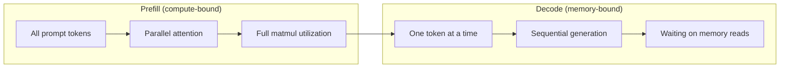
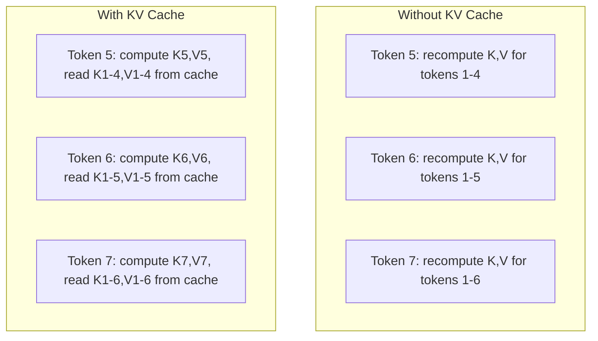
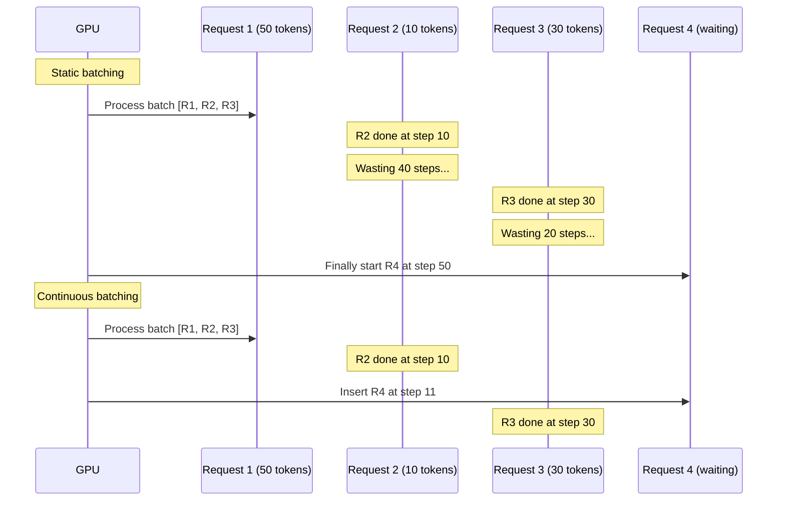
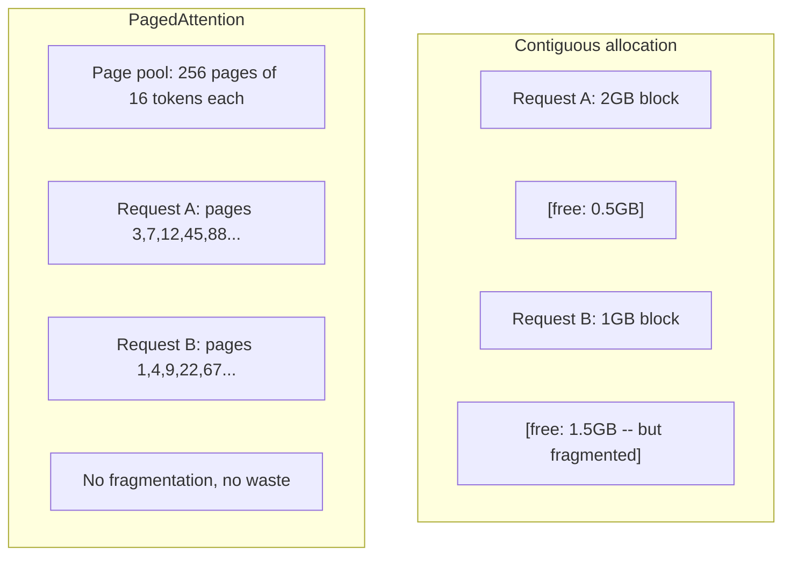
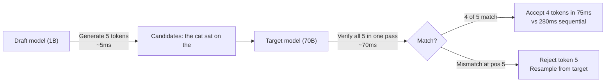

# Optymalizacja wnioskowania

> Wnioskowanie LLM przebiega w dwóch fazach. Faza Prefill przetwarza monit równolegle — jest ograniczona mocą obliczeniową. Dekodowanie generuje tokeny po jednym — jest ograniczone przepustowością pamięci. Każda optymalizacja dotyczy jednej lub obu faz.

**Typ:** Kompilacja
**Języki:** Python
**Wymagania wstępne:** Faza 10, lekcje 01-08 (architektura transformatora, uwaga)
**Czas:** ~120 minut

## Cele nauczania

- Zaimplementuj pamięć podręczną KV, aby wyeliminować zbędne obliczenia podczas autoregresyjnego generowania tokenów
- Wyjaśnij fazy wstępnego wypełniania i dekodowania w LLM oraz wskaż, dlaczego każda z nich ma inne wąskie gardło (obliczeniowe lub pamięciowe)
- Wdróż koncepcje ciągłego przetwarzania wsadowego i PagedAttention, aby zmaksymalizować wykorzystanie procesora graficznego przy równoczesnych żądaniach
- Porównaj techniki optymalizacji wnioskowania (pamięć podręczna KV, dekodowanie spekulatywne, FlashAttention) pod kątem kompromisów między przepustowością a opóźnieniami

## Problem

Wdrażasz Llamę 3 70B na czterech procesorach graficznych A100. Przy jednym użytkowniku uzyskujesz ~50 tokenów na sekundę — to imponujące tempo. Gdy jednak do punktu końcowego trafia jednocześnie 100 użytkowników, przepustowość spada do 3 tokenów na sekundę na użytkownika. Rachunek za GPU w wysokości 25 000 USD miesięcznie generuje odpowiedzi wolniejsze niż człowiek piszący na klawiaturze.

Sam model pozostaje niezmieniony niezależnie od liczby użytkowników. Te same wagi, ta sama architektura, ta sama matematyka. Zmienia się sposób planowania pracy. Naiwne wnioskowanie marnuje ponad 90% dostępnej mocy obliczeniowej GPU. Użytkownik czekający na 47. token blokuje cały slot wsadowy, podczas gdy magistrala pamięci GPU pozostaje bezczynna między operacjami mnożenia macierzy. Tymczasem monit nowego użytkownika liczący 2000 tokenów mógłby wypełnić ten martwy czas użytecznymi obliczeniami.

To nie jest problem ze skalowaniem sprzętu, lecz z harmonogramowaniem. Techniki omówione w tej lekcji — buforowanie KV, ciągłe przetwarzanie wsadowe, PagedAttention, dekodowanie spekulatywne i buforowanie prefiksów — odróżniają rachunek 25 000 USD miesięcznie od rachunku 5 000 USD przy tej samej liczbie obsługiwanych żądań.

vLLM obsługujący Llamę 3 70B na czterech A100-80GB osiąga ~50 tokenów/sekundę/użytkownika przy niskiej współbieżności i utrzymuje 15–25 TPS na użytkownika przy 100 jednoczesnych żądaniach — dzięki ciągłemu przetwarzaniu wsadowemu i PagedAttention. Bez tych optymalizacji ten sam sprzęt dostarcza zaledwie 5 TPS na użytkownika przy takim obciążeniu. Te same procesory graficzne, ten sam model, czterokrotnie wyższa przepustowość.

## Koncepcja

### Wstępne wypełnienie a dekodowanie

Każde żądanie wnioskowania LLM przebiega w dwóch odrębnych fazach.

**Wstępne wypełnienie** przetwarza cały monit wejściowy. Wszystkie tokeny są znane, więc mechanizm uwagi może działać równolegle na całej sekwencji. To duże mnożenie macierzy — rdzenie GPU są w pełni zajęte. Wąskim gardłem są obliczenia: ile operacji zmiennoprzecinkowych sprzęt może wykonać w ciągu sekundy. A100 osiąga 312 TFLOPS (BF16). Wstępne wypełnienie monitu złożonego z 4096 tokenów w modelu 70B zajmuje na jednym A100 około 400 ms.

**Dekodowanie** generuje tokeny wyjściowe pojedynczo. Każdy nowy token uwzględnia wszystkie poprzednie, lecz w jednym przejściu w przód powstaje tylko jeden token. Macierze wag mają taki sam rozmiar jak podczas wstępnego wypełniania, ale mnożone są przez pojedynczy wektor, a nie przez macierz. Rdzenie GPU kończą pracę w ciągu mikrosekund, po czym czekają na przesłanie kolejnej porcji wag z pamięci. Wąskim gardłem jest przepustowość pamięci: szybkość przesyłania wag modelu z HBM do jednostek obliczeniowych. A100 oferuje 2 TB/s. Model 70B w FP16 zajmuje 140 GB — jednorazowy odczyt pełnego modelu trwa 70 ms, co odpowiada czasowi pojedynczego kroku dekodowania.



**Stosunek ops:bajt** (zwany też intensywnością arytmetyczną) opisuje ten kompromis. Wyraża liczbę operacji przypadających na bajt załadowany z pamięci.

```
ops:byte ratio = FLOPs per token / bytes read from memory
```

Podczas wstępnego wypełniania partią 4096 tokenów wykonujesz ~4096 operacji mnożenia-akumulacji na każdą załadowaną wagę. Stosunek jest wysoki — jesteś ograniczony obliczeniami. Podczas dekodowania z partią o rozmiarze 1 wykonujesz ~1 operację na załadowaną wagę. Stosunek jest niski — jesteś ograniczony pamięcią.

Kluczowe spostrzeżenie: *dekodowanie jest ograniczone pamięcią, ponieważ ładujesz cały model tylko po to, by wygenerować jeden token*. Każda z opisanych poniżej optymalizacji albo redukuje ilość odczytywanych danych, albo zwiększa liczbę tokenów przetwarzanych na jeden odczyt, albo w ogóle eliminuje część odczytów.

### Pamięć podręczna KV

Podczas uwagi każdy token odpytuje wektory klucza i wartości wszystkich poprzedzających tokenów. Bez buforowania wygenerowanie N-tego tokenu wymaga ponownego obliczenia projekcji kluczy i wartości dla wszystkich N-1 poprzednich tokenów. Token 1 jest obliczany przy generowaniu tokenu 2, następnie ponownie przy tokenie 3, potem przy tokenie 4 i tak dalej. Do momentu generowania tokenu 1000 token 1 zostałby obliczony łącznie 999 razy.

Pamięć podręczna KV przechowuje projekcje kluczy i wartości wszystkich dotychczasowych tokenów. Generując N-ty token, obliczamy jedynie klucz i wartość dla tego tokenu, po czym łączymy je z buforowanymi wpisami K/V z tokenów od 1 do N-1.



**Wzór na rozmiar pamięci podręcznej KV:**

```
KV cache size = 2 * num_layers * num_kv_heads * head_dim * seq_len * bytes_per_param
```

Dla Llamy 3 70B (80 warstw, 8 głowic KV z GQA, head_dim=128, BF16):

```
per token: 2 * 80 * 8 * 128 * 2 bytes = 327,680 bytes = 320 KB
at 4,096 tokens: 320 KB * 4,096 = 1.28 GB
at 128K tokens: 320 KB * 131,072 = 40 GB
```

Pojedyncza rozmowa w kontekście 128K tokenów dla Llamy 3 70B zużywa 40 GB pamięci podręcznej KV — czyli połowę pamięci A100. Przy 100 jednoczesnych użytkownikach z kontekstem 4K każdy, sama pamięć podręczna KV potrzebuje 128 GB. To właśnie dlatego zarządzanie tą pamięcią stanowi główne wyzwanie w optymalizacji wnioskowania.

### Ciągłe przetwarzanie wsadowe

Statyczne przetwarzanie wsadowe polega na zebraniu N żądań, przetworzeniu ich razem i czekaniu, aż *wszystkie* się zakończą, zanim do puli trafią kolejne. Jeśli jedno żądanie wymaga 500 tokenów, a drugie tylko 10, krótsze pozostaje bezczynne przez 490 kroków dekodowania po swoim zakończeniu.

Ciągłe przetwarzanie wsadowe (zwane też przetwarzaniem wsadowym na poziomie iteracji) wstawia nowe żądania do partii natychmiast po zakończeniu dowolnego z aktywnych. Partia jest aktualizowana przy każdym kroku dekodowania. Żądanie ukończone po 10 tokenach zostaje bezzwłocznie zastąpione oczekującym żądaniem.



Wzrost przepustowości zależy od zróżnicowania długości odpowiedzi. Przy jednakowych długościach ciągłe przetwarzanie wsadowe daje taki sam wynik jak statyczne. Przy zmiennych długościach — a to typowy przypadek produkcyjny — może zapewnić 2–5-krotnie wyższą przepustowość, ponieważ sloty GPU nigdy nie stoją puste.

### PagedAttention

Pamięć podręczna KV każdego żądania zajmuje ciągły blok pamięci. Gdy żądania pojawiają się i kończą, powstają fragmenty wolnej pamięci — dokładnie tak jak fragmentacja RAM w systemach operacyjnych. Żądanie z kontekstem 4K potrzebuje ciągłego bloku 1,28 GB. Nawet jeśli łączna ilość wolnej pamięci wynosi 2 GB, może nie być dostępnego 1,28 GB *ciągłego* bloku. Skutkuje to albo marnowaniem pamięci, albo odrzucaniem żądań.

PagedAttention (zastosowany w vLLM) wprowadza mechanizm pamięci wirtualnej znany z systemów operacyjnych do zarządzania pamięcią podręczną KV. Zamiast przydzielać jeden ciągły blok na żądanie, alokuje strony o stałym rozmiarze (zwykle po 16 tokenów). Strony mogą znajdować się w dowolnym miejscu fizycznej pamięci GPU, a tablica stron odwzorowuje logiczne pozycje sekwencji każdego żądania na fizyczne adresy stron.



PagedAttention umożliwia ponadto **kopiowanie przy zapisie** dla współdzielonych prefiksów. Jeśli 50 żądań korzysta z tego samego monitu systemowego, strony pamięci podręcznej KV dla tego monitu są przechowywane tylko raz i współdzielone przez wszystkie 50 żądań. Własne strony żądanie otrzymuje dopiero wtedy, gdy jego sekwencja zaczyna się różnić (np. po odebraniu wiadomości od użytkownika). Drastycznie zmniejsza to zużycie pamięci w aplikacjach ze wspólnymi monitami systemowymi.

vLLM zgłasza niemal zerowe straty pamięci (~4%) przy użyciu PagedAttention, w porównaniu z ~60–80% w przypadku naiwnej alokacji.

### Dekodowanie spekulatywne

Dekodowanie jest powolne z racji swojej sekwencyjności — generujesz jeden token, przekazujesz go z powrotem i generujesz następny. Co jednak, jeśli można tanio przewidzieć kolejnych 5 tokenów, a potem zweryfikować je wszystkie naraz?

Dekodowanie spekulatywne wykorzystuje mały, szybki **model roboczy** do wygenerowania K tokenów kandydujących. Duży **model docelowy** przetwarza następnie wszystkich K kandydatów w jednym przejściu w przód (które przypomina wstępne wypełnianie — jest równoległe, ograniczone obliczeniami i wydajne). Jeśli model docelowy zgadza się z przewidywaniami modelu roboczego, akceptuje wszystkie K tokenów w czasie jednego przejścia. Jeśli niezgodność pojawia się na pozycji j, akceptowane są tokeny od 1 do j-1, a pozostałe są odrzucane.



Przyspieszenie zależy od **współczynnika akceptacji** — jak często predykcje modelu roboczego zgadzają się z modelem docelowym. Dla wersji roboczej Llama 3 8B i docelowej Llamy 3 70B typowe współczynniki akceptacji w języku naturalnym wynoszą 70–85%, co przekłada się na 2–3-krotne przyspieszenie dekodowania.

Trzy podejścia do dekodowania spekulatywnego:

| Metoda | Źródło projektu | Wskaźnik akceptacji | Narzut |
|------------|------------|----------------|---------|
| Projekt docelowy (Leviathan i in.) | Oddzielny mały model | 70-85% | Pamięć dla modelu roboczego |
| EAGLE (Li i in.) | Lekka głowa nad modelem docelowym | 75-90% | ~1% dodatkowych parametrów |
| Wyszukiwanie N-gramów | Tabela n-gramów z tokenów | 40-60% | Znikomy |

**EAGLE** trenuje małą autoregresyjną głowę na ukrytych stanach modelu docelowego. Przewiduje osadzenie następnego tokenu, korzystając z reprezentacji przedostatniej warstwy modelu docelowego. Ponieważ operuje na własnych reprezentacjach modelu docelowego — nie na oddzielnym modelu — osiąga wyższy współczynnik akceptacji przy minimalnym dodatkowym zużyciu pamięci. EAGLE-2 rozszerza tę metodę o dynamiczne drzewo wersji roboczej, które dostosowuje liczbę kandydatów do bieżącego kontekstu.

**N-gramowe dekodowanie spekulatywne** utrzymuje tabelę n-gramowych kontynuacji zbudowaną na podstawie bieżącego kontekstu lub wstępnie przygotowanego korpusu. Gdy proponowane tokeny pokrywają się z wcześniej widzianymi wzorcami w tej samej rozmowie (powtarzające się sekwencje, kod, dane strukturalne), spekulacja odbywa się bez żadnego narzutu obliczeniowego sieci neuronowej. Średnie wskaźniki akceptacji są niższe, lecz koszt spekulacji jest praktycznie zerowy.

Dekodowanie spekulatywne jest *matematycznie dokładne* — rozkład wyjściowy jest identyczny z rozkładem modelu docelowego. To nie jest aproksymacja. Etap weryfikacji zapewnia, że każdy zaakceptowany token ma dokładnie takie prawdopodobieństwo, jakie przypisałby model docelowy.

### Buforowanie prefiksów

Wiele żądań zaczyna się od tego samego prefiksu: monitu systemowego chatbota, bloku kontekstu RAG czy zestawu przykładów few-shot. Bez buforowania prefiksów każde żądanie oblicza pamięć podręczną KV dla tych wspólnych tokenów od początku.

Buforowanie prefiksów polega na przechowaniu pamięci podręcznej KV dla powtarzających się prefiksów i ponownym jej wykorzystaniu w kolejnych żądaniach. Gdy nadejdzie żądanie ze znanym prefiksem, system kopiuje (lub odwołuje się do) zbuforowanych wpisów KV i oblicza KV wyłącznie dla unikalnego sufiksu.

W przypadku monitu systemowego złożonego z 2000 tokenów, współdzielonego przez wszystkie żądania, buforowanie prefiksów eliminuje ~400 ms wstępnego wypełniania na każde żądanie. Przy 100 żądaniach na sekundę oszczędza to 40 sekund czasu GPU na sekundę — więcej, niż jeden procesor graficzny jest w stanie dostarczyć.

RadixAttention w SGLang implementuje buforowanie prefiksów za pomocą drzewa radix (trie), które indeksuje prefiksy według ich zawartości tokenowej. Każde żądanie pasujące do zapisanego prefiksu otrzymuje gotową pamięć podręczną KV bezpłatnie. Struktura drzewa umożliwia częściowe dopasowania — jeśli żądanie pokrywa 1500 z 2000 tokenów zapisanego prefiksu, te 1500 jest ponownie używanych, a przeliczanych jest tylko 500.

### Silniki wnioskowania

W produkcyjnych wdrożeniach LLM dominują trzy silniki obsługujące:

| Silnik | Kluczowa innowacja | Najlepsze zastosowanie |
|--------|-------------------|---------|
| vLLM | PagedAttention, ciągłe przetwarzanie wsadowe | Obsługa ogólnego przeznaczenia, najszersza kompatybilność |
| SGLang | RadixAttention (buforowanie prefiksów), generowanie strukturalne | Chatboty wieloturowe, dekodowanie z ograniczeniami |
| TensorRT-LLM | Łączenie jąder NVIDIA, kwantyzacja FP8 | Maksymalna przepustowość na sprzęcie NVIDIA |

**vLLM** to domyślny punkt startowy. Obsługuje największą liczbę modeli, działa na procesorach graficznych różnych producentów (NVIDIA, AMD, Intel) i osiąga wysoką przepustowość dzięki połączeniu PagedAttention z ciągłym przetwarzaniem wsadowym. Interfejs API zgodny z OpenAI oznacza, że można go zastosować jako zamiennik wywołań API OpenAI.

**SGLang** opiera się na tych samych fundamentach co vLLM, lecz rozszerza je o RadixAttention do buforowania prefiksów oraz język dziedzinowy dla strukturalnych programów LLM. Jeśli obciążenie obejmuje rozmowy wieloetapowe, wywoływanie narzędzi lub dekodowanie z ograniczeniami (wyjście JSON, generowanie oparte na wyrażeniach regularnych), SGLang często przewyższa vLLM 2–5-krotnie dzięki ponownemu wykorzystaniu prefiksów.

**TensorRT-LLM** kompiluje modele do zoptymalizowanych jąder GPU NVIDIA. Łączy operacje (uwaga + warstwa liniowa + aktywacja w jednym jądrze), korzysta z FP8 na procesorach graficznych H100 i integruje się z serwerem wnioskowania NVIDIA Triton do wdrożeń produkcyjnych. Osiąga najwyższą przepustowość na jednym GPU spośród dostępnych rozwiązań, wymaga jednak więcej konfiguracji i działa wyłącznie na sprzęcie NVIDIA.

Rzeczywiste wyniki dla Llamy 3 70B (4xA100-80GB, BF16):

| Metryka | vLLM | SGLang | TensorRT-LLM |
|------------|------|--------|-------------|
| Przepustowość (1 użytkownik) | ~50 TPS | ~55 TPS | ~65 TPS |
| Przepustowość (100 użytkowników) | ~2500 łącznie TPS | ~3200 łącznie TPS | ~3000 łącznie TPS |
| Czas do pierwszego tokenu | ~400 ms | ~300 ms (trafienie w prefiks) | ~350 ms |
| Maksymalny kontekst | 128K | 128K | 128K |

### Struktura ops:bajt

Nie można optymalizować tego, czego się nie mierzy. Stosunek ops:bajt wskazuje, czy obciążenie jest ograniczone obliczeniami czy pamięcią — a to determinuje, które optymalizacje mają sens.

```
Compute roof: peak FLOPS of the GPU
Memory roof:  peak bandwidth * ops:byte ratio
```

Gdy stosunek ops:bajt jest niski (dekodowanie, małe partie), osiągasz pułap przepustowości pamięci. Zwiększenie mocy obliczeniowej (wyższy taktowanie, więcej rdzeni) nic nie daje. Trzeba zmniejszyć liczbę odczytów z pamięci (kwantyzacja, kompresja pamięci podręcznej KV) lub zwiększyć rozmiar partii, aby rozłożyć te odczyty na większą liczbę użytecznych obliczeń.

Gdy stosunek ops:bajt jest wysoki (wstępne wypełnianie, duże partie), osiągasz pułap obliczeniowy. Optymalizacja przepustowości pamięci nie przynosi korzyści. Potrzebujesz szybszych GPU, łączenia jąder lub mniejszej precyzji, aby wycisnąć więcej operacji zmiennoprzecinkowych.

| Scenariusz | ops:bajt | Ograniczenie | Metoda optymalizacji |
|---------|----------|-------|--------------|
| Wstępne wypełnienie, partia=1 | ~4096 | Obliczenia | Łączenie jąder, FP8 |
| Dekodowanie, partia=1 | ~1 | Pamięć | Kwantyzacja, kompresja KV |
| Dekodowanie, partia=32 | ~32 | Pamięć | Większe partie, ciągłe przetwarzanie wsadowe |
| Dekodowanie, partia=256 | ~256 | Przejście | Obydwa mają znaczenie |
| Dekodowanie, partia=1024 | ~1024 | Obliczenia | Łączenie jąder, równoległość tensorowa |

Punkt przejścia na A100 wynosi ops:bajt ≈ 156 (312 TFLOPS / 2 TB/s). Poniżej tej wartości jesteś ograniczony pamięcią, powyżej — obliczeniami. Ciągłe przetwarzanie wsadowe przesuwa dekodowanie w stronę tego punktu, pakując więcej tokenów w każdą iterację.

## Zbuduj to

### Krok 1: Pamięć podręczna KV od podstaw

Budujemy wielogłowicową pamięć podręczną KV, która przechowuje projekcje kluczy i wartości na warstwę i na głowicę, a także demonstruje wzorzec wzrostu zużycia pamięci.

```python
import numpy as np

class KVCache:
    def __init__(self, num_layers, num_heads, head_dim, max_seq_len, dtype=np.float16):
        self.num_layers = num_layers
        self.num_heads = num_heads
        self.head_dim = head_dim
        self.max_seq_len = max_seq_len
        self.dtype = dtype

        self.k_cache = np.zeros(
            (num_layers, num_heads, max_seq_len, head_dim), dtype=dtype
        )
        self.v_cache = np.zeros(
            (num_layers, num_heads, max_seq_len, head_dim), dtype=dtype
        )
        self.seq_len = 0

    def update(self, layer_idx, new_keys, new_values):
        num_new = new_keys.shape[1]
        end = self.seq_len + num_new
        self.k_cache[layer_idx, :, self.seq_len:end, :] = new_keys
        self.v_cache[layer_idx, :, self.seq_len:end, :] = new_values
        return (
            self.k_cache[layer_idx, :, :end, :],
            self.v_cache[layer_idx, :, :end, :]
        )

    def advance(self, num_tokens):
        self.seq_len += num_tokens

    def memory_bytes(self):
        return self.k_cache.nbytes + self.v_cache.nbytes

    def used_bytes(self):
        per_token = 2 * self.num_layers * self.num_heads * self.head_dim * np.dtype(self.dtype).itemsize
        return per_token * self.seq_len
```

### Krok 2: Uwaga z pamięcią podręczną KV

Uproszczona uwaga wielogłowicowa korzystająca z pamięci podręcznej KV podczas kroków dekodowania.

```python
def scaled_dot_product_attention(query, keys, values):
    head_dim = query.shape[-1]
    scores = np.matmul(query, keys.transpose(0, 1, 3, 2)) / np.sqrt(head_dim)
    seq_len_q = scores.shape[-2]
    seq_len_k = scores.shape[-1]
    if seq_len_q > 1:
        mask = np.triu(np.ones((seq_len_q, seq_len_k), dtype=np.float32), k=seq_len_k - seq_len_q + 1)
        scores = scores + mask * (-1e9)
    max_scores = np.max(scores, axis=-1, keepdims=True)
    exp_scores = np.exp(scores - max_scores)
    attn_weights = exp_scores / np.sum(exp_scores, axis=-1, keepdims=True)
    return np.matmul(attn_weights, values)

class MultiHeadAttention:
    def __init__(self, d_model, num_heads):
        self.num_heads = num_heads
        self.head_dim = d_model // num_heads
        scale = np.sqrt(2.0 / d_model)
        self.W_q = np.random.randn(d_model, d_model).astype(np.float32) * scale
        self.W_k = np.random.randn(d_model, d_model).astype(np.float32) * scale
        self.W_v = np.random.randn(d_model, d_model).astype(np.float32) * scale
        self.W_o = np.random.randn(d_model, d_model).astype(np.float32) * scale

    def forward(self, x, kv_cache=None, layer_idx=0):
        batch, seq_len, d_model = x.shape
        Q = np.matmul(x, self.W_q).reshape(batch, seq_len, self.num_heads, self.head_dim).transpose(0, 2, 1, 3)
        K = np.matmul(x, self.W_k).reshape(batch, seq_len, self.num_heads, self.head_dim).transpose(0, 2, 1, 3)
        V = np.matmul(x, self.W_v).reshape(batch, seq_len, self.num_heads, self.head_dim).transpose(0, 2, 1, 3)

        if kv_cache is not None:
            K_full, V_full = kv_cache.update(layer_idx, K[0], V[0])
            K = K_full[np.newaxis, :, :, :]
            V = V_full[np.newaxis, :, :, :]
            if seq_len == 1:
                kv_cache.advance(1)

        attn_out = scaled_dot_product_attention(Q, K, V)
        attn_out = attn_out.transpose(0, 2, 1, 3).reshape(batch, -1, d_model)
        return np.matmul(attn_out, self.W_o)
```

### Krok 3: Symulator ciągłego przetwarzania wsadowego

Symuluje różnicę w harmonogramowaniu między przetwarzaniem wsadowym statycznym a ciągłym.

```python
import heapq

class Request:
    def __init__(self, request_id, prompt_tokens, output_tokens, arrival_step):
        self.request_id = request_id
        self.prompt_tokens = prompt_tokens
        self.output_tokens = output_tokens
        self.arrival_step = arrival_step
        self.tokens_generated = 0
        self.start_step = None
        self.end_step = None

    def is_done(self):
        return self.tokens_generated >= self.output_tokens

def simulate_static_batching(requests, batch_size):
    step = 0
    completed = []
    queue = list(requests)
    queue.sort(key=lambda r: r.arrival_step)

    while queue:
        batch = []
        while queue and len(batch) < batch_size:
            r = queue.pop(0)
            r.start_step = max(step, r.arrival_step)
            batch.append(r)

        if batch:
            step = max(step, max(r.start_step for r in batch))
            max_output = max(r.output_tokens for r in batch)
            for r in batch:
                r.tokens_generated = r.output_tokens
                r.end_step = step + max_output
            step += max_output
            completed.extend(batch)

    return completed

def simulate_continuous_batching(requests, batch_size):
    step = 0
    completed = []
    queue = sorted(requests, key=lambda r: r.arrival_step)
    queue_idx = 0
    active = []
    waiting = []

    while queue_idx < len(queue) or active or waiting:
        while queue_idx < len(queue) and queue[queue_idx].arrival_step <= step:
            waiting.append(queue[queue_idx])
            queue_idx += 1

        while waiting and len(active) < batch_size:
            r = waiting.pop(0)
            r.start_step = step
            active.append(r)

        if not active:
            if waiting:
                step += 1
                continue
            elif queue_idx < len(queue):
                step = queue[queue_idx].arrival_step
                continue
            else:
                break

        for r in active:
            r.tokens_generated += 1

        done = [r for r in active if r.is_done()]
        for r in done:
            r.end_step = step + 1
            completed.append(r)
        active = [r for r in active if not r.is_done()]

        step += 1

    return completed

def batching_stats(completed):
    latencies = [r.end_step - r.arrival_step for r in completed]
    total_time = max(r.end_step for r in completed) - min(r.arrival_step for r in completed)
    total_tokens = sum(r.output_tokens for r in completed)
    return {
        "avg_latency": np.mean(latencies),
        "p50_latency": np.median(latencies),
        "p99_latency": np.percentile(latencies, 99),
        "total_time": total_time,
        "throughput": total_tokens / total_time if total_time > 0 else 0,
    }
```

### Krok 4: Pamięć podręczna prefiksów

Pamięć podręczna prefiksów oparta na drzewie trie, przechowująca wpisy KV dla współdzielonych prefiksów.

```python
class TrieNode:
    def __init__(self):
        self.children = {}
        self.kv_data = None
        self.hit_count = 0

class PrefixCache:
    def __init__(self, max_entries=1000):
        self.root = TrieNode()
        self.max_entries = max_entries
        self.total_entries = 0
        self.hits = 0
        self.misses = 0

    def _walk(self, token_ids):
        node = self.root
        depth = 0
        for tid in token_ids:
            if tid not in node.children:
                break
            node = node.children[tid]
            depth += 1
        return node, depth

    def lookup(self, token_ids):
        node, depth = self._walk(token_ids)
        if depth > 0:
            self.hits += 1
            current = self.root
            for tid in token_ids[:depth]:
                current = current.children[tid]
                current.hit_count += 1
            kv_entries = []
            current = self.root
            for tid in token_ids[:depth]:
                current = current.children[tid]
                if current.kv_data is not None:
                    kv_entries.append(current.kv_data)
            return depth, kv_entries
        self.misses += 1
        return 0, []

    def insert(self, token_ids, kv_per_token):
        node = self.root
        for i, tid in enumerate(token_ids):
            if tid not in node.children:
                if self.total_entries >= self.max_entries:
                    return i
                node.children[tid] = TrieNode()
                self.total_entries += 1
            node = node.children[tid]
            if i < len(kv_per_token):
                node.kv_data = kv_per_token[i]
        return len(token_ids)

    def hit_rate(self):
        total = self.hits + self.misses
        return self.hits / total if total > 0 else 0.0
```

### Krok 5: Symulator dekodowania spekulatywnego

Symulujemy dekodowanie spekulatywne z konfigurowalnym współczynnikiem akceptacji.

```python
class DraftModel:
    def __init__(self, vocab_size, acceptance_rate=0.8):
        self.vocab_size = vocab_size
        self.acceptance_rate = acceptance_rate

    def generate(self, context, num_tokens):
        tokens = np.random.randint(0, self.vocab_size, size=num_tokens)
        return tokens

    def get_probs(self, context, token):
        probs = np.random.dirichlet(np.ones(self.vocab_size))
        return probs

class TargetModel:
    def __init__(self, vocab_size):
        self.vocab_size = vocab_size

    def get_probs(self, context, tokens=None):
        if tokens is not None:
            return [np.random.dirichlet(np.ones(self.vocab_size)) for _ in tokens]
        return np.random.dirichlet(np.ones(self.vocab_size))

def speculative_decode(draft_model, target_model, context, num_speculative=5,
                       draft_cost=1.0, target_cost=10.0, verify_cost=12.0):
    total_tokens = 0
    total_cost = 0.0
    accepted_counts = []
    context = list(context)

    max_tokens = 100

    while total_tokens < max_tokens:
        draft_tokens = draft_model.generate(context, num_speculative)
        total_cost += draft_cost * num_speculative

        target_probs = target_model.get_probs(context, draft_tokens)
        total_cost += verify_cost

        accepted = 0
        for i, token in enumerate(draft_tokens):
            draft_p = draft_model.get_probs(context + list(draft_tokens[:i]), token)
            target_p = target_probs[i]

            r = np.random.random()
            acceptance_prob = min(1.0, target_p[token] / (draft_p[token] + 1e-10))

            if r < draft_model.acceptance_rate:
                accepted += 1
                context.append(token)
                total_tokens += 1
            else:
                new_token = np.random.choice(draft_model.vocab_size, p=target_p)
                context.append(new_token)
                total_tokens += 1
                break

        accepted_counts.append(accepted)

        if accepted == num_speculative:
            bonus_probs = target_model.get_probs(context)
            bonus_token = np.random.choice(draft_model.vocab_size, p=bonus_probs)
            context.append(bonus_token)
            total_tokens += 1

    sequential_cost = total_tokens * target_cost
    return {
        "total_tokens": total_tokens,
        "speculative_cost": total_cost,
        "sequential_cost": sequential_cost,
        "speedup": sequential_cost / total_cost if total_cost > 0 else 1.0,
        "avg_accepted": np.mean(accepted_counts),
        "acceptance_rate": np.mean(accepted_counts) / num_speculative,
    }

def compare_speculation_strategies(vocab_size=1000, num_trials=20):
    results = {}

    for name, acceptance_rate, spec_tokens in [
        ("Draft-target (8B->70B)", 0.78, 5),
        ("EAGLE", 0.85, 6),
        ("N-gram", 0.50, 4),
        ("No speculation", 0.0, 0),
    ]:
        if spec_tokens == 0:
            results[name] = {
                "speedup": 1.0,
                "acceptance_rate": 0.0,
                "avg_accepted": 0.0,
            }
            continue

        trial_results = []
        for _ in range(num_trials):
            draft = DraftModel(vocab_size, acceptance_rate=acceptance_rate)
            target = TargetModel(vocab_size)
            context = list(np.random.randint(0, vocab_size, size=10))
            result = speculative_decode(draft, target, context, num_speculative=spec_tokens)
            trial_results.append(result)

        results[name] = {
            "speedup": np.mean([r["speedup"] for r in trial_results]),
            "acceptance_rate": np.mean([r["acceptance_rate"] for r in trial_results]),
            "avg_accepted": np.mean([r["avg_accepted"] for r in trial_results]),
        }

    return results
```

### Krok 6: Profiler pamięci podręcznej KV

Oblicza wymagania pamięciowe pamięci podręcznej KV dla rzeczywistych konfiguracji modeli.

```python
MODEL_CONFIGS = {
    "Llama-3-8B": {
        "num_layers": 32, "num_kv_heads": 8, "head_dim": 128,
        "model_params_b": 8, "gqa": True,
    },
    "Llama-3-70B": {
        "num_layers": 80, "num_kv_heads": 8, "head_dim": 128,
        "model_params_b": 70, "gqa": True,
    },
    "Llama-3-405B": {
        "num_layers": 126, "num_kv_heads": 8, "head_dim": 128,
        "model_params_b": 405, "gqa": True,
    },
    "Mistral-7B": {
        "num_layers": 32, "num_kv_heads": 8, "head_dim": 128,
        "model_params_b": 7, "gqa": True,
    },
    "GPT-4-est": {
        "num_layers": 120, "num_kv_heads": 96, "head_dim": 128,
        "model_params_b": 1800, "gqa": False,
    },
}

def kv_cache_memory(config, seq_len, dtype_bytes=2):
    per_token = 2 * config["num_layers"] * config["num_kv_heads"] * config["head_dim"] * dtype_bytes
    total = per_token * seq_len
    return {
        "per_token_bytes": per_token,
        "per_token_kb": per_token / 1024,
        "total_bytes": total,
        "total_mb": total / (1024 ** 2),
        "total_gb": total / (1024 ** 3),
    }

def memory_budget(config, gpu_memory_gb, model_dtype_bytes=2, kv_dtype_bytes=2):
    model_memory_gb = config["model_params_b"] * 1e9 * model_dtype_bytes / (1024 ** 3)
    overhead_gb = gpu_memory_gb * 0.1
    available_for_kv = gpu_memory_gb - model_memory_gb - overhead_gb

    if available_for_kv <= 0:
        return {"error": "Model does not fit in GPU memory", "model_memory_gb": model_memory_gb}

    per_token = 2 * config["num_layers"] * config["num_kv_heads"] * config["head_dim"] * kv_dtype_bytes
    max_tokens = int(available_for_kv * (1024 ** 3) / per_token)

    return {
        "gpu_memory_gb": gpu_memory_gb,
        "model_memory_gb": round(model_memory_gb, 1),
        "overhead_gb": round(overhead_gb, 1),
        "available_for_kv_gb": round(available_for_kv, 1),
        "max_total_tokens": max_tokens,
        "max_users_at_2k": max_tokens // 2048,
        "max_users_at_4k": max_tokens // 4096,
        "max_users_at_32k": max_tokens // 32768,
    }
```

## Użyj tego

Z vLLM:

```python
from vllm import LLM, SamplingParams

llm = LLM(
    model="meta-llama/Llama-3-70B-Instruct",
    tensor_parallel_size=4,
    enable_prefix_caching=True,
    max_model_len=8192,
    gpu_memory_utilization=0.9,
)

params = SamplingParams(temperature=0.7, max_tokens=256)
outputs = llm.generate(["Explain inference optimization in one paragraph."], params)
```

Z SGLang do buforowania prefiksów i wyjścia strukturalnego:

```python
import sglang as sgl

@sgl.function
def classify(s, text):
    s += sgl.system("You are a classifier. Output JSON only.")
    s += sgl.user(f"Classify this text: {text}")
    s += sgl.assistant(sgl.gen("result", regex=r'\{"label": "(positive|negative|neutral)"\}'))

runtime = sgl.Runtime(model_path="meta-llama/Llama-3-70B-Instruct", tp_size=4)
sgl.set_default_backend(runtime)

results = classify.run_batch([
    {"text": "This product is amazing!"},
    {"text": "Terrible experience."},
    {"text": "It was okay I guess."},
])
```

Z TensorRT-LLM:

```python
import tensorrt_llm
from tensorrt_llm.runtime import ModelRunner

runner = ModelRunner.from_dir("./llama-70b-trt-engine/", rank=0)

outputs = runner.generate(
    batch_input_ids=[tokenizer.encode("Explain KV caching.")],
    max_new_tokens=256,
    temperature=0.7,
)
```

## Wyślij to

Ta lekcja generuje:
- `outputs/skill-inference-optimization.md` — umiejętność diagnozowania i optymalizowania obsługi wnioskowania LLM

## Ćwiczenia

1. Zmodyfikuj profiler pamięci podręcznej KV, aby porównać kwantyzację KV w formatach FP16, FP8 i INT4. Dla Llamy 3 70B przy kontekście 4K oblicz maksymalną liczbę jednoczesnych użytkowników dla każdego wariantu na 4xA100-80GB. Kwantyzacja do INT4 powinna około czterokrotnie zwiększyć pojemność.

2. Rozszerz symulator ciągłego przetwarzania wsadowego o śledzenie wykorzystania GPU (odsetek zajętych slotów wsadowych na krok). Narysuj wykres wykorzystania w czasie zarówno dla przetwarzania statycznego, jak i ciągłego przy 50 żądaniach, których długości wyjściowe są zgodne z rozkładem Pareto (kształt=1,5, skala=20). Ciągłe przetwarzanie wsadowe powinno utrzymywać wykorzystanie powyżej 80%.

3. Zaimplementuj wersję pamięci podręcznej KV z obsługą grupowego zapytania (GQA), gdzie `num_kv_heads < num_query_heads`. Llama 3 70B używa 64 głowic zapytań, lecz tylko 8 głowic KV. Oblicz oszczędność pamięci w porównaniu z pełną uwagą wielogłowicową (ośmiokrotna redukcja rozmiaru pamięci podręcznej KV).

4. Zbuduj pamięć podręczną prefiksów z wypieraniem LRU. Ustaw max_entries na 500 i wygeneruj 1000 żądań, z których 60% korzysta z jednego z 5 wspólnych prefiksów. Zmierz współczynnik trafień i porównaj z nieograniczoną pamięcią podręczną. Przy poprawnie zaimplementowanym wypieraniu wskaźnik trafień powinien pozostać powyżej 55%.

5. Rozszerz symulator dekodowania spekulatywnego o spekulację opartą na drzewie (w stylu EAGLE-2). Zamiast pojedynczego łańcucha K tokenów kandydujących wygeneruj drzewo kandydatów (np. 2 gałęzie na każdym z 3 poziomów = 8 kandydatów łącznie). Porównaj całkowitą liczbę zaakceptowanych tokenów w rundzie weryfikacyjnej z wynikami spekulacji liniowej.

## Kluczowe terminy

| Termin | Jak się o tym mówi | Co to faktycznie oznacza |
|------|----------------|----------------------|
| Wstępne wypełnienie | „Przetwarzanie monitu" | Równoległe obliczanie uwagi dla wszystkich tokenów wejściowych — ograniczone obliczeniami, ponieważ pełne mnożenie macierzy w pełni zajmuje rdzenie GPU |
| Dekodowanie | „Generowanie tokenów" | Generowanie jednego tokenu na przejście w przód z odczytem pełnych wag modelu za każdym razem — ograniczone pamięcią, bo obliczenia kończą się przed załadowaniem kolejnych wag |
| Pamięć podręczna KV | „Buforowanie stanów uwagi" | Przechowywanie projekcji kluczy i wartości dla wszystkich poprzednich tokenów, by nie przeliczać ich przy każdym kroku dekodowania — zamiana pamięci na obliczenia |
| Ciągłe przetwarzanie wsadowe | „Dynamiczne dozowanie" | Wstawianie nowych żądań do aktywnej partii natychmiast po zakończeniu dowolnego żądania, aktualizowane przy każdej iteracji dekodowania — zamiast czekania na całą partię |
| PagedAttention | „Pamięć wirtualna dla pamięci podręcznej KV" | Alokacja pamięci podręcznej KV w stronach o stałym rozmiarze zamiast w ciągłych blokach — eliminuje fragmentację i umożliwia kopiowanie przy zapisie dla współdzielonych prefiksów |
| Dekodowanie spekulatywne | „Propozycja i weryfikacja" | Użycie szybkiego modelu roboczego do zaproponowania wielu tokenów, a następnie weryfikacja ich wszystkich w jednym przejściu modelu docelowego — matematycznie dokładne, 2–3-krotne przyspieszenie |
| EAGLE | „Autospekulatywne dekodowanie" | Wariant dekodowania spekulatywnego, w którym głowica pomocnicza jest trenowana na ukrytych stanach samego modelu docelowego — osiąga wyższy współczynnik akceptacji niż oddzielny model roboczy |
| Buforowanie prefiksów | „Ponowne użycie KV monitu systemowego" | Przechowywanie wpisów pamięci podręcznej KV dla typowych prefiksów (monity systemowe, przykłady few-shot) i ich ponowne wykorzystywanie w kolejnych żądaniach — eliminuje zbędne wstępne wypełnianie |
| Stosunek ops:bajt | „Intensywność arytmetyczna" | Stosunek operacji obliczeniowych do bajtów odczytanych z pamięci — określa, czy obciążenie jest ograniczone obliczeniami (wysoki stosunek) czy pamięcią (niski stosunek) |
| Czas do pierwszego tokenu | „TTFT" | Opóźnienie między otrzymaniem żądania a wygenerowaniem pierwszego tokenu wyjściowego — zdominowane przez czas wstępnego wypełniania przy długich monitach |

## Dalsze czytanie

— Kwon i in., „Efficient Memory Management for Large Language Model Serving with PagedAttention" (2023) — artykuł opisujący vLLM i stronicowane zarządzanie pamięcią podręczną KV, obecnie branżowy standard obsługi wnioskowania
— Leviathan i in., „Fast Inference from Transformers via Speculative Decoding" (2023) — praca fundamentalna dowodząca, że spekulacja oparta na weryfikacji wersji roboczej daje rozkłady identyczne z modelem docelowym przy 2–3-krotnym przyspieszeniu
— Li i in., „EAGLE: Speculative Sampling Requires Rethinking Feature Uncertainty" (2024) — osiąga wyższe współczynniki akceptacji, trenując głowicę na własnych reprezentacjach modelu docelowego zamiast korzystać z oddzielnego modelu roboczego
— Zheng i in., „SGLang: Efficient Execution of Structured Language Model Programs" (2024) — przedstawia RadixAttention do buforowania prefiksów i model programowania dla wieloetapowych programów LLM
— Williams i in., „Roofline: An Insightful Visual Performance Model for Multicore Architectures" (2009) — oryginalna praca wprowadzająca model pułapu, który sformalizował analizę ops:bajt dla diagnozowania wąskich gardeł obliczeniowych i pamięciowych
