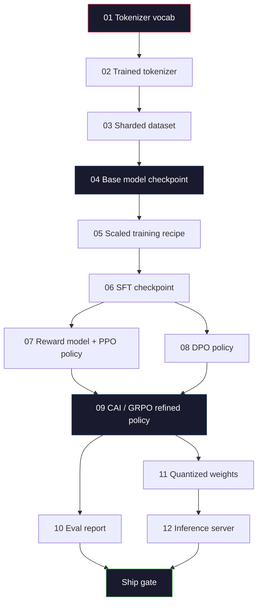
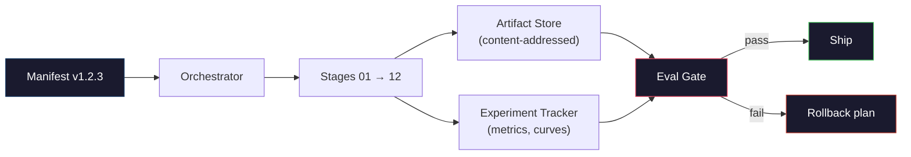

# Budowanie kompletnego rurociągu LLM

> Wszystko od lekcji 01 do 12 to jeden etap jednego potoku. Ta lekcja stanowi szkielet, który zamienia te etapy w jeden kompleksowy przebieg: tokenizacja, wstępne szkolenie, skalowanie, SFT, wyrównywanie, ocena, kwantyzacja, obsługa. Modelu 70B nie wytrenujesz na laptopie. Stworzysz warstwę orkiestracji, manifest, bramkę ewaluacyjną i plan wycofywania, którego zespół pograniczny na rok 2026 użyje do podjęcia decyzji, co zostanie wysłane. To jest zwieńczenie.

**Typ:** Kompilacja
**Języki:** Python (stdlib)
**Wymagania wstępne:** Wszystkie lekcje fazy 10 01-12
**Czas:** ~120 minut

## Cele nauczania

- Skomponuj jedenaście wcześniejszych lekcji (tokenizator, dane, szkolenie wstępne, skalowanie, SFT, RLHF, DPO, CAI, ewaluacja, kwantyzacja, wnioskowanie) w jedną powtarzalną specyfikację potoku
- Zdefiniuj umowę artefaktów między etapami: co zużywa każdy etap, co produkuje i w jaki sposób następny etap weryfikuje dane wejściowe
- Zbuduj orkiestratora, który śledzi eksperymenty, miesza artefakty i podejmuje decyzje dotyczące statku na progach eval
- Zaprojektuj plan wycofania: które artefakty są tanie w ponownym uruchomieniu, które są drogie i ile kosztuje uszkodzony punkt kontrolny

## Problem

Wszystkie poprzednie lekcje działają. Przeszkolony tokenizer. Wstępnie przeszkolony mały GPT. Złożony zbiór danych SFT. Wyszkolony model nagrody. Bieg DPO. Wartości zmierzone. Eksportowane skwantowane odważniki. Serwer wnioskowania został uruchomiony. Każdy z nich to notatnik. Każdy ma swoje własne konwencje, własne ścieżki wyjściowe, własne nasiona.

Szkolenie graniczne to nie notatnik. Lama 3 405B zajęła 30 milionów godzin H100 w ciągu około 54 dni. DeepSeek-V3 zużył około 2,8 miliona godzin H800. W tym czasie jeden uszkodzony punkt kontrolny, jedno zanieczyszczenie danych, jedna regresja ewaluacyjna może kosztować zespół tydzień zegara ściennego i miesiąc budżetu GPU. Zespoły przetrwają to dzięki higienie potoku: każdy etap ma deterministyczne dane wejściowe, deterministyczne dane wyjściowe, manifest, skrót i bramkę.

To jest zwieńczenie. Nie będziesz uruchamiać potoku od początku do końca na laptopie. Napiszesz orkiestratora, który koordynuje etapy, manifest opisujący przebieg, weryfikator, który kontroluje decyzje dotyczące statku, oraz plan powtórek, który umożliwi stronie trzeciej ponowne uruchomienie Twojej pracy z pojedynczego pliku. Kod jest mały; dyscyplina jest duża.

Wzór skaluje się od parametrów 100M do 1T bez zmian. Te same cztery komponenty – manifest, orkiestrator, bramka ewaluacyjna, sklep z artefaktami – uruchamiają Lamę 3, a także uruchamiają Twoje hobby GPT. Różnica polega na wielkości liczb w konfiguracji każdego etapu, a nie na kształcie potoku.

## Koncepcja

### Dwanaście etapów

Każda lekcja fazy 10 jest etapem. Oto pełny wykres zależności.



Etapy 07 i 08 mogą przebiegać równolegle. Wszystko inne to trudna zależność. Zmiana na etapie 02 (tokenizator) unieważnia każdy dalszy artefakt. Zmiana w etapie 10 (eval) unieważnia jedynie decyzję statku.

### Manifest

Manifest to pojedynczy plik opisujący przebieg na tyle szczegółowo, że można go odtworzyć. Nic, co generuje potok, nie powinno zależeć od stanu, którego nie ma w manifeście. Pola są nudne i obowiązkowe.

```
pipeline_version: 1.2.3
seed: 42
git_commit: a1b2c3d4
stages:
  01_tokenizer:
    recipe: bpe_32k
    input_hash: sha256:...
    output_hash: sha256:...
    wall_clock_sec: 3600
    cost_usd: 12
```

Hash wyjściowy etapu N jest hashem wejściowym etapu N+1. Każde odchylenie powoduje zatrzymanie rurociągu. W ten sposób wcześnie wykryjesz uszkodzenie danych. W ten sposób członek drużyny na innym kontynencie sprawdza, czy powtórka stworzyła ten sam artefakt co Twój.

W praktyce zespoły używają małego schematu YAML i modułu sprawdzania manifestu, który różni się od poprzedniego pomyślnego uruchomienia. Jakakolwiek delta poza oczekiwanymi polami (koszt, zegar ścienny) jest czerwoną flagą.

### Wpisywanie artefaktów

Dane wyjściowe każdego etapu to artefakt wpisany. Nie obiekt blob katalogu, nie pikle, ale nazwany typ ze znanym schematem.

| Scena | Typ artefaktu | Kluczowe pola |
|-------|------------------|---------------|
| 01-02 | Tokenizer | vocab.json, merges.txt, config.json, hash |
| 03 | Zbiór danych | odłamki [], liczba wierszy, liczba tokenów, statystyki deduplikacji |
| 04-05 | Punkt kontrolny | Weights.safetensors, config.json, stan optymalizatora, liczba kroków |
| 06 | Model SFT | punkt kontrolny + przepis SFT + miks danych |
| 07 | Model nagrody | Punkt kontrolny RM + skrót danych preferencji |
| 08-09 | Polityka | punkt kontrolny + skrót referencyjny + wersja beta + wykorzystany budżet KL |
| 10 | Raport ewaluacyjny | wyniki testów porównawczych + różnice regresji + skrót danych ewaluacyjnych |
| 11 | Model skwantowany | skwantowane masy + dane kalibracyjne + delta dokładności w porównaniu z FP16 |
| 12 | Specyfikacja serwera | punkt końcowy + skrót modelu + konfiguracja + haki obserwowalności |

Wpisywanie zapobiega najczęstszemu trybowi awarii: użyciu wyjścia stopnia 08 jako wejścia stopnia 06 i przesłaniu modelu wyszkolonego przez DPO ścieżką SFT. Wpisane artefakty i wpisane sygnatury etapów powodują, że te błędy powodują awarie w czasie kompilacji, a nie awarie piątego dnia.

### Brama Ewalu

Wysyłka nie oznacza „zakończenia szkolenia”. Wysyłka to „szkolenie zakończone i bramka ewaluacyjna minęła”. Bramka jest definiowana przed rozpoczęciem przebiegu.

```
gates:
  mmlu:      >= baseline + 0.5   # no regression
  humaneval: >= baseline + 1.0
  truthfulqa: >= baseline         # no drop
  safety_refusal_rate: <= 0.05
  kl_from_reference: <= 25.0
  cost_total_usd: <= 50000
```

Każda bramka jest progiem numerycznym. Żadnych bramek, które „wyglądają dobrze”. Żadnych subiektywnych podpisów. Jeśli każda brama przejdzie, artefakt zostanie oznaczony jako nadający się do wysyłki. Jeśli którakolwiek bramka zawiedzie, przebieg zostanie wstrzymany do czasu wyraźnego zastąpienia przez wyznaczonego recenzenta, który sam jest rejestrowany w manifeście.

Dwie bramy łapią większość nieszczęść. Bramka *regresyjna* (nowy model musi być co najmniej tak dobry jak poprzedni w podstawowych testach porównawczych) wyłapuje błędy szkoleniowe. Bramka *budżetu KL* (dostosowana polityka nie może odsunąć się dalej niż X od wartości odniesienia) wychwytuje przegotowanie wyrównania. Każdy rurociąg produkcyjny ma jedno i drugie.

### Orkiestrator

Mały fragment kodu, który odczytuje manifest, uruchamia etapy, śledzi artefakty i zatrzymuje się w przypadku naruszenia umowy. To nie jest przepływ powietrza. To nie jest Kubeflow. Do higieny rurociągów chcesz czegoś nudnego, co napisałeś.

Zadanie orkiestratora jest wąskie:

1. Rozwiąż DAG z manifestu.
2. Na każdym etapie sprawdź, czy oczekiwany wynik już istnieje w odpowiednim hashu (pomiń, jeśli tak).
3. Uruchom scenę, przechwyć stdout/stderr, zmierz zegar ścienny i koszt.
4. Sprawdź skrót wyjściowy względem oczekiwanego skrótu wejściowego etapu dalszego.
5. W przypadku niepowodzenia zapisz częściowy manifest z dokładnym etapem awarii i wyjdź z wartością różną od zera.

To 200 linii Pythona. Będzie wyglądać jak plik `code/main.py` z tej lekcji. Pod maską prawdziwy potok wykorzystuje `torchrun` lub `ray` do wykonywania poszczególnych etapów w klastrach, ale sam orkiestrator działa na jednym urządzeniu.

### Śledzenie eksperymentów i przechowywanie artefaktów

Dwa zewnętrzne systemy zakotwiczają rurociąg.

**Śledzenie eksperymentów (wandb, neptun, mlflow).** Rejestruje krzywe strat, wskaźniki ewaluacyjne, telemetrię systemu na każdym etapie. Tracker jest miejscem, do którego należy się udać, gdy trzeba porównać przebieg A z biegiem B trzy tygodnie później. Zespoły prawie zawsze korzystają w tym celu z hostowanego modułu śledzącego — pisanie własnego powoduje stratę czasu, który powinien zostać przeznaczony na szkolenie.

**Magazyn artefaktów (S3, R2, GCS).** Niezmienny magazyn obiektów dla punktów kontrolnych, zbiorów danych, tokenizatorów, raportów ewaluacyjnych. Artefakty są adresowane za pomocą skrótu, a nie nazwy pliku. Nazwa pliku taka jak `latest.pt` to pistolet ręczny; `ckpt-7b-step-20000-sha256:abc123.safetensors` jest umową.

Orkiestrator pisze do obu. Tracker jest przeznaczony dla ludzi przeglądających wykresy. Magazyn artefaktów służy do następnego etapu wyszukiwania danych wejściowych.

### Koszty

Do przejazdu granicznego dołączona jest liczba w dolarach. Dyscyplina budżetowa zachodzi w dwóch miejscach.

**Oszacowanie przed uruchomieniem.** Z manifestu oblicz oczekiwane FLOPy (dla wstępnego uczenia: 6 x parametry x tokeny), oczekiwane godziny GPU (FLOP / szczytowa przepustowość / wykorzystanie) i koszt w dolarach przy bieżącej stawce wynajmu. Jeżeli szacunki przekraczają bramkę budżetową, rurociąg odmawia uruchomienia.

**Śledzenie przebiegu.** Zegar ścienny i koszt etap po etapie są rejestrowane w manifeście. Po każdym etapie sprawdzany jest pozostały budżet. W przypadku przekroczenia etapu brama następnego etapu jest oceniana z uwzględnieniem nowego pozostałego budżetu. Kiedy VC dzwoni, nie dowiadujesz się, że skończyły Ci się pieniądze.

Zgłoszony koszt Lamy 3 w głównym okresie przedszkoleniowym wyniósł $61M. DeepSeek-V3 reported $5,6 mln. Stosunek dotyczy głównie wydajności sprzętu i mieszanki ekspertów, ale konkretny koszt jest widoczny, ponieważ oba zespoły monitorowały go według etapu, a nie dla przebiegu.

### Powtarzalność a determinizm

To nie jest to samo. *Powtarzalność* oznacza, że ​​ten sam manifest, ten sam kod i ta sama infrastruktura tworzą punkt kontrolny z równoważnymi metrykami na dalszym etapie. *Deterministyczny* oznacza wyjście z identycznym bitem.

Nowoczesne szkolenie LLM jest powtarzalne, ale nie deterministyczne. Kolejność redukcji w treningu rozproszonym, niedeterminizm jądra GPU (cuBLAS, flash-attn) i mieszane precyzyjne zaokrąglanie łączą się, tworząc wartości zmiennoprzecinkowe, które różnią się na poziomie 1e-5 pomiędzy uruchomieniami. Jest to w porządku w przypadku ostatecznych wskaźników, które się nie zmieniają. Próba debugowania z różnicami na poziomie bitów jest fatalna. Rozwiązaniem jest rejestrowanie skrótu wejściowego, skrótu wyjściowego i metryk nagłówka każdego etapu — jeśli są one zgodne, przebieg jest „odtwarzany”, nawet jeśli wagi nie są identyczne bitowo.



### Plan wycofania

Przed rozpoczęciem biegu zapisz, co dzieje się w przypadku niepowodzenia każdego etapu. Trzy kategorie.

- **Tanie ponowne uruchomienie** (godziny): tokenizer, ewaluacja, kwantyzacja, serwer wnioskowania. Po prostu uruchom ponownie.
- **Średni** (dni): SFT, DPO, CAI. Zachowaj model podstawowy; ponownie przeprowadzić tylko etapy wyrównywania.
- **Drogie** (tygodnie i miliony dolarów): szkolenie przedszkoleniowe. Plan wycofania w tym przypadku nie jest „ponowny”. Polega na „wykorzystaniu ostatniego dobrego punktu kontrolnego i ponownym uruchomieniu tańszych etapów końcowych ze poprawionymi danymi”.

Ponieważ zależności etapów są wpisywane i szyfrowane, koordynator może automatycznie obliczyć zestaw wycofywania: unieważnia etap zakończony niepowodzeniem oraz wszystkie elementy podrzędne. Awaria na etapie 06 (SFT) unieważnia 06, 07, 08, 09, 10, 11, 12. Awaria na etapie 11 (kwantyzacja) unieważnia tylko 11 i 12. Nazwanie tego z góry pozwala uniknąć improwizacji, gdy zespół jest wyczerpany o 4 rano.

### Przepisy produkcyjne zaobserwowane w 2026 roku

Większość zespołów z pogranicza skupiała się na tym samym szkielecie.

- Tokenizer: 128k BPE z rezerwą bajtów. Trenowany na małym, zrównoważonym, wielojęzycznym kawałku.
- Szkolenie wstępne: tokeny 10-20T, głównie internetowe plus kod plus syntetyczne. Optymalizator Muon lub AdamW. FSDP2 lub DeepSpeed ​​ZeRO-3. Gradientowy punkt kontrolny. Odważniki BF16, master FP32.
- SFT: pary instrukcji 500k-2M, mieszane ludzkie i syntetyczne, ze ścisłym deduplikacją w stosunku do zestawu eval.
- Dopasowanie: DPO lub CAI + GRPO. RLHF tylko wtedy, gdy sygnał preferencji jest zbyt wielowymiarowy dla DPO.
- Eval: MMLU-Pro, MATH, HumanEval+, GPQA, SWE-Bench Verified, LiveBench oraz prywatny zestaw, którego opinia publiczna nigdy nie widzi.
- Kwantyzacja: 4-bitowe GPTQ lub AWQ do obsługi, 8-bitowe do oceny bezpieczeństwa, gdzie liczy się delta dokładności.
- Serwowanie: vLLM, TensorRT-LLM lub we własnym zakresie. Ciągłe dozowanie. Dekodowanie spekulatywne. Eksmisja pamięci podręcznej KV.

Liczby zmieniają się co sześć miesięcy. Szkielet nie.

## Zbuduj to

Kod lekcji to orkiestrator i narzędzie do sprawdzania manifestu, a nie dwanaście skryptów szkoleniowych. Każdy etap jest symulowany za pomocą symbolu zastępczego, który generuje artefakt wyjściowy o prawidłowym kształcie i wartości skrótu. Kompleksowe uruchomienie orkiestratora udowadnia, że ​​rurociąg działa prawidłowo, zanim wydasz pieniądze z procesora graficznego na prawdziwych scenach.

Pełną implementację znajdziesz w `code/main.py`. Kluczowe elementy:

- `Manifest` klasa danych: wersja potoku, materiał siewny, zatwierdzenie git, etapy, bramki.
- `Stage` klasa danych: nazwa, typ, dane wejściowe (hasze), dane wyjściowe (hash), zegar ścienny, koszt.
- `Orchestrator.run()`: rozwiązuje DAG, wysyła etapy, weryfikuje skróty, aktualizuje manifest.
- `EvalGate.check()`: odczytuje progi, porównuje z najnowszym raportem ewaluacyjnym, zwraca wynik pozytywny/negatywny.
- `ArtifactStore` (odcinek w pamięci): put/get według skrótu, symuluje S3.
- `CostTracker`: na etap i kumulatywnie, zatrzymuje się po przekroczeniu limitu.

Potok w `main.py` uruchamia dwanaście etapów zastępczych, tworzy manifest i wykonuje błędną bramkę ewaluacyjną, aby pokazać, jak wygląda wstrzymane uruchomienie. Zamień każdy symbol zastępczy na prawdziwy skrypt szkoleniowy z odpowiedniej lekcji, a otrzymasz szkielet, z którego korzysta prawdziwy potok graniczny.

## Użyj tego

Kanoniczny przepływ pracy zawiera trzy polecenia.

```
python code/main.py plan    # validate manifest, compute cost estimate, print DAG
python code/main.py run     # execute stages, writing to manifest.out.yaml
python code/main.py gate    # read manifest.out.yaml, apply eval gates, ship-or-hold
```

Za każdym razem najpierw uruchamiaj `plan`. Większość błędów potoku pojawia się w czasie planowania — brakujące progi bramki, nieaktualne skróty, przekroczenia budżetu. Uruchamianie `plan` jest bezpłatne. Uruchamianie `run` jest kosztowne. Oszczędzaj pieniądze, łapiąc błędy po taniej stronie.

Dane wyjściowe `gate` to `SHIP` lub `HOLD: <reason>`. Utrzymany bieg nie jest porażką; jest to punkt decyzyjny. Nazwany recenzent albo zastępuje (i zastąpienie jest rejestrowane), albo zatwierdza wycofanie.

## Wyślij to

Ta lekcja przedstawia `outputs/skill-llm-pipeline-reviewer.md`. Podaj mu proponowany manifest potoku, a on sprawdzi wszystkie kontrakty: typowanie etapowe, łańcuch mieszający, bramki, plan wycofywania zmian, kosztorys. Odmawia zatwierdzenia manifestu z brakującą bramką ewaluacyjną, nieograniczonym budżetem KL lub przebiegiem łączącym dane ewaluacyjne i szkoleniowe.

## Ćwiczenia

1. Rozszerz koordynatora, aby obsługiwał równoległe wykonywanie etapów 07 i 08. Użyj modułu stdlib `concurrent.futures`. Potwierdź, że końcowy manifest rejestruje dane wyjściowe obu etapów i że wejściowy skrót etapu 09 jest deterministyczną kombinacją obu.

2. Dodaj bramkę „kontroli zanieczyszczeń”. Biorąc pod uwagę skrót zestawu danych eval i fragmenty zestawu danych szkoleniowych, oblicz nakładanie się (dokładne dopasowanie ciągu lub dopasowanie 13 gramów). Bramka nie działa, jeśli nakładanie się przekracza 0,1%. Nakarm go skażonym zestawem treningowym i potwierdź, że brama utrzymuje bieg.

3. Wdrożyć estymator kosztów od pierwszych zasad. Dla etapu 04 (szkolenie wstępne) oszacuj FLOP jako 6 x param x tokeny, załóż 40% MFU (wykorzystanie modelu FLOP) w H100 przy 989 TFLOPs BF16, przy 2,50 USD/GPU-godzinę. Zgłoś oszacowanie dla modelu 7B wyszkolonego na tokenach 2T. Porównaj z opublikowanymi liczbami Lamy 2.

4. Utwórz częściowe wycofanie. Symuluj awarię na etapie 09 (CAI), a następnie uruchom ponownie etapy od 09 do 12, pozostawiając 01-08 w pamięci podręcznej. Koordynator powinien wykryć artefakty w pamięci podręcznej za pomocą skrótu i ​​pominąć je. Zmierz zaoszczędzony zegar ścienny w porównaniu z pełnym ponownym uruchomieniem.

5. Dodaj obserwowalność. Emituj zakresy OpenTelemetry dla każdego etapu z atrybutami parametrów, widocznych tokenów, strat i kosztów. Poprowadź przęsła do lokalnego kolektora. Nie chodzi o pulpity nawigacyjne; chodzi o to, że stan każdego etapu można prześledzić na podstawie jednego identyfikatora śledzenia.

## Kluczowe terminy

| Termin | Co ludzie mówią | Co to właściwie oznacza |
|------|----------------|----------------------|
| Manifest | „Plik z przepisem” | YAML lub JSON opisujący wersję potoku, materiał siewny, konfigurację poszczególnych etapów i progi bramek — wystarczające do odtworzenia przebiegu |
| Treść adresowana | „Według skrótu, a nie nazwy” | Artefakty przechowywane przez SHA-256 ich zawartości, więc nigdy nie można pomylić wersji A z wersją B |
| Brama ewaluacyjna | „Kryteria statku” | Liczbowe progi wskaźników porównawczych i wyników bezpieczeństwa, które muszą zostać spełnione, zanim artefakt zostanie oznaczony jako nadający się do wysyłki |
| Budżet KL | „Jak daleko zaszło wyrównanie” | Ograniczenie skumulowanego KL(polityka || odniesienie) na etapach dostosowania, egzekwowane jako bramka |
| MFU | „Ile procesora graficznego użyłeś” | Wykorzystanie modelu FLOP — osiągnięte FLOP podzielone przez teoretyczny szczyt. 40% to typowe dla skali 70B, 55% dla 7B |
| Plan wycofania | „Co robimy, gdy się zepsuje” | Wstępnie napisany zestaw działań na każdym etapie w przypadku niepowodzenia: ponowne uruchomienie, wycofanie się, ponowne szkolenie ze zmienionymi danymi wejściowymi |
| Orkiestrator | „Dyrygent” | Proces odczytujący manifest, wysyłający etapy, weryfikujący skróty, zatrzymujący się w przypadku naruszenia umowy |
| Sklep z artefaktami | „Wersja S3 dla ciężarków” | Magazyn obiektów o niezmiennej treści — pojedyncze źródło prawdy dla punktów kontrolnych, zbiorów danych i raportów ewaluacyjnych |
| Powtarzalne | „Te same dane przy powtórce” | Różne wagi na poziomie bitów, ale równoważne metryki niższego szczebla — realistyczny cel dla rozproszonego szkolenia LLM |
| Brama kosztowa | „Nie możesz przekroczyć X” | Wstępny kosztorys plus śledzenie przebiegu — rurociąg odmawia uruchomienia, jeśli kosztorys przekracza budżet |

## Dalsze czytanie

– [Dubey et al., 2024 – „The Llama 3 Herd of Models”](https://arxiv.org/abs/2407.21783) – najbardziej szczegółowy publiczny opis gazociągu granicznego, obejmujący dane, szkolenie, wyrównanie i ocenę
– [DeepSeek-AI, 2024 – „Raport techniczny DeepSeek-V3”](https://arxiv.org/abs/2412.19437) – rurociąg zapewniający przede wszystkim wydajność za mniej więcej 1/10 kosztu szkolenia klasy 3 Lamy
– [Kaplan i in., 2020 – „Prawa skalowania modeli języka neuronowego”](https://arxiv.org/abs/2001.08361) – oryginalna relacja skalowania parametrów obliczeniowych
– [Hoffmann i in., 2022 – „Training Compute-Optimal Large Language Models (Chinchilla)”](https://arxiv.org/abs/2203.15556) – poprawka do Kaplana, która ponownie skalibrowała nowoczesne budżety danych
- [Dokumentacja PyTorch FSDP2](https://pytorch.org/docs/stable/fsdp.html) — rozproszony prymityw szkoleniowy zastępujący FSDP1 w PyTorch 2.4+
– [Raporty LLM dotyczące wag i odchyleń] (https://wandb.ai/site/llms) — prawdziwe manifesty i wyniki śledzenia eksperymentów dla przebiegów LLM typu open source, przydatne jako szablony umożliwiające plagiat