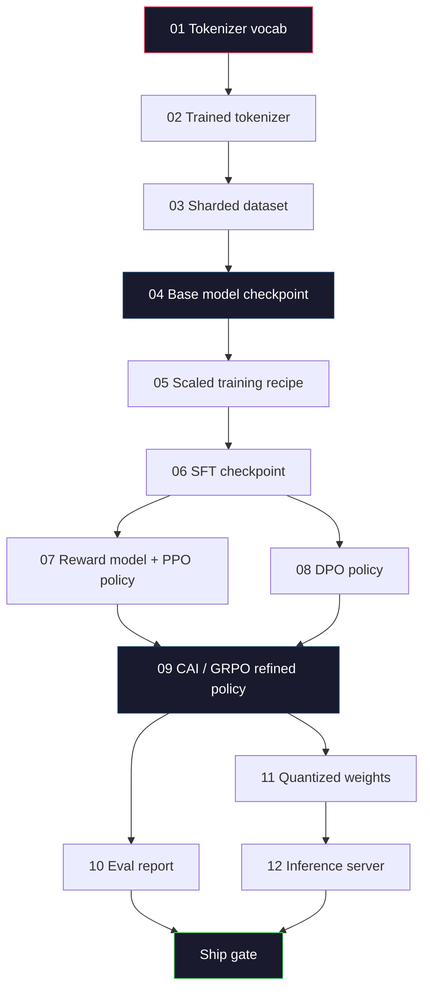
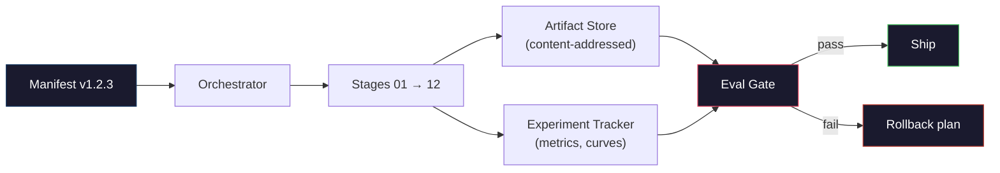

# Budowanie kompletnego potoku LLM

> Lekcje od 01 do 12 to kolejne etapy jednego potoku. Niniejsza lekcja stanowi szkielet łączący te etapy w spójny, kompleksowy przebieg: tokenizacja, wstępne uczenie, skalowanie, SFT, wyrównywanie, ewaluacja, kwantyzacja, serwowanie. Modelu 70B nie nauczysz na laptopie. Stworzysz natomiast warstwę orkiestracji, manifest, bramkę ewaluacyjną i plan wycofania — narzędzia, z których skorzysta zespół graniczny w 2026 roku, decydując co trafi do produkcji. To jest zwieńczenie kursu.

**Typ:** Kompilacja
**Języki:** Python (stdlib)
**Wymagania wstępne:** Wszystkie lekcje fazy 10, 01–12
**Czas:** ~120 minut

## Cele nauczania

- Złożyć jedenaście wcześniejszych lekcji (tokenizator, dane, wstępne uczenie, skalowanie, SFT, RLHF, DPO, CAI, ewaluacja, kwantyzacja, wnioskowanie) w jedną powtarzalną specyfikację potoku
- Zdefiniować kontrakt artefaktów między etapami: co każdy etap przyjmuje na wejściu, co produkuje na wyjściu i w jaki sposób następny etap weryfikuje dane wejściowe
- Zbudować orkiestratora śledzącego eksperymenty, zarządzającego artefaktami i podejmującego decyzje o wysyłce na podstawie progów ewaluacyjnych
- Zaprojektować plan wycofania: które artefakty są tanie w ponownym uruchomieniu, które są kosztowne i ile może kosztować uszkodzony punkt kontrolny

## Problem

Wszystkie poprzednie lekcje działają samodzielnie. Masz wytrenowany tokenizator. Masz wstępnie wytrenowany mały GPT. Masz złożony zbiór danych SFT, wytrenowany model nagrody, przebieg DPO, zmierzone wartości, wyeksportowane skwantowane wagi i uruchomiony serwer wnioskowania. Każdy z nich to osobny notatnik z własnymi konwencjami, ścieżkami wyjściowymi i ziarnem losowości.

Graniczne uczenie modeli to nie notatnik. Llama 3 405B wymagała 30 milionów godzin obliczeniowych na H100 przez około 54 dni. DeepSeek-V3 pochłonął około 2,8 miliona godzin na H800. W tym czasie jeden uszkodzony punkt kontrolny, jedno zanieczyszczenie danych lub jedna regresja w wynikach ewaluacji może kosztować zespół tydzień czasu zegarowego i miesiąc budżetu GPU. Zespoły przetrwają takie sytuacje dzięki higienie potoku: każdy etap ma deterministyczne wejście, deterministyczne wyjście, manifest, skrót i bramkę.

To jest właśnie zwieńczenie kursu. Nie uruchomisz całego potoku od początku do końca na laptopie. Napiszesz orkiestratora koordynującego etapy, manifest opisujący przebieg, weryfikator kontrolujący decyzje o wysyłce oraz plan ponownego uruchomienia umożliwiający każdej osobie trzeciej odtworzenie Twojej pracy z jednego pliku. Kod jest krótki; dyscyplina — duża.

Ten wzorzec skaluje się od 100M do 1T parametrów bez żadnych zmian strukturalnych. Te same cztery komponenty — manifest, orkiestrator, bramka ewaluacyjna, magazyn artefaktów — obsługują zarówno Llamę 3, jak i Twoje hobbystyczne GPT. Różnica tkwi wyłącznie w wartościach liczbowych konfiguracji poszczególnych etapów, nie w kształcie potoku.

## Koncepcja

### Dwanaście etapów

Każda lekcja fazy 10 odpowiada jednemu etapowi. Poniżej przedstawiono pełny wykres zależności.



Etapy 07 i 08 mogą przebiegać równolegle. Wszystkie pozostałe zależności są ścisłe. Zmiana w etapie 02 (tokenizator) unieważnia wszystkie kolejne artefakty. Zmiana w etapie 10 (ewaluacja) unieważnia jedynie decyzję o wysyłce.

### Manifest

Manifest to pojedynczy plik opisujący przebieg na tyle szczegółowo, że można go odtworzyć. Żaden element generowany przez potok nie powinien zależeć od stanu, którego w manifeście nie ma. Pola są proste i obowiązkowe.

```
pipeline_version: 1.2.3
seed: 42
git_commit: a1b2c3d4
stages:
  01_tokenizer:
    recipe: bpe_32k
    input_hash: sha256:...
    output_hash: sha256:...
    wall_clock_sec: 3600
    cost_usd: 12
```

Skrót wyjściowy etapu N jest skrótem wejściowym etapu N+1. Każde odchylenie zatrzymuje potok. Dzięki temu uszkodzenia danych są wykrywane wcześnie, a członek zespołu na innym kontynencie może sprawdzić, czy jego powtórka wygenerowała ten sam artefakt co oryginał.

W praktyce zespoły stosują prosty schemat YAML i moduł weryfikacji manifestu porównujący go z poprzednim pomyślnym uruchomieniem. Każda rozbieżność wykraczająca poza spodziewane pola (koszt, czas zegarowy) jest sygnałem alarmowym.

### Typowanie artefaktów

Wyjście każdego etapu to artefakt z określonym typem. Nie katalog z blobem, nie pickle — lecz nazwany typ o znanych polach.

| Etap | Typ artefaktu | Kluczowe pola |
|-------|------------------|---------------|
| 01-02 | Tokenizer | vocab.json, merges.txt, config.json, hash |
| 03 | Zbiór danych | fragmenty [], liczba wierszy, liczba tokenów, statystyki deduplikacji |
| 04-05 | Punkt kontrolny | weights.safetensors, config.json, stan optymalizatora, liczba kroków |
| 06 | Model SFT | punkt kontrolny + przepis SFT + miks danych |
| 07 | Model nagrody | punkt kontrolny RM + skrót danych preferencji |
| 08-09 | Polityka | punkt kontrolny + skrót referencyjny + wartość beta + wykorzystany budżet KL |
| 10 | Raport ewaluacyjny | wyniki benchmarków + różnice regresji + skrót danych ewaluacyjnych |
| 11 | Model skwantowany | skwantowane wagi + dane kalibracyjne + delta dokładności względem FP16 |
| 12 | Specyfikacja serwera | punkt końcowy + skrót modelu + konfiguracja + hooki obserwowalności |

Typowanie zapobiega najpowszechniejszemu rodzajowi błędów: użyciu wyjścia etapu 08 jako wejścia etapu 06 i wysłaniu modelu wytrenowanego przez DPO ścieżką SFT. Typowane artefakty i typowane sygnatury etapów zamieniają takie pomyłki w błędy czasu kompilacji — zamiast awarii w piątym dniu treningu.

### Bramka ewaluacyjna

Wysyłka nie oznacza „zakończenia treningu". Oznacza „trening zakończony i bramka ewaluacyjna zaliczona". Bramkę definiuje się przed rozpoczęciem przebiegu.

```
gates:
  mmlu:      >= baseline + 0.5   # no regression
  humaneval: >= baseline + 1.0
  truthfulqa: >= baseline         # no drop
  safety_refusal_rate: <= 0.05
  kl_from_reference: <= 25.0
  cost_total_usd: <= 50000
```

Każda bramka to próg numeryczny. Żadnych bramek „które wyglądają dobrze". Żadnych subiektywnych zatwierdzeń. Jeśli wszystkie bramki zostaną zaliczone, artefakt otrzymuje oznaczenie gotowości do wysyłki. Jeśli którakolwiek zawiedzie, przebieg zostaje wstrzymany do czasu jawnego zastąpienia przez wyznaczonego recenzenta — a zastąpienie to jest odnotowywane w manifeście.

Dwie bramki wychwytują większość problemów. Bramka *regresji* (nowy model musi być co najmniej tak dobry jak poprzedni na podstawowych benchmarkach) wyłapuje błędy treningowe. Bramka *budżetu KL* (polityka po dostrajaniu nie może oddalić się o więcej niż X od wartości referencyjnej) wykrywa przetrenowanie wyrównywania. Każdy produkcyjny potok posiada obie.

### Orkiestrator

To niewielki fragment kodu, który odczytuje manifest, uruchamia etapy, śledzi artefakty i zatrzymuje się po naruszeniu kontraktu. Nie jest to Airflow ani Kubeflow. Do higieny potoku potrzebujesz czegoś prostego — najlepiej napisanego samodzielnie.

Zadanie orkiestratora jest precyzyjnie zdefiniowane:

1. Rozwiąż DAG z manifestu.
2. Dla każdego etapu sprawdź, czy oczekiwany artefakt wyjściowy już istnieje pod właściwym skrótem (pomiń, jeśli tak).
3. Uruchom etap, przechwytując stdout/stderr, mierząc czas zegarowy i koszt.
4. Zweryfikuj skrót wyjściowy względem oczekiwanego skrótu wejściowego następnego etapu.
5. W razie niepowodzenia zapisz częściowy manifest z dokładnym miejscem awarii i zakończ z niezerowym kodem wyjścia.

To 200 linii Pythona. Efekt końcowy wygląda jak plik `code/main.py` z tej lekcji. W prawdziwym potoku poszczególne etapy są wykonywane na klastrach za pomocą `torchrun` lub `ray`, ale sam orkiestrator działa na jednej maszynie.

### Śledzenie eksperymentów i magazyn artefaktów

Dwa zewnętrzne systemy stanowią fundament potoku.

**Śledzenie eksperymentów (wandb, neptune, mlflow).** Rejestruje krzywe strat, metryki ewaluacyjne i telemetrię systemową dla każdego etapu. To miejsce, do którego sięgasz, gdy chcesz porównać przebieg A z przebiegiem B trzy tygodnie później. Zespoły niemal zawsze korzystają z hostowanego systemu śledzenia — pisanie własnego to strata czasu, który lepiej przeznaczyć na samo uczenie.

**Magazyn artefaktów (S3, R2, GCS).** Niezmienny magazyn obiektów dla punktów kontrolnych, zbiorów danych, tokenizatorów i raportów ewaluacyjnych. Artefakty są adresowane skrótem, nie nazwą pliku. Nazwa taka jak `latest.pt` to pułapka; `ckpt-7b-step-20000-sha256:abc123.safetensors` to kontrakt.

Orkiestrator zapisuje dane do obu systemów. Tracker jest przeznaczony dla ludzi przeglądających wykresy. Magazyn artefaktów służy kolejnym etapom do wyszukiwania danych wejściowych.

### Koszty

Każde graniczne uruchomienie ma przypisaną kwotę w dolarach. Dyscyplina budżetowa obowiązuje w dwóch punktach.

**Szacowanie przed uruchomieniem.** Na podstawie manifestu oblicz spodziewane FLOPy (dla wstępnego uczenia: 6 × parametry × tokeny), oczekiwany czas GPU (FLOP / szczytowa przepustowość / wykorzystanie) oraz koszt w dolarach przy bieżącej stawce wynajmu. Jeżeli szacunek przekracza bramkę budżetową, potok odmawia uruchomienia.

**Śledzenie w trakcie przebiegu.** Czas zegarowy i koszt są rejestrowane w manifeście etap po etapie. Po każdym etapie sprawdzany jest pozostały budżet. Przekroczenie któregokolwiek etapu powoduje ponowną ocenę bramki kolejnego z uwzględnieniem zaktualizowanego salda. Dzięki temu informacja o wyczerpaniu środków nie zaskakuje Cię podczas rozmowy z inwestorami.

Publicznie podawany koszt głównego etapu wstępnego uczenia Llamy 3 wyniósł 61 mln USD. DeepSeek-V3 kosztował około 5,6 mln USD. Różnica wynika głównie z wydajności sprzętu i architektury mixture-of-experts, ale oba zespoły mogły podać dokładne kwoty właśnie dlatego, że monitorowały koszty etapami, nie dla całego przebiegu łącznie.

### Powtarzalność a determinizm

To nie są pojęcia tożsame. *Powtarzalność* oznacza, że ten sam manifest, ten sam kod i ta sama infrastruktura tworzą punkt kontrolny z równoważnymi metrykami na dalszych etapach. *Determinizm* oznacza wyjście identyczne co do bitu.

Nowoczesne uczenie LLM jest powtarzalne, ale nie deterministyczne. Kolejność redukcji w rozproszonym uczeniu, niedeterminizm jąder GPU (cuBLAS, flash-attn) i zaokrąglenia w arytmetyce mieszanej precyzji sprawiają, że wartości zmiennoprzecinkowe różnią się między uruchomieniami na poziomie 1e-5. Jest to akceptowalne, o ile końcowe metryki pozostają stabilne. Próba debugowania na podstawie różnic bitowych jest bezproduktywna. Rozwiązaniem jest rejestrowanie skrótu wejściowego, skrótu wyjściowego i kluczowych metryk każdego etapu — jeśli te się zgadzają, przebieg uznaje się za odtworzony, nawet jeśli wagi nie są bitowo identyczne.



### Plan wycofania

Przed rozpoczęciem przebiegu zapisz, co należy zrobić w razie niepowodzenia każdego etapu. Wyróżniamy trzy kategorie.

- **Tanie w ponownym uruchomieniu** (godziny): tokenizator, ewaluacja, kwantyzacja, serwer wnioskowania. Wystarczy ponownie uruchomić etap.
- **Umiarkowanie kosztowne** (dni): SFT, DPO, CAI. Zachowaj model bazowy i powtórz jedynie etapy wyrównywania.
- **Bardzo kosztowne** (tygodnie i miliony dolarów): wstępne uczenie. W tym przypadku plan wycofania to nie „ponowne uruchomienie", lecz „wykorzystanie ostatniego dobrego punktu kontrolnego i ponowne uruchomienie tańszych etapów końcowych z poprawionymi danymi".

Ponieważ zależności między etapami są typowane i zabezpieczone skrótami, orkiestrator może automatycznie wyliczyć zakres wycofania: unieważnia etap, który zawiódł, oraz wszystkie zależne od niego etapy. Awaria na etapie 06 (SFT) unieważnia etapy 06–12. Awaria na etapie 11 (kwantyzacja) unieważnia tylko 11 i 12. Zdefiniowanie planu z wyprzedzeniem pozwala uniknąć improwizacji o czwartej rano, gdy zespół jest wyczerpany.

### Przepisy produkcyjne obserwowane w 2026 roku

Większość czołowych zespołów skupiła się na tym samym szkielecie.

- Tokenizator: BPE z rozmiarem słownika 128k i rezerwą bajtową. Trenowany na małym, zrównoważonym, wielojęzycznym zbiorze danych.
- Wstępne uczenie: 10–20T tokenów, głównie internet, kod i dane syntetyczne. Optymalizator Muon lub AdamW. FSDP2 lub DeepSpeed ZeRO-3. Gradient checkpointing. Wagi BF16, stan główny FP32.
- SFT: 500k–2M par instrukcja–odpowiedź, mix danych ludzkich i syntetycznych, z rygorystyczną deduplikacją względem zbioru ewaluacyjnego.
- Wyrównywanie: DPO lub CAI + GRPO. RLHF tylko wtedy, gdy sygnał preferencji jest zbyt wielowymiarowy dla DPO.
- Ewaluacja: MMLU-Pro, MATH, HumanEval+, GPQA, SWE-Bench Verified, LiveBench oraz wewnętrzny zestaw testów, którego opinia publiczna nie widzi.
- Kwantyzacja: 4-bitowe GPTQ lub AWQ do serwowania, 8-bitowe do ocen bezpieczeństwa, gdzie delta dokładności ma znaczenie.
- Serwowanie: vLLM, TensorRT-LLM lub rozwiązanie własne. Ciągłe przetwarzanie wsadowe. Dekodowanie spekulatywne. Eksmisja pamięci podręcznej KV.

Konkretne liczby zmieniają się co pół roku. Szkielet pozostaje niezmienny.

## Zbuduj to

Kod tej lekcji to orkiestrator i narzędzie do weryfikacji manifestu — nie dwanaście skryptów treningowych. Każdy etap jest symulowany przez symbol zastępczy generujący artefakt wyjściowy o właściwym kształcie i skrócie. Kompleksowe uruchomienie orkiestratora udowadnia, że potok działa poprawnie, zanim wydasz budżet GPU na rzeczywiste etapy.

Pełną implementację znajdziesz w `code/main.py`. Kluczowe elementy:

- `Manifest` — klasa danych: wersja potoku, ziarno losowości, commit git, etapy, bramki.
- `Stage` — klasa danych: nazwa, typ, wejścia (skróty), wyjścia (skrót), czas zegarowy, koszt.
- `Orchestrator.run()`: rozwiązuje DAG, uruchamia etapy, weryfikuje skróty, aktualizuje manifest.
- `EvalGate.check()`: odczytuje progi, porównuje z najnowszym raportem ewaluacyjnym, zwraca wynik pozytywny lub negatywny.
- `ArtifactStore` (wersja w pamięci): put/get według skrótu, symuluje S3.
- `CostTracker`: śledzenie kosztu per etap i kumulatywnie, zatrzymuje się po przekroczeniu limitu.

Potok w `main.py` uruchamia dwanaście zastępczych etapów, tworzy manifest i celowo nie zalicza bramki ewaluacyjnej, pokazując, jak wygląda wstrzymane uruchomienie. Zamień każdy symbol zastępczy na rzeczywisty skrypt treningowy z odpowiedniej lekcji, a otrzymasz szkielet, na którym opiera się prawdziwy graniczny potok.

## Użyj tego

Kanoniczny przepływ pracy obejmuje trzy polecenia.

```
python code/main.py plan    # validate manifest, compute cost estimate, print DAG
python code/main.py run     # execute stages, writing to manifest.out.yaml
python code/main.py gate    # read manifest.out.yaml, apply eval gates, ship-or-hold
```

Zawsze zacznij od `plan`. Większość błędów potoku ujawnia się właśnie na etapie planowania: brakujące progi bramek, nieaktualne skróty, przekroczenia budżetu. Uruchomienie `plan` jest bezkosztowe. Uruchomienie `run` jest kosztowne. Wykrywaj błędy po taniej stronie.

Wyjście polecenia `gate` to `SHIP` lub `HOLD: <reason>`. Wstrzymany przebieg nie jest porażką — to punkt decyzyjny. Wyznaczony recenzent albo jawnie zastępuje decyzję (co jest odnotowywane w manifeście), albo zatwierdza wycofanie.

## Wyślij to

Ta lekcja wprowadza plik `outputs/skill-llm-pipeline-reviewer.md`. Przekaż mu proponowany manifest potoku, a zweryfikuje wszystkie kontrakty: typowanie etapów, łańcuch skrótów, bramki, plan wycofania i kosztorys. Narzędzie odmawia zatwierdzenia manifestu, w którym brakuje bramki ewaluacyjnej, budżet KL jest nieograniczony lub dane ewaluacyjne i treningowe się nakładają.

## Ćwiczenia

1. Rozszerz orkiestratora o obsługę równoległego wykonania etapów 07 i 08. Użyj modułu stdlib `concurrent.futures`. Upewnij się, że końcowy manifest rejestruje wyjścia obu etapów i że skrót wejściowy etapu 09 jest deterministyczną kombinacją obu wyników.

2. Dodaj bramkę „kontroli zanieczyszczeń". Mając skrót zbioru ewaluacyjnego i fragmenty zbioru treningowego, oblicz ich wzajemne pokrycie (dokładne dopasowanie ciągów lub dopasowanie 13-gramów). Bramka nie przepuszcza przebiegu, jeśli pokrycie przekracza 0,1%. Przetestuj ją na zanieczyszczonym zbiorze treningowym i potwierdź, że bramka wstrzymuje przebieg.

3. Zaimplementuj estymator kosztów od podstaw. Dla etapu 04 (wstępne uczenie) oszacuj FLOPy jako 6 × parametry × tokeny, przyjmij 40% MFU na H100 przy 989 TFLOP/s BF16 i stawce 2,50 USD za godzinę GPU. Zgłoś szacunek dla modelu 7B wytrenowanego na 2T tokenów. Porównaj wynik z opublikowanymi danymi dla Llamy 2.

4. Zrealizuj częściowe wycofanie. Zasymuluj awarię na etapie 09 (CAI), a następnie uruchom ponownie etapy od 09 do 12, pozostawiając 01–08 w pamięci podręcznej. Orkiestrator powinien wykryć artefakty z pamięci podręcznej za pomocą skrótu i pominąć je. Zmierz zaoszczędzony czas zegarowy w porównaniu z pełnym ponownym uruchomieniem.

5. Dodaj obserwowalność. Emituj zakresy OpenTelemetry dla każdego etapu z atrybutami obejmującymi parametry, przetworzone tokeny, straty i koszty. Kieruj zakresy do lokalnego kolektora. Nie chodzi o pulpity nawigacyjne — chodzi o to, by stan każdego etapu dało się prześledzić na podstawie jednego identyfikatora śledzenia.

## Kluczowe terminy

| Termin | Co się mówi | Co to właściwie oznacza |
|------|----------------|----------------------|
| Manifest | „Plik z przepisem" | YAML lub JSON opisujący wersję potoku, ziarno losowości, konfigurację poszczególnych etapów i progi bramek — wystarczający do odtworzenia przebiegu |
| Adresowanie treścią | „Według skrótu, nie nazwy" | Artefakty przechowywane pod kluczem SHA-256 ich zawartości, co uniemożliwia pomylenie wersji A z wersją B |
| Bramka ewaluacyjna | „Kryteria wysyłki" | Numeryczne progi metryk benchmarkowych i wyników bezpieczeństwa, które muszą zostać spełnione, zanim artefakt otrzyma oznaczenie gotowości do wysyłki |
| Budżet KL | „Jak daleko zaszło wyrównywanie" | Ograniczenie skumulowanej dywergencji KL(polityka ∥ referencja) na etapach dostrajania, egzekwowane jako bramka |
| MFU | „Ile GPU faktycznie użyłeś" | Model FLOP Utilization — osiągnięte FLOPy podzielone przez teoretyczny szczyt. Typowe wartości to 40% dla skali 70B i 55% dla 7B |
| Plan wycofania | „Co robimy, gdy coś się posypie" | Zestaw działań dla każdego etapu przygotowany przed uruchomieniem: ponowne uruchomienie, cofnięcie do poprzedniego artefaktu lub ponowne uczenie z poprawionymi danymi |
| Orkiestrator | „Dyrygent" | Proces odczytujący manifest, uruchamiający etapy, weryfikujący skróty i zatrzymujący się po naruszeniu kontraktu |
| Magazyn artefaktów | „S3 dla punktów kontrolnych" | Niezmienny magazyn obiektów adresowanych treścią — jedyne wiarygodne źródło punktów kontrolnych, zbiorów danych i raportów ewaluacyjnych |
| Powtarzalność | „Te same wyniki przy powtórce" | Wagi mogą różnić się bitowo, ale metryki na kolejnych etapach są równoważne — realistyczny cel dla rozproszonego uczenia LLM |
| Bramka kosztowa | „Nie możesz przekroczyć X" | Wstępny kosztorys połączony ze śledzeniem wydatków w trakcie przebiegu — potok odmawia uruchomienia, gdy szacunek przekracza budżet |

## Dalsze czytanie

– [Dubey et al., 2024 – „The Llama 3 Herd of Models"](https://arxiv.org/abs/2407.21783) – najbardziej szczegółowy publiczny opis granicznego potoku, obejmujący dane, uczenie, wyrównywanie i ewaluację
– [DeepSeek-AI, 2024 – „Raport techniczny DeepSeek-V3"](https://arxiv.org/abs/2412.19437) – potok nastawiony przede wszystkim na efektywność kosztową, osiągający wyniki porównywalne z Llamą 3 za około 1/10 budżetu
– [Kaplan et al., 2020 – „Scaling Laws for Neural Language Models"](https://arxiv.org/abs/2001.08361) – pierwotne prawa skalowania opisujące zależność między obliczeniami a parametrami
– [Hoffmann et al., 2022 – „Training Compute-Optimal Large Language Models (Chinchilla)"](https://arxiv.org/abs/2203.15556) – korekta do Kaplana, która na nowo skalibrował nowoczesne budżety danych
- [Dokumentacja PyTorch FSDP2](https://pytorch.org/docs/stable/fsdp.html) — rozproszony prymityw treningowy zastępujący FSDP1 w PyTorch 2.4+
– [Raporty Weights & Biases o LLM](https://wandb.ai/site/llms) — rzeczywiste manifesty i wyniki śledzenia eksperymentów dla modeli open source, przydatne jako szablony do zaadaptowania
