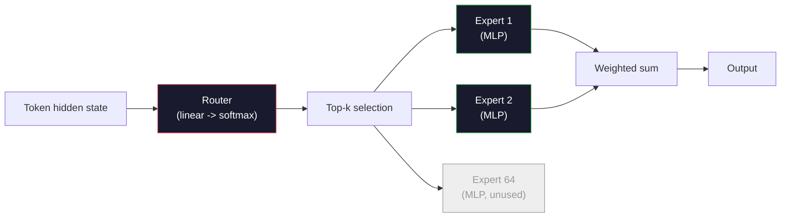

# Otwarte modele: instrukcje dotyczące architektury

> Zbudowałeś GPT-2 Small od zera w Lekcji 04. Modele Frontier Open z 2026 roku to ta sama rodzina z pięcioma lub sześcioma konkretnymi zmianami. RMSNorm zamiast LayerNorm. SwiGLU zamiast GELU. Lina zamiast wyuczonych pozycji. GQA lub MLA zamiast pełnego MHA. Mieszanka ekspertów na dużą skalę. Znana już matematyka obejmuje 95% z nich. W tej lekcji czytamy Lamę 3, DeepSeek-V3, Mixtral, Qwen i Gemmę obok siebie i wymieniamy dokładną linię, w której różnią się poszczególne architektury.

**Typ:** Ucz się
**Języki:** Python (stdlib)
**Wymagania wstępne:** Faza 10, lekcje 04, 05, 12 (trening wstępny, skalowanie, wnioskowanie)
**Czas:** ~45 minut

## Cele nauczania

- Przeczytaj plik config.json Llama 3, Mistral, Mixtral, Gemma 2, Qwen 2.5 i DeepSeek-V3 i wyjaśnij każde pole
- Nazwij konkretną zmianę architektoniczną dokonaną w każdym modelu w porównaniu z GPT-2 Small i uzasadnij ją na podstawie pierwszych zasad
- Oblicz liczbę parametrów, rozmiar pamięci podręcznej KV i pamięć aktywacyjną dla dowolnego otwartego modelu na podstawie samej jego konfiguracji
— Wybierz odpowiedni otwarty model dla docelowego wdrożenia, biorąc pod uwagę opóźnienia, pamięć i ograniczenia możliwości

## Problem

W lekcji 04 napisałeś 350 linii numpy i miałeś model w kształcie GPT-2. Lama 3 405B ma 200-stronicowy raport techniczny. Twój instynkt podpowiada, że ​​to różne zwierzęta. Nie są. Na 200 stronach opisano ten sam obiekt z pięcioma lub sześcioma dobrze umotywowanymi modyfikacjami oraz tysiącem szczegółów implementacji dotyczących skalowania. Szkielet – osadzenie, bloki transformatorowe, uwaga, MLP, norma, głowa – pozostaje niezmieniony.

Ta lekcja jest inna. Dla każdej głównej rodziny modeli otwartych podajemy dokładnie, co się zmieniło w stosunku do GPT-2, dlaczego i ile to kosztowało. Kiedy skończysz, możesz przeczytać nową kartę modelu i mentalnie przełożyć ją z powrotem na linię bazową GPT-2.

Praktyczna zapłata jest taka, że ​​gdy Meta wypuści Llamę 5 lub DeepSeek wypuści V4, nie będziesz potrzebować nowego modelu mentalnego. Przyjrzysz się konfiguracji, zobaczysz, które z dobrze znanych pokręteł się przesunęło i będziesz wiedział, jakie są dalsze implikacje. Architektury 2026 to ograniczony zestaw narzędzi. Każdy nowy model wybiera inny podzbiór.

## Koncepcja

### Niezmienny rdzeń

Wszystkie otwarte modele autoregresyjne mają wspólne:

- Macierz osadzania tokenów (vocab_size xHidden_dim).
- Stos N bloków dekodera: norma, samouwaga, resztka, norma, MLP, reszta.
- Norma końcowa i głowica liniowa wystająca do vocab_size (często obciążona osadzeniem).
- Maska przyczynowa, utrata entropii krzyżowej następnego tokena.

Taki jest kształt. Reszta to pokrętła.

### Sześć gałek, które faktycznie się poruszają

W każdym modelu Frontier Open na lata 2024–2026 stale wybieranych jest sześć tych samych opcji projektowych:

1. **Normalizacja.** LayerNorm ->RMSNorm.
2. **Kodowanie pozycyjne.** Nauczony absolut -> RoPE (plus warianty: YaRN, NTK).
3. **Aktywacja.** GELU -> SwiGLU (lub GeGLU).
4. **Uwaga, dzielenie się głowami.** MHA -> GQA -> MQA -> MLA.
5. **Gęsty vs rzadki MLP.** Gęsty -> Mieszanka ekspertów.
6. **Miejsce przed normą.** Pobyty przed normą. Post-norma zniknęła.

Wszystko inne (harmonogram szybkości uczenia się, miks danych, rozmiar partii, długość kontekstu) znajduje się w konfiguracji szkoleniowej, a nie w architekturze. Sześć pokręteł.

### Pokrętło 1:RMSNorm

LayerNorm odejmuje średnią, dzieli przez std, skale i przesunięcia. RMSNorm zachowuje jedynie skalę:

```
RMSNorm(x) = x / sqrt(mean(x^2) + eps) * gamma
```

Bez średniego odejmowania. Bez uprzedzeń. O jeden matmul mniej na token. Zhang i Sennrich (2019) argumentowali, że jest on zgodny z LayerNorm w tłumaczeniu maszynowym, a jednocześnie jest o 10% szybszy. Obsługuje go każdy nowoczesny model otwarty.

Koszt: brak. Korzyści: mała przepustowość, prostszy kod.

### Pokrętło 2: lina

Osadzenie wyuczonych pozycji było tabelą przeglądową o 1024 szczelinach w GPT-2. Kontekst 1025 nie znajduje się na końcu tabeli. Modele nie mogą ekstrapolować poza długość treningu.

Obrotowe osadzanie pozycji (RoPE, Su i in. 2021) polega na wstrzykiwaniu pozycji poprzez obracanie każdego wektora Q i K parami przed iloczynem kropki uwagi. Kąt obrotu jest deterministyczną funkcją położenia, więc nie można się niczego nauczyć ani niczego, z czego można by wywnioskować. Dzięki sztuczkom skalowania (interpolacja uwzględniająca NTK, YaRN) model wyszkolony w kontekście 8k może rozciągnąć się do 128k przy wnioskowaniu z niewielką utratą dokładności.

```
q_rotated = rotate(q, angle(pos))
k_rotated = rotate(k, angle(pos))
score = q_rotated . k_rotated
```

Każda Lama, Mistral, Qwen, DeepSeek i Gemma korzysta z RoPE. Gemma 2 wykorzystuje technologię hybrydową (RoPE na większości warstw, lokalne okno przesuwne na innych).

### Pokrętło 3: SwiGLU

MLP GPT-2 to `x -> gelu(xW1 + b1) -> (...)W2 + b2`. SwiGLU (Shazeer 2020) zastępuje aktywację produktem bramkowanym:

```
SwiGLU(x) = (xW1) * sigmoid(xW1) * xV
```

Dwie projekcje równoległe zamiast jednej, bramkowane aktywacją Swish. Empirycznie silniejszy pod względem złożoności na parametr. Lama 2 to przyjęła, wszyscy poszli. Ukryty rozmiar MLP jest zwykle ustawiany tak, aby całkowita liczba parametrów odpowiadała oryginalnemu gęstemu MLP: jeśli GPT-2 użył `ff_dim = 4 * hidden`, SwiGLU używa `ff_dim = (2/3) * 4 * hidden = 8/3 * hidden`.

### Pokrętło 4: dzielenie się uwagą

Zastosowano GPT-2 **Multi-Head Attention (MHA)**: każda głowica ma własną projekcję Q, K, V.

**Uwaga wielozadaniowa (MQA, Shazeer 2019)** dzieli jedno K i jedno V na wszystkie głowy. Zmniejsza pamięć podręczną KV o liczbę num_heads, co stanowi redukcję od 12 do 32 razy w przypadku typowego modelu. Dokładność nieznacznie spada w przypadku twardych testów porównawczych.

**Grouped-Query Attention (GQA, Ainslie i in. 2023)** to rozwiązanie pośrednie: grupy G głowic Q mają wspólne jedno K i jedno V. Lama 3 8B wykorzystuje GQA z 32 głowicami Q i 8 głowicami KV (G=8), więc pamięć podręczna KV zmniejsza się 4x w porównaniu z pełnym MHA.

**Ukryta uwaga wielogłowa (MLA, DeepSeek 2024)** kompresuje K i V do wspólnego utajonego niskiego poziomu, wyświetlając je z powrotem na głowę. Dalsze zmniejszenie pamięci podręcznej KV przy jednoczesnym zachowaniu ekspresji na głowicę. DeepSeek-V2 i V3 polegają na tym w celu zapewnienia wydajności w długim kontekście.

| Schemat | Głowice KV | Pamięć podręczna KV | Dokładność |
|--------|----------|----------|--------------|
| MHA | liczba_głow | pełny | najlepiej |
| GQA | num_groups (G < num_heads) | num_heads / Redukcja G | blisko MHA |
| MQA | 1 | redukcja num_heads | małe trafienie |
| MLA | ukryta dekompresja na głowę | mniejszy niż MQA | blisko MHA |

W przypadku każdego modelu o parametrach powyżej ~13B, GQA lub MLA są faktycznie obowiązkowe. Pełne MHA na dużą skalę to katastrofa pamięci podręcznej KV.

### Pokrętło 5: Mieszanka ekspertów

Gęsty MLP aktywuje wszystkie swoje parametry dla każdego tokena. W MoE MLP znajduje się K ekspertów na blok i router, który wybiera K najlepszych ekspertów na token (zwykle 2 najlepszych). Tylko wagi tych ekspertów widzą przepustkę do przodu dla tego tokena.

```
router_logits = xW_r
indices, weights = top_k(router_logits, k=2)
output = sum_i weights[i] * expert[indices[i]](x)
```

Atrakcja: możesz mieć 64 ekspertów o rozmiarze 7B każdy (więc całkowita liczba parametrów jest ogromna), jednocześnie uruchamiając tylko 2 z nich na token (więc obliczenia na token odpowiadają gęstemu modelowi 7B). Mixtral 8x7B ma łącznie 47B parametrów, ale aktywuje tylko 13B na token. DeepSeek-V3 ma łącznie 671B parametrów, ale aktywuje tylko 37B na token.



Plusy: te same obliczenia, więcej parametrów, lepsza pojemność. Wady: pamięć specjalistyczna wciąż musi gdzieś działać (więc obsługa wymaga więcej pamięci VRAM niż jej gęsty odpowiednik), równoważenie obciążenia routera jest trudne, a dostrajanie routera podczas wyrównywania jest jego własnym obszarem badawczym.

### Pokrętło 6: Rozwórki wstępne

Oryginalna norma dotycząca warstwy zastosowanej transformatorem po każdej podwarstwie. Każdy otwarty model od czasu GPT-2 umieszcza go *przed* każdą podwarstwą. Pre-norm jest zdecydowanie łatwiejszy do treningu na głębokości. Nie ma o czym dyskutować.

### Różnica między modelami

Oto tabela, która czyni to wszystko betonem.

| Modelka | Rok | Razem parametry | Aktywne parametry | Norma | Aktywacja | Pozycja | Uwaga | Ministerstwo Środowiska | Kontekst |
|-------|------|-------------|--------------|------|---------------|---------------|-----------|-----|---------|
| GPT-2 Mały | 2019 | 124M | 124M | Norma warstwy | ŻELU | Dowiedziałem się | MHA (12 głów) | nie | 1 tys. |
| Lama 3 8B | 2024 | 8B | 8B | Norma RMS | SwiGLU | LINA | GQA (32/8) | nie | 128 tys. |
| Lama 3 70B | 2024 | 70B | 70B | Norma RMS | SwiGLU | LINA | GQA (64/8) | nie | 128 tys. |
| Lama 3 405B | 2024 | 405B | 405B | Norma RMS | SwiGLU | LINA | GQA (128/16) | nie | 128 tys. |
| Mistral 7B | 2023 | 7.2B | 7.2B | Norma RMS | SwiGLU | LINA | GQA | nie | 32 tys. |
| Mieszany 8x7B | 2023 | 47B | 13B | Norma RMS | SwiGLU | LINA | GQA | tak (8 ekspertów, top-2) | 32 tys. |
| Gemma 2 9B | 2024 | 9B | 9B | RSSNorm (przed+po) | GeGLU | LINA + przesuwanie | GQA | nie | 8 tys. |
| Qwen 2.5 72B | 2024 | 72B | 72B | Norma RMS | SwiGLU | LINA (Przędza) | GQA (64/8) | nie | 128 tys. |
| DeepSeek V2 236B | 2024 | 236B | 21B | Norma RMS | SwiGLU | LINA | MLA | tak (160 ekspertów, top-6) | 128 tys. |
| DeepSeek V3 | 2024 | 671B | 37B | Norma RMS | SwiGLU | LINA | MLA | tak (256 ekspertów, 8 najlepszych) | 128 tys. |

Przeskanuj kolumny. RMSNorm jest uniwersalny. SwiGLU lub jego kuzyn GeGLU jest uniwersalny. Lina jest uniwersalna. GQA jest uniwersalna powyżej 7B, z wyjątkiem zastąpienia przez MLA. MoE jest wyróżnikiem na najwyższym poziomie.

### Czytanie pliku config.json

Konfiguracja Lamy 3 8B:

```
{
  "hidden_size": 4096,
  "intermediate_size": 14336,
  "num_hidden_layers": 32,
  "num_attention_heads": 32,
  "num_key_value_heads": 8,
  "max_position_embeddings": 131072,
  "rope_theta": 500000.0,
  "rms_norm_eps": 1e-5,
  "vocab_size": 128256
}
```

Każde pole odpowiada czemuś, co już zaimplementowałeś.

- `hidden_size`: wymiar osadzania.
- `intermediate_size`: ukryty rozmiar MLP (ukryty 3,5x — matematyka SwiGLU).
- `num_hidden_layers`: głębokość stosu.
- `num_attention_heads`: Głowy Q.
- `num_key_value_heads`: Głowice KV (GQA).
- `max_position_embeddings`: długość kontekstu szkoleniowego.
- `rope_theta`: Częstotliwość podstawowa RoPE. Meta przeskalowała go z domyślnych 10 tys. do 500 tys. w celu ekstrapolacji na długi kontekst.
- `rms_norm_eps`: stabilność numeryczna.
- `vocab_size`: tokeny.

Na tej podstawie obliczane są parametry całkowite, pamięć podręczna KV i szczytowa pamięć aktywacji. Dokładne formuły znajdziesz w `code/main.py`.

### Budżet pamięci aktywacji

Aktywacje dominują w pamięci treningowej powyżej kilku miliardów parametrów. Praktyczna zasada dotycząca treningu przedtreningowego (z punktami kontrolnymi gradientu):

```
activation_mem ~ batch_size * seq_len * hidden_size * num_layers * bytes_per_element
```

Dla Lamy 3 8B w partii 1, sekwencja 8192, BF16, 32 warstwy, ukryte 4096: około 8 GB tylko na aktywacje z punktem kontrolnym, 40 GB bez. Właśnie dlatego uwaga błyskawiczna i uwaga pierścieniowa mają znaczenie – przepisują obliczenia uwagi, tak aby pasowały aktywacje.

### Budżet pamięci podręcznej KV

Dla wnioskowania w maksymalnym kontekście:

```
kv_cache = 2 * num_layers * num_kv_heads * head_dim * max_seq_len * bytes_per_element
```

Lama 3 8B w kontekście 128k, BF16, head_dim = ukryte / num_heads = 128:
`2 * 32 * 8 * 128 * 131072 * 2 = 17.2 GB` na sekwencję.

Wagi 8B wynoszą 16 GB w BF16. Pamięć podręczna KV dla pojedynczej sekwencji 128 kB jest większa niż wagi. To właśnie obciążenie pamięci napędza badania nad kwantyzacją pamięci podręcznej GQA, MLA i KV.

### Gdy każdy model wygrywa

- **Pojedynczy procesor graficzny 80 GB, bez MoE**: Llama 3 8B, Mistral 7B, Gemma 2 9B. Łatwe w obsłudze, szerokie oprzyrządowanie.
- **Pojedynczy węzeł (8x80GB), duża pojemność**: Llama 3 70B, Qwen 2.5 72B. Najwyższa zdolność do gęstego otwarcia.
- **Największe otwarte możliwości, akceptują złożoność MoE**: DeepSeek V3, Mixtral 8x22B. Najlepsza wydajność na aktywny FLOP.
- **Wymagany długi kontekst**: Lama 3 (128k ze skalowaniem RoPE), DeepSeek (przewaga MLA).
- **Udostępnianie z niskim opóźnieniem**: Gemma 2 9B (przesuwane okno ogranicza obliczenia w długim kontekście).

## Zbuduj to

Kodem lekcji jest kalkulator. Biorąc pod uwagę dowolny plik config.json, wypisuje liczbę parametrów według komponentu, pamięć podręczną KV w maksymalnym kontekście, współczynnik SwiGLU MLP i krótki werdykt na temat architektury (dense / GQA / MLA / MoE).

```python
config = {
    "hidden_size": 4096, "intermediate_size": 14336,
    "num_hidden_layers": 32, "num_attention_heads": 32,
    "num_key_value_heads": 8, "vocab_size": 128256,
    "max_position_embeddings": 131072,
}
```

Skrypt przemierza architekturę pole po polu, oblicza liczbę parametrów dla osadzania, uwagi (z redukcją GQA), MLP (z rozszerzeniem SwiGLU), norm warstw i nagłówka. Następnie oblicza pamięć podręczną KV przy określonej długości kontekstu i drukuje podsumowanie.

Implementację znajdziesz w `code/main.py`.

## Użyj tego

Uruchom kalkulator w konfiguracjach Llama 3 8B, Mistral 7B, Mixtral 8x7B i DeepSeek V3 dołączonych do skryptu. Porównaj zestawienia parametrów. Należy zauważyć, że modele MoE mają całkowitą liczbę parametrów, która przewyższa modele gęste, ale liczba aktywnych parametrów jest często mniejsza. Zauważ, że pamięć podręczna KV DeepSeek V3 jest mniejsza niż pamięć podręczna Llama 3 405B, mimo że ma więcej całkowitych parametrów – to jest MLA w akcji.

Następnie podłącz konfigurację dowolnego modelu, który posiadasz lokalnie, przeczytaj podsumowanie i zdecyduj, czy pasuje ona do Twojego procesora graficznego.

## Wyślij to

Ta lekcja przedstawia `outputs/skill-open-model-picker.md`. Biorąc pod uwagę cel wdrożenia (typ procesora graficznego, pamięć VRAM, długość kontekstu, budżet opóźnień) i profil zadania (czat, kod, rozumowanie, długi kontekst), zaleca model otwarty, schemat kwantyzacji z lekcji 11 i stos wnioskowania z lekcji 12, z wyraźnym uzasadnieniem dotyczącym sześciu gałek architektonicznych.

## Ćwiczenia

1. Przeczytaj konfigurację Qwen 2.5 72B z HuggingFace. Oblicz parametry całkowite od podstaw. Porównaj z wartością podaną przez HF i określ, skąd pochodzi delta (zaokrąglenie przyciemnienia głowicy, współczynnik podziału KV itp.).

2. DeepSeek V3 korzysta z 256 ekspertów z 8 najlepszymi routingami. Oblicz stosunek aktywowanych ekspertów do wszystkich ekspertów i porównaj z najlepszymi 2 z 8 Mixtrala 8x7B. Co oznacza przejście z rzadkiego (25%) do gęstszego rzadkiego (3%) w odniesieniu do pojemności na FLOP?

3. Oblicz pamięć podręczną KV dla Lamy 3 405B w kontekście 128k w FP8 i BF16. W 8PR jest to połowa liczby BF16. Ile równoległych sekwencji można obsłużyć w pojedynczym węźle 8xH100 (80 GB każdy = łącznie 640 GB, minus waga pamięci)?

4. Gemma 2 łączy w sobie warstwy pełnej uwagi i przesuwającego się okna. Zapisz obliczenia dla pamięci podręcznej KV, gdy połowa warstw używa przesuwanego okna z 4096 tokenami zamiast pełnego kontekstu. Ile pamięci oszczędza to przy całkowitym kontekście 8 tys.?

5. Znajdź najnowszy model otwartej granicy, który został wydany po napisaniu tej lekcji. Określ, które z sześciu pokręteł wybrał i czy wprowadziło siódme pokrętło. Program nauczania będzie wydawał się nieaktualny w momencie pojawienia się nowej architektury — celem jest aktualizacja tabeli bez przebudowy modelu mentalnego.

## Kluczowe terminy

| Termin | Co ludzie mówią | Co to właściwie oznacza |
|------|----------------|----------------------|
| Norma RMS | „LayerNorm bez średniej” | Normalizuj tylko metodą średnią kwadratową, z wyuczoną skalą — tańszą i porównywalną z LayerNorm |
| LINA | „Pozycje obrotowe” | Obróć każdy wektor Q i K w parach 2D o kąt zależny od pozycji — ekstrapoluje poza długość treningu za pomocą sztuczek skalowania |
| SwiGLU | „Nowa aktywacja MLP” | Bramkowana jednostka liniowa z Swish: `(xW1) * sigmoid(xW1) * xV` — standard w każdym modelu otwartym 2024+ |
| GQA | „Uwaga środka” | Zapytanie grupowe Uwaga: grupy G głowic Q korzystają z jednej głowicy K i jednej głowicy V — zmniejsza pamięć podręczną KV bez trafienia w dokładność MQA |
| MLA | „Uwaga DeepSeeka” | Uwaga dotycząca wielu głowic: kompresja K/V do współdzielonej wartości ukrytej niskiego rangi, dekompresja na głowicę — najmniejsza pamięć podręczna KV dla dużych modeli |
| Ministerstwo Środowiska | „Nieliczni eksperci” | Mieszanka ekspertów: N MLP na blok, router wybiera top-k na token — ogromne łączne parametry, małe aktywne parametry |
| Routing górny-k | „Wybierz k ekspertów na token” | Router oblicza wynik dla każdego eksperta i aktywuje k najwyższe — typowe k wynosi od 2 (Mixtral) do 8 (DeepSeek) |
| Przędza | „Lina rozciągnięta” | Jeszcze jedno rozszerzenie RoPE — interpoluje kąty obrotowe w celu rozszerzenia kontekstu z 8 tys. do 128 tys. + w czasie wnioskowania |
| Uwaga przesuwanego okna | „Nie zajmuj się wszystkim” | Każdy token dotyczy tylko ostatnich tokenów W — ogranicza koszt uwagi do O(W) na token, używany w Gemma 2 i wczesnym Mistralu |
| Aktywne parametry | „Co działa na token” | W przypadku modeli MoE liczba parametrów, która uwzględnia przejście w przód na token (znacznie mniejsza niż całkowita liczba parametrów) — reguluje liczbę FLOPów na token |

## Dalsze czytanie

– [Dubey et al., 2024 – „The Llama 3 Herd of Models”](https://arxiv.org/abs/2407.21783) – architektoniczne i szkoleniowe odniesienie dla gęstej rodziny Lamy 3
– [DeepSeek-AI, 2024 – „Raport techniczny DeepSeek-V3”](https://arxiv.org/abs/2412.19437) – MLA plus pomocnicze równoważenie obciążenia bez strat plus 671B MoE
– [Jiang i in., 2024 – „Mixtral of Experts”](https://arxiv.org/abs/2401.04088) – kanoniczny dokument otwartego modelu Ministerstwa Sprawiedliwości
– [Su i in., 2021 – „RoFormer: ulepszony transformator z osadzaniem w pozycji obrotowej”](https://arxiv.org/abs/2104.09864) – artykuł dotyczący RoPE
– [Shazeer, 2020 – „Warianty GLU ulepszają transformator”](https://arxiv.org/abs/2002.05202) – SwiGLU, GeGLU i przyjaciele
– [Ainslie i in., 2023 – „GQA: Training Generalized Multi-Query Transformer Models”](https://arxiv.org/abs/2305.13245) – artykuł GQA
– [Zespół Gemma 2, 2024 – „Gemma 2: ulepszanie modeli języka otwartego w praktycznym rozmiarze”](https://arxiv.org/abs/2408.00118) – hybryda pełna+przesuwająca uwaga, przed+post-normą
– [Zespół Qwen, 2024 – „Raport techniczny Qwen 2.5”](https://arxiv.org/abs/2412.15115) – Rozszerzenie kontekstu YaRN i przepisy na szkolenia w długim kontekście