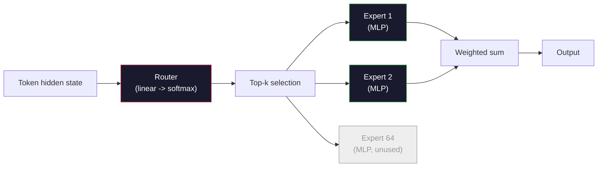

# Otwarte modele: przegląd architektury

> W lekcji 04 zbudowałeś GPT-2 Small od zera. Czołowe otwarte modele z 2026 roku należą do tej samej rodziny — różnią się pięcioma lub sześcioma konkretnymi zmianami. RMSNorm zamiast LayerNorm. SwiGLU zamiast GELU. RoPE zamiast wyuczonych pozycji. GQA lub MLA zamiast pełnego MHA. Mieszanka ekspertów w dużej skali. Znana matematyka obejmuje 95% całości. W tej lekcji czytamy konfiguracje Llamy 3, DeepSeek-V3, Mixtrala, Qwen i Gemmy obok siebie i wskazujemy dokładne miejsce, w którym poszczególne architektury się rozchodzą.

**Typ:** Nauka
**Języki:** Python (stdlib)
**Wymagania wstępne:** Faza 10, lekcje 04, 05, 12 (trening wstępny, skalowanie, wnioskowanie)
**Czas:** ~45 minut

## Cele nauczania

- Przeczytaj plik config.json dla Llama 3, Mistral, Mixtral, Gemma 2, Qwen 2.5 i DeepSeek-V3 i wyjaśnij każde pole
- Wskaż konkretną zmianę architektoniczną wprowadzoną w każdym modelu względem GPT-2 Small i uzasadnij ją z pierwszych zasad
- Oblicz liczbę parametrów, rozmiar pamięci podręcznej KV i zużycie pamięci aktywacyjnej dla dowolnego otwartego modelu na podstawie samej jego konfiguracji
- Wybierz odpowiedni otwarty model do docelowego wdrożenia, uwzględniając opóźnienie, pamięć i wymagania dotyczące możliwości

## Problem

W lekcji 04 napisałeś 350 linii kodu w numpy i otrzymałeś model o kształcie GPT-2. Llama 3 405B ma dwustustronicowy raport techniczny. Intuicja podpowiada, że to zupełnie inne twory. Nie są. Na dwustu stronach opisano ten sam obiekt z pięcioma lub sześcioma dobrze umotywowanymi modyfikacjami oraz tysiącem szczegółów implementacyjnych dotyczących skalowania. Szkielet — osadzanie, bloki transformatorowe, mechanizm uwagi, MLP, normalizacja, głowica — pozostaje niezmieniony.

Ta lekcja jest inna. Dla każdej głównej rodziny otwartych modeli podajemy dokładnie to, co zmieniło się względem GPT-2, dlaczego tak się stało i ile to kosztuje. Po jej ukończeniu będziesz potrafił przeczytać nową kartę modelu i przełożyć ją z powrotem na bazowy GPT-2.

Praktyczny wniosek jest taki, że gdy Meta wyda Llamę 5 lub DeepSeek wyda V4, nie będziesz potrzebował nowego modelu mentalnego. Spojrzysz na konfigurację, zobaczysz, które ze znanych parametrów się zmieniły, i natychmiast zrozumiesz dalsze implikacje. Architektury z 2026 roku to ograniczony zestaw narzędzi. Każdy nowy model wybiera inny ich podzbiór.

## Koncepcja

### Niezmienny rdzeń

Wszystkie autoregresyjne otwarte modele mają wspólne:

- Macierz osadzania tokenów (vocab_size x hidden_dim).
- Stos N bloków dekodera: normalizacja, samouwaga, połączenie resztkowe, normalizacja, MLP, połączenie resztkowe.
- Końcową normalizację i głowicę liniową odwzorowaną na vocab_size (często powiązaną z macierzą osadzania).
- Maskę przyczynową i funkcję straty entropii krzyżowej następnego tokena.

To jest szkielet. Reszta to parametry.

### Sześć parametrów, które rzeczywiście się zmieniają

We wszystkich czołowych otwartych modelach z lat 2024–2026 stale pojawia się ten sam zestaw sześciu decyzji projektowych:

1. **Normalizacja.** LayerNorm -> RMSNorm.
2. **Kodowanie pozycyjne.** Wyuczone bezwzględne -> RoPE (oraz warianty: YaRN, NTK).
3. **Aktywacja.** GELU -> SwiGLU (lub GeGLU).
4. **Mechanizm uwagi.** MHA -> GQA -> MQA -> MLA.
5. **Gęsty vs. rzadki MLP.** Gęsty -> Mieszanka ekspertów.
6. **Umiejscowienie normalizacji.** Pre-norm. Post-norm zniknął.

Wszystko pozostałe — harmonogram tempa uczenia, mieszanka danych, rozmiar wsadu, długość kontekstu — należy do konfiguracji treningu, nie do architektury. Sześć parametrów.

### Parametr 1: RMSNorm

LayerNorm odejmuje średnią, dzieli przez odchylenie standardowe, a następnie skaluje i przesuwa. RMSNorm zachowuje jedynie skalowanie:

```
RMSNorm(x) = x / sqrt(mean(x^2) + eps) * gamma
```

Bez odejmowania średniej. Bez biasów. O jedno mnożenie macierzowe mniej na token. Zhang i Sennrich (2019) wykazali, że RMSNorm dorównuje LayerNorm w tłumaczeniu maszynowym, będąc przy tym około 10% szybszym. Stosuje go każdy nowoczesny otwarty model.

Koszt: żaden. Korzyści: nieznaczna poprawa przepustowości, prostszy kod.

### Parametr 2: RoPE

Wyuczone osadzanie pozycyjne w GPT-2 było tablicą przeglądową z 1024 slotami. Pozycja 1025 wykracza poza tabelę — modele nie potrafią ekstrapolować poza długość sekwencji treningowej.

Rotacyjne osadzanie pozycyjne (RoPE, Su i in. 2021) wstrzykuje informację o pozycji przez obrót każdej pary elementów wektorów Q i K przed obliczeniem iloczynu skalarnego uwagi. Kąt obrotu jest deterministyczną funkcją pozycji, więc niczego nie trzeba się uczyć ani niczego wnioskować. Dzięki technikom skalowania (interpolacja z uwzględnieniem NTK, YaRN) model wytrenowany na kontekście 8k można rozciągnąć do 128k podczas wnioskowania przy niewielkiej utracie dokładności.

```
q_rotated = rotate(q, angle(pos))
k_rotated = rotate(k, angle(pos))
score = q_rotated . k_rotated
```

Każda Llama, Mistral, Qwen, DeepSeek i Gemma korzysta z RoPE. Gemma 2 stosuje podejście hybrydowe — RoPE w większości warstw, lokalne przesuwane okno w pozostałych.

### Parametr 3: SwiGLU

MLP w GPT-2 to `x -> gelu(xW1 + b1) -> (...)W2 + b2`. SwiGLU (Shazeer 2020) zastępuje aktywację wynikiem bramkowania:

```
SwiGLU(x) = (xW1) * sigmoid(xW1) * xV
```

Dwie równoległe projekcje zamiast jednej, bramkowane przez aktywację Swish. Empirycznie skuteczniejsze pod względem złożoności na parametr. Llama 2 jako pierwsza to przyjęła i pozostałe modele poszły w jej ślady. Ukryty rozmiar MLP jest zazwyczaj dobrany tak, aby całkowita liczba parametrów odpowiadała oryginalnemu gęstemu MLP: jeśli GPT-2 używał `ff_dim = 4 * hidden`, SwiGLU stosuje `ff_dim = (2/3) * 4 * hidden = 8/3 * hidden`.

### Parametr 4: współdzielenie uwagi

GPT-2 używał **Multi-Head Attention (MHA)**: każda głowica miała własne projekcje Q, K i V.

**Multi-Query Attention (MQA, Shazeer 2019)** współdzieli jedną projekcję K i jedną V między wszystkie głowice. Zmniejsza pamięć podręczną KV o czynnik num_heads — typowo od 12 do 32 razy. Dokładność nieznacznie spada na trudnych testach porównawczych.

**Grouped-Query Attention (GQA, Ainslie i in. 2023)** to rozwiązanie pośrednie: grupy G głowic Q współdzielą jedno K i jedno V. Llama 3 8B stosuje GQA z 32 głowicami Q i 8 głowicami KV (G=8), co daje czterokrotną redukcję pamięci podręcznej KV względem pełnego MHA.

**Multi-head Latent Attention (MLA, DeepSeek 2024)** kompresuje K i V do wspólnej reprezentacji utajonej niskiej rangi, dekompresując je z powrotem na każdą głowicę. Pozwala na dalszą redukcję pamięci podręcznej KV przy zachowaniu ekspresywności na głowicę. DeepSeek-V2 i V3 opierają się na niej w celu efektywnej obsługi długich kontekstów.

| Schemat | Głowice KV | Pamięć podręczna KV | Dokładność |
|--------|----------|----------|--------------|
| MHA | num_heads | pełna | najlepsza |
| GQA | num_groups (G < num_heads) | redukcja num_heads / G | bliska MHA |
| MQA | 1 | redukcja num_heads | niewielki spadek |
| MLA | ukryta dekompresja na głowicę | mniejsza niż MQA | bliska MHA |

W przypadku modeli powyżej ~13B parametrów GQA lub MLA są praktycznie obowiązkowe. Pełne MHA w tej skali prowadzi do katastrofalnego wzrostu pamięci podręcznej KV.

### Parametr 5: Mieszanka ekspertów

Gęsty MLP aktywuje wszystkie swoje parametry dla każdego tokena. W MoE każdy blok zawiera K ekspertów i router, który wybiera k najlepszych ekspertów na token (zazwyczaj 2 najlepszych). Tylko wagi wybranych ekspertów uczestniczą w przetwarzaniu danego tokena.

```
router_logits = xW_r
indices, weights = top_k(router_logits, k=2)
output = sum_i weights[i] * expert[indices[i]](x)
```

Zaleta: można mieć 64 ekspertów o rozmiarze 7B każdy (łączna liczba parametrów jest ogromna), aktywując jednocześnie tylko 2 z nich na token (obliczenia na token odpowiadają gęstemu modelowi 7B). Mixtral 8x7B ma łącznie 47B parametrów, lecz aktywuje tylko 13B na token. DeepSeek-V3 ma łącznie 671B parametrów, lecz aktywuje jedynie 37B na token.



Zalety: te same obliczenia, więcej parametrów, większa pojemność. Wady: wagi ekspertów muszą gdzieś rezydować (obsługa wymaga więcej pamięci VRAM niż gęsty odpowiednik), balansowanie obciążenia routera jest trudne, a strojenie routera podczas wyrównywania to odrębny obszar badań.

### Parametr 6: Pre-norm

Oryginalny transformator stosował normalizację warstwy po każdej podwarstwie. Każdy otwarty model od czasów GPT-2 umieszcza ją *przed* każdą podwarstwą. Pre-norm znacznie ułatwia trening głębokich modeli. Nie ma tu nic do dyskutowania.

### Różnice między modelami

Poniższa tabela czyni to wszystko konkretnym.

| Model | Rok | Parametry łącznie | Parametry aktywne | Norma | Aktywacja | Pozycja | Uwaga | MoE | Kontekst |
|-------|------|-------------|--------------|------|---------------|---------------|-----------|-----|---------|
| GPT-2 Small | 2019 | 124M | 124M | LayerNorm | GELU | wyuczone | MHA (12 głowic) | nie | 1k |
| Llama 3 8B | 2024 | 8B | 8B | RMSNorm | SwiGLU | RoPE | GQA (32/8) | nie | 128k |
| Llama 3 70B | 2024 | 70B | 70B | RMSNorm | SwiGLU | RoPE | GQA (64/8) | nie | 128k |
| Llama 3 405B | 2024 | 405B | 405B | RMSNorm | SwiGLU | RoPE | GQA (128/16) | nie | 128k |
| Mistral 7B | 2023 | 7.2B | 7.2B | RMSNorm | SwiGLU | RoPE | GQA | nie | 32k |
| Mixtral 8x7B | 2023 | 47B | 13B | RMSNorm | SwiGLU | RoPE | GQA | tak (8 ekspertów, top-2) | 32k |
| Gemma 2 9B | 2024 | 9B | 9B | RMSNorm (przed+po) | GeGLU | RoPE + przesuwane okno | GQA | nie | 8k |
| Qwen 2.5 72B | 2024 | 72B | 72B | RMSNorm | SwiGLU | RoPE (YaRN) | GQA (64/8) | nie | 128k |
| DeepSeek V2 236B | 2024 | 236B | 21B | RMSNorm | SwiGLU | RoPE | MLA | tak (160 ekspertów, top-6) | 128k |
| DeepSeek V3 | 2024 | 671B | 37B | RMSNorm | SwiGLU | RoPE | MLA | tak (256 ekspertów, top-8) | 128k |

Przejrzyj kolumny. RMSNorm jest powszechny. SwiGLU lub jego kuzyn GeGLU jest powszechny. RoPE jest powszechne. GQA dominuje powyżej 7B, gdzie nie zostało zastąpione przez MLA. MoE to wyróżnik na najwyższym poziomie skali.

### Czytanie pliku config.json

Konfiguracja Llama 3 8B:

```
{
  "hidden_size": 4096,
  "intermediate_size": 14336,
  "num_hidden_layers": 32,
  "num_attention_heads": 32,
  "num_key_value_heads": 8,
  "max_position_embeddings": 131072,
  "rope_theta": 500000.0,
  "rms_norm_eps": 1e-5,
  "vocab_size": 128256
}
```

Każde pole odpowiada czemuś, co już zaimplementowałeś.

- `hidden_size`: wymiar osadzania.
- `intermediate_size`: ukryty rozmiar MLP (3,5x hidden — matematyka SwiGLU).
- `num_hidden_layers`: głębokość stosu.
- `num_attention_heads`: głowice Q.
- `num_key_value_heads`: głowice KV (GQA).
- `max_position_embeddings`: długość kontekstu treningowego.
- `rope_theta`: częstotliwość bazowa RoPE. Meta przeskalowała ją z domyślnych 10k do 500k dla ekstrapolacji na długi kontekst.
- `rms_norm_eps`: stabilność numeryczna.
- `vocab_size`: liczba tokenów.

Na tej podstawie oblicza się całkowitą liczbę parametrów, rozmiar pamięci podręcznej KV i szczytowe zużycie pamięci aktywacyjnej. Dokładne wzory znajdziesz w `code/main.py`.

### Budżet pamięci aktywacyjnej

Aktywacje dominują w zużyciu pamięci podczas treningu przy rozmiarach powyżej kilku miliardów parametrów. Praktyczna zasada dla pretreningu (z checkpointingiem gradientu):

```
activation_mem ~ batch_size * seq_len * hidden_size * num_layers * bytes_per_element
```

Dla Llama 3 8B przy rozmiarze wsadu 1, sekwencji 8192, BF16, 32 warstwach i hidden_size 4096: około 8 GB tylko na aktywacje z checkpointingiem, 40 GB bez. Właśnie dlatego Flash Attention i Ring Attention mają znaczenie — przepisują obliczenia mechanizmu uwagi tak, by aktywacje mieściły się w pamięci.

### Budżet pamięci podręcznej KV

Dla wnioskowania przy maksymalnej długości kontekstu:

```
kv_cache = 2 * num_layers * num_kv_heads * head_dim * max_seq_len * bytes_per_element
```

Llama 3 8B przy kontekście 128k, BF16, head_dim = hidden_size / num_heads = 128:
`2 * 32 * 8 * 128 * 131072 * 2 = 17.2 GB` na sekwencję.

Wagi modelu 8B zajmują 16 GB w BF16. Pamięć podręczna KV dla pojedynczej sekwencji 128k jest większa niż same wagi. To właśnie to obciążenie napędza badania nad GQA, MLA i kwantyzacją pamięci podręcznej KV.

### Kiedy który model wygrywa

- **Pojedynczy GPU 80 GB, bez MoE**: Llama 3 8B, Mistral 7B, Gemma 2 9B. Proste w obsłudze, szerokie wsparcie narzędziowe.
- **Pojedynczy węzeł (8x80GB), duża pojemność**: Llama 3 70B, Qwen 2.5 72B. Najwyższa zdolność wśród gęstych modeli otwartych.
- **Największe otwarte możliwości, przy akceptacji złożoności MoE**: DeepSeek V3, Mixtral 8x22B. Najlepsza wydajność na aktywny FLOP.
- **Wymagany długi kontekst**: Llama 3 (128k ze skalowaniem RoPE), DeepSeek (przewaga MLA).
- **Serwowanie z niskim opóźnieniem**: Gemma 2 9B (przesuwane okno ogranicza koszt obliczeniowy dla długich kontekstów).

## Zbuduj to

Kodem do tej lekcji jest kalkulator. Dla dowolnego pliku config.json wypisuje liczbę parametrów według komponentu, rozmiar pamięci podręcznej KV dla maksymalnego kontekstu, współczynnik rozszerzenia MLP dla SwiGLU oraz krótki werdykt na temat architektury (dense / GQA / MLA / MoE).

```python
config = {
    "hidden_size": 4096, "intermediate_size": 14336,
    "num_hidden_layers": 32, "num_attention_heads": 32,
    "num_key_value_heads": 8, "vocab_size": 128256,
    "max_position_embeddings": 131072,
}
```

Skrypt przechodzi przez architekturę pole po polu i oblicza liczbę parametrów dla osadzania, mechanizmu uwagi (z uwzględnieniem redukcji GQA), MLP (z rozszerzeniem SwiGLU), normalizacji warstw i głowicy. Następnie oblicza pamięć podręczną KV dla zadanej długości kontekstu i drukuje podsumowanie.

Implementację znajdziesz w `code/main.py`.

## Użyj tego

Uruchom kalkulator dla konfiguracji Llama 3 8B, Mistral 7B, Mixtral 8x7B i DeepSeek V3 dołączonych do skryptu. Porównaj zestawienia parametrów. Zauważ, że modele MoE mają łączną liczbę parametrów przewyższającą gęste odpowiedniki, lecz liczba aktywnych parametrów jest często mniejsza. Zwróć też uwagę, że pamięć podręczna KV DeepSeek V3 jest mniejsza niż w przypadku Llama 3 405B, mimo że model ma więcej parametrów łącznie — to właśnie MLA w działaniu.

Następnie podłącz konfigurację dowolnego modelu, który masz lokalnie, przejrzyj podsumowanie i oceń, czy zmieści się na Twoim GPU.

## Wyślij to

Ta lekcja tworzy `outputs/skill-open-model-picker.md`. Dla danego celu wdrożenia (typ GPU, pamięć VRAM, długość kontekstu, budżet opóźnienia) i profilu zadania (czat, kod, rozumowanie, długi kontekst) dokument rekomenduje otwarty model, schemat kwantyzacji z lekcji 11 i stos wnioskowania z lekcji 12, wraz z jasnym uzasadnieniem odwołującym się do sześciu parametrów architektonicznych.

## Ćwiczenia

1. Pobierz konfigurację Qwen 2.5 72B z HuggingFace. Oblicz całkowitą liczbę parametrów od podstaw. Porównaj wynik z wartością podaną przez HF i wyjaśnij, skąd pochodzi różnica (zaokrąglenia wymiarów głowicy, współczynnik podziału KV itp.).

2. DeepSeek V3 używa 256 ekspertów z routingiem top-8. Oblicz stosunek aktywowanych ekspertów do wszystkich ekspertów i porównaj go z wartością top-2 z 8 dla Mixtrala 8x7B. Co oznacza przejście od rzadkości 25% do rzadkości 3% pod względem pojemności na FLOP?

3. Oblicz pamięć podręczną KV dla Llama 3 405B przy kontekście 128k w FP8 i BF16. W FP8 jest to połowa wartości BF16. Ile równoległych sekwencji można obsłużyć na pojedynczym węźle 8xH100 (80 GB każdy, łącznie 640 GB, minus pamięć na wagi)?

4. Gemma 2 łączy warstwy pełnej uwagi z warstwami przesuwanego okna. Zapisz wzór na pamięć podręczną KV, gdy połowa warstw używa przesuwanego okna o szerokości 4096 tokenów zamiast pełnego kontekstu. Ile pamięci oszczędza to przy całkowitym kontekście 8k?

5. Znajdź najnowszy model z otwartej granicy wydany po powstaniu tej lekcji. Określ, które z sześciu parametrów wybrał i czy wprowadził siódmy. Program nauczania będzie wydawał się nieaktualny wraz z pojawieniem się nowych architektur — celem jest aktualizacja tabeli bez przebudowy modelu mentalnego.

## Kluczowe terminy

| Termin | Co się mówi | Co to naprawdę oznacza |
|------|----------------|----------------------|
| RMSNorm | „LayerNorm bez średniej" | Normalizacja wyłącznie przez średnią kwadratową z wyuczoną skalą — tańsza i porównywalna z LayerNorm |
| RoPE | „Rotacyjne pozycje" | Obrót każdego wektora Q i K w parach 2D o kąt zależny od pozycji — ekstrapoluje poza długość treningową dzięki technikom skalowania |
| SwiGLU | „Nowa aktywacja MLP" | Bramkowana jednostka liniowa ze Swish: `(xW1) * sigmoid(xW1) * xV` — standard w każdym otwartym modelu od 2024 roku |
| GQA | „Uwaga pośrednia" | Grouped-Query Attention: grupy G głowic Q współdzielą jedną głowicę K i V — zmniejsza pamięć podręczną KV bez strat dokładności charakterystycznych dla MQA |
| MLA | „Uwaga DeepSeeka" | Multi-head Latent Attention: kompresja K/V do wspólnej reprezentacji ukrytej niskiej rangi, dekompresja na głowicę — najmniejsza pamięć podręczna KV dla dużych modeli |
| MoE | „Rzadcy eksperci" | Mieszanka ekspertów: N bloków MLP na warstwę, router wybiera top-k na token — ogromna całkowita liczba parametrów, mała liczba aktywnych |
| Routing top-k | „Wybierz k ekspertów na token" | Router oblicza wynik dla każdego eksperta i aktywuje k najwyżej ocenionych — typowe k wynosi od 2 (Mixtral) do 8 (DeepSeek) |
| YaRN | „Rozciągnięte RoPE" | Rozszerzenie RoPE — interpoluje kąty obrotu, aby rozszerzyć kontekst z 8k do 128k i więcej podczas wnioskowania |
| Uwaga przesuwanego okna | „Nie patrz na wszystko" | Każdy token uwzględnia jedynie ostatnie W tokenów — ogranicza koszt uwagi do O(W) na token, stosowane w Gemma 2 i wczesnym Mistralu |
| Aktywne parametry | „Co działa na token" | W modelach MoE: liczba parametrów uczestniczących w przejściu w przód dla danego tokena (znacznie mniejsza niż całkowita) — wyznacza liczbę FLOPów na token |

## Dalsze czytanie

– [Dubey et al., 2024 – „The Llama 3 Herd of Models"](https://arxiv.org/abs/2407.21783) – architektoniczne i treningowe omówienie gęstej rodziny Llama 3
– [DeepSeek-AI, 2024 – „Raport techniczny DeepSeek-V3"](https://arxiv.org/abs/2412.19437) – MLA, pomocnicze równoważenie obciążenia bez strat i 671B MoE
– [Jiang i in., 2024 – „Mixtral of Experts"](https://arxiv.org/abs/2401.04088) – kanoniczny artykuł o otwartym modelu MoE
– [Su i in., 2021 – „RoFormer: ulepszony transformator z rotacyjnym osadzaniem pozycyjnym"](https://arxiv.org/abs/2104.09864) – artykuł źródłowy RoPE
– [Shazeer, 2020 – „Warianty GLU ulepszają transformator"](https://arxiv.org/abs/2002.05202) – SwiGLU, GeGLU i pokrewne
– [Ainslie i in., 2023 – „GQA: Training Generalized Multi-Query Transformer Models"](https://arxiv.org/abs/2305.13245) – artykuł źródłowy GQA
– [Zespół Gemma 2, 2024 – „Gemma 2: ulepszanie otwartych modeli językowych w praktycznych rozmiarach"](https://arxiv.org/abs/2408.00118) – hybryda uwagi pełnej i przesuwanej, pre-norm i post-norm
– [Zespół Qwen, 2024 – „Raport techniczny Qwen 2.5"](https://arxiv.org/abs/2412.15115) – rozszerzenie kontekstu przez YaRN i przepisy treningowe dla długich kontekstów
